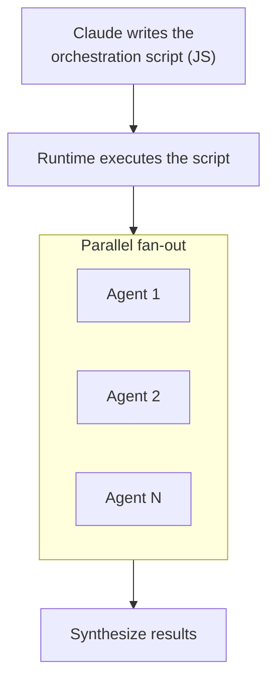

## Introduction

In [Part 3](/en/blog/claude-code-advanced-guide-3) we covered sub-agents and agent teams -- "delegation that returns a result" and "a team that collaborates by debating," the two multi-agent styles.

This final Part 4 covers the <strong>third paradigm and cloud automation</strong> that emerged afterward:

- Part 1 — [Memory + Skills + Hooks](/en/blog/claude-code-advanced-guide-1)
- Part 2 — [Plugins + MCP + IDE integration](/en/blog/claude-code-advanced-guide-2)
- Part 3 — [Sub-agents + Agent Teams](/en/blog/claude-code-advanced-guide-3)
- <strong>Part 4 — Workflows + Ultrareview + Remote Agents (this post)</strong>

- <strong>Workflows (ultracode)</strong>: Claude writes its own orchestration script to deterministically coordinate dozens-to-hundreds of agents
- <strong>Ultrareview</strong>: a cloud multi-agent fleet reviews code and independently verifies findings
- <strong>Remote/scheduled agents (Routines)</strong>: run via cron or GitHub events even with your laptop closed
- <strong>Fast Mode and models</strong>: pick speed, cost, and capability for the situation

> <strong>Note</strong>: Many features here are research preview or consume paid credits as of June 2026. Availability and billing vary by plan and version, so confirm with `/help` and the official docs in your environment.

---

## TL;DR

- <strong>Workflows write "orchestration as code."</strong> Claude writes a JavaScript coordination script that the runtime executes, running dozens-to-hundreds of agents deterministically (loops, conditionals, fan-out). Suited to codebase-wide sweeps and large migrations.
- <strong>The three paradigms have different purposes.</strong> Delegation (sub-agents), collaboration (teams), deterministic coordination (workflows). The larger and more structured the task, the more workflows win.
- <strong>Ultrareview has agents verify the code.</strong> A cloud multi-agent fleet reviews and independently reproduces each finding to confirm it. 5-10 minutes, background, no local resources.
- <strong>Remote agents run with your laptop closed.</strong> They run in the cloud via schedule (cron), API, or GitHub events. Backlog grooming, PR auto-review, deploy verification -- unattended.
- <strong>Speed and cost are choices.</strong> Fast Mode speeds up responses; model aliases tune capability and cost.

---

## 1. Workflows — Claude Codes Its Own Orchestration

Sub-agents delegate to one; agent teams have several debate. <strong>Workflows</strong> take a different approach. Claude writes a <strong>JavaScript orchestration script</strong> itself, and the runtime executes it, coordinating dozens-to-hundreds of agents. The key is that the coordination logic (loops, conditionals, fan-out, pipelines) lives <strong>in code</strong> rather than in the model's improvisation.

### 1.1 The Third Paradigm



Comparing the three multi-agent styles:

| Style | Coordinator | Best for | Trait |
|---|---|---|---|
| <strong>Sub-agent</strong> | Main Claude delegates ad hoc | Focused work where you only need a result | Lightest |
| <strong>Agent team</strong> | Teammates self-coordinate | Work needing discussion/debate | Flexible but costly |
| <strong>Workflow</strong> | A pre-written script | Large, repetitive, well-structured work | Deterministic, reproducible |

Where workflows shine: codebase-wide bug sweeps, migrating hundreds of files, multi-dimension reviews -- anything that "repeats the same procedure over many targets."

### 1.2 ultracode — Workflows by Default

`ultracode` is a mode that makes Claude lean into workflows. Turn it on two ways:

- <strong>Keyword</strong>: include `ultracode` in your prompt and Claude plans/runs a workflow for that task.
- <strong>Persistent mode</strong>: set `/effort ultracode` and Claude considers a workflow first for every substantive request.

```text
ultracode find every deprecated API call across this monorepo and replace it with the new API
```

It spends more tokens but aims for a broad, thorough result in a single run. It's overkill for small tasks, so keep it off normally.

### 1.3 Monitoring and Reuse

- <strong>`/workflows`</strong>: watch a running workflow's progress (agent tree, per-stage status) in real time.
- <strong>Save</strong>: save a completed workflow as a custom command to reuse.
- <strong>Bundled workflows</strong>: `/deep-research` (fan-out search across sources → cross-verify → cited report) is a flagship built-in workflow.

> <strong>Note</strong>: Workflows are powerful but token-heavy. First ask "does this really need dozens of parallel agents?" For a single-file edit or a simple question, the main conversation is faster and cheaper.

---

## 2. Ultrareview — Cloud Multi-agent Code Review

The `/code-review` from Part 1 reviews the current diff locally. <strong>Ultrareview</strong> extends it to the cloud. A multi-agent fleet reviews code in a cloud sandbox and <strong>independently reproduces and verifies each finding</strong>, reporting only the trustworthy ones.

```bash
# Review the current branch with a cloud multi-agent fleet
/code-review ultra

# Review a GitHub PR
/code-review ultra 142
```

Highlights:

- <strong>Independent verification</strong>: rather than "looks like a bug," it reproduces each finding to confirm it's real. Fewer false positives.
- <strong>Background, cloud</strong>: takes 5-10 minutes and uses no local resources. Do other work meanwhile.
- <strong>CI integration</strong>: the `claude ultrareview` subcommand runs non-interactively.

> <strong>Billing & limits</strong>: Pro/Max subscribers get some free runs, after which each review consumes paid credits. It's unsupported on some hosting like Bedrock/Vertex. It's a user-triggered paid feature, so Claude won't run it on its own.

This ties naturally back to Part 3's theme. It completes the multi-agent verification loop: <strong>an agent fleet verifies the code that agents wrote</strong>.

---

## 3. Routines — Scheduled and Remote Agents

Everything so far required you at the terminal. <strong>Routines</strong> break that assumption. Save a Claude Code session configuration, and when a trigger fires it <strong>runs automatically on cloud infrastructure</strong> -- even with your laptop closed.

Trigger types:

| Trigger | Behavior | Use for |
|---|---|---|
| <strong>Schedule (cron)</strong> | Run at a set time/interval | Morning backlog grooming, nightly dependency updates |
| <strong>API (HTTP POST)</strong> | An external system calls it | Trigger from internal tools/pipelines |
| <strong>GitHub event</strong> | React to PR open, etc. | PR auto-review, issue triage |

Create a routine interactively with `/schedule`:

```text
/schedule every weekday at 9am, review open PRs and post a summary comment
```

> <strong>Note</strong>: Routines run on the Claude Code on the web infrastructure ([Part 2](/en/blog/claude-code-advanced-guide-2), §3.3). Supported on Pro/Max/Team/Enterprise plans. Since it's unattended automation, set the permission scope and target repos carefully.

---

## 4. Models and Speed — Fast Mode, the Model Lineup

### 4.1 Fast Mode

<strong>Fast Mode</strong> makes Claude Opus respond up to several times faster. Toggle it with `/fast`.

- Supported only on Opus (4.8/4.7/4.6); not Sonnet or Haiku
- Trades higher cost for lower latency
- Not supported in the VS Code extension
- Most cost-effective when enabled at session start

### 4.2 Model Lineup

Pick the model to fit the task. Specify by alias and it resolves to the latest version for your environment.

| Alias | Resolves to (June 2026) | Trait |
|---|---|---|
| `opus` | Opus 4.8 | Top capability; supports highest effort (`xhigh`) and Fast Mode |
| `sonnet` | Sonnet 4.6 | The balanced default for everyday coding |
| `haiku` | Haiku 4.5 | Fast and cheap; simple tasks, sub-agent routing |
| `opus[1m]` / `sonnet[1m]` | That model + 1M-token context | Very large codebases (Max/Team/Enterprise) |
| `opusplan` | Opus for planning, Sonnet for execution | Hybrid auto-switch |

> <strong>Summary</strong>: Haiku for exploration/cleanup, Sonnet for everyday work, Opus for hard design/refactoring. Route per task via a sub-agent's `model:` field (Part 3, §1.4) to optimize cost.

---

## Wrapping Up the Series

Across four parts, we covered Claude Code's advanced features in full:

| Part | Topic | Core |
|---|---|---|
| <strong>Part 1</strong> | Memory + Skills + Hooks | Claude remembers you and automates repetitive work |
| <strong>Part 2</strong> | Plugins + MCP + IDE | Connect external tools; use it in the editor and web |
| <strong>Part 3</strong> | Sub-agents + Agent Teams | Delegate work, and collaborate by debating |
| <strong>Part 4</strong> | Workflows + Ultrareview + Remote Agents | Deterministic coordination and cloud automation |

The key is distinguishing the three textures of multi-agent work -- <strong>delegation</strong> (sub-agents), <strong>collaboration</strong> (agent teams), and <strong>deterministic coordination</strong> (workflows). Add cloud verification (Ultrareview) and unattended execution (Routines), and Claude Code moves beyond "a tool I command" toward <strong>a system that works on its own</strong>.

You don't need all of it at once. Start with memory and skills, and add workflows and remote agents one at a time as they fit your flow.

---

## Appendix

### A. Glossary

| Term | Description |
|---|---|
| Workflow | A feature where Claude's JS script deterministically coordinates many agents |
| ultracode | A keyword/mode that makes Claude lean into workflows |
| Ultrareview | Cloud multi-agent code review with independent verification (`/code-review ultra`) |
| Routines | Remote agents that run in the cloud via schedule/API/GitHub events |
| Fast Mode | A setting that speeds up Opus responses (`/fast`) |
| opusplan | A model alias: Opus for planning, Sonnet for execution |

### B. Command cheat sheet

```bash
# Workflows
ultracode <request>     # Use a workflow for this task
/effort ultracode       # Prefer workflows for all substantive requests (persistent)
/workflows              # Monitor running workflows
/deep-research <topic>  # Bundled research workflow

# Cloud review
/code-review ultra      # Multi-agent review of the current branch
/code-review ultra <PR#> # Review a GitHub PR
claude ultrareview      # Non-interactive run for CI

# Remote & speed
/schedule               # Create a scheduled/remote agent (Routine)
/fast                   # Toggle Fast Mode (Opus only)
```

### C. References

- [Claude Code Docs — Workflows](https://docs.claude.com/en/docs/claude-code/workflows)
- [Claude Code Docs — Ultrareview](https://docs.claude.com/en/docs/claude-code/ultrareview)
- [Claude Code Docs — Routines](https://docs.claude.com/en/docs/claude-code/routines)
- [Claude Code Docs — Fast Mode](https://docs.claude.com/en/docs/claude-code/fast-mode)
- [Claude Code Docs — Model Configuration](https://docs.claude.com/en/docs/claude-code/model-config)
