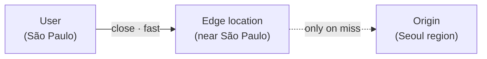
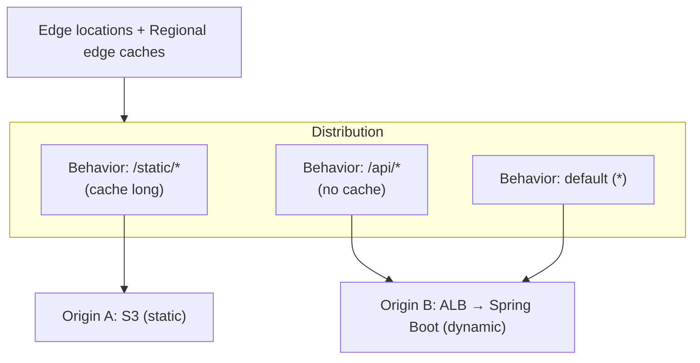
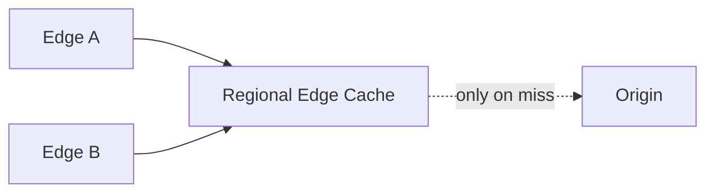
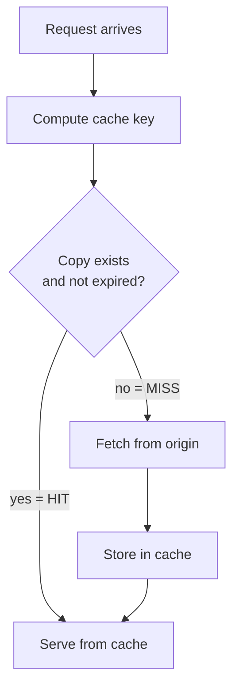

## Introduction

A service that runs fine on a single API server suddenly slows down as users spread worldwide. A Seoul-region server is fast for Tokyo users but far from São Paulo. On top of that, the origin serving the same images, JS, CSS, and static responses on every request piles up load.

A <strong>CDN (Content Delivery Network)</strong> solves both at once. It caches copies close to users and serves those copies instead of the origin. AWS's CDN is <strong>CloudFront</strong>.

This series covers CloudFront from concepts to hands-on. The hands-on uses an example that <strong>puts a Spring Boot + Kotlin origin behind CloudFront</strong>, reproducible with Terraform.

- <strong>Part 1 — How a CDN and CloudFront work (this post)</strong>
- Part 2 — [Putting a Spring Boot + Kotlin origin behind CloudFront (Terraform)](/en/blog/cloudfront-cdn-guide-2)
- Part 3 — [Private content, edge logic, security, monitoring](/en/blog/cloudfront-cdn-guide-3)
- Part 4 — [Image resizing and video transcoding](/en/blog/cloudfront-cdn-guide-4)

This post covers the concepts you must understand before the Part 2 hands-on. If you don't know why a cache hits or misses, you'll hit "why isn't it caching?" and "why does the old response keep showing?" in the lab.

---

## TL;DR

- <strong>A CDN keeps copies near users.</strong> Instead of the origin server, an edge server close to the user serves a cached copy. Latency drops and origin load falls.
- <strong>CloudFront works per distribution.</strong> One distribution points at origins, and per-path behaviors decide "what to cache and what to send to the origin."
- <strong>Cache is found by key, expires by lifetime.</strong> A request becomes a cache key to look up a copy (hit). If absent, it fetches from the origin (miss). Lifetime comes from the origin's `Cache-Control` header.
- <strong>Cache static, pass through dynamic.</strong> Cache images/JS/CSS for a long time; don't cache per-user API responses — send them to the origin. Split rules by path.
- <strong>To update, prefer versioning over invalidation.</strong> Two ways to swap cached copies: invalidation and filename versioning. For static assets, versioning is cheaper and safer.

---

## 1. Why a CDN

Serving worldwide traffic from a single origin server causes two problems.

| Problem | Description |
|------|------|
| <strong>Latency</strong> | Physically distant users have long round trips. Seoul server ↔ São Paulo user is hundreds of ms |
| <strong>Origin load</strong> | Serving the same static file from the origin on every request wastes bandwidth and CPU |

A CDN caches copies at <strong>edge locations</strong> scattered worldwide. User requests route to the nearest edge; if a copy exists there, it responds immediately without reaching the origin.



The key is the dashed "only on miss" line. When most static requests end at the edge, the origin goes idle and users get faster.

---

## 2. CloudFront Building Blocks

Configuring CloudFront means distinguishing four concepts.



| Component | Role |
|------|------|
| <strong>Distribution</strong> | The top-level unit of CloudFront config. Has one domain (`d123.cloudfront.net` or a custom domain) |
| <strong>Origin</strong> | The source server: an S3 bucket, an ALB, or any HTTP server |
| <strong>Behavior</strong> | A rule, per path pattern (`/static/*`, `/api/*`), deciding which origin to use, whether to cache, and which headers/cookies to forward |
| <strong>Edge location</strong> | A cache server (PoP) near users. The first-tier cache |

### 2.1 Edge Locations and Regional Edge Caches

CloudFront's cache is two-tier. On a miss at the nearest <strong>edge location</strong>, it doesn't go straight to the origin — it checks a larger <strong>Regional Edge Cache</strong> first. Many edges share the same regional cache, so a copy fetched by one edge is reused by others, cutting origin load further.



---

## 3. How Caching Works

### 3.1 Request Flow — hit and miss

A request reaching the edge is turned into a <strong>cache key</strong> to look up a copy.



The `X-Cache` response header shows the result — `Hit from cloudfront` or `Miss from cloudfront`. Part 2 verifies cache behavior with this header.

### 3.2 Cache Key — What Counts as the Same Request

CloudFront treats requests with the same cache key as "the same request" and serves the same copy. The default key is just the <strong>path</strong>, but a cache policy can add:

| Key component | Including it means |
|------|------|
| Path | Always included (`/img/logo.png`) |
| Query string | A separate copy per `?v=2`. Used for versioning |
| Headers | e.g. `Accept-Encoding` (compression variants), `Accept-Language` (per language) |
| Cookies | For responses that vary per user. But hit ratio plummets — be careful |

> <strong>Key point</strong>: The more variables in the cache key, the more the copies fragment and the lower the <strong>hit ratio</strong>. Include only "what genuinely makes the response differ." Putting all cookies in the key, for instance, gives every user a different copy and effectively disables the cache.

### 3.3 TTL and Cache-Control — How Long to Keep

How long to keep a copy is set by <strong>TTL (Time To Live)</strong>. TTL is mainly determined by the `Cache-Control` response header from the origin.

> <strong>Note — Cache-Control is a two-way header</strong>: `Cache-Control` can appear on both requests and responses, but what decides "how long to cache" (the lifetime) is the <strong>response (server/origin)</strong>. A request-side `Cache-Control` (e.g. a browser hard-refresh's `no-cache`) is just a signal like "fetch fresh this time." So CDN cache lifetime is decided in Part 2 by attaching headers to the origin (Spring Boot) response.

```text
Cache-Control: public, max-age=31536000, immutable   # cache 1 year (static assets)
Cache-Control: no-store                              # never cache (private API)
Cache-Control: no-cache                              # revalidate with origin each time
```

A CloudFront behavior has <strong>Min/Default/Max TTL</strong> settings that interact with the origin header.

| Setting | Meaning |
|------|------|
| Min TTL | Minimum lifetime. Kept at least this long even if the origin says shorter |
| Max TTL | Maximum lifetime. Capped at this even if the origin says longer |
| Default TTL | Applied when the origin sends no `Cache-Control` |

> <strong>Caution</strong>: 90% of "why does the old response keep showing?" is the origin sending a long `max-age`, or a long Min TTL on the behavior. For dynamic responses, the origin must clearly send `no-store`/`no-cache` (set with Kotlin in Part 2).

---

## 4. Invalidation vs Versioning

Two ways to swap a deployed copy.

| Method | How | Pros/cons |
|------|------|------|
| <strong>Invalidation</strong> | Specify a path like `/static/app.js` to remove it from edge caches | Immediate, but with many paths it costs and lags. Billed beyond the monthly free tier |
| <strong>Versioning</strong> | Put a version in the filename/query and deploy a new URL (`app.abc123.js`, `app.js?v=2`) | The new URL naturally misses and fetches a fresh copy. No invalidation needed, easy rollback |

> <strong>Bottom line</strong>: Versioning is standard for static assets. Hash the filename at build time (`app.[hash].js`) and cache long with `Cache-Control: immutable, max-age=1 year`. When content changes, the hash changes, the URL changes, and the new version applies instantly without invalidation. Reserve invalidation for the few files whose URL can't change, like HTML.

---

## 5. What to Cache and What Not To

The core CDN design decision is splitting cache policy by path.

| Content | Example path | Policy |
|------|------|------|
| Static assets | `/static/*`, `/assets/*` | Cache long + versioning (`max-age=1 year, immutable`) |
| Public, identical responses | `/`, `/about` (same HTML for everyone) | Cache briefly (`max-age=minutes`) |
| Per-user dynamic | `/api/*`, `/me` | Don't cache (`no-store`), pass to origin |

In CloudFront this split is implemented as <strong>per-path-pattern behaviors</strong>. `/api/*` is a behavior with caching off that forwards all headers/cookies to the origin; `/static/*` is a behavior that caches long and ignores cookies. Part 2 builds this behavior split with a Spring Boot origin, in Terraform.

---

## Recap

| Concept | One-liner |
|------|----------|
| <strong>CDN</strong> | Caches copies at edges near users to cut latency and origin load |
| <strong>Distribution</strong> | The top-level CloudFront unit, one domain |
| <strong>Origin</strong> | The source server (S3, ALB, HTTP server) |
| <strong>Behavior</strong> | Per-path-pattern cache/forwarding rules |
| <strong>Cache key</strong> | What counts as the "same request" — fewer inputs, higher hit ratio |
| <strong>Cache-Control / TTL</strong> | Copy lifetime. Dynamic must say `no-store` |
| <strong>Versioning</strong> | The standard for updating static assets, before invalidation |

[Part 2](/en/blog/cloudfront-cdn-guide-2) applies these concepts for real. We bring up a Spring Boot + Kotlin app as the origin, set `Cache-Control`/ETag in Kotlin, split CloudFront behaviors into `/api/*` (no cache) and `/static/*` (cached) with Terraform, and verify hit/miss directly via the `X-Cache` header.

---

## Appendix

### A. Glossary

| Term | Description |
|------|------|
| CDN | Content Delivery Network. Caches and serves copies near users |
| Origin | The server holding the original content (S3/ALB/HTTP) |
| Edge location | A cache server (PoP) near users. CloudFront's first-tier cache |
| Regional Edge Cache | A larger second-tier cache between edges and the origin |
| Distribution | A CloudFront deployment unit (one domain) |
| Behavior | Per-path-pattern cache/routing rule |
| Cache key | The key identifying a request to find a copy (path/query/header/cookie combo) |
| TTL | Copy lifetime (Time To Live) |
| hit / miss | Copy present in cache / absent so fetched from origin |
| hit ratio | Share of requests served from cache |
| Invalidation | Removing a copy of a specific path from edge caches |

### B. References

- [Amazon CloudFront Developer Guide](https://docs.aws.amazon.com/AmazonCloudFront/latest/DeveloperGuide/Introduction.html)
- [CloudFront cache and origin request policies](https://docs.aws.amazon.com/AmazonCloudFront/latest/DeveloperGuide/controlling-the-cache-key.html)
- [MDN — HTTP Cache-Control](https://developer.mozilla.org/en-US/docs/Web/HTTP/Headers/Cache-Control)
