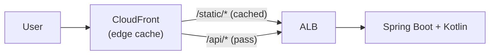

## Introduction

[Part 1](/en/blog/cloudfront-cdn-guide-1) covered how a CDN and CloudFront work (cache key, `Cache-Control`, TTL, hit/miss, invalidation vs versioning). Part 2 turns those concepts into actual code.

The goal is to <strong>put a Spring Boot + Kotlin app as the origin and CloudFront in front of it</strong>. Two things matter.

1. <strong>Make the origin send the right `Cache-Control`</strong> (Kotlin) — long for static, no caching for dynamic.
2. <strong>Make CloudFront behave differently per path</strong> (Terraform) — cache `/static/*`, pass through `/api/*`.

- Part 1 — [How a CDN and CloudFront work](/en/blog/cloudfront-cdn-guide-1)
- <strong>Part 2 — Putting a Spring Boot + Kotlin origin behind CloudFront (this post)</strong>
- Part 3 — [Private content, edge logic, security, monitoring](/en/blog/cloudfront-cdn-guide-3)
- Part 4 — [Image resizing and video transcoding](/en/blog/cloudfront-cdn-guide-4)

---

## TL;DR

- <strong>The origin states cache intent via headers.</strong> In Kotlin, static resources get `Cache-Control: max-age=1 year, immutable`; dynamic APIs get `no-store`. CloudFront follows these headers.
- <strong>Split behaviors by path.</strong> `/static/*` uses a caching policy (CachingOptimized); `/api/*` and the default use a no-cache policy (CachingDisabled).
- <strong>An origin request policy decides what to forward.</strong> Dynamic paths must forward cookies/headers/query to the origin, so use AllViewerExceptHostHeader; static forwards the minimum.
- <strong>Reproduce it in Terraform.</strong> Declare one origin (ALB) and per-path rules with `ordered_cache_behavior` in `aws_cloudfront_distribution`.
- <strong>Verify with X-Cache.</strong> With `curl -I`, static shows `Hit` on the second request; dynamic always shows `Miss`.

---

## 1. Architecture

The setup is simple: User → CloudFront → ALB → Spring Boot app. The app serves both static resources (`/static/*`) and dynamic APIs (`/api/*`).



> <strong>Note</strong>: Keeping static assets separately in S3 (two origins) is also common. Here we start with the simplest form — "one app serves both static and dynamic." The S3 + OAC setup is covered with security in Part 3.

---

## 2. Spring Boot + Kotlin Origin — Sending the Right Cache-Control

CloudFront isn't clever. It simply <strong>follows the `Cache-Control` header the origin sends</strong>. So half of caching is decided in app code.

### 2.1 Static resources — long, immutable

Set `Cache-Control` on the static path via `WebMvcConfigurer`. Assuming hash-versioned assets (`app.abc123.js`), give them `immutable` + 1 year (the versioning strategy from Part 1, §4).

```kotlin
import org.springframework.context.annotation.Configuration
import org.springframework.http.CacheControl
import org.springframework.web.servlet.config.annotation.ResourceHandlerRegistry
import org.springframework.web.servlet.config.annotation.WebMvcConfigurer
import java.util.concurrent.TimeUnit

@Configuration
class WebConfig : WebMvcConfigurer {
    override fun addResourceHandlers(registry: ResourceHandlerRegistry) {
        registry.addResourceHandler("/static/**")
            .addResourceLocations("classpath:/static/")
            .setCacheControl(
                CacheControl.maxAge(365, TimeUnit.DAYS)
                    .cachePublic()
                    .immutable(),
            )
    }
}
```

The response header becomes:

```text
Cache-Control: max-age=31536000, public, immutable
```

### 2.2 Dynamic APIs — explicitly forbid caching

Responses that vary per user <strong>must send `no-store`</strong>. Without it, CloudFront may cache them according to the behavior's Default TTL.

```kotlin
import org.springframework.http.CacheControl
import org.springframework.http.ResponseEntity
import org.springframework.web.bind.annotation.GetMapping
import org.springframework.web.bind.annotation.RestController

@RestController
class ApiController(private val userService: UserService) {

    // Per-user response → never cache
    @GetMapping("/api/me")
    fun me(): ResponseEntity<UserDto> =
        ResponseEntity.ok()
            .cacheControl(CacheControl.noStore())
            .body(userService.currentUser())

    // Public data, same for everyone, rarely changes → allow short cache
    @GetMapping("/api/products")
    fun products(): ResponseEntity<List<ProductDto>> =
        ResponseEntity.ok()
            .cacheControl(CacheControl.maxAge(60, TimeUnit.SECONDS).cachePublic())
            .body(userService.products())
}
```

> <strong>Key point</strong>: Not everything under `/api/*` needs to be uncached. A public list that's "the same for everyone and fine to be slightly stale" can be cached for `max-age=60s`, cutting origin load a lot. Only the "per-user" ones get `no-store`.

### 2.3 ETag to save bandwidth (optional)

Enabling `ShallowEtagHeaderFilter` adds an `ETag` (a hash of the response body). When a client/CDN revalidates with `If-None-Match` and the content is unchanged, you get a body-less `304 Not Modified`, saving bandwidth.

```kotlin
import org.springframework.boot.web.servlet.FilterRegistrationBean
import org.springframework.context.annotation.Bean
import org.springframework.context.annotation.Configuration
import org.springframework.web.filter.ShallowEtagHeaderFilter

@Configuration
class EtagConfig {
    @Bean
    fun shallowEtagFilter(): FilterRegistrationBean<ShallowEtagHeaderFilter> =
        FilterRegistrationBean(ShallowEtagHeaderFilter()).apply {
            addUrlPatterns("/api/*")
        }
}
```

> <strong>Caution</strong>: `ETag` (revalidation) and `no-store` (forbid storing at all) serve different purposes. An ETag is meaningless on a `no-store` response. ETags fit `no-cache`/short-`max-age` responses where you "cache but want to confirm it changed."

---

## 3. Designing CloudFront Behaviors

Now pick policies so CloudFront behaves differently per path. Using AWS's <strong>managed policies</strong> means you don't build your own.

| Path | Cache policy | Origin request policy | Intent |
|------|------|------|------|
| `/static/*` | `CachingOptimized` | (not needed) | Cache long, ignore cookies, compress |
| `/api/*` | `CachingDisabled` | `AllViewerExceptHostHeader` | No cache, forward cookies/headers/query |
| default (`*`) | `CachingDisabled` | `AllViewerExceptHostHeader` | Safe default (pass through) |

- <strong>CachingOptimized</strong>: drops cookies from the cache key and only looks at `Accept-Encoding` → high hit ratio. For static assets.
- <strong>CachingDisabled</strong>: doesn't cache. For dynamic paths.
- <strong>AllViewerExceptHostHeader</strong>: forwards all viewer headers/cookies/query to the origin except `Host`. A custom origin like an ALB routes by its own host, so you must not forward the viewer Host — hence this policy.

> <strong>Why drop Host</strong>: If CloudFront forwards the viewer's `Host` (e.g., `cdn.example.com`) to the ALB, the ALB's host-based routing or backend virtual hosts can break. `AllViewerExceptHostHeader` leaves Host as the origin domain and forwards everything else.

---

## 4. Building It in Terraform

Assuming the ALB, app, and network already exist (see the earlier Terraform guide), focus on the CloudFront distribution.

### 4.1 Look up managed policies

```hcl
data "aws_cloudfront_cache_policy" "optimized" {
  name = "Managed-CachingOptimized"
}

data "aws_cloudfront_cache_policy" "disabled" {
  name = "Managed-CachingDisabled"
}

data "aws_cloudfront_origin_request_policy" "all_viewer_except_host" {
  name = "Managed-AllViewerExceptHostHeader"
}
```

### 4.2 The distribution

```hcl
resource "aws_cloudfront_distribution" "app" {
  enabled = true
  comment = "spring-boot-kotlin-origin"

  origin {
    domain_name = aws_lb.app.dns_name   # ALB DNS name
    origin_id   = "alb-origin"

    custom_origin_config {
      http_port              = 80
      https_port             = 443
      origin_protocol_policy = "https-only"   # CloudFront ↔ ALB also over HTTPS
      origin_ssl_protocols   = ["TLSv1.2"]
    }
  }

  # Default: pass through without caching (safest default)
  default_cache_behavior {
    target_origin_id         = "alb-origin"
    viewer_protocol_policy   = "redirect-to-https"
    allowed_methods          = ["GET", "HEAD", "OPTIONS", "PUT", "POST", "PATCH", "DELETE"]
    cached_methods           = ["GET", "HEAD"]
    cache_policy_id          = data.aws_cloudfront_cache_policy.disabled.id
    origin_request_policy_id = data.aws_cloudfront_origin_request_policy.all_viewer_except_host.id
  }

  # /static/* : cache long + compress
  ordered_cache_behavior {
    path_pattern           = "/static/*"
    target_origin_id       = "alb-origin"
    viewer_protocol_policy = "redirect-to-https"
    allowed_methods        = ["GET", "HEAD"]
    cached_methods         = ["GET", "HEAD"]
    cache_policy_id        = data.aws_cloudfront_cache_policy.optimized.id
    compress               = true
  }

  # /api/* : no cache + forward viewer request
  ordered_cache_behavior {
    path_pattern             = "/api/*"
    target_origin_id         = "alb-origin"
    viewer_protocol_policy   = "redirect-to-https"
    allowed_methods          = ["GET", "HEAD", "OPTIONS", "PUT", "POST", "PATCH", "DELETE"]
    cached_methods           = ["GET", "HEAD"]
    cache_policy_id          = data.aws_cloudfront_cache_policy.disabled.id
    origin_request_policy_id = data.aws_cloudfront_origin_request_policy.all_viewer_except_host.id
  }

  restrictions {
    geo_restriction {
      restriction_type = "none"
    }
  }

  viewer_certificate {
    cloudfront_default_certificate = true   # custom domain / ACM in Part 3
  }
}

output "cdn_domain" {
  value = aws_cloudfront_distribution.app.domain_name
}
```

After `terraform apply`, hitting `cdn_domain` (e.g. `d123abc.cloudfront.net`) reaches the app through CloudFront. Propagation usually takes a few minutes.

---

## 5. Verify — hit/miss via X-Cache

Looking only at response headers with `curl -I` reveals cache behavior.

### Static assets — Hit from the second request

```bash
$ curl -sI https://d123abc.cloudfront.net/static/app.abc123.js | grep -iE 'x-cache|cache-control|age'
cache-control: max-age=31536000, public, immutable
x-cache: Miss from cloudfront          # first request: no copy at edge → origin

$ curl -sI https://d123abc.cloudfront.net/static/app.abc123.js | grep -iE 'x-cache|age'
x-cache: Hit from cloudfront           # second: uses the edge copy
age: 12                                # seconds the copy has been cached
```

### Dynamic API — always Miss

```bash
$ curl -sI https://d123abc.cloudfront.net/api/me | grep -iE 'x-cache|cache-control'
cache-control: no-store
x-cache: Miss from cloudfront          # no-store → origin every time
```

> <strong>Reading it</strong>: Static flips to `Hit` on the second request with rising `Age` → caching works. Dynamic stays `Miss` forever (`no-store` = always origin) → as intended. If `/api/me` shows `Hit`, either the origin didn't send `no-store` or the behavior policy matched wrong.

---

## 6. Invalidation

If you updated a file whose URL can't change, like HTML, invalidate it (Part 1, §4). Hash-versioned static assets need no invalidation.

```bash
# Invalidate only index.html (wildcards allowed too: "/*")
aws cloudfront create-invalidation \
  --distribution-id E123ABCDEF456 \
  --paths "/index.html"
```

You can trigger it from Terraform too, but invalidation is a one-off at deploy time, so it's usually called via the CLI in a CI pipeline.

> <strong>Cost note</strong>: Invalidation is free up to 1,000 paths/month, then billed per path. Even `"/*"` counts as one path, but broad invalidation hurts hit ratio. That's why versioning, not invalidation, is the standard for static assets.

---

## Recap

| Step | What we did |
|------|------|
| <strong>Origin (Kotlin)</strong> | `max-age=1 year immutable` for static, `no-store` for dynamic |
| <strong>Behavior design</strong> | `/static/*`=CachingOptimized; `/api/*` & default=CachingDisabled + AllViewerExceptHostHeader |
| <strong>Terraform</strong> | Declared an ALB origin + ordered_cache_behavior in `aws_cloudfront_distribution` |
| <strong>Verify</strong> | Confirmed static=Hit, dynamic=Miss via `X-Cache` |
| <strong>Update</strong> | Versioning for hash assets, invalidation for HTML |

Half of caching is the origin header, half is the CloudFront behavior. When they disagree (origin says cache but the behavior is off, or vice versa), caching won't work as intended.

[Part 3](/en/blog/cloudfront-cdn-guide-3) covers operations and advanced topics: protect private content with <strong>Signed URLs/cookies</strong>, run logic at the edge with <strong>CloudFront Functions and Lambda@Edge</strong>, harden security with <strong>a custom domain (ACM), S3 OAC, and WAF</strong>, and monitor operations with <strong>cache hit ratio, CloudWatch, and logs</strong>.

---

## Appendix

### A. CacheControl builder cheat sheet (Spring)

| Purpose | Kotlin |
|------|------|
| 1-year immutable static | `CacheControl.maxAge(365, DAYS).cachePublic().immutable()` |
| Short public cache | `CacheControl.maxAge(60, SECONDS).cachePublic()` |
| Forbid cache (private) | `CacheControl.noStore()` |
| Revalidate each time | `CacheControl.noCache()` |

### B. Troubleshooting

| Symptom | Common cause |
|------|------|
| Dynamic API gets cached | Origin didn't send `no-store` → behavior Default TTL applied |
| Static keeps missing | Cookies included in cache key (wrong policy) → use CachingOptimized |
| Old HTML keeps showing | Long `max-age` + no invalidation → invalidate or use short TTL |
| ALB 503 / routing broken | Viewer Host forwarded → use AllViewerExceptHostHeader |

### C. References

- [aws_cloudfront_distribution (Terraform Registry)](https://registry.terraform.io/providers/hashicorp/aws/latest/docs/resources/cloudfront_distribution)
- [CloudFront managed cache policies](https://docs.aws.amazon.com/AmazonCloudFront/latest/DeveloperGuide/using-managed-cache-policies.html)
- [Spring Framework — CacheControl](https://docs.spring.io/spring-framework/reference/web/webmvc/mvc-caching.html)
