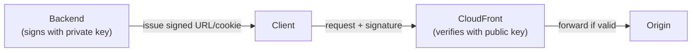
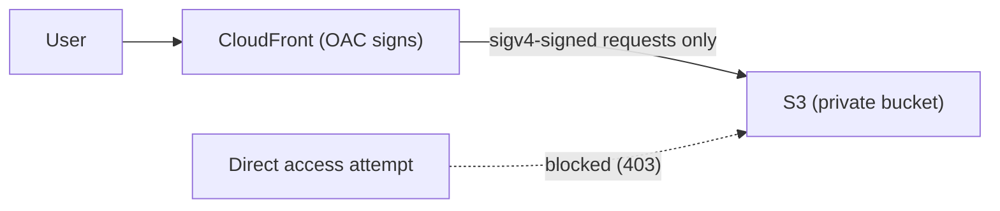

## Introduction

[Part 1](/en/blog/cloudfront-cdn-guide-1) covered concepts, and [Part 2](/en/blog/cloudfront-cdn-guide-2) put a Spring Boot + Kotlin origin behind CloudFront. With the basics working, Part 3 covers four things you need in real operations.

- Part 1 — [How a CDN and CloudFront work](/en/blog/cloudfront-cdn-guide-1)
- Part 2 — [Putting a Spring Boot + Kotlin origin behind CloudFront](/en/blog/cloudfront-cdn-guide-2)
- <strong>Part 3 — Private content, edge logic, security, monitoring (this post)</strong>

Topics: <strong>① private content (Signed URLs/cookies), ② edge logic (Functions vs Lambda@Edge), ③ security (custom domain, OAC, WAF), ④ monitoring & cost.</strong>

---

## TL;DR

- <strong>Protect private content with signatures.</strong> A signed URL (single file) or signed cookies (multiple files) let only authorized users access content for a limited time.
- <strong>Run lightweight logic at the edge.</strong> Simple header tweaks/redirects use ultra-light CloudFront Functions; network calls or complex logic use Lambda@Edge.
- <strong>The dividing line is weight.</strong> Functions run sub-1ms, viewer stage only, very cheap; Lambda@Edge is heavier with 4 triggers and can make network calls.
- <strong>Security is three layers.</strong> A TLS certificate for a custom domain (HTTPS), S3 locked behind Origin Access Control (OAC), and a web firewall (WAF) plus geo-restriction to filter traffic.
- <strong>Operate by hit ratio.</strong> Watch cache hit ratio, error rate, and bytes transferred; reduce cost with price class, compression, and hit ratio.

---

## 1. Private Content — Signed URLs and Signed Cookies

A default CloudFront distribution is accessible by anyone who knows the URL. To let only <strong>authorized users</strong> access paid videos or member-only files, you need signing.

| Method | Best for | Trait |
|------|------|------|
| <strong>Signed URL</strong> | A single file (a specific video/download link) | The URL embeds the signature and expiry. URL gets long |
| <strong>Signed Cookie</strong> | Multiple files / a whole path (a member-only section) | Grants access via a cookie, URL unchanged. Good for many assets |

How it works: your backend (a trusted server) signs a policy (expiry, allowed paths) with a private key, and CloudFront verifies it with the registered public key. Content is served only if the signature is valid and unexpired.



Register the public key and key group in Terraform, and attach to the behavior.

```hcl
resource "aws_cloudfront_public_key" "app" {
  name        = "app-public-key"
  encoded_key = file("public_key.pem")   # RSA public key (PEM)
}

resource "aws_cloudfront_key_group" "app" {
  name  = "app-key-group"
  items = [aws_cloudfront_public_key.app.id]
}

# Add to the protected behavior:
#   trusted_key_groups = [aws_cloudfront_key_group.app.id]
```

A behavior with `trusted_key_groups` returns `403` without a valid signature. The backend generates signatures with the private key (e.g., the AWS SDK's CloudFront signer).

---

## 2. Edge Logic — CloudFront Functions vs Lambda@Edge

You can intercept requests/responses at the edge to run logic. There are two tools, split by <strong>"weight."</strong>

| Criterion | CloudFront Functions | Lambda@Edge |
|------|------|------|
| Language | JavaScript (lightweight runtime) | Node.js / Python |
| Runs at | All edge locations | Regional edge caches (+ viewer) |
| Triggers | viewer-request, viewer-response | viewer/origin × request/response (4) |
| Runtime | Sub-1ms | Up to seconds |
| Network calls | No | Yes (external API/DB) |
| Cost | Very cheap | More expensive |
| Use for | Header tweaks, redirects, URL rewrites, token format checks | Origin branching, external auth, image transforms, heavy logic |

> <strong>How to choose</strong>: For "tweak headers / simple redirect / normalize URL," almost always use <strong>CloudFront Functions</strong> (cheap, fast). Reach for <strong>Lambda@Edge</strong> only when you need external calls, complex branching, or to rewrite origin responses.

### Example — check a security header at viewer-request (CloudFront Functions)

```js
// auth.js — 401 if no Authorization header
function handler(event) {
  var request = event.request;
  if (!request.headers['authorization']) {
    return {
      statusCode: 401,
      statusDescription: 'Unauthorized',
    };
  }
  return request; // pass
}
```

```hcl
resource "aws_cloudfront_function" "auth" {
  name    = "viewer-auth"
  runtime = "cloudfront-js-2.0"
  publish = true
  code    = file("auth.js")
}

# Attach to a behavior:
#   function_association {
#     event_type   = "viewer-request"
#     function_arn = aws_cloudfront_function.auth.arn
#   }
```

---

## 3. Security — Custom Domain, OAC, WAF

### 3.1 Custom domain + TLS certificate (ACM)

To use `cdn.example.com` instead of `d123.cloudfront.net`, you need an ACM certificate. A <strong>certificate for CloudFront must live in `us-east-1`</strong> (it's a global service, managed in N. Virginia).

```hcl
# CloudFront certificates are us-east-1 only
resource "aws_acm_certificate" "cdn" {
  provider          = aws.us_east_1
  domain_name       = "cdn.example.com"
  validation_method = "DNS"
}

# Add to the distribution:
#   aliases = ["cdn.example.com"]
#   viewer_certificate {
#     acm_certificate_arn      = aws_acm_certificate.cdn.arn
#     ssl_support_method       = "sni-only"
#     minimum_protocol_version = "TLSv1.2_2021"
#   }
```

Then CNAME/alias `cdn.example.com` to the distribution domain in Route53 (or your DNS provider).

### 3.2 S3 origin — lock direct access with OAC

If you keep static assets in S3 (the option from Part 2, §1), don't make the bucket public. Use <strong>OAC (Origin Access Control)</strong> so "only CloudFront accesses S3" and keep the bucket private. (The older OAI is no longer recommended.)

```hcl
resource "aws_cloudfront_origin_access_control" "s3" {
  name                              = "s3-oac"
  origin_access_control_origin_type = "s3"
  signing_behavior                  = "always"
  signing_protocol                  = "sigv4"
}

# Attach origin_access_control_id to the S3 origin, and in the bucket policy
# allow the cloudfront.amazonaws.com service principal only with the
# AWS:SourceArn (distribution ARN) condition
```



### 3.3 WAF & geo-restriction

A web firewall (<strong>WAF</strong>) filters SQL injection, malicious bots, and request floods (rate limiting) at the edge. A CloudFront WAF is created with `scope = "CLOUDFRONT"` in `us-east-1`.

```hcl
resource "aws_wafv2_web_acl" "cdn" {
  provider = aws.us_east_1
  name     = "cdn-waf"
  scope    = "CLOUDFRONT"
  # ... managed rule groups (AWSManagedRulesCommonRuleSet, etc.) + a rate-based rule ...
}

# Add to the distribution: web_acl_id = aws_wafv2_web_acl.cdn.arn
```

To allow/block specific countries, use the distribution's `geo_restriction`.

```hcl
restrictions {
  geo_restriction {
    restriction_type = "whitelist"
    locations        = ["KR", "US", "JP"]
  }
}
```

---

## 4. Monitoring & Cost

### 4.1 What to watch

CloudFront exposes key metrics via CloudWatch.

| Metric | Meaning | Watching it tells you |
|------|------|------|
| <strong>Cache Hit Rate</strong> | hit / total ratio | Low = more origin load and cost → check cache key/TTL |
| <strong>4xx / 5xx error rate</strong> | Error response ratio | 5xx spike = origin failure; 4xx = auth/path issues |
| <strong>BytesDownloaded</strong> | Bytes transferred | Cost/traffic trend |
| <strong>OriginLatency</strong> | Origin response latency | High = origin bottleneck |

> <strong>Note</strong>: Detailed metrics like hit rate require enabling <strong>additional metrics</strong> on the distribution to appear in CloudWatch. Default metrics alone won't show hit rate accurately.

Two log types: <strong>standard logs</strong> dumped to S3 (post-hoc analysis) and <strong>real-time logs</strong> streamed by the second (to Kinesis, etc.). Logs are decisive for finding paths that miss the cache often.

### 4.2 Cutting cost

CloudFront cost is mainly <strong>data transfer + request count + (invalidations / Lambda@Edge)</strong>.

- <strong>Raise hit ratio</strong>: minimize the cache key (drop cookies), cache static long. Hit ratio is cost.
- <strong>Enable compression</strong>: `compress = true` cuts transfer.
- <strong>Price Class</strong>: if you don't need every edge worldwide, limit to `PriceClass_100` (NA/EU), etc., to lower cost.
- <strong>Origin Shield</strong>: an extra layer in front of the origin reduces origin hits, cutting load and transfer (for high traffic).

---

## Recap — Wrapping Up the Series

Across three parts, we covered CloudFront from concepts to operations.

| Part | Topic | Core |
|------|------|------|
| <strong>Part 1</strong> | Concepts | Edge cache, cache key, Cache-Control/TTL, invalidation vs versioning |
| <strong>Part 2</strong> | Hands-on | Spring Boot+Kotlin origin + behavior split + Terraform + X-Cache verification |
| <strong>Part 3</strong> | Operations | Private content, edge logic, security (domain/OAC/WAF), monitoring |

The essence of CDN design is one sentence: <strong>split "what to cache, for whom, and for how long" by path, and stamp that intent consistently into the origin headers and CloudFront behaviors.</strong> Add signing, edge logic, security, and monitoring on top, and you have a production CDN.

---

## Appendix

### A. Decision cheat sheet

| Situation | Choice |
|------|------|
| One private file | Signed URL |
| A whole private path | Signed Cookie |
| Header tweak / redirect | CloudFront Functions |
| External call / complex logic | Lambda@Edge |
| Custom-domain HTTPS | ACM cert (us-east-1) + sni-only |
| Private static in S3 | OAC + private bucket policy |
| Defend bots/injection/floods | WAF (scope=CLOUDFRONT) |
| Reduce cost | Higher hit ratio + compression + Price Class + Origin Shield |

### B. Glossary

| Term | Description |
|------|------|
| Signed URL/Cookie | Private-content method granting time-limited access to authorized users via signing |
| CloudFront Functions | Ultra-light JS running at every edge (headers, redirects) |
| Lambda@Edge | Node/Python running at regional edges (network, complex logic) |
| ACM | AWS Certificate Manager. Manages TLS certs (CloudFront uses us-east-1) |
| OAC | Origin Access Control. Lets only CloudFront access S3 |
| WAF | Web application firewall. Filters malicious traffic at the edge |
| Origin Shield | An extra cache layer in front of the origin; cuts origin hits/load |
| Price Class | The range of edge regions used; narrowing it lowers cost |

### C. References

- [CloudFront — Serving private content (Signed URLs/Cookies)](https://docs.aws.amazon.com/AmazonCloudFront/latest/DeveloperGuide/PrivateContent.html)
- [CloudFront Functions vs Lambda@Edge](https://docs.aws.amazon.com/AmazonCloudFront/latest/DeveloperGuide/edge-functions-choosing.html)
- [CloudFront — Restrict S3 origin with OAC](https://docs.aws.amazon.com/AmazonCloudFront/latest/DeveloperGuide/private-content-restricting-access-to-s3.html)
- [CloudFront monitoring metrics](https://docs.aws.amazon.com/AmazonCloudFront/latest/DeveloperGuide/monitoring-using-cloudwatch.html)
