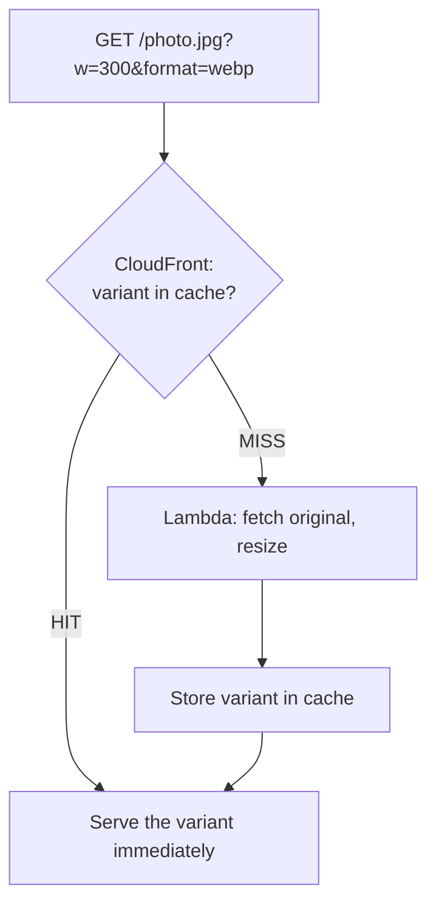
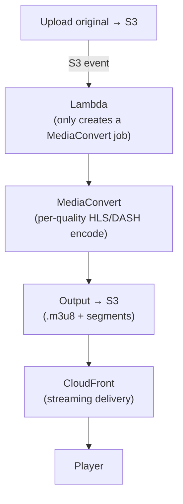

## Introduction

Through [Part 3](/en/blog/cloudfront-cdn-guide-3), we covered caching, protecting, and monitoring static and dynamic content with CloudFront. But real services have one more thing — <strong>media</strong>. User-uploaded images must be shrunk to fit the screen, and video must be converted to a quality that fits the device and network for smooth playback.

This final Part 4 covers how to handle <strong>image resizing</strong> and <strong>video transcoding</strong> within a CloudFront architecture. The key insight: these are both "transforms" in name only — their weight is the opposite.

- Part 1 — [How a CDN and CloudFront work](/en/blog/cloudfront-cdn-guide-1)
- Part 2 — [Putting a Spring Boot + Kotlin origin behind CloudFront](/en/blog/cloudfront-cdn-guide-2)
- Part 3 — [Private content, edge logic, security, monitoring](/en/blog/cloudfront-cdn-guide-3)
- <strong>Part 4 — Image resizing and video transcoding (this post)</strong>

---

## TL;DR

- <strong>The two transforms are opposite in weight.</strong> Image resizing is light (milliseconds). Video conversion is heavy (minutes). So the approaches are opposite too.
- <strong>Images: transform on demand, then cache.</strong> Transform once when a request arrives, and CloudFront caches the result. Handle it with Lambda@Edge or S3 Object Lambda.
- <strong>Variants via query string, but allowlist only.</strong> Put parameters like `?w=300` in the cache key to cache per size, but accept only allowed values (prevents an explosion of variants).
- <strong>Video: pre-convert with a dedicated service.</strong> Don't transcode in Lambda. On upload, MediaConvert converts to multiple-quality streaming formats and stores them in S3. Lambda only triggers the job.
- <strong>Video is still delivered by CloudFront.</strong> The output (streaming chunks) are static files in S3, so CloudFront caches and delivers them. Being large, the CDN benefit is even bigger.

---

## 1. The Two Transforms Differ in Weight

The first thing to do when designing media transforms is to classify: is this a light task or a heavy one?

| Criterion | Image resizing | Video transcoding |
|------|------|------|
| Duration | Milliseconds to hundreds of ms | Tens of seconds to minutes |
| When | Synchronous, at request time | Asynchronous, pre-converted at upload |
| Tool | Lambda@Edge / S3 Object Lambda | MediaConvert (Lambda only triggers) |
| Output | One transformed image | Many per-quality streaming chunks |
| CloudFront | Cache variants by query-string key | Cache streaming chunks statically |

This table is the summary of all of Part 4. Images are "make on demand and cache"; video is "make everything ahead of time and deliver."

---

## 2. Image Resizing — Transform on Demand, Then Cache

### 2.1 Principle: transform only on the first request, cache the variant

Keep one original (`photo.jpg`) and transform when a `?w=300&format=webp` request comes. <strong>Don't transform every time.</strong> Transform only on the first request (miss); CloudFront caches that variant so later requests (hit) respond without transforming.



### 2.2 What to transform with

| Method | Trait |
|------|------|
| <strong>Lambda@Edge</strong> (origin-response) | On a CloudFront miss, fetch the S3 original, transform with `sharp`, return. The most common pattern. Watch the generated-response size limit (~1MB) and cold starts |
| <strong>S3 Object Lambda</strong> | Intercept S3 GetObject to transform. More robust for large outputs |
| <strong>Serverless Image Handler</strong> | An AWS official solution (CloudFront+Lambda+sharp). Thumbor-style URLs, deployable out of the box |
| <strong>3rd-party</strong> | Cloudinary / imgix — you don't run it yourself |

> <strong>Note</strong>: Resizing directly in the Spring Boot app is discouraged. It increases app load, and routing every variant through the app erodes the edge-caching benefit. Splitting it into "a dedicated transform function + CloudFront caching" is the standard.

### 2.3 Query string in the cache key — but allowlist only

To cache different copies per size/format, you must include query strings in the cache key. But <strong>don't accept arbitrary queries.</strong> `?w=1`, `?w=2`, … would create infinitely many variants, blowing up the cache and letting attackers poison it (cache-busting attack). Only put <strong>allowed parameters</strong> in the key.

```hcl
resource "aws_cloudfront_cache_policy" "image" {
  name        = "image-resize"
  default_ttl = 86400
  max_ttl     = 31536000
  min_ttl     = 0

  parameters_in_cache_key_and_forwarded_to_origin {
    enable_accept_encoding_gzip   = true
    enable_accept_encoding_brotli = true

    query_strings_config {
      query_string_behavior = "whitelist"
      query_strings {
        items = ["w", "h", "format", "q"]   # only the allowed variant params
      }
    }
    cookies_config  { cookie_behavior  = "none" }
    headers_config  { header_behavior  = "none" }
  }
}
```

Additionally, validate the `w`/`h`/`q` ranges and `format` set in the app/Lambda, rejecting or normalizing out-of-range values.

### 2.4 Lambda@Edge resize example (conceptual)

```javascript
// origin-response Lambda@Edge — resize with sharp
const sharp = require('sharp');

exports.handler = async (event) => {
  const response = event.Records[0].cf.response;
  const request = event.Records[0].cf.request;
  const params = new URLSearchParams(request.querystring);
  const width = parseInt(params.get('w') || '0', 10);

  // out of allowed range → original as-is
  if (!width || width > 2000) return response;

  // (resize the original bytes fetched from S3 — real impl includes the fetch)
  const resized = await sharp(originalBuffer)
    .resize({ width })
    .webp({ quality: 80 })
    .toBuffer();

  response.body = resized.toString('base64');
  response.bodyEncoding = 'base64';
  response.headers['content-type'] = [{ key: 'Content-Type', value: 'image/webp' }];
  response.headers['cache-control'] = [{ key: 'Cache-Control', value: 'public, max-age=31536000, immutable' }];
  return response;
};
```

> <strong>Caution</strong>: Lambda@Edge's generated-response size limit (~1MB) can make it unsuitable for large images. In that case, transform with S3 Object Lambda or a regional Lambda (function URL) and put CloudFront in front — a more robust setup.

---

## 3. Video Transcoding — Pre-convert with MediaConvert

### 3.1 Why you must not transcode directly in Lambda

Video encoding takes tens of seconds to minutes and is CPU-heavy. Lambda's time/resource limits make it unsuitable for real transcoding workloads (Lambda@Edge even more so). A <strong>dedicated managed service</strong> does the transcoding; Lambda only orchestrates by "starting the job."

### 3.2 The VOD pipeline (recorded/uploaded video)

<strong>AWS Elemental MediaConvert</strong> converts file-based video into multiple qualities (360p–1080p) in streaming formats (HLS/DASH). It makes several renditions for adaptive bitrate (auto-switching quality to match the network).



Lambda just receives the S3 upload event and creates a MediaConvert job (conceptual):

```javascript
// S3 upload trigger → create a MediaConvert job (Lambda doesn't transcode)
const { MediaConvertClient, CreateJobCommand } = require('@aws-sdk/client-mediaconvert');

exports.handler = async (event) => {
  const key = event.Records[0].s3.object.key;
  const client = new MediaConvertClient({ endpoint: process.env.MC_ENDPOINT });

  await client.send(new CreateJobCommand({
    Role: process.env.MC_ROLE_ARN,
    Settings: {
      Inputs: [{ FileInput: `s3://uploads-bucket/${key}` }],
      OutputGroups: [/* HLS group: 1080p/720p/480p renditions, segment length, etc. */],
    },
  }));
};
```

Keep just the MediaConvert queue and IAM role in Terraform; create the actual jobs at runtime via the SDK.

```hcl
resource "aws_media_convert_queue" "vod" {
  name = "vod-queue"
}
# + an IAM role (aws_iam_role) letting MediaConvert read/write S3
```

### 3.3 Live streaming

Live has a different pipeline: <strong>MediaLive</strong> (real-time encoding) → <strong>MediaPackage</strong> (packaging/origin) → CloudFront. MediaLive encodes the incoming live feed, MediaPackage packages it as HLS/DASH, and CloudFront delivers it to viewers.

```text
Encoder → MediaLive (encode) → MediaPackage (package/origin) → CloudFront → Viewers
```

---

## 4. Serving Video with CloudFront

The transcoding output — playlists (`.m3u8`) and segments (`.ts`/`.m4s`) — are ultimately <strong>static files in S3</strong>. So Part 1's static-caching principles apply directly. There are just a few video-specific caching points.

### 4.1 Segments long, live playlists short

| File | VOD | Live |
|------|------|------|
| Segment (`.ts`/`.m4s`) | Doesn't change → cache long | Doesn't change → cache long |
| Playlist (`.m3u8`) | Doesn't change → cache long | <strong>Keeps updating → short (seconds)</strong> |

For live, caching the playlist long hides new segments and playback stalls. Set just the live `.m3u8` TTL to a few seconds.

```hcl
# Segments: cache long
ordered_cache_behavior {
  path_pattern    = "*.ts"
  target_origin_id = "s3-media"
  viewer_protocol_policy = "redirect-to-https"
  allowed_methods = ["GET", "HEAD"]
  cached_methods  = ["GET", "HEAD"]
  cache_policy_id = data.aws_cloudfront_cache_policy.optimized.id
  compress        = false   # video is already compressed
}

# Live playlist: cache short (a separate short-TTL policy)
ordered_cache_behavior {
  path_pattern     = "*.m3u8"
  target_origin_id = "s3-media"
  viewer_protocol_policy = "redirect-to-https"
  allowed_methods  = ["GET", "HEAD"]
  cached_methods   = ["GET", "HEAD"]
  cache_policy_id  = aws_cloudfront_cache_policy.short_playlist.id   # default_ttl a few seconds
}
```

> <strong>Note</strong>: Video segments are already-compressed binary, so leave `compress` (gzip/brotli) off. The text `.m3u8` can have it on.

### 4.2 Video is delivered by CloudFront too — even more so

Video has large traffic, and many viewers repeatedly request the same segments. So the edge-caching benefit is far bigger than for images.

- <strong>Large, high-bandwidth</strong>: serving from S3 directly explodes cost/latency → edge caching cuts it
- <strong>Repeated segments</strong>: many viewers fetch the same chunk of a popular video → high hit ratio
- <strong>Global viewing</strong>: edge distribution is playback quality (less buffering)
- <strong>Range requests</strong>: players use byte-range requests, and the S3 origin supports them by default

### 4.3 Private video — Signed Cookie

Protect paid/member video with the <strong>Signed URL/cookies</strong> from Part 3. Since HLS has many files (playlist + segments), a <strong>Signed Cookie that authorizes a whole path at once</strong> is more convenient than signing every file. "This user may watch `/premium/movie123/*` for 1 hour" is handled with a single cookie.

---

## 5. In Practice — Build-It-Yourself vs Managed/Pre-generated

The Lambda@Edge and MediaConvert approaches above are the <strong>"build it yourself on AWS"</strong> way. But what teams more commonly pick depends on size and stack, and <strong>the Part 4 approach is not the only right answer.</strong>

<strong>Images</strong>

| Approach | Frequency in practice | Best for |
|------|------|------|
| <strong>Pre-generate</strong> on upload (fixed thumbnail/medium/large sizes) | Very common | Fixed-size product images, avatars |
| <strong>Managed</strong> (Cloudinary, imgix) | Common | Pay instead of building |
| <strong>Frontend built-in</strong> (Next.js Image, etc.) | Common nowadays | When the frontend is Next/Vercel |
| <strong>On-demand Lambda@Edge</strong> (§2) | Moderate | Many dynamic sizes, building on AWS |

If you only have a few fixed sizes, <strong>pre-generation is simpler and more common</strong> than on-demand.

<strong>Video</strong>

| Approach | Frequency in practice | Best for |
|------|------|------|
| <strong>Managed platform</strong> (Mux, Cloudflare Stream, api.video) | Common | Small/mid teams, fast adoption |
| <strong>MediaConvert+S3+CloudFront yourself</strong> (§3) | At scale or AWS-all-in | Big control/cost/traffic needs |
| <strong>YouTube/Vimeo embed</strong> | Common for non-core video | When video isn't the core product |

Building a video pipeline is a lot of work, so small teams often <strong>start with a managed platform (Mux, Cloudflare Stream)</strong>. Rolling your own MediaConvert is the choice when you need scale and control.

> <strong>Bottom line</strong>: Parts 1–3 (static/dynamic caching) are the fundamentals of nearly every service, but media transformation is a <strong>"build vs managed/pre-generate" trade-off</strong>. The smaller the team, the more common it is to start managed (images = Cloudinary, video = Mux/Cloudflare Stream) and bring the pipeline in-house as scale, control, and cost grow. Drop the misconception that you "must" hand-write Lambda@Edge/MediaConvert.

---

## Recap — Wrapping Up the Series

Across four parts, we covered CloudFront from concepts to media serving.

| Part | Topic | Core |
|------|------|------|
| <strong>Part 1</strong> | Concepts | Edge cache, cache key, Cache-Control/TTL, invalidation vs versioning |
| <strong>Part 2</strong> | Hands-on | Spring Boot+Kotlin origin + behavior split + Terraform + X-Cache verification |
| <strong>Part 3</strong> | Operations | Private content, edge logic, security (domain/OAC/WAF), monitoring |
| <strong>Part 4</strong> | Media | Image resizing (on-demand + cache), video transcoding (MediaConvert), HLS/DASH serving |

The conclusion for media serving is one sentence: <strong>"Transform light images on the fly and cache them; pre-convert heavy video with MediaConvert; but deliver both via CloudFront."</strong> Separating the transcoding services (MediaConvert/MediaLive) from the delivery layer (CloudFront) makes the media pipeline clear.

---

## Appendix

### A. Decision cheat sheet

| Situation | Choice |
|------|------|
| Image size/format variants | Lambda@Edge / S3 Object Lambda + query-string caching (allowlist) |
| Large image transforms | S3 Object Lambda / regional Lambda (avoid Lambda@Edge size limit) |
| Ready-made image solution | AWS Serverless Image Handler |
| Recorded video (VOD) transform | MediaConvert (Lambda only triggers) |
| Live streaming | MediaLive + MediaPackage |
| Video delivery | CloudFront (segments long, live playlist short) |
| Protect private video | Signed Cookie (authorize a whole path) |

### B. Glossary

| Term | Description |
|------|------|
| Transcoding | Converting video to a different codec/resolution/bitrate |
| HLS/DASH | Streaming formats that split video into small chunks |
| Adaptive bitrate (ABR) | Auto-switching quality based on network conditions |
| Segment | A few-seconds video chunk (`.ts`/`.m4s`) |
| Playlist (`.m3u8`) | An index file listing the segments and their order |
| MediaConvert | Managed file-based video transcoding service (VOD) |
| MediaLive / MediaPackage | Live encoding / packaging services |
| S3 Object Lambda | A feature injecting a transform when fetching an S3 object |

### C. References

- [Serverless Image Handler (AWS Solution)](https://aws.amazon.com/solutions/implementations/serverless-image-handler/)
- [S3 Object Lambda](https://docs.aws.amazon.com/AmazonS3/latest/userguide/transforming-objects.html)
- [AWS Elemental MediaConvert](https://docs.aws.amazon.com/mediaconvert/latest/ug/what-is.html)
- [Serving streaming video with CloudFront](https://docs.aws.amazon.com/AmazonCloudFront/latest/DeveloperGuide/on-demand-streaming-video.html)
