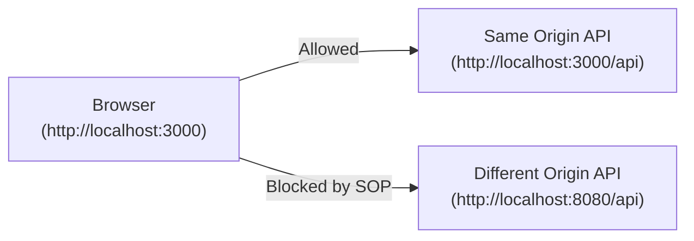
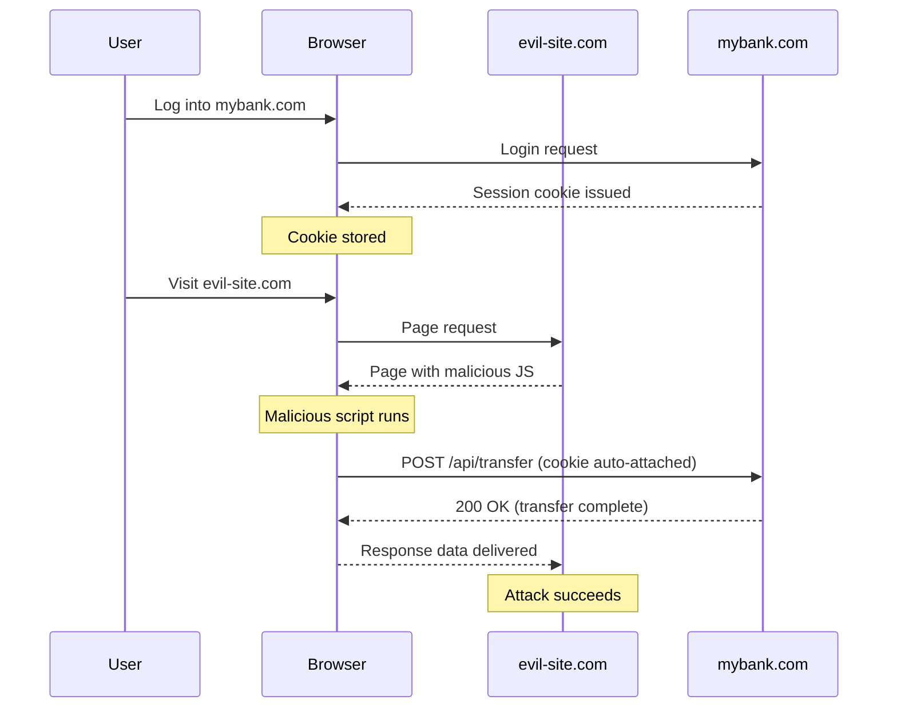
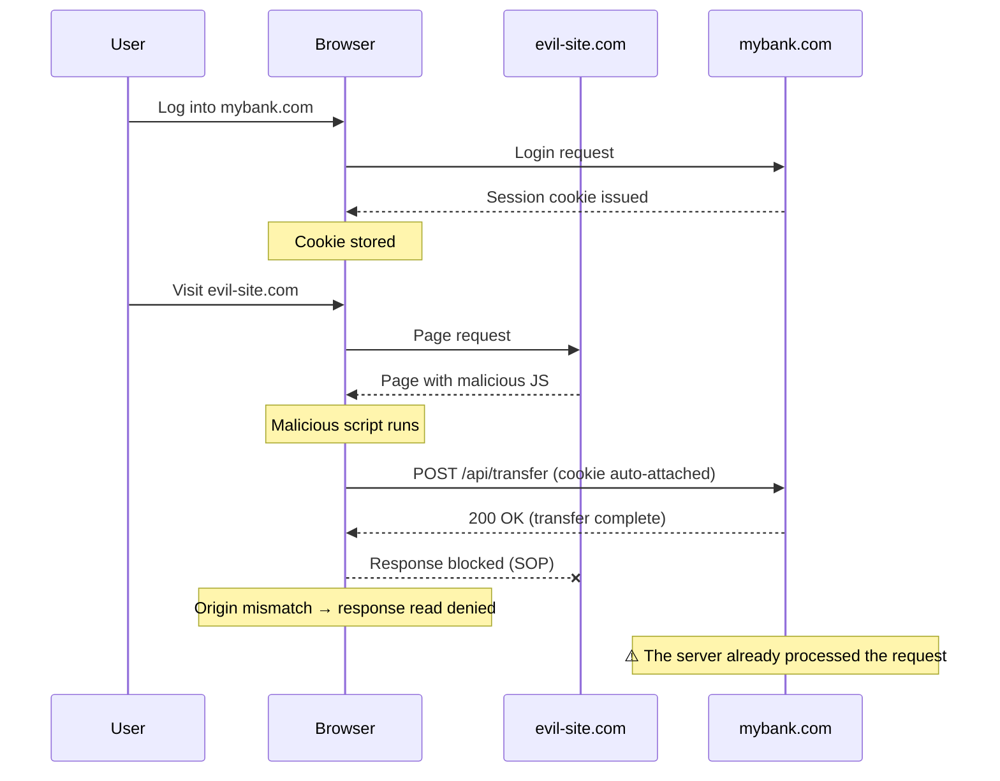
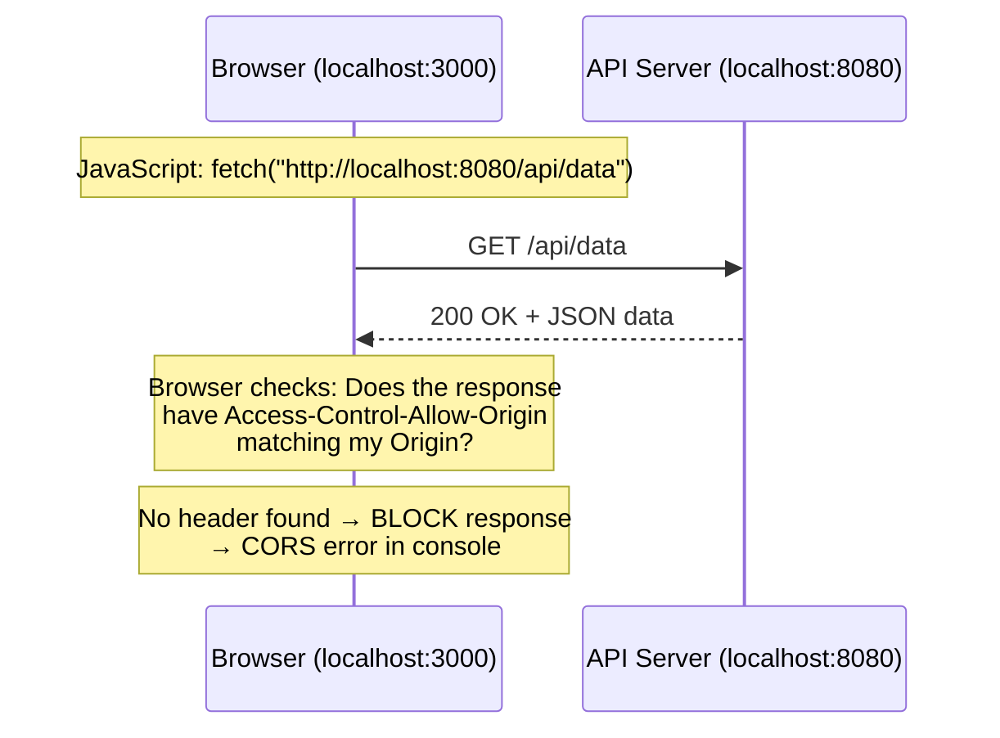
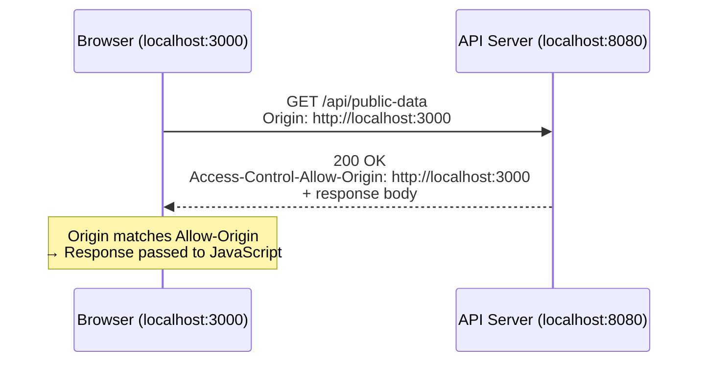
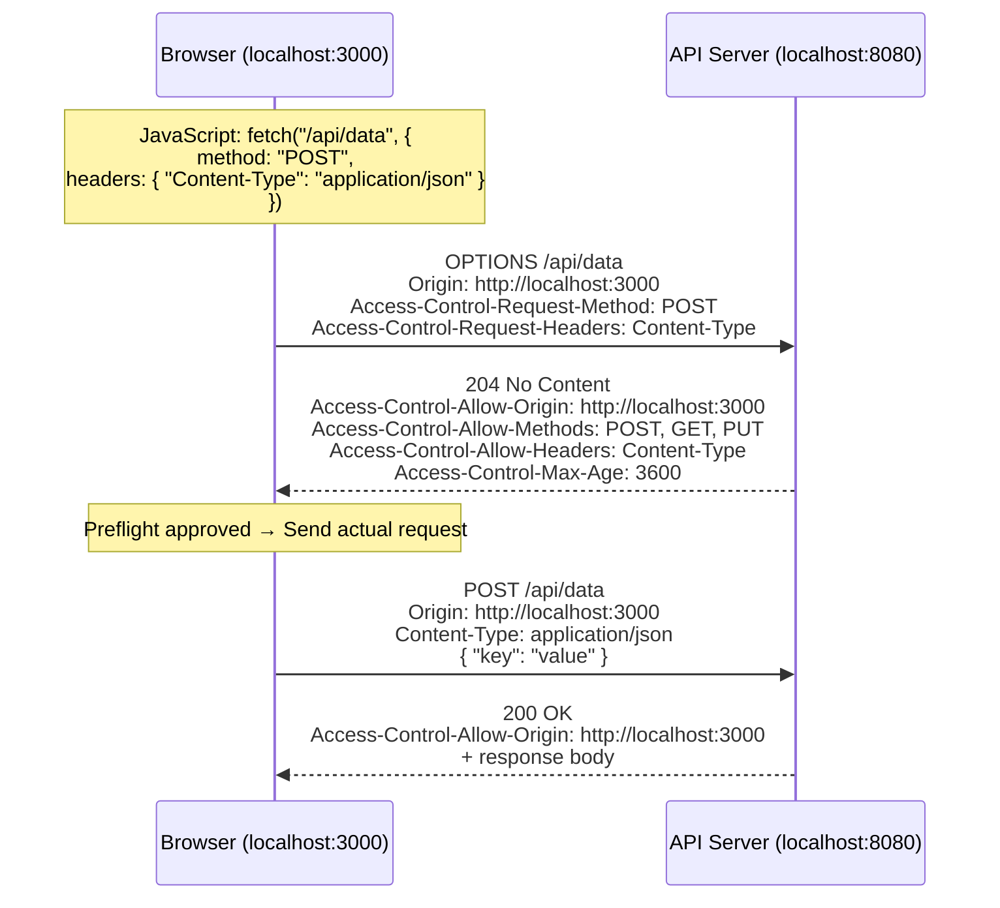
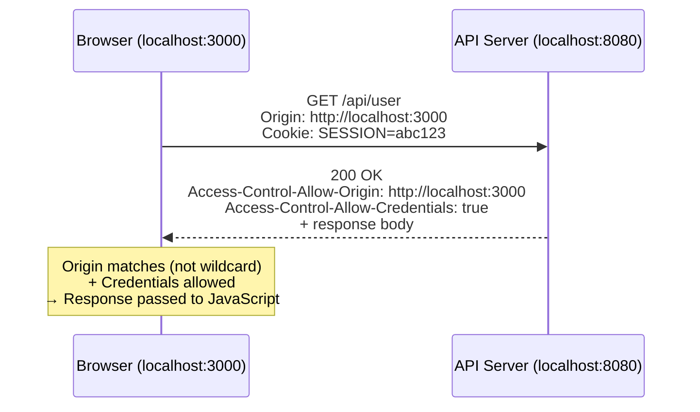
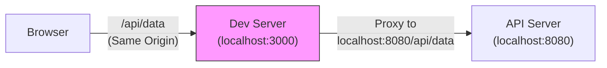
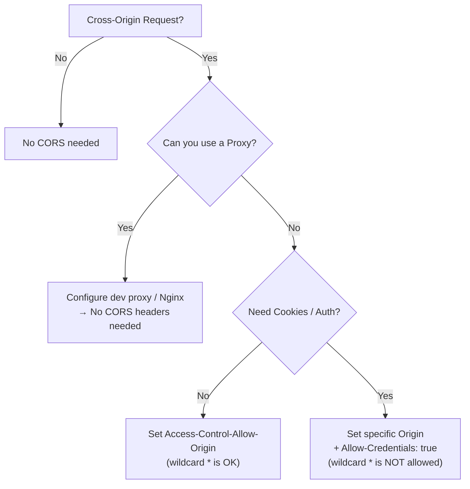

## Introduction

If you have ever built a frontend application that calls a backend API, chances are you have encountered this error at least once:

```
Access to fetch at 'http://localhost:8080/api/data' from origin 'http://localhost:3000'
has been blocked by CORS policy: No 'Access-Control-Allow-Origin' header is present
on the requested resource.
```

And then comes the inevitable question: **"Why does it work perfectly in Postman but not in the browser?"**

This guide will answer that question from the ground up. We will cover what an Origin is, why browsers enforce the Same-Origin Policy, how CORS provides a controlled way to relax it, and how to configure CORS properly in a Spring Boot application.

### Table of Contents

- [What is an Origin?](#1-what-is-an-origin)
- [Same-Origin Policy (SOP)](#2-same-origin-policy-sop)
- [What is CORS?](#3-what-is-cors)
- [How CORS Works](#4-how-cors-works)
- [Common CORS Error Patterns in Practice](#5-common-cors-error-patterns-in-practice)
- [CORS Configuration in Spring Boot](#6-cors-configuration-in-spring-boot)
- [Bypassing CORS with Proxies](#7-bypassing-cors-with-proxies)
- [Common Mistakes and Pitfalls](#8-common-mistakes-and-pitfalls)
- [Summary](#summary)

---

## 1. What is an Origin?

An **Origin** is defined by three components:

```
Origin = Protocol (Scheme) + Host (Domain) + Port
```

For example, the Origin of `https://example.com:443/api/users` is `https://example.com:443`.

Two URLs share the **same Origin** only when all three parts match exactly. Let's look at some examples:

| URL A | URL B | Same Origin? | Reason |
|-------|-------|:------------:|--------|
| `http://example.com/a` | `http://example.com/b` | Yes | Same protocol, host, port (80) |
| `http://example.com` | `https://example.com` | No | Different protocol |
| `http://example.com` | `http://api.example.com` | No | Different host (subdomain counts) |
| `http://localhost:3000` | `http://localhost:8080` | No | Different port |
| `https://example.com` | `https://example.com:443` | Yes | 443 is the default for HTTPS |

The last row is a common source of confusion. Since HTTPS defaults to port 443, `https://example.com` and `https://example.com:443` are the same Origin.

> The key takeaway: `http://localhost:3000` (your React/Vue dev server) and `http://localhost:8080` (your Spring Boot API) are **different Origins** because the ports differ. This is the most common scenario where developers first encounter CORS errors.

---

## 2. Same-Origin Policy (SOP)

### 2.1 What is SOP?

The **Same-Origin Policy** is a fundamental security mechanism built into every modern web browser. It restricts scripts running on one Origin from reading data returned by a different Origin.



### 2.2 Why is SOP Necessary?

Imagine a world without the Same-Origin Policy:

#### A World Without SOP (Attack Succeeds)



#### A World With SOP (Response Read Blocked)



A critical point here: **SOP blocks "reading the response," not "sending the request."** In the scenario above, the transfer request reaches the server and is processed normally. SOP only prevents `evil-site.com`'s script from **reading the response data** (account balance, transaction details, etc.).

This means SOP alone cannot fully prevent this attack. **Blocking the request itself requires additional defenses:**

| Defense Mechanism | Role |
|-------------------|------|
| **SOP** | Blocks reading the response (prevents data theft) |
| **CSRF Token** | Server verifies whether the request is forged (rejects the request itself) |
| **SameSite Cookie** | Prevents cookies from being auto-attached on cross-site requests |
| **Preflight (CORS)** | Dangerous methods like `PUT`/`DELETE` require prior approval |

In fact, if a request meets the Simple Request conditions (`POST` + `application/x-www-form-urlencoded`), it can reach the server without any preflight check. This is exactly why CSRF attacks remain dangerous and why server-side CSRF token validation is necessary.

### CSRF and Authentication Methods

This scenario is closely related to **CSRF (Cross-Site Request Forgery)**. CSRF is an attack where a malicious site sends forged requests on behalf of an authenticated user — for example, using a logged-in bank session cookie to initiate a money transfer without the user's knowledge.

SOP reduces the attack surface by blocking the response from being read, but since the request itself can still go through, SOP alone cannot fully prevent CSRF. Additional defenses like CSRF tokens and SameSite cookies are needed.

#### SOP/CORS Applies Regardless of Authentication Method

You might think "JWT means no SOP/CORS issues," but that's not the case. SOP and CORS apply **regardless of the authentication method**. Whether you use session cookies or JWT, the browser enforces the same CORS policy when making cross-origin requests.

However, the authentication method does affect **how CORS is configured**:

| | Session Cookie | JWT (`Authorization` header) |
|--|---------------|------------------------------|
| How it's sent | Browser attaches automatically | JS adds header manually |
| `allowCredentials` | `true` required | Not needed (no cookies involved) |
| Preflight triggered | Not by cookies alone | **Always** — `Authorization` is a custom header |
| `allowedHeaders` | Defaults may suffice | Must include `Authorization` |

With JWT, the `Authorization` header triggers a preflight on **every request, even GET**. You'll actually encounter preflight requests more frequently than with session cookies.

#### CSRF Risk by JWT Storage Method

CSRF works because the browser **automatically attaches** credentials. Cookies are auto-attached, but the `Authorization` header must be added by JS explicitly. Since `evil-site.com`'s script cannot access `bank.com`'s `localStorage` (thanks to SOP), it has no way to obtain the JWT.

| Auth Method | CSRF Risk | Reason |
|-------------|:---------:|--------|
| Session cookie | **Yes** | Browser auto-attaches cookies |
| JWT stored in cookie | **Yes** | It's still a cookie — auto-attached |
| JWT via `Authorization` header | **No** | JS adds it manually; other Origins can't access it |
| JWT in `HttpOnly` cookie | **Yes** | Cookie auto-attached + JS can't even read it |

The key factor is not JWT itself but **how it's transmitted**. Store JWT in a cookie and it's just as vulnerable to CSRF as a session cookie. Send it via `Authorization` header and CSRF is not a concern — but XSS could steal the token from `localStorage` instead. Every approach has trade-offs.

### 2.3 Why the Browser, Not the Server?

You might wonder: "Why can't the server just block these requests?" There is a structural reason why the server cannot handle this.

**The server cannot distinguish who sent the request.** The `Origin` header is attached by the browser — tools like curl or Postman can send any value they want. Blocking based on this header alone is trivially bypassable. Furthermore, if a valid cookie is attached, the server has no way to tell a legitimate user's request apart from one triggered by a malicious site.

**The browser is the only trust boundary.** The browser knows exactly which tab (Origin) loaded which script and where the request was sent. "This script was loaded from `evil-site.com` and is trying to read the response from `mybank.com`" — only the browser can make this determination.

| | Server | Browser |
|--|--------|---------|
| Origin verification | Relies on `Origin` header (spoofable) | Knows the actual execution context |
| Cookie auto-send control | Cannot control | Can control via SameSite, etc. |
| Response read blocking | Cannot block (response already sent) | Decides whether to deliver response to JS |

In short, the server's role is to **declare which Origins are allowed** via CORS headers. The browser's role is to **enforce that declaration**. It's a division of responsibility.

### 2.4 The Critical Insight: The Server Responds Normally

This is the single most important concept to understand about CORS errors:

> **The server receives the request and sends back a response successfully. It is the browser that blocks the response from reaching your JavaScript code.**

This is exactly why the same request works perfectly in Postman, curl, or any other HTTP client. These tools are not browsers — they do not enforce the Same-Origin Policy.



The response actually arrives at the browser. The browser inspects the response headers, finds no CORS permission, and refuses to hand the data to your JavaScript. The server did its job — it is the browser enforcing the policy.

---

## 3. What is CORS?

**CORS (Cross-Origin Resource Sharing)** is a mechanism that allows servers to declare which Origins are permitted to access their resources. It is essentially a controlled way to create exceptions to the Same-Origin Policy.

In simple terms: **the server tells the browser, "Requests from this Origin are OK — let them through."**

### 3.1 Key HTTP Headers

CORS works entirely through HTTP headers. Here are the important ones:

#### Request Headers (sent by the browser)

| Header | Description |
|--------|-------------|
| `Origin` | The Origin of the page making the request |
| `Access-Control-Request-Method` | (Preflight only) The HTTP method the actual request will use |
| `Access-Control-Request-Headers` | (Preflight only) Custom headers the actual request will include |

#### Response Headers (sent by the server)

| Header | Description |
|--------|-------------|
| `Access-Control-Allow-Origin` | Which Origin(s) are allowed. Can be a specific Origin or `*` |
| `Access-Control-Allow-Methods` | Which HTTP methods are allowed (GET, POST, PUT, DELETE, etc.) |
| `Access-Control-Allow-Headers` | Which request headers are allowed beyond the standard set |
| `Access-Control-Allow-Credentials` | Whether the browser should include cookies/auth headers (`true` or omitted) |
| `Access-Control-Max-Age` | How long (in seconds) the browser can cache a preflight response |
| `Access-Control-Expose-Headers` | Which response headers JavaScript is allowed to read |

---

## 4. How CORS Works

CORS has three distinct flows depending on the type of request. Understanding which flow applies to your request is key to debugging CORS issues.

### 4.1 Simple Request

A **Simple Request** is one that meets all of the following conditions:

- Method is `GET`, `HEAD`, or `POST`
- Content-Type is one of:
  - `application/x-www-form-urlencoded`
  - `multipart/form-data`
  - `text/plain`
- Only standard headers are used (Accept, Accept-Language, Content-Language, Content-Type)

**All three** conditions must be satisfied. If any one is violated, a preflight is triggered. Here's a per-method breakdown:

| Method | Simple Request? | Condition |
|--------|----------------|-----------|
| `GET`, `HEAD` | Possible | Only if no custom headers |
| `POST` | Possible | Only if Content-Type is one of the above 3 + no custom headers |
| `PUT`, `DELETE`, `PATCH` | **Never** | Always triggers preflight |

In other words, `PUT`/`DELETE` always require a preflight, but even a `GET` will trigger one if it includes an `Authorization` header. In practice, nearly all modern APIs use `Authorization` or `Content-Type: application/json`, so **preflight requests occur regardless of the HTTP method** in most real-world scenarios.

When all conditions are met, the browser sends the request directly without a preflight check:



The browser sends the request with an `Origin` header. The server responds with `Access-Control-Allow-Origin`. If the value matches the requesting Origin (or is `*`), the browser allows JavaScript to access the response.

### 4.2 Preflight Request

Any request that falls outside the Simple Request conditions triggers a **Preflight Request**. This includes:

- Methods like `PUT`, `DELETE`, `PATCH`
- Custom headers (e.g., `Authorization`, `X-Custom-Header`)
- `Content-Type: application/json` (the most common case in modern APIs)

The browser first sends an `OPTIONS` request to ask for permission, and only proceeds with the actual request if the server grants it:



**Preflight Caching with `Access-Control-Max-Age`:**

Without caching, the browser sends an `OPTIONS` request before every single cross-origin request. The `Access-Control-Max-Age` header tells the browser to cache the preflight result for the specified number of seconds. For example, `Access-Control-Max-Age: 3600` means "do not send another preflight for this URL for 1 hour."

### 4.3 Credentialed Request

When a request needs to include **cookies** or an **Authorization header**, it becomes a Credentialed Request. This has stricter rules:

```javascript
// Frontend: must explicitly opt in
fetch("http://localhost:8080/api/user", {
  credentials: "include"  // Send cookies cross-origin
});
```

For credentialed requests, the server must satisfy **two additional requirements**:

1. `Access-Control-Allow-Origin` **cannot** be `*` — it must specify the exact Origin
2. `Access-Control-Allow-Credentials: true` must be present in the response



> If the server responds with `Access-Control-Allow-Origin: *` while the frontend uses `credentials: "include"`, the browser will reject the response — even though the wildcard should theoretically include all Origins.

---

## 5. Common CORS Error Patterns in Practice

### Pattern 1: Missing `Access-Control-Allow-Origin` Header

```
Access to fetch at 'http://localhost:8080/api/data' from origin 'http://localhost:3000'
has been blocked by CORS policy: No 'Access-Control-Allow-Origin' header is present
on the requested resource.
```

**Cause:** The server has no CORS configuration at all. It does not include any `Access-Control-Allow-Origin` header in its response.

**Solution:** Add CORS configuration to your server. In Spring Boot, add `@CrossOrigin` to your controller or configure it globally via `WebMvcConfigurer`.

---

### Pattern 2: Wildcard with Credentials

```
Access to fetch at 'http://localhost:8080/api/user' from origin 'http://localhost:3000'
has been blocked by CORS policy: The value of the 'Access-Control-Allow-Origin' header
in the response must not be the wildcard '*' when the request's credentials mode is 'include'.
```

**Cause:** The frontend sends `credentials: "include"`, but the server responds with `Access-Control-Allow-Origin: *` instead of a specific Origin.

**Solution:** Configure the server to respond with the exact requesting Origin (e.g., `http://localhost:3000`) and add `Access-Control-Allow-Credentials: true`.

---

### Pattern 3: Preflight Method Not Allowed

```
Access to fetch at 'http://localhost:8080/api/data' from origin 'http://localhost:3000'
has been blocked by CORS policy: Method PUT is not allowed by Access-Control-Allow-Methods
in preflight response.
```

**Cause:** The server's CORS configuration does not include the HTTP method used in the request.

**Solution:** Add the required method to `Access-Control-Allow-Methods` in your CORS configuration.

---

### Pattern 4: Custom Header Not Allowed

```
Access to fetch at 'http://localhost:8080/api/data' from origin 'http://localhost:3000'
has been blocked by CORS policy: Request header field x-custom-header is not allowed
by Access-Control-Allow-Headers in preflight response.
```

**Cause:** The frontend sends a custom header that the server does not explicitly allow.

**Solution:** Add the custom header to `Access-Control-Allow-Headers` in your CORS configuration. If using `Authorization`, make sure to include it.

---

## 6. CORS Configuration in Spring Boot

### 6.1 @CrossOrigin Annotation (Controller-level)

The simplest approach is to annotate individual controllers or endpoints:

```kotlin
@RestController
@RequestMapping("/api/products")
@CrossOrigin(origins = ["http://localhost:3000"])
class ProductController {

    @GetMapping
    fun getProducts(): List<Product> {
        return productService.findAll()
    }

    // All endpoints in this controller allow http://localhost:3000
}
```

You can also apply it to a single method:

```kotlin
@RestController
@RequestMapping("/api/orders")
class OrderController {

    @CrossOrigin(
        origins = ["http://localhost:3000"],
        methods = [RequestMethod.GET, RequestMethod.POST],
        allowedHeaders = ["Content-Type", "Authorization"],
        allowCredentials = "true",
        maxAge = 3600
    )
    @PostMapping
    fun createOrder(@RequestBody request: CreateOrderRequest): Order {
        return orderService.create(request)
    }
}
```

**Pros:** Simple, fine-grained control per endpoint.
**Cons:** Repetitive across multiple controllers, easy to forget on new endpoints.

### 6.2 WebMvcConfigurer (Global Configuration)

For a consistent CORS policy across all endpoints, configure it globally:

```kotlin
@Configuration
class WebConfig : WebMvcConfigurer {

    override fun addCorsMappings(registry: CorsRegistry) {
        registry.addMapping("/api/**")
            .allowedOrigins("http://localhost:3000")
            .allowedMethods("GET", "POST", "PUT", "DELETE", "PATCH")
            .allowedHeaders("*")
            .allowCredentials(true)
            .maxAge(3600)
    }
}
```

This approach applies CORS settings to all endpoints matching `/api/**` in a single place.

### 6.3 Using with Spring Security (Recommended for Most Projects)

When Spring Security is in the project, there is a critical issue: **Spring Security's filter chain processes the request before Spring MVC's CORS handling kicks in.** This means that preflight `OPTIONS` requests may be rejected by Spring Security before CORS headers are added.

The solution is to explicitly enable CORS in the Spring Security configuration:

```kotlin
@Configuration
@EnableWebSecurity
class SecurityConfig {

    @Bean
    fun securityFilterChain(http: HttpSecurity): SecurityFilterChain {
        http {
            cors { }  // Enable CORS — uses the CorsConfigurationSource bean
            csrf { disable() }
            authorizeHttpRequests {
                authorize("/api/public/**", permitAll)
                authorize("/api/**", authenticated)
            }
        }
        return http.build()
    }

    @Bean
    fun corsConfigurationSource(): CorsConfigurationSource {
        val configuration = CorsConfiguration().apply {
            allowedOrigins = listOf("http://localhost:3000")
            allowedMethods = listOf("GET", "POST", "PUT", "DELETE", "PATCH", "OPTIONS")
            allowedHeaders = listOf("*")
            allowCredentials = true
            maxAge = 3600
        }

        return UrlBasedCorsConfigurationSource().apply {
            registerCorsConfiguration("/api/**", configuration)
        }
    }
}
```

The `cors { }` block in the security configuration tells Spring Security to look for a `CorsConfigurationSource` bean and apply it **before** the authentication filters. Without this, `OPTIONS` preflight requests will receive a `401 Unauthorized` or `403 Forbidden` response.

### 6.4 Environment-specific Configuration (Dev vs Production)

In real projects, you need different CORS settings per environment:

```kotlin
@Configuration
class CorsConfig(
    @Value("\${cors.allowed-origins}")
    private val allowedOrigins: List<String>
) {

    @Bean
    fun corsConfigurationSource(): CorsConfigurationSource {
        val configuration = CorsConfiguration().apply {
            this.allowedOrigins = this@CorsConfig.allowedOrigins
            allowedMethods = listOf("GET", "POST", "PUT", "DELETE", "PATCH", "OPTIONS")
            allowedHeaders = listOf("*")
            allowCredentials = true
            maxAge = 3600
        }

        return UrlBasedCorsConfigurationSource().apply {
            registerCorsConfiguration("/api/**", configuration)
        }
    }
}
```

```yaml
# application-dev.yml
cors:
  allowed-origins:
    - http://localhost:3000
    - http://localhost:5173

# application-prod.yml
cors:
  allowed-origins:
    - https://myapp.example.com
    - https://www.myapp.example.com
```

**Never use `Access-Control-Allow-Origin: *` in production**, especially with credentialed requests. Always whitelist specific domains. The wildcard tells the browser "any website in the world can read responses from this API," which is almost never what you want for an authenticated API.

### 6.5 Wildcard Subdomain Patterns (`allowedOriginPatterns`)

When you need to allow multiple subdomains like `https://app.example.com`, `https://admin.example.com`, listing each one individually is tedious. You can use patterns instead.

The CORS spec's `Access-Control-Allow-Origin` header itself does not support wildcard subdomains — only an exact Origin (`https://app.example.com`) or `*` is valid. However, **Spring supports server-side pattern matching via `allowedOriginPatterns`**.

```kotlin
// WebMvcConfigurer approach
registry.addMapping("/api/**")
    .allowedOriginPatterns("https://*.example.com")

// CorsConfigurationSource approach
val configuration = CorsConfiguration().apply {
    allowedOriginPatterns = listOf("https://*.example.com")
}
```

How it works:
1. The browser sends `Origin: https://app.example.com`
2. Spring matches it against the `https://*.example.com` pattern
3. If matched, the response contains `Access-Control-Allow-Origin: https://app.example.com` — the **concrete value**, not the pattern

Note that `allowedOrigins` and `allowedOriginPatterns` are different:

| Method | Pattern support | `allowCredentials(true)` + `*` |
|--------|:--------------:|:------------------------------:|
| `allowedOrigins("https://*.example.com")` | Treated as literal (won't work) | Cannot use (`*` + credentials not allowed) |
| `allowedOriginPatterns("https://*.example.com")` | **Pattern matching** | `allowedOriginPatterns("*")` works |

Using `allowedOrigins("*")` with `allowCredentials(true)` throws an error. But `allowedOriginPatterns("*")` works with credentials because Spring responds with the actual Origin value, not the literal `*`.

### 6.6 Frequently Asked Questions

<details>
<summary><strong>Q: Do I need to add OPTIONS to allowedMethods?</strong></summary>

No. Preflight (`OPTIONS`) requests are automatically intercepted and handled by Spring's CORS mechanism (`CorsFilter` or `DispatcherServlet`). They never reach your controller, so there is no need to include `OPTIONS` in `allowedMethods`. That setting declares which methods are allowed for **actual requests**.

Note that not every `OPTIONS` request is a preflight. Spring internally checks **all three conditions** to determine if a request is a preflight:

1. The HTTP method is `OPTIONS`
2. The `Origin` header is present
3. The `Access-Control-Request-Method` header is present

A plain `OPTIONS` request without these CORS headers (e.g., for API discovery) passes through the CorsFilter untouched and reaches the controller. If the controller has no `OPTIONS` mapping, it will respond with `405 Method Not Allowed`. If you need to support plain `OPTIONS` requests, you must add a dedicated handler. In practice, this is rarely needed.

</details>

<details>
<summary><strong>Q: Do I need both 6.2 and 6.3?</strong></summary>

No. If your project uses Spring Security, **6.3 alone is sufficient.** When you register a `CorsConfigurationSource` as a `@Bean`, Spring Security's `CorsFilter` handles all CORS processing — making `WebMvcConfigurer`'s `addCorsMappings` redundant. Having both configured will work, but you end up managing the same CORS policy in two places, which can lead to configuration drift bugs.

| Setup | `WebMvcConfigurer` (6.2) | `CorsConfigurationSource` (6.3) |
|-------|:------------------------:|:-------------------------------:|
| **No** Spring Security | Use this | - |
| **With** Spring Security | Unnecessary (redundant) | **Use this** |

</details>

<details>
<summary><strong>Q: Are there any changes in Spring Framework 7.0 (Spring Boot 4.0)?</strong></summary>

The `WebMvcConfigurer` and `addCorsMappings` API remains unchanged across Spring Boot 2.x, 3.x, and 4.x — no migration is needed. However, Spring Framework 7.0 introduced one **behavioral change**: preflight requests are **no longer rejected** when CORS configuration is empty. Previously, an unconfigured CORS setup would automatically reject preflight requests; from 7.0 onward, they pass through. If your security relied on preflight rejection in the absence of explicit CORS configuration, verify that this change does not affect you.

</details>

---

## 7. Bypassing CORS with Proxies

Since CORS is a **browser-only** restriction, you can avoid it entirely by making the browser think the API is on the same Origin. This is done through proxies.

### 7.1 Frontend Dev Server Proxy

Most modern frontend tools support proxying API requests through the dev server:

**Vite (vite.config.ts):**

```typescript
export default defineConfig({
  server: {
    proxy: {
      "/api": {
        target: "http://localhost:8080",
        changeOrigin: true
      }
    }
  }
});
```

**Next.js (next.config.js):**

```javascript
module.exports = {
  async rewrites() {
    return [
      {
        source: "/api/:path*",
        destination: "http://localhost:8080/api/:path*"
      }
    ];
  }
};
```

With this setup, the frontend calls `/api/data` (same Origin), and the dev server forwards it to `http://localhost:8080/api/data` on the server side. Since the proxy runs on the server (not in the browser), CORS does not apply.



### 7.2 Nginx Reverse Proxy in Production

In production, Nginx serves as a reverse proxy that routes both the frontend and API through the same domain:

```nginx
server {
    listen 80;
    server_name myapp.example.com;

    # Frontend
    location / {
        root /var/www/frontend;
        try_files $uri $uri/ /index.html;
    }

    # API — proxied to the backend
    location /api/ {
        proxy_pass http://backend-server:8080;
        proxy_set_header Host $host;
        proxy_set_header X-Real-IP $remote_addr;
        proxy_set_header X-Forwarded-For $proxy_add_x_forwarded_for;
        proxy_set_header X-Forwarded-Proto $scheme;
    }
}
```

From the browser's perspective, both the frontend and API are served from `https://myapp.example.com` — the same Origin. No CORS needed.

### 7.3 Why Proxies Solve CORS

The fundamental reason is simple: **CORS is enforced by the browser based on the Origin of the request.** When a proxy makes the API appear to be on the same Origin as the frontend, there is no cross-origin request from the browser's perspective. The actual cross-origin communication happens server-to-server, where CORS does not exist.

---

## 8. Common Mistakes and Pitfalls

### Mistake 1: Wildcard with Credentials

```kotlin
// This will NOT work with credentials: "include"
allowedOrigins = listOf("*")
allowCredentials = true
```

The CORS specification explicitly forbids `Access-Control-Allow-Origin: *` when credentials are included. You must specify each allowed Origin individually.

**Fix:** Use `allowedOriginPatterns` if you need flexibility:

```kotlin
// Allows any localhost port during development
allowedOriginPatterns = listOf("http://localhost:*")
allowCredentials = true
```

### Mistake 2: Not Caching Preflight Responses

Without `Access-Control-Max-Age`, the browser sends an `OPTIONS` preflight request **before every single** cross-origin request that requires it. For an API that receives 100 requests per page load, that means 100 extra `OPTIONS` requests.

**Fix:** Always set `maxAge`:

```kotlin
maxAge = 3600  // Cache preflight for 1 hour
```

### Mistake 3: Forgetting `cors()` in Spring Security

This is perhaps the most common mistake in Spring Boot projects:

```kotlin
// CORS is configured in WebMvcConfigurer but...
@Bean
fun securityFilterChain(http: HttpSecurity): SecurityFilterChain {
    http {
        // Missing: cors { }
        // Spring Security blocks OPTIONS requests before CORS is applied!
        authorizeHttpRequests {
            authorize("/**", authenticated)
        }
    }
    return http.build()
}
```

The symptom is baffling: your CORS configuration looks correct, but the browser still gets errors. The `OPTIONS` preflight request is being rejected by Spring Security with a `401` before Spring MVC even gets to apply CORS headers.

**Fix:** Always include `cors { }` in your Spring Security configuration.

### Mistake 4: Server Returns 200 but Browser Shows CORS Error

You check the server logs and see the request was processed successfully. The response is `200 OK`. But the browser console shows a CORS error.

**Diagnosis:** Open the browser's Developer Tools > Network tab. Look at the actual response headers. If `Access-Control-Allow-Origin` is missing or does not match, the browser will block the response regardless of the status code.

**Remember:** The server processed the request. The data was returned. The browser just refused to show it to your JavaScript code.

### Verifying CORS Configuration from the Server Side

Since CORS errors are enforced by the browser, **no error appears in server logs** — the server successfully returned a `200 OK`. The request was processed; the browser simply refused to hand the response to JavaScript.

Instead of looking for errors, you can verify that your server returns the correct CORS headers.

#### Simulate with curl

```bash
# Simulate a preflight request
curl -v -X OPTIONS http://localhost:8080/api/users \
  -H "Origin: http://localhost:3000" \
  -H "Access-Control-Request-Method: PUT" \
  -H "Access-Control-Request-Headers: Authorization, Content-Type"
```

Check the response for:
- `Access-Control-Allow-Origin` matches the requested Origin
- `Access-Control-Allow-Methods` includes the desired method
- `Access-Control-Allow-Headers` includes the desired headers

```bash
# Simulate a simple request
curl -v http://localhost:8080/api/users \
  -H "Origin: http://localhost:3000"
```

Verify that `Access-Control-Allow-Origin` is present in the response.

#### Automate with Integration Tests

You can verify CORS configuration in CI before deployment:

```kotlin
@SpringBootTest
@AutoConfigureMockMvc
class CorsTest {

    @Autowired
    lateinit var mockMvc: MockMvc

    @Test
    fun `preflight request returns correct CORS headers`() {
        mockMvc.perform(
            options("/api/users")
                .header("Origin", "http://localhost:3000")
                .header("Access-Control-Request-Method", "PUT")
                .header("Access-Control-Request-Headers", "Authorization")
        )
            .andExpect(status().isOk)
            .andExpect(header().string("Access-Control-Allow-Origin", "http://localhost:3000"))
            .andExpect(header().string("Access-Control-Allow-Methods", containsString("PUT")))
    }

    @Test
    fun `disallowed Origin receives no CORS headers`() {
        mockMvc.perform(
            options("/api/users")
                .header("Origin", "http://evil.com")
                .header("Access-Control-Request-Method", "GET")
        )
            .andExpect(header().doesNotExist("Access-Control-Allow-Origin"))
    }
}
```

---

## Summary

| Concept | Key Point |
|---------|-----------|
| **Origin** | Protocol + Host + Port. All three must match for Same Origin. |
| **SOP** | Browser blocks cross-origin responses by default. Server responds normally. |
| **CORS** | Server opts in to allow specific Origins via response headers. |
| **Simple Request** | GET/HEAD/POST with standard headers. No preflight needed. |
| **Preflight Request** | Browser sends OPTIONS first for non-simple requests (PUT, DELETE, custom headers, JSON). |
| **Credentialed Request** | Includes cookies/auth. Requires specific Origin (no wildcard) + `Allow-Credentials: true`. |
| **Spring Boot** | Use `WebMvcConfigurer` for global config. Add `cors { }` when using Spring Security. |
| **Proxy** | Avoids CORS entirely by making API requests same-origin from the browser's perspective. |

### Quick Decision Flowchart



CORS can feel frustrating when you first encounter it, but once you understand that it is a browser security feature (not a server error) and that the server controls who gets access through response headers, the mental model becomes clear. Configure it once properly, and it stays out of your way.
