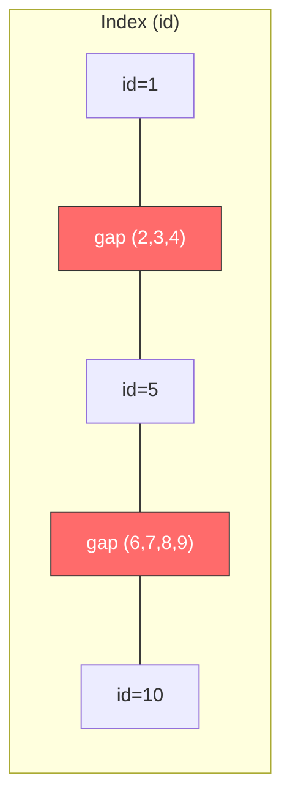
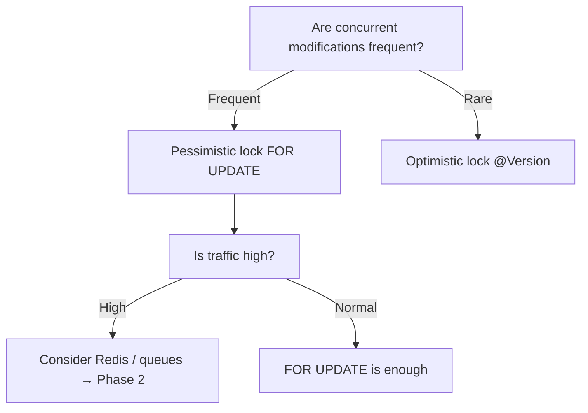

## Introduction

In the [previous post](/blog/en/db-isolation-level-guide), we covered isolation levels and concurrency anomalies. This post goes one level deeper — **"When do deadlocks actually occur, and how do we prevent them?"**

"Doesn't raising the isolation level make things safer?" — half right, half wrong. Higher isolation reduces anomalies, but **it also increases lock usage, which actually raises deadlock risk**.

---

## 1. What Is a Deadlock?

Two transactions waiting for each other's locks, **stuck forever**.

| Step | TX1 | TX2 | Status |
|:---:|------|------|:----:|
| 1 | `UPDATE ... WHERE id = 1` (lock id=1) | | |
| 2 | | `UPDATE ... WHERE id = 2` (lock id=2) | |
| 3 | `UPDATE ... WHERE id = 2` → waiting for id=2 ⏳ | | |
| 4 | | `UPDATE ... WHERE id = 1` → waiting for id=1 ⏳ | 💀 Deadlock! |

> **Analogy**: Two cars facing each other in a narrow alley. Both say "you go first" and neither moves. The DB detects this and **force-rolls back one side** to break the deadlock.

---

## 1.5 Lock Classification

This post covers shared locks, exclusive locks, pessimistic locks, optimistic locks, and more. These terms come from **different classification axes**, so let's map out how they relate before diving in.

| Axis | Type | Description |
|------|------|-------------|
| **Strategy** (when to lock) | Pessimistic Lock | Assumes conflicts will happen — **locks upfront** (`FOR UPDATE`, `FOR SHARE`) |
| | Optimistic Lock | Assumes no conflict — **validates at commit time** (`@Version`, CAS) |
| **Mode** (pessimistic lock scope) | Shared Lock (S Lock) | Other transactions can **read**, but must wait to write |
| | Exclusive Lock (X Lock) | Other transactions must **wait for both reads and writes** |
| **Layer** | DB Lock | Managed by the DB engine at row/table level (this post's focus) |
| | Application Lock | Code-level synchronization — mutex, semaphore (`synchronized`, `ReentrantLock`) |

> **Summary**: Pessimistic/optimistic is a **"strategy"**, shared/exclusive is a **"mode"** within pessimistic locking, and mutex is a **"different layer"** entirely. This post focuses on DB-layer pessimistic locks (shared/exclusive), then compares with optimistic locking in Section 4.

---

## 2. Lock Types: Shared Locks vs Exclusive Locks

To understand deadlocks, you first need to know the **two fundamental lock types** that databases use.

### 2.1 Shared Lock (S Lock / Read Lock)

**"I'm reading this, so others can read too. But no modifications allowed."**

```sql
-- MySQL
SELECT * FROM accounts WHERE id = 1 FOR SHARE;

-- PostgreSQL
SELECT * FROM accounts WHERE id = 1 FOR SHARE;

-- SQL Server
SELECT * FROM accounts WITH (HOLDLOCK) WHERE id = 1;
```

```java
// Spring Boot
@Lock(LockModeType.PESSIMISTIC_READ)
@Query("SELECT a FROM Account a WHERE a.id = :id")
Account findByIdForShare(@Param("id") Long id);
```

Multiple transactions can **hold shared locks simultaneously**. However, no transaction can acquire an **exclusive lock** on a row that has shared locks on it.

### 2.2 Exclusive Lock (X Lock / Write Lock)

**"I'm modifying this. Nobody reads or writes until I'm done."**

```sql
-- MySQL / PostgreSQL
-- Query: SELECT * FROM accounts WHERE id = 1 FOR UPDATE
-- → Acquires an exclusive lock (X Lock) on the row where id=1, then returns it
SELECT * FROM accounts WHERE id = 1 FOR UPDATE;

-- SQL Server
-- Query: SELECT * FROM accounts WITH (UPDLOCK, HOLDLOCK) WHERE id = 1
-- → UPDLOCK (exclusive lock) + HOLDLOCK (held until transaction ends) on the row where id=1
SELECT * FROM accounts WITH (UPDLOCK, HOLDLOCK) WHERE id = 1;

-- UPDATE/DELETE automatically acquire exclusive locks (all DBs)
-- Query: UPDATE accounts SET balance = 0 WHERE id = 1
-- → Automatically acquires an exclusive lock on the row where id=1 and sets balance to 0
UPDATE accounts SET balance = 0 WHERE id = 1;
```

```java
// Spring Boot
// Query: SELECT * FROM account WHERE id = ? FOR UPDATE
// → PESSIMISTIC_WRITE causes JPA to generate a SELECT ... FOR UPDATE query
@Lock(LockModeType.PESSIMISTIC_WRITE)
@Query("SELECT a FROM Account a WHERE a.id = :id")
Account findByIdForUpdate(@Param("id") Long id);
```

Only **one transaction** can hold an exclusive lock. All others must wait — whether they want to read or write.

### 2.3 Compatibility Matrix

| | S Lock Requested | X Lock Requested |
|---|:---:|:---:|
| **S Lock Held** | ✅ Compatible | ❌ Wait |
| **X Lock Held** | ❌ Wait | ❌ Wait |

- **S + S = OK**: Multiple transactions can read concurrently
- **S + X = Wait**: If someone is reading, modifications must wait
- **X + X = Wait**: If someone is modifying, other modifications must wait

This compatibility is the root cause of deadlocks. If two transactions both hold shared locks on the same row and both try to upgrade to exclusive locks — **they deadlock waiting for each other's shared locks** (this exact pattern occurs in the Serializable isolation level).

### 2.4 SQL Reference by Database

| Lock Type | MySQL / PostgreSQL | SQL Server |
|-----------|-------------------|------------|
| Shared (S) | `SELECT ... FOR SHARE` | `SELECT ... WITH (HOLDLOCK)` |
| Exclusive (X) | `SELECT ... FOR UPDATE` | `SELECT ... WITH (UPDLOCK, HOLDLOCK)` |
| Exclusive (auto) | `UPDATE ...` / `DELETE ...` | `UPDATE ...` / `DELETE ...` |
| Exclusive (INSERT) | `INSERT ...` → X lock on new row | `INSERT ...` → X lock on new row |
| Shared (INSERT conflict) | S lock on existing row when UNIQUE duplicate detected | S lock on existing row when UNIQUE duplicate detected |

> `FOR SHARE` was introduced in MySQL 8.0+. Earlier versions use `LOCK IN SHARE MODE`. PostgreSQL has supported `FOR SHARE` from the start.

> **SQL Server note**: SQL Server doesn't have `FOR UPDATE` / `FOR SHARE` syntax. It uses table hints `WITH (...)` instead. `WITH (HOLDLOCK)` = shared lock, `WITH (UPDLOCK, HOLDLOCK)` = exclusive lock equivalent. With `UPDLOCK` alone in RC, **the lock may release immediately** — **always use `UPDLOCK, HOLDLOCK` together when a read is followed by a modification.** `WITH (NOLOCK)` allows Dirty Reads and should only be used for **read-only queries where performance matters more than consistency** — monitoring dashboards, approximate statistics.

### 2.5 Indexes and Lock Scope

`SELECT ... FOR SHARE`, `FOR UPDATE`, `INSERT`, `UPDATE`, and `DELETE` all have **lock scopes that vary dramatically based on index type.**

| Index Type | Lock Scope (MySQL InnoDB, RR) | Impact |
|-----------|------------------------------|--------|
| Unique index (PK) | Single row only (Record Lock) | Minimal scope, high concurrency |
| Non-unique index | Matching rows + gaps (Next-Key Lock) | Wider scope, may block INSERTs |
| No index | Entire table (all rows + all gaps) | Effectively a table lock, worst concurrency |

```sql
-- Unique index: locks only the matching row
SELECT * FROM accounts WHERE id = 1 FOR SHARE;
-- → Record Lock on id=1 only

-- Non-unique index: matching rows + gap locks (prevents Phantom Reads)
SELECT * FROM accounts WHERE status = 'ACTIVE' FOR SHARE;
-- → Record Locks on matching rows + Gap Locks between them

-- No index: full scan → entire table locked 💀
SELECT * FROM accounts WHERE memo = 'test' FOR SHARE;
```

This rule **applies equally to INSERT**. During INSERT, the DB acquires locks for unique constraint validation and index updates — without an index, it scans the full table and locks a wide range.

```sql
-- With index: X Lock only at the target key position
INSERT INTO user (id, name) VALUES (1, 'Alice');

-- Without index: full scan → wide-range lock → concurrent INSERTs can deadlock 💀
INSERT INTO user (id, name) VALUES (1, 'Alice');
```

A common real-world deadlock pattern:

```sql
-- Session A and B execute simultaneously (table without index)
BEGIN TRANSACTION
IF NOT EXISTS (SELECT id FROM user WHERE id = @id)
    INSERT INTO user (id, ...) VALUES (@id, ...)
COMMIT

-- Both sessions INSERT with full scan → wide-range locks → mutual conflict → 💀 Deadlock
```

> **Practical tip**: Whether using `FOR SHARE`, `FOR UPDATE`, or `INSERT`, **always ensure the column has an index**. Locking without an index can inadvertently lock the entire table. Non-unique indexes may lock a wider range than expected due to Gap Locks.

---

## 3. Deadlock Cases by Isolation Level

### 3.1 Deadlocks in Read Committed

Read Committed is relatively loose, yet deadlocks still occur. Why? **Reads don't lock, but writes (UPDATE/DELETE) still acquire row locks.**

**Case 1: Cross-Update**

The most common pattern. Two simultaneous transfers: A→B and B→A:

| Step | TX1 (A→B transfer) | TX2 (B→A transfer) | Status |
|:---:|-----------|-----------|:----:|
| 1 | `UPDATE balance WHERE id='A'` (lock A) | | |
| 2 | | `UPDATE balance WHERE id='B'` (lock B) | |
| 3 | `UPDATE balance WHERE id='B'` → waiting for B ⏳ | | |
| 4 | | `UPDATE balance WHERE id='A'` → waiting for A ⏳ | 💀 Deadlock! |

**Case 2: Implicit Locks from FK Constraints**

Deadlocks can occur without explicit UPDATEs. Inserting into a table with FKs places **shared locks on the parent table**:

```sql
-- orders table has user_id FK

-- TX1: Insert order for user 1 → shared lock on users(id=1)
INSERT INTO orders (user_id, product_id) VALUES (1, 100);

-- TX2: Update user 1 → needs exclusive lock on users(id=1)
UPDATE users SET updated_at = now() WHERE id = 1;
-- → Conflicts with TX1's shared lock!
```

> Tables with many FKs and frequent concurrent INSERTs and UPDATEs can produce unexpected deadlocks.

---

### 3.2 Gap Locks and Next-Key Locks

Repeatable Read holds **more locks for longer** than Read Committed. In MySQL InnoDB, **Gap Locks** create additional deadlock risk.

**What Are Gap Locks?**

Gap Locks lock the **gaps between index records**. InnoDB uses them in Repeatable Read to prevent Phantom Reads.

**How Is the Gap Range Determined?**

Gaps are defined by **actual index values in the table**. If the products table has id = 1, 5, 10:

```
(-∞) ... [id=1] ... (2,3,4 empty) ... [id=5] ... (6,7,8,9 empty) ... [id=10] ... (+∞)
         actual row     gap (1,5)        actual row     gap (5,10)        actual row
```

Different data means different gaps. If id = 1, 3, 10 existed, gaps would be (1,3), (3,10), etc. **Without an index**, a full table scan occurs and **the entire range gets gap-locked** — the worst case scenario.

**Example: Lock Range with BETWEEN**

```sql
-- products table: id = 1, 5, 10

-- TX1: Query ids 3-7 (FOR UPDATE)
SELECT * FROM products WHERE id BETWEEN 3 AND 7 FOR UPDATE;
```

InnoDB internally uses **Next-Key Locks** (record lock + gap lock before it). Here's what actually gets locked:

| Target | Lock Type | Locked? | Explanation |
|--------|----------|:---:|-------------|
| id=1 | - | ❌ | Outside range, unaffected |
| (1, 5) gap | Gap Lock | 🔒 | INSERT(id=2,3,4) blocked |
| id=5 | Record Lock | 🔒 | Actual record within range |
| (5, 10) gap | Gap Lock | 🔒 | INSERT(id=6,7,8,9) blocked |
| id=10 | Next-Key Lock boundary | 🔒 | May be locked as scan endpoint |



Key takeaway: **Non-existent rows (id=3, 4, 6, 7) get locked, and even the scan boundary id=10 may be locked.** A wider range than expected gets locked, increasing deadlock risk.

---

### 3.3 Gap Lock Deadlock

> products table: id = 1, 5, 10

| Step | TX1 | TX2 | Status |
|:---:|------|------|:----:|
| 1 | `SELECT ... WHERE id = 3 FOR UPDATE` → gap lock on 1~5 | | |
| 2 | | `SELECT ... WHERE id = 7 FOR UPDATE` → gap lock on 5~10 | |
| 3 | `INSERT (id=8)` → waiting for 5~10 gap ⏳ | | |
| 4 | | `INSERT (id=2)` → waiting for 1~5 gap ⏳ | 💀 Deadlock! |

Two transactions lock different gaps, then try to INSERT into each other's gaps. **This deadlock doesn't occur in Read Committed because Gap Locks don't exist there.**

---

### 3.4 How INSERT Locks Work Internally

Unlike SELECT/UPDATE/DELETE, INSERT acquires **multiple types of locks in stages.** Understanding this is essential before diving into the deadlock cases below.

| Situation | Lock Acquired | Description |
|-----------|--------------|-------------|
| Normal INSERT | **Exclusive lock (X)** | Places an X lock on the newly inserted row |
| INSERT into a gap-locked range | **Insert Intention Lock** (wait) → **X lock** | If a Gap Lock already exists on the target gap, the INSERT waits. Once the gap is released, it acquires an Insert Intention Lock, inserts the row, and places an X lock |
| UNIQUE duplicate detected | **Shared lock (S)** | If the same value already exists, places an S lock on the index record. If the existing row commits → duplicate error. If it rolls back → retries INSERT while still holding the S lock |

> **Insert Intention Lock** has "Lock" in its name, but transactions inserting at **different positions within the same gap don't conflict** with each other. They can proceed concurrently. Insert Intention Locks conflict with Gap Locks, not with each other.

---

### 3.5 UNIQUE Index Duplicate INSERT Deadlock

A deadlock that occurs when multiple transactions simultaneously INSERT the same UNIQUE value. Particularly common in MySQL InnoDB.

> users table: UNIQUE index on email, TX1/TX2/TX3 all INSERT the same email concurrently

| Step | TX1 | TX2 (TX3 behaves identically) |
|:---:|------|------|
| 1 | `INSERT (email='a@x.com')` — X lock acquired | |
| 2 | | `INSERT (email='a@x.com')` — duplicate detected, waiting for S lock |
| 3 | `ROLLBACK` — X lock released | TX2 and TX3 both acquire S locks |
| 4 | | Both retry INSERT — need X lock but blocked by each other's S lock 💀 |

**Why does this happen?**

When InnoDB detects a duplicate key, it places a **shared lock (S)** on the index record. When TX1 rolls back, both TX2 and TX3 simultaneously acquire S locks. Then both try to proceed with INSERT, which requires an **exclusive lock (X)** — but each is blocked by the other's S lock.

**Why this pattern is common:**

- "Ignore if email already exists" logic where multiple requests INSERT the same value simultaneously
- Queue workers or batch processes executing duplicate tasks concurrently

**Prevention:**

- Use `INSERT ... ON DUPLICATE KEY UPDATE` or `INSERT IGNORE` — these avoid the S lock step
- Implement **retry logic** in the application after deadlock detection (see section 5.3)
- PostgreSQL doesn't have Gap Locks, so this specific deadlock pattern doesn't occur. Use `ON CONFLICT` to handle duplicates instead

---

### 3.6 Deadlocks in Serializable

Serializable is the strictest and has the **most frequent deadlocks**.

**MySQL: Every SELECT Becomes FOR SHARE**

```sql
-- In Serializable, this query:
SELECT balance FROM accounts WHERE id = 1;

-- Internally becomes:
SELECT balance FROM accounts WHERE id = 1 FOR SHARE;
```

Even reads acquire **shared locks**, so upgrading to exclusive locks for UPDATE frequently causes conflicts:

| Step | TX1 | TX2 | Status |
|:---:|------|------|:----:|
| 1 | `SELECT balance WHERE id=1` (shared lock) | | |
| 2 | | `SELECT balance WHERE id=1` (shared lock) | |
| 3 | `UPDATE balance WHERE id=1` → needs exclusive lock, waiting for TX2 ⏳ | | |
| 4 | | `UPDATE balance WHERE id=1` → needs exclusive lock, waiting for TX1 ⏳ | 💀 Deadlock! |

A simple read-then-write pattern causes deadlocks. **Concurrency drops dramatically in Serializable.**

---

### 3.7 PostgreSQL SSI: Serialization Without Locks

MySQL's Serializable places **shared locks on every SELECT** to guarantee serializability. Even reads acquire locks, so concurrency drops drastically and deadlocks are frequent (as shown above).

PostgreSQL takes a completely different approach. It uses **SSI (Serializable Snapshot Isolation)** — instead of locking, it lets transactions execute and detects conflicts at commit time.

**How it works:**

1. Each transaction **reads from a snapshot** (no locks, same as MVCC)
2. PostgreSQL **tracks "who read what and who wrote what"**
3. At commit time, it checks: **"Would the result be the same if these transactions ran sequentially?"**
4. If the result could differ → one transaction gets rolled back

```
[MySQL Serializable]
TX1: SELECT → shared lock 🔒 → TX2 waits ⏳ → TX1 done → TX2 executes
→ Serialized via locks (slow, deadlock risk)

[PostgreSQL SSI]
TX1: SELECT → snapshot read (no lock)
TX2: SELECT → snapshot read (no lock, runs concurrently)
TX1: COMMIT → OK
TX2: COMMIT → conflict detected → rollback!
→ Serialized via conflict detection (fast, no deadlocks, but needs retry)
```

**MySQL vs PostgreSQL:**

| Aspect | MySQL (lock-based) | PostgreSQL (SSI) |
|--------|-------------------|-----------------|
| On read | Shared lock → other TX waits to write | No lock → concurrent execution |
| Conflict resolution | Deadlock → DB rolls back one | Serialization failure → rolls back one |
| Concurrency | Low (even reads wait) | High (reads run concurrently) |
| Error | `Deadlock found` | `could not serialize access` |

The error you get from PostgreSQL SSI:

```
ERROR: could not serialize access due to concurrent update
```

Not a deadlock, but one transaction gets rolled back — retry logic is essential.

> **Reference: How SSI Detects Conflicts**
>
> SSI tracks **rw-dependencies (read-write dependencies)**. When TX1 reads data that TX2 modifies, an rw-conflict forms. A single conflict is fine. SSI triggers a rollback when **two transactions form a cycle by modifying each other's reads**.
>
> Example: Alice balance 100, Bob balance 100. TX1 and TX2 both run `SELECT sum(balance)` → read 200, then each update Alice and Bob to 50 respectively. If run sequentially, the second TX should have read sum = 150, but **both read 200** → no sequential ordering reproduces this → serialization violation → one gets rolled back.
>
> PostgreSQL internally uses **SIRead Locks (predicate locks)** — lightweight markers that don't block rows, only **record "this transaction read this range."** SSI follows the **same philosophy as optimistic locking** — let transactions run concurrently, roll back later if there's a problem.

---

## 4. Pessimistic vs Optimistic Locking

Two philosophies for handling concurrency.

### 4.1 Pessimistic Lock

**"Assume conflicts will happen. Lock first."**

```sql
BEGIN;
SELECT * FROM products WHERE id = 1 FOR UPDATE;  -- Lock first!
-- Other transactions can't read or modify this row
UPDATE products SET stock = stock - 1 WHERE id = 1;
COMMIT;
```

```java
// Spring Boot
@Lock(LockModeType.PESSIMISTIC_WRITE)
@Query("SELECT p FROM Product p WHERE p.id = :id")
Product findByIdForUpdate(@Param("id") Long id);
```

| Pros | Cons |
|------|------|
| Guaranteed data consistency | Low concurrency (lock waiting) |
| Simple implementation | Deadlock risk |
| | Longer connection hold time |

**Best for**: Frequent conflicts (stock deduction, seat selection)

---

### 4.2 Optimistic Lock

**"Assume conflicts are rare. Proceed, then detect."**

Add a `version` column and check if it changed during UPDATE:

```sql
-- 1. Read (no lock)
SELECT id, stock, version FROM products WHERE id = 1;
-- → stock=10, version=3

-- 2. Update attempt (check version)
UPDATE products
SET stock = 9, version = 4
WHERE id = 1 AND version = 3;
-- → 0 rows affected? Someone else modified it → retry
```

```java
// Spring Boot - @Version annotation
@Entity
public class Product {
    @Id
    private Long id;
    private int stock;

    @Version
    private Long version;  // JPA manages this automatically
}
```

```java
// Retry logic
@Retryable(value = OptimisticLockingFailureException.class, maxAttempts = 3)
@Transactional
public void deductStock(Long productId) {
    Product product = productRepository.findById(productId).orElseThrow();
    if (product.getStock() <= 0) throw new SoldOutException();
    product.decreaseStock();
    // On COMMIT, version mismatch → OptimisticLockingFailureException → retry
}
```

| Pros | Cons |
|------|------|
| No locks, high concurrency | Retry cost on conflicts |
| No deadlocks | Retry explosion if conflicts are frequent |
| Short connection hold | Retry logic required |

**Best for**: Rare conflicts (post editing, settings updates)

### 4.3 Which One to Use?



| Situation | Recommendation |
|-----------|---------------|
| Stock deduction, seat selection | Pessimistic lock (`FOR UPDATE`) |
| Post editing, profile updates | Optimistic lock (`@Version`) |
| Thousands of concurrent requests/sec | Redis (next series) |

---

## 5. Deadlock Prevention Strategies

### 5.1 Consistent Lock Ordering

The root cause of deadlocks is **locking in different orders**. Always lock in the same order and cross-waiting never happens.

```java
// Bad: order not guaranteed
public void transfer(Long fromId, Long toId, int amount) {
    Account from = accountRepo.findByIdForUpdate(fromId);  // lock fromId
    Account to = accountRepo.findByIdForUpdate(toId);      // lock toId
}

// Good: always sort by ID ascending
public void transfer(Long fromId, Long toId, int amount) {
    Long firstId = Math.min(fromId, toId);
    Long secondId = Math.max(fromId, toId);

    Account first = accountRepo.findByIdForUpdate(firstId);   // smaller ID first
    Account second = accountRepo.findByIdForUpdate(secondId);  // larger ID second

    // Then determine from/to and execute transfer logic
}
```

### 5.2 Lock Timeouts

Don't wait forever. Set a timeout.

```sql
-- MySQL: give up after 3 seconds
SET innodb_lock_wait_timeout = 3;

-- PostgreSQL: give up after 3 seconds
SET lock_timeout = '3s';
```

```java
// Spring Boot JPA hint
@QueryHints(@QueryHint(name = "jakarta.persistence.lock.timeout", value = "3000"))
@Lock(LockModeType.PESSIMISTIC_WRITE)
@Query("SELECT p FROM Product p WHERE p.id = :id")
Product findByIdForUpdate(@Param("id") Long id);
```

**How to Determine the Timeout**

DB defaults are usually too long. MySQL is 50 seconds, PostgreSQL is unlimited. **"2-3x the normal processing time"** is the general guideline.

| Scenario | Normal Processing | Recommended Timeout | Why |
|----------|------------------|-------------------|-----|
| Stock deduction (simple) | ~50ms | **1-3s** | Short transaction, long waits waste connections |
| Order creation (complex) | ~200ms | **3-5s** | Multiple tables, some headroom |
| Payment (external API) | ~2s | **5-10s** | Account for API latency |
| Batch/settlement | ~10s | **30-60s** | Bulk processing, long transactions acceptable |

Three key factors when deciding:

**1. Relationship with Connection Pool Size**

```
HikariCP maxPoolSize: 10
Lock timeout: 30s

→ Worst case: all 10 connections waiting 30s each
→ 300s (5 min) unable to process other requests 💀
```

Longer timeouts increase connection exhaustion risk. **Small connection pool = short timeout.**

**2. User Experience**

Users leave when API response exceeds 3 seconds. Lock timeout 5s + business logic 1s = worst case 6s response. For FCFS systems needing fast responses, **1-2 seconds** is appropriate.

**3. Combination with Retry Strategy**

```
3s timeout × 3 retries = 9s max
1s timeout × 3 retries = 3s max  ← better UX
```

Short timeout + more retries is usually better than long waits. Failing fast and retrying quickly has a higher success rate than waiting long.

> TL;DR: **FCFS systems: 1-3s, general services: 3-5s, batch jobs: 30-60s.**

### 5.3 Retry Logic

Deadlocks can't be completely prevented. When the DB detects one and rolls back a transaction, **the rolled-back side retries**.

```java
@Retryable(
    value = {DeadlockLoserDataAccessException.class, CannotAcquireLockException.class},
    maxAttempts = 3,
    backoff = @Backoff(delay = 100, multiplier = 2)  // 100ms, 200ms, 400ms
)
@Transactional
public void deductStock(Long productId) {
    Product product = productRepository.findByIdForUpdate(productId);
    if (product.getStock() <= 0) throw new SoldOutException();
    product.decreaseStock();
}
```

> **Note**: `@Retryable` must be on the outer layer, outside `@Transactional`. The transaction must be rolled back first, then retried with a new transaction. Same-class calls may not work due to proxy issues.

### 5.4 Keep Transactions Short

Longer lock hold time = higher deadlock probability. Never put **external API calls, file I/O, or heavy computation** inside a transaction.

```java
// Bad: external API call inside transaction
@Transactional
public void processOrder(Long productId) {
    Product p = productRepo.findByIdForUpdate(productId);  // lock acquired
    p.decreaseStock();
    externalPaymentApi.charge(order);  // 💀 3 seconds = lock held for 3 seconds
    emailService.sendConfirmation(order);  // 💀 more delay
}

// Good: transaction only for DB work
@Transactional
public void deductStock(Long productId) {
    Product p = productRepo.findByIdForUpdate(productId);
    p.decreaseStock();
}

// External calls outside transaction
public void processOrder(Long productId) {
    deductStock(productId);  // short transaction
    externalPaymentApi.charge(order);  // lock already released
    emailService.sendConfirmation(order);
}
```

---

## 6. Is REPEATABLE READ Enough for Stock Deduction?

Let's definitively answer this question from the previous post.

### Answer: No (in MySQL)

Repeatable Read guarantees **"the values you read won't change"**, NOT **"nobody else can modify at the same time."**

| Step | TX1 (Order A) | TX2 (Order B) | Stock |
|:---:|-----------|-----------|:----:|
| 1 | `SELECT stock` → **1** (snapshot) | | 1 |
| 2 | | `SELECT stock` → **1** (snapshot) | 1 |
| 3 | `UPDATE stock = 0` (1-1) | | 0 |
| 4 | `COMMIT` | | 0 |
| 5 | | `UPDATE stock = -1` (thinks stock is still 1) 💀 | -1 |
| 6 | | `COMMIT` | -1 |

Stock is negative! **Lost Update**.

### Adding FOR UPDATE Fixes It

| Step | TX1 (Order A) | TX2 (Order B) | Stock |
|:---:|-----------|-----------|:----:|
| 1 | `SELECT stock FOR UPDATE` → **1** (row lock acquired) | | 1 |
| 2 | | `SELECT stock FOR UPDATE` → waiting ⏳ | 1 |
| 3 | `UPDATE stock = 0` | | 0 |
| 4 | `COMMIT` (lock released) | | 0 |
| 5 | | → **0** (latest value!) → sold out | 0 |
| 6 | | `ROLLBACK` | 0 |

### The Isolation Level Doesn't Matter

With `FOR UPDATE`, **Read Committed and Repeatable Read behave identically.** The lock is what matters, not the isolation level.

**Practical recommendation: `Isolation.DEFAULT` + `FOR UPDATE`** — keep the DB default, control concurrency with explicit locks.

---

## 7. The Limits of FOR UPDATE

FOR UPDATE solves stock deduction, but **three bottlenecks emerge at high traffic**.

### 7.1 Request Serialization

```
100 concurrent users → FOR UPDATE → 1 processes, 99 wait → one at a time

TPS example:
  50ms per transaction × 100 users = up to 5s wait
  200ms per transaction × 1000 users = up to 200s wait 💀
```

### 7.2 Deadlock Risk

If a single order deducts stock + uses a coupon + deducts points, multiple rows get locked, increasing deadlock probability.

### 7.3 Connection Pool Exhaustion

Transactions waiting for locks **hold DB connections**. HikariCP default pool size is 10 — if all 10 are waiting for locks, new requests can't even get a connection.

```
[Request 101] → Connection pool empty → HikariCP timeout → Error!
```

### That's Why the Next Step Is Needed

| Limitation | Alternative |
|-----------|------------|
| Serialization bottleneck | Redis atomic operations (DECR) — tens of thousands TPS without locks |
| Deadlocks | Redis Lua scripts — single-threaded atomic execution |
| Connection exhaustion | Queue systems — reduce DB access entirely |

**This is the starting point for the next series (Phase 2: First-Come-First-Served System Design).**

---

## Summary

| Key Point | Details |
|-----------|---------|
| **Deadlocks occur at every isolation level** | Write locks exist regardless of isolation level |
| **Higher isolation = higher deadlock risk** | Gap Locks (Repeatable Read), shared locks (Serializable) |
| **Pessimistic vs Optimistic** | Frequent conflicts → pessimistic, rare conflicts → optimistic |
| **4 deadlock prevention principles** | Consistent lock order, timeouts, retries, short transactions |
| **Stock deduction's key is FOR UPDATE** | Isolation level doesn't matter — explicit locks guarantee safety |
| **FOR UPDATE's limits** | Serialization bottleneck, deadlocks, connection exhaustion → need Redis/queues |

The next posts begin **Phase 2: First-Come-First-Served System Design**. We'll go beyond DB locks to implement the system using Redis, message queues, tokens, and more.
