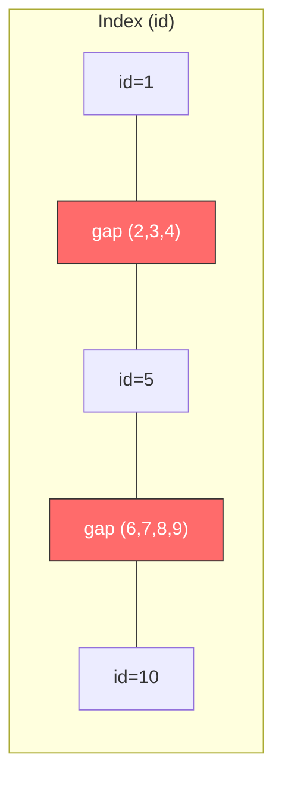
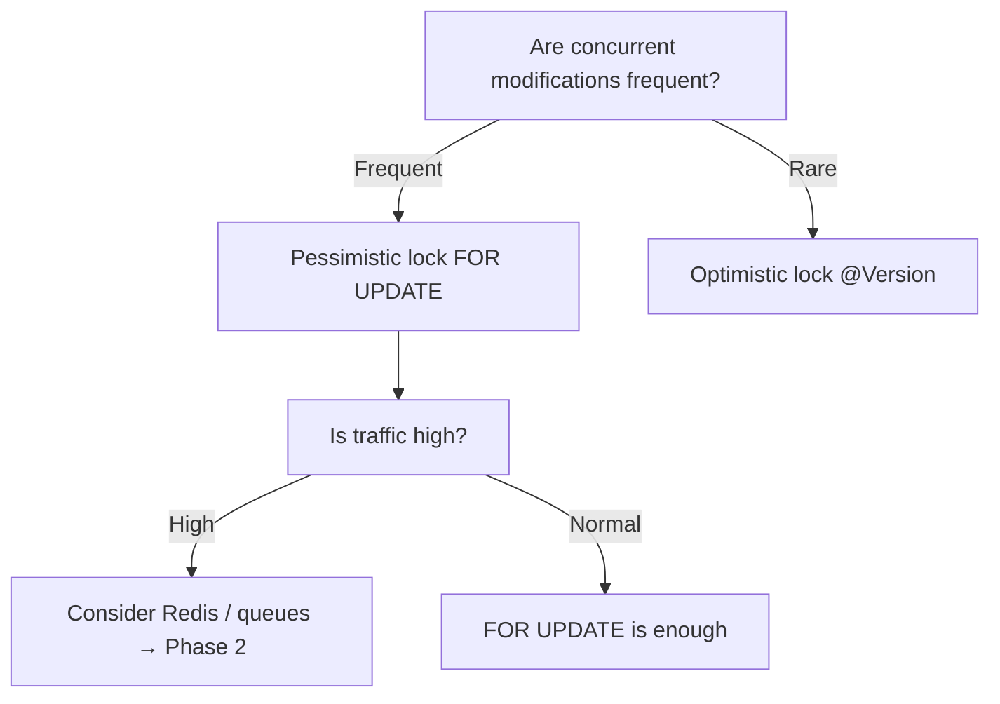

## Introduction

In the [previous post](/blog/en/db-isolation-level-guide), we covered isolation levels and concurrency anomalies. This post goes one level deeper — **"When do deadlocks actually occur, and how do we prevent them?"**

"Doesn't raising the isolation level make things safer?" — half right, half wrong. Higher isolation reduces anomalies, but **it also increases lock usage, which actually raises deadlock risk**.

---

## 1. What Is a Deadlock?

Two transactions waiting for each other's locks, **stuck forever**.

| Step | TX1 | TX2 | Status |
|:---:|------|------|:----:|
| 1 | `UPDATE ... WHERE id = 1` (lock id=1) | | |
| 2 | | `UPDATE ... WHERE id = 2` (lock id=2) | |
| 3 | `UPDATE ... WHERE id = 2` → waiting for id=2 ⏳ | | |
| 4 | | `UPDATE ... WHERE id = 1` → waiting for id=1 ⏳ | 💀 Deadlock! |

> **Analogy**: Two cars facing each other in a narrow alley. Both say "you go first" and neither moves. The DB detects this and **force-rolls back one side** to break the deadlock.

---

## 2. Deadlock Cases by Isolation Level

### 2.1 Deadlocks in Read Committed

Read Committed is relatively loose, yet deadlocks still occur. Why? **Reads don't lock, but writes (UPDATE/DELETE) still acquire row locks.**

#### Case 1: Cross-Update

The most common pattern. Two simultaneous transfers: A→B and B→A:

| Step | TX1 (A→B transfer) | TX2 (B→A transfer) | Status |
|:---:|-----------|-----------|:----:|
| 1 | `UPDATE balance WHERE id='A'` (lock A) | | |
| 2 | | `UPDATE balance WHERE id='B'` (lock B) | |
| 3 | `UPDATE balance WHERE id='B'` → waiting for B ⏳ | | |
| 4 | | `UPDATE balance WHERE id='A'` → waiting for A ⏳ | 💀 Deadlock! |

#### Case 2: Implicit Locks from FK Constraints

Deadlocks can occur without explicit UPDATEs. Inserting into a table with FKs places **shared locks on the parent table**:

```sql
-- orders table has user_id FK

-- TX1: Insert order for user 1 → shared lock on users(id=1)
INSERT INTO orders (user_id, product_id) VALUES (1, 100);

-- TX2: Update user 1 → needs exclusive lock on users(id=1)
UPDATE users SET updated_at = now() WHERE id = 1;
-- → Conflicts with TX1's shared lock!
```

> Tables with many FKs and frequent concurrent INSERTs and UPDATEs can produce unexpected deadlocks.

### 2.2 Deadlocks in Repeatable Read

Repeatable Read holds **more locks for longer** than Read Committed. In MySQL InnoDB, **Gap Locks** create additional deadlock risk.

#### What Are Gap Locks?

Gap Locks lock the **gaps between index records**. InnoDB uses them in Repeatable Read to prevent Phantom Reads.

#### How Is the Gap Range Determined?

Gaps are defined by **actual index values in the table**. If the products table has id = 1, 5, 10:

```
(-∞) ... [id=1] ... (2,3,4 empty) ... [id=5] ... (6,7,8,9 empty) ... [id=10] ... (+∞)
         actual row     gap (1,5)        actual row     gap (5,10)        actual row
```

Different data means different gaps. If id = 1, 3, 10 existed, gaps would be (1,3), (3,10), etc. **Without an index**, a full table scan occurs and **the entire range gets gap-locked** — the worst case scenario.

#### Example: Lock Range with BETWEEN

```sql
-- products table: id = 1, 5, 10

-- TX1: Query ids 3-7 (FOR UPDATE)
SELECT * FROM products WHERE id BETWEEN 3 AND 7 FOR UPDATE;
```

InnoDB internally uses **Next-Key Locks** (record lock + gap lock before it). Here's what actually gets locked:

| Target | Lock Type | Locked? | Explanation |
|--------|----------|:---:|-------------|
| id=1 | - | ❌ | Outside range, unaffected |
| (1, 5) gap | Gap Lock | 🔒 | INSERT(id=2,3,4) blocked |
| id=5 | Record Lock | 🔒 | Actual record within range |
| (5, 10) gap | Gap Lock | 🔒 | INSERT(id=6,7,8,9) blocked |
| id=10 | Next-Key Lock boundary | 🔒 | May be locked as scan endpoint |



Key takeaway: **Non-existent rows (id=3, 4, 6, 7) get locked, and even the scan boundary id=10 may be locked.** A wider range than expected gets locked, increasing deadlock risk.

#### Case: Gap Lock Deadlock

> products table: id = 1, 5, 10

| Step | TX1 | TX2 | Status |
|:---:|------|------|:----:|
| 1 | `SELECT ... WHERE id = 3 FOR UPDATE` → gap lock on 1~5 | | |
| 2 | | `SELECT ... WHERE id = 7 FOR UPDATE` → gap lock on 5~10 | |
| 3 | `INSERT (id=8)` → waiting for 5~10 gap ⏳ | | |
| 4 | | `INSERT (id=2)` → waiting for 1~5 gap ⏳ | 💀 Deadlock! |

Two transactions lock different gaps, then try to INSERT into each other's gaps. **This deadlock doesn't occur in Read Committed because Gap Locks don't exist there.**

### 2.3 Deadlocks in Serializable

Serializable is the strictest and has the **most frequent deadlocks**.

#### MySQL: Every SELECT Becomes FOR SHARE

```sql
-- In Serializable, this query:
SELECT balance FROM accounts WHERE id = 1;

-- Internally becomes:
SELECT balance FROM accounts WHERE id = 1 FOR SHARE;
```

Even reads acquire **shared locks**, so upgrading to exclusive locks for UPDATE frequently causes conflicts:

| Step | TX1 | TX2 | Status |
|:---:|------|------|:----:|
| 1 | `SELECT balance WHERE id=1` (shared lock) | | |
| 2 | | `SELECT balance WHERE id=1` (shared lock) | |
| 3 | `UPDATE balance WHERE id=1` → needs exclusive lock, waiting for TX2 ⏳ | | |
| 4 | | `UPDATE balance WHERE id=1` → needs exclusive lock, waiting for TX1 ⏳ | 💀 Deadlock! |

A simple read-then-write pattern causes deadlocks. **Concurrency drops dramatically in Serializable.**

#### PostgreSQL: SSI Is Different

PostgreSQL implements Serializable as SSI (Serializable Snapshot Isolation). It's conflict-detection based, not lock-based, so deadlocks are rare. Instead, you get **serialization failures**:

```
ERROR: could not serialize access due to concurrent update
```

Not a deadlock, but one transaction gets rolled back — retry logic is essential.

---

## 3. Pessimistic vs Optimistic Locking

Two philosophies for handling concurrency.

### 3.1 Pessimistic Lock

**"Assume conflicts will happen. Lock first."**

```sql
BEGIN;
SELECT * FROM products WHERE id = 1 FOR UPDATE;  -- Lock first!
-- Other transactions can't read or modify this row
UPDATE products SET stock = stock - 1 WHERE id = 1;
COMMIT;
```

```java
// Spring Boot
@Lock(LockModeType.PESSIMISTIC_WRITE)
@Query("SELECT p FROM Product p WHERE p.id = :id")
Product findByIdForUpdate(@Param("id") Long id);
```

| Pros | Cons |
|------|------|
| Guaranteed data consistency | Low concurrency (lock waiting) |
| Simple implementation | Deadlock risk |
| | Longer connection hold time |

**Best for**: Frequent conflicts (stock deduction, seat selection)

### 3.2 Optimistic Lock

**"Assume conflicts are rare. Proceed, then detect."**

Add a `version` column and check if it changed during UPDATE:

```sql
-- 1. Read (no lock)
SELECT id, stock, version FROM products WHERE id = 1;
-- → stock=10, version=3

-- 2. Update attempt (check version)
UPDATE products
SET stock = 9, version = 4
WHERE id = 1 AND version = 3;
-- → 0 rows affected? Someone else modified it → retry
```

```java
// Spring Boot - @Version annotation
@Entity
public class Product {
    @Id
    private Long id;
    private int stock;

    @Version
    private Long version;  // JPA manages this automatically
}
```

```java
// Retry logic
@Retryable(value = OptimisticLockingFailureException.class, maxAttempts = 3)
@Transactional
public void deductStock(Long productId) {
    Product product = productRepository.findById(productId).orElseThrow();
    if (product.getStock() <= 0) throw new SoldOutException();
    product.decreaseStock();
    // On COMMIT, version mismatch → OptimisticLockingFailureException → retry
}
```

| Pros | Cons |
|------|------|
| No locks, high concurrency | Retry cost on conflicts |
| No deadlocks | Retry explosion if conflicts are frequent |
| Short connection hold | Retry logic required |

**Best for**: Rare conflicts (post editing, settings updates)

### 3.3 Which One to Use?



| Situation | Recommendation |
|-----------|---------------|
| Stock deduction, seat selection | Pessimistic lock (`FOR UPDATE`) |
| Post editing, profile updates | Optimistic lock (`@Version`) |
| Thousands of concurrent requests/sec | Redis (next series) |

---

## 4. Deadlock Prevention Strategies

### 4.1 Consistent Lock Ordering

The root cause of deadlocks is **locking in different orders**. Always lock in the same order and cross-waiting never happens.

```java
// Bad: order not guaranteed
public void transfer(Long fromId, Long toId, int amount) {
    Account from = accountRepo.findByIdForUpdate(fromId);  // lock fromId
    Account to = accountRepo.findByIdForUpdate(toId);      // lock toId
}

// Good: always sort by ID ascending
public void transfer(Long fromId, Long toId, int amount) {
    Long firstId = Math.min(fromId, toId);
    Long secondId = Math.max(fromId, toId);

    Account first = accountRepo.findByIdForUpdate(firstId);   // smaller ID first
    Account second = accountRepo.findByIdForUpdate(secondId);  // larger ID second

    // Then determine from/to and execute transfer logic
}
```

### 4.2 Lock Timeouts

Don't wait forever. Set a timeout.

```sql
-- MySQL: give up after 5 seconds
SET innodb_lock_wait_timeout = 5;

-- PostgreSQL: give up after 5 seconds
SET lock_timeout = '5s';
```

```java
// Spring Boot JPA hint
@QueryHints(@QueryHint(name = "jakarta.persistence.lock.timeout", value = "5000"))
@Lock(LockModeType.PESSIMISTIC_WRITE)
@Query("SELECT p FROM Product p WHERE p.id = :id")
Product findByIdForUpdate(@Param("id") Long id);
```

### 4.3 Retry Logic

Deadlocks can't be completely prevented. When the DB detects one and rolls back a transaction, **the rolled-back side retries**.

```java
@Retryable(
    value = {DeadlockLoserDataAccessException.class, CannotAcquireLockException.class},
    maxAttempts = 3,
    backoff = @Backoff(delay = 100, multiplier = 2)  // 100ms, 200ms, 400ms
)
@Transactional
public void deductStock(Long productId) {
    Product product = productRepository.findByIdForUpdate(productId);
    if (product.getStock() <= 0) throw new SoldOutException();
    product.decreaseStock();
}
```

> **Note**: `@Retryable` must be on the outer layer, outside `@Transactional`. The transaction must be rolled back first, then retried with a new transaction. Same-class calls may not work due to proxy issues.

### 4.4 Keep Transactions Short

Longer lock hold time = higher deadlock probability. Never put **external API calls, file I/O, or heavy computation** inside a transaction.

```java
// Bad: external API call inside transaction
@Transactional
public void processOrder(Long productId) {
    Product p = productRepo.findByIdForUpdate(productId);  // lock acquired
    p.decreaseStock();
    externalPaymentApi.charge(order);  // 💀 3 seconds = lock held for 3 seconds
    emailService.sendConfirmation(order);  // 💀 more delay
}

// Good: transaction only for DB work
@Transactional
public void deductStock(Long productId) {
    Product p = productRepo.findByIdForUpdate(productId);
    p.decreaseStock();
}

// External calls outside transaction
public void processOrder(Long productId) {
    deductStock(productId);  // short transaction
    externalPaymentApi.charge(order);  // lock already released
    emailService.sendConfirmation(order);
}
```

---

## 5. Is REPEATABLE READ Enough for Stock Deduction?

Let's definitively answer this question from the previous post.

### Answer: No (in MySQL)

Repeatable Read guarantees **"the values you read won't change"**, NOT **"nobody else can modify at the same time."**

| Step | TX1 (Order A) | TX2 (Order B) | Stock |
|:---:|-----------|-----------|:----:|
| 1 | `SELECT stock` → **1** (snapshot) | | 1 |
| 2 | | `SELECT stock` → **1** (snapshot) | 1 |
| 3 | `UPDATE stock = 0` (1-1) | | 0 |
| 4 | `COMMIT` | | 0 |
| 5 | | `UPDATE stock = -1` (thinks stock is still 1) 💀 | -1 |
| 6 | | `COMMIT` | -1 |

Stock is negative! **Lost Update**.

### Adding FOR UPDATE Fixes It

| Step | TX1 (Order A) | TX2 (Order B) | Stock |
|:---:|-----------|-----------|:----:|
| 1 | `SELECT stock FOR UPDATE` → **1** (row lock acquired) | | 1 |
| 2 | | `SELECT stock FOR UPDATE` → waiting ⏳ | 1 |
| 3 | `UPDATE stock = 0` | | 0 |
| 4 | `COMMIT` (lock released) | | 0 |
| 5 | | → **0** (latest value!) → sold out | 0 |
| 6 | | `ROLLBACK` | 0 |

### The Isolation Level Doesn't Matter

With `FOR UPDATE`, **Read Committed and Repeatable Read behave identically.** The lock is what matters, not the isolation level.

**Practical recommendation: `Isolation.DEFAULT` + `FOR UPDATE`** — keep the DB default, control concurrency with explicit locks.

---

## 6. The Limits of FOR UPDATE

FOR UPDATE solves stock deduction, but **three bottlenecks emerge at high traffic**.

### 6.1 Request Serialization

```
100 concurrent users → FOR UPDATE → 1 processes, 99 wait → one at a time

TPS example:
  50ms per transaction × 100 users = up to 5s wait
  200ms per transaction × 1000 users = up to 200s wait 💀
```

### 6.2 Deadlock Risk

If a single order deducts stock + uses a coupon + deducts points, multiple rows get locked, increasing deadlock probability.

### 6.3 Connection Pool Exhaustion

Transactions waiting for locks **hold DB connections**. HikariCP default pool size is 10 — if all 10 are waiting for locks, new requests can't even get a connection.

```
[Request 101] → Connection pool empty → HikariCP timeout → Error!
```

### That's Why the Next Step Is Needed

| Limitation | Alternative |
|-----------|------------|
| Serialization bottleneck | Redis atomic operations (DECR) — tens of thousands TPS without locks |
| Deadlocks | Redis Lua scripts — single-threaded atomic execution |
| Connection exhaustion | Queue systems — reduce DB access entirely |

**This is the starting point for the next series (Phase 2: First-Come-First-Served System Design).**

---

## Summary

| Key Point | Details |
|-----------|---------|
| **Deadlocks occur at every isolation level** | Write locks exist regardless of isolation level |
| **Higher isolation = higher deadlock risk** | Gap Locks (Repeatable Read), shared locks (Serializable) |
| **Pessimistic vs Optimistic** | Frequent conflicts → pessimistic, rare conflicts → optimistic |
| **4 deadlock prevention principles** | Consistent lock order, timeouts, retries, short transactions |
| **Stock deduction's key is FOR UPDATE** | Isolation level doesn't matter — explicit locks guarantee safety |
| **FOR UPDATE's limits** | Serialization bottleneck, deadlocks, connection exhaustion → need Redis/queues |

The next posts begin **Phase 2: First-Come-First-Served System Design**. We'll go beyond DB locks to implement the system using Redis, message queues, tokens, and more.
