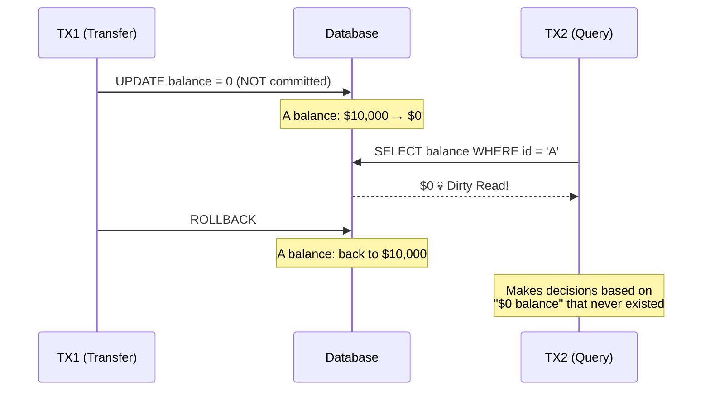
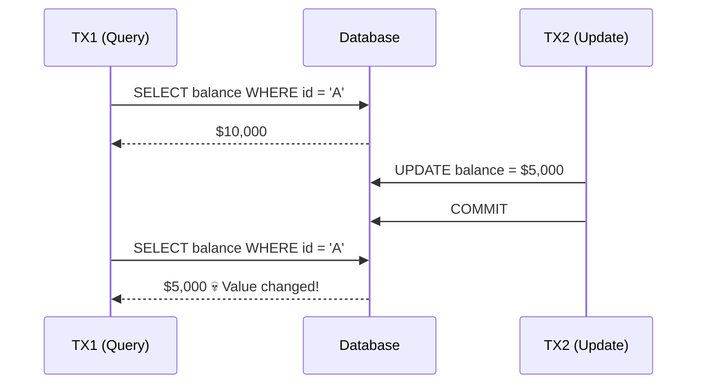
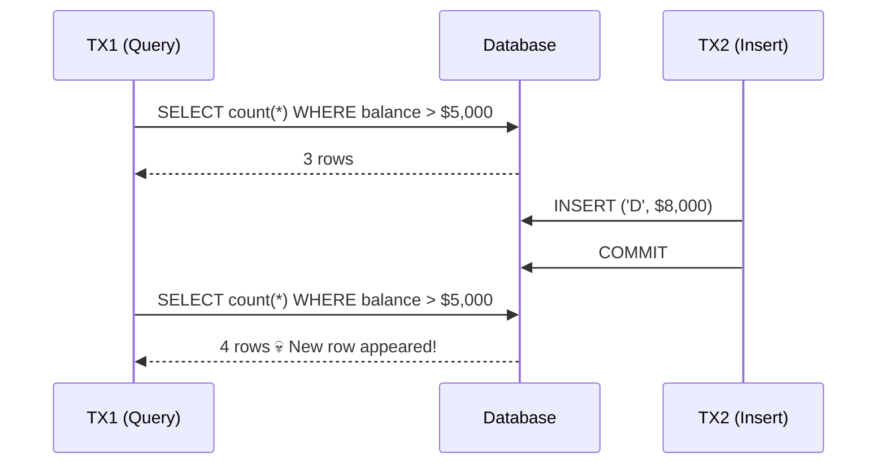
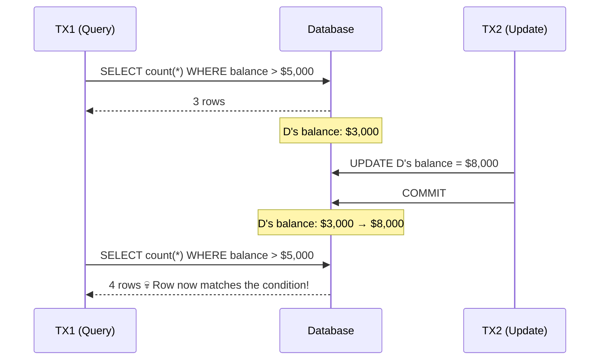
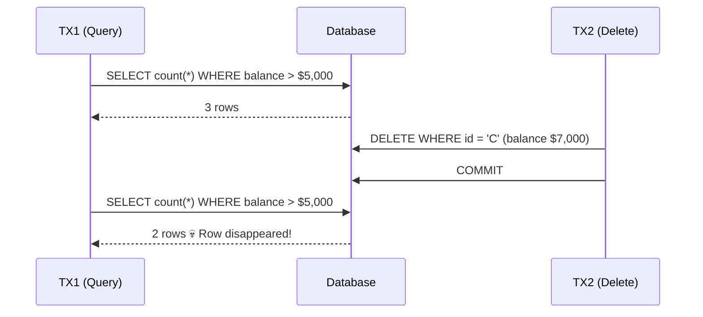
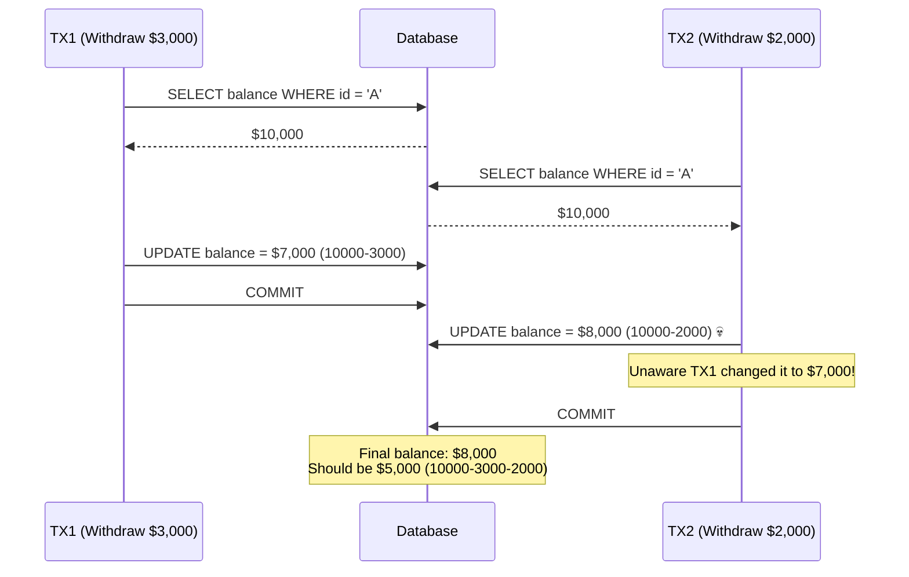
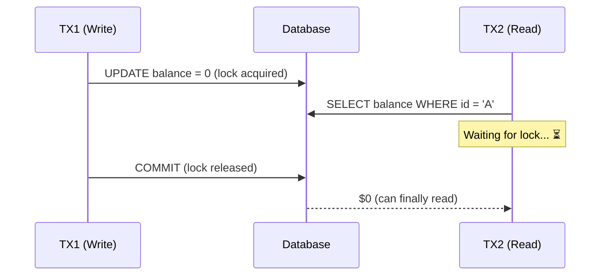
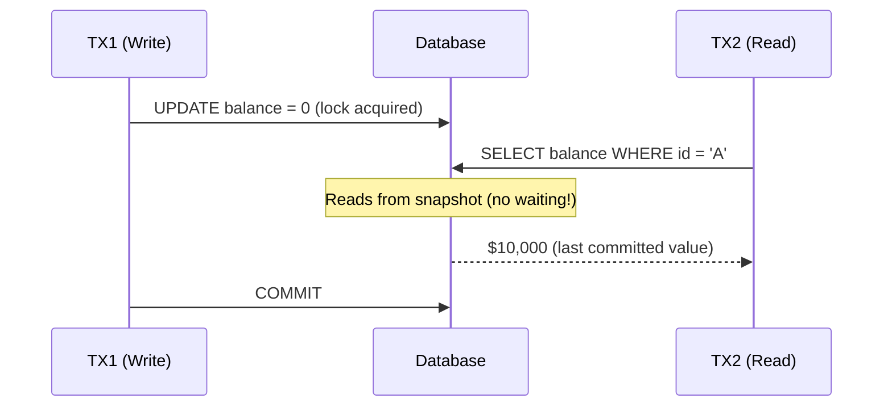

## Introduction

"What are transaction isolation levels?" — it comes up in interviews, and in production, it's a common root cause of concurrency bugs. But official docs make it feel abstract with heavy terminology.

This guide explains all 4 isolation levels through a single scenario: **bank account transfers**. You'll see exactly which problems occur at which level, and why.

---

## 1. What Is a Transaction?

Before isolation levels, let's clarify what a transaction is.

A transaction guarantees **"all or nothing."**

```sql
-- Transfer from account A to B: $1,000
BEGIN;
UPDATE accounts SET balance = balance - 1000 WHERE id = 'A';  -- Deduct from A
UPDATE accounts SET balance = balance + 1000 WHERE id = 'B';  -- Credit to B
COMMIT;
```

If only the first UPDATE succeeds and the second fails? A's money is gone but B never received it. Transactions prevent this — either both succeed, or both are rolled back.

### ACID in One Line Each

| Property | Meaning | Analogy |
|----------|---------|---------|
| **Atomicity** | All succeed or all fail | A package can't half-arrive |
| **Consistency** | Data rules hold before and after | Balance can't go negative |
| **Isolation** | Concurrent transactions don't interfere | Two ATMs withdrawing simultaneously don't corrupt data |
| **Durability** | Committed data persists permanently | Deposit records survive a power outage |

Today we're focusing on **Isolation**: "When multiple transactions run simultaneously, how much should they see of each other?"

---

## 2. Why Do We Need Isolation Levels?

Perfect isolation (= executing transactions one at a time) is possible, but **slow.**

```
User A's transaction completes → User B starts → completes → User C starts → ...
```

With 1,000 concurrent users, 999 are waiting. Not realistic.

So a trade-off emerged: **"Allow some interference in exchange for better performance."** The degree of that trade-off is what **isolation levels** define.

Higher isolation = safer but slower. Lower isolation = faster but weird things can happen.

```
Low ◄──────────────────────────────► High
Fast                                   Slow
Risky                                  Safe

Read Uncommitted → Read Committed → Repeatable Read → Serializable
```

---

## 3. Concurrency Anomalies

To understand isolation levels, you first need to know **"what goes wrong when isolation is insufficient?"** All examples start with **Account A balance: $10,000**.

### 3.1 Dirty Read

**Reading uncommitted data from another transaction.**



Transaction 1 rolled back, but Transaction 2 already read $0. It saw **data that never actually existed**.

Analogy: a teacher is in the middle of correcting a test score (not finalized yet) and someone reads that score.

### 3.2 Non-Repeatable Read

**Reading the same data twice in one transaction and getting different values.**



Same SELECT, different results. From Transaction 1's perspective: "Someone changed it while I was reading!"

Analogy: you're reading a book, step away to the restroom, and someone rewrites the page while you're gone.

### 3.3 Phantom Read

**Same query condition returns a different result set.** INSERT, UPDATE, and DELETE can all cause it.

#### Phantom Read from INSERT



#### Phantom Read from UPDATE



#### Phantom Read from DELETE



In summary, Phantom Read has three causes:

| Cause | What Happens |
|-------|-------------|
| **INSERT** | A new row appears like a phantom |
| **UPDATE** | A row that didn't match the condition now matches (or vice versa) |
| **DELETE** | An existing row disappears |

Analogy: you count students wearing glasses in a classroom — then a new student walks in (INSERT), a student puts on glasses (UPDATE), or a student wearing glasses leaves (DELETE).

### 3.4 Lost Update

**Two transactions modify the same data simultaneously, and one change is lost.**



Transaction 1's $3,000 deduction is completely lost. In a first-come-first-served system, this means **orders going through even when stock is zero**.

---

## 4. The Four Isolation Levels

### 4.1 Read Uncommitted (Level 0)

**The loosest isolation.** Can read uncommitted changes from other transactions.

```sql
SET TRANSACTION ISOLATION LEVEL READ UNCOMMITTED;
```

| Anomaly | Occurs? |
|---------|---------|
| Dirty Read | Yes |
| Non-Repeatable Read | Yes |
| Phantom Read | Yes |

> In practice, this level is **almost never used.** Only for extreme cases like "I need rough statistics fast." It's not the default in any major database.

### 4.2 Read Committed (Level 1)

**Only committed data is visible.** Prevents Dirty Reads, but the same query can return different values within one transaction.

```sql
SET TRANSACTION ISOLATION LEVEL READ COMMITTED;
```

| Anomaly | Occurs? |
|---------|---------|
| Dirty Read | No |
| Non-Repeatable Read | Yes |
| Phantom Read | Yes |

> **Default for PostgreSQL and Oracle.** Sufficient for most web services.

#### How It Works: Fresh Snapshot Per Query

Read Committed takes a **fresh snapshot of committed data** for each SELECT.

```
t1: Transaction starts
t2: SELECT → reads data committed as of t2
t3: (another transaction commits)
t4: SELECT → reads data committed as of t4 (t3's changes are visible!)
```

That's why results can differ within the same transaction (Non-Repeatable Read).

### 4.3 Repeatable Read (Level 2)

**Maintains a snapshot from when the transaction started.** The same SELECT always returns the same result throughout the transaction.

```sql
SET TRANSACTION ISOLATION LEVEL REPEATABLE READ;
```

| Anomaly | Occurs? |
|---------|---------|
| Dirty Read | No |
| Non-Repeatable Read | No |
| Phantom Read | Depends on DB |

> **Default for MySQL (InnoDB).** InnoDB uses MVCC + Next-Key Locks to prevent most Phantom Reads too.

#### How It Works: Snapshot Fixed at Transaction Start

```
t1: Transaction starts → snapshot fixed at this point!
t2: SELECT → sees t1's data
t3: (another transaction commits)
t4: SELECT → still sees t1's data (t3's changes are invisible!)
```

The key difference from Read Committed: **when the snapshot is taken**.

```
Read Committed:   new snapshot per SELECT
Repeatable Read:  snapshot fixed at transaction start, held until end
```

#### MySQL vs PostgreSQL Repeatable Read

This is important. Same name, different behavior:

| | MySQL (InnoDB) | PostgreSQL |
|--|---------------|------------|
| **Phantom Read prevention** | Yes (Next-Key Lock) | Yes (snapshot-based) |
| **Lost Update prevention** | No (explicit lock needed) | Yes (first updater wins, others error) |
| **Implementation** | MVCC + Gap Lock | MVCC (snapshot-based) |

In MySQL, even with Repeatable Read, you need `SELECT ... FOR UPDATE` to prevent Lost Updates.

### 4.4 Serializable (Level 3)

**The strictest isolation.** Transactions behave as if executed one at a time, sequentially.

```sql
SET TRANSACTION ISOLATION LEVEL SERIALIZABLE;
```

| Anomaly | Occurs? |
|---------|---------|
| Dirty Read | No |
| Non-Repeatable Read | No |
| Phantom Read | No |

All anomalies are blocked. But the cost is high:

```
Performance: can be 5-10x slower than Read Committed
Concurrency: conflicting transactions get rolled back
```

> Used only in systems where **correctness is critical**: financial settlements, seat assignments. Overkill for typical web services.

#### MySQL vs PostgreSQL Serializable

| | MySQL (InnoDB) | PostgreSQL |
|--|---------------|------------|
| **Implementation** | Converts all SELECTs to `SELECT ... FOR SHARE` (lock-based) | SSI (Serializable Snapshot Isolation, optimistic) |
| **Behavior** | Heavy locking, higher deadlock risk | Detects conflicts and rolls back, fewer locks |

---

## 5. Summary Comparison

| Isolation Level | Dirty Read | Non-Repeatable Read | Phantom Read | Performance |
|----------------|-----------|-------------------|-------------|-------------|
| **Read Uncommitted** | Yes | Yes | Yes | Fastest |
| **Read Committed** | No | Yes | Yes | Fast |
| **Repeatable Read** | No | No | Depends | Moderate |
| **Serializable** | No | No | No | Slow |

### Why Do Defaults Differ?

| Database | Default Level | Reason |
|----------|-------------|--------|
| **MySQL (InnoDB)** | Repeatable Read | Consistency guarantees for binary log replication |
| **PostgreSQL** | Read Committed | MVCC is strong enough for most cases |
| **Oracle** | Read Committed | Performance priority in high-concurrency environments |
| **SQL Server** | Read Committed | Same reasoning as Oracle. RCSI option changes behavior |

### Read Committed Snapshot Isolation (RCSI)

Not part of the SQL standard, but commonly encountered in practice — **Read Committed Snapshot Isolation (RCSI)**.

Regular Read Committed is **lock-based**. Reading a row that another transaction is writing requires **waiting for the lock to be released**:



RCSI solves this. **Reads don't acquire locks — they read the last committed snapshot instead:**



The key difference:

| | Regular Read Committed | RCSI |
|--|----------------------|------|
| **Read locks** | Shared locks (conflicts with write locks) | No locks (snapshot read) |
| **Reads vs Writes** | Block each other | Don't block each other |
| **Concurrency** | Lower | Higher |
| **Overhead** | Lock management | Version store in tempdb |

#### Database Support

| Database | RCSI Support | How to Enable |
|----------|-------------|---------------|
| **SQL Server** | Yes (DB option) | `ALTER DATABASE mydb SET READ_COMMITTED_SNAPSHOT ON` |
| **PostgreSQL** | Default behavior | MVCC always reads snapshots (no config needed) |
| **Oracle** | Default behavior | Undo segments always provide snapshots |
| **MySQL (InnoDB)** | Default behavior | MVCC provides snapshot reads in Read Committed |

> **Important**: PostgreSQL, Oracle, and MySQL already behave like RCSI in Read Committed (reads don't acquire locks). **Only SQL Server uses lock-based reads by default**, so RCSI must be explicitly enabled. If you're working with SQL Server, strongly consider enabling RCSI.

---

## 6. How to Choose in Practice

### Most web services → Read Committed

Forums, e-commerce, general API servers. Sufficient for the majority of cases. If you're using PostgreSQL, it's the default — no config needed.

### Business logic requiring correctness → Repeatable Read + explicit locks

Stock deduction, point deduction, seat selection. Don't just raise the isolation level — use `SELECT ... FOR UPDATE` to explicitly lock the rows you need.

```sql
BEGIN;
SELECT stock FROM products WHERE id = 1 FOR UPDATE;  -- Acquire lock
-- Check stock > 0
UPDATE products SET stock = stock - 1 WHERE id = 1;
COMMIT;
```

### Financial settlements, audit logs → Serializable

Systems where errors mean lost money or legal issues. Accept the performance cost for the highest isolation.

### Rough statistics, dashboards → Read Uncommitted (extremely rare)

"Roughly how many orders right now?" — queries that don't need precision. But Read Committed is fast enough that this is almost never used in practice.

---

## 7. Setting Isolation Levels in Spring Boot

### 7.1 How It Works

```java
@Transactional(isolation = Isolation.REPEATABLE_READ)
public void deductStock(Long productId) { ... }
```

When this is set, Spring internally executes the following when starting the transaction:

```
1. Enter @Transactional
2. Acquire Connection from DataSource
3. connection.setTransactionIsolation(TRANSACTION_REPEATABLE_READ)
   → Executes SET TRANSACTION ISOLATION LEVEL REPEATABLE READ on the DB
4. BEGIN
5. Execute business logic
6. COMMIT or ROLLBACK
7. Return Connection
```

This applies **only to that transaction** — it doesn't change the database's global default.

### 7.2 Isolation Level Support by Database

Not all databases support all 4 levels. If you set an unsupported level in Spring Boot, you'll get a runtime error.

| Isolation Level | MySQL | MariaDB | PostgreSQL | Oracle | SQL Server |
|----------------|:---:|:---:|:---:|:---:|:---:|
| **Read Uncommitted** | Yes | Yes | △ | No | Yes |
| **Read Committed** | Yes | Yes | Yes (**default**) | Yes (**default**) | Yes (**default**) |
| **Repeatable Read** | Yes (**default**) | Yes (**default**) | △ | No | Yes |
| **Serializable** | Yes | Yes | Yes | Yes | Yes |

**△ = Can be set but behaves differently, No = Not supported (error on set)**

### 7.3 Database-Specific Behavior

#### PostgreSQL

```
Read Uncommitted → Set it, but it behaves as Read Committed (Dirty Read never allowed)
Repeatable Read  → Works, but behaves close to Serializable (snapshot + first-updater-wins)
```

PostgreSQL never allows Dirty Reads by design. Think of it as having **3 effective levels**: Read Committed / Repeatable Read / Serializable (SSI).

#### Oracle

```
Read Uncommitted  → Not supported (error)
Repeatable Read   → Not supported (error)
```

**Only Read Committed and Serializable are supported.** Setting `Isolation.REPEATABLE_READ` in Spring Boot causes a runtime error.

```java
// This ERRORS on Oracle! (ORA-02179)
@Transactional(isolation = Isolation.REPEATABLE_READ)

// For Repeatable Read behavior on Oracle → use explicit locks
@Transactional
public void doSomething() {
    repository.findByIdForUpdate(id);  // SELECT ... FOR UPDATE
}
```

#### MySQL (InnoDB)

All 4 levels supported. Default is Repeatable Read. MVCC + Next-Key Lock prevents most Phantom Reads. However, **Lost Update is NOT prevented** → `FOR UPDATE` is needed.

#### MariaDB (InnoDB)

Behaves nearly identically to MySQL. All 4 levels supported, default Repeatable Read. Some internal implementation differences after MariaDB 10.5+, but isolation level behavior is the same.

#### SQL Server

All 4 levels supported + **Snapshot Isolation** as a 5th level. Default Read Committed is lock-based, so enabling RCSI is recommended.

```sql
-- SQL Server only: enable Snapshot Isolation
ALTER DATABASE mydb SET ALLOW_SNAPSHOT_ISOLATION ON;
SET TRANSACTION ISOLATION LEVEL SNAPSHOT;
```

### 7.4 Code Examples

```java
// Set isolation level per method
@Transactional(isolation = Isolation.REPEATABLE_READ)
public void deductStock(Long productId) {
    Product product = productRepository.findByIdForUpdate(productId);
    if (product.getStock() <= 0) {
        throw new SoldOutException();
    }
    product.decreaseStock();
}
```

```java
// FOR UPDATE in Repository (pessimistic lock)
public interface ProductRepository extends JpaRepository<Product, Long> {

    @Lock(LockModeType.PESSIMISTIC_WRITE)
    @Query("SELECT p FROM Product p WHERE p.id = :id")
    Product findByIdForUpdate(@Param("id") Long id);
}
```

### 7.5 Gotchas

```java
// 1. Isolation.DEFAULT → uses the DB's default (safest choice)
@Transactional(isolation = Isolation.DEFAULT)
// MySQL: Repeatable Read, PostgreSQL/Oracle/SQL Server: Read Committed

// 2. Nested transactions: inner transaction's isolation is IGNORED
@Transactional(isolation = Isolation.SERIALIZABLE)
public void outer() {
    inner();  // inner's REPEATABLE_READ is ignored, outer's SERIALIZABLE applies
}

@Transactional(isolation = Isolation.REPEATABLE_READ)
public void inner() { ... }
```

### 7.6 Practical Recommendations

| Situation | Recommended Setting |
|-----------|-------------------|
| General CRUD | `Isolation.DEFAULT` (use DB's default) |
| Stock/point deduction | `Isolation.DEFAULT` + `@Lock(PESSIMISTIC_WRITE)` |
| Multi-DB support needed | `Isolation.DEFAULT` + explicit locks (avoids DB differences) |
| Financial settlements | `Isolation.SERIALIZABLE` (supported by Oracle too) |
| Oracle projects | `Isolation.DEFAULT` + `FOR UPDATE` (REPEATABLE_READ unavailable) |

---

## Summary

| Key Point | Details |
|-----------|---------|
| **What are isolation levels?** | Settings that control how much concurrent transactions can see each other's data |
| **Higher = safer, lower = faster** | It's a trade-off. Always choosing the highest isn't the answer |
| **Production defaults** | PostgreSQL/Oracle → Read Committed, MySQL → Repeatable Read |
| **For first-come-first-served?** | Read Committed + explicit locks (`FOR UPDATE`) is the standard approach |

In the next post, we'll cover **real deadlock scenarios at each isolation level** and how to prevent them.
