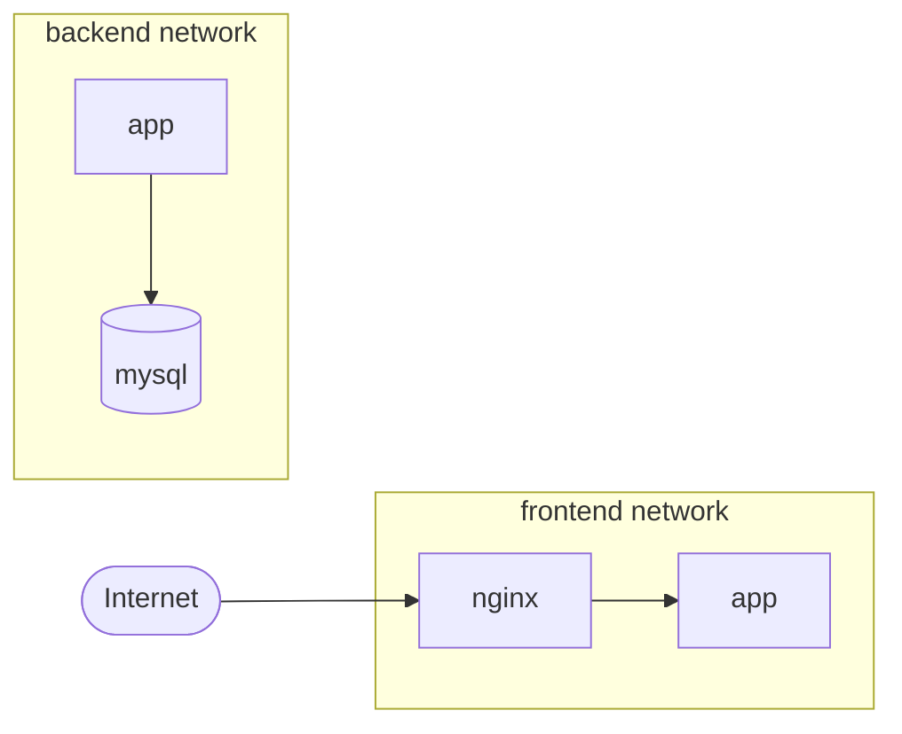
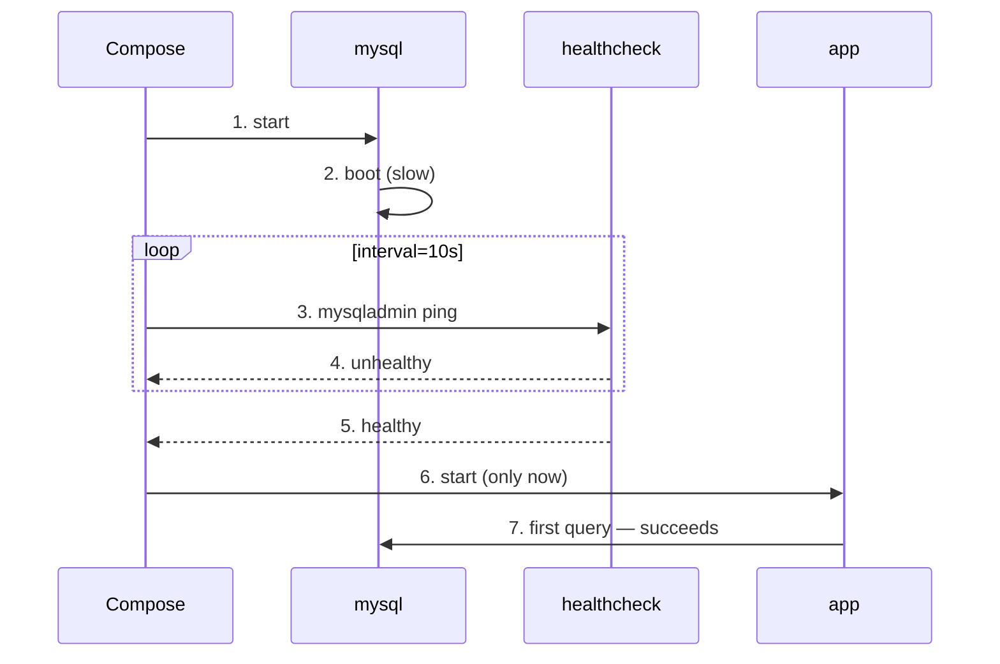

## Introduction

"To run Spring Boot locally I need to start MySQL, then Redis, then build the app, then export the env vars…" — this dance ends in `start-local.sh`, which the next person on the team will inevitably break.

Docker Compose replaces that `.sh` with <strong>declarative YAML</strong>. You write down which containers belong to which networks, what volumes they use, and the order they should start in — then `docker compose up -d` does the rest.

This guide is for engineers who are new to Compose, or who have copy-pasted Compose files without quite knowing what `services`, `networks`, and `volumes` actually do. After reading it, you should know <strong>why</strong> things are written the way they are, and how to avoid the classic traps — like trusting `depends_on` and watching your app crash before the DB is ready.

---

## TL;DR

- <strong>The point of Compose</strong> is to replace a sequence of `docker run` commands with a YAML declaration and to bind containers in the same project to a <strong>shared network and lifecycle</strong>.
- <strong>`services` / `networks` / `volumes`</strong> are the three top-level keys. Services in one file automatically join the same network, and <strong>service name = DNS</strong> — they find each other by name.
- <strong>`depends_on` alone only guarantees start order.</strong> It does not mean "the DB is ready to accept queries." Pair it with `condition: service_healthy` and a real `healthcheck` to express true readiness.
- <strong>Don't cram dev and prod into one file.</strong> Use a base file plus override files (`-f` merging) or `profiles`. Hot-reload bind mounts go in dev only; resource limits and pinned tags go in prod only.
- <strong>Four real-world traps</strong>: committing `.env`, macOS bind mount I/O cost, runaway container logs, and still writing `version: "3.8"` — Compose v2 ignores that field.

---

## 1. What Compose Solves

### 1.1 The limits of stacked `docker run`

Spinning up the same setup with raw `docker run` looks like this:

```bash
docker network create app-net
docker volume create mysql-data

docker run -d --name mysql --network app-net \
  -e MYSQL_ROOT_PASSWORD=rootpw -e MYSQL_DATABASE=mydb \
  -v mysql-data:/var/lib/mysql mysql:8.0

docker run -d --name redis --network app-net redis:7-alpine

docker run -d --name app --network app-net -p 8080:8080 \
  -e SPRING_DATASOURCE_URL=jdbc:mysql://mysql:3306/mydb \
  -e SPRING_DATA_REDIS_HOST=redis myapp:latest
```

The problem isn't the length of the commands. It's that <strong>this state lives only in shell history</strong>. Who ran what, in what order, with which env vars — none of it is captured anywhere durable. The next teammate debugs from scratch.

### 1.2 The same picture in Compose

Move that setup into Compose and it collapses to:

```yaml
services:
  mysql:
    image: mysql:8.0
    environment:
      MYSQL_ROOT_PASSWORD: rootpw
      MYSQL_DATABASE: mydb
    volumes:
      - mysql-data:/var/lib/mysql

  redis:
    image: redis:7-alpine

  app:
    image: myapp:latest
    ports: ["8080:8080"]
    environment:
      SPRING_DATASOURCE_URL: jdbc:mysql://mysql:3306/mydb
      SPRING_DATA_REDIS_HOST: redis
    depends_on: [mysql, redis]

volumes:
  mysql-data:
```

Five things happen at once:

- <strong>Network is created automatically</strong> — every service in the file joins the same network. No `docker network create`.
- <strong>Service name = DNS</strong> — from the `app` container, `mysql:3306` just works. No `--link`, no hardcoded IPs.
- <strong>Volume and network lifecycle is per project</strong> — `docker compose down` cleans them all up.
- <strong>The declaration is the documentation</strong> — anyone with `docker-compose.yml` can reproduce the environment.
- <strong>Diff-friendly</strong> — check it into Git and review changes via PRs.

### 1.3 Aside: Compose v1 (`docker-compose`) vs v2 (`docker compose`)

There's a reason you see the command written two different ways.

| Aspect | v1 | v2 |
| --- | --- | --- |
| Invocation | `docker-compose` (hyphen) | `docker compose` (space) |
| Implementation | Standalone Python binary | Docker CLI plugin (Go) |
| Status | EOL since 2023 | Current standard |
| `version:` field | Meaningful | <strong>Ignored</strong> |

For anything new, assume <strong>v2</strong>. `version: "3.8"` is a v1-era schema marker; v2 ignores it. If you copy an old guide and hit `docker-compose: command not found`, just use the space form.

---

## 2. services — The Core of Container Definition

Each entry under `services` is one container (or a group, if you scale).

### 2.1 image vs build — Two Starting Points

| Approach | When to use it | Example |
| --- | --- | --- |
| `image:` | When you reuse an external image as-is (DB, cache, broker, …) | `image: mysql:8.0` |
| `build:` | When you need to build an image from this project's code | `build: .` |
| Both | Tag and cache the build output for reuse | `image: myapp:dev` + `build: .` |

```yaml
services:
  app:
    image: myapp:dev          # Tag for the built image
    build:
      context: .              # Path containing the Dockerfile
      dockerfile: Dockerfile  # Default, usually omitted
      args:
        JAR_FILE: build/libs/*.jar
      target: runtime         # Final stage of a multi-stage build
```

### 2.2 Common Service Options at a Glance

| Option | Role | Notes |
| --- | --- | --- |
| `container_name` | Pin a container name | Usually skip it. Same name conflict → no scale-out |
| `restart` | Exit policy | `no` / `always` / `on-failure` / `unless-stopped` |
| `ports` | Host:container port mapping | Only when external access is needed |
| `expose` | Publish ports to other services only | Not mapped to the host |
| `environment` | Env vars | List or map (see 2.4) |
| `env_file` | Read env from file(s) | Useful for separating secrets |
| `volumes` | Volumes / mounts | See section 3 |
| `depends_on` | Start order / health gating | See section 5 |
| `command` | Override CMD | Replaces the Dockerfile `CMD` |
| `entrypoint` | Override ENTRYPOINT | Frequently used for debugging |
| `healthcheck` | Health rule | See section 5 |

> <strong>Note</strong>: `container_name` enforces a single container of that name per host. The moment you do `docker compose up --scale app=3`, or run two environments side by side on the same machine, you hit a collision. Outside of debugging, leaving it off is safer.

### 2.3 Four Ways to Set Environment Variables

There are four routes — easy to confuse.

```yaml
services:
  app:
    # 1) Inline map — clearest
    environment:
      SPRING_PROFILES_ACTIVE: local
      DB_HOST: mysql

    # 2) Inline list — same idea, = syntax
    # environment:
    #   - SPRING_PROFILES_ACTIVE=local
    #   - DB_HOST=mysql

    # 3) Separate file
    env_file:
      - .env
      - .env.local

    # 4) Variable substitution inside the Compose file (host shell / .env)
    image: myapp:${APP_VERSION:-latest}
    ports:
      - "${APP_PORT:-8080}:8080"
```

One rule keeps things straight: <strong>secrets in `.env` (or a secrets manager); regular config in `environment`</strong>. `${VAR:-default}` is resolved <strong>when Compose parses the file</strong> against the host shell and the sibling `.env`, while options 1–3 set <strong>variables inside the container</strong>. If you remember nothing else, remember that distinction.

### 2.4 Aside: List vs Map for `environment`

The two forms produce the same outcome but read differently.

```yaml
# List
environment:
  - DB_HOST=mysql
  - JAVA_TOOL_OPTIONS=-Xms256m -Xmx512m

# Map
environment:
  DB_HOST: mysql
  JAVA_TOOL_OPTIONS: "-Xms256m -Xmx512m"
```

- <strong>Map form</strong> separates keys from values cleanly — better autocompletion, sorting, and diffs.
- <strong>List form</strong> handles values containing `=` without ceremony, and lets you forward a host shell variable by name (`- HOME`).

Default to the map; reach for the list in special cases. That's enough.

---

## 3. volumes — Persistence and Mount Modes

When a container exits, its disk is gone. Anything that must outlive that — DB data, logs, source for hot reload — has to live on a volume.

### 3.1 Named Volume vs Bind Mount

| Type | Lives where | Pros | Cons | Typical use |
| --- | --- | --- | --- | --- |
| Named Volume | Docker-managed (`/var/lib/docker/volumes/...`) | Portable, permissions handled | Awkward to edit from the host | DB data directory |
| Bind Mount | Arbitrary host path | Host files visible directly | OS-specific perf/permissions | Hot-reload source, config files |

```yaml
services:
  mysql:
    image: mysql:8.0
    volumes:
      - mysql-data:/var/lib/mysql           # Named volume

  app:
    build: .
    volumes:
      - ./src:/app/src                      # Bind mount
      - ./config:/app/config:ro             # Read-only

volumes:
  mysql-data:                               # Named volume declaration
```

### 3.2 Long Syntax — When You Need Options

When the short form runs out of room, switch to long syntax.

```yaml
services:
  app:
    volumes:
      - type: volume
        source: mysql-data
        target: /var/lib/mysql
      - type: bind
        source: ./logs
        target: /app/logs
        read_only: false
        bind:
          create_host_path: true            # Create the host path if missing
```

### 3.3 Aside: Why bind mounts are slow on macOS/Windows

Docker Desktop on macOS and Windows runs containers inside a <strong>lightweight VM</strong>. Your host's `./src` is shared into that VM via a compatibility filesystem, and every read/write crosses that boundary. Directories like `node_modules` — tens of thousands of tiny files — pay that cost on every build and startup.

Three remedies:

- <strong>Mount less</strong> — push build output and dependency directories into named volumes; bind-mount only source.
- <strong>`:cached` / `:delegated`</strong> (macOS) — relax consistency for speed. For read-only mounts, `:cached` is the safest pick.
- <strong>Switch the virtualization backend</strong> — VirtioFS in current Docker Desktop / Orbstack is dramatically faster.

```yaml
volumes:
  - ./src:/app/src:cached     # Common option on macOS
```

---

## 4. networks — Talking Between Services

### 4.1 The default network — there even when you don't write it

Omit `networks:` entirely and Compose still creates a <strong>default bridge network</strong> per project, attaching every service. That's why `app` can talk to `mysql:3306` with zero config.

```yaml
services:
  app:
    image: myapp
  mysql:
    image: mysql:8.0
# Even without a `networks` key, both services share one network
```

### 4.2 Custom Networks for Isolation

When you want DMZ-style separation between front and back.



`app` straddles both; `nginx` only sees frontend, `mysql` only sees backend.

```yaml
services:
  nginx:
    image: nginx
    networks: [frontend]

  app:
    image: myapp
    networks: [frontend, backend]

  mysql:
    image: mysql:8.0
    networks: [backend]

networks:
  frontend:
    driver: bridge
  backend:
    driver: bridge
```

### 4.3 Joining an External Network

When another Compose project already created the network you want.

```yaml
networks:
  shared-net:
    external: true     # Declared elsewhere; Compose neither creates nor deletes it
```

With `external: true`, Compose won't create or remove the network. This is the pattern when several Compose projects share, say, one Redis: each app project joins a common network without owning it.

---

## 5. depends_on + healthcheck — A Reliable Start Order

This is the single most-misunderstood corner of Compose.

### 5.1 Bare `depends_on` only guarantees start order

```yaml
services:
  app:
    depends_on:
      - mysql
```

This says only: <strong>"start `mysql` before `app`."</strong> It does <strong>not</strong> say MySQL is ready to accept queries. So `app` boots first, gets `Connection refused`, and falls into a restart loop.

### 5.2 `condition: service_healthy` — health gating

To actually wait for "DB is ready," combine a healthcheck with the right condition.

```yaml
services:
  app:
    depends_on:
      mysql:
        condition: service_healthy
      redis:
        condition: service_started

  mysql:
    image: mysql:8.0
    healthcheck:
      test: ["CMD", "mysqladmin", "ping", "-h", "localhost"]
      interval: 10s
      timeout: 5s
      retries: 5
      start_period: 30s
```



The valid `condition` values:

| Value | Meaning |
| --- | --- |
| `service_started` | Just needs to be started (default behavior) |
| `service_healthy` | Wait until `healthcheck` reports healthy |
| `service_completed_successfully` | Wait for a one-shot container (e.g. a migration runner) to exit with 0 |

### 5.3 Writing a Useful healthcheck

The four timing parameters mean different things.

| Parameter | Meaning | Typical value |
| --- | --- | --- |
| `interval` | Probe frequency | 10s |
| `timeout` | Per-probe deadline | 5s |
| `retries` | Consecutive failures before marking unhealthy | 5 |
| `start_period` | Grace window where failures don't count | 30s (longer for DBs) |

People skip `start_period` constantly. MySQL or Postgres first-boot — including initialization scripts — easily takes 30–60 seconds, and a too-short `start_period` flags a perfectly healthy container as unhealthy.

### 5.4 Aside: What `depends_on` won't fix — application-level retries

Even `depends_on + healthcheck` isn't a cure-all.

- <strong>Mid-flight DB restarts</strong>: if the DB blips while everything is already up, `depends_on` doesn't fire again.
- <strong>Outside Compose</strong>: containers on different hosts — Compose has no view of those dependencies.

That's why production code always layers in <strong>connection-pool retries / backoff</strong> (HikariCP `connectionTimeout`, Lettuce reconnect, Spring `@Retryable`, …). Compose's health gate is a <strong>startup-only</strong> safety net.

---

## 6. End-to-End Example — Spring Boot + MySQL + Redis

A working setup that combines everything in §1–5.

<details>
<summary><strong>docker-compose.yml — full</strong></summary>

```yaml
services:
  app:
    image: myapp:dev
    build:
      context: .
      dockerfile: Dockerfile
    restart: unless-stopped
    ports:
      - "${APP_PORT:-8080}:8080"
    environment:
      SPRING_PROFILES_ACTIVE: local
      SPRING_DATASOURCE_URL: jdbc:mysql://mysql:3306/mydb?useSSL=false&allowPublicKeyRetrieval=true
      SPRING_DATASOURCE_USERNAME: ${DB_USER:-user}
      SPRING_DATASOURCE_PASSWORD: ${DB_PASSWORD:-password}
      SPRING_DATA_REDIS_HOST: redis
      SPRING_DATA_REDIS_PORT: 6379
    depends_on:
      mysql:
        condition: service_healthy
      redis:
        condition: service_started
    networks: [app-network]

  mysql:
    image: mysql:8.0
    restart: unless-stopped
    environment:
      MYSQL_ROOT_PASSWORD: ${DB_ROOT_PASSWORD:-rootpassword}
      MYSQL_DATABASE: mydb
      MYSQL_USER: ${DB_USER:-user}
      MYSQL_PASSWORD: ${DB_PASSWORD:-password}
      TZ: Asia/Seoul
    volumes:
      - mysql-data:/var/lib/mysql
      - ./init.sql:/docker-entrypoint-initdb.d/init.sql:ro
    healthcheck:
      test: ["CMD", "mysqladmin", "ping", "-h", "localhost"]
      interval: 10s
      timeout: 5s
      retries: 5
      start_period: 30s
    networks: [app-network]

  redis:
    image: redis:7-alpine
    restart: unless-stopped
    command: redis-server --appendonly yes
    volumes:
      - redis-data:/data
    networks: [app-network]

networks:
  app-network:
    driver: bridge

volumes:
  mysql-data:
  redis-data:
```

</details>

<details>
<summary><strong>Dockerfile — multi-stage build</strong></summary>

```dockerfile
FROM eclipse-temurin:17-jdk AS builder
WORKDIR /app
COPY gradlew .
COPY gradle gradle
COPY build.gradle settings.gradle ./
COPY src src
RUN chmod +x ./gradlew && ./gradlew bootJar --no-daemon

FROM eclipse-temurin:17-jre AS runtime
WORKDIR /app
COPY --from=builder /app/build/libs/*.jar app.jar
EXPOSE 8080
ENTRYPOINT ["java", "-jar", "app.jar"]
```

</details>

<details>
<summary><strong>.env — secrets out of the YAML</strong></summary>

```properties
DB_ROOT_PASSWORD=rootpassword
DB_USER=user
DB_PASSWORD=password
APP_PORT=8080
```

</details>

> <strong>Warning</strong>: always add `.env` to `.gitignore`. Don't ship the example values to production — secrets belong in a real secrets manager (AWS Secrets Manager, HashiCorp Vault, etc.).

---

## 7. Separating Environments — Don't Cram dev and prod Together

> <strong>Note</strong>: "prod" in this section means the <strong>self-hosted, single-host scenario</strong> — a small VPS, an internal tool, a homelab, an MVP. Compose v2 is a single-host orchestrator: no multi-node scheduling, no rolling deploys, no autoscaling, no first-class secrets. Once you need any of that for real production traffic, the right answer is not Compose — it's <strong>Kubernetes (EKS/GKE) or ECS/Nomad</strong>. The patterns below are only valid inside that boundary.

A single YAML branched with if-style conditionals quickly becomes unreadable. Two standard patterns work well.

### 7.1 Base + override (`-f` merging)

```bash
# Development
docker compose -f docker-compose.yml -f docker-compose.dev.yml up -d

# Production
docker compose -f docker-compose.yml -f docker-compose.prod.yml up -d
```

When the same key appears in both files, <strong>the later file wins</strong> (deep merge). The base holds shared config; overrides hold per-environment differences.

<details>
<summary><strong>docker-compose.dev.yml — hot reload + debug</strong></summary>

```yaml
services:
  app:
    build:
      target: builder           # Use the builder stage of the multi-stage build
    volumes:
      - ./src:/app/src:cached   # Source hot reload
    environment:
      SPRING_PROFILES_ACTIVE: dev
      JAVA_TOOL_OPTIONS: "-agentlib:jdwp=transport=dt_socket,server=y,suspend=n,address=*:5005"
    ports:
      - "5005:5005"             # Debugger port
```

</details>

<details>
<summary><strong>docker-compose.prod.yml — resource limits, pinned tags</strong></summary>

```yaml
services:
  app:
    image: myregistry/myapp:${TAG:-latest}
    build: !reset null          # Don't build in prod; pull from the registry
    restart: always
    deploy:
      resources:
        limits:
          cpus: "2"
          memory: 2G
    logging:
      driver: json-file
      options:
        max-size: "10m"
        max-file: "3"
```

</details>

### 7.2 Profiles — Toggling Within a Single File

Tag a service with `profiles:` and it only starts when that profile is active.

```yaml
services:
  app-dev:
    build: .
    volumes: ["./src:/app/src"]
    profiles: [dev]

  app-prod:
    image: myapp:${TAG:-latest}
    profiles: [prod]

  mysql:
    image: mysql:8.0
    # No profiles = always running
```

```bash
docker compose --profile dev up -d
docker compose --profile prod up -d
```

| Pattern | Best for |
| --- | --- |
| `-f` base + override | Many differences (ports, mounts, build targets) |
| `profiles` | Differences are "on/off" (toggling optional services) |

---

## 8. Four Real-World Pitfalls

These trip teams up more than any feature does.

### 8.1 `.env` committed to Git

`.env` files start with placeholder values, get committed casually, and once pushed they live in Git history forever.

- <strong>Always</strong> add `.env` to `.gitignore`.
- Commit a `.env.example` with placeholders for the team.
- If a real `.env` already shipped: rotate the keys, then scrub history with `git filter-repo` or BFG.

### 8.2 macOS bind-mount I/O cost

As covered in §3.3, bind mounts are expensive on macOS. The symptom is <strong>builds and startups that are abnormally slow only on local machines</strong>. Move directories the host doesn't need to see — `node_modules`, `target/`, `.gradle/` — into named volumes.

### 8.3 Container logs that grow forever

The default `json-file` log driver doesn't rotate. Days later, `/var/lib/docker` fills up and the host falls over.

```yaml
services:
  app:
    logging:
      driver: json-file
      options:
        max-size: "10m"
        max-file: "3"
```

In production, set the same defaults at the daemon level (`/etc/docker/daemon.json`) so any forgotten service inherits sane rotation.

### 8.4 No resource limits

Without `deploy.resources.limits`, one container's memory leak takes down the whole host. JVMs are particularly bad: some versions still see the host's full memory inside a container and size the heap accordingly. Explicit limits are a safety net.

```yaml
services:
  app:
    deploy:
      resources:
        limits:
          cpus: "1"
          memory: 1G
        reservations:
          cpus: "0.5"
          memory: 512M
```

> <strong>Note</strong>: the `deploy:` block was originally Swarm-only, and Compose v2 standalone (`docker compose up`) honors <strong>only `resources.limits` / `resources.reservations`</strong>. Multi-node fields like `replicas`, `update_config`, `placement`, and `restart_policy` only make sense under Swarm and are silently ignored in standalone mode (use the service-level `restart:` instead of `restart_policy`).

---

## 9. Cheat Sheet — Common Commands

```bash
# Lifecycle
docker compose up -d               # Start in background
docker compose up                  # Foreground (logs attached)
docker compose down                # Tear down containers + network
docker compose down -v             # Also delete volumes (careful!)
docker compose restart app         # Restart one service

# Build
docker compose build               # Build images
docker compose build --no-cache    # Build ignoring cache
docker compose up -d --build       # Build then start

# Inspect
docker compose ps                  # Service status
docker compose logs -f app         # Follow logs
docker compose top                 # Process view
docker compose config              # Final merged config (best debug tool)

# Enter
docker compose exec app /bin/sh    # Shell into a running container
docker compose run --rm app gradle test   # One-off run
```

> <strong>Bottom line</strong>: when something feels off, <strong>`docker compose config`</strong> is the first thing to run. It prints the YAML Compose actually sees, with variables substituted, files merged, and defaults filled in. Empty env vars and surprise mount paths fall out immediately.

---

## Recap

The five takeaways:

1. <strong>Compose's job is to replace stacked `docker run` with a declaration and to bind containers per project.</strong> Services in one file share a network and find each other by name.
2. <strong>`services` / `networks` / `volumes`</strong> are the three top-level keys. A correct mental model of these three solves most debugging on its own.
3. <strong>`depends_on` alone only guarantees start order.</strong> To express "DB is ready to accept queries," combine `condition: service_healthy` with a real `healthcheck` and a sensible `start_period`. Mid-flight blips still need application-level retries.
4. <strong>Don't cram dev and prod into one file.</strong> Split with base + override or profiles. Hot-reload bind mounts go in dev; resource limits, log rotation, and pinned tags go in prod.
5. <strong>The four most common production traps</strong>: committing `.env`, macOS bind mount cost, runaway logs, missing resource limits. Operational hygiene causes more incidents than feature gaps do.

If you're brand new, §1–3 (services, volumes, networks) is the core; §4–5 (`-f` merging, profiles, traps) is something you'll re-open as needed. The single best habit to build: <strong>run `docker compose config` whenever something is unclear</strong> — it shows the YAML that Compose actually applies, not the one you think you wrote.

---

## Appendix — Options & Acronym Cheat Sheet

For quick re-reference while reading.

| Item | Meaning |
| --- | --- |
| Compose v2 | Go-based plugin integrated into Docker CLI. Invoked as `docker compose ...`. v1 (`docker-compose`) is EOL |
| `services` | Top-level key for container definitions |
| `networks` | Network definitions for inter-container communication |
| `volumes` | Persistent data (named volumes, externals, etc.) |
| `depends_on` | Start order, optionally with health gating |
| `healthcheck` | Container health rule. `test` / `interval` / `timeout` / `retries` / `start_period` |
| `restart` | Exit policy. `no` / `always` / `on-failure` / `unless-stopped` |
| `expose` vs `ports` | `expose` is service-network only; `ports` maps to the host |
| Named Volume | Docker-managed volume, easy on portability and permissions |
| Bind Mount | Mount of an arbitrary host path; used for hot reload and config files |
| `.env` | File Compose reads automatically. Never commit |
| `${VAR:-default}` | Variable substitution in the Compose file with a fallback |
| `-f` merging | Deep-merge multiple Compose files; the base + override pattern |
| `profiles` | Toggle services within a single file via `--profile <name>` |
| `deploy.resources` | CPU/memory limits and reservations. Honored by Compose v2 `up` |
