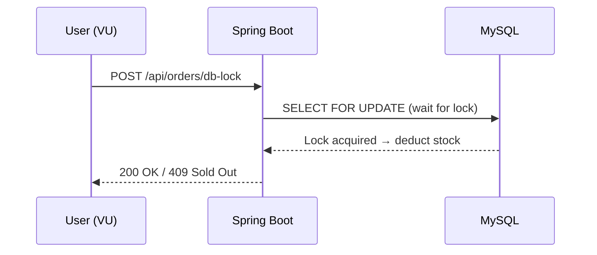
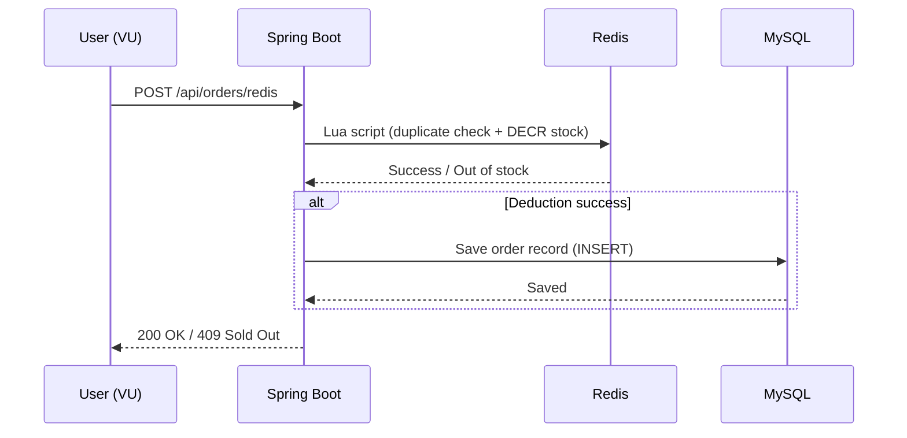
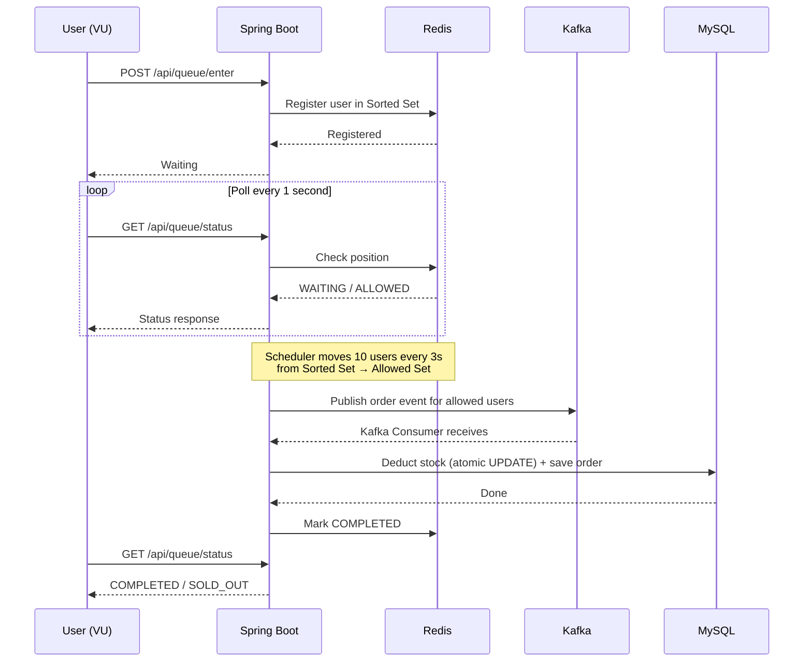
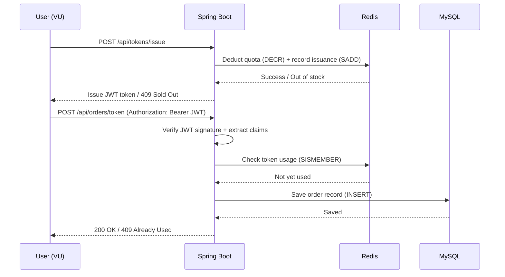

## Introduction

Throughout this series, we've implemented four FCFS approaches.

| Part | Approach | Core Technology |
|------|----------|----------------|
| [Part 4](/blog/en/fcfs-db-lock-implementation) | DB Lock | SELECT FOR UPDATE |
| [Part 5](/blog/en/fcfs-redis-implementation) | Redis | DECR, Lua Script |
| [Part 6](/blog/en/fcfs-queue-implementation) | Queue | Redis Sorted Set + Kafka |
| [Part 7](/blog/en/fcfs-token-implementation) | Token | JWT + Redis |

We've said "fast" and "slow" in each post, but **never compared them under identical conditions.** This post runs k6 load tests on all four approaches with the same environment, same scenarios, and lets the numbers speak.

---

## 1. Test Environment

### 1.1 Infrastructure

| Component | Spec |
|-----------|------|
| Application | Spring Boot 3.x, Java 17 (running locally) |
| DB | MySQL 8.0 (InnoDB) |
| Redis | Redis 7.x (Standalone) |
| Kafka | Apache Kafka 3.x (1 broker, 3 partitions) |
| Load test tool | k6 v1.5.0 |
| HikariCP | maximumPoolSize: 10 (Spring Boot default) |
| MySQL | max_connections: 151 (default) |

> Full source code is available on [GitHub](https://github.com/rhcwlq89/marketplace).
>
> Infrastructure (MySQL, Redis, Kafka) ran via Docker Compose; the application ran locally.
>
> **Connection settings:** HikariCP `maximumPoolSize` was left at the Spring Boot default of **10**. MySQL `max_connections` is the default **151**. The actual bottleneck is not the MySQL connection limit (151) but the **app-level HikariCP pool (10)**. With the DB lock approach, at most 10 requests can hold a `SELECT FOR UPDATE` lock simultaneously — the rest queue up in HikariCP waiting for a connection.

### 1.2 Test Scenarios

Identical conditions for all approaches:

- **Stock**: 100 items
- **Concurrent users**: 100 / 500 / 1,000 / 2,000
- **Request pattern**: All users attempt purchase simultaneously (no ramp-up — instead of gradually increasing users, all fire requests at the same instant)
- **Metrics**: TPS, avg response time, P95 response time, P99 response time, success rate, failure rate
- Each scenario ran 10 times; all figures are the average across those runs.

### 1.3 Measurement Method

Each approach's **"stock deduction API"** is called directly:

| Approach | Endpoint |
|----------|----------|
| DB Lock | `POST /api/orders/db-lock` |
| Redis | `POST /api/orders/redis` |
| Queue | `POST /api/queue/enter` + polling + `POST /api/orders` |
| Token | `POST /api/tokens/issue` + `POST /api/orders/token` |

> Queue and token approaches involve 2-step calls, so we measure **total elapsed time for the entire flow**.

State was reset between tests using `POST /api/fcfs/reset` to restore stock and clear Redis.

---

## 2. k6 Test Scripts

### 2.1 DB Lock Test



> Simplest flow — a single request completes the purchase. Bottleneck is DB lock wait time.

```javascript
import http from 'k6/http';
import { check, sleep } from 'k6';
import { Counter, Trend } from 'k6/metrics';

// Custom metrics: track success/fail counts and response time distribution separately
const successCount = new Counter('success_count');
const failCount = new Counter('fail_count');
const purchaseTime = new Trend('purchase_time');

export const options = {
    scenarios: {
        spike: {
            // shared-iterations: all VUs share the total iterations
            // e.g., VUS=500, ITERATIONS=500 → each VU fires exactly 1 request
            executor: 'shared-iterations',
            vus: __ENV.VUS ? parseInt(__ENV.VUS) : 100,
            iterations: __ENV.ITERATIONS ? parseInt(__ENV.ITERATIONS) : 100,
            maxDuration: '120s', // Force-stops the test if all requests aren't done within 2 minutes
        },
    },
};

export default function () {
    const productId = 1;
    const userId = __VU; // Each VU (Virtual User) gets a unique ID, used as userId

    // Measure response time manually (tracks only the purchase flow, separate from k6 built-in metrics)
    const start = Date.now();
    const res = http.post(
        `http://localhost:8080/api/orders/db-lock`,
        JSON.stringify({ productId, userId, quantity: 1 }),
        { headers: { 'Content-Type': 'application/json' } }
    );
    const elapsed = Date.now() - start;

    purchaseTime.add(elapsed);

    if (res.status === 200) {
        successCount.add(1);
    } else {
        failCount.add(1);
    }

    // Any response other than 200 (success) or 409 (sold out / duplicate) indicates a server error
    check(res, {
        'status is 200 or 409': (r) => r.status === 200 || r.status === 409,
    });
}
```

### 2.2 Redis Test



> The purchase decision (stock check + deduction) is handled atomically by a Redis Lua script. Only successful purchases write to the DB for record-keeping. Lock contention stays in-memory, making it faster than the DB lock approach.

```javascript
// Options and metric declarations are identical to 2.1 (omitted)
export const options = {
    scenarios: {
        spike: {
            executor: 'shared-iterations',
            vus: __ENV.VUS ? parseInt(__ENV.VUS) : 100,
            iterations: __ENV.ITERATIONS ? parseInt(__ENV.ITERATIONS) : 100,
            maxDuration: '120s',
        },
    },
};

export default function () {
    const productId = 1;
    const userId = __VU;

    const start = Date.now();
    // Calls the endpoint that deducts stock via Redis Lua script
    const res = http.post(
        `http://localhost:8080/api/orders/redis`,
        JSON.stringify({ productId, userId, quantity: 1 }),
        { headers: { 'Content-Type': 'application/json' } }
    );
    const elapsed = Date.now() - start;

    purchaseTime.add(elapsed);

    if (res.status === 200) {
        successCount.add(1);
    } else {
        failCount.add(1);
    }
    // No check() needed — Redis approach has simpler failure modes than DB lock
}
```

### 2.3 Queue Test



> 3-phase flow (enter → poll → purchase). The queue absorbs traffic spikes. Actual stock deduction happens in the DB via Kafka Consumer, and users check the result by polling.

```javascript
// Queue test has 3 phases (enter → poll → purchase)
// start is declared at the top to measure total elapsed time across all phases
export default function () {
    const productId = 1;
    const userId = __VU;
    const start = Date.now();

    // Phase 1: Enter queue — registers the user in a Redis Sorted Set
    const enterRes = http.post(
        `http://localhost:8080/api/queue/enter`,
        JSON.stringify({ productId, userId }),
        { headers: { 'Content-Type': 'application/json' } }
    );

    // Phase 2: Poll — checks status every 1 second until the scheduler grants entry
    // Times out after 60 attempts (60 seconds)
    let allowed = false;
    for (let i = 0; i < 60; i++) {
        const statusRes = http.get(
            `http://localhost:8080/api/queue/status?productId=${productId}&userId=${userId}`
        );
        const body = JSON.parse(statusRes.body);

        if (body.status === 'ALLOWED') {
            allowed = true;
            break;
        }
        if (body.status === 'NOT_IN_QUEUE') {
            break; // Already processed
        }
        sleep(1);
    }

    // Phase 3: Purchase — only users granted entry call the actual order API
    if (allowed) {
        const orderRes = http.post(
            `http://localhost:8080/api/orders`,
            JSON.stringify({ productId, userId, quantity: 1 }),
            { headers: { 'Content-Type': 'application/json' } }
        );

        if (orderRes.status === 200) {
            successCount.add(1);
        } else {
            failCount.add(1);
        }
    } else {
        failCount.add(1);
    }

    // Records total time from queue entry to purchase completion (or failure)
    const elapsed = Date.now() - start;
    purchaseTime.add(elapsed);
}
```

### 2.4 Token Test



> 2-phase flow (token issuance → purchase). Phase 1 manages quota in Redis; Phase 2 verifies the JWT and saves the order to the DB. Useful for bot prevention.

```javascript
// Token test has 2 phases (issue → purchase)
// Early-returns on token failure to avoid unnecessary purchase requests
export default function () {
    const productId = 1;
    const userId = __VU;
    const start = Date.now();

    // Phase 1: Issue JWT token — checks stock in Redis and issues a purchase authorization token
    const tokenRes = http.post(
        `http://localhost:8080/api/tokens/issue`,
        JSON.stringify({ productId, userId }),
        { headers: { 'Content-Type': 'application/json' } }
    );

    // Skip purchase phase if token issuance fails (e.g., sold out)
    if (tokenRes.status !== 200) {
        failCount.add(1);
        purchaseTime.add(Date.now() - start);
        return;
    }

    const token = JSON.parse(tokenRes.body).token;

    // Phase 2: Purchase with token — sends JWT in Authorization header to the order API
    const orderRes = http.post(
        `http://localhost:8080/api/orders/token`,
        JSON.stringify({ quantity: 1 }),
        {
            headers: {
                'Content-Type': 'application/json',
                'Authorization': `Bearer ${token}`,
            },
        }
    );

    // Records total time across token issuance + purchase
    const elapsed = Date.now() - start;
    purchaseTime.add(elapsed);

    if (orderRes.status === 200) {
        successCount.add(1);
    } else {
        failCount.add(1);
    }
}
```

---

## 3. Test Results

### Limitations of Local Testing — Read This First

Before looking at the numbers, keep this in mind: **every component runs on the same machine.** Compared to production, this setup disproportionately favors the DB lock approach.

| Factor | Local Environment | Production Environment |
|--------|-------------------|----------------------|
| **Network latency** | 0ms (localhost) | 1–5ms (same AZ), 10–50ms (cross-AZ) |
| **DB connection round-trip** | In-memory communication | Network round-trip on every query |
| **Lock holding time** | Pure processing time only | Processing + network round-trip × 2 |
| **Connection pool contention** | Minimal contention | Shared pool with other APIs |
| **CPU / Memory** | App + DB + Redis share the same resources | Each has dedicated resources |

**Why does DB lock look good locally?**

The DB lock approach holds a connection from `SELECT FOR UPDATE` → stock deduction → commit. Locally, this entire cycle completes with 0ms network overhead. In production, every step adds a network round-trip.

For example, with 2ms DB round-trip latency, the lock holding time per transaction becomes:
- **Local**: ~5ms (pure processing)
- **Production**: ~5ms + 2ms (SELECT FOR UPDATE) + 2ms (UPDATE) + 2ms (COMMIT) ≈ **~11ms**

When lock holding time doubles, the TPS achievable with the same pool (10 connections) is halved. Redis, on the other hand, completes stock deduction in a single network round-trip — so **the gap widens in production.**

> The numbers below are meant for **relative comparison** between approaches. Absolute TPS and response times will differ in production.

> **Measured data (2026.03.27)** — All figures are averages across 10 runs per scenario.

### 3.1 100 Concurrent Users (100 Stock)

```bash
k6 run -e VUS=100 -e ITERATIONS=100 test-db-lock.js
```

| Metric | DB Lock | Redis | Queue | Token |
|--------|---------|-------|-------|-------|
| Avg response | 253ms | 98ms | ~16s (incl. polling) | 336ms |
| P95 response | 397ms | 163ms | ~30s | 364ms |
| P99 response | 409ms | 165ms | ~30s | 368ms |
| Success | 100 | 100 | 100 | 100 |
| Failed | 0 | 0 | 0 | 0 |

> The queue takes ~30s because the scheduler allows 10 users every 3 seconds. This isn't a performance problem — it's **intentional flow control**.

### 3.2 500 Concurrent Users (100 Stock)

| Metric | DB Lock | Redis | Queue | Token |
|--------|---------|-------|-------|-------|
| Avg response | 517ms | 210ms | ~51s (incl. polling) | 242ms |
| P95 response | 689ms | 249ms | ~66s | 414ms |
| P99 response | 702ms | 252ms | ~66s | 426ms |
| Success | 100 | 100 | 100 | 100 |
| Failed (sold out) | 400 | 400 | 400 | 400 |
| TPS | ~679 | ~2,334 | N/A | ~1,783 |

At 500 users, the performance gap between approaches starts to show. Redis (2,334 TPS) is 3.4x faster than DB lock (679 TPS), and token (1,783 TPS) is 2.6x faster.

### 3.3 1,000 Concurrent Users (100 Stock)

| Metric | DB Lock | Redis | Queue | Token |
|--------|---------|-------|-------|-------|
| Avg response | 1,085ms | 413ms | ~61s (incl. polling) | 362ms |
| P95 response | 1,631ms | 602ms | ~70s | 1,089ms |
| P99 response | 1,688ms | 608ms | ~70s | 1,107ms |
| Success | 100 | 100 | 100 | 100 |
| Failed (sold out) | 900 | 900 | 900 | 900 |
| TPS | ~647 | ~2,224 | N/A | ~2,230 |

At 1,000 users, DB lock P99 reaches 1.7 seconds. Redis and token both hit ~2,200 TPS, but Redis (602ms P95) is more stable than token (1,089ms P95) at this scale.

### 3.4 2,000 Concurrent Users (100 Stock)

| Metric | DB Lock | Redis | Queue | Token |
|--------|---------|-------|-------|-------|
| Avg response | 1,481ms | 1,114ms | ~59s (incl. polling) | 698ms |
| P95 response | 3,167ms | 2,867ms | ~63s | 2,032ms |
| P99 response | 3,393ms | 2,874ms | ~64s | 3,240ms |
| Success | 100 | 100 | 203* | 100 |
| Failed (sold out) | 1,900 | 1,900 | 1,797 | 1,900 |
| TPS | ~676 | ~1,918 | N/A | ~1,137 |

At 2,000 users, every approach's P99 exceeds 3 seconds. DB lock (3,393ms) and token (3,240ms) land at similar levels, with Redis (2,874ms) lowest. The standout finding is **token TPS collapsing to 1,137**. It matched Redis at 1,000 users (2,230 vs 2,224), but drops to just 60% of Redis (1,918) at 2,000. JWT signing/verification is CPU-bound, and it becomes a bottleneck as concurrency climbs.

> \* The queue success count exceeding 100 is caused by the Kafka consumer's COMPLETED marking logic. Actual stock deduction is precisely capped at 100. See [Part 9](/blog/en/fcfs-load-test-behind-the-scenes) for a detailed analysis.

---

## 4. Analysis

### 4.1 TPS Comparison

```
TPS (1,000 concurrent users)
──────────────────────────────────────────────

DB Lock    ████░░░░░░░░░░░░░░░░░░░░░░░░░░░░  647
Redis      ████████████████████████████████████████  2,224
Token      ████████████████████████████████████████  2,230
Queue      (flow control — not comparable by TPS)
```

At 1,000 users, **Redis and token are essentially tied** (2,224 vs 2,230 TPS). DB lock comes in at 647 TPS — about one-third the throughput.

### 4.2 P95 Latency Comparison

```
P95 Response Time (1,000 → 2,000 concurrent)
──────────────────────────────────────────────

DB Lock    ██████ → █████████████  1,631ms → 3,167ms
Redis      ███ → ████████████     602ms → 2,867ms
Token      █████ → ████████████   1,089ms → 2,032ms
Queue      Intentional wait (~70s)
```

```
P99 Response Time (2,000 concurrent)
──────────────────────────────────────────────

DB Lock    █████████████████████████████████  3,393ms
Redis      ████████████████████████████████   2,874ms
Token      █████████████████████████████████  3,240ms
Queue      Intentional wait (~64s)
```

### 4.3 DB Connection Behavior

DB locks make **every request hold a DB connection while waiting for the lock**. This means even unrelated APIs (product listings, user pages) can't get connections, slowing down the **entire service**. Redis/token approaches don't use DB for stock deduction — one connection is enough.

At 2,000 users the gap between approaches narrows — all methods converge around ~3s P99. DB lock's real problem isn't just speed: TPS is nearly flat from 1,000 users (647) to 2,000 users (676), meaning the connection pool is already saturated and adding users doesn't increase throughput. Redis maintained 1,918 TPS under the same load.

### 4.4 Reference: Production Connection Sizing Guide

This test used default values — HikariCP 10, MySQL 151. How should you size these in production?

**HikariCP `maximumPoolSize` Formula**

The HikariCP wiki suggests this formula:

```
connections = (CPU cores × 2) + effective_spindle_count
```

- `effective_spindle_count`: concurrent I/O requests the disk can handle (usually 1 for SSD)
- For a 4-core server: `(4 × 2) + 1 = 9–10` connections
- **Counter-intuitively, a larger pool does NOT mean better performance.** More connections increase context switching, lock contention, and cache misses — making things slower.

> HikariCP's team has shared a case where reducing a pool from 2,048 → 96 connections under 600 concurrent users dropped average response time from 100ms → 2ms.

**Recommended Ranges**

| Scenario | `maximumPoolSize` | Notes |
|----------|:-----------------:|-------|
| Typical web service (4–8 cores) | 10–20 | Start with defaults, tune after monitoring |
| Batch / bulk processing | 20–50 | Longer I/O waits justify more connections |
| FCFS / high-burst APIs | 10–30 | Redis offloading matters more than pool size |

**MySQL `max_connections` Sizing**

```
max_connections ≥ (app instances × maximumPoolSize) + headroom (monitoring, migrations, etc.)
```

- 3 app servers × HikariCP 20 = 60 → set `max_connections` to at least 80–100
- The default 151 is fine for small setups, but **must be adjusted as instances scale**
- Each MySQL connection costs ~10MB of memory. `max_connections = 1000` means ~10GB of RAM for connections alone

**Key Principles**

1. **Start small** with HikariCP pool size and scale up based on `connectionTimeout` log monitoring
2. Set MySQL `max_connections` **20–30% above** the total pool size across all app instances
3. For burst-heavy APIs like FCFS, **designing away from DB connections** (Redis offloading) is more effective than tuning pool size

---

## 5. Cost-Performance Analysis

### 5.1 Infrastructure Cost

| Approach | Required Infrastructure | Est. Monthly Cost (AWS) |
|----------|----------------------|------------------------|
| DB Lock | MySQL only | ~$50 (RDS db.t3.medium) |
| Redis | MySQL + Redis | ~$80 (+ ElastiCache t3.small) |
| Queue | MySQL + Redis + Kafka | ~$200 (+ MSK t3.small) |
| Token | MySQL + Redis | ~$80 (+ ElastiCache t3.small) |

### 5.2 TPS per Dollar

| Approach | TPS (1,000 users) | Monthly Cost | TPS/$ |
|----------|:-----------------:|-------------|-------|
| DB Lock | 647 | $50 | 12.94 |
| Redis | 2,224 | $80 | 27.80 |
| Token | 2,230 | $80 | 27.88 |
| Queue | N/A (flow control) | $200 | N/A |

At 1,000 users, Redis and token have virtually identical cost efficiency (27.80 vs 27.88 TPS/$). At 2,000 users, Redis (1,918 TPS → 23.98 TPS/$) pulls significantly ahead of token (1,137 TPS → 14.21 TPS/$).

---

## 6. Choosing the Right Approach

### 6.1 Traffic Scale × Infrastructure Matrix

| | Minimal Infra | Redis Available | Redis + Kafka Available |
|---|:---:|:---:|:---:|
| **~50 concurrent** | ✅ DB Lock | DB Lock is fine | Overengineered |
| **~500 concurrent** | ⚠️ DB Lock (tune pool) | ✅ Redis | Overengineered |
| **~5,000 concurrent** | ❌ | ✅ Redis or Token | ✅ Redis |
| **~50,000 concurrent** | ❌ | ⚠️ Redis (UX issue) | ✅ Queue + Token |
| **~100,000+ concurrent** | ❌ | ❌ | ✅ Queue + Token + horizontal scaling |

### 6.2 Recommendations by Scenario

**"Internal company event, small-scale FCFS (~50 concurrent)"**
→ **DB Lock** — No extra infrastructure needed. Fast enough.

**"E-commerce limited sale, mid-scale (~hundreds to thousands)"**
→ **Redis Lua Script** — 2.5x performance for $30 more. Simple to implement.

**"Sneaker drop, large-scale (~thousands to tens of thousands)"**
→ **Redis** — Most stable at 2,000+ users (1,918 TPS, P99 2,874ms). Add **Token + Redis** if bot prevention is also needed.

**"Concert ticketing, massive-scale (~tens of thousands+)"**
→ **Queue + Token + Kafka** — Order guarantee + traffic absorption + stable processing.

### 6.3 Decision Flowchart

```
Is concurrent traffic under 100?
├─ Yes → DB Lock
└─ No
    └─ Need to show users their queue position?
        ├─ Yes → Queue (+ token combo recommended)
        └─ No
            └─ Need bot prevention or maximum throughput?
                ├─ Yes → Token + Redis
                └─ No → Redis Lua Script
```

---

## 7. Reproducing These Tests

Want to run the tests yourself?

### 7.1 Install k6

```bash
brew install k6
```

### 7.2 Vary Concurrent Users

```bash
# 100 users
k6 run -e VUS=100 -e ITERATIONS=100 test-db-lock.js

# 500 users
k6 run -e VUS=500 -e ITERATIONS=500 test-db-lock.js

# 1,000 users
k6 run -e VUS=1000 -e ITERATIONS=1000 test-db-lock.js

# 2,000 users
k6 run -e VUS=2000 -e ITERATIONS=2000 test-db-lock.js
```

### 7.3 Generate Reports

```bash
k6 run --out json=result.json test-db-lock.js
# Visualize with k6 Cloud or Grafana
```

### 7.4 Important Notes

- **Reset state**: Call `POST /api/fcfs/reset` before each test to restore stock and clear Redis
- **JVM warmup**: First run may be slow due to JIT compilation. Use results from runs 2-3
- **Network**: Place k6 and server on the same network to avoid network latency skewing results

For a walkthrough of how this test environment was built, see [Part 9](/blog/en/fcfs-load-test-behind-the-scenes).

---

## Summary

| Approach | TPS (1,000) | P95 (1,000) | P99 (2,000) | Cost | Best For |
|----------|:---:|:---:|:---:|:---:|----------|
| **DB Lock** | 647 | 1,631ms | 3,393ms | $50 | Internal events (~100) |
| **Redis** | 2,224 | 602ms | 2,874ms | $80 | Mid-scale FCFS (~thousands) |
| **Token** | 2,230 | 1,089ms | 3,240ms | $80 | Large-scale + bot prevention |
| **Queue** | Flow control | ~70s (intentional) | ~64s | $200 | Massive-scale ticketing |

**Key Takeaways:**

1. **DB lock hits a wall at 2,000 users.** P99 reaches 3.4s and TPS is nearly identical at 1,000 (647) vs 2,000 users (676) — the connection pool is saturated.
2. **Redis is the most stable under high load.** It maintains 1,918 TPS at 2,000 users with the lowest P99 at 2,874ms.
3. **Token is best up to 1,000 users but drops sharply at 2,000.** JWT signing/verification is CPU-bound and becomes a bottleneck at high concurrency. If you don't need bot prevention, Redis is the safer choice.
4. **Queue performance is independent of load.** Whether 100 or 2,000 users, it's ~60 seconds — that's the design intent.
5. **Local environment results have limits.** All figures are relative comparisons on the same machine. Production adds network latency, shared connection pools, and other variables that will shift the numbers.

This series covered **FCFS systems from fundamentals to production**. From transaction isolation levels in Part 1 to load testing in Part 8, we built each approach and measured the results. The goal was always the same: **make technology choices backed by evidence, not assumptions.**
