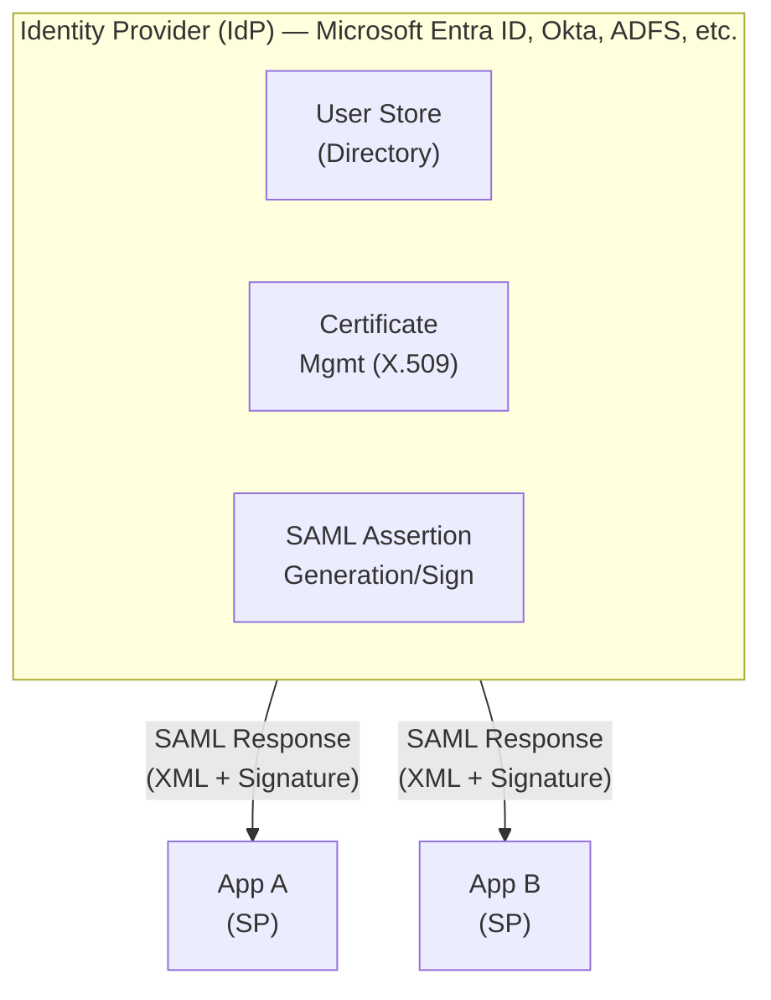
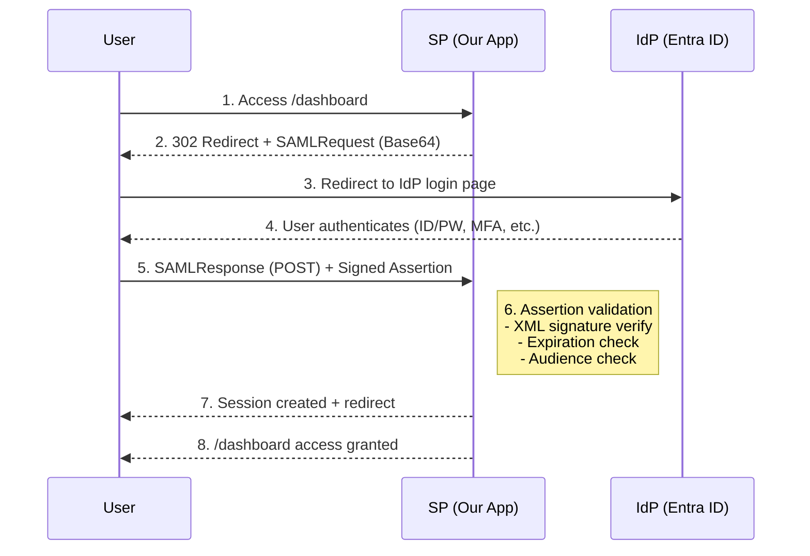
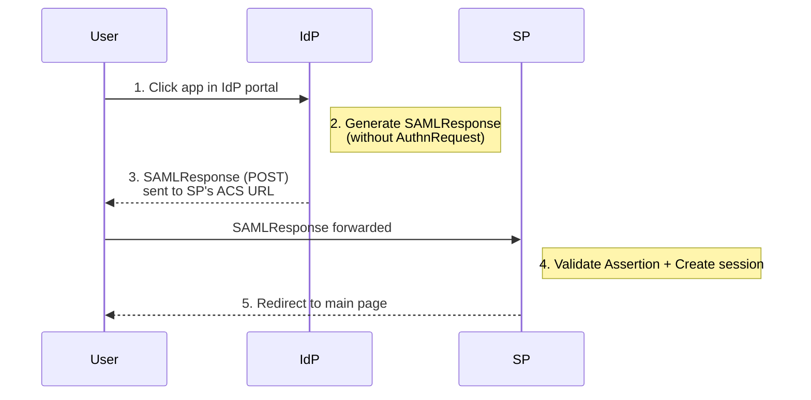
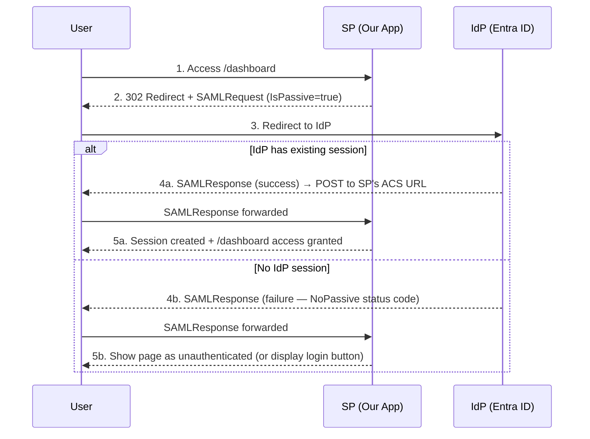
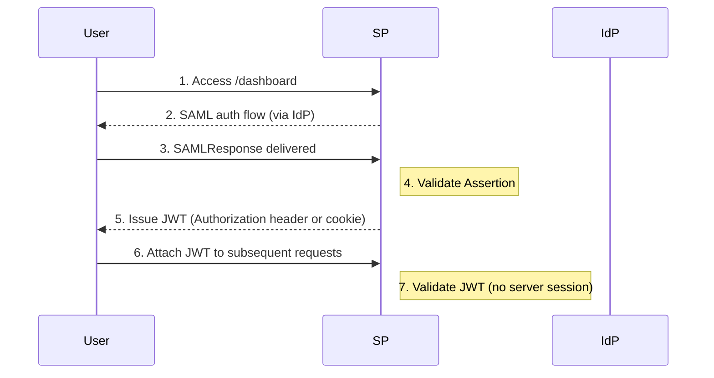
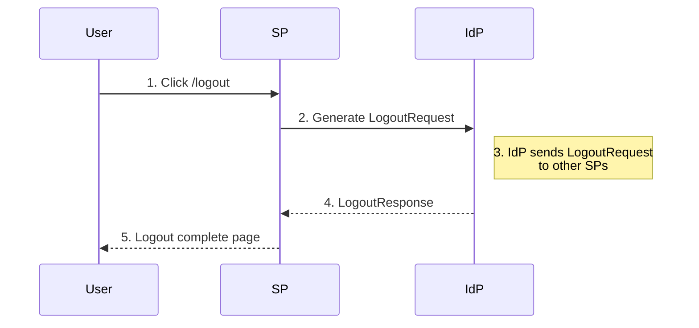

## Introduction

In enterprise environments, SAML 2.0 remains one of the most widely used authentication protocols. Especially for integrations with SaaS applications like Microsoft 365, Salesforce, and ServiceNow, SAML is the de facto standard.

This guide covers the core concepts of SAML 2.0 and walks through implementing **Microsoft Entra ID (formerly Azure AD)** SAML integration in a Spring Boot application.

### Table of Contents

- [SAML 2.0 Core Concepts](#1-saml-20-core-concepts)
- [SAML Authentication Flow Details](#2-saml-authentication-flow-details)
- [Microsoft Entra ID SAML Configuration](#3-microsoft-entra-id-saml-configuration)
- [Spring Boot SAML Integration](#4-spring-boot-saml-integration)
- [SAML Assertion Processing and User Mapping](#5-saml-assertion-processing-and-user-mapping)
- [Logout Handling (SLO)](#6-logout-handling-slo)
- [Troubleshooting and Debugging](#7-troubleshooting-and-debugging)
- [Security Checklist](#8-security-checklist)
- [FAQ](#9-faq)

---

## 1. SAML 2.0 Core Concepts

### 1.1 What is SAML?

**SAML (Security Assertion Markup Language) 2.0** is a standard protocol for exchanging authentication and authorization data in XML format. Established by OASIS in 2005, it has become a cornerstone technology for enterprise SSO.



### 1.2 Key Terminology

| Term | Description |
|------|-------------|
| **IdP (Identity Provider)** | System that performs user authentication and issues SAML Assertions |
| **SP (Service Provider)** | Application that provides services to users (our app) |
| **SAML Assertion** | XML document containing authentication information sent from IdP to SP |
| **Metadata** | XML containing IdP and SP configuration (endpoints, certificates, etc.) |
| **ACS URL** | Assertion Consumer Service URL. SP endpoint that receives SAML Responses |
| **Entity ID** | URI that uniquely identifies an IdP or SP |
| **RelayState** | Original URL to redirect to after authentication |
| **Name ID** | Value that identifies the user (email, UPN, etc.) |

### 1.3 Spring Security Terminology Mapping

Spring Security uses its **own terminology** instead of the standard SAML terms (IdP, SP). Since these terms appear in `application.yml` and APIs, understanding the mapping upfront helps avoid confusion:

| Spring Security Term | Standard SAML Term | Meaning |
|---------------------|-------------------|---------|
| **RP (Relying Party)** | SP (Service Provider) | Our service |
| **AP (Asserting Party)** | IdP (Identity Provider) | Microsoft Entra ID, etc. |

For example:
- `relyingparty.registration` = SAML configuration for **SP (our app)**
- `assertingparty.metadata-uri` = Metadata URL of the **IdP (Microsoft)**
- RP-initiated SLO = Logout initiated from our service
- AP-initiated SLO = Logout initiated from IdP (Microsoft)

> **Tip**: Whenever you see "AP" in Spring Security docs, just think "IdP" — they mean the same thing.

### 1.4 SAML Assertion Structure

A SAML Assertion consists of three types of Statements:

```xml
<saml:Assertion xmlns:saml="urn:oasis:names:tc:SAML:2.0:assertion"
                ID="_abc123" Version="2.0"
                IssueInstant="2026-03-12T01:00:00Z">

  <!-- 1. Authentication Statement: When and how was the user authenticated -->
  <saml:AuthnStatement AuthnInstant="2026-03-12T01:00:00Z"
                       SessionIndex="_session_abc123">
    <saml:AuthnContext>
      <saml:AuthnContextClassRef>
        urn:oasis:names:tc:SAML:2.0:ac:classes:PasswordProtectedTransport
      </saml:AuthnContextClassRef>
    </saml:AuthnContext>
  </saml:AuthnStatement>

  <!-- 2. Attribute Statement: User attribute information -->
  <saml:AttributeStatement>
    <saml:Attribute Name="http://schemas.xmlsoap.org/ws/2005/05/identity/claims/emailaddress">
      <saml:AttributeValue>user@company.com</saml:AttributeValue>
    </saml:Attribute>
    <saml:Attribute Name="http://schemas.xmlsoap.org/ws/2005/05/identity/claims/givenname">
      <saml:AttributeValue>John</saml:AttributeValue>
    </saml:Attribute>
    <saml:Attribute Name="http://schemas.microsoft.com/ws/2008/06/identity/claims/groups">
      <saml:AttributeValue>admin-group-id</saml:AttributeValue>
    </saml:Attribute>
  </saml:AttributeStatement>

  <!-- 3. Authorization Decision Statement (optional): Authorization info -->
  <!-- Rarely used in practice -->
</saml:Assertion>
```

### 1.5 SAML vs OAuth2/OIDC Comparison

| Aspect | SAML 2.0 | OAuth2/OIDC |
|--------|----------|-------------|
| **Token Format** | XML Assertion | JWT (JSON) |
| **Transport** | Browser Redirect/POST | REST API |
| **Signing** | XML Signature (X.509) | JWS (JSON Web Signature) |
| **Metadata** | XML Metadata | Well-Known Endpoint (JSON) |
| **Mobile Support** | Limited (requires browser) | Excellent (native support) |
| **Complexity** | High (XML parsing, cert management) | Low |
| **Enterprise Adoption** | Very high | Growing |
| **Use Cases** | B2B, legacy, government/finance | B2C, mobile, new projects |

> **When should you choose SAML?**
> - The client's IdP only supports SAML
> - Integration with existing SAML infrastructure is required
> - Government/finance regulations mandate SAML
> - Registration as a Microsoft Entra ID Enterprise Application is needed

---

## 2. SAML Authentication Flow Details

### 2.1 SP-Initiated SSO (Most Common)

The user first accesses the SP (our application):



### 2.2 IdP-Initiated SSO

The user clicks the application from the IdP portal (e.g., Microsoft My Apps):



> **Note**: IdP-Initiated SSO can be vulnerable to CSRF attacks. Prefer SP-Initiated whenever possible.

### 2.3 Passive SSO (IsPassive)

SP-Initiated SSO has a **Passive** option. When the AuthnRequest includes `IsPassive="true"`, the IdP **does not show a login screen** — it only authenticates if the user already has an active session.



#### When to Use It?

| Scenario | Description |
|---------|-------------|
| **Silent login check** | Check login status on page load without redirecting to a login screen |
| **Mixed auth pages** | Public page that shows personalized UI for logged-in users |
| **Session renewal** | Automatically extend the SP session if the IdP session is still alive |

#### Active SSO vs Passive SSO

In SAML, SSO approaches are broadly divided into **Active** (default) and **Passive** (IsPassive=true).

| Aspect | Active SSO | Passive SSO |
|--------|-----------|-------------|
| User interaction | Allowed (shows login UI if needed) | Forbidden (no UI allowed) |
| No IdP session | Login screen → return to SP after auth | `NoPassive` error or SP handles it |
| IdP session exists | Auto-processed (when ForceAuthn=false) | Auto-processed |
| AuthnRequest attribute | `IsPassive="false"` (default) | `IsPassive="true"` |
| Use scenario | SSO button click, protected resource access | Auto login attempt on page entry |
| Failure handling | IdP shows login screen | SP must handle (e.g., show login button) |

> **Key point**: Passive SSO is a "fetch if logged in, skip if not" strategy. It never forces the user to a login screen, resulting in a smoother UX. Active SSO is a "must guarantee authenticated state" strategy.

### 2.4 SAML Binding Methods

SAML Binding defines **how SAML messages (AuthnRequest, SAMLResponse, etc.) are transported over HTTP** between IdP and SP. Think of it as the "transport method" — the same SAML flow can use different bindings depending on the message type and size.

| Binding | Description | Usage |
|---------|-------------|-------|
| **HTTP-Redirect** | Sent via URL query parameters (GET) | AuthnRequest delivery |
| **HTTP-POST** | Sent via HTML Form hidden fields (POST) | SAMLResponse delivery |
| **HTTP-Artifact** | Only reference token is passed; actual data via back-channel | Large Assertions |

Using the SP-Initiated SSO flow above as an example:

- **Step 2** (SP → IdP): The AuthnRequest is small, so it is sent via **HTTP-Redirect** (as a URL query parameter in a GET request)
- **Step 5** (IdP → SP): The SAMLResponse contains a signed XML Assertion which is large, so it is sent via **HTTP-POST** (as a hidden field in an HTML form)

> **Note**: HTTP-Artifact only passes a reference token through the browser, while the actual SAML data is exchanged via direct server-to-server communication (back-channel). It is used when security is critical or the Assertion is too large, but due to its implementation complexity, the HTTP-Redirect + HTTP-POST combination is the most common in practice.

---

## 3. Microsoft Entra ID SAML Configuration

### 3.1 Register Enterprise Application

The procedure for registering a SAML application in the Microsoft Entra ID (formerly Azure AD) admin center.

**Step 1: Create Application**

```
Microsoft Entra admin center
  └─ Enterprise Applications
       └─ + New Application
            └─ Create your own application
                 └─ "My Spring Boot App"
                 └─ "Integrate any other application you don't find in the gallery"
```

**Step 2: Configure SAML SSO**

Select Single sign-on → SAML and configure the following:

| Setting | Value | Description |
|---------|-------|-------------|
| **Identifier (Entity ID)** | `https://myapp.example.com/saml/metadata` | SP's unique identifier |
| **Reply URL (ACS URL)** | `https://myapp.example.com/login/saml2/sso/azure` | URL to receive SAML Response |
| **Sign on URL** | `https://myapp.example.com/` | SP-Initiated SSO start URL |
| **Relay State** | (leave empty) | Post-authentication redirect URL |
| **Logout URL** | `https://myapp.example.com/logout/saml2/slo` | Single Logout URL |

**Step 3: Attributes & Claims Configuration**

Add required user attributes beyond the default claims:

| Claim Name | Source Attribute | Description |
|------------|-----------------|-------------|
| `emailaddress` | user.mail | User email |
| `givenname` | user.givenname | First name |
| `surname` | user.surname | Last name |
| `name` | user.displayname | Display name |
| `groups` | user.groups | Group membership |

**Step 4: Download Certificates**

- **Certificate (Base64)**: Download `.cer` file → Register in SP's trust store
- **Federation Metadata XML**: IdP metadata → Use in SP configuration
- **Login URL**: `https://login.microsoftonline.com/{tenant-id}/saml2`
- **Microsoft Entra Identifier**: `https://sts.windows.net/{tenant-id}/`

### 3.2 User/Group Assignment

```
Enterprise Application
  └─ Users and groups
       └─ + Add user/group
            └─ Select users or groups to grant access
```

> **Important**: SAML authentication will fail if users/groups are not assigned. You'll get an `AADSTS50105` error.

---

## 4. Spring Boot SAML Integration

### 4.1 Dependencies

```kotlin
// build.gradle.kts
plugins {
    id("org.springframework.boot") version "3.4.3"
    id("io.spring.dependency-management") version "1.1.7"
    kotlin("jvm") version "2.1.10"
    kotlin("plugin.spring") version "2.1.10"
}

dependencies {
    implementation("org.springframework.boot:spring-boot-starter-web")
    implementation("org.springframework.boot:spring-boot-starter-security")
    implementation("org.springframework.boot:spring-boot-starter-thymeleaf")

    // SAML 2.0 core dependency
    implementation("org.springframework.security:spring-security-saml2-service-provider")

    // Development convenience
    developmentOnly("org.springframework.boot:spring-boot-devtools")
}
```

For Maven:

```xml
<dependencies>
    <dependency>
        <groupId>org.springframework.boot</groupId>
        <artifactId>spring-boot-starter-security</artifactId>
    </dependency>
    <dependency>
        <groupId>org.springframework.security</groupId>
        <artifactId>spring-security-saml2-service-provider</artifactId>
    </dependency>
</dependencies>
```

### 4.2 application.yml Configuration

```yaml
spring:
  security:
    saml2:
      relyingparty:
        registration:
          azure:  # Registration ID (used in URL paths)
            entity-id: https://myapp.example.com/saml/metadata

            # ACS configuration
            acs:
              location: "{baseUrl}/login/saml2/sso/{registrationId}"
              binding: POST  # POST is the default, so this can be omitted. SAMLResponse uses POST because the signed XML is too large for URL parameters

            # SP signing key (optional for AuthnRequest signing, REQUIRED for SLO)
            # ⚠️ private-key is a secret — NEVER commit to Git (add to .gitignore)
            # certificate is a public key — safe to commit
            signing:
              credentials:
                - private-key-location: classpath:credentials/sp-private.key
                  certificate-location: classpath:credentials/sp-certificate.crt

            # IdP configuration - use metadata URL (recommended)
            # This URL, tenant-id, and app-id are public information — safe to commit to Git
            assertingparty:
              metadata-uri: https://login.microsoftonline.com/{tenant-id}/federationmetadata/2007-06/federationmetadata.xml?appid={app-id}

# Logging (for development)
logging:
  level:
    org.springframework.security.saml2: DEBUG
    org.opensaml: DEBUG
```

#### What is metadata-uri?

`metadata-uri` is the **URL of the Federation Metadata XML document** provided by the IdP. When accessed, it returns an XML document containing all of the IdP's configuration:

- **IdP Entity ID** — A unique URI that identifies the IdP
- **SSO Login URL** — The endpoint to send AuthnRequest to
- **SLO Logout URL** — The endpoint to send LogoutRequest to
- **Signing Certificate** — The public certificate used to verify XML signatures in SAMLResponse

Spring Security automatically parses this XML and populates all the above settings, so developers don't need to configure each value manually.

The `{tenant-id}` and `{app-id}` can be found on the **Overview page** of the Enterprise Application registered in section 3.1.

> **Git Commit Security Checklist**
>
> | Item | Git Commit | Reason |
> |------|-----------|--------|
> | `metadata-uri` URL, `tenant-id`, `app-id` | ✅ Safe | Public information |
> | `azure-idp.cer` (IdP public certificate) | ✅ Safe | Public key (for signature verification) |
> | `sp-certificate.crt` (SP public certificate) | ✅ Safe | Public key |
> | **`sp-private.key` (SP private key)** | ❌ **Never** | Leakage enables AuthnRequest forgery |

> **Why is metadata-uri recommended?**
> - When the IdP's certificate is renewed, the **new certificate is automatically picked up** on application restart
> - With manual configuration, you must replace the certificate file yourself — missing a renewal can break authentication
> - Any IdP configuration changes are reflected without code modifications

**Manual configuration instead of metadata URL:**

```yaml
spring:
  security:
    saml2:
      relyingparty:
        registration:
          azure:
            entity-id: https://myapp.example.com/saml/metadata
            acs:
              location: "{baseUrl}/login/saml2/sso/{registrationId}"
              binding: POST
            assertingparty:
              entity-id: https://sts.windows.net/{tenant-id}/
              single-sign-on:
                url: https://login.microsoftonline.com/{tenant-id}/saml2
                binding: POST
                sign-request: false
              verification:
                credentials:
                  # IdP's public certificate — same public key found in metadata-uri XML, safe to commit to Git
                  - certificate-location: classpath:credentials/azure-idp.cer
```

### 4.3 Security Configuration

```kotlin
import org.springframework.context.annotation.Bean
import org.springframework.context.annotation.Configuration
import org.springframework.security.config.annotation.web.builders.HttpSecurity
import org.springframework.security.config.annotation.web.configuration.EnableWebSecurity
import org.springframework.security.web.SecurityFilterChain

@Configuration
@EnableWebSecurity
class SecurityConfig {

    @Bean
    fun securityFilterChain(http: HttpSecurity): SecurityFilterChain {
        http
            .authorizeHttpRequests { auth ->
                auth
                    .requestMatchers("/", "/health", "/error").permitAll()
                    .requestMatchers("/admin/**").hasRole("ADMIN")
                    .anyRequest().authenticated()
            }
            .saml2Login { saml2 ->
                saml2
                    .loginPage("/")  // Custom login page
                    .defaultSuccessUrl("/dashboard", true)
                    .failureUrl("/login?error=true")
            }
            .saml2Logout { logout ->
                logout
                    .logoutUrl("/logout")
                    .logoutSuccessUrl("/")
            }
            .saml2Metadata { }  // Enable SP metadata endpoint

        return http.build()
    }
}
```

### 4.4 Session Management Strategy

SAML authentication's role ends at receiving the SAMLResponse from the IdP and validating the Assertion. **How the SP maintains user state after that** is a separate concern, and the Security configuration differs by approach.

| Strategy | Description | Best For |
|----------|-------------|----------|
| **Server Session (default)** | Maintains server-side session via `JSESSIONID` cookie | MPA, single server, quick setup |
| **JWT (Stateless)** | Issues JWT after SAML auth, no server session | SPA + API server, microservices |
| **Redis Session** | Stores server session in Redis | Multi-instance, horizontal scaling |

The 4.3 Security Configuration above uses the **server session approach (default)**. If JWT is needed, configure as follows.

#### JWT Configuration

After successful SAML authentication, the SP issues a JWT. Subsequent requests are authenticated using the JWT:



SAML authentication and JWT validation require **different session policies**. SAML needs sessions for the IdP redirect flow, while API requests should be stateless. The recommended approach is to **separate SecurityFilterChains using `@Order`**:

```kotlin
@Configuration
@EnableWebSecurity
class SecurityConfig(
    private val jwtTokenProvider: JwtTokenProvider
) {

    // ① SAML auth chain — handles login/logout/metadata paths only
    @Bean
    @Order(1)
    fun samlFilterChain(http: HttpSecurity): SecurityFilterChain {
        http
            .securityMatcher("/login/saml2/**", "/saml2/**", "/logout", "/saml/metadata")
            // SAML redirect flow requires session
            .sessionManagement { it.sessionCreationPolicy(SessionCreationPolicy.IF_REQUIRED) }
            .saml2Login { saml2 ->
                saml2
                    // Issue JWT on successful SAML authentication
                    .successHandler { request, response, authentication ->
                        val principal = authentication.principal as SamlUserPrincipal
                        val token = jwtTokenProvider.createToken(principal)
                        // SPA: respond with JSON
                        response.contentType = "application/json"
                        response.writer.write("""{"token": "$token"}""")
                    }
            }
            .saml2Logout { logout ->
                logout.logoutUrl("/logout").logoutSuccessUrl("/")
            }
            .saml2Metadata { }

        return http.build()
    }

    // ② API chain — JWT authentication, no session
    @Bean
    @Order(2)
    fun apiFilterChain(http: HttpSecurity): SecurityFilterChain {
        http
            .securityMatcher("/api/**")
            .sessionManagement { it.sessionCreationPolicy(SessionCreationPolicy.STATELESS) }
            .authorizeHttpRequests { auth ->
                auth
                    .requestMatchers("/api/public/**").permitAll()
                    .anyRequest().authenticated()
            }
            .addFilterBefore(
                JwtAuthenticationFilter(jwtTokenProvider),
                UsernamePasswordAuthenticationFilter::class.java
            )

        return http.build()
    }

    // ③ Default chain (static resources, health checks, etc.)
    @Bean
    @Order(3)
    fun defaultFilterChain(http: HttpSecurity): SecurityFilterChain {
        http
            .authorizeHttpRequests { auth ->
                auth
                    .requestMatchers("/", "/health", "/error").permitAll()
                    .anyRequest().authenticated()
            }

        return http.build()
    }
}
```

> **Why separate chains?**
> - Setting `STATELESS` on a single chain breaks the SAML redirect flow because the session cannot be found
> - With `@Order` separation, SAML paths use sessions while API paths operate with JWT only
> - Each chain's `securityMatcher` clearly scopes the paths, preventing configuration conflicts

> **Important notes**:
> - SAML SLO (Single Logout) depends on server sessions, so in a JWT environment, **additional handling is required** (e.g., token blacklist)
> - It is recommended to set the JWT expiration based on the SAML Assertion's `SessionNotOnOrAfter` value
> - In SPA environments, return the JWT as JSON in the `successHandler`. In MPA environments, set it as an `httpOnly` cookie

### 4.5 Custom SAML Response Processing

#### Default Behavior

Spring Security internally uses `OpenSaml4AuthenticationProvider` to process SAML Responses. Here's what the default Provider does:

1. **Verifies the XML signature** of the SAMLResponse
2. **Validates conditions** such as expiration and Audience in the Assertion
3. Sets the `NameID` value as the Principal name
4. Stores Assertion Attributes in a `Saml2AuthenticatedPrincipal` and creates a `Saml2Authentication` object

Authentication works without any custom configuration, but the default Provider simply stores Attributes as a flat map. In practice, you need to **extract email, name, groups/roles and map them to Spring Security's `GrantedAuthority`**, which requires a custom converter:

#### Custom Converter Implementation

```kotlin
import org.opensaml.saml.saml2.core.Assertion
import org.opensaml.saml.saml2.core.Attribute
import org.springframework.core.convert.converter.Converter
import org.springframework.security.authentication.AbstractAuthenticationToken
import org.springframework.security.core.GrantedAuthority
import org.springframework.security.core.authority.SimpleGrantedAuthority
import org.springframework.security.saml2.provider.service.authentication.OpenSaml4AuthenticationProvider
import org.springframework.security.saml2.provider.service.authentication.OpenSaml4AuthenticationProvider.ResponseToken
import org.springframework.security.saml2.provider.service.authentication.Saml2Authentication
import org.springframework.stereotype.Component

@Component
class SamlResponseAuthenticationConverter : Converter<ResponseToken, AbstractAuthenticationToken> {

    companion object {
        // Microsoft Entra ID standard claim URIs
        private const val CLAIM_EMAIL =
            "http://schemas.xmlsoap.org/ws/2005/05/identity/claims/emailaddress"
        private const val CLAIM_GIVEN_NAME =
            "http://schemas.xmlsoap.org/ws/2005/05/identity/claims/givenname"
        private const val CLAIM_SURNAME =
            "http://schemas.xmlsoap.org/ws/2005/05/identity/claims/surname"
        private const val CLAIM_DISPLAY_NAME =
            "http://schemas.xmlsoap.org/ws/2005/05/identity/claims/name"
        private const val CLAIM_GROUPS =
            "http://schemas.microsoft.com/ws/2008/06/identity/claims/groups"
        private const val CLAIM_ROLES =
            "http://schemas.microsoft.com/ws/2008/06/identity/claims/role"
    }

    override fun convert(responseToken: ResponseToken): AbstractAuthenticationToken {
        val response = responseToken.response
        val assertion = response.assertions.firstOrNull()
            ?: throw IllegalArgumentException("No Assertion found in SAML Response")

        val attributes = extractAttributes(assertion)
        val authorities = extractAuthorities(assertion)

        val email = attributes[CLAIM_EMAIL] ?: assertion.subject?.nameID?.value ?: "unknown"
        val displayName = attributes[CLAIM_DISPLAY_NAME] ?: email

        val principal = SamlUserPrincipal(
            nameId = assertion.subject?.nameID?.value ?: "",
            email = email,
            displayName = displayName,
            givenName = attributes[CLAIM_GIVEN_NAME],
            surname = attributes[CLAIM_SURNAME],
            groups = extractMultiValueAttribute(assertion, CLAIM_GROUPS),
            attributes = attributes
        )

        return Saml2Authentication(
            principal,
            responseToken.token.samlResponse,
            authorities
        )
    }

    private fun extractAttributes(assertion: Assertion): Map<String, String> {
        return assertion.attributeStatements
            .flatMap { it.attributes }
            .associate { attr ->
                attr.name to (attr.attributeValues.firstOrNull()?.dom?.textContent ?: "")
            }
    }

    private fun extractMultiValueAttribute(assertion: Assertion, claimUri: String): List<String> {
        return assertion.attributeStatements
            .flatMap { it.attributes }
            .filter { it.name == claimUri }
            .flatMap { it.attributeValues }
            .mapNotNull { it.dom?.textContent }
    }

    private fun extractAuthorities(assertion: Assertion): List<GrantedAuthority> {
        val authorities = mutableListOf<GrantedAuthority>()

        // Extract authorities from Role claims
        val roles = extractMultiValueAttribute(assertion, CLAIM_ROLES)
        roles.forEach { role ->
            authorities.add(SimpleGrantedAuthority("ROLE_${role.uppercase()}"))
        }

        // Extract authorities from Group claims (group ID → role mapping)
        val groups = extractMultiValueAttribute(assertion, CLAIM_GROUPS)
        authorities.addAll(mapGroupsToAuthorities(groups))

        // Grant default ROLE_USER
        if (authorities.isEmpty()) {
            authorities.add(SimpleGrantedAuthority("ROLE_USER"))
        }

        return authorities
    }

    private fun mapGroupsToAuthorities(groupIds: List<String>): List<GrantedAuthority> {
        // Entra ID Group Object ID → Application role mapping
        val groupRoleMapping = mapOf(
            "xxxxxxxx-xxxx-xxxx-xxxx-xxxxxxxxxxxx" to "ROLE_ADMIN",
            "yyyyyyyy-yyyy-yyyy-yyyy-yyyyyyyyyyyy" to "ROLE_MANAGER"
        )

        return groupIds
            .mapNotNull { groupRoleMapping[it] }
            .map { SimpleGrantedAuthority(it) }
    }
}
```

### 4.6 User Principal Class

Why `Serializable`? Spring Security stores the `Authentication` object in the **HTTP session**. With server sessions, the Principal is serialized and stored; in Redis session or session clustering environments, it may also be transmitted over the network. Without `Serializable`, a `NotSerializableException` is thrown when the session is persisted.

```kotlin
import org.springframework.security.saml2.provider.service.authentication.Saml2AuthenticatedPrincipal
import java.io.Serializable

data class SamlUserPrincipal(
    val nameId: String,
    val email: String,
    val displayName: String,
    val givenName: String? = null,
    val surname: String? = null,
    val groups: List<String> = emptyList(),
    private val attributes: Map<String, String> = emptyMap()
) : Saml2AuthenticatedPrincipal, Serializable {

    override fun getName(): String = email

    override fun getFirstAttribute(name: String): String? = attributes[name]

    override fun getAttributes(): Map<String, List<Any>> {
        return attributes.mapValues { listOf(it.value as Any) }
    }

    override fun getSessionIndexes(): List<String> = emptyList()

    override fun getRelyingPartyRegistrationId(): String = ""
}
```

### 4.7 Applying Custom Converter to Security Config

```kotlin
@Configuration
@EnableWebSecurity
class SecurityConfig(
    private val samlResponseConverter: SamlResponseAuthenticationConverter
) {

    @Bean
    fun securityFilterChain(http: HttpSecurity): SecurityFilterChain {
        val authProvider = OpenSaml4AuthenticationProvider().apply {
            setResponseAuthenticationConverter(samlResponseConverter)
        }

        http
            .authorizeHttpRequests { auth ->
                auth
                    .requestMatchers("/", "/health", "/error").permitAll()
                    .requestMatchers("/admin/**").hasRole("ADMIN")
                    .anyRequest().authenticated()
            }
            .saml2Login { saml2 ->
                saml2
                    .authenticationManager { authentication ->
                        authProvider.authenticate(authentication)
                    }
                    .defaultSuccessUrl("/dashboard", true)
            }
            .saml2Logout { logout ->
                logout
                    .logoutUrl("/logout")
                    .logoutSuccessUrl("/")
            }
            .saml2Metadata { }

        return http.build()
    }
}
```

---

## 5. SAML Assertion Processing and User Mapping

### 5.1 Using User Information in Controllers

Adding `@AuthenticationPrincipal` to a parameter injects the currently authenticated user's Principal object directly. No additional configuration is needed — Spring Security automatically registers an `AuthenticationPrincipalArgumentResolver`. Internally, this is equivalent to calling `SecurityContextHolder` → `Authentication` → `getPrincipal()`.

```kotlin
import org.springframework.security.core.annotation.AuthenticationPrincipal
import org.springframework.stereotype.Controller
import org.springframework.ui.Model
import org.springframework.web.bind.annotation.GetMapping

@Controller
class DashboardController {

    @GetMapping("/dashboard")
    fun dashboard(
        @AuthenticationPrincipal principal: SamlUserPrincipal,
        model: Model
    ): String {
        model.addAttribute("user", principal)
        model.addAttribute("email", principal.email)
        model.addAttribute("displayName", principal.displayName)
        model.addAttribute("groups", principal.groups)
        return "dashboard"
    }

    @GetMapping("/admin")
    fun admin(
        @AuthenticationPrincipal principal: SamlUserPrincipal,
        model: Model
    ): String {
        model.addAttribute("user", principal)
        return "admin"
    }
}
```

### 5.2 Automatic User Provisioning (JIT Provisioning)

**JIT (Just-In-Time) Provisioning** is a pattern where a local user account is **automatically created on first SAML login** if it doesn't already exist in the database. There's no need for an admin to pre-register users — as long as they pass IdP authentication, their account is created automatically.

There are several ways to implement this, but here we use Spring's `@EventListener`. Spring Security publishes an `AuthenticationSuccessEvent` on successful authentication (available since Spring Security 4.0+ / Spring Boot 1.3+), and by subscribing to this event, we can handle side effects (user creation/update) **without modifying the authentication logic itself**:

```kotlin
import org.springframework.context.event.EventListener
import org.springframework.security.authentication.event.AuthenticationSuccessEvent
import org.springframework.security.saml2.provider.service.authentication.Saml2Authentication
import org.springframework.stereotype.Component
import org.springframework.transaction.annotation.Transactional

@Component
class SamlUserProvisioningListener(
    private val userRepository: UserRepository
) {

    @EventListener
    @Transactional
    fun onAuthenticationSuccess(event: AuthenticationSuccessEvent) {
        val authentication = event.authentication as? Saml2Authentication ?: return
        val principal = authentication.principal as? SamlUserPrincipal ?: return

        val user = userRepository.findByEmail(principal.email)

        if (user != null) {
            // Update existing user info
            user.apply {
                displayName = principal.displayName
                givenName = principal.givenName
                surname = principal.surname
                lastLoginAt = java.time.Instant.now()
            }
            userRepository.save(user)
        } else {
            // Auto-create new user
            val newUser = User(
                email = principal.email,
                nameId = principal.nameId,
                displayName = principal.displayName,
                givenName = principal.givenName,
                surname = principal.surname,
                lastLoginAt = java.time.Instant.now()
            )
            userRepository.save(newUser)
        }
    }
}
```

---

## 6. Logout Handling (SLO)

### 6.1 Single Logout Flow



### 6.2 SLO Configuration

In SLO, the SP must **sign the LogoutRequest XML** before sending it to the IdP. Therefore, the `signing.credentials` (SP private key + certificate) from section 4.2 are **required**. Without them, LogoutRequest signing fails and SLO will not work.

```yaml
# Add to application.yml
spring:
  security:
    saml2:
      relyingparty:
        registration:
          azure:
            singlelogout:
              url: https://login.microsoftonline.com/{tenant-id}/saml2
              binding: POST
              response-url: "{baseUrl}/logout/saml2/slo/{registrationId}"
```

### 6.3 Custom Logout Handler

```kotlin
import jakarta.servlet.http.HttpServletRequest
import jakarta.servlet.http.HttpServletResponse
import org.springframework.security.core.Authentication
import org.springframework.security.web.authentication.logout.LogoutSuccessHandler
import org.springframework.stereotype.Component

@Component
class SamlLogoutSuccessHandler : LogoutSuccessHandler {

    override fun onLogoutSuccess(
        request: HttpServletRequest,
        response: HttpServletResponse,
        authentication: Authentication?
    ) {
        // Clean up local session
        request.session?.invalidate()

        // Redirect to logout complete page
        response.sendRedirect("/?logout=true")
    }
}
```

---

## 7. Troubleshooting and Debugging

### 7.1 Debugging SAML Responses

How to inspect SAML Responses in browser developer tools:

```
1. Browser Developer Tools (F12) → Network tab
2. Check "Preserve log"
3. Perform SAML login
4. Find the POST request to the ACS URL
5. Copy the SAMLResponse value from Form Data
6. Base64 decode to view the XML
```

**SAML Decoding Utility:**

```kotlin
import java.util.Base64
import java.io.ByteArrayInputStream
import java.util.zip.Inflater
import java.util.zip.InflaterInputStream

object SamlDebugUtil {

    /**
     * Decodes a Base64-encoded SAML Response.
     * Use only in development environments.
     */
    fun decodeSamlResponse(encoded: String): String {
        val decoded = Base64.getDecoder().decode(encoded)
        return String(decoded, Charsets.UTF_8)
    }

    /**
     * Decodes the Deflate + Base64 encoding used in HTTP-Redirect Binding.
     */
    fun decodeSamlRequest(encoded: String): String {
        val decoded = Base64.getDecoder().decode(encoded)
        val inflater = Inflater(true)
        val inputStream = InflaterInputStream(ByteArrayInputStream(decoded), inflater)
        return inputStream.bufferedReader().readText()
    }
}
```

### 7.2 Common Errors and Solutions

#### AADSTS50105: User not assigned to application

```
Cause: User is not assigned to the Entra ID Enterprise Application
Fix: Enterprise Application → Users and groups → Add user/group
```

#### AADSTS700016: Application not found in the directory

```
Cause: Entity ID doesn't match what's registered in Entra ID
Fix: Ensure entity-id in application.yml matches the Identifier (Entity ID) in Entra ID
```

#### Signature validation failed

```
Cause: IdP certificate is expired or incorrect certificate is being used
Fix:
  1. Download the latest certificate from Entra ID
  2. Replace the certificate file in classpath
  3. When using metadata URL, restart the application
```

#### Invalid destination

```
Cause: SAMLResponse Destination doesn't match SP's ACS URL
Fix:
  1. Verify Reply URL in Entra ID
  2. Check acs.location in application.yml
  3. When behind a proxy/load balancer, configure X-Forwarded headers:

server:
  forward-headers-strategy: framework
```

#### Clock skew error

```
Cause: Time difference between IdP and SP servers exceeds the allowed range (default 60 seconds)
Fix:
  1. Verify server NTP synchronization
  2. Adjust allowed range (not recommended):
```

```kotlin
@Bean
fun authenticationProvider(): OpenSaml4AuthenticationProvider {
    return OpenSaml4AuthenticationProvider().apply {
        setAssertionValidator { assertionToken ->
            val assertion = assertionToken.assertion
            val conditions = assertion.conditions

            // Adjust clock skew tolerance to 5 minutes
            val notBefore = conditions?.notBefore?.minus(java.time.Duration.ofMinutes(5))
            val notOnOrAfter = conditions?.notOnOrAfter?.plus(java.time.Duration.ofMinutes(5))

            // Validation logic
            Saml2ResponseValidatorResult.success()
        }
    }
}
```

### 7.3 Useful Logging Configuration

```yaml
logging:
  level:
    # Detailed SAML logs
    org.springframework.security.saml2: TRACE
    org.opensaml: DEBUG

    # HTTP request/response inspection
    org.springframework.web.filter.CommonsRequestLoggingFilter: DEBUG

    # Authentication events
    org.springframework.security.authentication: DEBUG
```

---

## 8. Security Checklist

### 8.1 Required Security Settings

```
✅ Use HTTPS (SAML Response must always be transmitted over TLS)
✅ Enable XML Signature verification
✅ Validate Assertion expiration (NotBefore/NotOnOrAfter)
✅ Validate Audience Restriction (Entity ID match)
✅ Validate InResponseTo (Replay Attack prevention)
✅ Monitor certificate expiration and automate renewal
✅ Disable IdP-Initiated SSO or add CSRF protection
✅ Prevent SAML internal information leakage in error messages
```

### 8.2 Certificate Management

```kotlin
import java.security.cert.X509Certificate
import java.security.cert.CertificateFactory
import java.time.Instant
import java.time.temporal.ChronoUnit

/**
 * Health check that verifies IdP certificate expiration.
 * Triggers warnings 30 days before expiration.
 */
@Component
class SamlCertificateHealthIndicator(
    private val relyingPartyRegistrationRepository: RelyingPartyRegistrationRepository
) : HealthIndicator {

    override fun health(): Health {
        val registration = relyingPartyRegistrationRepository
            .findByRegistrationId("azure") ?: return Health.unknown().build()

        val credentials = registration.assertingPartyDetails
            .verificationX509Credentials

        for (credential in credentials) {
            val cert = credential.certificate
            val expiresAt = cert.notAfter.toInstant()
            val daysUntilExpiry = ChronoUnit.DAYS.between(Instant.now(), expiresAt)

            if (daysUntilExpiry < 0) {
                return Health.down()
                    .withDetail("certificate", "EXPIRED")
                    .withDetail("expiredAt", expiresAt.toString())
                    .build()
            }

            if (daysUntilExpiry < 30) {
                return Health.status("WARNING")
                    .withDetail("certificate", "EXPIRING_SOON")
                    .withDetail("daysUntilExpiry", daysUntilExpiry)
                    .withDetail("expiresAt", expiresAt.toString())
                    .build()
            }
        }

        return Health.up().build()
    }
}
```

### 8.3 Production Deployment Considerations

```yaml
# Production application-prod.yml
spring:
  security:
    saml2:
      relyingparty:
        registration:
          azure:
            # Use metadata URL (recommended for automatic certificate renewal)
            assertingparty:
              metadata-uri: https://login.microsoftonline.com/{tenant-id}/federationmetadata/2007-06/federationmetadata.xml?appid={app-id}

server:
  # Required when behind a load balancer/proxy
  forward-headers-strategy: framework
  servlet:
    session:
      cookie:
        secure: true
        http-only: true
        same-site: lax

# Disable SAML debug logs in production
logging:
  level:
    org.springframework.security.saml2: WARN
    org.opensaml: WARN
```

---

## 9. FAQ

### Q1. Should I choose SAML or OIDC?

For new projects, consider **OIDC** first. However, SAML is the right choice when:
- The client's IdP only supports SAML
- Government/finance regulatory requirements
- Integration with existing SAML infrastructure

### Q2. Is an SP certificate (signing key) mandatory?

It's needed to sign the AuthnRequest in SP-Initiated SSO. Microsoft Entra ID treats signed AuthnRequests as **optional**, so initial integration works without it. However, configuring it is recommended in production for enhanced security.

### Q3. How do I handle multi-tenant (multiple IdP) integration?

```yaml
spring:
  security:
    saml2:
      relyingparty:
        registration:
          # Tenant A
          tenant-a:
            entity-id: https://myapp.example.com/saml/metadata/tenant-a
            assertingparty:
              metadata-uri: https://login.microsoftonline.com/{tenant-a-id}/federationmetadata/...
          # Tenant B
          tenant-b:
            entity-id: https://myapp.example.com/saml/metadata/tenant-b
            assertingparty:
              metadata-uri: https://login.microsoftonline.com/{tenant-b-id}/federationmetadata/...
```

Implement a custom login page so users can select their tenant:

```kotlin
@Controller
class LoginController(
    private val registrationRepository: RelyingPartyRegistrationRepository
) {

    @GetMapping("/")
    fun loginPage(model: Model): String {
        // Pass list of all registered IdPs to the login page
        val idpList = listOf("tenant-a", "tenant-b").map { id ->
            val reg = registrationRepository.findByRegistrationId(id)
            IdpInfo(id, reg?.entityId ?: id)
        }
        model.addAttribute("idpList", idpList)
        return "login"
    }

    data class IdpInfo(val registrationId: String, val name: String)
}
```

### Q4. What happens when the SAML certificate expires?

When the IdP certificate expires, **all SAML authentication fails**. Response plan:
1. When using metadata URL: Restart application for automatic renewal
2. When using manual certificate: Download new certificate → Replace → Deploy
3. **Prevention**: Set up alerts 30 days before expiration (use the HealthIndicator above)

### Q5. How do I test SAML in a local development environment?

```
1. Set up a local IdP with a Keycloak Docker container
2. Use a test IdP like MockIdP (samltest.id)
3. Use Spring Security Test's SAML support:
```

```kotlin
@SpringBootTest
@AutoConfigureMockMvc
class SamlAuthTest {

    @Autowired
    lateinit var mockMvc: MockMvc

    @Test
    fun `access dashboard after SAML authentication succeeds`() {
        mockMvc.perform(
            get("/dashboard")
                .with(saml2Login()
                    .nameId("user@company.com")
                    .authorities(SimpleGrantedAuthority("ROLE_USER"))
                )
        )
            .andExpect(status().isOk)
            .andExpect(view().name("dashboard"))
    }

    @Test
    fun `unauthenticated user is redirected to SAML login`() {
        mockMvc.perform(get("/dashboard"))
            .andExpect(status().is3xxRedirection)
    }
}
```

---

## Conclusion

SAML 2.0 may look complex, but Spring Security's `spring-security-saml2-service-provider` module handles most of the heavy lifting. The key takeaways are:

1. **Use metadata URLs** — More reliable than manual configuration and simplifies certificate renewal
2. **Custom Authentication Converter** — Map Entra ID claims to application roles
3. **Certificate expiration monitoring** — The most common cause of production outages
4. **Test code** — Verify authentication flows using `saml2Login()` MockMvc support

Integration with Microsoft Entra ID is relatively straightforward on the Spring Boot side once the Enterprise Application is configured correctly. Start with the metadata URL approach and customize as requirements evolve.
