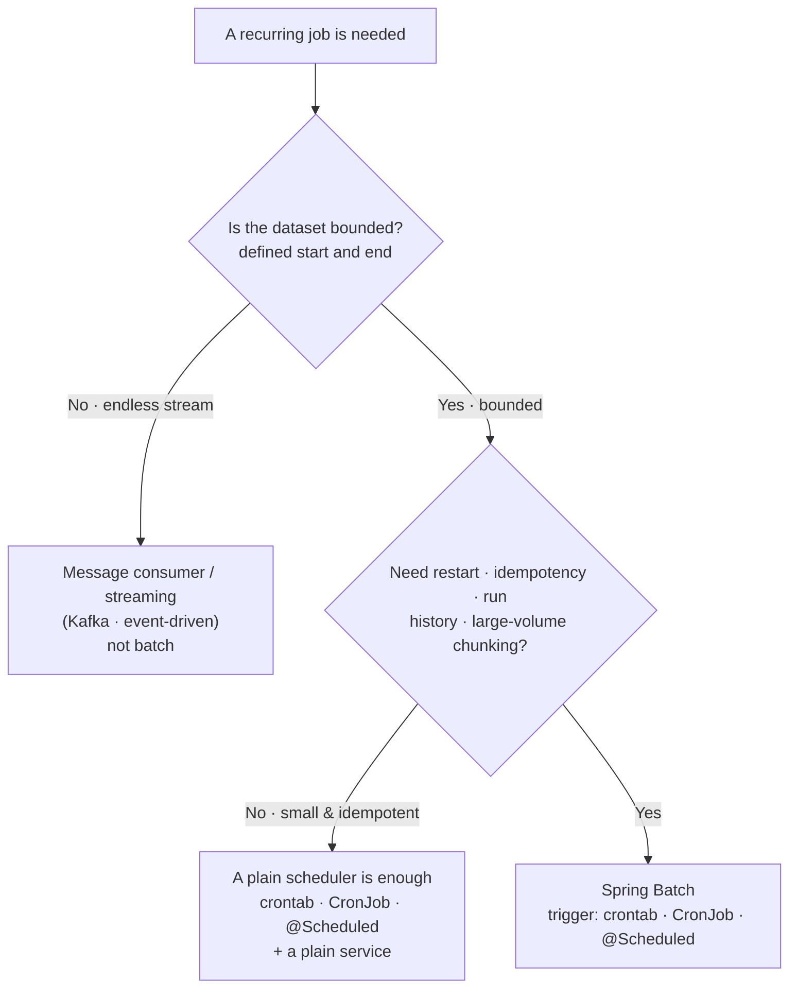
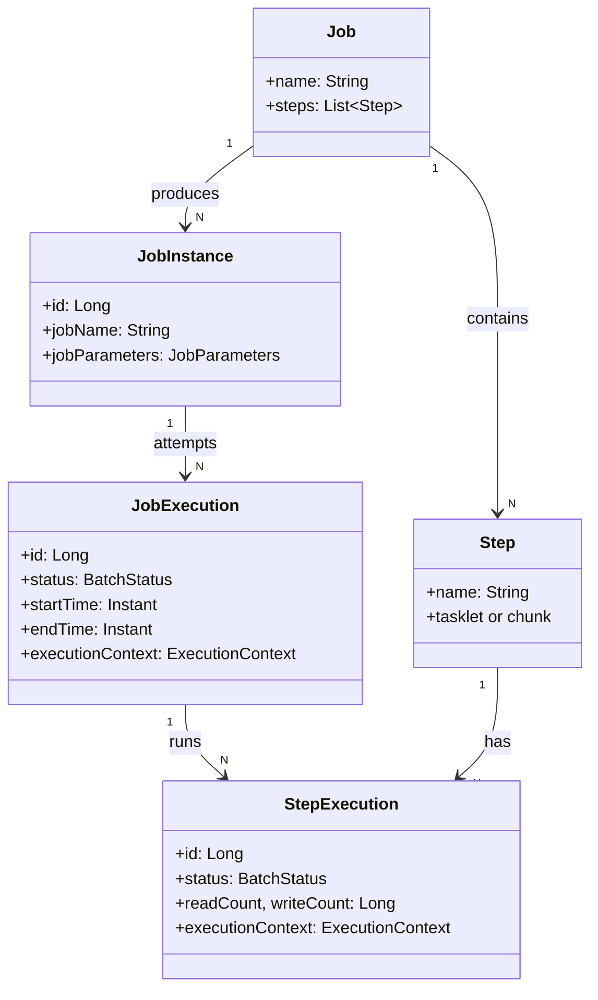
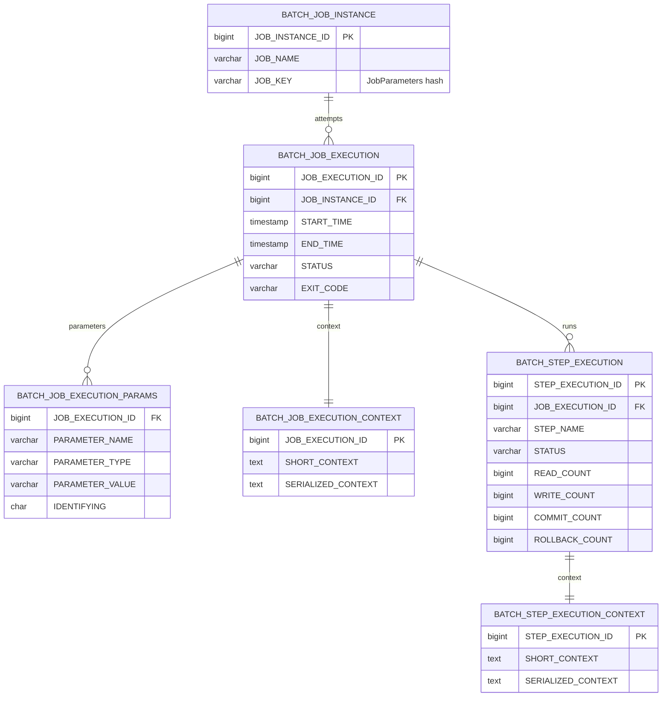

## Introduction

"What was yesterday's revenue on the marketplace?"

Once the marketplace from the Spring Boot Pre-Interview Guide series goes live, the back-office requests show up fast. Daily revenue aggregation, unsettled order cleanup, expired-token purge, dormant-member rotation — none of these are user-triggered. They are time-triggered.

The simplest start is a single `@Scheduled` method that runs every morning. It works. For a while. Then questions begin to pile up: "Yesterday's job died halfway, where do I restart from?", "Re-running it processed the same orders twice and doubled the revenue", "One validation failure rolled back the entire job and lost 230,000 records."

That is where <strong>Spring Batch</strong> belongs. Spring Batch is a framework for "running batch jobs safely, persisting intermediate state as metadata, and resuming from the failure point." Part 1 covers the vocabulary (Job, Step, JobInstance, JobExecution), the six JobRepository metadata tables, your first Hello Tasklet, and the 5.x → 6.x migration essentials.

The target reader is a backend engineer who has either followed the Spring Boot Pre-Interview Guide series or has solid Spring Boot fundamentals. No prior Spring Batch 5.x experience is required — we settle into 6.x from scratch.

- <strong>Part 1 — Job · Step · Metadata Identity (this post)</strong>
- [Part 2 — Chunk-Oriented Processing — Reader · Processor · Writer](/blog/en/spring-batch-6-guide-2)
- Part 3 — Transactions · Failure Handling — Skip · Retry · Restart (upcoming)
- Part 4 — Job Launch · Scheduling · Operations (upcoming)
- Part 5 — Performance · Parallelism — Multi-thread · Partitioning · Remote Workers (upcoming)
- Part 6 — Observability · Testing · Deployment (upcoming)
- Capstone — Marketplace Analytics Pipeline (upcoming)

---

## TL;DR

- <strong>Job = the batch definition, Step = the unit that does work</strong> — one Job contains one or more Steps. JobInstance is the logical execution keyed by business parameters; JobExecution is one attempt of that instance.
- <strong>JobRepository = the single source of truth for metadata</strong> — six tables (`BATCH_JOB_INSTANCE` / `BATCH_JOB_EXECUTION` / `BATCH_JOB_EXECUTION_PARAMS` / `BATCH_JOB_EXECUTION_CONTEXT` / `BATCH_STEP_EXECUTION` / `BATCH_STEP_EXECUTION_CONTEXT`) hold execution history, status, and context — the foundation for restart and idempotency.
- <strong>Chunk vs Tasklet</strong> — large read-process-write cycles are chunk-oriented (Part 2 covers this in depth); one-shot system actions (delete a file, call one external API) are Tasklets. Our Hello starts with Tasklet.
- <strong>5.x → 6.x essentials</strong> — Jakarta EE 10 (`javax.batch` → `jakarta.batch`), Java 17 baseline, `@EnableBatchProcessing` auto-activates, `JobBuilderFactory`/`StepBuilderFactory` removed (use `JobBuilder`/`StepBuilder` directly), fully compatible with Spring Boot 4 auto-configuration.
- <strong>Hello Job</strong> — Spring Boot 4 auto-config + Kotlin DSL gets you running from a single class. PostgreSQL 16 + `spring.batch.jdbc.initialize-schema=always` provisions the metadata tables automatically.

---

## 1. Why Spring Batch

### 1.1 When Do You Reach for Batch — A Decision Guide

Let us clear up a common myth first. <strong>"Batch = large data" is only half true.</strong> Volume is the most common reason to reach for batch, not its definition. A 1,000-row job still belongs in batch if it needs "restart from where it died," "safe re-runs with the same date," or "a record of what ran and when."

The real test is two questions.

- <strong>Is the dataset bounded?</strong> — yesterday's orders, this month's settlement: a dataset with a defined start and end. An endless event stream is not batch territory — that belongs to a message consumer (Kafka and friends).
- <strong>Do you need reliability?</strong> — restart, idempotency, run history, or large-volume chunking. If the work is small, fast, and a single statement (`DELETE ... WHERE created_at < ...`), bolting on batch is over-engineering.

If both answers are "yes," it is batch.



One thing matters here. <strong>"When it runs" and "how it runs safely" are separate axes.</strong> crontab, CronJob, and `@Scheduled` are all triggers (the when); Spring Batch is the execution engine (the how) that the trigger invokes. They do not compete — they compose: crontab launches `java -jar app.jar`, or `@Scheduled` calls `JobLauncher`.

Whether or not you use batch, "when to run it" comes down to one of these three.

| Trigger | Layer | Unit of execution | Direct access to beans/DB | Multi-instance duplication |
|---------|-------|-------------------|---------------------------|----------------------------|
| OS `crontab` | Host | New process (`java -jar`) | ✗ (cold JVM start each time) | Per host — manage it yourself |
| K8s `CronJob` | Cluster | New Pod (container) | ✗ (cold Pod start each time) | Cluster guarantees one run (concurrency policy) |
| `@Scheduled` | In-app | Method call | ✓ (the live context) | Runs on every instance — needs ShedLock etc. |

The key difference: <strong>crontab and CronJob spin up a fresh process every time (cold start), while `@Scheduled` runs inside the live app.</strong> In a containerized deployment, K8s CronJob is the idiomatic choice over crontab. Either way, if the job body is written with Spring Batch, you can swap the trigger freely.

> <strong>Note</strong>: Even for a small job, `@Scheduled` firing twice across multiple instances is a common incident. Without batch you may still need a distributed lock like ShedLock, or CronJob's single-run guarantee. With batch, the JobInstance lock prevents this duplication automatically (§1.4).

### 1.2 Project Setup — build.gradle.kts + application.yml

The series default stack is <strong>Spring Boot 4 + Kotlin 2.3 + Java 21 + PostgreSQL 16</strong>.

> <strong>Note — Spring Boot 4 + Kotlin 2.3 project setup</strong>: The baseline Spring Boot 4 setup (`kotlin-spring` / `kotlin-jpa` plugins, the `build.gradle.kts` skeleton, profile-based `application.yml`) is covered in [Spring Boot Pre-Interview Guide Part 1, §1.1](/blog/en/spring-boot-pre-interview-guide-1). This post stacks Spring Batch 6 dependencies and metadata datasource configuration on top of that. The Kotlin 2.x line is backward compatible, so the same code works on 2.0 through 2.3.

**build.gradle.kts** (batch-relevant parts only):

```kotlin
plugins {
    id("org.springframework.boot") version "4.0.0"
    id("io.spring.dependency-management") version "1.1.6"
    kotlin("jvm") version "2.3.0"
    kotlin("plugin.spring") version "2.3.0"
    kotlin("plugin.jpa") version "2.3.0"
}

dependencies {
    implementation(libs.spring.boot.starter.batch)
    implementation(libs.spring.boot.starter.data.jpa)
    runtimeOnly(libs.postgresql)

    testImplementation(libs.spring.boot.starter.test)
    testImplementation(libs.spring.batch.test)
}
```

`spring-boot-starter-batch` is the single entry point for everything Spring Batch 6. The JPA starter is not strictly required for jobs themselves, but it pairs naturally with the domain objects we will manipulate, so we pull it in from Part 1.

> <strong>Note — `libs.x` notation is a Gradle Version Catalog</strong>: dependencies are declared once in `gradle/libs.versions.toml` and referenced from `build.gradle.kts` via a type-safe `libs.x.y.z` accessor (stable since Gradle 7.4, March 2022). If catalogs are unfamiliar, you can read the code as the equivalent string form — `implementation("org.springframework.boot:spring-boot-starter-batch")` works identically. We use catalogs to match the Spring Boot Pre-Interview Guide series convention and to share one catalog across multiple modules in Part 7 (multi-module). The TOML body is in the fold below.

<details>
<summary><strong>Expand — gradle/libs.versions.toml for the dependencies above</strong></summary>

```toml
[versions]
spring-boot = "4.0.0"
kotlin = "2.3.0"
postgresql = "42.7.4"

[libraries]
spring-boot-starter-batch = { module = "org.springframework.boot:spring-boot-starter-batch" }
spring-boot-starter-data-jpa = { module = "org.springframework.boot:spring-boot-starter-data-jpa" }
spring-boot-starter-test = { module = "org.springframework.boot:spring-boot-starter-test" }
spring-batch-test = { module = "org.springframework.batch:spring-batch-test" }
postgresql = { module = "org.postgresql:postgresql", version.ref = "postgresql" }
```

Two things to remember.

- <strong>Hyphens in the TOML become dots in the Kotlin accessor</strong> — `spring-boot-starter-batch` becomes `libs.spring.boot.starter.batch`, and the IDE auto-completes it.
- <strong>The Spring Boot BOM manages the transitive versions for batch/jpa/test</strong> — that is why `spring-boot-starter-batch` has no `version.ref`. Only dependencies outside the BOM (the PostgreSQL driver here) carry an explicit version.

To activate the catalog, add one block to `settings.gradle.kts`:

```kotlin
dependencyResolutionManagement {
    versionCatalogs {
        create("libs") {
            from(files("gradle/libs.versions.toml"))
        }
    }
}
```

The name passed to `create("libs")` becomes the accessor prefix in `build.gradle.kts`. A different name (e.g. `bundles`) yields `bundles.x.y.z`.

</details>

**application.yml**:

```yaml
spring:
  datasource:
    url: jdbc:postgresql://localhost:5432/batch_guide
    username: batch
    password: batch
    driver-class-name: org.postgresql.Driver

  batch:
    jdbc:
      initialize-schema: always   # auto-provision the six metadata tables
    job:
      enabled: false              # do not auto-run jobs at boot
```

Two keys matter here.

- `spring.batch.jdbc.initialize-schema: always` — Spring Batch creates the six metadata tables if they are missing. Convenient for local and test; in production, set this to `never` and use Flyway/Liquibase for explicit migrations.
- `spring.batch.job.enabled: false` — the default (`true`) runs every Job bean in the context once at startup. Jobs should be triggered by a scheduler or external caller, so turn this off (Part 4 will revisit job launching).

### 1.3 The Problems With Starting From `@Scheduled` Alone

The simplest back-office job looks like this.

```kotlin
@Component
class DailySalesAggregator(
    private val orderRepository: OrderRepository,
    private val dailySalesRepository: DailySalesRepository,
) {
    @Scheduled(cron = "0 0 1 * * *")  // every day at 01:00
    fun aggregate() {
        val yesterday = LocalDate.now().minusDays(1)
        val orders = orderRepository.findByOrderedOn(yesterday)
        val total = orders.sumOf { it.totalPrice }
        dailySalesRepository.save(DailySales(date = yesterday, total = total))
    }
}
```

It works — until the following questions start showing up.

- Yesterday's job died midway. Nobody knows where it stopped or where to restart from.
- Re-running with the same date inserts a duplicate row in `DailySales`.
- Processing 1M records in a single method runs out of memory.
- One validation failure rolls back the entire transaction and erases 990,000 rows.
- The same job runs twice when two app instances are deployed simultaneously.

Solving each issue separately ends with you maintaining a "job-execution metadata table," "checkpoint columns," "batch lock tables," and "restart logic." The result is essentially a reimplementation of Spring Batch.

### 1.4 What Spring Batch Gives You

Side by side:

| Concern | `@Scheduled` alone | Spring Batch 6 |
|---------|--------------------|----------------|
| Execution history | Log/DB it yourself | JobRepository records it automatically |
| Restart point | Manage by hand | Stored in ExecutionContext automatically |
| Idempotency | Design your own key | JobParameters give it naturally |
| Transaction boundary | One method = one transaction | Per-chunk commit |
| Failure handling | Manual try-catch | Skip · Retry · NoRollback policies |
| Single execution | External lock | JobInstance + JobExecution locking |
| Parallelism | Hand-rolled thread pool | Multi-thread Step · Partitioning |
| Metrics | Expose yourself | Six Micrometer metrics out of the box |

If `@Scheduled` solves "when does it run," Spring Batch solves "how does it run safely once it has started." They usually go together — `@Scheduled` calls `JobLauncher` (Part 4).

---

## 2. Job · Step · JobInstance · JobExecution

### 2.1 Vocabulary Mapping

The five terms are confusing at first. One sentence each.

- <strong>Job</strong> — the definition of a batch job. You define one Job bean named "daily-sales-aggregation" exactly once in your codebase.
- <strong>JobInstance</strong> — a logical execution keyed by business parameters. "daily-sales-aggregation · `targetDate=2026-05-16`" is one JobInstance. Re-running with the same key reuses the same JobInstance.
- <strong>JobExecution</strong> — one attempt at a JobInstance. If the first attempt fails, a second attempt is a new JobExecution still attached to the same JobInstance.
- <strong>Step</strong> — a stage within a Job. "Read orders → aggregate → save" is one Step.
- <strong>StepExecution</strong> — one attempt at a Step. Each JobExecution produces one StepExecution per Step in the job.

### 2.2 Relationship Diagram



Two things to internalize.

- <strong>JobInstance is unique by business key.</strong> Re-running with the same `targetDate=2026-05-16` reuses the existing JobInstance. If that JobInstance has already completed successfully, the second invocation is rejected with `JobInstanceAlreadyCompleteException`. That is your first line of defense against duplicate processing.
- <strong>A failed JobInstance is restartable.</strong> Re-running with the same key attaches a new JobExecution to the same JobInstance, reads the previous StepExecution's ExecutionContext, and decides where to resume.

### 2.3 The Role of ExecutionContext

`ExecutionContext` is a map-shaped record of "what this job/step has done so far." There are two kinds.

| Kind | Scope | Use |
|------|-------|-----|
| Job ExecutionContext | One JobExecution | State that spans the whole job (e.g. which file is being processed) |
| Step ExecutionContext | One StepExecution | Per-step progress (e.g. which page a paging Reader has read up to) |

The most common use is <strong>letting the Reader automatically remember where it left off</strong>. `JdbcPagingItemReader` and `JpaPagingItemReader` write the current page number to the Step ExecutionContext on every chunk commit. If the job dies and restarts, it picks up from that position. Part 3 covers this in depth.

---

## 3. The Six JobRepository Metadata Tables

`JobRepository` is the Spring Batch component that persists all the metadata above. Spring Boot 4 auto-configuration creates and registers it when it sees a datasource. You will rarely define it as a bean yourself.

### 3.1 The ER Diagram

The six tables that `spring.batch.jdbc.initialize-schema: always` provisions relate like this.



### 3.2 What Each Table Owns

| Table | Responsibility |
|-------|---------------|
| `BATCH_JOB_INSTANCE` | Logical execution unit, unique by job name + `JOB_KEY` (a hash of JobParameters) |
| `BATCH_JOB_EXECUTION` | Status and start/end timestamps for one attempt of a JobInstance |
| `BATCH_JOB_EXECUTION_PARAMS` | One row per JobParameters key/value, including the type |
| `BATCH_JOB_EXECUTION_CONTEXT` | Serialized payload of the job-level ExecutionContext |
| `BATCH_STEP_EXECUTION` | Status plus read/write/commit/rollback counters for each StepExecution |
| `BATCH_STEP_EXECUTION_CONTEXT` | Serialized payload of the step-level ExecutionContext |

The `IDENTIFYING` column is worth noting. Each JobParameters key is flagged `Y/N` for "does this key participate in JobInstance identity?" For example, `targetDate` would be Y (same date = same job), while `triggeredBy=manual` could be N (the trigger source should not affect identity).

### 3.3 What the Metadata Means in Operations

From an operator's perspective, the metadata gives you three things.

- <strong>Execution history</strong> — every run, every attempt, every failure lands in `BATCH_JOB_EXECUTION`. No separate log pipeline needed for basic tracking.
- <strong>Restart decisions</strong> — if a `JOB_KEY` matches a JobInstance that previously failed, the framework continues that instance. The caller (scheduler) just re-invokes with the same parameters.
- <strong>Dashboard source data</strong> — Spring Batch Admin is gone (EOL in 2014), but these six tables are exactly what you read to build a Grafana panel or an internal dashboard. Part 6 (observability) returns to this.

---

## 4. Your First Job — Hello Tasklet

Now build the Hello Job. A Tasklet is the simplest Step type — "run once, done."

### 4.1 The Tasklet

```kotlin
import org.springframework.batch.core.StepContribution
import org.springframework.batch.core.scope.context.ChunkContext
import org.springframework.batch.core.step.tasklet.Tasklet
import org.springframework.batch.repeat.RepeatStatus
import org.springframework.stereotype.Component

@Component
class HelloTasklet : Tasklet {
    override fun execute(contribution: StepContribution, chunkContext: ChunkContext): RepeatStatus {
        val jobName = chunkContext.stepContext.jobName
        val stepName = chunkContext.stepContext.stepName
        println("[$jobName / $stepName] Hello, Spring Batch 6!")
        return RepeatStatus.FINISHED
    }
}
```

`RepeatStatus.FINISHED` means "one execution is enough, move on." Returning `RepeatStatus.CONTINUABLE` re-invokes the same Tasklet — rarely useful outside chunk-oriented patterns.

### 4.2 Job · Step Composition — Kotlin DSL

Spring Batch 6 builds `JobBuilder` and `StepBuilder` directly. The 5.x `JobBuilderFactory`/`StepBuilderFactory` are gone.

```kotlin
import org.springframework.batch.core.Job
import org.springframework.batch.core.Step
import org.springframework.batch.core.job.builder.JobBuilder
import org.springframework.batch.core.repository.JobRepository
import org.springframework.batch.core.step.builder.StepBuilder
import org.springframework.context.annotation.Bean
import org.springframework.context.annotation.Configuration
import org.springframework.transaction.PlatformTransactionManager

@Configuration
class HelloJobConfig {

    @Bean
    fun helloJob(jobRepository: JobRepository, helloStep: Step): Job =
        JobBuilder("helloJob", jobRepository)
            .start(helloStep)
            .build()

    @Bean
    fun helloStep(
        jobRepository: JobRepository,
        transactionManager: PlatformTransactionManager,
        helloTasklet: HelloTasklet,
    ): Step =
        StepBuilder("helloStep", jobRepository)
            .tasklet(helloTasklet, transactionManager)
            .build()
}
```

Three injections matter.

- `JobRepository` — writes metadata to the six tables above. Provided by Spring Boot 4 auto-configuration.
- `PlatformTransactionManager` — wraps Tasklet execution in a transaction. If JPA is on the classpath, `JpaTransactionManager` is registered automatically.
- `HelloTasklet` — the Tasklet bean above, pulled in via DI thanks to `@Component`.

### 4.3 Running It and Inspecting the Metadata

Since we set `spring.batch.job.enabled: false`, the job has to be launched explicitly. The easiest way is a `CommandLineRunner`.

```kotlin
@Component
class HelloJobRunner(
    private val jobLauncher: JobLauncher,
    private val helloJob: Job,
) : CommandLineRunner {
    override fun run(vararg args: String) {
        val params = JobParametersBuilder()
            .addLocalDateTime("runAt", LocalDateTime.now())
            .toJobParameters()
        jobLauncher.run(helloJob, params)
    }
}
```

`runAt` is always different, so each launch produces a fresh JobInstance. In production you would normally use a business key like `targetDate=2026-05-16` (Part 4 covers JobParameters design).

The console shows one line.

```text
[helloJob / helloStep] Hello, Spring Batch 6!
```

But the database has quietly filled in metadata.

```sql
SELECT job_instance_id, job_name, job_key
FROM batch_job_instance;

SELECT job_execution_id, job_instance_id, status, start_time, end_time
FROM batch_job_execution;

SELECT step_execution_id, step_name, status, read_count, write_count, commit_count
FROM batch_step_execution;
```

All three tables gained one row each. Running the same code again adds a new row to each (a fresh `runAt` produces a different `JOB_KEY`, hence a new JobInstance, a new JobExecution, and a new StepExecution).

---

## 5. 5.x → 6.x Migration Notes

For readers already on 5.x. Greenfield projects can skim — everything through §4 is the 6.x canonical pattern.

### 5.1 What Changed

| Area | Spring Batch 5.x | Spring Batch 6.x |
|------|------------------|------------------|
| Java baseline | Java 17 | Java 17 (Spring Boot 4 recommends Java 21) |
| Jakarta | `jakarta.*` (since 5.0) | `jakarta.*` (unchanged) |
| Builder Factory | `JobBuilderFactory`/`StepBuilderFactory` (deprecated) | Removed — construct `JobBuilder`/`StepBuilder` directly |
| `@EnableBatchProcessing` | Required to activate auto-config | Auto-activated (starter is enough); only needed when customizing options |
| `AbstractBatchConfiguration` | Present | Removed |
| Metadata schema | Existing schema compatible | Same schema, some additional indexes |
| `DefaultBatchConfigurer` | Deprecated | Removed — extend `DefaultBatchConfiguration` instead |

In practice the migration boils down to two rewrites.

- `JobBuilderFactory.get("name").start(...)` → `JobBuilder("name", jobRepository).start(...)`
- `StepBuilderFactory.get("name").tasklet(...)` → `StepBuilder("name", jobRepository).tasklet(taskletBean, transactionManager)`

### 5.2 Why `@EnableBatchProcessing` Auto-Activates

Up through 5.x, omitting `@EnableBatchProcessing` meant the Spring Batch infrastructure (JobRepository, JobLauncher, etc.) was never registered. In 6.x + Spring Boot 4, the auto-configuration activates whenever `spring-boot-starter-batch` is on the classpath.

You only add `@EnableBatchProcessing` back in two cases.

- **Pinning the metadata datasource when multiple exist** — `@EnableBatchProcessing(dataSourceRef = "batchDataSource", transactionManagerRef = "batchTransactionManager")`.
- **Customizing some of the auto-configured beans** — extend `DefaultBatchConfiguration` and override the methods you need.

The series default — marketplace data and batch metadata on the same PostgreSQL instance — is fine with the auto-activated version. The capstone, which separates the operational and analytics schemas across two datasources, is where we will reach for explicit `@EnableBatchProcessing`.

### 5.3 Dependency Versions

You almost never pin the Spring Batch version directly in `build.gradle.kts`. The Spring Boot 4 BOM manages the Spring Batch 6 version. That is exactly why the §1.2 catalog example does not carry a `version.ref` for `spring-boot-starter-batch` — the BOM brings it in transitively.

Spring Boot 4.0 pairs with Spring Batch 6.0. Do not pin them separately — let the BOM raise them together.

---

## Recap

The takeaways of Part 1, one line each.

- <strong>Nail the Job · Step · JobInstance · JobExecution vocabulary first.</strong> Definition (Job) / business-keyed execution (JobInstance) / one attempt (JobExecution) / stage (Step) / one stage attempt (StepExecution). Everything else stacks on top of these five words.
- <strong>The six JobRepository tables ARE the foundation for restart and idempotency.</strong> No need to roll your own checkpoint table. `JOB_KEY` is the business-key hash, and ExecutionContext records how far processing got.
- <strong>Tasklet is one-shot; chunk is for bulk processing.</strong> Hello starts with Tasklet, but 99% of real jobs are chunk-oriented (Part 2).
- <strong>The 5.x → 6.x migration is essentially two lines.</strong> Remove `JobBuilderFactory`/`StepBuilderFactory`, drop the explicit `@EnableBatchProcessing`. Most other code is unchanged.
- <strong>Spring Boot 4 auto-configuration handles 90% of the wiring.</strong> Provide a datasource and you get JobRepository, JobLauncher, and TransactionManager for free. The only beans you write yourself are Jobs, Steps, and Tasklets/chunks.

Part 2 takes on <strong>chunk-oriented processing</strong>. We move beyond printing a single line and tackle "read 100,000 orders in pages of 1,000, transform, and write them back" — the chunk lifecycle, choosing between `ItemReader` / `ItemProcessor` / `ItemWriter`, and the most common point of confusion: <strong>page size vs chunk size</strong>.

---

## Appendix

### A. The Six Metadata Tables — DDL (PostgreSQL)

Identical to what `spring.batch.jdbc.initialize-schema: always` provisions. Use as a reference when codifying explicit migrations in Flyway/Liquibase.

<details>
<summary><strong>Full DDL — six tables + sequences for PostgreSQL</strong></summary>

```sql
CREATE TABLE BATCH_JOB_INSTANCE (
    JOB_INSTANCE_ID BIGINT NOT NULL PRIMARY KEY,
    VERSION BIGINT,
    JOB_NAME VARCHAR(100) NOT NULL,
    JOB_KEY VARCHAR(32) NOT NULL,
    CONSTRAINT JOB_INST_UN UNIQUE (JOB_NAME, JOB_KEY)
);

CREATE TABLE BATCH_JOB_EXECUTION (
    JOB_EXECUTION_ID BIGINT NOT NULL PRIMARY KEY,
    VERSION BIGINT,
    JOB_INSTANCE_ID BIGINT NOT NULL,
    CREATE_TIME TIMESTAMP NOT NULL,
    START_TIME TIMESTAMP DEFAULT NULL,
    END_TIME TIMESTAMP DEFAULT NULL,
    STATUS VARCHAR(10),
    EXIT_CODE VARCHAR(2500),
    EXIT_MESSAGE VARCHAR(2500),
    LAST_UPDATED TIMESTAMP,
    CONSTRAINT JOB_INST_EXEC_FK FOREIGN KEY (JOB_INSTANCE_ID)
        REFERENCES BATCH_JOB_INSTANCE(JOB_INSTANCE_ID)
);

CREATE TABLE BATCH_JOB_EXECUTION_PARAMS (
    JOB_EXECUTION_ID BIGINT NOT NULL,
    PARAMETER_NAME VARCHAR(100) NOT NULL,
    PARAMETER_TYPE VARCHAR(100) NOT NULL,
    PARAMETER_VALUE VARCHAR(2500),
    IDENTIFYING CHAR(1) NOT NULL,
    CONSTRAINT JOB_EXEC_PARAMS_FK FOREIGN KEY (JOB_EXECUTION_ID)
        REFERENCES BATCH_JOB_EXECUTION(JOB_EXECUTION_ID)
);

CREATE TABLE BATCH_JOB_EXECUTION_CONTEXT (
    JOB_EXECUTION_ID BIGINT NOT NULL PRIMARY KEY,
    SHORT_CONTEXT VARCHAR(2500) NOT NULL,
    SERIALIZED_CONTEXT TEXT,
    CONSTRAINT JOB_EXEC_CTX_FK FOREIGN KEY (JOB_EXECUTION_ID)
        REFERENCES BATCH_JOB_EXECUTION(JOB_EXECUTION_ID)
);

CREATE TABLE BATCH_STEP_EXECUTION (
    STEP_EXECUTION_ID BIGINT NOT NULL PRIMARY KEY,
    VERSION BIGINT NOT NULL,
    STEP_NAME VARCHAR(100) NOT NULL,
    JOB_EXECUTION_ID BIGINT NOT NULL,
    CREATE_TIME TIMESTAMP NOT NULL,
    START_TIME TIMESTAMP DEFAULT NULL,
    END_TIME TIMESTAMP DEFAULT NULL,
    STATUS VARCHAR(10),
    COMMIT_COUNT BIGINT,
    READ_COUNT BIGINT,
    FILTER_COUNT BIGINT,
    WRITE_COUNT BIGINT,
    READ_SKIP_COUNT BIGINT,
    WRITE_SKIP_COUNT BIGINT,
    PROCESS_SKIP_COUNT BIGINT,
    ROLLBACK_COUNT BIGINT,
    EXIT_CODE VARCHAR(2500),
    EXIT_MESSAGE VARCHAR(2500),
    LAST_UPDATED TIMESTAMP,
    CONSTRAINT JOB_EXEC_STEP_FK FOREIGN KEY (JOB_EXECUTION_ID)
        REFERENCES BATCH_JOB_EXECUTION(JOB_EXECUTION_ID)
);

CREATE TABLE BATCH_STEP_EXECUTION_CONTEXT (
    STEP_EXECUTION_ID BIGINT NOT NULL PRIMARY KEY,
    SHORT_CONTEXT VARCHAR(2500) NOT NULL,
    SERIALIZED_CONTEXT TEXT,
    CONSTRAINT STEP_EXEC_CTX_FK FOREIGN KEY (STEP_EXECUTION_ID)
        REFERENCES BATCH_STEP_EXECUTION(STEP_EXECUTION_ID)
);

CREATE SEQUENCE BATCH_STEP_EXECUTION_SEQ START WITH 1 INCREMENT BY 1;
CREATE SEQUENCE BATCH_JOB_EXECUTION_SEQ START WITH 1 INCREMENT BY 1;
CREATE SEQUENCE BATCH_JOB_SEQ START WITH 1 INCREMENT BY 1;
```

</details>

### B. Extended 5.x → 6.x Migration Notes

<details>
<summary><strong>Extended table — Builder · Configuration · Listener signatures</strong></summary>

| Area | 5.x | 6.x |
|------|-----|-----|
| Job creation | `JobBuilderFactory.get("x")` | `JobBuilder("x", jobRepository)` |
| Step creation | `StepBuilderFactory.get("x")` | `StepBuilder("x", jobRepository)` |
| Tasklet composition | `.tasklet(tasklet)` | `.tasklet(tasklet, transactionManager)` |
| Chunk signature | `.<I, O>chunk(size)` | `.<I, O>chunk(size, transactionManager)` |
| Auto-config | `@EnableBatchProcessing` required | Auto-activated via starter |
| Customization hook | Extend `DefaultBatchConfigurer` | Extend `DefaultBatchConfiguration` |
| `@EnableTask` (Spring Cloud Task) | Unchanged | Unchanged |

</details>

### C. External References

- [Spring Batch 6 reference](https://docs.spring.io/spring-batch/reference/) — official 6.x documentation
- [Spring Boot 4 batch auto-configuration](https://docs.spring.io/spring-boot/reference/io/batch.html) — full `spring.batch.*` property surface
- [Spring Batch 5.x → 6.x migration guide](https://github.com/spring-projects/spring-batch/wiki/Spring-Batch-6.0-Migration-Guide) — official wiki migration notes
