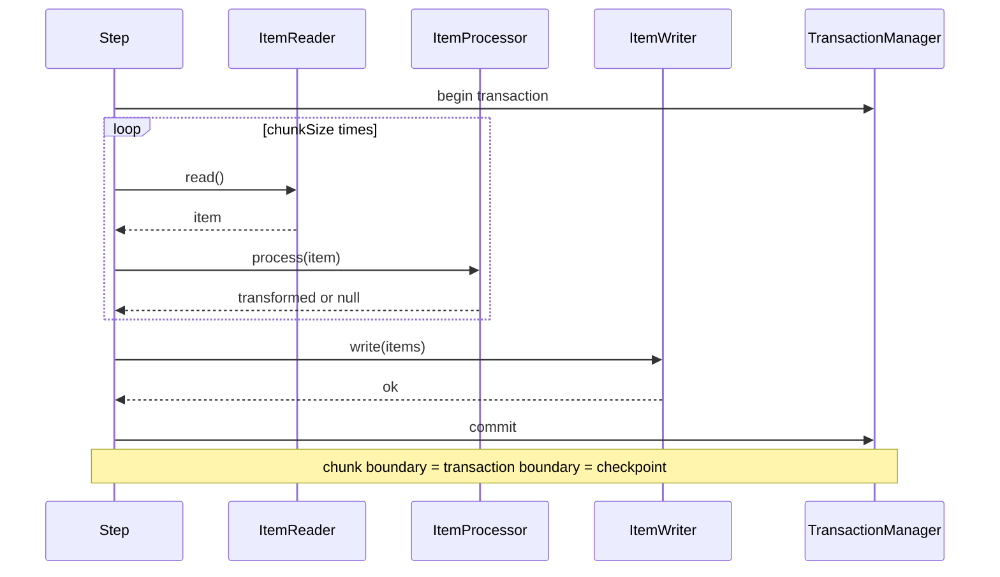
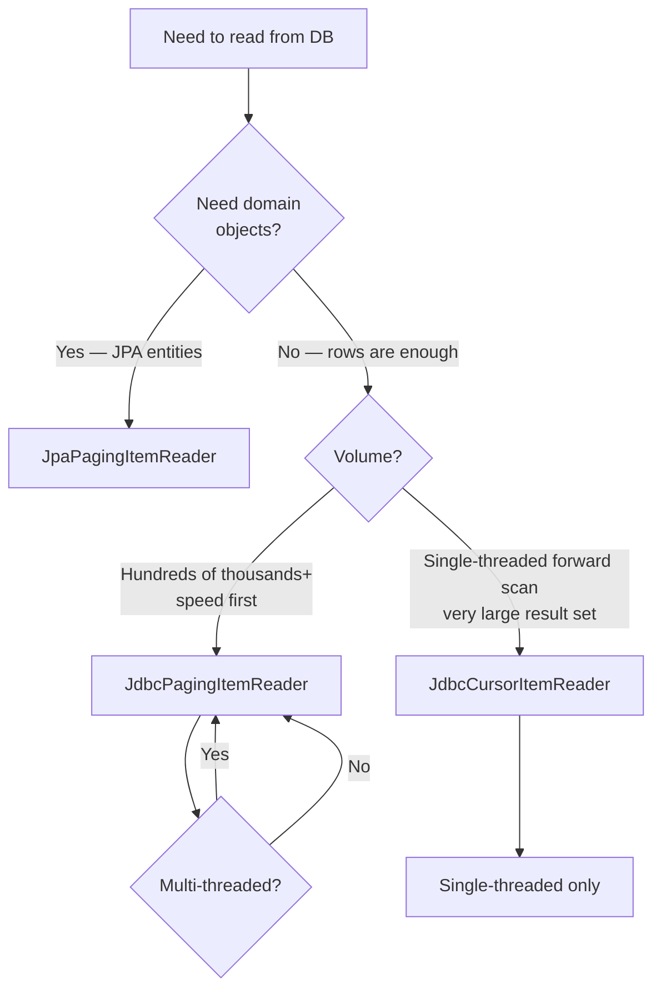
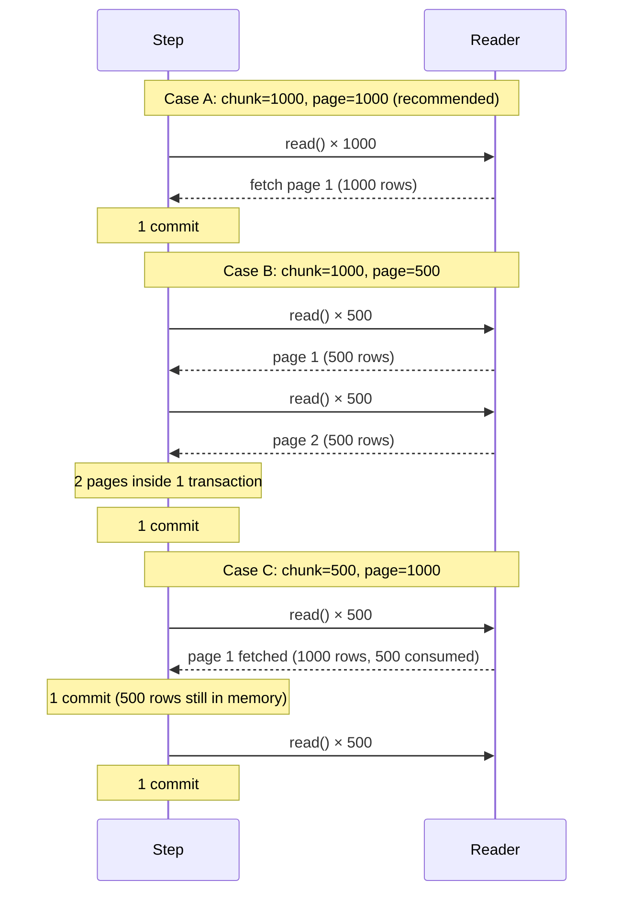

## Introduction

In [Part 1](/blog/en/spring-batch-6-guide-1) we finished "running a Hello Tasklet end to end." But 99% of real batch jobs are not a single line — they are a cycle that reads 100,000 orders in chunks, transforms them, and writes them back.

That cycle is <strong>chunk-oriented processing</strong>. This is where Spring Batch diverges from any other scheduler framework. "Read N → process N → write N → commit" is wrapped in a single transaction, and that boundary becomes the metadata checkpoint (which Part 3 on restart will rely on).

Part 2 covers the chunk mechanism, which of the six `ItemReader` implementations to pick and when, `ItemProcessor` patterns for transform/filter/composite, the `JpaItemWriter` vs `JdbcBatchItemWriter` trade-off (especially the idempotency key pattern), and the most-confused topic — <strong>page size vs chunk size</strong> — finished in one post.

The target reader is a backend engineer who has read Part 1 or has internalized the Spring Batch vocabulary already. JPA and JDBC fundamentals are assumed.

- Part 1 — Job · Step · Metadata Identity
- <strong>Part 2 — Chunk-Oriented Processing — Reader · Processor · Writer (this post)</strong>
- Part 3 — Transactions · Failure Handling — Skip · Retry · Restart (upcoming)
- Part 4 — Job Launch · Scheduling · Operations (upcoming)
- Part 5 — Performance · Parallelism — Multi-thread · Partitioning · Remote Workers (upcoming)
- Part 6 — Observability · Testing · Deployment (upcoming)
- Capstone — Marketplace Analytics Pipeline (upcoming)

---

## TL;DR

- <strong>The chunk cycle = read N → process N → write N → commit, and that one cycle is one transaction</strong> — 10,000 items at chunk size 1,000 means 10 transactions. The chunk boundary IS the metadata checkpoint.
- <strong>Reader selection tree</strong> — for DBs use `JpaPagingItemReader` (domain objects) or `JdbcPagingItemReader` (fast and lightweight); for one-shot huge result sets use `JdbcCursorItemReader`; for files use `FlatFileItemReader` / `JsonItemReader` / `StaxEventItemReader`.
- <strong>ItemProcessor is transform + filter + composite</strong> — returning `null` means the item never reaches the writer (filter role). `CompositeItemProcessor` chains several processors into a pipeline.
- <strong>Writer is a JPA vs JDBC trade-off</strong> — `JpaItemWriter` feels natural for domain persistence but watch flush/clear and dirty checking. `JdbcBatchItemWriter` is far faster via batch insert but skips the persistence context. Idempotency is solved with PostgreSQL `INSERT ... ON CONFLICT DO UPDATE`.
- <strong>Page size ≠ chunk size</strong> — page size is what the Reader pulls per fetch; chunk size is what the Step processes and commits per transaction. Usually equal, but if not, either one transaction spans multiple Reader pages, or one page spans multiple transactions.

---

## 1. The Chunk Mechanism

### 1.1 One Cycle Walked Through

A chunk-oriented Step repeats the following sequence.



Three things to notice.

- <strong>Read is one-at-a-time, write is N-at-a-time</strong> — the Reader returns a single item per call (`null` terminates the Step). The Processor also transforms one item at a time. Only the Writer receives the full List at the end of the chunk.
- <strong>One chunk = one transaction</strong> — the chunk starts with begin, ends with commit. If any item throws during the chunk, the entire chunk rolls back (Part 3 covers Skip/Retry to soften this).
- <strong>Metadata updates at commit</strong> — `BATCH_STEP_EXECUTION`'s `READ_COUNT`/`WRITE_COUNT`/`COMMIT_COUNT` increment per chunk commit, and the Reader also persists its page position into the Step ExecutionContext.

### 1.2 Chunk vs Tasklet

The difference from the Tasklet we used in Part 1's Hello fits in a single table.

| Aspect | Tasklet | Chunk-oriented |
|--------|---------|----------------|
| Execution model | one call (or repeat via `RepeatStatus.CONTINUABLE`) | repeat read → process → write → commit |
| Transaction boundary | one Tasklet call = one transaction | one chunk = one transaction |
| Suitable for | file delete, single external API call, directory cleanup | bulk read-process-write |
| Metadata counters | `WRITE_COUNT`/`READ_COUNT` unused | counters tracked accurately |
| Restart position | StepExecution level (restart from start) | from page position in ExecutionContext |

The rule is plain — <strong>one input → Tasklet, N inputs → chunk</strong>.

### 1.3 Chunk Step Skeleton (Kotlin DSL)

In 6.x the `StepBuilder.chunk()` signature requires both `chunkSize` and `transactionManager`. The single-arg `chunk(size)` from 5.x is gone.

```kotlin
import org.springframework.batch.core.Step
import org.springframework.batch.core.repository.JobRepository
import org.springframework.batch.core.step.builder.StepBuilder
import org.springframework.batch.item.ItemProcessor
import org.springframework.batch.item.ItemReader
import org.springframework.batch.item.ItemWriter
import org.springframework.context.annotation.Bean
import org.springframework.context.annotation.Configuration
import org.springframework.transaction.PlatformTransactionManager

@Configuration
class DailySalesStepConfig {

    @Bean
    fun aggregateSalesStep(
        jobRepository: JobRepository,
        transactionManager: PlatformTransactionManager,
        orderReader: ItemReader<Order>,
        orderToSalesProcessor: ItemProcessor<Order, DailySalesLine>,
        salesWriter: ItemWriter<DailySalesLine>,
    ): Step =
        StepBuilder("aggregateSalesStep", jobRepository)
            .chunk<Order, DailySalesLine>(1000, transactionManager)
            .reader(orderReader)
            .processor(orderToSalesProcessor)
            .writer(salesWriter)
            .build()
}
```

The type parameters `<Order, DailySalesLine>` declare the input (what the Reader emits) and the output (what reaches the Writer after the Processor). When there is no Processor, In = Out, and one type parameter suffices.

---

## 2. ItemReader Choices

### 2.1 Comparison Table

Spring Batch 6 ships more than a dozen Reader implementations. The six worth committing to memory are:

| Reader | Source | Strategy | Concurrency-safe | Restart key |
|--------|--------|----------|------------------|-------------|
| `JpaPagingItemReader` | DB (JPA Entity) | paging (OFFSET/LIMIT) | yes | page number |
| `JdbcPagingItemReader` | DB (JDBC) | paging (sort-key based) | yes | sort key + page |
| `JdbcCursorItemReader` | DB (JDBC) | cursor (one connection, fetch row-by-row) | <strong>not thread-safe</strong> | row index |
| `FlatFileItemReader` | CSV/TSV/fixed-width text | LineMapper per line | yes | line number |
| `JsonItemReader` | JSON array | Jackson streaming | yes | object index |
| `StaxEventItemReader` | XML | StAX event stream | yes | event index |

"Concurrency-safe" answers whether the same Reader instance can be shared across threads in a multi-threaded Step (Part 5). Cursor-based readers hold a single connection and cannot be shared — to go multi-threaded, switch to a paging reader or use partitioning (Part 5).

### 2.2 DB Reader Decision Tree

When reading from a DB, the first call is paging vs cursor, and JPA vs JDBC.



Most decisions collapse to two:

- <strong>If you need domain objects, `JpaPagingItemReader`</strong> — invoke domain methods inside the Processor, leverage dirty checking, prioritize readability.
- <strong>If raw speed matters, `JdbcPagingItemReader`</strong> — skips the persistence context, lighter on memory and CPU. The default in analytics ETL jobs.

### 2.3 JpaPagingItemReader Builder

> <strong>Note — `@StepScope` and late binding</strong>: Spring beans are singletons by default, created once at app startup (job-build time) — but JobParameters like `targetDate` do not exist yet at that point. <strong>`@StepScope` is a Spring Batch scope that defers bean creation until the Step actually starts, building a fresh bean per StepExecution</strong>, which is what lets late-binding expressions like `#{jobParameters['targetDate']}` resolve to the runtime value. If a value spans the whole job, use `@JobScope` (one bean per JobExecution). A new instance per run also keeps state from leaking across restarts and parallel steps.

```kotlin
import jakarta.persistence.EntityManagerFactory
import org.springframework.batch.item.database.JpaPagingItemReader
import org.springframework.batch.item.database.builder.JpaPagingItemReaderBuilder
import org.springframework.beans.factory.annotation.Value
import org.springframework.context.annotation.Bean
import org.springframework.context.annotation.Configuration
import java.time.LocalDate

@Configuration
class OrderReaderConfig {

    @Bean
    @org.springframework.batch.core.configuration.annotation.StepScope
    fun orderReader(
        emf: EntityManagerFactory,
        @Value("#{jobParameters['targetDate']}") targetDate: LocalDate,
    ): JpaPagingItemReader<Order> =
        JpaPagingItemReaderBuilder<Order>()
            .name("orderReader")
            .entityManagerFactory(emf)
            .queryString("SELECT o FROM Order o WHERE o.orderedOn = :targetDate ORDER BY o.id")
            .parameterValues(mapOf("targetDate" to targetDate))
            .pageSize(1000)
            .build()
}
```

Three things matter.

- <strong>`@StepScope` is effectively required</strong> — as the note above explains, late binding (`jobParameters['targetDate']`) needs the bean created when the Step starts. Omit it and injection breaks because the value is missing at build time.
- <strong>`ORDER BY` must be on a stable key</strong> — paging readers work via OFFSET/LIMIT. An unstable sort key means rows can be read twice or skipped. Prefer immutable columns like the PK.
- <strong>Why `name()` is required</strong> — it is the key prefix in the Step ExecutionContext. With two readers in the same Step, it prevents context collisions.

### 2.4 JdbcPagingItemReader Builder

```kotlin
import org.springframework.batch.item.database.JdbcPagingItemReader
import org.springframework.batch.item.database.Order
import org.springframework.batch.item.database.builder.JdbcPagingItemReaderBuilder
import org.springframework.batch.item.database.support.PostgresPagingQueryProvider
import javax.sql.DataSource

@Bean
@org.springframework.batch.core.configuration.annotation.StepScope
fun jdbcOrderReader(
    dataSource: DataSource,
    @Value("#{jobParameters['targetDate']}") targetDate: LocalDate,
): JdbcPagingItemReader<OrderRow> {
    val provider = PostgresPagingQueryProvider().apply {
        setSelectClause("id, member_id, total_price, ordered_on")
        setFromClause("FROM orders")
        setWhereClause("WHERE ordered_on = :targetDate")
        setSortKeys(mapOf("id" to Order.ASCENDING))
    }
    return JdbcPagingItemReaderBuilder<OrderRow>()
        .name("jdbcOrderReader")
        .dataSource(dataSource)
        .queryProvider(provider)
        .parameterValues(mapOf("targetDate" to targetDate))
        .rowMapper { rs, _ ->
            OrderRow(
                id = rs.getLong("id"),
                memberId = rs.getLong("member_id"),
                totalPrice = rs.getLong("total_price"),
                orderedOn = rs.getDate("ordered_on").toLocalDate(),
            )
        }
        .pageSize(1000)
        .build()
}
```

Two differences from the JPA reader.

- <strong>`PagingQueryProvider` picks the DB dialect</strong> — for PostgreSQL use `PostgresPagingQueryProvider`. It emits paging SQL appropriate to the DB.
- <strong>`rowMapper` bypasses domain objects</strong> — define `RowMapper<OrderRow>` and you are done. No persistence context means no dirty checking, but it is correspondingly lightweight.

### 2.5 Aside: File Readers

File readers can be touched lightly. Just the key patterns.

| Reader | LineMapper / Tokenizer | Common use |
|--------|------------------------|------------|
| `FlatFileItemReader` | `DelimitedLineTokenizer` (CSV) / `FixedLengthTokenizer` (fixed-width) + `FieldSetMapper` | CSV ingest, legacy system exports |
| `JsonItemReader` | `JacksonJsonObjectReader<T>` | paged API result backups, third-party dumps |
| `StaxEventItemReader` | `Jaxb2Marshaller` + root tag | leftover SOAP/XML interfaces |

All file readers run on just a `Resource`, and they persist line/object index into the ExecutionContext for restart.

---

## 3. ItemProcessor Patterns

### 3.1 Three Roles in One Interface

`ItemProcessor<I, O>` is a single functional interface that plays three roles.

- <strong>Transform</strong> — `Order` → `DailySalesLine`-style type change. The most common use.
- <strong>Filter</strong> — return `null` and the item never reaches the Writer; only `StepExecution.filterCount` increments.
- <strong>Composite</strong> — chain processors through `CompositeItemProcessor`.

### 3.2 Transform Processor

```kotlin
import org.springframework.batch.item.ItemProcessor
import org.springframework.stereotype.Component

@Component
class OrderToSalesProcessor : ItemProcessor<Order, DailySalesLine> {
    override fun process(item: Order): DailySalesLine =
        DailySalesLine(
            date = item.orderedOn,
            memberId = item.memberId,
            amount = item.totalPrice,
        )
}
```

One function, done. Because the transaction boundary is at the chunk level, the Processor itself rarely cares about transactions.

### 3.3 Filter Processor

```kotlin
@Component
class SkipRefundedOrderProcessor : ItemProcessor<Order, Order> {
    override fun process(item: Order): Order? =
        if (item.status == OrderStatus.REFUNDED) null else item
}
```

Returning `null` makes the item vanish — only the counter remains. Common for validation rejection, but the intent must be explicit. Do not confuse this with Part 3's Skip policy:

- <strong>Processor returning null = intentional filtering</strong> (filterCount +1, normal flow)
- <strong>Skip policy = tolerating exceptions within a budget</strong> (skipCount +1, abnormal but allowed)

### 3.4 Composite Processor

Chain several Processors into a pipeline.

```kotlin
import org.springframework.batch.item.support.CompositeItemProcessor
import org.springframework.context.annotation.Bean

@Bean
fun orderProcessingPipeline(
    skipRefundedOrderProcessor: SkipRefundedOrderProcessor,
    orderToSalesProcessor: OrderToSalesProcessor,
): CompositeItemProcessor<Order, DailySalesLine> =
    CompositeItemProcessor<Order, DailySalesLine>().apply {
        setDelegates(listOf(skipRefundedOrderProcessor, orderToSalesProcessor))
    }
```

Processors apply in order — first filter out refunded orders, then transform the rest into sales lines. If any Processor returns `null` mid-pipeline, the chain terminates at that step (later Processors are not invoked).

### 3.5 A Common Pitfall

> <strong>Caution — do not mutate persistent objects inside the Processor</strong>: if you call setters on entities pulled by `JpaPagingItemReader`, dirty checking at the chunk commit will issue UPDATEs you did not ask for. Unless that is the intent, return a new object instead (immutable transform). If you genuinely want to mutate-and-re-persist, make that intent explicit and either omit the Writer or re-use the same entity in the Writer step.

---

## 4. ItemWriter Choices

### 4.1 JPA vs JDBC

| Aspect | `JpaItemWriter` | `JdbcBatchItemWriter` |
|--------|----------------|----------------------|
| Persistence context | yes | bypasses |
| Query shape | `merge()` or `persist()` | `addBatch()` → batch insert |
| Speed | moderate | <strong>5–10× faster</strong> (benchmark-dependent) |
| Dirty checking | available | not applicable |
| Idempotency (upsert) | `merge()` updates if PK exists | declare `ON CONFLICT` in SQL |
| flush/clear | auto flush at chunk end; clear is your concern | not applicable |
| Recommended | domain persistence, small/medium volume | analytics ingest, bulk volume |

The rule is simple.

- <strong>Domain persistence → JpaItemWriter</strong> — member dormancy rotation, order finalization, anything that should go through domain methods and invariants.
- <strong>Bulk ingest → JdbcBatchItemWriter</strong> — loading 1M of yesterday's orders into an analytics table, ingesting external CSVs, anything where domain invariants are not required.

### 4.2 JpaItemWriter Pattern

```kotlin
import jakarta.persistence.EntityManagerFactory
import org.springframework.batch.item.database.JpaItemWriter
import org.springframework.batch.item.database.builder.JpaItemWriterBuilder

@Bean
fun salesWriter(emf: EntityManagerFactory): JpaItemWriter<DailySalesLine> =
    JpaItemWriterBuilder<DailySalesLine>()
        .entityManagerFactory(emf)
        .usePersist(false)  // false = merge (upsert-ish), true = persist (insert-only)
        .build()
```

`usePersist` is the key fork.

- `usePersist = true` — insert only. If a PK is already present, expect an exception.
- `usePersist = false` (default) — uses `merge()`. Updates when the PK exists, inserts otherwise.

`merge()` is convenient but may trigger two selects (existence check plus the actual update). If you genuinely need upsert, the JDBC + `ON CONFLICT` pattern below is faster and more explicit.

### 4.3 JdbcBatchItemWriter + PostgreSQL Upsert

Idempotency for bulk loads is solved in one line of PostgreSQL: `INSERT ... ON CONFLICT DO UPDATE`.

```kotlin
import org.springframework.batch.item.database.JdbcBatchItemWriter
import org.springframework.batch.item.database.builder.JdbcBatchItemWriterBuilder
import org.springframework.jdbc.core.namedparam.BeanPropertySqlParameterSource

@Bean
fun jdbcSalesWriter(dataSource: DataSource): JdbcBatchItemWriter<DailySalesLine> =
    JdbcBatchItemWriterBuilder<DailySalesLine>()
        .dataSource(dataSource)
        .sql(
            """
            INSERT INTO daily_sales (sale_date, member_id, amount)
            VALUES (:date, :memberId, :amount)
            ON CONFLICT (sale_date, member_id)
            DO UPDATE SET amount = EXCLUDED.amount
            """.trimIndent()
        )
        .itemSqlParameterSourceProvider { BeanPropertySqlParameterSource(it) }
        .build()
```

Three things happen.

- <strong>Re-running with the same `(sale_date, member_id)` leaves a single row</strong> — a `UNIQUE` index above `ON CONFLICT` is required.
- <strong>`EXCLUDED.amount` uses the new value</strong> — what INSERT tried to set. For accumulation, change to `amount = daily_sales.amount + EXCLUDED.amount`.
- <strong>One chunk = one batch insert</strong> — JDBC bundles the parameters into a single roundtrip.

### 4.4 CompositeItemWriter — One Chunk into Multiple Sinks

When the same chunk must land in the analytics table and also fan out to a notification queue, use `CompositeItemWriter`.

```kotlin
import org.springframework.batch.item.support.CompositeItemWriter

@Bean
fun salesAndNotificationWriter(
    jdbcSalesWriter: JdbcBatchItemWriter<DailySalesLine>,
    notificationWriter: ItemWriter<DailySalesLine>,
): CompositeItemWriter<DailySalesLine> =
    CompositeItemWriter<DailySalesLine>().apply {
        setDelegates(listOf(jdbcSalesWriter, notificationWriter))
    }
```

> <strong>Caution — composite writers share the same transaction</strong>: both writers run inside the chunk's single transaction. If `notificationWriter` publishes to an external API directly, you have an external call inside a DB transaction — that is risky. Outbound notifications belong to an event outbox pattern (see Spring Boot Pre-Interview Guide Part 7 §1) or to a post-commit handler kept outside the chunk transaction.

---

## 5. Page Size vs Chunk Size

### 5.1 Two Separate Concepts

This is the topic most often conflated. One-line definitions:

- <strong>Page size (`pageSize`)</strong> — how many items the Reader <strong>pulls per fetch</strong> from the DB (or file). `JpaPagingItemReader.setPageSize(500)` means "fetch 500 rows per SQL and hold them in memory."
- <strong>Chunk size (`chunkSize`)</strong> — how many items the Step <strong>processes and commits per transaction</strong>. `chunk(1000, transactionManager)` means "commit every 1,000 items processed."

### 5.2 Three Combinations and Their Behavior



All three are legal, but the recommendation is:

| Case | Recommended | Why |
|------|------------|-----|
| A: chunk = page | ★★★ | Simplest. One transaction = one DB roundtrip. |
| B: chunk > page | ★★ | The transaction grows longer with more roundtrips. Pick only when stretching transaction length is intentional. |
| C: chunk < page | ★ | Reader's fetched page lingers across commits. Rarely useful. |

### 5.3 Choosing Reasonable Values

The chunk size is a balance of two pressures.

- <strong>Too small (e.g., 10)</strong> — commit count explodes; transaction overhead eats throughput. 10,000 items would mean 1,000 commits.
- <strong>Too large (e.g., 100,000)</strong> — long transactions increase lock hold time, raise OOM risk, make rollback expensive, and lose more progress on restart.

Reasonable starting points:

| Workload | Starting chunk size |
|----------|---------------------|
| Domain persistence (JPA writer) | 100 – 500 |
| Analytics ingest (JDBC batch insert) | 1,000 – 5,000 |
| Processor with external API calls | 10 – 50 |
| Simple counting/aggregation | 1,000 |

Tune from benchmarks, but use two guardrails: "a single chunk must fit in memory" and "a single transaction should finish within ~1 second." Part 5 revisits this alongside multi-threaded Steps and partitioning.

---

## Recap

Part 2's takeaways in one line each:

- <strong>The chunk cycle is read N → process N → write N → commit, and that one cycle is one transaction</strong> — the chunk boundary IS the transaction boundary AND the metadata checkpoint. Part 3's restart will lean on this.
- <strong>Reader selection forks two ways</strong> — domain objects → `JpaPagingItemReader`, speed first → `JdbcPagingItemReader`. Cursor readers only for single-threaded forward scans.
- <strong>Processor handles transform, filter, and composite in one interface</strong> — `null` to filter, `CompositeItemProcessor` to chain. Do not touch persistent objects via setters.
- <strong>Writer is a JPA vs JDBC trade-off</strong> — for bulk, `JdbcBatchItemWriter` + PostgreSQL `ON CONFLICT` upsert is the canonical form. Reserve `JpaItemWriter` for domain persistence.
- <strong>Page size ≠ chunk size</strong> — page is what the Reader fetches, chunk is the commit unit. Equal is the simplest and recommended default.

Part 3 is on <strong>transactions and failure handling</strong>. When one item fails inside a chunk, what rolls back and what survives, how to design Skip/Retry/NoRollback policies, how ExecutionContext preserves the restart position, and how to bake the idempotency key into JobParameters — all in earnest.

---

## Appendix

### A. File Reader Signatures (Extended)

<details>
<summary><strong>Expand — Kotlin builders for FlatFileItemReader · JsonItemReader · StaxEventItemReader</strong></summary>

Mapping one CSV row to one domain object:

```kotlin
import org.springframework.batch.item.file.FlatFileItemReader
import org.springframework.batch.item.file.builder.FlatFileItemReaderBuilder
import org.springframework.core.io.FileSystemResource

@Bean
fun csvOrderReader(): FlatFileItemReader<OrderRow> =
    FlatFileItemReaderBuilder<OrderRow>()
        .name("csvOrderReader")
        .resource(FileSystemResource("/var/batch/in/orders.csv"))
        .delimited()
        .delimiter(",")
        .names("id", "memberId", "totalPrice", "orderedOn")
        .targetType(OrderRow::class.java)
        .linesToSkip(1)  // skip header line
        .build()
```

JSON arrays:

```kotlin
import com.fasterxml.jackson.databind.ObjectMapper
import org.springframework.batch.item.json.JacksonJsonObjectReader
import org.springframework.batch.item.json.builder.JsonItemReaderBuilder

@Bean
fun jsonOrderReader(objectMapper: ObjectMapper): JsonItemReader<OrderRow> =
    JsonItemReaderBuilder<OrderRow>()
        .name("jsonOrderReader")
        .resource(FileSystemResource("/var/batch/in/orders.json"))
        .jsonObjectReader(JacksonJsonObjectReader(OrderRow::class.java).apply { setMapper(objectMapper) })
        .build()
```

XML (StAX):

```kotlin
import org.springframework.batch.item.xml.StaxEventItemReader
import org.springframework.batch.item.xml.builder.StaxEventItemReaderBuilder
import org.springframework.oxm.jaxb.Jaxb2Marshaller

@Bean
fun xmlOrderReader(): StaxEventItemReader<OrderRow> {
    val marshaller = Jaxb2Marshaller().apply {
        classesToBeBound = arrayOf(OrderRow::class.java)
    }
    return StaxEventItemReaderBuilder<OrderRow>()
        .name("xmlOrderReader")
        .resource(FileSystemResource("/var/batch/in/orders.xml"))
        .addFragmentRootElements("order")
        .unmarshaller(marshaller)
        .build()
}
```

</details>

### B. PostgreSQL ON CONFLICT Patterns

<details>
<summary><strong>Expand — UNIQUE constraint, DO UPDATE, DO NOTHING, partial unique index</strong></summary>

The UNIQUE index that upsert depends on comes first.

```sql
-- 1. UNIQUE constraint (the simplest case)
CREATE TABLE daily_sales (
    id          BIGSERIAL PRIMARY KEY,
    sale_date   DATE   NOT NULL,
    member_id   BIGINT NOT NULL,
    amount      BIGINT NOT NULL,
    CONSTRAINT uk_daily_sales UNIQUE (sale_date, member_id)
);

-- 2. DO UPDATE — overwrite with the new value
INSERT INTO daily_sales (sale_date, member_id, amount)
VALUES (:date, :memberId, :amount)
ON CONFLICT (sale_date, member_id)
DO UPDATE SET amount = EXCLUDED.amount;

-- 3. DO UPDATE — accumulate (NOT idempotent; be careful)
INSERT INTO daily_sales (sale_date, member_id, amount)
VALUES (:date, :memberId, :amount)
ON CONFLICT (sale_date, member_id)
DO UPDATE SET amount = daily_sales.amount + EXCLUDED.amount;

-- 4. DO NOTHING — skip if exists (retry-safe)
INSERT INTO daily_sales (sale_date, member_id, amount)
VALUES (:date, :memberId, :amount)
ON CONFLICT (sale_date, member_id)
DO NOTHING;

-- 5. partial unique index — unique only among active rows
CREATE UNIQUE INDEX uk_member_active_email
    ON members (email)
    WHERE deleted_at IS NULL;
```

The accumulation pattern (3) is "running it twice for the same day doubles the total" — not idempotent. To make same-day re-runs safe, either DELETE the date's rows first, or use the overwrite pattern (1/2).

</details>

### C. External References

- [Spring Batch — Chunk-oriented processing](https://docs.spring.io/spring-batch/reference/step/chunk-oriented-processing.html) — official chunk model documentation
- [Spring Batch — Item readers and writers](https://docs.spring.io/spring-batch/reference/readers-and-writers/index.html) — full reader/writer catalog
- [PostgreSQL — INSERT ... ON CONFLICT](https://www.postgresql.org/docs/16/sql-insert.html#SQL-ON-CONFLICT) — official upsert documentation
