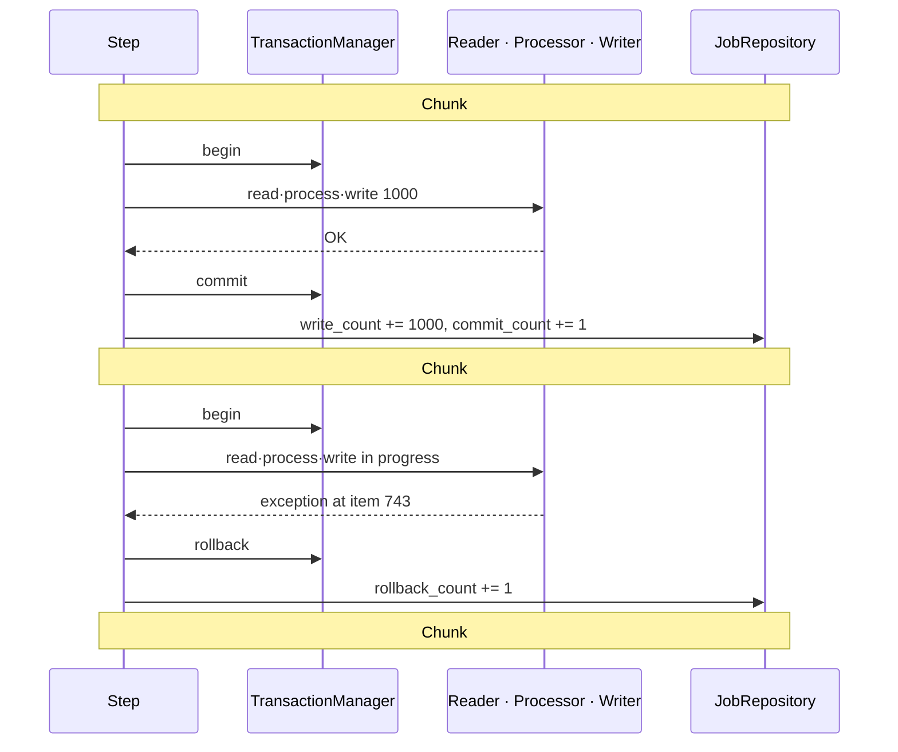
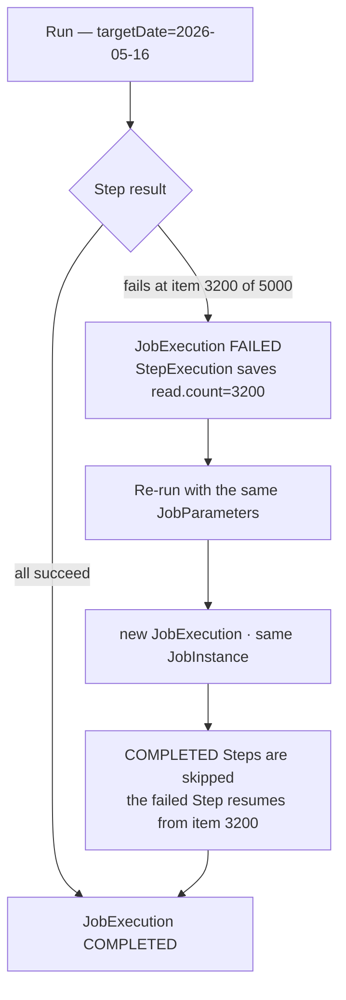

## Introduction

In [Part 2](/blog/en/spring-batch-6-guide-2) we saw the chunk cycle — read N → process N → write N → commit — and that its boundary is the transaction boundary. But what happens when one item inside a chunk breaks?

Real-world batches are dirty. Three of a million orders are malformed, the database occasionally throws a deadlock, and the external notification API times out now and then. At that moment you have three choices — <strong>throw the whole thing away</strong>, <strong>skip the dirty one</strong>, or <strong>retry shortly after</strong>. And if a job dies midway, it must be able to <strong>resume from where it stopped</strong> instead of starting over.

Part 3 covers this "toolkit for failure" in five groups: exactly where the chunk transaction boundary rolls back, how to design the `faultTolerant` Step's Skip · Retry · NoRollback policies by exception meaning, the six listeners that observe failures, how `ExecutionContext` preserves the restart position, and finally idempotency that makes re-running the same job safe.

The target reader is a backend engineer who understands Part 2's chunk mechanism. Transaction and exception-hierarchy fundamentals are assumed.

- Part 1 — Job · Step · Metadata Identity
- Part 2 — Chunk-Oriented Processing — Reader · Processor · Writer
- <strong>Part 3 — Transactions · Failure Handling — Skip · Retry · Restart (this post)</strong>
- [Part 4 — Job Launch · Scheduling · Operations](/blog/en/spring-batch-6-guide-4)
- Part 5 — Performance · Parallelism — Multi-thread · Partitioning · Remote Workers (upcoming)
- Part 6 — Observability · Testing · Deployment (upcoming)
- Capstone — Marketplace Analytics Pipeline (upcoming)

---

## TL;DR

- <strong>One failed item = the whole chunk rolls back, by default</strong> — if one item in a 1,000-item chunk throws, the other 999 roll back too. Previously committed chunks survive. This is why the chunk is the transaction boundary and the basis for restart.
- <strong>Skip · Retry · NoRollback are decided by exception meaning</strong> — <strong>data problems Skip</strong> (malformed rows), <strong>transient errors Retry</strong> (deadlock, timeout), <strong>side-effect failures NoRollback</strong> (a notification that doesn't dirty the data). Everything else fails.
- <strong>Turning on Skip makes the chunk re-process item by item (scan)</strong> — a failed chunk rolls back and is replayed one item at a time to isolate the culprit. The Processor and Writer get called again for the same items, so they must be side-effect free.
- <strong>ExecutionContext is the key to restart</strong> — the Reader stores "how far it read" in the StepExecution's ExecutionContext. Re-launching with the same JobParameters skips completed Steps and resumes the failed Step from the saved position.
- <strong>Idempotency is a JobParameters key + Writer upsert</strong> — the idempotency key is the business date (`targetDate`), and the Writer uses PostgreSQL `INSERT ... ON CONFLICT DO UPDATE`. Running the same date twice yields the same result.

---

## 1. The Chunk Transaction Boundary

### 1.1 The fork between success and failure

A chunk-oriented Step processes one chunk as one transaction. On success it commits, bumps the metadata counters, and moves to the next chunk. On failure it rolls back the entire chunk.



Two things matter here.

- <strong>All 1,000 items in the failed chunk disappear</strong> — one bad item at position 743 rolls back the preceding 742 too. "Only one failed, so the rest got saved" is wrong.
- <strong>Previously committed chunks are untouched</strong> — chunk #1's 1,000 items were already committed in a separate transaction. That "already finished" point is the checkpoint restart relies on (§4).

### 1.2 The trail left in metadata

Each chunk's outcome accumulates in the `BATCH_STEP_EXECUTION` counters. In operations, these numbers are the first diagnostic when reading job state.

| Counter | Meaning |
|---------|---------|
| `read_count` | items read by the Reader |
| `write_count` | items written by the Writer |
| `commit_count` | committed chunks (transactions) |
| `rollback_count` | rolled-back chunks |
| `skip_count` | skipped items (§2) |
| `process_skip_count` · `write_skip_count` | skips per phase |

If `read_count` and `write_count` diverge and `skip_count` is non-zero, something is being filtered out.

### 1.3 Caution: turning on Skip makes the chunk re-process item by item

The default behavior is "one failed item → roll back the whole chunk → fail the Step." But once you enable Skip (§2), the behavior gets one layer more complex. Spring Batch rolls back the failed chunk and then <strong>re-processes it one item at a time (scan)</strong> to find which item is the culprit — so it can skip only that one and commit the rest.

> <strong>Caution</strong>: during the scan, already-read items live in a buffer, so the Reader is not called again. But <strong>the Processor and Writer are called again for the same items.</strong> So if the Processor calls an external API or increments a counter, that side effect runs twice. The Processor and Writer must produce the same result no matter how many times they are called for the same input — which is exactly why §5 idempotency matters.

---

## 2. Skip · Retry · NoRollback Policies

### 2.1 Three decisions — decided by what the exception means

When you hit a failure, the choice is driven by what the exception *means*, not by row count or frequency.

| Situation | Exception nature | Policy | Example |
|-----------|------------------|--------|---------|
| The data is dirty | permanent, item-local | <strong>Skip</strong> | malformed CSV row, failed-validation order |
| Temporarily blocked | transient, clears on retry | <strong>Retry</strong> | DB deadlock, lock timeout, brief network glitch |
| Data is fine, a side task failed | unrelated to data integrity | <strong>NoRollback</strong> | a notification send failing |
| Everything else | a real error that must stop the job | <strong>Fail</strong> | schema mismatch, NPE, config error |

The test is simple. <strong>"Does retrying fix it?"</strong> → Retry. <strong>"If I drop just this item, is the rest fine?"</strong> → Skip. <strong>"Does this exception dirty the data transaction?"</strong> → if not, NoRollback. If none apply, Fail is correct. When in doubt, Fail should be the default — a job that silently moves on is the most dangerous kind.

### 2.2 The faultTolerant Step

Skip, Retry, and NoRollback only work on a Step marked `faultTolerant()`. Layering the policies onto Part 2's aggregation Step looks like this.

```kotlin
import org.springframework.batch.core.Step
import org.springframework.batch.core.repository.JobRepository
import org.springframework.batch.core.step.builder.StepBuilder
import org.springframework.batch.item.ItemProcessor
import org.springframework.batch.item.ItemWriter
import org.springframework.batch.item.database.JpaPagingItemReader
import org.springframework.batch.item.validator.ValidationException
import org.springframework.context.annotation.Bean
import org.springframework.dao.TransientDataAccessException
import org.springframework.transaction.PlatformTransactionManager

@Bean
fun aggregateStep(
    jobRepository: JobRepository,
    txManager: PlatformTransactionManager,
    orderReader: JpaPagingItemReader<Order>,
    salesProcessor: ItemProcessor<Order, DailySalesLine>,
    salesWriter: ItemWriter<DailySalesLine>,
    skipRecorder: SkippedItemRecorder,
): Step =
    StepBuilder("aggregateStep", jobRepository)
        .chunk<Order, DailySalesLine>(1000, txManager)
        .reader(orderReader)
        .processor(salesProcessor)
        .writer(salesWriter)
        .faultTolerant()
        .skip(ValidationException::class.java)   // data problem → Skip
        .skipLimit(10)                            // fail the Step if more than 10 are skipped
        .retry(TransientDataAccessException::class.java)  // transient error → Retry
        .retryLimit(3)                            // the same item up to 3 times
        .noRollback(NotificationFailedException::class.java)  // side-task failure doesn't roll back
        .listener(skipRecorder)                   // record skipped items (§3)
        .build()
```

### 2.3 Skip — tolerable dirtiness

`skip(exception)` + `skipLimit(n)` means "drop just this item for this exception and keep going, but if the cumulative count exceeds n, then fail the Step." The `skipLimit` is what matters. You can ignore 3 dirty items, but if half are broken, the data source itself is broken and the job should stop.

- <strong>`skipLimit` is the "line of acceptable normality"</strong> — unbounded skipping silently buries errors. Set a realistic threshold like 0.1% of the total.
- <strong>Always record skipped items</strong> — just dropping them means you'll never know why 3 went missing. Use a `SkipListener` to persist them to a table or log (§3).
- <strong>For fine-grained control, `SkipPolicy`</strong> — if you need "skip read errors unboundedly, write errors up to 5," implement a `SkipPolicy`.

### 2.4 Retry — transient errors

`retry(exception)` + `retryLimit(n)` is for transient errors. A deadlock usually clears when the transaction restarts, and a lock timeout passes a moment later. Putting Retry on a permanent error (validation failure) just repeats the same failure n times for nothing.

Retry and Skip compose. Put one exception in both the retry and skip lists, and it will first retry up to `retryLimit` and then, if still failing, be skipped.

> <strong>Note</strong>: retry backoff (the interval between attempts) is configured via `RetryTemplate`/`BackOffPolicy`. A short fixed interval is typical for deadlock retries, exponential backoff for external APIs. Since chunk-level retry re-processes the entire chunk, it's better to control external calls at the Writer rather than the Processor to limit side effects.

### 2.5 NoRollback — moving on without rolling back

By default every exception thrown in a chunk rolls the transaction back. But if the data write succeeded and only a subsequent notification send failed, there's no reason to undo the write. `noRollback(exception)` declares "even if this exception is thrown, do not roll back the transaction."

The precondition is crucial. <strong>A NoRollback exception must not dirty the transaction state.</strong> Put NoRollback on an exception thrown mid-DB-operation and you can leave half-committed data behind. The only safe candidates are pure side-task failures that happen *after* the data write is done.

---

## 3. The Six Listeners That Observe Failures

Once you've set Skip/Retry policies, listeners are the window into what they did. Spring Batch lets you hook callbacks at each point of the job lifecycle.

### 3.1 Quick catalog

| Listener | Key callbacks | Typical use |
|----------|---------------|-------------|
| `StepExecutionListener` | `beforeStep` / `afterStep` | Step start/end hooks, adjusting `ExitStatus` |
| `ChunkListener` | `beforeChunk` / `afterChunk` / `afterChunkError` | chunk-boundary logging, detecting failed chunks |
| `ItemReadListener` | `beforeRead` / `afterRead` / `onReadError` | diagnosing read/parse errors |
| `ItemWriteListener` | `beforeWrite` / `afterWrite` / `onWriteError` | diagnosing write / batch-insert errors |
| `SkipListener` | `onSkipInRead` / `onSkipInProcess` / `onSkipInWrite` | persisting skipped items to a table/log |
| `RetryListener` | retry lifecycle (`open` / `onError` / `close`) | observing retry counts and causes |

`ItemProcessListener` (the process phase) and `JobExecutionListener` (the whole job) exist in the same vein. You don't need all six — by far the most used in practice is `SkipListener`.

### 3.2 SkipListener — recording skipped items

§2 said "always record skipped items." The tool for that is `SkipListener`. Its skip callbacks are invoked <strong>after the chunk commits</strong>, so what you record there is stored safely alongside the good data (it is not swept away by the rollback).

```kotlin
import org.springframework.batch.core.SkipListener
import org.springframework.stereotype.Component

@Component
class SkippedItemRecorder(
    private val skipLogRepository: SkipLogRepository,
) : SkipListener<Order, DailySalesLine> {

    override fun onSkipInProcess(item: Order, t: Throwable) {
        skipLogRepository.save(
            SkipLog(orderId = item.id, phase = "PROCESS", reason = t.message ?: t.javaClass.simpleName),
        )
    }

    override fun onSkipInWrite(item: DailySalesLine, t: Throwable) {
        skipLogRepository.save(
            SkipLog(orderId = item.orderId, phase = "WRITE", reason = t.message ?: t.javaClass.simpleName),
        )
    }

    override fun onSkipInRead(t: Throwable) {
        // A read-phase skip (parse error, etc.) can't identify the source item, so log the message only.
        skipLogRepository.save(SkipLog(orderId = null, phase = "READ", reason = t.message))
    }
}
```

The resulting `skip_log` table becomes the basis for tracing and re-processing "which orders dropped from yesterday's job, and why."

---

## 4. ExecutionContext and Restart

### 4.1 What ExecutionContext is

<strong>`ExecutionContext` is a key-value store holding a job's intermediate state.</strong> There are two of them — one per JobExecution and one per StepExecution — each serialized into the `BATCH_JOB_EXECUTION_CONTEXT` and `BATCH_STEP_EXECUTION_CONTEXT` tables (see the six metadata tables in Part 1).

Its core purpose is <strong>preserving the restart position</strong>. Even if a job dies midway, recording how far it got into the DB lets the next run continue from there.

### 4.2 How the Reader saves its position

Most Readers implement `ItemStream`. While the Step runs, `update()` is called periodically to record "read N items so far" into the StepExecution's ExecutionContext. On restart, `open()` reads that value and starts after item N.

- <strong>`saveState` (default `true`)</strong> — whether the Reader saves state. Turn it off and a restart re-reads from the beginning. Keep it on if you need restart.
- <strong>`name()` is the key prefix</strong> — the Reader's `name()` from Part 2 is the prefix that prevents ExecutionContext key collisions. Two Readers in the same Step must have different names.
- <strong>Custom keys too</strong> — you can implement `ItemStream` directly or stash arbitrary values in `stepExecution.executionContext` from a listener.

### 4.3 How restart works

The premise of restart is the <strong>same JobInstance</strong> — i.e., the identifying JobParameters (e.g., `targetDate`) must match. Re-running with the same key makes the framework create a new JobExecution but bind it to the same JobInstance and restore the last failure point.



The already-committed 3,000 items (three chunks) are not re-processed; it continues from the chunk starting at item 3,001. This is where "previously committed chunks survive" from §1 pays off.

### 4.4 Common traps

- <strong>A COMPLETED JobInstance can't be re-run with the same parameters</strong> — re-running a successfully finished job with the same `targetDate` throws `JobInstanceAlreadyCompleteException`. If you need a re-run, change the parameters (Part 4's `run.id`) or solve it with §5 idempotency.
- <strong>Keep ExecutionContext small</strong> — it is serialized to the DB, so don't put large objects or collections in it. Only small values like a position.
- <strong>`saveState=false` makes restart meaningless</strong> — sometimes it's turned off where saving state is hard (multi-threaded Steps, Part 5), but then restart is from scratch.

---

## 5. Idempotency Patterns

### 5.1 Why idempotency is needed even with restart

The reason idempotency is still needed despite restart is that <strong>"restart" and "re-run" are different</strong>. Restart continues a failed JobInstance, so it doesn't touch already-written data. But in operations, an <strong>intentional re-run</strong> — "yesterday's aggregation looks off, run it again" — is common. Re-loading the same date's data then can double the revenue figure.

<strong>Idempotent = running with the same input any number of times yields the same result.</strong> In batch this is guaranteed at two layers — job identity (JobParameters) and the write operation (Writer).

### 5.2 The business date as the JobParameters idempotency key

An aggregation job's idempotency key is the business value pointing at what's being processed — `targetDate`. "Aggregate sales for 2026-05-16" must be a single JobInstance no matter how many times it's defined.

- <strong>The identifying parameter is the business date</strong> — `targetDate=2026-05-16`. Same date = same JobInstance = duplicate completion is blocked.
- <strong>Per-run values must be non-identifying</strong> — things like an execution timestamp must be excluded from identity (Part 4's `run.id` incrementer) to allow re-runs.
- That alone only blocks "re-running a succeeded job." To allow a re-run that overwrites data, the Writer must be idempotent.

### 5.3 Writer upsert — PostgreSQL ON CONFLICT

The canonical write-idempotency is upsert. Reuse the `JdbcBatchItemWriter` + PostgreSQL `INSERT ... ON CONFLICT DO UPDATE` from Part 2 §4.3. If the same `(sale_date, member_id)` already exists, it UPDATEs instead of INSERTing — so running the same date twice doesn't duplicate rows, it just refreshes values.

```kotlin
import org.springframework.batch.item.database.JdbcBatchItemWriter
import org.springframework.batch.item.database.builder.JdbcBatchItemWriterBuilder
import org.springframework.context.annotation.Bean
import javax.sql.DataSource

@Bean
fun salesWriter(dataSource: DataSource): JdbcBatchItemWriter<DailySalesLine> =
    JdbcBatchItemWriterBuilder<DailySalesLine>()
        .dataSource(dataSource)
        .sql(
            """
            INSERT INTO daily_sales (sale_date, member_id, amount)
            VALUES (:saleDate, :memberId, :amount)
            ON CONFLICT (sale_date, member_id)
            DO UPDATE SET amount = EXCLUDED.amount
            """.trimIndent(),
        )
        .beanMapped()
        .build()
```

For this to work, `daily_sales` must have a `UNIQUE (sale_date, member_id)` constraint. Idempotency is guaranteed by that unique constraint, not by the code.

### 5.4 Alternative — delete-then-insert

If upsert feels heavy, or "rewrite that day's data wholesale" reads more naturally, put a delete Tasklet Step before the aggregation Step.

```kotlin
@Bean
fun purgeStep(
    jobRepository: JobRepository,
    txManager: PlatformTransactionManager,
    jdbcTemplate: JdbcTemplate,
    @Value("#{jobParameters['targetDate']}") targetDate: LocalDate,
): Step =
    StepBuilder("purgeStep", jobRepository)
        .tasklet({ _, _ ->
            jdbcTemplate.update("DELETE FROM daily_sales WHERE sale_date = ?", targetDate)
            RepeatStatus.FINISHED
        }, txManager)
        .build()
```

Wiring the job as `purgeStep` → `aggregateStep` empties that date and refills it on every re-run. The trade-off is clear — upsert is <strong>row-level idempotent</strong> (strong for partial updates), while delete-then-insert is a <strong>"clean slate"</strong> (simple to reason about, but it opens an empty window between delete and load). Running them sequentially within one job confines that window to job-execution time.

---

## Recap

The key takeaways from Part 3, one line each:

- <strong>One failed item rolls back the whole chunk</strong> — 999 items vanish with it, and only previously committed chunks survive. That boundary is the restart checkpoint.
- <strong>Skip · Retry · NoRollback are decided by exception meaning</strong> — data problems Skip, transient errors Retry, side-task failures NoRollback, everything else Fail. When in doubt, Fail is safe.
- <strong>Skip replays the chunk item by item</strong> — the Processor and Writer get called again for the same items, so they must be side-effect free. Always record skipped items with a `SkipListener`.
- <strong>ExecutionContext preserves the restart position</strong> — with the same JobParameters it binds to the same JobInstance, skipping completed Steps and resuming the failed Step from the saved point.
- <strong>Idempotency is two layers: a JobParameters key + Writer upsert</strong> — identify the job by business date, and make same-date re-runs safe with `ON CONFLICT DO UPDATE`.

Part 4 takes on <strong>Job Launch · Scheduling · Operations</strong>. So far we've been writing jobs; Part 4 is about running them. The difference between `JobLauncher` and `JobOperator`, what to trigger with — `@Scheduled` / Quartz / K8s CronJob / Argo — how to stop the same job running twice across multiple instances (this part's §5 idempotency is the last safety net there), and the five patterns for where a batch reads its data.

---

## Appendix

### A. Full faultTolerant Step example

<details>
<summary><strong>Expand — the full Job skeleton wiring purgeStep → aggregateStep</strong></summary>

```kotlin
import org.springframework.batch.core.Job
import org.springframework.batch.core.job.builder.JobBuilder
import org.springframework.batch.core.repository.JobRepository
import org.springframework.context.annotation.Bean
import org.springframework.context.annotation.Configuration

@Configuration
class DailySalesJobConfig {

    @Bean
    fun dailySalesJob(
        jobRepository: JobRepository,
        purgeStep: Step,
        aggregateStep: Step,
    ): Job =
        JobBuilder("dailySalesJob", jobRepository)
            .start(purgeStep)       // empty that date (§5.4)
            .next(aggregateStep)    // re-aggregate and load (§2.2)
            .build()
}
```

`purgeStep` is the first layer of idempotency (clean slate), and `aggregateStep`'s upsert Writer is the second. Either alone is enough, but layering both means no path into a re-run can produce duplicates.

</details>

### B. Skip / Retry exception cheat sheet

<details>
<summary><strong>Expand — recommended policy per common exception</strong></summary>

| Exception | Nature | Recommended policy |
|-----------|--------|--------------------|
| `org.springframework.batch.item.validator.ValidationException` | validation failure (data) | Skip |
| `FlatFileParseException` | file-row parse failure | Skip |
| `org.springframework.dao.DeadlockLoserDataAccessException` | DB deadlock (transient) | Retry |
| `org.springframework.dao.TransientDataAccessException` | transient DB errors in general | Retry |
| `java.net.SocketTimeoutException` | external-call timeout | Retry (with backoff) |
| `org.springframework.dao.DataIntegrityViolationException` | constraint violation (integrity) | Fail |
| `NullPointerException` / config errors | code/environment bug | Fail |

Principle: putting the same exception in both Retry and Skip means "retry, and if it still won't go, drop it." A common combo for external-API timeouts.

</details>

### C. External references

- [Spring Batch — Configuring Skip and Retry](https://docs.spring.io/spring-batch/reference/step/chunk-oriented-processing/configuring-skip.html) — official reference for Skip · Retry · SkipPolicy
- [Spring Batch — Controlling Rollback](https://docs.spring.io/spring-batch/reference/step/chunk-oriented-processing/controlling-rollback.html) — NoRollback behavior and transaction attributes
- [Spring Batch — Restartability & ExecutionContext](https://docs.spring.io/spring-batch/reference/domain.html) — restart semantics and ExecutionContext preservation
- [PostgreSQL — INSERT ... ON CONFLICT](https://www.postgresql.org/docs/16/sql-insert.html#SQL-ON-CONFLICT) — upsert syntax
