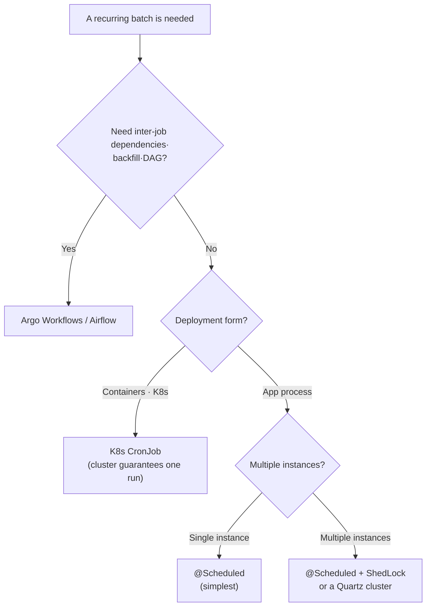
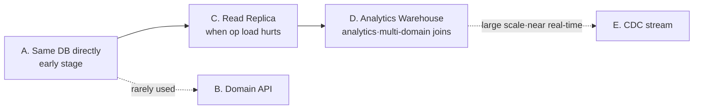

## Introduction

Through [Part 3](/blog/en/spring-batch-6-guide-3) we focused on how to *write* a job — read and transform and write in chunks, handle failure with Skip and Retry, resume on death. Part 4 is about how to *run* it.

The questions cascade. Who launches the job, and when? Is one `@Scheduled` line enough, or is cron or K8s better? You scaled out to several servers — now the same job runs twice? Can the aggregation job hit the operational DB directly, or should it read from somewhere else?

Part 4 walks the seven branches of "operations": the division of labor between `JobLauncher` and `JobOperator`, choosing among four schedulers, `JobParameters` idempotency design, restarting failed jobs, operational monitoring, and the two things that trip people up most in practice — <strong>preventing duplicate execution across instances</strong> and <strong>the five patterns for where a batch reads its data</strong>.

The target reader is a backend engineer who has built jobs through Parts 1–3. Basic concepts of scheduling and operational environments (containers, multiple instances) are assumed.

- Part 1 — Job · Step · Metadata Identity
- Part 2 — Chunk-Oriented Processing — Reader · Processor · Writer
- Part 3 — Transactions · Failure Handling — Skip · Retry · Restart
- <strong>Part 4 — Job Launch · Scheduling · Operations (this post)</strong>
- [Part 5 — Performance · Parallelism — Multi-thread · Partitioning · Remote Workers](/blog/en/spring-batch-6-guide-5)
- [Part 6 — Observability · Testing · Deployment](/blog/en/spring-batch-6-guide-6)
- [Capstone — Marketplace Analytics Pipeline](/blog/en/spring-batch-6-guide-capstone)

---

## TL;DR

- <strong>JobLauncher is the entry point where code starts a job; JobOperator is the operator's remote control</strong> — `@Scheduled` calls `JobLauncher`; restarting or stopping a failed execution by ID is `JobOperator`.
- <strong>Pick the scheduler from four options</strong> — `@Scheduled` (simple, single-instance), Quartz (in-app HA), K8s CronJob (containers), Argo/Airflow (inter-job dependency DAGs).
- <strong>JobParameters design = idempotency key vs new instance every run</strong> — make the business date (`targetDate`) the identifying key for "once a day, restartable," or add a `RunIdIncrementer` for a new JobInstance each run (write idempotency then required).
- <strong>Restart via the same identifying parameters or JobOperator.restart</strong> — control restart behavior with `preventRestart` · `startLimit` · `allowStartIfComplete`, and branch flow on `ExitStatus`.
- <strong>Monitoring: Spring Batch Admin is gone</strong> — replace it with Actuator + Micrometer metrics (Part 6) + `JobExplorer` queries + failure alerts.
- <strong>Preventing duplicate execution across instances</strong> — N app instances make `@Scheduled` fire N times. The JobInstance lock blocks concurrent runs with the same parameters, but with limits — guarantee single execution with ShedLock, a Quartz cluster, or CronJob.
- <strong>Where does a batch read its data — five patterns</strong> — A. same DB / B. domain API / C. Read Replica / D. analytics Warehouse / E. CDC. The usual evolution is A → C → D, and B is rarely used.

---

## 1. JobLauncher vs JobOperator

### 1.1 JobLauncher — launches the job

`JobLauncher` is the entry point that starts a job from code. It takes a `Job` and `JobParameters`, runs it, and returns a `JobExecution`. It's exactly what Part 1's `CommandLineRunner` or the `@Scheduled` below calls.

```kotlin
import org.springframework.batch.core.Job
import org.springframework.batch.core.launch.JobLauncher
import org.springframework.batch.core.JobParametersBuilder
import org.springframework.scheduling.annotation.Scheduled
import org.springframework.stereotype.Component
import java.time.LocalDate

@Component
class DailySalesScheduler(
    private val jobLauncher: JobLauncher,
    private val dailySalesJob: Job,
) {
    @Scheduled(cron = "0 0 1 * * *")  // every day at 01:00
    fun launch() {
        val params = JobParametersBuilder()
            .addLocalDate("targetDate", LocalDate.now().minusDays(1))
            .toJobParameters()
        jobLauncher.run(dailySalesJob, params)
    }
}
```

The default `JobLauncher` is <strong>synchronous</strong> — it blocks the calling thread until the job finishes. If you don't want to hold the `@Scheduled` thread, you can inject a `TaskExecutor` to launch asynchronously, but then it returns immediately and you must observe completion separately.

### 1.2 JobOperator — the operator's remote control

`JobOperator` is the API for handling jobs during operations, by a human. If `JobLauncher` is "code starting a job," `JobOperator` deals in job names, parameter strings, and execution IDs to <strong>start/stop/restart/abandon</strong>. It's designed to be called from JMX, an ops CLI, or an admin endpoint.

```kotlin
// from an ops endpoint/CLI (by name, string params, execution ID)
val executionId: Long = jobOperator.start("dailySalesJob", properties)  // new run
jobOperator.restart(failedExecutionId)   // restart a failed run (§4)
jobOperator.stop(runningExecutionId)     // request a stop
jobOperator.abandon(stoppedExecutionId)  // abandon a stopped run
```

### 1.3 When to use which

| Aspect | JobLauncher | JobOperator |
|--------|-------------|-------------|
| Primary user | application code | operators / admin tools |
| Input | `Job` + `JobParameters` objects | job name + string params / execution ID |
| Typical caller | `@Scheduled`, `CommandLineRunner` | admin screen, JMX, ops CLI |
| Good at | triggering a known job | querying history, stopping, restarting after the fact |

> <strong>Note</strong>: Spring Batch 6 expanded the `JobOperator` API, strengthening its role as the single entry point for operational tasks. The conceptual split is unchanged — "normal-flow trigger is `JobLauncher`, after-the-fact intervention is `JobOperator`."

---

## 2. Choosing a Scheduler

Who calls `JobLauncher` — that is, "when does it run" — is the scheduler's job. Part 1 §1.1 said trigger (when) and execution engine (how) are separate axes; Part 4 now picks that trigger layer in earnest.

> <strong>Terms</strong>: a <strong>DAG</strong> (Directed Acyclic Graph) expresses ordering and dependencies between jobs without cycles — "B after A, D after B and C." <strong>Backfill</strong> means re-running past periods retroactively — e.g., fixing aggregation logic and re-running the last month day by day. <strong>HA</strong> (High Availability) is a setup where the job keeps running even if one instance dies.

### 2.1 Four options compared

| Scheduler | Where it runs | Single execution (HA) | Inter-job dependency (DAG) | Fits |
|-----------|---------------|-----------------------|----------------------------|------|
| `@Scheduled` | in-app | ❌ (per instance → §7) | ❌ | single instance, simple schedule |
| Quartz | in-app | ✅ cluster mode | limited | HA needed inside the app |
| K8s CronJob | cluster | ✅ cluster guarantees one | ❌ | containerized deployment |
| Argo · Airflow | external orchestrator | ✅ | ✅ DAG, backfill, retries | dependencies across jobs, pipelines |

### 2.2 Decision tree



Two questions decide it. <strong>Are there dependencies between jobs</strong> (A→B→C ordering, backfill, visualization)? → if so, Argo/Airflow. If not, <strong>is the deployment containerized</strong>? → CronJob; for app processes, by instance count it's `@Scheduled` (single) or ShedLock/Quartz (multiple, §7).

### 2.3 Launching a job from @Scheduled

The most common form is exactly the §1.1 code: `@Scheduled` calls `JobLauncher.run`. The cron expression sets the time, and the date to process is passed via `JobParameters` (§3). But `@Scheduled` assumes a single instance — with multiple, you need §7's single-execution guarantee.

---

## 3. JobParameters Design

`JobParameters` is not just input. It defines the <strong>identity of a JobInstance</strong> (Part 1 §3). So which parameters you make identifying decides "what happens when the same job runs twice."

### 3.1 Identifying vs non-identifying parameters

The `IDENTIFYING` flag from Part 1 works here. <strong>Same identifying parameters mean the same JobInstance</strong> — the identifying set is the JobInstance's business key.

- <strong>Identifying</strong> — distinguishes JobInstances. The value carrying business meaning. E.g., `targetDate`.
- <strong>Non-identifying</strong> — distinguishes runs only within the same JobInstance. E.g., a debug flag, a timestamp.

### 3.2 The idempotency key = the business date

An aggregation job's idempotency key is the business value pointing at "what to process" — `targetDate`.

```kotlin
val params = JobParametersBuilder()
    .addLocalDate("targetDate", LocalDate.now().minusDays(1))  // identifying (default)
    .addString("triggeredBy", "scheduler", false)              // non-identifying
    .toJobParameters()
```

Make only `targetDate` identifying and "aggregate 2026-05-16" is one JobInstance. Re-run with the same date and — if it failed before, it restarts; if it succeeded, `JobInstanceAlreadyCompleteException` (Part 3 §4.4). This is the most common batch identity: "once a day, restartable."

### 3.3 The incrementer — a new instance every run

Conversely, if you want to "re-run the same job anytime, multiple times," add a `RunIdIncrementer`. A `run.id` increments each run, making <strong>a new JobInstance every time</strong>.

```kotlin
JobBuilder("dailySalesJob", jobRepository)
    .incrementer(RunIdIncrementer())   // run.id increments each run → new JobInstance
    .start(aggregateStep)
    .build()
```

The trade-off is clear. With an incrementer, "blocking re-runs of a succeeded job" disappears — running the same date twice processes it twice. So <strong>an incrementer makes write idempotency mandatory</strong> (Part 3 §5 upsert). In summary:

| Choice | JobInstance | Same-date re-run | Idempotency owner |
|--------|-------------|------------------|-------------------|
| Date identifying key only | one per date | blocked (or restart) | the framework |
| Incrementer | new every run | processed afresh each time | Writer upsert (Part 3) |

### 3.4 Parameter validation

To catch a missing required parameter at boot/launch time, add a `JobParametersValidator`. Declaring required/optional keys on a `DefaultJobParametersValidator` prevents the accident of launching without `targetDate`.

---

## 4. Restarting Failed Jobs

Part 3 §4 covered the *mechanism* of restart (`ExecutionContext` preserves the position). Part 4 covers how you <strong>trigger and control</strong> it in operations.

### 4.1 Two ways to trigger a restart

- <strong>Re-run with the same identifying parameters</strong> — pass the same `targetDate` again via `JobLauncher`, and the framework finds the incomplete JobInstance and continues it. The default path in scheduler-driven operations.
- <strong>`JobOperator.restart(executionId)`</strong> — restart by specifying the failed execution ID directly. For human intervention from an admin/CLI.

### 4.2 Restart-control knobs

Jobs and steps have settings that change restart behavior.

| Setting | Where | Effect |
|---------|-------|--------|
| `preventRestart()` | Job | once it fails, restart is forbidden entirely |
| `startLimit(n)` | Step | allow the step to start at most n times |
| `allowStartIfComplete(true)` | Step | re-run even an already-completed step on restart |

`allowStartIfComplete` is especially useful. The default is "skip completed steps on restart," but a step like validation or cleanup that <strong>must run every time</strong> turns this flag on.

### 4.3 Branching flow on ExitStatus

You can change the next flow based on a step's result (`ExitStatus`). For example, "if there were skips, go to a notification step; otherwise end."

```kotlin
JobBuilder("dailySalesJob", jobRepository)
    .start(aggregateStep)
        .on("COMPLETED WITH SKIPS").to(notifySkipStep)  // notify when skips occurred
        .from(aggregateStep).on("*").end()              // otherwise end normally
    .end()
    .build()
```

Return a custom `ExitStatus` from `afterStep` (e.g., `"COMPLETED WITH SKIPS"`) and the `on(...)` mapping above receives that value to branch.

---

## 5. Operational Monitoring

### 5.1 Spring Batch Admin is gone

Spring Batch Admin, once the standard, was discontinued long ago. Today, instead of a dedicated UI, you observe operations with <strong>Actuator + Micrometer + metadata queries</strong>.

### 5.2 What to watch with

- <strong>Metrics → Micrometer/Prometheus</strong> — expose `spring.batch.job` · `step` · `item.*` metrics via `/actuator/prometheus` and view them in Grafana. The six metrics and dashboards are covered in depth in Part 6.
- <strong>Execution history → `JobExplorer`</strong> — query job/step execution history, status, and counts from code. The data source when you build your own admin endpoint.
- <strong>Failure alerts</strong> — detect `BatchStatus.FAILED` in `JobExecutionListener.afterJob` and send to Slack/Email. The first safety net you add in operations.

> <strong>Note</strong>: you can also query the six metadata tables (Part 1 §3) directly with SQL. `BATCH_JOB_EXECUTION`'s `STATUS`/`EXIT_CODE` and `BATCH_STEP_EXECUTION`'s counts are the first diagnostic. Deeper observability is deferred to Part 6.

---

## 6. Where Does a Batch Read Its Data — Five Patterns

So far every example assumed "the batch reads the operational DB directly." But as data grows and starts colliding with operational traffic, "where to read from" governs the whole job design. There are five patterns you meet in practice.

### 6.1 The five patterns compared

| Pattern | Coupling | Infra cost | Load shifted onto | Data freshness | When |
|---------|----------|-----------|-------------------|----------------|------|
| <strong>A. Same DB directly</strong> | high | none | the operational DB itself | real-time | early stage, small scale |
| <strong>B. Domain API call</strong> | medium | low | the operational service | real-time | rarely used (§6.3) |
| <strong>C. Read Replica</strong> | high | medium | a replica (isolated) | near real-time (replica lag) | need to isolate op load |
| <strong>D. Analytics Warehouse</strong> | low | high | fully separated | delayed by ETL cycle | analytics, multi-domain joins |
| <strong>E. CDC event stream</strong> | low | very high | fully separated | near real-time (minutes) | large scale, near-real-time need |

Attaching to the operational DB with a read-only account (A) is simplest; keeping a dedicated analytics store (D) is the cleanest separation. Cost and separation move in opposite directions.

### 6.2 The evolution path — A → C → D

Most companies don't jump straight to D. They walk this order naturally.



At first A is enough. Once the batch starts inflating operational-DB load, you push reads onto a replica with <strong>C (Read Replica)</strong> (just swap the datasource on Part 2's `JdbcPagingItemReader`). As analytics demand grows and you must join across domains, you move to <strong>D (Warehouse)</strong>.

### 6.3 Why B (API call) is rarely used

- <strong>APIs are for single/small responses</strong> — paging hundreds of thousands of rows carries heavy serialization overhead.
- <strong>No transactional consistency across page boundaries</strong> — if data changes between pages, you get gaps or duplicates.
- <strong>It shifts batch load onto the operational service</strong> — bulk reads wreck the operational API's latency.
- The only exceptions are <strong>third-party APIs</strong> (where DB access is impossible) or <strong>real-time under ~1,000 rows</strong>.

### 6.4 When E (CDC) shows up

CDC (Change Data Capture) streams DB change logs into something like Kafka to consume near real-time. Powerful, but expensive.

- It costs <strong>infrastructure</strong> like Debezium · Kafka · Schema Registry.
- It's less "batch" and more <strong>micro-batch</strong> (5-minute to 1-hour windows), which pairs well with time-bucketed aggregation.
- The adoption threshold is high — it earns its keep only when "near-real-time analytics" is a business requirement.

### 6.5 Connection to this series

Every body example in Parts 1–6 assumes <strong>A (same DB)</strong> — the learning flow is simplest. The capstone picks a <strong>simplified variant of D (analytics Warehouse)</strong> — splitting operational and analytics schemas inside one PostgreSQL instance (covered in the capstone). Just remember that the data-source decision ripples into everything from Reader choice (Part 2) to idempotency design (Part 3).

---

## 7. Preventing Duplicate Execution Across Instances

### 7.1 The problem — N app instances mean N runs

In operations the app usually runs as several instances. But `@Scheduled` fires <strong>independently on each instance</strong>. With three, the same aggregation job triggers three times at 01:00 daily. That's exactly the "multi-instance duplication" column from Part 1 §1.1's trigger table.

### 7.2 What Spring Batch covers, and its limit

The good news is Spring Batch blocks part of this. <strong>If you try to run the same JobInstance (same identifying JobParameters) concurrently</strong>, the JobRepository lock rejects the second run with `JobExecutionAlreadyRunningException`.

The catch is the limit. If the trigger passes different parameters each time — say `LocalDateTime.now()` instead of `targetDate` — each run becomes a different JobInstance and <strong>the lock never engages</strong>. Three instances passing slightly different times all run separately. So single execution must be guaranteed at the trigger level too.

### 7.3 Single-execution guarantee per trigger

| Approach | Single-execution guarantee | Extra infra | Fits |
|----------|----------------------------|-------------|------|
| `@Scheduled` alone | ❌ runs on every instance | none | single-instance deployment only |
| `@Scheduled` + ShedLock | ✅ one run via a distributed lock | lock store (DB/Redis) | keep in-app scheduling with HA |
| Quartz cluster | ✅ one run in cluster mode | Quartz schema (DB) | complex scheduling + HA |
| K8s CronJob | ✅ cluster guarantees one | K8s | containerized deployment |
| leader election | ✅ only the leader runs | a coordinator (ZK/etcd, etc.) | already have a cluster coordinator |

### 7.4 Recommended combination

- <strong>Containerized → K8s CronJob</strong> — the cluster launches it exactly once, so no extra lock is needed. The cleanest option.
- <strong>Keeping `@Scheduled` → ShedLock is mandatory</strong> — a distributed lock lets only one instance launch the job (Appendix A).
- <strong>Idempotency (Part 3 §5) is the last safety net</strong> — even if trigger single-execution leaks and the job runs twice, an upsert Writer makes the result the same.

The conclusion is one line — <strong>preventing duplication = single-trigger + idempotency, doubled up.</strong> Don't trust either alone; layer both.

---

## Recap

The key takeaways from Part 4, one line each:

- <strong>JobLauncher triggers, JobOperator intervenes after the fact</strong> — `@Scheduled` calls the Launcher; restarting a failed execution by ID is the Operator.
- <strong>Pick the scheduler by dependency and deployment form</strong> — DAGs → Argo/Airflow, containers → CronJob, app processes → @Scheduled or ShedLock/Quartz by instance count.
- <strong>JobParameters is the JobInstance's identity</strong> — a date identifying key means "once a day, restartable"; an incrementer means "new every run" (write idempotency required).
- <strong>Data sources usually evolve A → C → D</strong> — start on the same DB, isolate load with a Read Replica, move to a Warehouse as analytics demand grows. B (API) is rarely used.
- <strong>Stop multi-instance duplication with single-trigger + idempotency</strong> — the JobInstance lock only blocks concurrent same-parameter runs, so single-trigger with ShedLock/CronJob and keep upsert as the safety net.

Part 5 takes on <strong>Performance · Parallelism</strong>. So far we've run jobs single-threaded. Part 5 covers running the same job faster — multi-threaded Steps, partitioning, remote workers, and JDK 21 virtual threads. Note up front that this is "splitting one job to run faster," a separate axis from this part's §7 "preventing duplicate execution."

---

## Appendix

### A. @Scheduled + ShedLock single execution

<details>
<summary><strong>Expand — triggering exactly once across multiple instances</strong></summary>

ShedLock takes a lock in a shared store (DB/Redis) so only one of several instances runs the scheduled method.

```kotlin
import net.javacrumbs.shedlock.spring.annotation.SchedulerLock
import org.springframework.scheduling.annotation.Scheduled
import org.springframework.stereotype.Component

@Component
class DailySalesScheduler(
    private val jobLauncher: JobLauncher,
    private val dailySalesJob: Job,
) {
    @Scheduled(cron = "0 0 1 * * *")
    @SchedulerLock(name = "dailySalesJob", lockAtMostFor = "30m", lockAtLeastFor = "1m")
    fun launch() {
        val params = JobParametersBuilder()
            .addLocalDate("targetDate", LocalDate.now().minusDays(1))
            .toJobParameters()
        jobLauncher.run(dailySalesJob, params)
    }
}
```

`lockAtMostFor` is the safety valve that prevents a lock from being held forever if an instance dies. Set it comfortably above the job's maximum runtime.

</details>

### B. Data-source pattern selection cheat sheet

<details>
<summary><strong>Expand — recommended pattern by situation</strong></summary>

| Situation | Recommended pattern |
|-----------|---------------------|
| Just starting, little data | A. Same DB (read-only account) |
| Batch is inflating operational-DB load | C. Read Replica |
| Multi-domain joins · analytics reports | D. Analytics Warehouse |
| Near-real-time analytics is a requirement | E. CDC stream |
| Third-party data with no DB access | B. API (exceptional) |

</details>

### C. External references

- [Spring Batch — Running a Job (JobLauncher · JobOperator)](https://docs.spring.io/spring-batch/reference/job/running.html) — official reference for the launch/operations API
- [Spring Batch — Controlling Step Flow (restart · startLimit · allowStartIfComplete)](https://docs.spring.io/spring-batch/reference/step/controlling-step-flow.html) — flow control and restart settings
- [ShedLock](https://github.com/lukas-krecan/ShedLock) — distributed lock for single-execution scheduling across instances
- [Kubernetes — CronJob](https://kubernetes.io/docs/concepts/workloads/controllers/cron-jobs/) — `concurrencyPolicy` and single-execution guarantees
