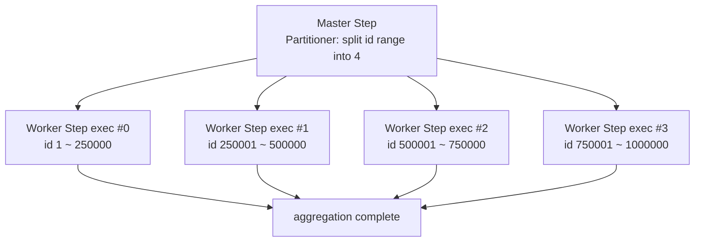
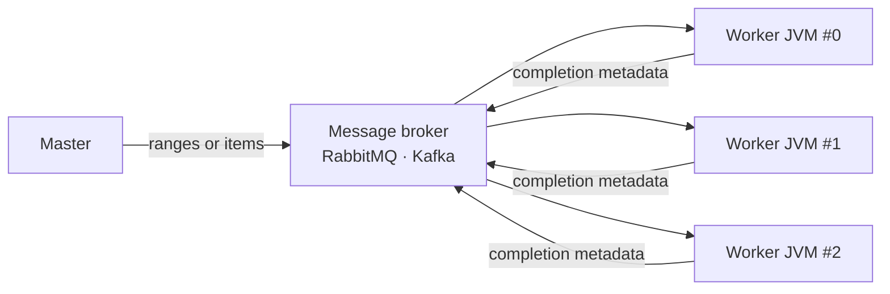

## Introduction

Through [Part 4](/blog/en/spring-batch-6-guide-4) we built jobs, handled failures, and ran them safely. All good — except it's <strong>slow.</strong> Reading a million of yesterday's orders one at a time on a single thread, the overnight aggregation isn't done by the time people arrive at work.

Part 5 covers four weapons for running the same job faster: the one-line <strong>multi-threaded Step</strong>, <strong>partitioning</strong> that splits data into ranges to run in parallel, <strong>remote partitioning/chunking</strong> that moves workers to separate processes, and JDK 21 <strong>virtual threads</strong>. Each gains and loses something different (restart and concurrency safety above all), so at the end we compare them side by side over a million rows.

> <strong>Terms</strong>: <strong>throughput</strong> is items processed per unit time (e.g., 10,000/sec). <strong>IO-bound</strong> work spends most of its time waiting on DB/network rather than computing; <strong>CPU-bound</strong> work is dominated by computation. Parallelism usually pays off most for IO-bound work.

The target reader is a backend engineer who has built jobs through Parts 1–4. Basic thread/concurrency concepts are assumed.

- Part 1 — Job · Step · Metadata Identity
- Part 2 — Chunk-Oriented Processing — Reader · Processor · Writer
- Part 3 — Transactions · Failure Handling — Skip · Retry · Restart
- Part 4 — Job Launch · Scheduling · Operations
- <strong>Part 5 — Performance · Parallelism — Multi-thread · Partitioning · Remote Workers (this post)</strong>
- [Part 6 — Observability · Testing · Deployment](/blog/en/spring-batch-6-guide-6)
- [Capstone — Marketplace Analytics Pipeline](/blog/en/spring-batch-6-guide-capstone)

---

## TL;DR

- <strong>A multi-threaded Step is the easiest speedup, but you lose restart</strong> — plug in a `TaskExecutor` and chunks run in parallel. But the Reader/Writer must be thread-safe, and the non-deterministic read order forces `saveState` off, which breaks restart.
- <strong>Partitioning splits data into ranges</strong> — by key range (id 0–200k, 200k–400k, …) each partition runs as an <strong>independent StepExecution</strong>. Per-partition metadata survives, preserving restart.
- <strong>Remote partitioning/chunking moves workers to other processes</strong> — a message broker distributes work to worker JVMs. Partitioning sends only "ranges" and workers read for themselves; chunking has the master read and send "items."
- <strong>Virtual threads (JDK 21) are a tool for IO-bound jobs</strong> — thousands run cheaply, lifting throughput on wait-heavy jobs. But they do nothing for CPU-bound work, and the real bottleneck may just shift to the DB connection pool.
- <strong>Don't jump to remote prematurely</strong> — climb single → multi-thread → partitioning → remote. Most jobs are fine at partitioning.

---

## 1. Single vs Multi-threaded Step

### 1.1 The default is single-threaded

The chunk Step from Part 2 processes chunks <strong>one at a time on one thread</strong> by default. Safe and clean to restart, but slow — one chunk at a time.

### 1.2 Parallelize with one line: TaskExecutor

<strong>`TaskExecutor` is an abstraction over a thread pool.</strong> Plug it into a Step and multiple chunks are processed concurrently across the pool's threads.

```kotlin
import org.springframework.batch.core.Step
import org.springframework.batch.core.repository.JobRepository
import org.springframework.batch.core.step.builder.StepBuilder
import org.springframework.context.annotation.Bean
import org.springframework.scheduling.concurrent.ThreadPoolTaskExecutor
import org.springframework.transaction.PlatformTransactionManager

@Bean
fun batchTaskExecutor(): ThreadPoolTaskExecutor =
    ThreadPoolTaskExecutor().apply {
        corePoolSize = 4
        maxPoolSize = 4
        setThreadNamePrefix("batch-")
        initialize()
    }

@Bean
fun aggregateStep(
    jobRepository: JobRepository,
    txManager: PlatformTransactionManager,
    orderReader: org.springframework.batch.item.ItemReader<Order>,
    salesProcessor: org.springframework.batch.item.ItemProcessor<Order, DailySalesLine>,
    salesWriter: org.springframework.batch.item.ItemWriter<DailySalesLine>,
    batchTaskExecutor: ThreadPoolTaskExecutor,
): Step =
    StepBuilder("aggregateStep", jobRepository)
        .chunk<Order, DailySalesLine>(1000, txManager)
        .reader(orderReader)
        .processor(salesProcessor)
        .writer(salesWriter)
        .taskExecutor(batchTaskExecutor)   // this one line makes chunks run in parallel
        .build()
```

### 1.3 It isn't free — three traps

As easy as it is, there's a price.

- <strong>The Reader must be thread-safe</strong> — `JdbcCursorItemReader` is not. Use a paging Reader (`JpaPagingItemReader`/`JdbcPagingItemReader`), and ensure concurrent access doesn't read the same page twice.
- <strong>Restart breaks</strong> — with several threads reading at once, "how far we read" can't be stored as a single value. So you set `saveState(false)` and give up the restart preservation from Part 3 §4.
- <strong>Order isn't guaranteed</strong> — logic that depends on processing order (running totals, etc.) breaks under a multi-threaded Step.

> <strong>Caution</strong>: a multi-threaded Step is "one job faster," not "duplicate-execution prevention." The same job running across multiple instances is the separate topic of Part 4 §7.

---

## 2. Partitioning Step

### 2.1 Split data into ranges

Partitioning solves the multi-threaded Step's restart problem. <strong>A master Step divides the data into ranges (partitions), and each range runs as an independent execution of the same worker Step.</strong> Split order ids into four ranges and the worker Step runs four times, each reading only its range.

The key benefit is that <strong>each partition is its own StepExecution</strong>. Metadata and ExecutionContext are kept per partition, so Part 3's restart is preserved at partition granularity — the very restart the multi-threaded Step gave up.



### 2.2 Partitioner — the code that splits ranges

<strong>`Partitioner` is the interface that divides the whole job into gridSize partitions.</strong> It returns each partition's range packed into an `ExecutionContext`.

```kotlin
import org.springframework.batch.core.partition.support.Partitioner
import org.springframework.batch.item.ExecutionContext

class ColumnRangePartitioner(
    private val minId: Long,
    private val maxId: Long,
) : Partitioner {
    override fun partition(gridSize: Int): Map<String, ExecutionContext> {
        val targetSize = (maxId - minId) / gridSize + 1
        val result = mutableMapOf<String, ExecutionContext>()
        var start = minId
        var partition = 0
        while (start <= maxId) {
            val end = minOf(start + targetSize - 1, maxId)
            result["partition$partition"] = ExecutionContext().apply {
                putLong("minId", start)
                putLong("maxId", end)
            }
            start += targetSize
            partition++
        }
        return result
    }
}
```

The worker Step's Reader is `@StepScope` and injects its range via `#{stepExecutionContext['minId']}` (the same late binding as Part 2 §2.3's `@StepScope`, from stepExecutionContext instead of JobParameters).

### 2.3 Assembling the master Step

```kotlin
@Bean
fun masterStep(
    jobRepository: JobRepository,
    workerStep: Step,
    batchTaskExecutor: ThreadPoolTaskExecutor,
): Step =
    StepBuilder("masterStep", jobRepository)
        .partitioner(workerStep.name, ColumnRangePartitioner(1, 1_000_000))
        .step(workerStep)
        .gridSize(4)                       // four partitions
        .taskExecutor(batchTaskExecutor)   // local: run partitions across threads
        .build()
```

`gridSize` is the partition count. Local partitioning uses a `TaskExecutor` to spread partitions over threads and run them in parallel within one JVM.

---

## 3. Remote Partitioning / Remote Chunking

When one JVM's threads aren't enough, distribute work to <strong>other processes (worker JVMs)</strong>. A message broker (RabbitMQ/Kafka) and Spring Integration channels connect master and workers. Here two approaches diverge.

### 3.1 The difference — what crosses the network

| Aspect | Remote partitioning | Remote chunking |
|--------|---------------------|-----------------|
| What the master sends | partition <strong>ranges</strong> (minId/maxId, small) | actual <strong>items</strong> (chunk data, large) |
| Read | each worker, directly | the master, exclusively |
| Process & write | workers | workers |
| Network load | low (metadata only) | high (all data crosses) |
| Fits | distributing reads too | reads are light but <strong>processing is the bottleneck</strong> |



### 3.2 When to go remote

Remote brings the <strong>infra and operational cost</strong> of a message broker and Spring Integration setup. So it only earns its keep when one JVM's multi-threading and local partitioning can't deliver the throughput — i.e., at <strong>tens of millions to billions of rows</strong>. Most in-house batches stop at local partitioning — go remote "only when you truly need it."

---

## 4. Virtual Threads (Spring Batch 6 + JDK 21)

### 4.1 What virtual threads are

<strong>A virtual thread is the lightweight thread that JDK 21 made official.</strong> You can stack thousands of them on a single OS thread, running wait-heavy work concurrently and cheaply. Spring Batch 6 lets you use a virtual-thread-based `TaskExecutor` directly in multi-threaded Steps and partitioning.

```kotlin
import org.springframework.core.task.SimpleAsyncTaskExecutor

@Bean
fun virtualThreadExecutor(): SimpleAsyncTaskExecutor =
    SimpleAsyncTaskExecutor("batch-vt-").apply {
        setVirtualThreads(true)   // use JDK 21 virtual threads
    }
```

### 4.2 They shine only for IO-bound work

Virtual threads pay off by <strong>overlapping wait time</strong>. The gain is large only for IO-bound jobs — external API calls, waiting on DB responses. A CPU-bound job won't get faster no matter how many virtual threads you add, because core count is the ceiling.

> <strong>Caution</strong>: spin up thousands of virtual threads but a DB connection pool of 20, and only 20 actually hit the DB at once. The bottleneck may just <strong>shift from threads to the connection pool</strong>. When enabling virtual threads, always look at whether to grow the connection pool and DB load alongside.

---

## 5. Benchmark — the one-million-row scenario

Placing the four approaches side by side over a million-row aggregation looks like this. The numbers are a <strong>rough relative comparison that varies wildly by environment</strong>, not absolute values.

| Approach | Relative time | Concurrency unit | Restart | Infra | Fits |
|----------|---------------|------------------|---------|-------|------|
| Single thread | 1.0× (baseline) | 1 | ✅ preserved | none | small · order-dependent |
| Multi-threaded Step | ~0.3–0.4× | thread pool | ❌ given up | none | mid scale · restart not needed |
| Local partitioning | ~0.25–0.35× | partitions × threads | ✅ per partition | none | most large jobs |
| Remote partitioning | scales with worker count | worker JVMs | ✅ per partition | broker + workers | huge scale · horizontal |

How to read it is simple. <strong>If you need restart, skip the multi-threaded Step and go to partitioning.</strong> Consider remote only when local partitioning hits one-JVM limits. Virtual threads are an option that swaps the `TaskExecutor` of the above, not a separate approach — try them when IO-bound.

---

## Recap

The key takeaways from Part 5, one line each:

- <strong>A multi-threaded Step is the easiest speedup but loses restart</strong> — one `TaskExecutor` line parallelizes it, but you give up Reader concurrency, order, and restart.
- <strong>Partitioning splits by range and keeps restart</strong> — each partition is an independent StepExecution, so metadata survives per partition. The default for large jobs.
- <strong>Remote distributes workers to other processes</strong> — partitioning sends ranges, chunking sends items. Heavy infra, so only for huge scale.
- <strong>Virtual threads are an option for IO-bound jobs</strong> — just swap the `TaskExecutor`, but they do nothing for CPU-bound work and the bottleneck may shift to the connection pool.
- <strong>Climb step by step</strong> — single → multi-thread → partitioning → remote. Don't rush to remote.

Part 6 takes on <strong>Observability · Testing · Deployment</strong>. Having built jobs (Parts 2–3), run them (Part 4), and made them fast (Part 5), we now close out "is it really running well, are regressions caught, does it deploy safely." Micrometer metrics and MDC, `@SpringBatchTest` and Testcontainers, Docker and K8s CronJob — the final operational piece of the series.

---

## Appendix

### A. The worker Step's @StepScope Reader

<details>
<summary><strong>Expand — a worker Reader that injects its range from stepExecutionContext</strong></summary>

A partitioning worker Reader is `@StepScope` and receives the `minId`/`maxId` the Partitioner stored, via late binding (the same `@StepScope` concept as Part 2 §2.3, from stepExecutionContext instead of JobParameters).

```kotlin
import org.springframework.batch.item.database.JdbcPagingItemReader
import org.springframework.batch.item.database.builder.JdbcPagingItemReaderBuilder
import org.springframework.beans.factory.annotation.Value
import javax.sql.DataSource

@Bean
@org.springframework.batch.core.configuration.annotation.StepScope
fun workerOrderReader(
    dataSource: DataSource,
    @Value("#{stepExecutionContext['minId']}") minId: Long,
    @Value("#{stepExecutionContext['maxId']}") maxId: Long,
): JdbcPagingItemReader<OrderRow> {
    // reads only its partition range with WHERE id BETWEEN :minId AND :maxId
    // (queryProvider setup is the same as Part 2 §2.4)
    return JdbcPagingItemReaderBuilder<OrderRow>()
        .name("workerOrderReader")
        .dataSource(dataSource)
        .pageSize(1000)
        // .queryProvider(...)  // sortKeys=id, whereClause="id BETWEEN :minId AND :maxId"
        .parameterValues(mapOf("minId" to minId, "maxId" to maxId))
        .build()
}
```

</details>

### B. Virtual threads vs platform threads

<details>
<summary><strong>Expand — when to use which</strong></summary>

| Aspect | Platform threads (ThreadPoolTaskExecutor) | Virtual threads (SimpleAsyncTaskExecutor + virtual) |
|--------|-------------------------------------------|-----------------------------------------------------|
| Count | tens to hundreds (1:1 with OS threads) | thousands to tens of thousands (lightweight) |
| Strength | CPU-bound · predictable pool size | IO-bound · massive concurrent waiting |
| Weakness | pool too small for massive concurrent IO | useless for CPU-bound, connection pool is the real ceiling |
| Recommended | CPU-intensive processing jobs | jobs with heavy external calls / IO waits |

Bottom line: virtual threads are not a silver bullet. Start from what the job waits on (CPU or IO), and for IO-bound work, grow them together with the connection pool.

</details>

### C. External references

- [Spring Batch — Scaling and Parallel Processing](https://docs.spring.io/spring-batch/reference/scalability.html) — official reference for multi-threaded Step, partitioning, remote scaling
- [Spring Batch — Partitioning](https://docs.spring.io/spring-batch/reference/scalability.html#partitioning) — Partitioner and PartitionHandler
- [JEP 444 — Virtual Threads](https://openjdk.org/jeps/444) — the JDK 21 virtual threads specification
- [Spring Batch — Remote Partitioning / Remote Chunking](https://docs.spring.io/spring-batch/reference/spring-batch-integration.html) — Spring Integration-based remote scaling
