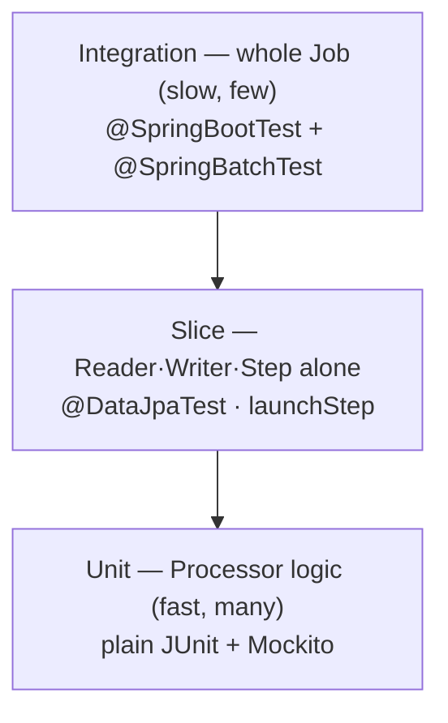
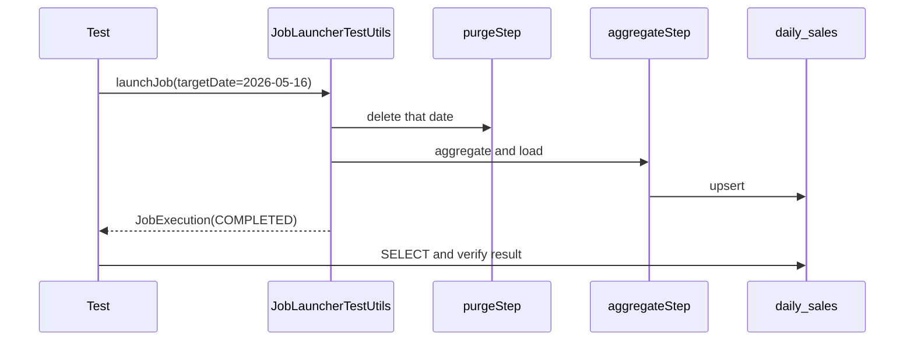

## Introduction

Through [Part 5](/en/blog/spring-batch-6-guide-5) we built jobs (Parts 2–3), ran them (Part 4), and made them fast (Part 5). One last question remains — <strong>how do you know it's actually running well? How do you catch regressions? How do you deploy safely?</strong>

Part 6 covers the final three operational pieces: <strong>observability</strong> that turns job state into numbers (Micrometer metrics + MDC logs), <strong>testing</strong> that catches regressions (from pyramid/double basics to `@SpringBatchTest`/Testcontainers specifics), and <strong>deployment</strong> that packages it into a container on a schedule (Java 21 multi-stage + K8s CronJob).

The testing basics (pyramid, annotations, doubles) overlap with general Spring testing, but to keep this series self-contained, they're re-explained with <strong>batch examples</strong>. If you're already comfortable, skip §3 and start at §4 (the batch-specific part).

The target reader is a backend engineer who has built and run jobs through Parts 1–5. JUnit and testing fundamentals are assumed.

- Part 1 — Job · Step · Metadata Identity
- Part 2 — Chunk-Oriented Processing — Reader · Processor · Writer
- Part 3 — Transactions · Failure Handling — Skip · Retry · Restart
- Part 4 — Job Launch · Scheduling · Operations
- Part 5 — Performance · Parallelism — Multi-thread · Partitioning · Remote Workers
- <strong>Part 6 — Observability · Testing · Deployment (this post)</strong>
- [Capstone — Marketplace Analytics Pipeline](/en/blog/spring-batch-6-guide-capstone)

---

## TL;DR

- <strong>Six Micrometer metrics auto-register</strong> — `spring.batch.job` · `job.active` · `step` · `item.read` · `item.process` · `chunk.write`. Expose them at `/actuator/prometheus` and watch throughput, failure rate, and duration in Grafana.
- <strong>MDC stamps job coordinates onto every log line</strong> — put `jobName` · `jobExecutionId` · `stepName` · `chunkIndex` in MDC and Part 3's failure logs become instantly traceable to "which job · which execution · which chunk."
- <strong>Testing is self-contained</strong> — the pyramid (unit/slice/integration), four annotations (`@ExtendWith(MockitoExtension)` · `@DataJpaTest` · `@SpringBatchTest` · `@SpringBootTest`), and five doubles (Dummy · Stub · Spy · Mock · Fake), all in batch examples.
- <strong>`@SpringBatchTest` injects batch test tooling</strong> — use `JobLauncherTestUtils` to verify Step slices, full-job integration, and restart, while `StepScopeTestExecutionListener` resolves `@StepScope` beans without a real job (Part 2 §2.3).
- <strong>Testcontainers PostgreSQL 16, not H2</strong> — window functions, CTEs, and `ON CONFLICT` upsert are things H2 can't mimic. Test against a real PostgreSQL container to validate the same queries you run in production.
- <strong>Java 21 multi-stage + K8s CronJob</strong> — a Dockerfile with separate build/runtime stages, and `concurrencyPolicy: Forbid` · `backoffLimit` · `activeDeadlineSeconds` to declare single execution and failure handling.

---

## 1. Micrometer Metrics and Prometheus Exposure

### 1.1 The six auto-registered metrics

<strong>Micrometer is the standard metrics facade</strong> (it does for metrics what SLF4J does for logging). Spring Batch 6 auto-registers these metrics as jobs run.

| Metric | Type | Meaning |
|--------|------|---------|
| `spring.batch.job` | timer | duration of one job run (`status` tag for success/failure) |
| `spring.batch.job.active` | gauge | number of currently running jobs |
| `spring.batch.step` | timer | step duration |
| `spring.batch.item.read` | timer | time to read one item |
| `spring.batch.item.process` | timer | time to process one item |
| `spring.batch.chunk.write` | timer | time to write one chunk |

> <strong>Note</strong>: writes are measured per <strong>chunk</strong>, not per item (`chunk.write`). This matches Part 2's point that the Writer receives a whole chunk at once — which is why it's `chunk.write`, not `item.write`.

### 1.2 Exposing via Prometheus

Add the `micrometer-registry-prometheus` dependency and open the endpoint, and metrics are exposed in Prometheus format.

```yaml
management:
  endpoints:
    web:
      exposure:
        include: health, prometheus   # open /actuator/prometheus
  metrics:
    tags:
      application: daily-sales-batch  # common tag on all metrics
```

### 1.3 What to watch

In a dashboard (Grafana) you watch three things — <strong>throughput</strong> (`item.read`/`chunk.write` rate), <strong>failure rate</strong> (the `status="FAILED"` share of `spring.batch.job`), and <strong>duration</strong> (p95 of the `spring.batch.job` timer). When a job slows down or the failure rate spikes, this is where it surfaces first.

---

## 2. Structured Logging + MDC

### 2.1 What MDC is

<strong>MDC (Mapped Diagnostic Context) is a thread-local key-value store provided by SLF4J.</strong> Put a value in MDC and <strong>every log line that thread emits carries that value automatically.</strong> This is decisive for batch — one log line should tell you "which job's which execution, which Step, which chunk" so you can trace Part 3's failures.

### 2.2 The four batch MDC keys

Put the job coordinates into MDC from a listener: `jobName`/`jobExecutionId`/`stepName` at step start, `chunkIndex` per chunk.

```kotlin
import org.slf4j.MDC
import org.springframework.batch.core.StepExecution
import org.springframework.batch.core.annotation.BeforeStep
import org.springframework.batch.core.annotation.AfterStep
import org.springframework.stereotype.Component

@Component
class MdcStepListener {
    @BeforeStep
    fun beforeStep(stepExecution: StepExecution) {
        MDC.put("jobName", stepExecution.jobExecution.jobInstance.jobName)
        MDC.put("jobExecutionId", stepExecution.jobExecutionId.toString())
        MDC.put("stepName", stepExecution.stepName)
    }

    @AfterStep
    fun afterStep(stepExecution: StepExecution) {
        listOf("jobName", "jobExecutionId", "stepName").forEach(MDC::remove)
    }
}
```

Add `%X{jobName}`/`%X{stepName}` to the log pattern and every line is stamped with coordinates. Emit JSON structured logs and a log aggregator (Loki/ELK) can filter and aggregate per job.

### 2.3 Connecting to Part 3 debugging

In Part 3 we recorded skipped items with a `SkipListener`; with MDC coordinates on those logs, "which job execution and which chunk dropped it" is visible at a glance. Observability isn't a separate feature — it's the layer that makes the earlier parts' failure handling <strong>readable</strong>.

---

## 3. Testing Basics — Pyramid · Annotations · Doubles

> <strong>Note</strong>: this section (pyramid, annotations, doubles) overlaps with general Spring testing. It's re-explained with batch examples so the series is self-contained, but if you're already comfortable, jump to §4.

### 3.1 The test pyramid



The pyramid's point is simple — <strong>many fast, narrow unit tests; few slow, broad integration tests.</strong> In batch, blanket the Processor's transform/filter logic with unit tests, verify Readers/Writers as slices, and cover only key scenarios of the whole Job with integration tests.

### 3.2 The four annotations

<strong>A slice test partially loads only the Spring beans you need</strong> to run fast. The four used in batch:

| Annotation | Loading scope | Use |
|-----------|---------------|-----|
| `@ExtendWith(MockitoExtension::class)` | no Spring context | pure unit — Processor logic |
| `@DataJpaTest` | JPA slice | Repository · entity mapping |
| `@SpringBatchTest` | injects batch test utils | `JobLauncherTestUtils` etc. (§4) |
| `@SpringBootTest` | full context | full-job integration |

### 3.3 The five test doubles

<strong>A test double is a stand-in plugged in for a real collaborator.</strong> The five kinds, in batch examples:

| Double | Definition | Batch example |
|--------|------------|---------------|
| Dummy | passed but never used | an empty argument filling a signature |
| Stub | returns canned answers | a fake FX lookup always returning a fixed rate |
| Spy | records calls | a fake counting how many times the Writer ran |
| Mock | verifies interactions | verifying the notification service was called |
| Fake | a lightweight working implementation | `ListItemReader` (an in-memory Reader) |

The most-used in batch is the <strong>Fake Reader</strong>. Load a few inputs into a `ListItemReader` to test the Processor/Writer in isolation, and you can run chunk logic fast without a DB.

---

## 4. Spring Batch-Specific Testing

### 4.1 @SpringBatchTest setup

Adding `@SpringBatchTest` auto-injects `JobLauncherTestUtils`/`JobRepositoryTestUtils` and the Scope TestExecutionListeners. Launch jobs from code and assert the result.

```kotlin
import org.springframework.batch.core.BatchStatus
import org.springframework.batch.core.JobParametersBuilder
import org.springframework.batch.test.JobLauncherTestUtils
import org.springframework.batch.test.JobRepositoryTestUtils
import org.springframework.batch.test.context.SpringBatchTest
import org.springframework.beans.factory.annotation.Autowired
import org.springframework.boot.test.context.SpringBootTest
import org.junit.jupiter.api.AfterEach
import org.junit.jupiter.api.Test
import org.assertj.core.api.Assertions.assertThat
import java.time.LocalDate

@SpringBatchTest
@SpringBootTest
class DailySalesJobTest {

    @Autowired lateinit var jobLauncherTestUtils: JobLauncherTestUtils
    @Autowired lateinit var jobRepositoryTestUtils: JobRepositoryTestUtils

    @AfterEach
    fun cleanUp() = jobRepositoryTestUtils.removeJobExecutions()  // clean metadata (Appendix A)

    @Test
    fun `daily aggregation job completes`() {
        val params = JobParametersBuilder()
            .addLocalDate("targetDate", LocalDate.of(2026, 5, 16))
            .toJobParameters()

        val execution = jobLauncherTestUtils.launchJob(params)

        assertThat(execution.status).isEqualTo(BatchStatus.COMPLETED)
    }
}
```

### 4.2 Reader · Processor · Writer slices

To run just one Step, use `launchStep("stepName")`. A bean like a `@StepScope` Reader that only resolves inside a real Step execution is handled by the `StepScopeTestExecutionListener` (auto-registered by `@SpringBatchTest`), which lays down a fake StepExecution context so it can be verified in isolation — this is the `@StepScope`/late binding from Part 2 §2.3 resolving inside a test.

```kotlin
@Test
fun `aggregateStep aggregates all input`() {
    val params = JobParametersBuilder()
        .addLocalDate("targetDate", LocalDate.of(2026, 5, 16))
        .toJobParameters()

    val stepExecution = jobLauncherTestUtils.launchStep("aggregateStep", params)

    assertThat(stepExecution.status).isEqualTo(BatchStatus.COMPLETED)
    assertThat(stepExecution.writeCount).isGreaterThan(0)
}
```

### 4.3 Full-job integration test

A job wiring several Steps is run end to end with `launchJob`, asserting both the final status and the loaded result.



### 4.4 Restart scenario test

You can also pin down that Part 3's restart actually works. Fail it on purpose, then re-launch with the same parameters and verify the second run <strong>resumes</strong> to completion.

- 1st run → induce a mid-way failure → confirm `JobExecution` is `FAILED` and `read.count` is saved on the `StepExecution`
- 2nd run with the same `targetDate` → resumes from the saved point → confirm `COMPLETED`
- assert the final row count equals "a single full run" (no duplicate loading)

When this test passes, Part 3's ExecutionContext and idempotency design are guaranteed in code.

---

## 5. Integration Testing with Testcontainers PostgreSQL 16

### 5.1 Why Testcontainers, not H2

Integration tests are often run on in-memory H2. Fast, but risky for batch — <strong>because H2 can't mimic the PostgreSQL queries you run in production.</strong>

- <strong>Window functions</strong> — analytic queries like `ROW_NUMBER() OVER (...)`.
- <strong>CTEs</strong> (Common Table Expressions, the `WITH ... AS (...)` temporary result set) — readability for complex aggregations.
- <strong>`INSERT ... ON CONFLICT` upsert</strong> — the very syntax Part 3 §5's idempotent Writer relies on.

A test that passes on H2 but breaks on production PostgreSQL is a common incident. <strong>Testcontainers is a library that spins up real DBs/services as Docker containers during tests.</strong> Validate against a real PostgreSQL 16 and that gap disappears.

### 5.2 Setup — @ServiceConnection

With Spring Boot 4's `@ServiceConnection`, the container's address and credentials are wired into the datasource automatically. No manual property configuration.

```kotlin
import org.springframework.boot.testcontainers.service.connection.ServiceConnection
import org.springframework.boot.test.context.SpringBootTest
import org.testcontainers.containers.PostgreSQLContainer
import org.testcontainers.junit.jupiter.Container
import org.testcontainers.junit.jupiter.Testcontainers

@Testcontainers
@SpringBootTest
@SpringBatchTest
class DailySalesJobIntegrationTest {

    companion object {
        @Container
        @ServiceConnection
        @JvmStatic
        val postgres = PostgreSQLContainer("postgres:16")
    }

    // ... §4's launchJob test now runs against a real PostgreSQL 16
}
```

### 5.3 Metadata table isolation

Batch also needs the six `BATCH_*` metadata tables (Part 1 §3) in the DB. To auto-create that schema in the container, set `spring.batch.jdbc.initialize-schema=always` in the test profile. The container is discarded entirely when tests end, so each run starts from clean metadata.

---

## 6. Multi-stage Docker + K8s CronJob

### 6.1 Java 21 multi-stage Dockerfile

<strong>A multi-stage build makes the jar in a heavy image that has the build tools, then copies only the jar into a light runtime image.</strong> The final image has no Gradle or source — small and safer.

```dockerfile
# 1) build stage — Gradle + JDK 21
FROM gradle:8.10-jdk21 AS build
WORKDIR /app
COPY . .
RUN gradle bootJar --no-daemon

# 2) runtime stage — JRE only
FROM eclipse-temurin:21-jre-alpine
WORKDIR /app
COPY --from=build /app/build/libs/*.jar app.jar
ENTRYPOINT ["java", "-jar", "app.jar"]
```

### 6.2 K8s CronJob YAML

Part 4 §7 noted that a CronJob guarantees single execution at the cluster level. Declare failure handling and history retention in YAML too.

```yaml
apiVersion: batch/v1
kind: CronJob
metadata:
  name: daily-sales
spec:
  schedule: "0 1 * * *"          # daily at 01:00
  concurrencyPolicy: Forbid       # skip the next run if the previous hasn't finished (single execution)
  successfulJobsHistoryLimit: 3   # keep only 3 successful runs
  failedJobsHistoryLimit: 3       # keep 3 failed runs (for post-mortem)
  jobTemplate:
    spec:
      backoffLimit: 2             # retry at most twice on failure
      activeDeadlineSeconds: 3600 # kill after 1 hour (prevent runaway)
      template:
        spec:
          restartPolicy: OnFailure
          containers:
            - name: daily-sales
              image: registry.example.com/daily-sales:1.0.0
              args:
                - "--spring.batch.job.name=dailySalesJob"
                # targetDate is computed as yesterday and injected by the entrypoint
```

`concurrencyPolicy: Forbid` · `activeDeadlineSeconds` · `backoffLimit` are the three operational safety valves — preventing duplicate execution, preventing runaway, and retrying failures. For failure alerts, watch the remaining failed Jobs via `failedJobsHistoryLimit`, or send to Slack from the job's `JobExecutionListener.afterJob` (Part 4 §5).

---

## Recap

The key takeaways from Part 6, one line each:

- <strong>Six Micrometer metrics auto-register</strong> — expose at `/actuator/prometheus` and watch throughput, failure rate, and duration in Grafana. Writes are per chunk (`chunk.write`).
- <strong>MDC stamps job coordinates onto logs</strong> — `jobName`/`stepName`/`chunkIndex` make Part 3's failure logs traceable.
- <strong>Follow the test pyramid</strong> — Processors densely as units, Readers/Writers as slices, the Job as integration for key paths only. A Fake Reader (`ListItemReader`) is the workhorse of batch unit testing.
- <strong>`@SpringBatchTest` + Testcontainers is the standard</strong> — verify slices, integration, and restart with `JobLauncherTestUtils`, and run window functions/CTEs/upsert on real PostgreSQL 16, not H2.
- <strong>Deploy with multi-stage + CronJob</strong> — a small runtime image, and `concurrencyPolicy: Forbid` · `activeDeadlineSeconds` · `backoffLimit` to declare single execution, runaway prevention, and retries.

Next is the series finale, the <strong>capstone</strong>. It gathers the pieces learned separately across Parts 1–6 — chunks, transactions, scheduling, parallelism, observability, testing — into one project. A real pipeline: an ETL Job that moves marketplace order data from an operational schema to an analytics schema, and Jobs that aggregate daily/monthly KPIs on top, all on one PostgreSQL 16 instance, run by K8s CronJob.

---

## Appendix

### A. Cleaning up metadata accumulation between integration tests

<details>
<summary><strong>Expand — the BATCH_* tables piling up across tests, and the fix</strong></summary>

Launching jobs repeatedly with `@SpringBatchTest` accumulates execution history in `BATCH_JOB_EXECUTION` and friends. Re-launching with the same `targetDate` then collides with the "already completed JobInstance" (Part 3 §4.4), or tests interfere with each other.

Call `JobRepositoryTestUtils.removeJobExecutions()` in `@AfterEach` to clear metadata after each test (see the §4.1 code).

```kotlin
@AfterEach
fun cleanUp() = jobRepositoryTestUtils.removeJobExecutions()
```

When combining multiple seed-data SQL files, `@SqlMergeMode(MERGE)` merges class- and method-level `@Sql` to reduce duplicate declarations. With Testcontainers, the container itself is isolated per test class, so this accumulation problem is far lighter.

</details>

### B. External references

- [Spring Batch — Metrics](https://docs.spring.io/spring-batch/reference/monitoring-and-metrics.html) — the list of auto-registered Micrometer metrics
- [Spring Batch — Testing](https://docs.spring.io/spring-batch/reference/testing.html) — `@SpringBatchTest` · `JobLauncherTestUtils` · Scope testing
- [Testcontainers — PostgreSQL Module](https://testcontainers.com/modules/postgresql/) — container-based integration testing
- [Spring Boot — @ServiceConnection](https://docs.spring.io/spring-boot/reference/testing/testcontainers.html) — auto-wiring the container datasource
- [Kubernetes — CronJob](https://kubernetes.io/docs/concepts/workloads/controllers/cron-jobs/) — `concurrencyPolicy` · `backoffLimit` · `activeDeadlineSeconds`
