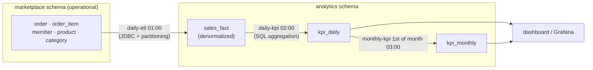
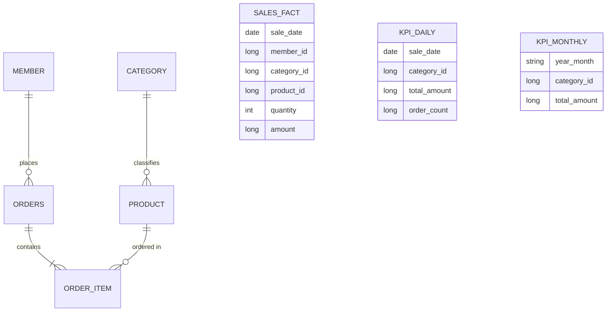
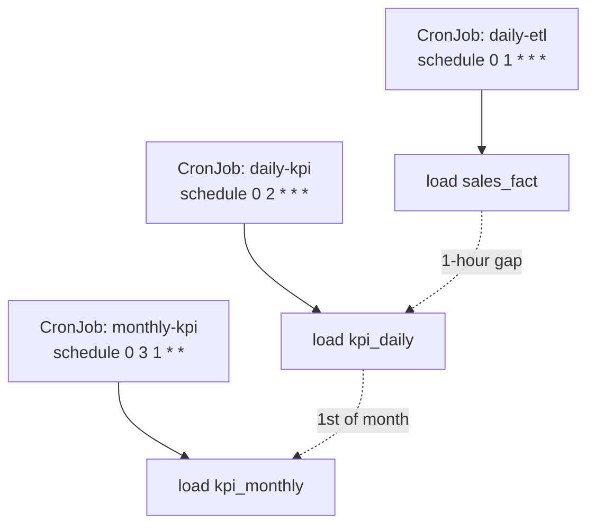

## Introduction

Through [Part 6](/en/blog/spring-batch-6-guide-6) we learned chunks, transactions, scheduling, parallelism, observability, and testing — each separately. The capstone gathers those pieces into <strong>one project.</strong>

What we build is a marketplace analytics pipeline. Every dawn it moves orders piled up in the operational DB into an analytics store (ETL), then aggregates daily and monthly KPIs on top (total revenue, order count, revenue by category, top-10 products) into tables a dashboard reads. Three jobs run in sequence with time gaps, all idempotent, observable, and run as single executions by K8s CronJob.

Parts 1–6 all meet inside this one pipeline — Part 2's Reader/Writer, Part 3's idempotency/restart, Part 4's scheduling/data sources, Part 5's partitioning, Part 6's observability/deployment. Each section marks "this is Part N's technique," so when you get stuck, return to that part.

The target reader is a backend engineer who has read Parts 1–6 or has built and operated Spring Batch jobs.

- Part 1 — Job · Step · Metadata Identity
- Part 2 — Chunk-Oriented Processing — Reader · Processor · Writer
- Part 3 — Transactions · Failure Handling — Skip · Retry · Restart
- Part 4 — Job Launch · Scheduling · Operations
- Part 5 — Performance · Parallelism — Multi-thread · Partitioning · Remote Workers
- Part 6 — Observability · Testing · Deployment
- <strong>Capstone — Marketplace Analytics Pipeline (this post)</strong>

---

## TL;DR

- <strong>The capstone gathers Parts 1–6 into one pipeline</strong> — chunks, idempotency, partitioning, observability, and CronJob meet in one project. Each section marks its source part.
- <strong>Domain — operational schema → analytics schema</strong> — move orders from the operational `marketplace` schema to the analytics `analytics` schema. It's the <strong>simplified variant of Part 4 §6's D (analytics Warehouse) pattern</strong> — schemas split inside one PostgreSQL 16 instance instead of a separate engine.
- <strong>Three jobs, a time-gap directed acyclic graph</strong> — `daily-etl` (01:00) → `daily-kpi` (02:00) → `monthly-kpi` (1st of month, 03:00). Three CronJobs with simple time-based dependency.
- <strong>Two datasources split transaction boundaries per schema</strong> — `operationalDataSource` (read-only) and `analyticsDataSource` (write). The same instance, split by `currentSchema` and role.
- <strong>Technique roundup</strong> — extract-transform-load uses JDBC + partitioning (Part 5), key performance indicators use SQL aggregation (window functions, Part 6), all with idempotent upsert (Part 3), observability (Part 6), and single-execution CronJob (Part 4 §7).

---

## 1. What We Build — Architecture

The simplest structure for running analytics without touching operational traffic. Orders pile up in the operational schema; the batch moves them into the analytics schema and aggregates only there.



### 1.1 Why one instance + schema split

Among the five data-source patterns from Part 4 §6, this capstone is the <strong>simplified variant of D (analytics Warehouse)</strong>. Real D uses a separate analytics engine (BigQuery, Redshift, …); here we split only schemas inside one PostgreSQL 16 instance.

- <strong>Local runs are simple</strong> — spin up a single PostgreSQL with Docker Compose and a reader can run the whole pipeline in 30 minutes.
- <strong>Schema split is a clear-enough boundary</strong> — separate `marketplace` and `analytics` by role/grant to split operational and analytics permissions.
- <strong>The evolution path stays open</strong> — when operational-load isolation genuinely becomes necessary, just change the `analyticsDataSource` URL to a read replica or separate instance. The code stays (Part 4 §6's A → C → D evolution).

---

## 2. Data Model

The operational schema reproduces the comprehensive-assignment domain in PostgreSQL. The analytics schema holds denormalized tables optimized for aggregation.



- <strong>Operational `marketplace`</strong> — `member` · `product` · `category` · `orders` · `order_item`. A normalized transactional model.
- <strong>Analytics `analytics.sales_fact`</strong> — a <strong>denormalized fact</strong> that flattens one order into category, product, and amount. The ETL fills it.
- <strong>Analytics `analytics.kpi_daily` · `kpi_monthly`</strong> — aggregation results. The dashboard reads these.

---

## 3. Two-Datasource Setup

To treat operational and analytics with different transaction boundaries, we keep two datasources. They point at the same instance but differ by `currentSchema` and role.

```yaml
app:
  datasource:
    operational:    # operational schema — read-only account
      jdbc-url: jdbc:postgresql://localhost:5432/market?currentSchema=marketplace
      username: etl_reader
      password: ${ETL_READER_PW}
    analytics:      # analytics schema — write account
      jdbc-url: jdbc:postgresql://localhost:5432/market?currentSchema=analytics
      username: analytics_writer
      password: ${ANALYTICS_WRITER_PW}
```

```kotlin
import com.zaxxer.hikari.HikariDataSource
import org.springframework.boot.context.properties.ConfigurationProperties
import org.springframework.boot.jdbc.DataSourceBuilder
import org.springframework.context.annotation.Bean
import org.springframework.context.annotation.Configuration
import org.springframework.context.annotation.Primary
import javax.sql.DataSource

@Configuration
class DataSourceConfig {

    @Bean
    @Primary   // Spring Batch metadata (JobRepository) lives on the operational datasource
    @ConfigurationProperties("app.datasource.operational")
    fun operationalDataSource(): DataSource =
        DataSourceBuilder.create().type(HikariDataSource::class.java).build()

    @Bean
    @ConfigurationProperties("app.datasource.analytics")
    fun analyticsDataSource(): DataSource =
        DataSourceBuilder.create().type(HikariDataSource::class.java).build()
}
```

> <strong>Note</strong>: the ETL Job <strong>reads</strong> from the operational datasource and <strong>writes</strong> to the analytics one. Since Reader and Writer use different datasources, a chunk's commit boundary (Parts 2–3) is anchored on the write side — the analytics transaction manager. Metadata sits on `@Primary` (operational) for simplicity; if you need more separation, use a dedicated batch datasource.

---

## 4. Job A — daily-etl (Operational → Analytics)

Every day at 01:00, move yesterday's orders from `marketplace` to `analytics.sales_fact`. To minimize operational load it uses <strong>JDBC Reader/Writer</strong> (Part 2 §4) bypassing JPA, processes large order volumes in parallel with <strong>partitioning</strong> (Part 5), and stays safe to re-run with <strong>idempotent upsert</strong> (Part 3 §5).

### 4.1 Partitioning + JDBC worker Step

Part 5's `ColumnRangePartitioner` splits yesterday's order ids into four ranges, and each worker reads only its range and upserts into `sales_fact`.

```kotlin
@Bean
fun etlMasterStep(
    jobRepository: JobRepository,
    etlWorkerStep: Step,
    batchTaskExecutor: ThreadPoolTaskExecutor,
): Step =
    StepBuilder("etlMasterStep", jobRepository)
        .partitioner(etlWorkerStep.name, ColumnRangePartitioner(/* yesterday's id range */))
        .step(etlWorkerStep)
        .gridSize(4)
        .taskExecutor(batchTaskExecutor)
        .build()

@Bean
fun etlWorkerStep(
    jobRepository: JobRepository,
    analyticsTxManager: PlatformTransactionManager,   // write = analytics transaction boundary
    orderRangeReader: JdbcPagingItemReader<OrderRow>, // @StepScope, operational datasource
    salesFactWriter: JdbcBatchItemWriter<SalesFactRow>, // analytics datasource, upsert
): Step =
    StepBuilder("etlWorkerStep", jobRepository)
        .chunk<OrderRow, SalesFactRow>(1000, analyticsTxManager)
        .reader(orderRangeReader)
        .processor(orderToSalesFactProcessor())  // order → denormalized fact (Part 2 §3)
        .writer(salesFactWriter)
        .faultTolerant()
        .skip(org.springframework.batch.item.validator.ValidationException::class.java)
        .skipLimit(100)                           // tolerate up to 100 dirty orders (Part 3 §2)
        .build()
```

### 4.2 The idempotent Writer

Put `UNIQUE (sale_date, order_item_id)` on `sales_fact` and write with `ON CONFLICT DO UPDATE`. Running the same date twice won't duplicate rows (Part 3 §5.3).

```kotlin
@Bean
fun salesFactWriter(analyticsDataSource: DataSource): JdbcBatchItemWriter<SalesFactRow> =
    JdbcBatchItemWriterBuilder<SalesFactRow>()
        .dataSource(analyticsDataSource)
        .sql(
            """
            INSERT INTO sales_fact (sale_date, order_item_id, member_id, category_id, product_id, quantity, amount)
            VALUES (:saleDate, :orderItemId, :memberId, :categoryId, :productId, :quantity, :amount)
            ON CONFLICT (sale_date, order_item_id)
            DO UPDATE SET amount = EXCLUDED.amount, quantity = EXCLUDED.quantity
            """.trimIndent(),
        )
        .beanMapped()
        .build()
```

---

## 5. Jobs B · C — KPI Aggregation

Aggregation is done by <strong>PostgreSQL itself</strong>, not in memory. Put the window functions and `GROUP BY` from Part 6 §5 into the Reader query so the Reader streams <strong>already-aggregated rows</strong> one at a time, and the Writer just upserts.

### 5.1 daily-kpi — daily revenue by category

```kotlin
@Bean
@org.springframework.batch.core.configuration.annotation.StepScope
fun categoryKpiReader(
    analyticsDataSource: DataSource,
    @Value("#{jobParameters['targetDate']}") targetDate: LocalDate,
): JdbcPagingItemReader<KpiDailyRow> {
    // SELECT category_id, SUM(amount) AS total_amount, COUNT(DISTINCT ...) AS order_count
    // FROM sales_fact WHERE sale_date = :targetDate GROUP BY category_id
    // → one row per category; the Reader streams aggregated rows
    return JdbcPagingItemReaderBuilder<KpiDailyRow>()
        .name("categoryKpiReader")
        .dataSource(analyticsDataSource)
        .pageSize(500)
        // .queryProvider(...) GROUP BY category_id
        .parameterValues(mapOf("targetDate" to targetDate))
        .build()
}
```

Put `UNIQUE (sale_date, category_id)` on `kpi_daily` and upsert, and daily-kpi is idempotent too. "Top-10 products" is pulled with the `ROW_NUMBER() OVER (ORDER BY SUM(amount) DESC)` window function into a separate KPI table — impossible on H2, only on real PostgreSQL (Part 6 §5.1).

### 5.2 monthly-kpi — monthly rollup

On the 1st of each month at 03:00, re-aggregate `kpi_daily` by month into `kpi_monthly`. Since the source is already aggregated daily, it's light.

```kotlin
// SELECT to_char(sale_date, 'YYYY-MM') AS year_month, category_id, SUM(total_amount)
// FROM kpi_daily WHERE sale_date >= :monthStart AND sale_date < :nextMonth
// GROUP BY year_month, category_id  → upsert kpi_monthly
```

The KPI jobs could switch to `JpaPagingItemReader` (Part 2 §2.3) where domain-object transforms are needed, but for pure aggregation SQL is fastest and simplest.

---

## 6. Orchestration & Operations

### 6.1 Three CronJobs, a time-gap DAG

Inter-job dependency is simplified with time gaps (Part 4 §2). Leave time for the ETL to finish before running KPIs.



If you need strict dependency (KPI only after ETL succeeds), wire them as a DAG in Argo Workflows/Airflow (Part 4 §2). The time-gap approach is simple but risks the KPI aggregating stale data if the ETL doesn't finish within the hour — scale up to a DAG as volume grows.

### 6.2 Operational requirements — the series answers them all

| Requirement | Solution | Source |
|-------------|----------|--------|
| Safe same-date re-run | JobParameters date key + `ON CONFLICT` upsert | Part 3 §5 |
| Partial-failure recovery | `faultTolerant` + skipLimit + SkipListener logging | Part 3 §2–3 |
| Failure alerts | Slack from `JobExecutionListener.afterJob` | Part 4 §5 |
| Throughput · failure rate · duration | Micrometer + Prometheus + Grafana | Part 6 §1 |
| Multi-instance single execution | K8s CronJob `concurrencyPolicy: Forbid` | Part 4 §7 |
| Accelerate large ETL | partitioning into 4 | Part 5 §2 |
| Operational-load isolation | read-only account + (if needed) read replica | Part 4 §6 |

### 6.3 Docker Compose locally, CronJob in production

Locally, spin up a single PostgreSQL 16 with Docker Compose and run the jobs directly (Appendix A). In production, deploy the same image as three K8s CronJobs (Part 6 §6.2). Even with multiple instances, CronJob launches each job exactly once, so there's no duplicate execution.

---

## 7. Series Map — Which Part Went Where

How this single pipeline absorbed the whole series, at a glance:

| Part | Technique | Capstone application point |
|------|-----------|----------------------------|
| Part 1 | JobRepository metadata | execution history & restart basis for the 3 jobs |
| Part 2 | chunks · JDBC Reader/Writer | the ETL's JdbcPagingItemReader + JdbcBatchItemWriter |
| Part 3 | idempotency · Skip · restart | `ON CONFLICT` upsert, faultTolerant, date key |
| Part 4 | scheduling · data sources | CronJob triggers, D-pattern schema split, single execution |
| Part 5 | partitioning | ETL worker Step split into 4 |
| Part 6 | observability · testing · deployment | Micrometer/MDC, Testcontainers, multi-stage + CronJob |

---

## Recap

The key takeaways from the capstone, one line each:

- <strong>One pipeline absorbs the whole series</strong> — chunks, idempotency, partitioning, observability, and CronJob all operate together inside the three jobs daily-etl · daily-kpi · monthly-kpi.
- <strong>Schema split separates operational and analytics</strong> — one PostgreSQL 16 instance, two datasources (`currentSchema` + role). When load isolation is needed, change only the URL to evolve to a read replica or separate instance.
- <strong>PostgreSQL does the aggregation</strong> — put `GROUP BY`/window functions in the Reader query to stream already-aggregated rows; the Writer just upserts. Validate on real PostgreSQL, not H2.
- <strong>Idempotency + single execution are the two pillars of operations</strong> — date key + upsert for safe re-runs, CronJob `Forbid` to block duplicate execution.
- <strong>Same code for local and production</strong> — spin it up in 30 minutes with Docker Compose, deploy the same image as CronJobs.

This post <strong>closes the Spring Batch 6 Guide series.</strong> Starting from Part 1's Hello Tasklet, through chunks and transactions, past scheduling and parallelism and observability, we've arrived at a real analytics pipeline. A beginner who follows the series end to end can design, build, and operate "batch that runs safely" with Spring Batch 6. Natural next topics: extending this pipeline's alerts to be event-driven with Spring Cloud Stream, or deepening observability with OpenTelemetry.

---

## Appendix

### A. Running locally — Docker Compose

<details>
<summary><strong>Expand — one PostgreSQL 16 hosting two schemas</strong></summary>

```yaml
services:
  postgres:
    image: postgres:16
    environment:
      POSTGRES_DB: market
      POSTGRES_PASSWORD: postgres
    ports:
      - "5432:5432"
    volumes:
      - ./init:/docker-entrypoint-initdb.d   # SQL creating marketplace·analytics schemas·roles
```

Put SQL creating the two schemas and roles (`etl_reader` · `analytics_writer`) in `init/`, and it's applied automatically on the container's first start. Then launch a job directly with `--spring.batch.job.name=daily-etl --targetDate=2026-05-16`.

</details>

### B. External references

- [Spring Batch 6 Reference](https://docs.spring.io/spring-batch/reference/) — the full reference
- [Spring Boot — Configure Two DataSources](https://docs.spring.io/spring-boot/how-to/data-access.html#howto.data-access.configure-two-datasources) — multi-datasource configuration
- [PostgreSQL 16 — Window Functions](https://www.postgresql.org/docs/16/tutorial-window.html) — window functions for KPI aggregation
- [Kubernetes — CronJob](https://kubernetes.io/docs/concepts/workloads/controllers/cron-jobs/) — scheduling the three jobs · single execution
