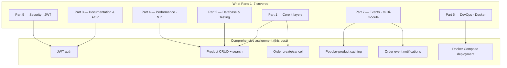
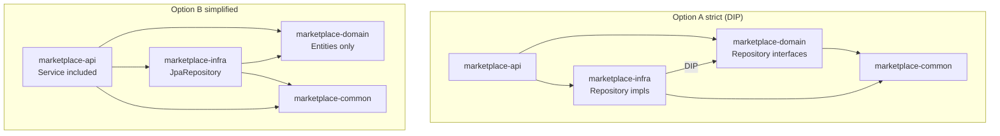
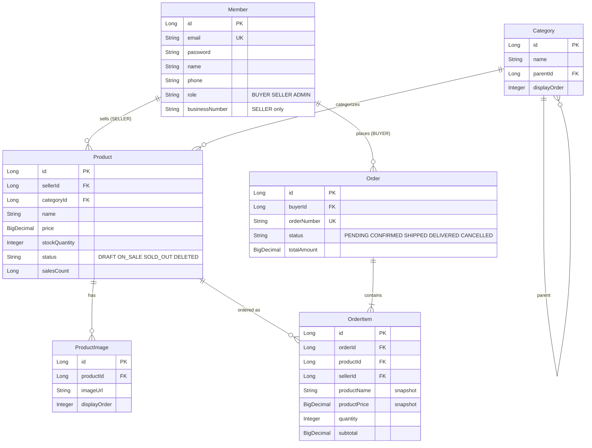

## Introduction

"How far should I take a Spring Boot pre-interview assignment in seven days?"

Parts 1 through 7 walked through the areas reviewers actually look at, one topic per post. Real assignments do not arrive divided that way. <strong>A single REST API implementation mixes four-layer responsibilities, JPA mapping, testing, N+1 hotspots, JWT auth, Docker deployment, and event-driven notifications into one codebase.</strong> So the series closes with one comprehensive assignment.

This post is the series capstone and a spec sheet. The brief is to build a fictional online marketplace REST API in seven days, covering member, product, and order domains. Each section flags which earlier part applies. Approach it as if you were simulating how a reviewer reads your README and code, in that order.

The target reader is a junior backend engineer who has skimmed Parts 1–7 once. You do not need to implement every item — clearing the 70-point base and then picking your bonus battles is the realistic strategy. Even one clear paragraph in the README explaining "why this structure" widens the gap against other submissions.

- Part 1 — [Core Application Layer](/en/blog/spring-boot-pre-interview-guide-1)
- Part 2 — [Database & Testing](/en/blog/spring-boot-pre-interview-guide-2)
- Part 3 — [Documentation & AOP](/en/blog/spring-boot-pre-interview-guide-3)
- Part 4 — [Performance & Optimization](/en/blog/spring-boot-pre-interview-guide-4)
- Part 5 — [Security & Authentication](/en/blog/spring-boot-pre-interview-guide-5)
- Part 6 — [DevOps & Deployment](/en/blog/spring-boot-pre-interview-guide-6)
- Part 7 — [Advanced Patterns](/en/blog/spring-boot-pre-interview-guide-7)
- <strong>Comprehensive Assignment — Marketplace REST API (this post)</strong>

[Back to Part 7](/en/blog/spring-boot-pre-interview-guide-7)

---

## TL;DR

- <strong>A seven-day marketplace REST API</strong> — members (BUYER/SELLER/ADMIN), product CRUD, order create/cancel, image upload, search with pagination, caching, and async notifications. Every area Parts 1–7 covered lands in one project.
- <strong>Stack is Spring Boot 4 + Kotlin 2.3</strong> — Java 21 recommended, JPA/Hibernate, Gradle, H2 (local) + MySQL 8 (Docker), QueryDSL and Redis optional. No Lombok.
- <strong>Structure choice is the first scoring signal</strong> — pick single-module (recommended) or multi-module (Option A strict Dependency Inversion Principle / Option B simplified) and apply it consistently. Not stating *why* in the README is itself a deduction.
- <strong>70 base + 35 bonus points</strong> — base covers features, code quality, design, tests. Bonus covers Docker, Swagger, CI, caching, events, QueryDSL, multi-module. Deductions hit harder: build failure -20, missing README -10, plain-text passwords -10.
- <strong>Five checks before you submit</strong> — `./gradlew build` passes, `docker-compose up` works, Swagger reachable, no secrets or `.idea` committed, README complete. Reviewers only start reading your real code once these five hold.

---

## 1. Assignment Overview

### 1.1 What you are building

Implement the backend API for an online marketplace. Sellers register products; buyers search and place orders. Notifications run asynchronously and popular products are cached — the same shape as a real production service.



The diagram shows where each part's patterns land. If you get stuck in one area while building, drop back to the corresponding part and re-read it.

> <strong>Note — Spring Boot 4 + Kotlin 2.3 setup</strong>: This assignment assumes <strong>Spring Boot 4 + Kotlin 2.3</strong>. The Kotlin plugin setup (`kotlin-spring`, `kotlin-jpa`, `kotlin("plugin.spring") version "2.3"`, etc.) is covered in Part 1 §1.1 — start there. The Kotlin 2.x line is backward compatible, so the same code runs on 2.0 through 2.3. Lombok is not used.

### 1.2 Deadline and tech stack

| Item | Detail |
|------|--------|
| <strong>Deadline</strong> | 7 days from the date the assignment is received |
| <strong>Language / framework</strong> | Kotlin 2.3, Spring Boot 4 (Java 21 recommended) |
| <strong>Persistence</strong> | JPA/Hibernate, Gradle |
| <strong>Database</strong> | H2 (local), MySQL 8.0 (Docker) |
| <strong>Optional</strong> | QueryDSL, Redis |

---

## 2. Business Requirements

### 2.1 Member management

- Member types: `BUYER`, `SELLER`, `ADMIN`
- Email duplication check on signup
- JWT issuance on login (Access Token + Refresh Token)
- Business registration number is required for sellers

### 2.2 Product management (sellers only)

- Product create/update/delete (own products only)
- Product image upload (up to 5 images, max 10 MB each)
- Product status: `DRAFT`, `ON_SALE`, `SOLD_OUT`, `DELETED`
- Inventory management

### 2.3 Product browsing (public)

- Product list (pagination, search, filtering)
- Product detail
- Category-based listing
- Popular products list (cached)

### 2.4 Order management

- Buyer: create order, cancel order, view order history
- Seller: view orders for own products, update shipping status
- Order status transitions: `PENDING` → `CONFIRMED` → `SHIPPED` → `DELIVERED`
- Cancellation is only allowed in `PENDING` or `CONFIRMED`

### 2.5 Notifications

- Notify the seller when an order is created (async)
- Notify the buyer when shipping status changes (async)
- Logging stands in for actual delivery (no real notification provider required)

---

## 3. API Specification

### 3.1 Authentication API

| Method | URI | Description | Auth |
|--------|-----|-------------|------|
| POST | `/api/v1/auth/signup` | Sign up | X |
| POST | `/api/v1/auth/login` | Login | X |
| POST | `/api/v1/auth/refresh` | Token refresh | X |

### 3.2 Member API

| Method | URI | Description | Auth |
|--------|-----|-------------|------|
| GET | `/api/v1/members/me` | Get my info | O |
| PATCH | `/api/v1/members/me` | Update my info | O |
| GET | `/api/v1/admin/members` | Member list (admin) | ADMIN |

### 3.3 Product API

| Method | URI | Description | Auth |
|--------|-----|-------------|------|
| POST | `/api/v1/products` | Register product | SELLER |
| GET | `/api/v1/products` | Product list | X |
| GET | `/api/v1/products/{productId}` | Product detail | X |
| PATCH | `/api/v1/products/{productId}` | Update product | SELLER (owner) |
| DELETE | `/api/v1/products/{productId}` | Delete product | SELLER (owner) |
| POST | `/api/v1/products/{productId}/images` | Upload product images | SELLER (owner) |
| GET | `/api/v1/products/popular` | Popular products list | X |

### 3.4 Order API

| Method | URI | Description | Auth |
|--------|-----|-------------|------|
| POST | `/api/v1/orders` | Create order | BUYER |
| GET | `/api/v1/orders` | My order list | O |
| GET | `/api/v1/orders/{orderId}` | Order detail | O (owner) |
| POST | `/api/v1/orders/{orderId}/cancel` | Cancel order | BUYER (owner) |
| GET | `/api/v1/sellers/orders` | Seller order list | SELLER |
| PATCH | `/api/v1/sellers/orders/{orderId}/status` | Update shipping status | SELLER |

### 3.5 Category API

| Method | URI | Description | Auth |
|--------|-----|-------------|------|
| GET | `/api/v1/categories` | Category list | X |
| POST | `/api/v1/admin/categories` | Register category | ADMIN |

---

## 4. Detailed Requirements

### 4.1 Authentication and authorization

- JWT-based auth — Access Token 1 hour, Refresh Token 7 days
- Passwords encrypted with BCrypt (see Part 5 §3.1)
- Role-based access control — `BUYER`, `SELLER`, `ADMIN`
- Resource ownership verification — owners can modify only their own products/orders (Part 5 §4.3)

### 4.2 Product search and filtering

Example query:

```
GET /api/v1/products?keyword=laptop&categoryId=1&minPrice=100000&maxPrice=2000000&status=ON_SALE&page=0&size=20&sort=createdAt,desc
```

| Parameter | Type | Description |
|-----------|------|-------------|
| keyword | String | Product name search (partial match) |
| categoryId | Long | Category filter |
| minPrice | BigDecimal | Minimum price |
| maxPrice | BigDecimal | Maximum price |
| status | String | Product status |
| sellerId | Long | Seller filter |
| page | Integer | Page number (starts at 0) |
| size | Integer | Page size (default 20, max 100) |
| sort | String | Sort key (createdAt, price, salesCount) |

### 4.3 Order creation

Request body:

```json
// POST /api/v1/orders
{
  "orderItems": [
    { "productId": 1, "quantity": 2 },
    { "productId": 3, "quantity": 1 }
  ],
  "shippingAddress": {
    "zipCode": "12345",
    "address": "123 Teheran-ro, Gangnam-gu, Seoul",
    "addressDetail": "Unit 456",
    "receiverName": "John Doe",
    "receiverPhone": "010-1234-5678"
  }
}
```

Processing rules:

- Verify stock then deduct (handle concurrency — pessimistic or optimistic-lock-with-retry, see the appendix hint)
- Allow simultaneous orders across multiple sellers (orders split per seller)
- Publish a notification event to the seller on order creation (Part 7 §1)
- Fail the order if inventory is insufficient

### 4.4 File upload

- Supported extensions: `jpg`, `jpeg`, `png`, `gif`
- Max file size: 10 MB
- Up to 5 images per product
- Storage path: `/uploads/products/{productId}/{filename}`
- Filenames are rewritten to UUIDs before saving (see Part 7 §3)

### 4.5 Caching

| Target | TTL | Note |
|--------|-----|------|
| Popular products list | 10 min | See Part 4 §4 |
| Category list | 1 hour | Rare changes |
| Product detail (optional) | 5 min | Invalidate on update |

### 4.6 Logging

- Attach a unique Request ID to every request via MDC (Part 3 §2)
- Log API requests/responses via AOP (Part 3 §2)
- Log format: `[timestamp] [level] [requestId] [class] message`

---

## 5. Technical Requirements

### 5.1 Project structure options

Pick single-module or multi-module and apply it consistently. <strong>The choice itself matters less than naming the reason in the README</strong> — that one paragraph is the difference between "uncertain" and "deliberate" in the reviewer's notes.

#### Option A: single module (recommended)

```
marketplace/
└── src/main/kotlin/com/example/
    ├── controller/
    ├── service/
    ├── repository/
    ├── domain/
    ├── dto/
    └── config/
```

#### Option B: multi-module (challenge)

Two variants exist (see Part 7 §6).

<strong>B-1. Strict (DIP applied)</strong>

```
marketplace/
├── marketplace-api/           # Controller, Security, execution
├── marketplace-domain/        # Entity, Service, Repository interfaces
├── marketplace-infra/         # Repository implementations, external integrations
└── marketplace-common/        # Common exceptions, utilities
```

<strong>B-2. Simplified (pragmatic)</strong>

```
marketplace/
├── marketplace-api/           # Controller, Service, Security, execution
├── marketplace-domain/        # Entities only
├── marketplace-infra/         # JpaRepository, QueryDSL
└── marketplace-common/        # Common exceptions, utilities
```

Module dependency directions:



> <strong>Multi-module requirements</strong>:
> - Apply the chosen structure (B-1 or B-2) consistently
> - B-1: no `domain → infra` dependency; separate Repository interface and implementation
> - B-2: Services live in `api`; use JpaRepository directly
> - State the chosen structure and rationale in the README

### 5.2 Required implementation

| Item | Description |
|------|-------------|
| <strong>Layer separation</strong> | Controller → Service → Repository, DTO/Command split (Part 1 §2–§4) |
| <strong>Exception handling</strong> | GlobalExceptionHandler, custom exceptions, consistent error response (Part 1 §5) |
| <strong>Validation</strong> | Bean Validation on Request DTOs (Part 1 §2.2) |
| <strong>Transactions</strong> | Service-layer transaction management, `readOnly` split (Part 1 §3.2) |
| <strong>Testing</strong> | Controller, Service, Repository tests (at least one each, Part 2 §3–§5) |
| <strong>API documentation</strong> | Swagger or REST Docs (Part 3 §1) |
| <strong>Docker</strong> | Dockerfile + docker-compose.yml (App + MySQL, Part 6 §1–§2) |
| <strong>README</strong> | How to run, tech stack rationale, link to API docs |

### 5.3 Optional implementation (bonus)

| Item | Description | Reference |
|------|-------------|-----------|
| <strong>Multi-module</strong> | api/domain/infra/common split, DIP applied | Part 7 §6 |
| <strong>QueryDSL</strong> | Dynamic search queries | Part 4 §5.2 |
| <strong>Redis caching</strong> | Popular products caching | Part 4 §4.3 |
| <strong>GitHub Actions</strong> | CI pipeline (build/test) | Part 6 §3 |
| <strong>Test coverage</strong> | JaCoCo 70%+ | Part 6 §3.2 |
| <strong>Event-driven</strong> | Order/notification event separation | Part 7 §1 |

---

## 6. Data Model

Six entities with the following relationships:



Notice that `OrderItem` stores product name and price as snapshots — order history must survive later product edits with the price at the time of purchase intact.

---

## 7. Evaluation Criteria

### 7.1 Base score (70 points)

| Item | Points | Detail |
|------|--------|--------|
| <strong>Feature implementation</strong> | 30 | Requirements met, works correctly |
| <strong>Code quality</strong> | 20 | Readability, naming, consistency |
| <strong>Design</strong> | 10 | Layer separation, responsibility, exception handling |
| <strong>Testing</strong> | 10 | Coverage and test quality |

### 7.2 Bonus (35 points)

| Item | Points |
|------|--------|
| Docker Compose runnable | +5 |
| Swagger / REST Docs | +5 |
| GitHub Actions CI | +5 |
| Caching (Redis or local) | +5 |
| Event-driven notifications | +5 |
| QueryDSL dynamic queries | +5 |
| Multi-module structure with DIP | +5 |

### 7.3 Deductions

| Item | Deduction |
|------|-----------|
| Build failure | -20 |
| Missing/sparse README | -10 |
| No tests | -10 |
| SQL Injection vulnerability | -10 |
| Plain-text password storage | -10 |
| N+1 problem (obvious cases) | -5 |

The bonus tops out at +35, but a single deduction line can take -20 in one shot. Lock the base in first, then chase bonus where it costs you the least.

---

## 8. Submission Guide

### 8.1 How to submit

1. Push the code to a GitHub repository
2. Include the following in `README.md`:
   - How to run (local, Docker)
   - Tech stack and rationale for choices
   - How to reach API documentation
   - Project structure overview
   - Any additional implementation notes
3. Submit the repository URL

### 8.2 Run instructions

<strong>Single module</strong>

```bash
# Local (H2)
./gradlew bootRun --args='--spring.profiles.active=local'

# Docker Compose
docker-compose up -d
```

<strong>Multi-module</strong>

```bash
# Local (H2)
./gradlew :marketplace-api:bootRun --args='--spring.profiles.active=local'

# Build the runnable JAR
./gradlew :marketplace-api:bootJar

# Docker Compose
docker-compose up -d
```

### 8.3 Seed test accounts

| Role | Email | Password |
|------|-------|----------|
| ADMIN | admin@example.com | admin123! |
| SELLER | seller@example.com | seller123! |
| BUYER | buyer@example.com | buyer123! |

### 8.4 Checklist

Confirm each before submission:

- [ ] `./gradlew build` succeeds
- [ ] `docker-compose up` runs successfully
- [ ] Swagger UI or REST Docs is reachable
- [ ] All tests pass
- [ ] README.md is complete
- [ ] Sensitive files excluded (`.env`, secret keys, etc.)
- [ ] Junk files excluded (`.idea`, `.DS_Store`, etc.)

> <strong>Questions</strong>: ask by email during the assignment. If a requirement is ambiguous, make a reasonable judgement, implement accordingly, and document the choice in the README.

---

## Recap

- <strong>Parts 1–7 meet in one codebase</strong> — four layers (Part 1), JPA and tests (Part 2), documentation and logging (Part 3), N+1 optimization (Part 4), JWT (Part 5), Docker (Part 6), events and multi-module (Part 7) all land in the same marketplace. Drop back to a part when you get stuck.
- <strong>The README speaks for your structure choice</strong> — whether you picked single-module or multi-module, one paragraph stating *why* is itself a scoring item. Without it, reviewers start deducting before they even read the code.
- <strong>The 70 base outweighs the 35 bonus</strong> — avoiding -20 for a broken build, -10 for a thin README, and -10 for plaintext passwords matters more than chasing every bonus tile. Build the foundation first.
- <strong>Spring Boot 4 + Kotlin 2.3 is the default</strong> — no Lombok needed; primary constructors with `val`/`var`, data classes, scope functions, and `when` expressions cut the code naturally.
- <strong>Seven days is short</strong> — use the appendix's implementation-order hints to fix a daily checkpoint. Leave the final day entirely for README polish and build verification — that is what separates rushed submissions from clean ones.

This post closes the Spring Boot pre-interview guide series. From the first Controller line in Part 1 to the entire marketplace in this assignment, you have now seen every area reviewers check. If you followed the series end to end, you know where the next pre-interview brief will not stall you. Good luck!

👉 [Implementation code](https://github.com/rhcwlq89/marketplace)

---

## Appendix

<details>
<summary><strong>Implementation order — single module</strong></summary>

1. <strong>Project setup</strong>: dependencies, profile split, Docker Compose
2. <strong>Domain design</strong>: Entity, Repository
3. <strong>Authentication</strong>: Spring Security, JWT (Part 5)
4. <strong>Member API</strong>: signup, login, my info
5. <strong>Product API</strong>: CRUD, image upload
6. <strong>Order API</strong>: create, query, status changes
7. <strong>Search/pagination</strong>: product search, filtering (Part 4)
8. <strong>Caching/events</strong>: popular product caching, notification events (Part 7)
9. <strong>Tests</strong>: unit + integration (Part 2)
10. <strong>Documentation</strong>: Swagger setup, README

</details>

<details>
<summary><strong>Implementation order — multi-module</strong></summary>

1. <strong>Project structure</strong>: `settings.gradle.kts`, per-module `build.gradle.kts`
2. <strong>common module</strong>: shared exceptions, ErrorCode, utilities
3. <strong>domain module</strong>: Entity, Repository interfaces, Services (Option A) / entities only (Option B)
4. <strong>infra module</strong>: Repository implementations, JPA configuration
5. <strong>api module</strong>: Controller, Security, Swagger
6. <strong>Integration tests</strong>: end-to-end flow exercised from `api`
7. <strong>Docker</strong>: multi-module Dockerfile
8. <strong>Documentation</strong>: README with the module diagram

<strong>Watch out</strong>: avoid circular dependencies once modules are split.

</details>

<details>
<summary><strong>Concurrency hint — inventory deduction</strong></summary>

Two ways to handle concurrent stock deduction. Pessimistic locks are simple and safe but reduce throughput; optimistic locks scale better but require retry on conflict.

```kotlin
// 1. Pessimistic lock
interface ProductRepository : JpaRepository<Product, Long> {
    @Lock(LockModeType.PESSIMISTIC_WRITE)
    @Query("SELECT p FROM Product p WHERE p.id = :id")
    fun findByIdWithLock(@Param("id") id: Long): Product?
}

// 2. Optimistic lock + retry
@Entity
class Product(
    @Id @GeneratedValue
    val id: Long? = null,

    @Version
    var version: Long = 0,
    // ...
)
```

</details>

<details>
<summary><strong>Event hint — notify after order creation</strong></summary>

Use `@TransactionalEventListener(phase = AFTER_COMMIT)` so notifications fire only once the order transaction commits — the same pattern as Part 7 §1.

```kotlin
data class OrderCreatedEvent(
    val orderId: Long,
    val sellerId: Long,
    val createdAt: LocalDateTime = LocalDateTime.now(),
)

@Component
class OrderEventListener(
    private val notificationService: NotificationService,
) {
    @Async
    @TransactionalEventListener(phase = TransactionPhase.AFTER_COMMIT)
    fun handleOrderCreated(event: OrderCreatedEvent) {
        notificationService.notifySeller(event.sellerId, event.orderId)
    }
}
```

</details>

<details>
<summary><strong>Multi-module hint — Gradle setup with Option A/B code</strong></summary>

Two approaches for multi-module:

| Option | Service location | Repository handling | Trait |
|--------|------------------|---------------------|-------|
| <strong>Option A (strict)</strong> | domain | Interface/impl split | Strict DIP |
| <strong>Option B (simplified)</strong> | api | JpaRepository direct | Pragmatic, less code |

<strong>settings.gradle.kts</strong>

```kotlin
rootProject.name = "marketplace"

include("marketplace-api")
include("marketplace-domain")
include("marketplace-infra")
include("marketplace-common")

dependencyResolutionManagement {
    versionCatalogs {
        create("libs") {
            // Spring Boot 4 + Kotlin 2.3 BOM
        }
    }
}
```

<strong>Per-module dependencies</strong>

```kotlin
// marketplace-common: no dependencies (utilities + shared exceptions)

// marketplace-domain
dependencies {
    implementation(project(":marketplace-common"))
    implementation(libs.spring.boot.starter.data.jpa)
}

// marketplace-infra
dependencies {
    implementation(project(":marketplace-common"))
    implementation(project(":marketplace-domain"))
    implementation(libs.spring.boot.starter.data.jpa)
    // QueryDSL (optional)
    implementation("com.querydsl:querydsl-jpa:5.0.0:jakarta")
    kapt("com.querydsl:querydsl-apt:5.0.0:jakarta")
    runtimeOnly(libs.h2)
    runtimeOnly(libs.mysql.connector.j)
}

// marketplace-api (execution module)
dependencies {
    implementation(project(":marketplace-common"))
    implementation(project(":marketplace-domain"))
    implementation(project(":marketplace-infra"))
    implementation(libs.spring.boot.starter.web)
    implementation(libs.spring.boot.starter.security)
}
```

<strong>Option A: Repository interface / impl split (DIP)</strong>

```kotlin
// marketplace-domain/.../ProductRepository.kt (interface)
interface ProductRepository {
    fun save(product: Product): Product
    fun findById(id: Long): Product?
}

// marketplace-infra/.../ProductRepositoryImpl.kt (implementation)
@Repository
class ProductRepositoryImpl(
    private val jpaRepository: ProductJpaRepository,
) : ProductRepository {

    override fun save(product: Product): Product = jpaRepository.save(product)

    override fun findById(id: Long): Product? = jpaRepository.findById(id).orElse(null)
}
```

<strong>Option B: QueryDSL Custom Repository pattern (simplified)</strong>

```kotlin
// marketplace-infra/.../ProductJpaRepository.kt
interface ProductJpaRepository : JpaRepository<Product, Long>, ProductJpaRepositoryCustom {
    fun findBySellerId(sellerId: Long, pageable: Pageable): Page<Product>
}

// marketplace-infra/.../ProductJpaRepositoryCustom.kt
interface ProductJpaRepositoryCustom {
    fun search(keyword: String?, categoryId: Long?, pageable: Pageable): Page<Product>
}

// marketplace-infra/.../ProductJpaRepositoryImpl.kt (QueryDSL)
class ProductJpaRepositoryImpl(
    private val queryFactory: JPAQueryFactory,
) : ProductJpaRepositoryCustom {
    override fun search(keyword: String?, categoryId: Long?, pageable: Pageable): Page<Product> {
        // queryFactory.selectFrom(product).where(...).fetch()
        TODO()
    }
}

// marketplace-api/.../ProductService.kt (Service lives in the api module)
@Service
class ProductService(
    private val productJpaRepository: ProductJpaRepository,
) {
    // injected directly
}
```

<strong>Component scan config</strong>

```kotlin
// marketplace-api: MarketplaceApplication.kt
@SpringBootApplication(scanBasePackages = ["com.example"])
class MarketplaceApplication

fun main(args: Array<String>) {
    runApplication<MarketplaceApplication>(*args)
}
```

</details>

<details>
<summary><strong>Multi-module Docker build hint</strong></summary>

Java 21 + Gradle 8.10 multi-stage build, identical to the pattern in Part 6 §1.2.

```dockerfile
FROM gradle:8.10-jdk21 AS builder
WORKDIR /app

# Copy Gradle files first (caching)
COPY build.gradle.kts settings.gradle.kts ./
COPY gradle ./gradle
COPY marketplace-common/build.gradle.kts ./marketplace-common/
COPY marketplace-domain/build.gradle.kts ./marketplace-domain/
COPY marketplace-infra/build.gradle.kts ./marketplace-infra/
COPY marketplace-api/build.gradle.kts ./marketplace-api/

RUN gradle dependencies --no-daemon || true

# Copy source and build
COPY . .
RUN gradle :marketplace-api:bootJar --no-daemon -x test

# Runtime
FROM eclipse-temurin:21-jre-alpine
WORKDIR /app
COPY --from=builder /app/marketplace-api/build/libs/*.jar app.jar
EXPOSE 8080
ENTRYPOINT ["java", "-jar", "app.jar"]
```

</details>

### External references

- [Spring Boot 4 reference](https://docs.spring.io/spring-boot/)
- [Kotlin + Spring guide](https://kotlinlang.org/docs/jvm-spring-boot-restful.html)
- [JPA Buddy — Kotlin entities](https://www.jpa-buddy.com/blog/best-practices-and-common-pitfalls/)
- [Spring Security 7 reference](https://docs.spring.io/spring-security/reference/)
- [QueryDSL documentation](https://querydsl.com/)
