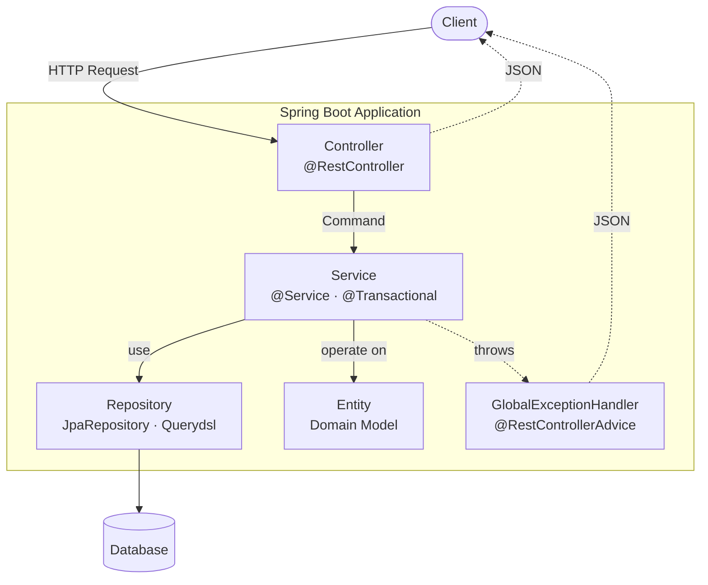

## Introduction

"How well does my Spring Boot pre-interview assignment have to be done to actually impress?"

After submitting and reviewing pre-interview assignments many times, the same feedback points keep coming up. Most of them don't start with "the feature works" — they start with <strong>"the layer responsibilities are mixed up."</strong> This series collects those points from an evaluator's perspective.

Part 1 starts where it should: the <strong>Controller · Service · Repository · Domain</strong> four-layer architecture. We cover how to divide responsibilities, why Request DTOs should not be passed directly to the Service but converted into Commands, what `@Transactional(readOnly = true)` actually does, and why GlobalExceptionHandler is more than a simple catch-all.

The target reader is a junior backend engineer who knows Spring but isn't sure where evaluators are looking. After reading, you should no longer hesitate about what belongs in which layer.

- <strong>Part 1 — Core Application Layer (this post)</strong>
- Part 2 — [Database &amp; Testing](/en/blog/spring-boot-pre-interview-guide-2)
- Part 3 — [Documentation &amp; AOP](/en/blog/spring-boot-pre-interview-guide-3)
- Part 4 — [Logging](/en/blog/spring-boot-pre-interview-guide-4)
- Part 5 — [Authentication &amp; Validation](/en/blog/spring-boot-pre-interview-guide-5)
- Part 6 — [Performance](/en/blog/spring-boot-pre-interview-guide-6)
- Part 7 — [Production Readiness](/en/blog/spring-boot-pre-interview-guide-7)

---

## TL;DR

- <strong>Half of the evaluation is layer-responsibility separation</strong> — Controller does HTTP only, Service owns transactions and business logic, Repository owns queries, Domain owns state and invariants. Mixed responsibilities cost points.
- <strong>Request DTO ≠ Service input</strong> — Request DTOs live only in the Controller; convert them to Commands before passing to the Service. The point is to keep web dependencies out of Service tests.
- <strong>`@Transactional(readOnly = true)` is not "no transaction"</strong> — A transaction does start, but Dirty Checking and auto-flush are off, and it can serve as a Read Replica routing hint. The standard pattern: declare it at the class level and override only on write methods.
- <strong>Entities expose business methods, not setters</strong> — `update(name, category)` instead of `setName()`. This blocks indiscriminate state changes and makes invariants visible in code. Default constructor stays `protected`.
- <strong>GlobalExceptionHandler is three-tiered</strong> — `CommonException` (intentional business errors) → `MethodArgumentNotValidException` (validation failures) → `Exception` (fallback). Without the fallback, the Whitelabel page leaks — which is itself a deduction.

---

## 1. Four Layers at a Glance

### 1.1 Request Flow

The path a single request takes from arrival to response, and where each layer sits, looks like this.



The arrows point in one direction for a reason. <strong>The Controller knows only the Service, the Service knows the Repository and Entity, and the Repository knows only the DB.</strong> Reverse dependencies — a Service that knows HTTP, an Entity that knows DTOs — are anti-patterns.

### 1.2 Responsibility per Layer

| Layer | Responsibility | What it must never do |
|------|------|--------------------|
| <strong>Controller</strong> | HTTP mapping, validation, DTO ↔ Command conversion | Business logic, transactions |
| <strong>Service</strong> | Transactions, business rules, DTO conversion | Depend on HTTP annotations |
| <strong>Repository</strong> | Queries, pagination | Business branching |
| <strong>Domain</strong> | State and invariants, business methods | Expose setters |

> <strong>Note</strong>: Don't collapse layers just because the assignment is small. "The Service has only one line, why not move it to the Controller?" is a trap — evaluators are looking at the separation itself.

---

## 2. Presentation Layer (Controller)

### 2.1 CRUD and HTTP Method Mapping

You can distinguish PUT for full updates and PATCH for partial updates, but the better move is to commit to one approach instead of mixing.

| Operation | HTTP Method |
|------|-------------|
| Create | POST |
| Read | GET |
| Update | PUT / PATCH |
| Delete | DELETE |

<details>
<summary><strong>PUT vs PATCH Debate</strong></summary>

<strong>REST principle distinction</strong>
- `PUT`: Replaces the entire resource (guarantees idempotency)
- `PATCH`: Modifies only part of the resource

<strong>Reality in practice</strong>

In most real-world projects, teams either use only PATCH or only PUT.

- <strong>PATCH only</strong>: Most modifications are partial updates, and full replacements are rarely needed.
- <strong>PUT only</strong>: The team convention standardizes on PUT, or the frontend always sends the complete payload.

<strong>Recommendation for assignments</strong>

Stick with one approach and explain your reasoning in the README. Mixing both without a clear rule actually hurts the evaluation.

</details>

### 2.2 URI Design Principles

- <strong>Plural nouns</strong>: `/orders`, `/users`, `/products`
- <strong>Ownership</strong>: `/users/{userId}/orders`
- <strong>Actions</strong>: `/orders/{orderId}/cancel`

> <strong>Tip</strong>: Action URIs like `cancel` may or may not be acceptable depending on the domain. For simple CRUD assignments, consider expressing state changes via PATCH instead.

<details>
<summary><strong>How to fill the URL when expressing an action as PATCH</strong></summary>

The rule: <strong>don't put verbs in the URL — keep the resource path as-is and let the body carry the intent.</strong>

```http
# Action URI style (RPC-ish)
POST /api/v1/orders/{orderId}/cancel

# PATCH style — verb disappears from the URL, intent moves to body
PATCH /api/v1/orders/{orderId}
Content-Type: application/json

{ "status": "CANCELLED" }
```

<strong>Three variants seen in the field</strong>

| Pattern | URL | Body | When |
|------|-----|------|------|
| Action URI | `POST /orders/{id}/cancel` | empty / small | When the action itself is the core operation (payment, refund, approval) |
| Resource PATCH | `PATCH /orders/{id}` | `{"status":"CANCELLED"}` | Simple state machine — recommended for assignments |
| Sub-resource | `PUT /orders/{id}/status` | `{"value":"CANCELLED"}` | Modeling status itself as a resource |

<strong>Spring Boot shape (Java)</strong>

```java
// Controller — no "cancel" in the URL
@PatchMapping("/{orderId}")
public CommonResponse<Long> modifyOrder(
        @PathVariable Long orderId,
        @Valid @RequestBody ModifyOrderRequest request) {
    return CommonResponse.success(orderService.modifyOrder(orderId, request.toCommand()));
}

// Service — delegate state transition to the domain method
@Transactional
public Long modifyOrder(Long orderId, ModifyOrderCommand command) {
    Order order = orderRepository.findById(orderId)
        .orElseThrow(NotFoundException::new);

    if (command.status() == OrderStatus.CANCELLED) {
        order.cancel();   // transition validity is the Entity's job
    }
    return order.getId();
}

// Entity — same business-method + invariant pattern as Section 5
public void cancel() {
    if (this.status == OrderStatus.COMPLETED) {
        throw new BadRequestException(ErrorCode.ORDER_ALREADY_COMPLETED);
    }
    this.status = OrderStatus.CANCELLED;
    this.cancelledAt = LocalDateTime.now();
}
```

<strong>Pitfalls when standardizing on PATCH</strong>

- <strong>Risk of accepting fields beyond the transition</strong> — if `ModifyOrderRequest` accepts status, name, and address all together, a cancel call can accidentally rewrite other fields. Either split DTOs per action or expose a dedicated status endpoint.
- <strong>Intent ambiguity</strong> — `{"status":"CANCELLED"}` doesn't reveal whether it's "user cancellation" or "admin force-change" in audit logs.
- <strong>Actions with bundled side effects</strong> — when cancellation triggers "refund + stock restoration + notification," PATCH feels too lightweight. `POST /orders/{id}/cancel` is more honest here.

In short: simple state changes go through resource PATCH; workflows where the domain verb is the main event use the action URI. Don't mix the two — just document the choice in the README.

</details>

### 2.3 Avoiding Hardcoded URIs

Manage frequently used URIs as constants.

<details>
<summary><strong>ApiPaths (Kotlin)</strong></summary>

```kotlin
object ApiPaths {
    const val API = "/api"
    const val V1 = "/v1"
    const val PRODUCTS = "/products"
}
```

</details>

<details>
<summary><strong>ApiPaths (Java)</strong></summary>

```java
public final class ApiPaths {
    public static final String API = "/api";
    public static final String V1 = "/v1";
    public static final String PRODUCTS = "/products";

    private ApiPaths() {}
}
```

</details>

### 2.4 Common Response Class

Typically composed of a response code, response message, and data section.

- <strong>HTTP Status</strong>: Protocol semantics (200, 400, 500, etc.)
- <strong>code</strong>: Business error classification (ERR001, ERR002, etc.)

> <strong>Exceptions</strong>: File downloads, streaming APIs, and HealthCheck endpoints should not be wrapped in the common response.

<details>
<summary><strong>Is a common response class really necessary?</strong></summary>

<strong>For</strong>
- Clients can predict the response format, making parsing easier
- Business errors can be subdivided through error codes
- Provides a consistent interface for frontend collaboration

<strong>Against</strong>
- HTTP status codes alone are usually enough to distinguish errors
- Unnecessary wrapping increases response size
- Per REST principles, HTTP status should already indicate success/failure

<strong>Practical tip</strong>

Most teams in the field do use a common response class. It's especially useful for legacy systems or when supporting multiple clients (web, mobile, external integrations).

<strong>For assignments</strong>, if not specified in the requirements, using a common response class is the safer choice. Just make sure to set appropriate HTTP status codes too (e.g., 201 Created, 404 Not Found).

</details>

<details>
<summary><strong>CommonResponse (Kotlin)</strong></summary>

```kotlin
data class CommonResponse<T>(
    val code: String = CODE_SUCCESS,
    val message: String = MSG_SUCCESS,
    val data: T? = null
) {
    companion object {
        const val CODE_SUCCESS = "SUC200"
        const val MSG_SUCCESS = "success"

        fun <T> success(data: T? = null): CommonResponse<T> {
            return CommonResponse(CODE_SUCCESS, MSG_SUCCESS, data)
        }

        fun <T> error(code: String, message: String, data: T? = null): CommonResponse<T> {
            return CommonResponse(code, message, data)
        }
    }
}
```

</details>

<details>
<summary><strong>CommonResponse (Java)</strong></summary>

```java
public record CommonResponse<T>(
    String code,
    String message,
    T data
) {
    public static final String CODE_SUCCESS = "SUC200";
    public static final String MSG_SUCCESS = "success";

    public static <T> CommonResponse<T> success() {
        return new CommonResponse<>(CODE_SUCCESS, MSG_SUCCESS, null);
    }

    public static <T> CommonResponse<T> success(T data) {
        return new CommonResponse<>(CODE_SUCCESS, MSG_SUCCESS, data);
    }

    public static <T> CommonResponse<T> error(String code, String message) {
        return new CommonResponse<>(code, message, null);
    }
}
```

</details>

### 2.5 DTO Validation and Command Conversion

- Use `@Valid`, `@NotBlank`, `@Size`, `@NotNull`, etc.
- Apply `@Valid` to nested DTOs as well
- Handle validation exceptions in ExceptionHandler
- <strong>Request DTOs only live in the Controller; convert them to Command objects before passing to the Service</strong>

> <strong>Tip</strong>: Passing Request DTOs directly to the Service tightly couples the Presentation Layer to the Business Layer. Using Command objects clearly separates layer responsibilities and lets Service tests run without web-related dependencies.

<details>
<summary><strong>Is the Command pattern always necessary?</strong></summary>

<strong>For</strong>
- Clear separation of dependencies between layers
- No web annotation dependencies in Service tests
- Changes to Request DTOs don't ripple into the Service
- Multiple Controllers can call the same Service method differently

<strong>Against</strong>
- Over-engineering for simple CRUD
- Conversion code adds boilerplate
- Request and Command often look almost identical
- Unnecessary complexity for small projects like assignments

<strong>Practical tip</strong>

- <strong>Large-scale projects</strong>: Use the Command pattern. Especially when domain logic is complex or the same logic is invoked from multiple channels (API, batch, message queue).
- <strong>Small projects / assignments</strong>: Passing Request DTOs directly is fine — just be consistent with one approach.

<strong>Recommendation for assignments</strong>

If you have time, the Command pattern signals that you understand layer separation. If not, using Request DTOs directly isn't a deduction.

</details>

<details>
<summary><strong>Request DTO &amp; Command (Kotlin)</strong></summary>

```kotlin
// Request DTO - used for validation in the Controller
data class RegisterProductRequest(
    @field:NotBlank
    @field:Size(max = 100)
    val name: String?,

    @field:Size(min = 1)
    @field:Valid
    val details: List<ProductDetailDto>?
) {
    fun toCommand() = RegisterProductCommand(
        name = name!!,
        details = details!!.map { it.toCommand() }
    )
}

data class ProductDetailDto(
    @field:NotNull
    val type: ProductCategoryType?,

    @field:NotBlank
    val name: String?
) {
    fun toCommand() = ProductDetailCommand(
        type = type!!,
        name = name!!
    )
}

data class ModifyProductRequest(
    @field:NotBlank
    @field:Size(max = 100)
    val name: String?,

    @field:NotNull
    val category: ProductCategoryType?
) {
    fun toCommand() = ModifyProductCommand(
        name = name!!,
        category = category!!
    )
}

// Command - pure data object used in the Service Layer
data class RegisterProductCommand(
    val name: String,
    val details: List<ProductDetailCommand>
)

data class ProductDetailCommand(
    val type: ProductCategoryType,
    val name: String
)

data class ModifyProductCommand(
    val name: String,
    val category: ProductCategoryType
)

enum class ProductCategoryType {
    FOOD, HOTEL
}
```

</details>

<details>
<summary><strong>Request DTO &amp; Command (Java)</strong></summary>

```java
// Request DTO - used for validation in the Controller
public record RegisterProductRequest(
    @NotBlank
    @Size(max = 100)
    String name,

    @Size(min = 1)
    @Valid
    List<ProductDetailDto> details
) {
    public RegisterProductCommand toCommand() {
        return new RegisterProductCommand(
            name,
            details.stream()
                .map(ProductDetailDto::toCommand)
                .toList()
        );
    }
}

public record ProductDetailDto(
    @NotNull
    ProductCategoryType type,

    @NotBlank
    String name
) {
    public ProductDetailCommand toCommand() {
        return new ProductDetailCommand(type, name);
    }
}

public record ModifyProductRequest(
    @NotBlank
    @Size(max = 100)
    String name,

    @NotNull
    ProductCategoryType category
) {
    public ModifyProductCommand toCommand() {
        return new ModifyProductCommand(name, category);
    }
}

// Command - pure data object used in the Service Layer
public record RegisterProductCommand(
    String name,
    List<ProductDetailCommand> details
) {}

public record ProductDetailCommand(
    ProductCategoryType type,
    String name
) {}

public record ModifyProductCommand(
    String name,
    ProductCategoryType category
) {}

public enum ProductCategoryType {
    FOOD, HOTEL
}
```

</details>

### 2.6 Controller Implementation

The Controller contains no business logic. <strong>Convert the Request DTO to a Command and delegate to the Service — that's the whole job.</strong>

<details>
<summary><strong>Controller (Kotlin)</strong></summary>

```kotlin
@RestController
@RequestMapping(API + V1 + PRODUCTS)
class ProductController(
    private val productService: ProductService
) {
    @GetMapping("/{productId}")
    fun findProductDetail(
        @PathVariable productId: Long
    ): CommonResponse<FindProductDetailResponse> {
        return CommonResponse.success(productService.findProductDetail(productId))
    }

    @GetMapping
    fun findProducts(
        @Valid @ModelAttribute request: FindProductRequest,
        @PageableDefault(page = 0, size = 20) pageable: Pageable
    ): CommonResponse<Page<FindProductResponse>> {
        return CommonResponse.success(productService.findProducts(request.toCommand(), pageable))
    }

    @PostMapping
    @ResponseStatus(HttpStatus.CREATED)
    fun registerProduct(
        @Valid @RequestBody request: RegisterProductRequest
    ): CommonResponse<Long> {
        return CommonResponse.success(productService.registerProduct(request.toCommand()))
    }

    @PutMapping("/{productId}")
    fun modifyProduct(
        @PathVariable productId: Long,
        @Valid @RequestBody request: ModifyProductRequest
    ): CommonResponse<Long> {
        return CommonResponse.success(productService.modifyProduct(productId, request.toCommand()))
    }

    @DeleteMapping
    fun deleteProducts(
        @Valid @Size(min = 1) @RequestParam productIds: Set<Long>
    ): CommonResponse<Unit> {
        productService.deleteProducts(productIds)
        return CommonResponse.success()
    }
}
```

</details>

<details>
<summary><strong>Controller (Java)</strong></summary>

```java
@RestController
@RequestMapping(API + V1 + PRODUCTS)   // import static com.example.config.ApiPaths.*;
@RequiredArgsConstructor
public class ProductController {

    private final ProductService productService;

    @GetMapping("/{productId}")
    public CommonResponse<FindProductDetailResponse> findProductDetail(
            @PathVariable Long productId) {
        return CommonResponse.success(productService.findProductDetail(productId));
    }

    @GetMapping
    public CommonResponse<Page<FindProductResponse>> findProducts(
            @Valid @ModelAttribute FindProductRequest request,
            @PageableDefault(page = 0, size = 20) Pageable pageable) {
        return CommonResponse.success(productService.findProducts(request.toCommand(), pageable));
    }

    @PostMapping
    @ResponseStatus(HttpStatus.CREATED)
    public CommonResponse<Long> registerProduct(
            @Valid @RequestBody RegisterProductRequest request) {
        return CommonResponse.success(productService.registerProduct(request.toCommand()));
    }

    @PutMapping("/{productId}")
    public CommonResponse<Long> modifyProduct(
            @PathVariable Long productId,
            @Valid @RequestBody ModifyProductRequest request) {
        return CommonResponse.success(productService.modifyProduct(productId, request.toCommand()));
    }

    @DeleteMapping
    public CommonResponse<Void> deleteProducts(
            @Valid @Size(min = 1) @RequestParam Set<Long> productIds) {
        productService.deleteProducts(productIds);
        return CommonResponse.success();
    }
}
```

</details>

---

## 3. Business Layer (Service)

### 3.1 Transaction Management

- Separate read transactions with `readOnly = true` to prevent unnecessary Dirty Checking
- Declare `@Transactional(readOnly = true)` at the class level and override write methods with `@Transactional`
- Verify transaction behavior through logging configuration

<details>
<summary><strong>Actual effects of readOnly = true</strong></summary>

<strong>How it works</strong>
1. <strong>Dirty Checking disabled</strong>: No entity change detection, saving snapshot storage cost
2. <strong>Flush mode changed</strong>: Set to `FlushMode.MANUAL`, preventing automatic flushes
3. <strong>DB hint propagation</strong>: Some databases (e.g., MySQL Read Replica routing) use the read-only hint

<strong>Caveats</strong>
- Even with `readOnly = true`, <strong>a transaction is still started</strong> — it's not "no transaction"
- Modifying an entity is <strong>silently ignored</strong> without throwing an exception (be careful)
- If OSIV is enabled, lazy loading still works

<strong>FlushMode types</strong>

| Mode | Description | Use case |
|------|------|----------|
| `AUTO` | Automatic flush before query execution and before commit (default) | Normal transactions |
| `COMMIT` | Flush only on commit | Bulk read operations |
| `MANUAL` | Only on explicit `flush()` call | Set automatically when `readOnly = true` |
| `ALWAYS` | Flush before every query | Rarely used |

<strong>OSIV (Open Session In View)</strong>

OSIV extends the lifecycle of the persistence context to cover the entire HTTP request.

```yaml
# Spring Boot default: true
spring:
  jpa:
    open-in-view: true  # OSIV enabled (default)
```

| OSIV state | Persistence context scope | Pros | Cons |
|----------|-------------------|------|------|
| `true` (default) | Request start ~ response complete | Lazy loading available in Controller | DB connection held for a long time |
| `false` | Within transaction scope | Faster connection release | `LazyInitializationException` possible in Controller |

<strong>Recommendation</strong>: In production, set `open-in-view: false` and pre-load required data in the Service layer.

<strong>Standard pattern</strong>

```java
@Service
@Transactional(readOnly = true)  // default: read-only
public class ProductService {

    public Product findById(Long id) { ... }  // readOnly = true applied

    @Transactional  // write operation: overrides to readOnly = false
    public Long save(Product product) { ... }
}
```

</details>

<details>
<summary><strong>Transaction Logging Level (application.yml)</strong></summary>

```yaml
logging:
  level:
    org.springframework.orm.jpa: DEBUG
    org.springframework.transaction: DEBUG
    org.hibernate.SQL: DEBUG
    org.hibernate.orm.jdbc.bind: DEBUG
```

</details>

### 3.2 Custom Exception Definition

Throw business-rule violations as Custom Exceptions and pin the HTTP status code and error code into each exception. This lets the handler map them straight into a response without branching.

<details>
<summary><strong>Custom Exception (Kotlin)</strong></summary>

```kotlin
enum class ErrorCode(
    val code: String,
    val message: String
) {
    ERR000("ERR000", "A temporary error occurred. Please try again later."),
    ERR001("ERR001", "Invalid request."),
    ERR002("ERR002", "Product not found.")
}

open class CommonException(
    val statusCode: HttpStatus,
    val errorCode: ErrorCode
) : RuntimeException(errorCode.message)

class BadRequestException(errorCode: ErrorCode = ErrorCode.ERR001)
    : CommonException(HttpStatus.BAD_REQUEST, errorCode)

class NotFoundException(errorCode: ErrorCode = ErrorCode.ERR002)
    : CommonException(HttpStatus.NOT_FOUND, errorCode)
```

</details>

<details>
<summary><strong>Custom Exception (Java)</strong></summary>

```java
@Getter
@RequiredArgsConstructor
public enum ErrorCode {
    ERR000("ERR000", "A temporary error occurred. Please try again later."),
    ERR001("ERR001", "Invalid request."),
    ERR002("ERR002", "Product not found.");

    private final String code;
    private final String message;
}

@Getter
public class CommonException extends RuntimeException {
    private final HttpStatus statusCode;
    private final ErrorCode errorCode;

    public CommonException(HttpStatus statusCode, ErrorCode errorCode) {
        super(errorCode.getMessage());
        this.statusCode = statusCode;
        this.errorCode = errorCode;
    }
}

public class NotFoundException extends CommonException {
    public NotFoundException() {
        super(HttpStatus.NOT_FOUND, ErrorCode.ERR002);
    }

    public NotFoundException(ErrorCode errorCode) {
        super(HttpStatus.NOT_FOUND, errorCode);
    }
}
```

</details>

### 3.3 Nullable Handling

- Kotlin: use `?:` (Elvis operator) and nullable types
- Java: use `Optional` and `orElseThrow()`

<details>
<summary><strong>Service Query (Kotlin)</strong></summary>

```kotlin
@Service
@Transactional(readOnly = true)
class ProductService(
    private val productRepository: ProductRepository
) {
    fun findProductDetail(productId: Long): FindProductDetailResponse {
        val product = productRepository.findById(productId)
            ?: throw NotFoundException()

        return FindProductDetailResponse.from(product)
    }
}
```

</details>

<details>
<summary><strong>Service Query (Java)</strong></summary>

```java
@Service
@Transactional(readOnly = true)
@RequiredArgsConstructor
public class ProductService {

    private final ProductRepository productRepository;

    public FindProductDetailResponse findProductDetail(Long productId) {
        Product product = productRepository.findById(productId)
            .orElseThrow(NotFoundException::new);

        return FindProductDetailResponse.from(product);
    }
}
```

</details>

### 3.4 Service Implementation Principles

- Don't return Domain Models directly; convert them to response-specific DTOs
- Use Streams for repetitive logic while preserving readability
- <strong>Accept Command objects as parameters, not Request DTOs</strong>

<details>
<summary><strong>Single-entity deletion — 4 approaches and the deleteById myth</strong></summary>

Two approaches usually come to mind for deleting a single entity — `deleteById(id)` and `findById + delete(entity)`. Between them sits a common myth, plus two lesser-known variants worth knowing.

<strong>Myth — "deleteById skips the SELECT and is faster"</strong>

Almost untrue. Spring Data's `SimpleJpaRepository.deleteById()` actually does this:

```java
@Override
@Transactional
public void deleteById(ID id) {
    Assert.notNull(id, "...");
    findById(id).ifPresent(this::delete);   // ← it calls findById internally
}
```

JPA needs the entity in the persistence context to honor cascade and `@PreRemove`/`@PostRemove`, so it can't just fire a single DELETE. <strong>SELECT + DELETE — two queries — happens regardless</strong>.

<strong>Comparison of the four approaches</strong>

| Approach | Queries | Missing-entity behavior | Business validation | cascade · @PreRemove | When |
|------|:---:|------|:---:|:---:|------|
| 1. `deleteById(id)` | 2 (SELECT + DELETE) | silently ignored | ✗ | ✓ | almost never |
| <strong>2. `findById` + `delete`</strong> | 2 | <strong>throws an exception</strong> | <strong>✓</strong> | ✓ | <strong>industry standard</strong> |
| 3. `@Modifying @Query DELETE` | 1 | returns affected rows | ✗ | <strong>✗</strong> | bulk only — wrong for single |
| 4. Domain method | 2 (SELECT + UPDATE) | throws an exception | <strong>✓</strong> | ✓ | <strong>soft delete</strong> |

<strong>Approach 1 — why `deleteById` is rarely used</strong>

```java
productRepository.deleteById(productId);   // one line, but...
```

In modern Spring Data, calling it with a non-existent ID throws nothing. The caller can't tell whether anything was actually deleted, which becomes a <strong>silent entry point for bugs</strong>. It also leaves no room for pre-deletion checks ("can't delete an order that's already paid") or audit logging.

<strong>Approach 2 — the standard (findById + delete)</strong>

```java
@Transactional
public void deleteProduct(Long productId) {
    Product product = productRepository.findById(productId)
        .orElseThrow(NotFoundException::new);

    // domain validation or event publishing fits here
    productRepository.delete(product);
}
```

Same query count as `deleteById`, but with <strong>an explicit 404 and a place to insert validation</strong>. It also lines up with the rest of Part 1's pattern of "the Service pulls the domain object and operates on it."

<strong>Approach 3 — a shortcut with serious traps</strong>

```java
@Modifying(clearAutomatically = true)   // ← omit this and the persistence context goes stale
@Query("DELETE FROM Product p WHERE p.id = :id")
int deleteByIdInBulk(@Param("id") Long id);
```

A single DELETE is fired, but:
- <strong>`@PreRemove`·`@PostRemove` are skipped</strong>
- <strong>cascade is bypassed</strong> → child entities can remain and violate FK constraints
- <strong>persistence context goes stale</strong> → re-querying within the same transaction can return cached data

Not worth using for a single entity. Only useful for `WHERE id IN (...)` style bulk deletes of tens of thousands of rows.

<strong>Approach 4 — the canonical soft delete</strong>

```java
// Service
@Transactional
public void deleteProduct(Long productId) {
    Product product = productRepository.findById(productId)
        .orElseThrow(NotFoundException::new);
    product.softDelete();   // Dirty Checking emits the UPDATE
}

// Entity
public void softDelete() {
    if (this.deletedAt != null) {
        throw new BadRequestException(ErrorCode.ALREADY_DELETED);
    }
    this.deletedAt = LocalDateTime.now();
}
```

The domain owns the "can this be deleted now?" rule, and the UPDATE is emitted by Dirty Checking — no explicit save call needed.

<strong>Choosing by requirement</strong>

```text
Requirement ──┬── plain hard delete                     → Approach 2 (findById + delete)
              ├── hard delete with validation/audit     → Approach 2 + a domain method
              ├── soft delete                           → Approach 4 (domain method)
              └── tens of thousands at once (batch)     → Approach 3 (@Modifying)
```

<strong>"deleteById is almost never used"</strong> is the takeaway. It's short, but its silent success is consistently the door to silent bugs.

</details>

<details>
<summary><strong>deleteAll() vs deleteAllInBatch()</strong></summary>

<strong>deleteAll()</strong>
- Queries and deletes entities one by one (N+1 query issue)
- JPA callbacks like `@PreRemove`, `@PostRemove` are executed
- Cascade deletion works

<strong>deleteAllInBatch()</strong>
- Bulk deletion with a single DELETE query
- JPA callbacks are not executed
- Cascade deletion does not work (potential FK constraint violations)

<strong>Practical tip</strong>

- Use `deleteAll()` when there are related entities or deletion callbacks are needed
- Use `deleteAllInBatch()` for bulk deletion without relationships
- For assignments, <strong>`deleteAll()` is the safe choice</strong>

</details>

<details>
<summary><strong>Soft Delete vs Hard Delete</strong></summary>

<strong>Hard Delete</strong>
- Actually removes the data
- Simple and straightforward implementation
- Saves storage space

<strong>Soft Delete</strong>
- Logical deletion using a `deletedAt` (timestamp, nullable) column — null means alive, a value means deleted at that moment
- Data recovery possible, easier auditing
- Always requires a deletion-status condition in queries (`@Where`, `@SQLRestriction`)

> <strong>Column choice</strong>: `deletedAt` (timestamp) is the standard, not `deleted` (boolean). It packs "when was it deleted" into the same column, and the method name reads naturally — `findByIdAndDeletedAtIsNull` ("the one whose deletedAt is null" = "the live one"). A boolean `deleted` produces awkward names like `findByIdAndDeletedFalse` and forces a separate column for the deletion timestamp.

<strong>In practice</strong>

Most production projects use Soft Delete. Especially when:
- Legal data retention is required (finance, healthcare, etc.)
- Undo-deletion functionality is needed
- Deleted data is used for statistics/analytics

<strong>Recommendation for assignments</strong>

If not specified in the requirements, Hard Delete is fine. If you implement Soft Delete, don't forget to filter out deleted data in the query logic.

```java
// Example query method when implementing Soft Delete (deletedAt column)
Optional<Product> findByIdAndDeletedAtIsNull(Long id);
```

</details>

<details>
<summary><strong>Soft Delete performance myths and 5 alternative patterns</strong></summary>

At scale, a simple `deletedAt` flag isn't always enough. Let's bust a common myth first, then walk through real-world patterns.

<strong>Myth: "deletedAt is faster than boolean"</strong>

Almost untrue. Both columns have cardinality of effectively 2 (alive vs deleted), and in production alive rows make up ~99% of the table. Indexing this column alone amounts to "scan most of the table" from the optimizer's view — so by itself it doesn't help much.

The real performance differentiator is <strong>partial / filtered indexes</strong>:

```sql
-- PostgreSQL — index only the alive rows
CREATE INDEX idx_products_alive ON products (category)
WHERE deleted_at IS NULL;
```

Partial indexes work with both boolean and timestamp, but `IS NULL` reads more naturally in the index definition. Even so, the gap is small — when real performance pressure arrives, you move on to archive tables.

<strong>Five-pattern comparison</strong>

| Pattern | Core structure | When |
|---------|---------------|------|
| <strong>A. `deletedAt` flag</strong> | Nullable timestamp on the live table | Assignments, small-to-mid scale (default) |
| <strong>B. `status` enum</strong> | Multiple lifecycle states | Orders, content with several states |
| <strong>C. Archive table</strong> | Move rows to a separate table on delete | Live table at tens of millions to hundreds of millions of rows |
| <strong>D. Hard delete + audit log</strong> | Actually delete + record in a separate audit table | User PII, GDPR/CCPA |
| <strong>E. Event sourcing</strong> | Every change is an append-only event | Finance, healthcare, regulated audit trail |

<strong>Pattern B — status enum</strong>

When deletion isn't a single boolean but part of a lifecycle:

```java
public enum OrderStatus { PENDING, PAID, CANCELLED, REFUNDED, DELETED }

@Entity
public class Order {
    @Enumerated(EnumType.STRING)   // ORDINAL breaks when the enum is reordered or extended
    @Column(nullable = false)
    private OrderStatus status;
}
```

Query as `status != 'DELETED'` or `IN (...)`. <strong>Always use `EnumType.STRING`</strong> — with `ORDINAL`, adding or reordering enum values silently invalidates existing rows.

<strong>Pattern C — archive table</strong>

```sql
-- Inside the delete transaction
INSERT INTO products_archive
SELECT *, NOW() AS archived_at FROM products WHERE id = ?;

DELETE FROM products WHERE id = ?;
```

The live table stays lean and indexes remain meaningful. To restore, copy back from the archive. Standard at large-scale SaaS.

<strong>Pattern D — hard delete + audit log</strong>

When GDPR "right to be forgotten" applies:

```java
@Transactional
public void deleteUser(Long userId) {
    User user = userRepository.findById(userId).orElseThrow(NotFoundException::new);

    auditLogRepository.save(AuditLog.of(user, "DELETE"));  // trace stays in audit
    userRepository.delete(user);                            // row actually goes
}
```

Live table stays smallest, the audit trail lives in a dedicated table. Effectively required for any domain holding personal data.

<strong>Pattern E — event sourcing</strong>

"Delete" becomes an event written to an append-only log; current state is derived by replay. Used in finance, healthcare, and regulated industries — but it's a complexity step up and <strong>almost never makes sense for a pre-interview assignment</strong>.

<strong>How to phrase it in an interview</strong>

> "I went with a `deletedAt` timestamp. It carries more information than a boolean and pairs naturally with partial indexes. At higher scale the standard move is an archive table, and for user PII a hard delete with an audit log is more appropriate due to GDPR."

That level of nuance signals "this person actually understands soft-delete patterns at scale."

</details>

<details>
<summary><strong>Service (Kotlin)</strong></summary>

```kotlin
@Service
@Transactional(readOnly = true)
class ProductService(
    private val productRepository: ProductRepository
) {
    @Transactional
    fun modifyProduct(productId: Long, command: ModifyProductCommand): Long {
        val product = productRepository.findById(productId)
            ?: throw NotFoundException()

        product.update(
            name = command.name,
            category = command.category
        )

        return product.id!!
    }

    @Transactional
    fun deleteProduct(productId: Long) {
        val product = productRepository.findById(productId)
            ?: throw NotFoundException()

        productRepository.delete(product)
    }

    @Transactional
    fun deleteProducts(productIds: Set<Long>) {
        val products = productRepository.findAllById(productIds)

        if (products.size != productIds.size) {
            throw NotFoundException()
        }

        productRepository.deleteAll(products)
    }
}
```

</details>

<details>
<summary><strong>Service (Java)</strong></summary>

```java
@Service
@Transactional(readOnly = true)
@RequiredArgsConstructor
public class ProductService {

    private final ProductRepository productRepository;

    @Transactional
    public Long modifyProduct(Long productId, ModifyProductCommand command) {
        Product product = productRepository.findById(productId)
            .orElseThrow(NotFoundException::new);

        product.update(command.name(), command.category());

        return product.getId();
    }

    @Transactional
    public void deleteProduct(Long productId) {
        Product product = productRepository.findById(productId)
            .orElseThrow(NotFoundException::new);

        productRepository.delete(product);
    }

    @Transactional
    public void deleteProducts(Set<Long> productIds) {
        List<Product> products = productRepository.findAllById(productIds);

        if (products.size() != productIds.size()) {
            throw new NotFoundException();
        }

        productRepository.deleteAll(products);
    }
}
```

</details>

### 3.5 Response DTO Conversion Patterns

The Service doesn't return Entities directly — it converts them into Response DTOs. Where the conversion code lives splits into three patterns.

| Pattern | Where the conversion lives | Best for |
|------|--------------|------|
| <strong>Static factory</strong> | `from(entity)` method on the DTO | Recommended for assignments |
| Constructor conversion | DTO constructor takes the Entity | When mapping is one line |
| MapStruct | Auto-generated separate Mapper | Many DTOs or deep object graphs |

The key principle: <strong>conversion responsibility belongs to the DTO side</strong>. If the Entity knows the DTO shape, the domain gets dragged around by the presentation layer.

<details>
<summary><strong>Static factory (Java)</strong></summary>

```java
public record FindProductDetailResponse(
    Long id,
    String name,
    ProductCategoryType category,
    boolean enabled,
    LocalDateTime createdAt
) {
    public static FindProductDetailResponse from(Product product) {
        return new FindProductDetailResponse(
            product.getId(),
            product.getName(),
            product.getCategory(),
            product.isEnabled(),
            product.getCreatedAt()
        );
    }
}

// In the Service
public FindProductDetailResponse findProductDetail(Long productId) {
    Product product = productRepository.findById(productId)
        .orElseThrow(NotFoundException::new);
    return FindProductDetailResponse.from(product);
}
```

For collection responses, use `entities.stream().map(Response::from).toList()`. For paged responses, use `page.map(Response::from)` — Spring Data's `Page` supports `map` directly.

</details>

<details>
<summary><strong>Static factory (Kotlin)</strong></summary>

```kotlin
data class FindProductDetailResponse(
    val id: Long,
    val name: String,
    val category: ProductCategoryType,
    val enabled: Boolean,
    val createdAt: LocalDateTime
) {
    companion object {
        fun from(product: Product) = FindProductDetailResponse(
            id = product.id!!,
            name = product.name,
            category = product.category,
            enabled = product.enabled,
            createdAt = product.createdAt
        )
    }
}
```

An extension function (`fun Product.toResponse()`) is also possible, but the static factory stays more consistent with the rest of the code style.

</details>

<details>
<summary><strong>MapStruct alternative</strong></summary>

When you have many DTOs or deep graphs (Order → OrderItems → Product), MapStruct cuts the boilerplate substantially.

```java
@Mapper(componentModel = "spring")
public interface ProductMapper {
    FindProductDetailResponse toDetailResponse(Product product);
    List<FindProductResponse> toListResponse(List<Product> products);
}
```

Pros: compile-time mapping verification and runtime performance. Cons: extra dependency and learning curve. <strong>For a small assignment domain, the static factory is faster to write and easier for the evaluator to read.</strong>

</details>

---

## 4. Data Access Layer (Repository)

### 4.1 Basic Principles

- <strong>Nullable handling</strong>: Java uses Optional, Kotlin uses Nullable
- <strong>Simple queries</strong>: use JPA Query Methods
- <strong>Complex queries</strong>: use Querydsl
- <strong>When using Querydsl</strong>: explicitly declare `@Transactional`

### 4.2 Pagination

`PageableExecutionUtils.getPage()` provides a performance benefit by skipping the count query on the last page. And one easy-to-forget detail — Spring Data accepts `?size=10000` as-is unless you cap it. <strong>Without a global ceiling in application.yml, that becomes a backdoor for memory and DB pressure.</strong>

<details>
<summary><strong>Pagination global config (application.yml)</strong></summary>

```yaml
spring:
  data:
    web:
      pageable:
        default-page-size: 20    # used when @PageableDefault is missing
        max-page-size: 100       # ceiling — bigger size requests are clamped
```

`max-page-size` applies automatically to every endpoint that receives a `Pageable`. It's a safety net that's easy to forget because it doesn't need per-Controller code.

</details>

<details>
<summary><strong>Repository (Kotlin)</strong></summary>

```kotlin
interface ProductRepository : JpaRepository<Product, Long>, ProductRepositoryCustom {
    fun findByIdAndDeletedAtIsNull(id: Long): Product?
    fun findAllByIdIn(ids: Collection<Long>): List<Product>
}

interface ProductRepositoryCustom {
    fun findProducts(
        name: String?,
        enabled: Boolean?,
        pageable: Pageable
    ): Page<Product>
}

class ProductRepositoryImpl(
    private val queryFactory: JPAQueryFactory
) : ProductRepositoryCustom {

    override fun findProducts(
        name: String?,
        enabled: Boolean?,
        pageable: Pageable
    ): Page<Product> {
        val product = QProduct.product

        val results = queryFactory
            .selectFrom(product)
            .where(
                nameContains(name),
                enabledEq(enabled)
            )
            .offset(pageable.offset)
            .limit(pageable.pageSize.toLong())
            .orderBy(product.id.desc())
            .fetch()

        val countQuery = queryFactory
            .select(product.count())
            .from(product)
            .where(
                nameContains(name),
                enabledEq(enabled)
            )

        return PageableExecutionUtils.getPage(results, pageable) {
            countQuery.fetchOne() ?: 0L
        }
    }

    private fun nameContains(name: String?): BooleanExpression? {
        return name?.let { QProduct.product.name.containsIgnoreCase(it) }
    }

    private fun enabledEq(enabled: Boolean?): BooleanExpression? {
        return enabled?.let { QProduct.product.enabled.eq(it) }
    }
}
```

</details>

<details>
<summary><strong>Repository (Java)</strong></summary>

```java
public interface ProductRepository extends JpaRepository<Product, Long>,
        ProductRepositoryCustom {

    Optional<Product> findByIdAndDeletedAtIsNull(Long id);
    List<Product> findAllByIdIn(Collection<Long> ids);
}

public interface ProductRepositoryCustom {
    Page<Product> findProducts(String name, Boolean enabled, Pageable pageable);
}

@RequiredArgsConstructor
public class ProductRepositoryImpl implements ProductRepositoryCustom {

    private final JPAQueryFactory queryFactory;

    @Override
    public Page<Product> findProducts(String name, Boolean enabled, Pageable pageable) {
        QProduct product = QProduct.product;

        List<Product> results = queryFactory
            .selectFrom(product)
            .where(
                nameContains(name),
                enabledEq(enabled)
            )
            .offset(pageable.getOffset())
            .limit(pageable.getPageSize())
            .orderBy(product.id.desc())
            .fetch();

        JPAQuery<Long> countQuery = queryFactory
            .select(product.count())
            .from(product)
            .where(
                nameContains(name),
                enabledEq(enabled)
            );

        return PageableExecutionUtils.getPage(results, pageable, countQuery::fetchOne);
    }

    private BooleanExpression nameContains(String name) {
        return name != null ? QProduct.product.name.containsIgnoreCase(name) : null;
    }

    private BooleanExpression enabledEq(Boolean enabled) {
        return enabled != null ? QProduct.product.enabled.eq(enabled) : null;
    }
}
```

</details>

> <strong>Note</strong>: Pagination depth (Page vs Slice, cursor-based pagination) is covered in [Part 4 — Performance](/en/blog/spring-boot-pre-interview-guide-4); Querydsl dependencies and setup live in [Part 2 — Database &amp; Testing](/en/blog/spring-boot-pre-interview-guide-2).

---

## 5. Domain Layer (Entity)

### 5.1 Design Principles

- <strong>Business methods instead of setters</strong>: `updateName()`, `activate()`, etc.
- <strong>Default constructor should be protected</strong>: satisfies the JPA spec and prevents indiscriminate object creation
- <strong>Separate related entities</strong>: split child entities when needed
- <strong>Fixed values</strong>: use Enums

<details>
<summary><strong>Why protected — JPA spec, proxies, and encapsulation</strong></summary>

Strictly speaking, <strong>protected isn't mandatory</strong>. The JPA 2.1 spec (§2.1) states that the no-arg constructor must be <strong>"public or protected"</strong>, so public also works. Yet protected became the standard because three pressures all converge on it.

<strong>1. Why not public — preventing incomplete objects</strong>

```java
@Entity
@NoArgsConstructor  // defaults to public
public class Product extends BaseEntity {
    @Column(nullable = false)
    private String name;

    public Product(String name) { this.name = name; }
}

// Anyone can do this
Product p = new Product();    // a zombie object with name = null
productRepository.save(p);    // you won't notice until DB rejects NULL
```

Entities are designed to remove setters and have state changed only via constructors and business methods. A public no-arg constructor breaks that principle the moment it exists.

<strong>2. Why not private — Hibernate proxies need to call the parent constructor</strong>

For lazy loading, Hibernate generates <strong>subclass proxies of your Entity at runtime</strong>. The proxy must call the parent's (your Entity's) no-arg constructor, which means the child class must be able to see it.

| Access modifier | Proxy can call? |
|------------|:---:|
| `public` | ✓ |
| `protected` | ✓ (proxy is a subclass) |
| `package-private` | △ (only within the same package) |
| `private` | ✗ |

Private can be worked around via reflection, but it violates the JPA spec and breaks under certain bytecode-enhancement setups.

<strong>3. protected sits at the intersection of both pressures</strong>

- Visible enough for JPA / Hibernate (spec-compliant, proxy-able)
- Invisible to application code (`new Product()` is blocked)

```java
@Entity
@NoArgsConstructor(access = AccessLevel.PROTECTED)  // ← the standard one-liner
public class Product extends BaseEntity {
    public Product(String name) { this.name = name; }
}

new Product();   // compile error — protected access
```

<strong>Kotlin is different</strong>

```kotlin
// build.gradle.kts
plugins {
    kotlin("plugin.jpa") version "..."     // synthesizes no-arg ctor on @Entity
    kotlin("plugin.allopen") version "..." // opens @Entity classes for proxying
}
```

The `kotlin-jpa` plugin synthesizes a no-arg constructor on `@Entity` classes at compile time, so you rarely write `protected` explicitly in Kotlin. That's why the Kotlin examples in Part 1 work without an explicit protected constructor.

</details>

<details>
<summary><strong>Using Lombok in entities — is it safe?</strong></summary>

<strong>Annotations that require caution</strong>

| Annotation | Risk | Reason |
|-----------|:---:|------|
| `@Data` | High | Includes `@EqualsAndHashCode` — infinite loop with bidirectional relationships |
| `@EqualsAndHashCode` | High | StackOverflow when including related entities |
| `@ToString` | Medium | Forces lazy-loading proxy initialization, infinite loop |
| `@AllArgsConstructor` | Medium | Bugs possible when field order changes |
| `@Setter` | Low | Unintended state changes possible |
| `@Getter` | Safe | Generally no issues |
| `@NoArgsConstructor` | Safe | Recommended with `access = PROTECTED` |
| `@Builder` | Safe | But be careful when combined with `@AllArgsConstructor` |

<strong>@Builder + @AllArgsConstructor combination caution</strong>

❌ Potentially problematic pattern

```java
@Entity
@Builder
@AllArgsConstructor
@NoArgsConstructor
public class Product {
    @Id @GeneratedValue
    private Long id;
    private String name;
    private int price;
}

// Builder calls AllArgsConstructor
// If field order changes, values may be assigned incorrectly
Product product = Product.builder()
    .name("Product")
    .price(1000)
    .build();
```

✅ Recommended pattern — apply `@Builder` directly to a constructor

```java
@Entity
@Getter
@NoArgsConstructor(access = AccessLevel.PROTECTED)
public class Product {
    @Id @GeneratedValue
    private Long id;
    private String name;
    private int price;

    @Builder
    private Product(String name, int price) {
        this.name = name;
        this.price = price;
    }
}
```

Applying `@Builder` to the constructor lets you specify only the required fields and is safe against field-order changes.

<strong>Recommended production pattern</strong>

```java
@Entity
@Getter
@NoArgsConstructor(access = AccessLevel.PROTECTED)
public class Product {
    // No @Setter — change state through business methods
    // @ToString — if needed, implement manually excluding related entities
    // @EqualsAndHashCode — implement ID-based manually or don't use it
}
```

<strong>Recommendation for assignments</strong>

Use only `@Getter` and `@NoArgsConstructor(access = PROTECTED)`, and implement everything else manually. Never use `@Data`.

</details>

### 5.2 BaseEntity

Separate common fields like creation time and modification time into a BaseEntity.

<details>
<summary><strong>BaseEntity (Kotlin)</strong></summary>

```kotlin
@MappedSuperclass
@EntityListeners(AuditingEntityListener::class)
abstract class BaseEntity {

    @CreatedDate
    @Column(updatable = false)
    var createdAt: LocalDateTime = LocalDateTime.now()
        protected set

    @LastModifiedDate
    @Column
    var updatedAt: LocalDateTime = LocalDateTime.now()
        protected set
}

@MappedSuperclass
abstract class BaseEntityWithAuditor : BaseEntity() {

    @CreatedBy
    @Column(updatable = false)
    var createdBy: Long? = null
        protected set

    @LastModifiedBy
    @Column
    var updatedBy: Long? = null
        protected set
}
```

</details>

<details>
<summary><strong>BaseEntity (Java)</strong></summary>

```java
@MappedSuperclass
@EntityListeners(AuditingEntityListener.class)
@Getter
public abstract class BaseEntity {

    @CreatedDate
    @Column(updatable = false)
    private LocalDateTime createdAt;

    @LastModifiedDate
    @Column
    private LocalDateTime updatedAt;
}

@MappedSuperclass
@Getter
public abstract class BaseEntityWithAuditor extends BaseEntity {

    @CreatedBy
    @Column(updatable = false)
    private Long createdBy;

    @LastModifiedBy
    @Column
    private Long updatedBy;
}
```

</details>

### 5.3 Entity Implementation

<details>
<summary><strong>Entity (Kotlin)</strong></summary>

```kotlin
@Entity
@Table(name = "products")
class Product(
    @Id
    @GeneratedValue(strategy = GenerationType.IDENTITY)
    val id: Long? = null,

    @Column(nullable = false)
    var name: String,

    @Column(nullable = false)
    var enabled: Boolean = true,

    @Enumerated(EnumType.STRING)
    @Column(nullable = false)
    var category: ProductCategoryType
) : BaseEntity() {

    fun update(name: String, category: ProductCategoryType) {
        this.name = name
        this.category = category
    }

    fun enable() {
        this.enabled = true
    }

    fun disable() {
        this.enabled = false
    }
}
```

</details>

<details>
<summary><strong>Entity (Java)</strong></summary>

```java
@Entity
@Table(name = "products")
@Getter
@NoArgsConstructor(access = AccessLevel.PROTECTED)
public class Product extends BaseEntity {

    @Id
    @GeneratedValue(strategy = GenerationType.IDENTITY)
    private Long id;

    @Column(nullable = false)
    private String name;

    @Column(nullable = false)
    private Boolean enabled = true;

    @Enumerated(EnumType.STRING)
    @Column(nullable = false)
    private ProductCategoryType category;

    public Product(String name, ProductCategoryType category) {
        this.name = name;
        this.category = category;
    }

    public void update(String name, ProductCategoryType category) {
        this.name = name;
        this.category = category;
    }

    public void enable() {
        this.enabled = true;
    }

    public void disable() {
        this.enabled = false;
    }
}
```

</details>

### 5.4 Associations

Assignment domains almost always involve associations (order-product, user-order, etc.). The two things evaluators flag most are <strong>missing fetch type</strong> and <strong>overuse of bidirectional mapping</strong>.

Three core principles:

- <strong>Always declare fetch as LAZY</strong> — the default for `@ManyToOne`/`@OneToOne` is EAGER, and forgetting to override it makes you a regular customer of the N+1 problem.
- <strong>Bidirectional only when truly needed</strong> — unless you must traverse from both sides, unidirectional (just `@ManyToOne` on one side) is safer.
- <strong>Avoid Cascade ALL; opt in to specific ones</strong> — only declare `PERSIST`/`REMOVE` when the child's lifecycle truly matches the parent's.

<details>
<summary><strong>Unidirectional @ManyToOne (Java) — the safe default</strong></summary>

```java
@Entity
@Table(name = "orders")
@Getter
@NoArgsConstructor(access = AccessLevel.PROTECTED)
public class Order extends BaseEntity {

    @Id
    @GeneratedValue(strategy = GenerationType.IDENTITY)
    private Long id;

    @ManyToOne(fetch = FetchType.LAZY)
    @JoinColumn(name = "user_id", nullable = false)
    private User user;

    @Enumerated(EnumType.STRING)
    @Column(nullable = false)
    private OrderStatus status = OrderStatus.PENDING;

    public Order(User user) {
        this.user = user;
    }
}
```

Specifying `fetch = LAZY` is almost a magic incantation — without it, every Order query drags a User SELECT along.

</details>

<details>
<summary><strong>Bidirectional @OneToMany (Java) — only when truly needed</strong></summary>

```java
@Entity
public class Order extends BaseEntity {
    // ...
    @OneToMany(mappedBy = "order", cascade = CascadeType.ALL, orphanRemoval = true)
    private List<OrderItem> items = new ArrayList<>();

    // Convenience method — keeping both sides in sync is the domain's job
    public void addItem(OrderItem item) {
        this.items.add(item);
        item.assignTo(this);
    }
}

@Entity
@Table(name = "order_items")
public class OrderItem {
    @Id
    @GeneratedValue(strategy = GenerationType.IDENTITY)
    private Long id;

    @ManyToOne(fetch = FetchType.LAZY)
    @JoinColumn(name = "order_id", nullable = false)
    private Order order;

    void assignTo(Order order) {
        this.order = order;
    }
}
```

In a bidirectional mapping, one side is the <strong>"owner of the relationship"</strong> (usually the `@ManyToOne` side), and the other declares `mappedBy` to mark itself read-only. Cascade is only justified when the child's lifecycle matches the parent's (`OrderItem` is meaningless without `Order`).

</details>

<details>
<summary><strong>fetch / cascade quick reference</strong></summary>

| Annotation | Default fetch | Recommendation |
|------|:---:|:---:|
| `@ManyToOne` | EAGER | <strong>Declare LAZY</strong> |
| `@OneToOne` | EAGER | <strong>Declare LAZY</strong> |
| `@OneToMany` | LAZY | Keep LAZY |
| `@ManyToMany` | LAZY | <strong>Resolve into a join entity</strong> |

| Cascade | Meaning | When |
|---------|------|------|
| `PERSIST` | Save child when parent is saved | Child can't exist independently |
| `REMOVE` | Delete child when parent is deleted | Lifecycle matches |
| `ALL` | Activate every cascade | Almost never use |
| (none) | Explicit save required | <strong>Default — the safest</strong> |

`@ManyToMany` is mostly a trap — resolving it into a join entity (like `OrderItem`) lets you naturally add columns like quantity and price.

</details>

> <strong>Note</strong>: N+1 problems caused by associations, fetch joins, and `@EntityGraph` are covered in [Part 4 — Performance](/en/blog/spring-boot-pre-interview-guide-4).

---

## 6. Global Exception Handling

Use `@RestControllerAdvice` to handle exceptions consistently across the entire application. It's not a generic catch-all — <strong>different exception types branch to different response shapes</strong>.

### 6.1 Handler Priority

Spring matches the <strong>most specific handler</strong> first based on the exception class hierarchy.

| Priority | Handler | Target |
|:---:|--------|----------|
| 1 | `CommonException.class` | Exceptions intentionally thrown from business logic |
| 2 | `MethodArgumentNotValidException.class` | Exceptions thrown when `@Valid` validation fails |
| 3 | `Exception.class` | All unhandled exceptions (Fallback) |

### 6.2 Role of Each Handler

- <strong>CommonException handler</strong> — handles exceptions explicitly thrown from service logic (`NotFoundException`, `BadRequestException`, etc.). Responds with the HTTP status code and error code defined in the exception.
- <strong>MethodArgumentNotValidException handler</strong> — fires when `@Valid` validation fails in the Controller. Extracts which field failed and why, then sends that message to the client.
- <strong>Exception handler (Fallback)</strong> — the last line of defense for everything the prior two handlers don't catch. Internal information (NPE messages, DB connection errors, etc.) must never leak to the client; only the server log gets the full stack trace.

> <strong>Note</strong>: Without a fallback handler, Spring's default error page (Whitelabel Error Page) or a stack trace will be exposed. Surfacing that during evaluation is itself a deduction for insufficient exception handling.

### 6.3 GlobalExceptionHandler Implementation

<details>
<summary><strong>GlobalExceptionHandler (Kotlin)</strong></summary>

```kotlin
@RestControllerAdvice
class GlobalExceptionHandler {

    private val log = LoggerFactory.getLogger(javaClass)

    /**
     * Business exception handler
     * - Handles exceptions intentionally thrown from the service
     * - Uses the HTTP status code and error code defined in the exception as-is
     */
    @ExceptionHandler(CommonException::class)
    fun handleCommonException(e: CommonException): ResponseEntity<CommonResponse<Unit>> {
        val response = CommonResponse.error<Unit>(
            e.errorCode.code,
            e.errorCode.message
        )
        return ResponseEntity(response, e.statusCode)
    }

    /**
     * Validation exception handler
     * - Triggered when @Valid validation fails
     * - Extracts the failed field name and message for the response
     */
    @ExceptionHandler(MethodArgumentNotValidException::class)
    fun handleValidationException(
        e: MethodArgumentNotValidException
    ): ResponseEntity<CommonResponse<Unit>> {
        val fieldError = e.bindingResult.fieldErrors.firstOrNull()
        val message = fieldError?.let { "${it.field}: ${it.defaultMessage}" }
            ?: "Validation failed"

        val response = CommonResponse.error<Unit>(ErrorCode.ERR001.code, message)
        return ResponseEntity(response, HttpStatus.BAD_REQUEST)
    }

    /**
     * Unexpected exception handler (Fallback)
     * - Catches all exceptions not handled by the above handlers
     * - Returns a generic message to prevent internal information exposure
     * - Records the full stack trace in server logs for debugging
     */
    @ExceptionHandler(Exception::class)
    fun handleException(e: Exception): ResponseEntity<CommonResponse<Unit>> {
        log.error("Unexpected error occurred", e)

        val response = CommonResponse.error<Unit>(
            ErrorCode.ERR000.code,
            ErrorCode.ERR000.message
        )
        return ResponseEntity(response, HttpStatus.INTERNAL_SERVER_ERROR)
    }
}
```

</details>

<details>
<summary><strong>GlobalExceptionHandler (Java)</strong></summary>

```java
@Slf4j
@RestControllerAdvice
public class GlobalExceptionHandler {

    /**
     * Business exception handler
     */
    @ExceptionHandler(CommonException.class)
    public ResponseEntity<CommonResponse<Void>> handleCommonException(CommonException e) {
        CommonResponse<Void> response = CommonResponse.error(
            e.getErrorCode().getCode(),
            e.getErrorCode().getMessage()
        );
        return ResponseEntity.status(e.getStatusCode()).body(response);
    }

    /**
     * Validation exception handler
     */
    @ExceptionHandler(MethodArgumentNotValidException.class)
    public ResponseEntity<CommonResponse<Void>> handleValidationException(
            MethodArgumentNotValidException e) {
        FieldError fieldError = e.getBindingResult().getFieldErrors().stream()
            .findFirst()
            .orElse(null);

        String message = fieldError != null
            ? fieldError.getField() + ": " + fieldError.getDefaultMessage()
            : "Validation failed";

        CommonResponse<Void> response = CommonResponse.error(
            ErrorCode.ERR001.getCode(),
            message
        );
        return ResponseEntity.badRequest().body(response);
    }

    /**
     * Fallback
     */
    @ExceptionHandler(Exception.class)
    public ResponseEntity<CommonResponse<Void>> handleException(Exception e) {
        log.error("Unexpected error occurred", e);

        CommonResponse<Void> response = CommonResponse.error(
            ErrorCode.ERR000.getCode(),
            ErrorCode.ERR000.getMessage()
        );
        return ResponseEntity.internalServerError().body(response);
    }
}
```

</details>

> <strong>Note</strong>: How to integrate Spring Security's authentication/authorization exceptions (`AuthenticationException`, `AccessDeniedException`) into the same handler shape is covered in [Part 5 — Security](/en/blog/spring-boot-pre-interview-guide-5).

---

## Recap

- <strong>The four layers depend in one direction</strong> — Controller → Service → Repository → DB. Reverse dependencies are anti-patterns, and that's the first thing evaluators look at.
- <strong>Request DTOs die in the Controller</strong> — only Commands enter the Service. The signal is that Service tests must run as unit tests without `MockMvc`.
- <strong>Separate read and write transactions</strong> — `@Transactional(readOnly = true)` on the class, `@Transactional` on write methods. One line, two wins: lower Dirty Checking cost and Read Replica routing potential.
- <strong>Entities speak through state-changing methods</strong> — `update()`, `enable()`, `disable()` instead of setters. What can change must be visible in code.
- <strong>Exceptions become responses in the handler</strong> — `CommonException` → intended error response, validation → field message, fallback → hide internals and return a generic message. A missing fallback is itself a deduction.

### Checklist by Layer

| Layer | Check Points |
|--------|------------|
| <strong>Controller</strong> | HTTP method mapping, URI design, validation, common response, Request → Command conversion |
| <strong>Service</strong> | Transaction split, exception handling, Response DTO static factory, Command input |
| <strong>Repository</strong> | Nullable handling, pagination, Querydsl usage |
| <strong>Domain</strong> | Business methods, BaseEntity, protected constructor, associations with fetch=LAZY |
| <strong>Exception Handler</strong> | Three-tier priority, fallback that blocks internal exposure |

<details>
<summary><strong>Pre-submission Quick Checklist</strong></summary>

- [ ] Are CRUD operations correctly mapped to HTTP methods?
- [ ] Do URIs clearly represent resources?
- [ ] Is validation applied to DTOs?
- [ ] Are Request DTOs converted to Commands before being passed to the Service?
- [ ] Is `readOnly = true` set for read transactions?
- [ ] Does Entity → Response DTO conversion use a `from()` static factory?
- [ ] Are `@ManyToOne` / `@OneToOne` declared with `fetch = LAZY`?
- [ ] Is bidirectional mapping used only when truly necessary?
- [ ] Are exceptions handled consistently in the GlobalExceptionHandler?
- [ ] Do entities have business methods instead of setters?
- [ ] Is the fallback handler (`Exception.class`) defined?

</details>

The next part is <strong>Database &amp; Testing</strong>. With the four layers drawn in code, we now look at the database those layers live on and how that code gets verified. Profile-based H2/MySQL separation, JPA mapping pitfalls, and how to split unit, slice, and integration tests so the evaluator walks away thinking, "this person actually writes tests."

[Next: Part 2 — Database &amp; Testing](/en/blog/spring-boot-pre-interview-guide-2)
