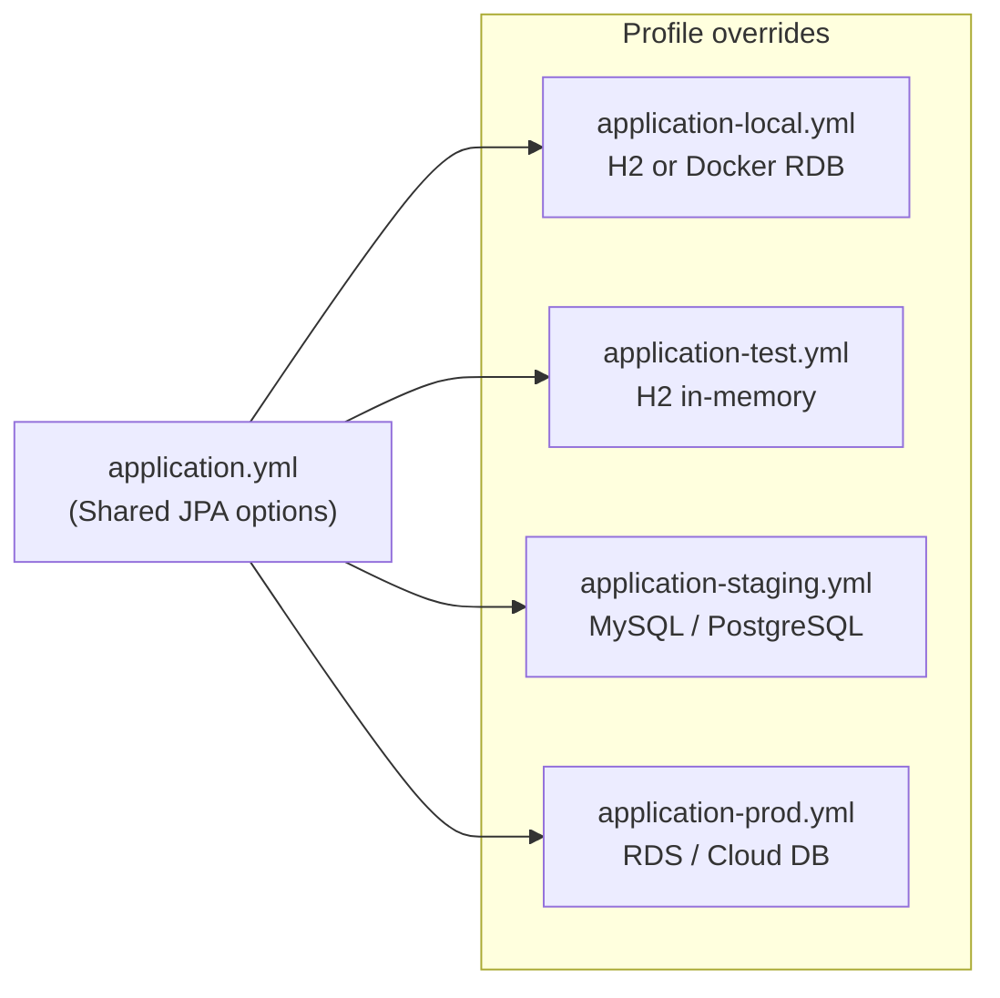
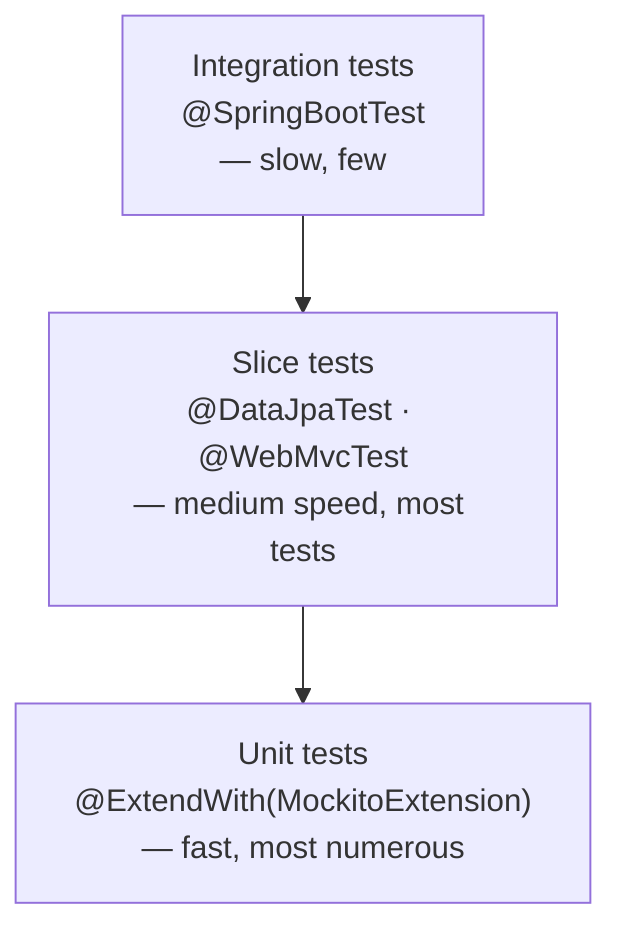

## Introduction

Part 1 covered how to split the Controller · Service · Repository · Domain four-layer architecture. The second most common area where reviewers flag submissions is <strong>Database configuration and testing strategy</strong>. Even when the feature works, points get docked when environment DB settings are not separated, all tests use `@SpringBootTest`, or Mocks are scattered without discipline.

Part 2 covers that second axis. Which DB to use per environment, how to set `ddl-auto` per profile, how to choose test annotations to build fast and reliable tests, and how to use Testcontainers to catch bugs that H2 hides.

The target reader is a junior backend developer who already knows Part 1 or has a working grasp of the four-layer structure. After reading this, you should not hesitate on environment DB configuration or test layer selection.

Read [the previous post](/blog/en/spring-boot-pre-interview-guide-1) first if you haven't covered the four-layer foundation yet.

- Part 1 — [Core Application Layer](/blog/en/spring-boot-pre-interview-guide-1)
- <strong>Part 2 — Database & Testing (this post)</strong>
- Part 3 — [Documentation & AOP](/blog/en/spring-boot-pre-interview-guide-3)
- Part 4 — [Logging](/blog/en/spring-boot-pre-interview-guide-4)
- Part 5 — [Authentication & Validation](/blog/en/spring-boot-pre-interview-guide-5)
- Part 6 — [Performance](/blog/en/spring-boot-pre-interview-guide-6)
- Part 7 — [Production Readiness](/blog/en/spring-boot-pre-interview-guide-7)

---

## TL;DR

- <strong>Environment DB selection and ddl-auto are not global settings</strong> — local uses `create-drop` + H2, test uses `create-drop` + H2, staging uses `validate`, production uses `none` + Flyway/Liquibase. Separate each via `application-{profile}.yml`.
- <strong>Memory Repository ≠ JPA Repository</strong> — Use `AtomicLong` for ID generation and return defensive copies from `findById()` to prevent external modifications from corrupting the store. Pagination must be implemented manually too.
- <strong>Test Pyramid — `@SpringBootTest` is the exception, slice tests are the default</strong> — Repository gets `@DataJpaTest`, Controller gets `@WebMvcTest`, pure units get `@ExtendWith(MockitoExtension.class)`. Reserve `@SpringBootTest` for one or two E2E scenarios.
- <strong>Mock at boundaries only; use Fake or real objects internally</strong> — Mock only things you cannot control (external APIs, time). For Services with heavy Repository dependencies, use a Fake Repository instead. Excessive mocking makes tests verify implementation details rather than behavior.
- <strong>Use Testcontainers when H2 dialect differences would mask a bug</strong> — native queries, DB-specific functions, JSON columns: validate with a real MySQL/PostgreSQL container. For pure CRUD pre-interview tasks, H2 is sufficient.

---

## 1. Database Environment Matrix — Local · Test · Production Split

### 1.1 DB Selection Criteria per Environment

The DB choice and `ddl-auto` policy must differ per environment. Use the table below as the reference.

| Environment | DB Choice | ddl-auto | Profile | Reason |
|-------------|----------|----------|---------|--------|
| Local development | H2 or Docker RDB | `create-drop` (H2) / `update` (RDB) | `local` | Fast iteration, auto schema creation |
| Test | H2 | `create-drop` | `test` | Clean state guaranteed for every test run |
| Staging | Docker RDB (MySQL/PostgreSQL) | `validate` | `staging` | Catch schema mismatches early |
| Production | RDS / Cloud DB | `none` | `prod` | Schema changes through migration tools only |

### 1.2 application.yml Pattern — Base + H2 + Docker RDB

Put shared settings in `application.yml` and override the DB per profile. This is the standard pattern.



**Shared config (application.yml)**

```yaml
spring:
  jpa:
    show-sql: true
    properties:
      hibernate:
        format_sql: true
        default_batch_fetch_size: 100
    open-in-view: false
```

**Local H2 config (application-local.yml)**

```yaml
spring:
  datasource:
    url: jdbc:h2:mem:localdb;DB_CLOSE_DELAY=-1
    driver-class-name: org.h2.Driver
    username: sa
    password:
  h2:
    console:
      enabled: true
      path: /h2-console
  jpa:
    hibernate:
      ddl-auto: create-drop
```

**Test H2 config (application-test.yml)**

```yaml
spring:
  datasource:
    url: jdbc:h2:mem:testdb;DB_CLOSE_DELAY=-1;DB_CLOSE_ON_EXIT=FALSE
    driver-class-name: org.h2.Driver
    username: sa
    password:
  jpa:
    hibernate:
      ddl-auto: create-drop
    show-sql: false
```

**Docker RDB config (application-staging.yml example)**

```yaml
spring:
  datasource:
    url: jdbc:mysql://localhost:3306/app
    driver-class-name: com.mysql.cj.jdbc.Driver
    username: app
    password: secret
  jpa:
    hibernate:
      ddl-auto: validate
```

<details>
<summary><strong>docker-compose.yml (MySQL + PostgreSQL)</strong></summary>

```yaml
services:
  mysql-db:
    container_name: mysql-db
    image: mysql:8.0
    restart: unless-stopped
    environment:
      MYSQL_ROOT_PASSWORD: ${MYSQL_ROOT_PASSWORD:-rootpassword}
      MYSQL_DATABASE: testdb
      MYSQL_USER: ${MYSQL_USER:-user}
      MYSQL_PASSWORD: ${MYSQL_PASSWORD:-password}
      TZ: Asia/Seoul
    ports:
      - "3306:3306"
    volumes:
      - db_data:/var/lib/mysql
    command:
      - --character-set-server=utf8mb4
      - --collation-server=utf8mb4_unicode_ci
    healthcheck:
      test: ["CMD", "mysqladmin", "ping", "-h", "localhost"]
      interval: 10s
      timeout: 5s
      retries: 5

volumes:
  db_data:
```

</details>

### 1.3 ddl-auto and Migration Tools — Production Safety Guide

<strong>ddl-auto</strong> controls what Hibernate does with the schema at application startup.

| Value | Behavior | Environment |
|-------|----------|-------------|
| `create` | Drops and recreates tables at startup (destroys existing data) | Never in production |
| `create-drop` | Creates at startup, drops at shutdown | Local and test |
| `update` | Applies schema changes (cannot drop columns) | Local only, never production |
| `validate` | Validates entity-to-table mapping only | Staging |
| `none` | Does nothing | Production |

The graduation point from `ddl-auto` is clear: <strong>as soon as a team shares a database, use a migration tool.</strong>

| Aspect | Flyway | Liquibase |
|--------|--------|-----------|
| Migration style | SQL file-based | XML/YAML/JSON/SQL |
| File naming | `V1__init.sql`, `V2__add_column.sql` | `changelog.xml` |
| Rollback | Paid version | Free version |
| Learning curve | Low (SQL only) | Medium (abstraction layer) |
| Spring Boot integration | `spring-boot-starter-flyway` | `spring-boot-starter-liquibase` |

> <strong>Note</strong>: For a pre-interview task you don't need to introduce a migration tool. `create-drop` for local/test and `validate` for a Docker RDB is sufficient. However, be ready to explain why `update` must never be used in production.

### 1.4 Aside: Memory Repository Implementation Pitfalls

When the task requires a "pure in-memory store," there are three common traps.

**1. ID generation — use `AtomicLong`**

```java
// Bad — race condition
private long sequence = 0;
product.setId(++sequence);

// Good
private final AtomicLong sequence = new AtomicLong(0);
product.setId(sequence.incrementAndGet());
```

**2. Defensive copy — never expose the stored reference directly**

```java
// Dangerous — external callers can mutate the stored object
return store.get(id);

// Safe — return a copy
return store.get(id).copy();  // or new Product(store.get(id))
```

JPA relies on the persistence context to track changes. A Memory Repository has no such mechanism. Without a defensive copy, tests can corrupt the store's state.

**3. Pagination — must be implemented manually**

```java
public Page<Product> findAll(Pageable pageable) {
    List<Product> all = new ArrayList<>(store.values());
    int start = (int) pageable.getOffset();
    int end = Math.min(start + pageable.getPageSize(), all.size());
    return new PageImpl<>(all.subList(start, end), pageable, all.size());
}
```

| Aspect | Memory Repository | JPA Repository |
|--------|:-----------------:|:--------------:|
| ID auto-generation | `AtomicLong`, manual | `@GeneratedValue` |
| Change tracking | Defensive copy needed | Persistence context |
| Pagination | `PageImpl`, manual | Spring Data provided |

---

## 2. JPA & Querydsl Configuration

### 2.1 Core application.yml Options

These are the JPA options that belong in the shared `application.yml`. Understanding *why* each one is set matters more than memorizing the values.

| Option | Recommended value | Reason |
|--------|------------------|--------|
| `show-sql` | `true` (dev), `false` (prod) | SQL visibility — performance and security concern in production |
| `format_sql` | `true` | Query readability |
| `default_batch_fetch_size` | `100` | Mitigates N+1 by batching fetches into IN queries |
| `open-in-view` | `false` | Disabling OSIV exposes lazy-loading exceptions at the boundary they actually occur |
| Naming strategy | default (snake_case) | Entity field names automatically map to column names |

> <strong>Note</strong>: `open-in-view` defaults to `true`. With `true`, the persistence context stays open for the full HTTP request, making lazy loading freely available — but it holds a DB connection longer. For pre-interview tasks, setting it to `false` and handling all necessary associations with fetch joins inside the Service layer earns better marks.

### 2.2 When to Introduce Querydsl and Q-Class Generation

<strong>Querydsl</strong> is a library that lets you write type-safe JPQL using a builder pattern.

| Criteria | Spring Data JPA methods only | Querydsl needed |
|----------|:----------------------------:|:---------------:|
| 1–2 fixed conditions | ✅ | — |
| 3+ conditions or dynamic | — | ✅ |
| Aggregates, subqueries, multi-join | — | ✅ |
| Dynamic sort or pagination | — | ✅ |

**JPAQueryFactory bean registration (Kotlin)**

```kotlin
@Configuration(proxyBeanMethods = false)
class QuerydslConfig(
    private val entityManager: EntityManager
) {
    @Bean
    fun jpaQueryFactory(): JPAQueryFactory = JPAQueryFactory(entityManager)
}
```

**build.gradle.kts dependencies**

```kotlin
dependencies {
    implementation("com.querydsl:querydsl-jpa:5.0.0:jakarta")
    kapt("com.querydsl:querydsl-apt:5.0.0:jakarta")
}
```

Q-Classes are auto-generated by `kapt` at build time by scanning entity classes. Generated output lands in `build/generated/source/kapt/main` — add this path to `.gitignore`.

### 2.3 Aside: What `@Configuration(proxyBeanMethods = false)` Means

<strong>`proxyBeanMethods = false`</strong> disables CGLIB proxy generation for the configuration class.

By default, Spring's `@Configuration` uses a CGLIB proxy to guarantee singleton semantics when `@Bean` methods call each other. When `@Bean` methods do not call each other, the proxy is unnecessary. Setting `proxyBeanMethods = false`:

- Reduces proxy creation cost, speeding up application startup.
- Reduces memory usage.

Use it on configuration classes that only register beans without inter-method calls. Most of Spring Boot's own auto-configurations already use this flag.

---

## 3. Test Pyramid — Choosing the Right Annotation

### 3.1 Test Pyramid

Tests follow a pyramid structure: more tests at the base (fast, isolated), fewer at the top (slow, broad).



The most common mistake in pre-interview submissions is writing every test with `@SpringBootTest`. It loads the full ApplicationContext — slow and heavy. Use slice tests by default and reserve `@SpringBootTest` for key E2E scenarios.

### 3.2 Annotation Comparison

| Annotation | What loads | Speed | When to use |
|-----------|-----------|-------|-------------|
| `@ExtendWith(MockitoExtension.class)` | Nothing (pure JUnit) | Fastest | Pure logic with no dependencies |
| `@DataJpaTest` | JPA beans only | Fast | Repository query verification |
| `@WebMvcTest` | MVC beans only | Fast | Controller HTTP response verification |
| `@SpringBootTest` | Full context | Slow | E2E, multi-layer integration |

Both `@DataJpaTest` and `@WebMvcTest` apply `@Transactional` by default, rolling back after each test.

### 3.3 Mock vs Fake vs Real Object

<strong>Mock</strong>: an object that intercepts calls and returns pre-configured values. Use at uncontrollable boundaries — external APIs, time, email dispatch.

<strong>Fake</strong>: a real implementation of the interface that operates in memory. Best for Services with heavy Repository dependencies.

<strong>Real object</strong>: validate Repositories with `@DataJpaTest` + real H2 or Testcontainers.

**Anti-pattern: excessive mocking**

```java
// Bad — test only verifies implementation details, not behavior
given(repository.save(any())).willReturn(product);
given(repository.findById(1L)).willReturn(Optional.of(product));

Product saved = service.create(request);
Product found = service.find(1L);

// Always passes because Mock returns the same object we configured
// The actual save/find logic is never exercised
assertThat(found.getId()).isEqualTo(saved.getId());
```

**Fixed with a Fake Repository**

```java
// Good — exercises actual save/find behavior
class ProductServiceTest {
    private ProductService service;
    private FakeProductRepository repository;

    @BeforeEach
    void setUp() {
        repository = new FakeProductRepository();
        service = new ProductService(repository);
    }

    @Test
    void save_and_retrieve_product() {
        CreateProductRequest request = new CreateProductRequest("Product", 1000);

        Long savedId = service.create(request);
        Product found = service.findById(savedId);

        assertThat(found.getName()).isEqualTo("Product");
    }
}
```

| Test target | Recommended approach |
|------------|---------------------|
| Repository | Real DB (`@DataJpaTest` or Testcontainers) |
| Service | Fake Repository or `@SpringBootTest` |
| Controller | Mock Service (`@WebMvcTest`) |
| External API | Mock (WireMock, Mockito) |

---

## 4. Layer-by-Layer Test Patterns

### 4.1 Repository — Query Verification with `@DataJpaTest`

**Java**

```java
@DataJpaTest
class ProductRepositoryTest {

    @Autowired
    private ProductRepository productRepository;

    @Test
    @DisplayName("Product save test")
    void saveProduct() {
        // given
        Product product = new Product("Test Product", 10000);

        // when
        Product saved = productRepository.save(product);

        // then
        assertThat(saved.getId()).isNotNull();
        assertThat(saved.getName()).isEqualTo("Test Product");
    }

    @Test
    @DisplayName("Product find by ID test")
    void findById() {
        // given
        Product product = productRepository.save(new Product("Test Product", 10000));

        // when
        Optional<Product> found = productRepository.findById(product.getId());

        // then
        assertThat(found).isPresent();
        assertThat(found.get().getName()).isEqualTo("Test Product");
    }
}
```

**Kotlin + Kotest FunSpec**

```kotlin
@DataJpaTest
class ProductRepositoryTest(
    private val productRepository: ProductRepository
) : FunSpec({

    test("Save product") {
        val product = Product(name = "Test Product", price = 10000)
        val saved = productRepository.save(product)

        saved.id shouldNotBe null
        saved.name shouldBe "Test Product"
    }
})
```

### 4.2 Service — Mock vs Fake Trade-offs

**Java + Mockito (Mock approach)**

```java
@ExtendWith(MockitoExtension.class)
class ProductServiceTest {

    @Mock
    private ProductRepository productRepository;

    @InjectMocks
    private ProductService productService;

    @Test
    @DisplayName("Product creation test")
    void createProduct() {
        // given
        ProductRequest request = new ProductRequest("Test Product", 10000);
        Product product = new Product(1L, "Test Product", 10000);
        given(productRepository.save(any(Product.class))).willReturn(product);

        // when
        ProductResponse response = productService.create(request);

        // then
        assertThat(response.getName()).isEqualTo("Test Product");
        verify(productRepository, times(1)).save(any(Product.class));
    }
}
```

**Kotlin + MockK BehaviorSpec (Mock approach)**

```kotlin
class ProductServiceTest : BehaviorSpec({

    val productRepository = mockk<ProductRepository>()
    val productService = ProductService(productRepository)

    Given("a product creation request is given") {
        val request = ProductRequest(name = "Test Product", price = 10000)
        val product = Product(id = 1L, name = "Test Product", price = 10000)
        every { productRepository.save(any()) } returns product

        When("creating a product") {
            val response = productService.create(request)

            Then("the product is created successfully") {
                response.name shouldBe "Test Product"
                verify(exactly = 1) { productRepository.save(any()) }
            }
        }
    }
})
```

**Fake Repository pattern — suited for Services with heavy Repository dependencies**

```java
class ProductServiceFakeTest {
    private ProductService service;
    private FakeProductRepository repository;

    @BeforeEach
    void setUp() {
        repository = new FakeProductRepository();
        service = new ProductService(repository);
    }

    @Test
    void save_and_retrieve_product() {
        Long savedId = service.create(new CreateProductRequest("Product", 1000));
        Product found = service.findById(savedId);
        assertThat(found.getName()).isEqualTo("Product");
    }
}
```

A Fake Repository implements the `ProductRepository` interface using an in-memory store. Unlike a Mock, actual save and retrieve operations occur — so "save then find" scenarios are validated naturally.

### 4.3 Controller — `@WebMvcTest` + MockMvc

**Java**

```java
@WebMvcTest(ProductController.class)
class ProductControllerTest {

    @Autowired
    private MockMvc mockMvc;

    @MockBean
    private ProductService productService;

    @Autowired
    private ObjectMapper objectMapper;

    @Test
    @DisplayName("Product creation API test")
    void createProduct() throws Exception {
        // given
        ProductRequest request = new ProductRequest("Test Product", 10000);
        ProductResponse response = new ProductResponse(1L, "Test Product", 10000);
        given(productService.create(any())).willReturn(response);

        // when & then
        mockMvc.perform(post("/api/products")
                .contentType(MediaType.APPLICATION_JSON)
                .content(objectMapper.writeValueAsString(request)))
            .andExpect(status().isCreated())
            .andExpect(jsonPath("$.id").value(1))
            .andExpect(jsonPath("$.name").value("Test Product"));
    }
}
```

**Kotlin + Kotest DescribeSpec**

```kotlin
@WebMvcTest(ProductController::class)
class ProductControllerKotestTest(
    private val mockMvc: MockMvc,
    @MockkBean private val productService: ProductService
) : DescribeSpec({

    val objectMapper = ObjectMapper().registerModule(JavaTimeModule())

    describe("POST /api/v1/products") {
        context("when a valid request is given") {
            it("returns 201 Created with the created product ID") {
                val request = RegisterProductRequest(name = "Test Product", price = 10000)
                every { productService.registerProduct(any()) } returns 1L

                mockMvc.perform(
                    post("/api/v1/products")
                        .contentType(MediaType.APPLICATION_JSON)
                        .content(objectMapper.writeValueAsString(request))
                )
                    .andExpect(status().isCreated)
                    .andExpect(jsonPath("$.data").value(1))
            }
        }

        context("when the product name is empty") {
            it("returns 400 Bad Request") {
                val invalidRequest = mapOf("name" to "", "price" to 10000)

                mockMvc.perform(
                    post("/api/v1/products")
                        .contentType(MediaType.APPLICATION_JSON)
                        .content(objectMapper.writeValueAsString(invalidRequest))
                )
                    .andExpect(status().isBadRequest)
            }
        }
    }
})
```

> <strong>Note</strong>: To use `@MockkBean` in Kotlin MockMvc tests, the `spring-mockk` dependency is required.
>
> ```kotlin
> // build.gradle.kts
> testImplementation("com.ninja-squad:springmockk:4.0.2")
> ```

### 4.4 Aside: Kotlin + Kotest BDD Style — Choosing a Spec

<strong>Kotest</strong> is Kotlin's test framework. Unlike JUnit, it offers multiple Spec styles.

| Spec | Style | Best for |
|------|-------|----------|
| `FunSpec` | `test("name") { }` | Simple unit tests (Repository) |
| `BehaviorSpec` | Given-When-Then | Scenario-based tests (Service) |
| `DescribeSpec` | describe-context-it | Grouped API endpoint tests (Controller) |
| `StringSpec` | `"name" { }` | Very simple tests |

The right time to introduce Kotest in a Kotlin project is when <strong>expressive BDD-style grouping is needed</strong>. Both `@DataJpaTest` and `@WebMvcTest` integrate cleanly with Kotest Specs.

---

## 5. Testcontainers — Verifying Against the Real Database

### 5.1 H2's Limits — Bugs Hidden by MySQL/PostgreSQL Dialect Differences

H2 is fast and requires no setup, but it is not identical to MySQL or PostgreSQL. In these situations, H2 tests pass while production breaks.

| Situation | Example |
|-----------|---------|
| Native queries | `SELECT * FROM product USE INDEX (idx_name)` — silently ignored in H2 |
| DB-specific functions | `DATE_FORMAT()`, `JSON_EXTRACT()` — not supported in H2 |
| Full-text search | `MATCH AGAINST` — not supported in H2 |
| `ON DUPLICATE KEY UPDATE` | MySQL-only syntax |
| Index hints / query plans | H2 produces a different execution plan |

### 5.2 Testcontainers Setup

**Dependencies (build.gradle)**

```groovy
dependencies {
    testImplementation 'org.testcontainers:testcontainers:1.19.0'
    testImplementation 'org.testcontainers:mysql:1.19.0'
    testImplementation 'org.testcontainers:junit-jupiter:1.19.0'
}
```

**Test class configuration**

```java
@SpringBootTest
@Testcontainers
class ProductIntegrationTest {

    @Container
    static MySQLContainer<?> mysql = new MySQLContainer<>("mysql:8.0")
        .withDatabaseName("testdb")
        .withUsername("test")
        .withPassword("test");

    @DynamicPropertySource
    static void configureProperties(DynamicPropertyRegistry registry) {
        registry.add("spring.datasource.url", mysql::getJdbcUrl);
        registry.add("spring.datasource.username", mysql::getUsername);
        registry.add("spring.datasource.password", mysql::getPassword);
    }

    @Test
    void native_query_verification() {
        // Test queries that only work correctly on real MySQL
    }
}
```

### 5.3 When to Apply — Always vs Critical Paths Only

Testcontainers is much slower than slice tests due to container startup time. Use these criteria to scope adoption.

| Criteria | H2 sufficient | Testcontainers needed |
|----------|:-------------:|:---------------------:|
| CRUD, simple JPQL | ✅ | — |
| Native queries, DB-specific functions | — | ✅ |
| JSON columns, full-text search | — | ✅ |
| Production-equivalent query plan | — | ✅ |
| Pre-interview CRUD task | ✅ | — |

> <strong>Note</strong>: Testcontainers requires Docker on the CI runner. On GitHub Actions, `ubuntu-latest` runners include Docker by default — no additional configuration needed.

---

## Recap

- <strong>Separate DB and ddl-auto per environment</strong> — use `application-{profile}.yml` to give each environment its own DB and ddl-auto policy. `create` and `update` in production are never acceptable.
- <strong>Memory Repository must mimic JPA</strong> — `AtomicLong` for ID generation, defensive copies on return, and manual `PageImpl` for pagination. Skip any of these and tests will silently corrupt state or fail to mirror JPA behavior.
- <strong>The Test Pyramid keeps the suite fast and maintainable</strong> — `@DataJpaTest` for Repositories, `@WebMvcTest` for Controllers, `@ExtendWith(MockitoExtension.class)` for pure logic. Limit `@SpringBootTest` to one or two E2E scenarios.
- <strong>Mock at boundaries; use Fake for internal Repository dependencies</strong> — Mock only what you cannot control. For Services with Repository-heavy flows, a Fake Repository exercises actual save/find behavior.
- <strong>Testcontainers catches what H2 hides</strong> — wire in a real MySQL/PostgreSQL container via `@DynamicPropertySource` whenever native queries or DB-specific features are in play.

Part 3 covers API documentation (Swagger/OpenAPI), cross-cutting concern handling with AOP, and logging infrastructure. You'll see why Swagger is more than just annotating endpoints, and how `@Around` AOP cleanly separates logging and performance measurement from business logic.

[Previous: Part 1 - Core Application Layer](/blog/en/spring-boot-pre-interview-guide-1) | [Next: Part 3 - Documentation & AOP](/blog/en/spring-boot-pre-interview-guide-3)

---

## Appendix

### Meaningful Tests vs Meaningless Tests

Tests are better than no tests, but meaningless tests raise maintenance cost without benefit.

| Category | Example | Reason |
|----------|---------|--------|
| Meaningless | Assert getter/setter round-trip | The compiler already guarantees this |
| Meaningless | `new Product("test", 1000)` then check `getName()` | No logic involved |
| Meaningful | Exception thrown when stock is insufficient | Verifies a business rule |
| Meaningful | Unique constraint violation on duplicate name | Verifies a DB constraint |

```java
// Bad — meaningless test
@Test
void getterTest() {
    Product p = new Product("test", 1000);
    assertThat(p.getName()).isEqualTo("test");
}

// Good — meaningful test
@Test
void throws_when_stock_is_insufficient() {
    Product product = new Product("test", 1000, 5);
    assertThrows(InsufficientStockException.class,
        () -> product.decreaseStock(10));
}
```

### Coverage Guide

<details>
<summary><strong>More detail — coverage targets and pre-interview priorities</strong></summary>

Coverage targets vary by team and project. General benchmarks:

| Layer | Typical target | Notes |
|-------|---------------|-------|
| Service (business logic) | 80–90% | Core logic must be covered |
| Repository | Complex queries only | Simple CRUD is optional |
| Controller | Key scenarios | Happy path + main exceptions |
| Config / Util | Optional | Only if complex logic present |
| Overall | 60–80% | Depends on team agreement |

For a time-constrained pre-interview task, follow this priority order:

1. <strong>Required</strong>: Core business logic in the Service layer (including exception paths)
2. <strong>Recommended</strong>: Complex Querydsl queries, exception handling
3. <strong>Optional</strong>: Controller tests, simple CRUD Repository tests

</details>
