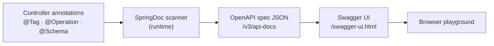
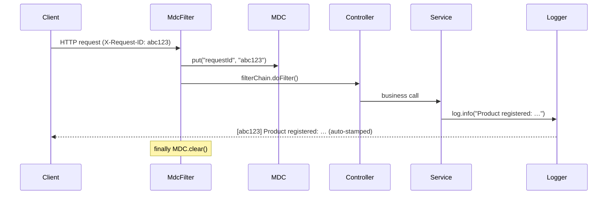
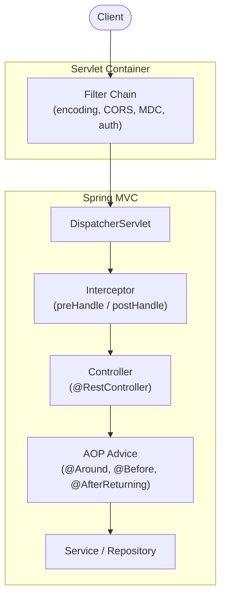

## Introduction

Documentation, logging, and AOP are where pre-interview submissions visibly diverge. A working Swagger UI, request IDs in every log line, and AOP-separated cross-cutting concerns signal operational awareness. Stale Springfox dependencies, blanket-INFO logging, or AOP misused for business branching signal the opposite.

Parts 1 and 2 covered the four-layer architecture and database/testing strategy. Part 3 covers the observability and operational layer on top — the signals that tell an evaluator "this developer understands production."

Target reader: a junior backend developer who knows Spring but isn't sure how evaluators read this area.

See the [previous post](/blog/en/spring-boot-pre-interview-guide-2) for Database & Testing.

- Part 1 — [Core Application Layer](/blog/en/spring-boot-pre-interview-guide-1)
- Part 2 — [Database & Testing](/blog/en/spring-boot-pre-interview-guide-2)
- <strong>Part 3 — Documentation & AOP (this post)</strong>
- Part 4 — [Logging](/blog/en/spring-boot-pre-interview-guide-4)
- Part 5 — [Authentication & Validation](/blog/en/spring-boot-pre-interview-guide-5)
- Part 6 — [Performance](/blog/en/spring-boot-pre-interview-guide-6)
- Part 7 — [Production Readiness](/blog/en/spring-boot-pre-interview-guide-7)

---

## TL;DR

- <strong>Minimal SpringDoc is enough to score</strong> — `@Tag`, `@Operation(summary)`, and key `@ApiResponse` annotations cover the evaluator's needs. Filling every field with `@Schema` wastes task time.
- <strong>Drop the logging-performance myths</strong> — `{}` placeholders are the default. `isDebugEnabled()` guards are only needed around expensive `toString()` calls or logging inside loops.
- <strong>MDC handles single-app request tracing</strong> — drop a request ID into thread-local and Logback's `%X{key}` pattern stamps it on every log line automatically. Distributed tracing is out of scope for pre-interview tasks.
- <strong>AOP belongs on cross-cutting concerns only</strong> — logging, transactions, and retry are correct targets. Using AOP for business branching makes the code untraceable.
- <strong>Know the self-invocation trap</strong> — calling a `@Retry` method from within the same class bypasses the proxy, so the advice never fires. The fix is to move the dependency to a separate bean.

---

## 1. API Documentation — SpringDoc/Swagger

### 1.1 How SpringDoc Works and Basic Setup

<strong>SpringDoc OpenAPI scans annotations at startup, builds an OpenAPI JSON spec, and serves it so Swagger UI can render a live playground.</strong>

At runtime, SpringDoc scans `@Tag`, `@Operation`, and `@Schema`, produces the spec at `/v3/api-docs` (or a custom path), and Swagger UI at `/swagger-ui.html` consumes that JSON to render the interactive UI.



> <strong>Note</strong>: Springfox has compatibility issues with Spring Boot 2.6+ and is no longer maintained. SpringDoc OpenAPI is the current standard.

<strong>Versions — pick the SpringDoc line that matches your Spring Boot</strong>

SpringDoc ships separate lines per Spring Boot major. Check the Spring Boot version your task is built on first, then pick the matching SpringDoc line.

| Spring Boot | SpringDoc line | Latest (May 2026) | Notes |
|-------------|----------------|-------------------|-------|
| 4.x | `3.x` | <strong>3.0.3</strong> | Java 17+, Jakarta EE 9, OpenAPI 3.1 support |
| 3.x (LTS) | `2.x` | <strong>2.8.17</strong> | BOM available since 2.8.7, still actively maintained |
| 2.x | `1.x` | 1.8.0 | Legacy — unlikely on a new task |

**Dependency (Kotlin DSL)**

```kotlin
// build.gradle.kts
dependencies {
    // Spring Boot 4.x
    implementation("org.springdoc:springdoc-openapi-starter-webmvc-ui:3.0.3")

    // Spring Boot 3.x (LTS) — when the codebase is pinned to LTS
    // implementation("org.springdoc:springdoc-openapi-starter-webmvc-ui:2.8.17")
}
```

<details>
<summary><strong>More detail — Groovy DSL dependency</strong></summary>

```groovy
// build.gradle
dependencies {
    // Spring Boot 4.x
    implementation 'org.springdoc:springdoc-openapi-starter-webmvc-ui:3.0.3'

    // Spring Boot 3.x (LTS)
    // implementation 'org.springdoc:springdoc-openapi-starter-webmvc-ui:2.8.17'
}
```

</details>

> <strong>Note</strong>: For WebFlux, swap in `springdoc-openapi-starter-webflux-ui`. Only the artifact name changes — same line, same version.

**Core application.yml options**

| Setting | Description | Default |
|---------|-------------|---------|
| `api-docs.path` | OpenAPI JSON spec path | `/v3/api-docs` |
| `swagger-ui.path` | Swagger UI path | `/swagger-ui.html` |
| `tags-sorter` | Controller sort (`alpha`, declaration order) | Declaration order |
| `operations-sorter` | API sort (`alpha`, `method`) | Declaration order |

```yaml
springdoc:
  api-docs:
    path: /api-docs
  swagger-ui:
    path: /swagger-ui.html
    tags-sorter: alpha
    operations-sorter: alpha
  default-consumes-media-type: application/json
  default-produces-media-type: application/json
```

**OpenApiConfig (Kotlin)**

```kotlin
@Configuration
class OpenApiConfig {

    @Bean
    fun openAPI(): OpenAPI {
        return OpenAPI()
            .info(
                Info()
                    .title("Product API")
                    .description("Product Management API Documentation")
                    .version("v1.0.0")
                    .contact(Contact().name("Developer").email("dev@example.com"))
            )
            .servers(listOf(Server().url("http://localhost:8080").description("Local Server")))
    }
}
```

<details>
<summary><strong>More detail — OpenApiConfig (Java)</strong></summary>

```java
@Configuration
public class OpenApiConfig {

    @Bean
    public OpenAPI openAPI() {
        return new OpenAPI()
            .info(new Info()
                .title("Product API")
                .description("Product Management API Documentation")
                .version("v1.0.0")
                .contact(new Contact().name("Developer").email("dev@example.com")))
            .servers(List.of(
                new Server().url("http://localhost:8080").description("Local Server")
            ));
    }
}
```

</details>

### 1.2 Controller and DTO Annotations — Minimal vs Excessive

<strong>Verdict: `@Tag`, `@Operation(summary)`, and key `@ApiResponse` annotations are sufficient for evaluation.</strong> Every minute spent filling out `@Schema` on every field is a minute not spent on core feature completeness.

| Area | Minimal (recommended) | Excessive (not recommended) |
|------|-----------------------|----------------------------|
| API description | `@Operation(summary = "…")` | `description`, every error case in `@ApiResponse` |
| Parameters | `@Parameter` on path variables only | Full description on every query param |
| DTO fields | Class-level `@Schema(description)` | Per-field `@Schema(example, minimum, maxLength)` |

**Controller example (Kotlin)**

```kotlin
@Tag(name = "Product", description = "Product Management API")
@RestController
@RequestMapping("/api/v1/products")
class ProductController(private val productService: ProductService) {

    @Operation(summary = "Get product details")
    @ApiResponses(
        ApiResponse(responseCode = "200", description = "Successfully retrieved"),
        ApiResponse(responseCode = "404", description = "Product not found")
    )
    @GetMapping("/{productId}")
    fun findProductDetail(
        @Parameter(description = "Product ID", example = "1")
        @PathVariable productId: Long
    ): CommonResponse<FindProductDetailResponse> {
        return CommonResponse.success(productService.findProductDetail(productId))
    }

    @Operation(summary = "Register product")
    @ApiResponses(
        ApiResponse(responseCode = "201", description = "Successfully registered"),
        ApiResponse(responseCode = "400", description = "Bad request")
    )
    @PostMapping
    @ResponseStatus(HttpStatus.CREATED)
    fun registerProduct(@RequestBody request: RegisterProductRequest): CommonResponse<Long> {
        return CommonResponse.success(productService.registerProduct(request))
    }
}
```

<details>
<summary><strong>More detail — Controller example (Java)</strong></summary>

```java
@Tag(name = "Product", description = "Product Management API")
@RestController
@RequestMapping("/api/v1/products")
@RequiredArgsConstructor
public class ProductController {

    private final ProductService productService;

    @Operation(summary = "Get product details")
    @ApiResponses({
        @ApiResponse(responseCode = "200", description = "Successfully retrieved"),
        @ApiResponse(responseCode = "404", description = "Product not found")
    })
    @GetMapping("/{productId}")
    public CommonResponse<FindProductDetailResponse> findProductDetail(
            @Parameter(description = "Product ID", example = "1")
            @PathVariable Long productId) {
        return CommonResponse.success(productService.findProductDetail(productId));
    }

    @Operation(summary = "Register product")
    @ApiResponses({
        @ApiResponse(responseCode = "201", description = "Successfully registered"),
        @ApiResponse(responseCode = "400", description = "Bad request")
    })
    @PostMapping
    @ResponseStatus(HttpStatus.CREATED)
    public CommonResponse<Long> registerProduct(@RequestBody RegisterProductRequest request) {
        return CommonResponse.success(productService.registerProduct(request));
    }
}
```

</details>

**Price field type tradeoffs**

| Type | Pros | Cons | Use when |
|------|------|------|----------|
| `Int`/`Long` | Simple, fast | No decimals, overflow risk | Counts, IDs |
| `BigDecimal` | Precision guaranteed, decimal support | Verbose operations, serialization care | Prices, amounts, ratios |

```kotlin
@Schema(description = "Product registration request")
data class RegisterProductRequest(
    @field:NotBlank
    @field:Size(max = 100)
    @Schema(description = "Product name", example = "Fresh Apple")
    val name: String?,

    @field:NotNull
    @field:DecimalMin(value = "0", inclusive = false)
    @Schema(description = "Price", example = "10000.00")
    val price: BigDecimal?,

    @field:NotNull
    @Schema(description = "Category", example = "FOOD")
    val category: ProductCategoryType?
)
```

### 1.3 Allowing Swagger Paths in Spring Security

When `SecurityConfig` is present, `/swagger-ui/**` and `/v3/api-docs/**` return 401/403. If the evaluator cannot reach Swagger UI, the documentation work is invisible.

```kotlin
@Configuration
@EnableWebSecurity
class SecurityConfig {

    @Bean
    fun securityFilterChain(http: HttpSecurity): SecurityFilterChain {
        return http
            .csrf { it.disable() }
            .authorizeHttpRequests { auth ->
                auth
                    .requestMatchers(
                        "/swagger-ui/**",
                        "/swagger-ui.html",
                        "/api-docs/**",
                        "/v3/api-docs/**"
                    ).permitAll()
                    .anyRequest().authenticated()
            }
            .build()
    }
}
```

<details>
<summary><strong>More detail — Adding bearerAuth scheme for JWT environments</strong></summary>

In a JWT-secured app, add a `bearerAuth` security scheme so the evaluator can paste a token directly in Swagger UI.

```kotlin
@Configuration
class OpenApiConfig {

    @Bean
    fun openAPI(): OpenAPI {
        val securityScheme = SecurityScheme()
            .type(SecurityScheme.Type.HTTP)
            .scheme("bearer")
            .bearerFormat("JWT")
            .`in`(SecurityScheme.In.HEADER)
            .name("Authorization")

        val securityRequirement = SecurityRequirement().addList("bearerAuth")

        return OpenAPI()
            .info(Info().title("Product API").version("v1.0.0"))
            .addSecurityItem(securityRequirement)
            .components(Components().addSecuritySchemes("bearerAuth", securityScheme))
    }
}
```

</details>

### 1.4 Aside: SpringDoc vs REST Docs — Decision Criteria

<strong>For a pre-interview task, SpringDoc is the right call.</strong> Setup is minimal and the Try it out feature lets the evaluator test APIs immediately without curl.

REST Docs generates documentation only when tests pass, enforcing code-doc synchronization. That guarantee matters in financial and public-sector APIs where accuracy is the core requirement.

| Criterion | SpringDoc (Swagger) | REST Docs |
|-----------|---------------------|-----------|
| Doc generation | Annotation-based | Test-based |
| Code-doc sync | Manual | Enforced by failing tests |
| Runtime dependency | Yes (ships in production) | No (build-time only) |
| Try it out | Built-in | Requires separate setup |
| Learning curve | Low | High |
| Production code intrusion | Annotations required | None (test code only) |

<details>
<summary><strong>More detail — REST Docs dependencies, test code, and AsciiDoc template</strong></summary>

**Dependencies (build.gradle.kts)**

```kotlin
plugins {
    id("org.asciidoctor.jvm.convert") version "4.0.5"
}

val asciidoctorExt: Configuration by configurations.creating
val snippetsDir by extra { file("build/generated-snippets") }

dependencies {
    asciidoctorExt("org.springframework.restdocs:spring-restdocs-asciidoctor")
    testImplementation("org.springframework.restdocs:spring-restdocs-mockmvc")
}

tasks.test { outputs.dir(snippetsDir) }

tasks.asciidoctor {
    inputs.dir(snippetsDir)
    configurations(asciidoctorExt.name)
    dependsOn(tasks.test)
}

tasks.register<Copy>("copyDocument") {
    dependsOn(tasks.asciidoctor)
    from(file("build/docs/asciidoc"))
    into(file("src/main/resources/static/docs"))
}

tasks.build { dependsOn("copyDocument") }
```

**Test code (Kotlin)**

```kotlin
@WebMvcTest(ProductController::class)
@AutoConfigureRestDocs
class ProductControllerDocsTest {

    @Autowired private lateinit var mockMvc: MockMvc
    @MockkBean private lateinit var productService: ProductService

    @Test
    @DisplayName("Get product detail API")
    fun findProductDetail() {
        val response = FindProductDetailResponse(1L, "Fresh Apple", 10000, ProductCategoryType.FOOD, true, LocalDateTime.now())
        every { productService.findProductDetail(1L) } returns response

        mockMvc.perform(get("/api/v1/products/{productId}", 1L).accept(MediaType.APPLICATION_JSON))
            .andExpect(status().isOk)
            .andDo(document("product-detail",
                pathParameters(parameterWithName("productId").description("Product ID")),
                responseFields(
                    fieldWithPath("code").description("Response code"),
                    fieldWithPath("message").description("Response message"),
                    fieldWithPath("data.id").description("Product ID"),
                    fieldWithPath("data.name").description("Product name"),
                    fieldWithPath("data.price").description("Price"),
                    fieldWithPath("data.category").description("Category"),
                    fieldWithPath("data.enabled").description("Enabled status"),
                    fieldWithPath("data.createdAt").description("Created at")
                )
            ))
    }
}
```

**AsciiDoc template (src/docs/asciidoc/index.adoc)**

```asciidoc
= Product API Documentation
:doctype: book
:icons: font
:source-highlighter: highlightjs
:toc: left
:toclevels: 2

== Product API

=== Get Product Details

operation::product-detail[snippets='path-parameters,response-fields,curl-request,http-response']
```

</details>

---

## 2. Logging Strategy — SLF4J · MDC · Masking

### 2.1 Logback Configuration and Profile Splitting

<strong>Spring Boot's default logging implementation is Logback — it ships with `spring-boot-starter`, no extra dependency needed.</strong>

For quick setup, configure levels and pattern in `application.yml`. Add `logback-spring.xml` when you need profile branching and rolling file policies.

```yaml
# application.yml — basic logging
logging:
  level:
    root: INFO
    com.example.app: DEBUG
    org.hibernate.SQL: DEBUG
    org.hibernate.orm.jdbc.bind: TRACE
  pattern:
    console: "%d{yyyy-MM-dd HH:mm:ss.SSS} [%thread] [%X{requestId}] %-5level %logger{36} - %msg%n"
```

```xml
<?xml version="1.0" encoding="UTF-8"?>
<configuration>
    <springProfile name="local">
        <property name="LOG_LEVEL" value="DEBUG"/>
    </springProfile>
    <springProfile name="prod">
        <property name="LOG_LEVEL" value="INFO"/>
    </springProfile>

    <appender name="CONSOLE" class="ch.qos.logback.core.ConsoleAppender">
        <encoder>
            <pattern>%d{yyyy-MM-dd HH:mm:ss.SSS} [%thread] [%X{requestId}] %-5level %logger{36} - %msg%n</pattern>
        </encoder>
    </appender>

    <appender name="FILE" class="ch.qos.logback.core.rolling.RollingFileAppender">
        <file>logs/application.log</file>
        <rollingPolicy class="ch.qos.logback.core.rolling.TimeBasedRollingPolicy">
            <fileNamePattern>logs/application.%d{yyyy-MM-dd}.%i.log</fileNamePattern>
            <timeBasedFileNamingAndTriggeringPolicy class="ch.qos.logback.core.rolling.SizeAndTimeBasedFNATP">
                <maxFileSize>100MB</maxFileSize>
            </timeBasedFileNamingAndTriggeringPolicy>
            <maxHistory>30</maxHistory>
        </rollingPolicy>
        <encoder>
            <pattern>%d{yyyy-MM-dd HH:mm:ss.SSS} [%thread] [%X{requestId}] %-5level %logger{36} - %msg%n</pattern>
        </encoder>
    </appender>

    <root level="${LOG_LEVEL:-INFO}">
        <appender-ref ref="CONSOLE"/>
        <appender-ref ref="FILE"/>
    </root>

    <logger name="com.example.app" level="DEBUG"/>
    <logger name="org.hibernate.SQL" level="DEBUG"/>
</configuration>
```

<strong>Structured JSON logs — native support since Spring Boot 3.4</strong>

In production, anything feeding ELK/Loki/etc. wants JSON-formatted logs. Previously you wired in `logstash-logback-encoder` (or a similar encoder) inside `logback-spring.xml`. Since Spring Boot 3.4 you can flip it on with a single property — no extra dependency. Spring Boot 4.0 expanded the format options further.

```yaml
logging:
  structured:
    format:
      console: logstash   # also: ecs, gelf — pick what your collector expects
```

You don't need this for the task itself, but mentioning in the README that you considered the log-collection pipeline scores easy bonus points.

### 2.2 Log Level Selection

<strong>One-line rule: INFO for business events, DEBUG for debugging detail, ERROR only for things that need immediate action.</strong>

| Level | Purpose | Examples |
|-------|---------|---------|
| <strong>ERROR</strong> | Needs immediate response | DB connection failure, external API outage |
| <strong>WARN</strong> | Potential issue, monitor | Retry triggered, threshold approaching |
| <strong>INFO</strong> | Key business events | Order placed, payment succeeded |
| <strong>DEBUG</strong> | Development/debugging detail | Method entry, parameter values |
| <strong>TRACE</strong> | Very fine-grained detail | Per-iteration values inside loops |

```kotlin
import org.springframework.data.repository.findByIdOrNull

@Service
class ProductService(private val productRepository: ProductRepository) {
    private val log = LoggerFactory.getLogger(javaClass)

    @Transactional
    fun registerProduct(command: RegisterProductCommand): Long {
        log.debug("Register product request: name={}, price={}", command.name, command.price)

        val saved = productRepository.save(Product(command.name, command.price, command.category))
        log.info("Product registered: productId={}", saved.id)

        return saved.id!!
    }

    fun findProductDetail(productId: Long): FindProductDetailResponse {
        log.debug("Find product: productId={}", productId)

        val product = productRepository.findByIdOrNull(productId)
            ?: run {
                log.warn("Product not found: productId={}", productId)
                throw NotFoundException()
            }

        return FindProductDetailResponse.from(product)
    }
}
```

> <strong>Note</strong>: `JpaRepository.findById(id)` returns `Optional<T>`, so `?: run { … }` won't fire. Spring Data ships a Kotlin extension `findByIdOrNull(id)` that returns `T?`, which composes naturally with the elvis operator (`?:`). If you'd rather keep the `Optional`, use `.orElseThrow { … }` like the Java example.

<details>
<summary><strong>More detail — ProductService logging example (Java)</strong></summary>

```java
@Slf4j
@Service
@RequiredArgsConstructor
public class ProductService {

    private final ProductRepository productRepository;

    @Transactional
    public Long registerProduct(RegisterProductCommand command) {
        log.debug("Register product request: name={}, price={}", command.name(), command.price());

        Product saved = productRepository.save(
            new Product(command.name(), command.price(), command.category()));
        log.info("Product registered: productId={}", saved.getId());

        return saved.getId();
    }

    public FindProductDetailResponse findProductDetail(Long productId) {
        log.debug("Find product: productId={}", productId);

        Product product = productRepository.findById(productId)
            .orElseThrow(() -> {
                log.warn("Product not found: productId={}", productId);
                return new NotFoundException();
            });

        return FindProductDetailResponse.from(product);
    }
}
```

</details>

### 2.3 MDC for Request Tracing

<strong>MDC (Mapped Diagnostic Context) = store key-value pairs in thread-local storage; Logback's `%X{key}` pattern then stamps them on every log line automatically.</strong>

Assign a unique request ID per request, and you can grep all logs for a single request in one pass.



```kotlin
@Component
@Order(Ordered.HIGHEST_PRECEDENCE)
class MdcFilter : OncePerRequestFilter() {

    companion object {
        const val REQUEST_ID = "requestId"
    }

    override fun doFilterInternal(
        request: HttpServletRequest,
        response: HttpServletResponse,
        filterChain: FilterChain
    ) {
        val requestId = request.getHeader("X-Request-ID")
            ?: UUID.randomUUID().toString().substring(0, 8)

        try {
            MDC.put(REQUEST_ID, requestId)
            response.setHeader("X-Request-ID", requestId)
            filterChain.doFilter(request, response)
        } finally {
            MDC.clear()
        }
    }
}
```

<details>
<summary><strong>More detail — MdcFilter (Java)</strong></summary>

```java
@Component
@Order(Ordered.HIGHEST_PRECEDENCE)
public class MdcFilter extends OncePerRequestFilter {

    public static final String REQUEST_ID = "requestId";

    @Override
    protected void doFilterInternal(
            HttpServletRequest request,
            HttpServletResponse response,
            FilterChain filterChain) throws ServletException, IOException {

        String requestId = request.getHeader("X-Request-ID");
        if (requestId == null || requestId.isBlank()) {
            requestId = UUID.randomUUID().toString().substring(0, 8);
        }

        try {
            MDC.put(REQUEST_ID, requestId);
            response.setHeader("X-Request-ID", requestId);
            filterChain.doFilter(request, response);
        } finally {
            MDC.clear();
        }
    }
}
```

</details>

> <strong>Note</strong>: MDC handles tracing within a single application. Cross-service distributed tracing (Zipkin, Jaeger, AWS X-Ray) requires infrastructure setup and is out of scope for pre-interview tasks.

### 2.4 Sensitive Data Masking

<strong>Rule: mask only at log output time. Business logic always operates on the original data.</strong>

```kotlin
object MaskingUtils {

    fun maskEmail(email: String?): String {
        if (email.isNullOrBlank()) return "***"
        val atIndex = email.indexOf('@')
        if (atIndex <= 1) return "***"
        return email.substring(0, 2) + "***" + email.substring(atIndex)
    }

    fun maskPhone(phone: String?): String {
        if (phone.isNullOrBlank() || phone.length < 4) return "***"
        return phone.substring(0, 3) + "****" + phone.takeLast(4)
    }

    fun maskCardNumber(cardNumber: String?): String {
        if (cardNumber.isNullOrBlank() || cardNumber.length < 4) return "***"
        return "*".repeat(cardNumber.length - 4) + cardNumber.takeLast(4)
    }
}
```

```kotlin
// Usage
fun findMemberDetail(memberId: Long): MemberDetailResponse {
    val member = memberRepository.findById(memberId)
        .orElseThrow { NotFoundException("Member not found") }

    log.info(
        "Member lookup complete: memberId={}, email={}, phone={}",
        member.id,
        MaskingUtils.maskEmail(member.email),   // ho***@example.com
        MaskingUtils.maskPhone(member.phone)    // 010****1234
    )

    return MemberDetailResponse.from(member)
}
```

### 2.5 Aside: Logging Performance Myths

**Myth 1 — String concatenation equals `{}` placeholders**

```kotlin
// Anti-pattern — concatenation runs even when DEBUG is off
log.debug("User " + userId + " requested " + itemCount + " items")

// Correct — concatenation is skipped when DEBUG is disabled
log.debug("User {} requested {} items", userId, itemCount)
```

**Myth 2 — `isDebugEnabled()` guards are always needed**

Guards are only necessary in two situations.

```kotlin
// Case 1 — expensive toString()
if (log.isDebugEnabled) {
    log.debug("Request details: {}", expensiveJsonSerialization(request))
}

// Case 2 — logging inside a loop
items.forEach { item ->
    if (log.isDebugEnabled) {
        log.debug("Processing item: {}", item.toDetailString())
    }
}

// Unnecessary — {} defers evaluation already
if (log.isDebugEnabled) {
    log.debug("User {} logged in", userId)  // guard adds no value here
}
```

---

## 3. AOP — Separating Cross-Cutting Concerns

### 3.1 Filter vs Interceptor vs AOP — Decision Criteria

<strong>All three handle cross-cutting logic, but their application boundaries differ.</strong> Putting logic in the wrong layer creates dependency leaks or loses access to Spring context.



| Type | Scope | Fires when | Typical use |
|------|-------|-----------|-------------|
| <strong>Filter</strong> | Servlet | Before/after DispatcherServlet | Encoding, CORS, MDC, token parsing |
| <strong>Interceptor</strong> | Spring MVC | Before/after Controller | Auth checks, common response headers |
| <strong>AOP</strong> | Spring Bean | Before/after method | Transactions, execution timing, retry |

Decision rules in one line each:
- Dealing with the raw HTTP request/response → Filter
- Pre/post processing around the Controller → Interceptor
- Logic inside Service or Repository → AOP

### 3.2 Request/Response Logging Aspect

MDC already stamps the request ID, so `RequestLoggingAspect` only needs to capture method name, URI, and duration on a single line. `[REQUEST]`/`[RESPONSE]`/`[ERROR]` prefixes make grep straightforward.

```kotlin
@Aspect
@Component
class RequestLoggingAspect {

    private val log = LoggerFactory.getLogger(javaClass)
    private val objectMapper = ObjectMapper().apply {
        registerModule(JavaTimeModule())
        configure(SerializationFeature.FAIL_ON_EMPTY_BEANS, false)
    }

    @Pointcut("within(@org.springframework.web.bind.annotation.RestController *)")
    fun restController() {}

    @Around("restController()")
    fun logAround(joinPoint: ProceedingJoinPoint): Any? {
        val request = (RequestContextHolder.getRequestAttributes() as? ServletRequestAttributes)?.request
        val className = joinPoint.target.javaClass.simpleName
        val methodName = joinPoint.signature.name

        log.info("[REQUEST] {} {} - {}.{}", request?.method, request?.requestURI, className, methodName)

        if (log.isDebugEnabled) {
            val args = joinPoint.args.filterNotNull()
                .filter { it !is HttpServletRequest && it !is HttpServletResponse }
            if (args.isNotEmpty()) log.debug("[REQUEST BODY] {}", toJson(args))
        }

        val startTime = System.currentTimeMillis()

        return try {
            val result = joinPoint.proceed()
            val duration = System.currentTimeMillis() - startTime
            log.info("[RESPONSE] {} {} - {}ms", request?.method, request?.requestURI, duration)
            if (log.isDebugEnabled && result != null) log.debug("[RESPONSE BODY] {}", toJson(result))
            result
        } catch (e: Exception) {
            val duration = System.currentTimeMillis() - startTime
            log.error("[ERROR] {} {} - {}ms - {}", request?.method, request?.requestURI, duration, e.message)
            throw e
        }
    }

    private fun toJson(obj: Any): String = try {
        objectMapper.writeValueAsString(obj)
    } catch (e: Exception) {
        obj.toString()
    }
}
```

<details>
<summary><strong>More detail — RequestLoggingAspect (Java)</strong></summary>

```java
@Aspect
@Component
@Slf4j
public class RequestLoggingAspect {

    private final ObjectMapper objectMapper;

    public RequestLoggingAspect() {
        this.objectMapper = new ObjectMapper();
        this.objectMapper.registerModule(new JavaTimeModule());
        this.objectMapper.configure(SerializationFeature.FAIL_ON_EMPTY_BEANS, false);
    }

    @Pointcut("within(@org.springframework.web.bind.annotation.RestController *)")
    public void restController() {}

    @Around("restController()")
    public Object logAround(ProceedingJoinPoint joinPoint) throws Throwable {
        HttpServletRequest request = ((ServletRequestAttributes)
            RequestContextHolder.getRequestAttributes()).getRequest();
        String className = joinPoint.getTarget().getClass().getSimpleName();
        String methodName = joinPoint.getSignature().getName();

        log.info("[REQUEST] {} {} - {}.{}",
            request.getMethod(), request.getRequestURI(), className, methodName);

        long startTime = System.currentTimeMillis();

        try {
            Object result = joinPoint.proceed();
            long duration = System.currentTimeMillis() - startTime;
            log.info("[RESPONSE] {} {} - {}ms",
                request.getMethod(), request.getRequestURI(), duration);
            return result;
        } catch (Exception e) {
            long duration = System.currentTimeMillis() - startTime;
            log.error("[ERROR] {} {} - {}ms - {}",
                request.getMethod(), request.getRequestURI(), duration, e.getMessage());
            throw e;
        }
    }
}
```

</details>

### 3.3 Execution Time Aspect

Mark any method with `@ExecutionTime` to log its runtime. <strong>When duration exceeds 1000ms, a WARN fires so slow methods surface immediately.</strong>

```kotlin
@Target(AnnotationTarget.FUNCTION)
@Retention(AnnotationRetention.RUNTIME)
annotation class ExecutionTime
```

```kotlin
@Aspect
@Component
class ExecutionTimeAspect {

    private val log = LoggerFactory.getLogger(javaClass)

    @Around("@annotation(com.example.app.common.annotation.ExecutionTime)")
    fun measureExecutionTime(joinPoint: ProceedingJoinPoint): Any? {
        val className = joinPoint.target.javaClass.simpleName
        val methodName = joinPoint.signature.name
        val startTime = System.currentTimeMillis()

        return try {
            joinPoint.proceed()
        } finally {
            val duration = System.currentTimeMillis() - startTime
            log.info("[EXECUTION TIME] {}.{} - {}ms", className, methodName, duration)
            if (duration > 1000) {
                log.warn("[SLOW EXECUTION] {}.{} took {}ms", className, methodName, duration)
            }
        }
    }
}
```

```kotlin
// Usage
@Service
class ProductService(private val productRepository: ProductRepository) {

    @ExecutionTime
    fun findAllProducts(): List<FindProductResponse> {
        return productRepository.findAll().map { FindProductResponse.from(it) }
    }
}
```

### 3.4 Retry Aspect and the Self-Invocation Trap

```kotlin
@Target(AnnotationTarget.FUNCTION)
@Retention(AnnotationRetention.RUNTIME)
annotation class Retry(
    val maxAttempts: Int = 3,
    val delay: Long = 1000
)
```

```kotlin
@Aspect
@Component
class RetryAspect {

    private val log = LoggerFactory.getLogger(javaClass)

    @Around("@annotation(retry)")
    fun retry(joinPoint: ProceedingJoinPoint, retry: Retry): Any? {
        val methodName = joinPoint.signature.name
        var lastException: Exception? = null

        repeat(retry.maxAttempts) { attempt ->
            try {
                if (attempt > 0) {
                    log.info("[RETRY] {} - attempt {}/{}", methodName, attempt + 1, retry.maxAttempts)
                }
                return joinPoint.proceed()
            } catch (e: Exception) {
                lastException = e
                log.warn("[RETRY FAILED] {} - attempt {}/{} - {}",
                    methodName, attempt + 1, retry.maxAttempts, e.message)
                if (attempt < retry.maxAttempts - 1) Thread.sleep(retry.delay)
            }
        }

        log.error("[RETRY EXHAUSTED] {} after {} attempts", methodName, retry.maxAttempts)
        throw lastException!!
    }
}
```

**The self-invocation trap — this is a common interview question**

<strong>Spring AOP is proxy-based.</strong> When a method calls another method on the same class, it bypasses the proxy, so the advice never fires.

```kotlin
@Service
class ExternalApiService {

    fun callWithFallback() {
        callApi()  // AOP NOT applied — direct call, no proxy
    }

    @Retry(maxAttempts = 3)
    fun callApi() {
        // external API call
    }
}
```

Three workarounds:

| Approach | Example | Recommended |
|----------|---------|-------------|
| Extract to a separate bean | Create an `ApiCaller` bean and inject it | Yes — cleanest |
| `AopContext.currentProxy()` | `(AopContext.currentProxy() as ExternalApiService).callApi()` | No — pollutes code |
| Self-injection | `@Autowired private lateinit var self: ExternalApiService` | Use with care (same pattern as `@Transactional`) |

In production code, prefer Spring Retry (`@Retryable`) or Resilience4j over a hand-rolled `RetryAspect` — they provide exception-type filtering, backoff strategies, and Circuit Breaker integration out of the box.

### 3.5 Aside: Transaction Logging Aspect and `@Transactional` Limits

`@Before`/`@AfterReturning`/`@AfterThrowing` can capture TX START/COMMIT/ROLLBACK log lines around `@Transactional` methods.

```kotlin
@Aspect
@Component
class TransactionLoggingAspect {

    private val log = LoggerFactory.getLogger(javaClass)

    @Before("@annotation(transactional)")
    fun logTransactionStart(joinPoint: JoinPoint, transactional: Transactional) {
        val readOnly = if (transactional.readOnly) "(readOnly)" else ""
        log.debug("[TX START{}] {}", readOnly, joinPoint.signature.name)
    }

    @AfterReturning("@annotation(org.springframework.transaction.annotation.Transactional)")
    fun logTransactionCommit(joinPoint: JoinPoint) {
        log.debug("[TX COMMIT] {}", joinPoint.signature.name)
    }

    @AfterThrowing(
        pointcut = "@annotation(org.springframework.transaction.annotation.Transactional)",
        throwing = "ex"
    )
    fun logTransactionRollback(joinPoint: JoinPoint, ex: Exception) {
        log.warn("[TX ROLLBACK] {} - {}", joinPoint.signature.name, ex.message)
    }
}
```

> <strong>Note</strong>: This Aspect wraps the annotated method, not the actual DB transaction boundary. Spring's `TransactionInterceptor` decides the real commit/rollback, so these log lines don't always align exactly with the DB transaction. For precise TX event hooks, use `TransactionSynchronizationManager`.

---

## Recap

- <strong>Minimal Swagger is the goal</strong> — `@Tag`, `@Operation(summary)`, and Security path allowance so the evaluator can test immediately. Nothing more is needed to score well.
- <strong>Profile-split Logback is the baseline</strong> — local runs DEBUG, prod runs INFO. `<springProfile>` in `logback-spring.xml` handles the switch without code changes.
- <strong>MDC completes single-app request tracing</strong> — `MdcFilter` sets the request ID; `%X{requestId}` stamps it on every line. Distributed tracing is out of scope.
- <strong>AOP for cross-cutting only</strong> — logging, execution timing, and retry are the right targets. Business branching in AOP produces code that cannot be traced or debugged.
- <strong>Self-invocation is a proxy question</strong> — the answer is always "the call bypasses the proxy." The fix is to extract the behavior into a separate Spring bean.

The next parts cover authentication/authorization, validation, and back-end performance topics. The observability layer established here — structured logging, request tracing, and aspect-based instrumentation — makes the performance and security arguments much more credible when they arrive.

---

## Appendix

### Pre-Submission Quick Checklist

- [ ] Is Swagger UI reachable at `/swagger-ui.html`?
- [ ] If using Spring Security, are `/swagger-ui/**` and `/v3/api-docs/**` permitted?
- [ ] Do logs include a request ID for tracing?
- [ ] Are sensitive fields (passwords, card numbers, etc.) masked before logging?
- [ ] Are log levels used correctly across ERROR / WARN / INFO / DEBUG?
- [ ] If AOP is used, is it explained in the README?
- [ ] Are there any self-invocation cases? If so, is the dependency extracted to a separate bean?

### What Scores Points vs What to Skip

| Item | Effect | Worth doing |
|------|--------|:-----------:|
| Swagger UI accessible | Evaluator can test immediately | Yes |
| Request ID logging (MDC) | Traceable logs | Yes |
| Execution time logging AOP | Demonstrates performance awareness | Yes |
| API versioning (`/v1/`) | Shows scalability thinking | Yes |
| Detailed `@Schema` on every field | Low ROI for time spent | No |
| REST Docs setup | Overkill for task scope | No |
| Distributed tracing (Zipkin, etc.) | Infrastructure required, out of scope | No |
| 100% test coverage | Core feature completeness matters more | No |

### File Structure Example

```text
src/main/kotlin/com/example/app/
├── common/
│   ├── annotation/
│   │   ├── ExecutionTime.kt
│   │   └── Retry.kt
│   ├── aop/
│   │   ├── RequestLoggingAspect.kt
│   │   ├── ExecutionTimeAspect.kt
│   │   ├── RetryAspect.kt
│   │   └── TransactionLoggingAspect.kt
│   ├── filter/
│   │   └── MdcFilter.kt
│   └── util/
│       └── MaskingUtils.kt
├── config/
│   ├── OpenApiConfig.kt
│   └── SecurityConfig.kt
└── ...
```
