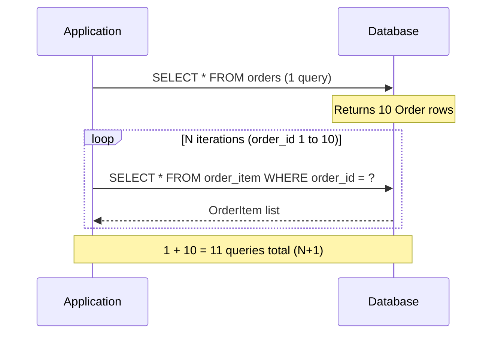
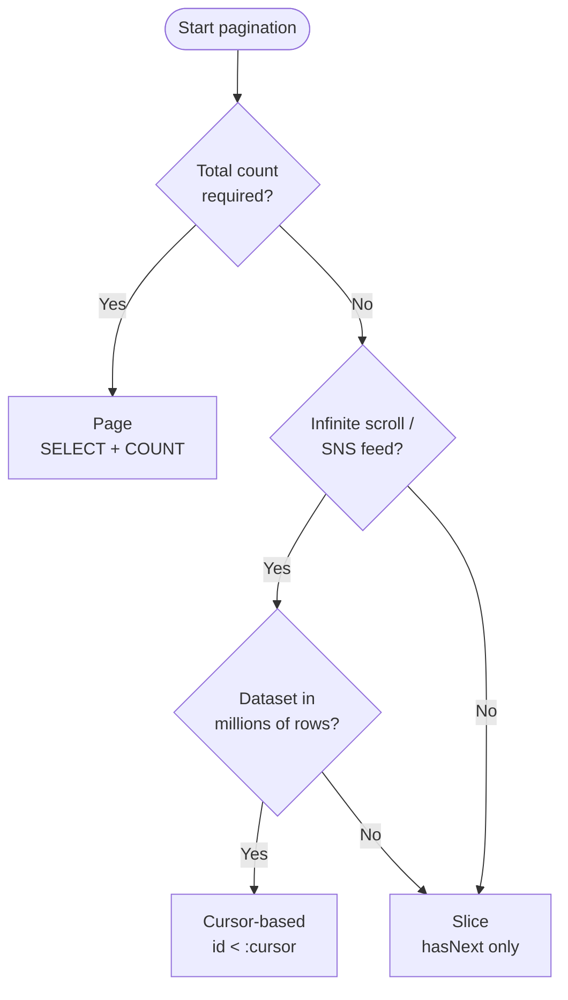
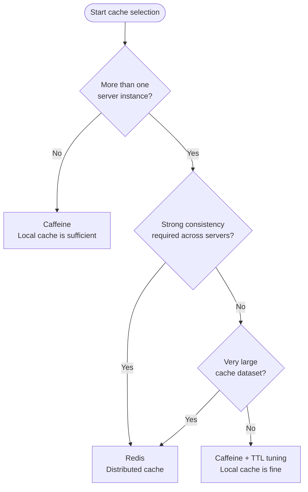

## Introduction

"Where do I start with performance optimization to actually score points?"

In pre-interview assignments, the performance section splits candidates cleanly. Setting LAZY loading with a global `@BatchSize` versus leaving EAGER in place — that one difference signals "this developer understands JPA."

Parts 1–3 covered the four-layer architecture, Database & Testing, and Documentation & AOP. Part 4 is about reducing query costs on top of that foundation. The main topics are:

- Trade-offs between the three N+1 solutions
- Decision criteria for Page, Slice, and Cursor pagination
- Cache selection logic, QueryDSL, and when Projection earns its place

The target reader is a junior backend engineer who has the feature working but isn't sure how to handle the performance side. After reading, you'll have a clear decision framework for each tool.

See [the previous post](/en/blog/spring-boot-pre-interview-guide-3) for Documentation & AOP.

- Part 1 — [Core Application Layer](/en/blog/spring-boot-pre-interview-guide-1)
- Part 2 — [Database & Testing](/en/blog/spring-boot-pre-interview-guide-2)
- Part 3 — [Documentation & AOP](/en/blog/spring-boot-pre-interview-guide-3)
- <strong>Part 4 — Performance & Optimization (this post)</strong>
- Part 5 — [Security & Authentication](/en/blog/spring-boot-pre-interview-guide-5)
- Part 6 — [DevOps & Deployment](/en/blog/spring-boot-pre-interview-guide-6)
- Part 7 — [Advanced Patterns](/en/blog/spring-boot-pre-interview-guide-7)

---

## TL;DR

- <strong>LAZY is the rule, EAGER is the exception</strong> — `@ManyToOne` and `@OneToOne` default to EAGER, so you have to override them explicitly. Leaving EAGER in place causes N+1 even with JPQL.
- <strong>Fetch Join breaks paging; @BatchSize doesn't</strong> — Joining a collection and then paging triggers in-memory paging. When paging is required, @BatchSize is the right answer.
- <strong>The Page vs Cursor decision pivots on "do you need the total count?"</strong> — If yes, use Page (Offset). For infinite scroll, use Cursor. For the middle ground, use Slice.
- <strong>Cache selection starts with server count</strong> — A single server is fine with Caffeine. Multiple servers, or strong consistency requirements, means Redis.
- <strong>Projection is the default for list queries</strong> — For any list query that doesn't need to modify entities, switching to DTO Projection reduces the number of selected columns and cuts memory usage.

---

## 1. The N+1 Problem — Why LAZY Is the Answer and Where It Still Leaks

### 1.1 How N+1 Happens

> <strong>Note</strong>: The Spring Boot 4 + Kotlin 2.3 project setup itself (kotlin-spring / kotlin-jpa plugins) was covered in [Part 1 §1.1](/en/blog/spring-boot-pre-interview-guide-1). Part 4 focuses on the Performance layer that runs on top of that setup. Kotlin 2.x is backward-compatible, so the same code works on 2.0–2.3.

<strong>The N+1 problem occurs when 1 query fetches N records, and then N additional queries fire to load each record's associated data.</strong>

"I fetched the order list with one query, but SELECT fires every time I access OrderItems" — that's the N+1 problem in practice.



Ten orders means 11 queries. A hundred means 101. Nested associations multiply this exponentially.

```kotlin
// Order : OrderItem = 1 : N relationship
val orders = orderRepository.findAll() // 1 query

for (order in orders) {
    // Fires an additional SELECT for each Order's items (N times)
    val items = order.orderItems
    items.forEach { println(it.productName) }
}
```

### 1.2 LAZY Is the Rule — Two Scenarios Where It Still Leaks

<strong>The baseline rule is: set every association to `FetchType.LAZY`.</strong> LAZY defers loading until first access. EAGER always fetches associated data alongside the parent.

The kotlin-jpa plugin synthesizes a no-arg constructor on JPA entities automatically, so you don't need to add one manually (see Part 1 §1.1 for the setup).

Even with LAZY in place, N+1 can still appear in two scenarios.

**Scenario 1 — @ManyToOne and @OneToOne default to EAGER**

The JPA spec sets the default fetch strategy for `@ManyToOne` and `@OneToOne` to `EAGER`. Without an explicit LAZY declaration, associated entities are pulled in every time the parent loads.

```kotlin
@Entity
class Order(
    // Default is EAGER — must be overridden
    @ManyToOne(fetch = FetchType.LAZY)
    val member: Member,

    // @OneToMany defaults to LAZY, which is safer
    @OneToMany(mappedBy = "order", fetch = FetchType.LAZY)
    val orderItems: MutableList<OrderItem> = mutableListOf()
)
```

**Scenario 2 — EAGER associations still cause N+1 with JPQL**

EAGER doesn't make JPQL automatically add a JOIN. JPQL executes the query as written, then fires additional queries for EAGER associations afterward. The result is still 1 + N.

```kotlin
// Even JPQL triggers extra queries for EAGER associations
@Query("SELECT o FROM Order o")
fun findAll(): List<Order>
// → SELECT * FROM orders
// → SELECT * FROM member WHERE id = ? (EAGER fires N times)
```

---

## 2. Three N+1 Solutions — Fetch Join, @EntityGraph, @BatchSize

### 2.1 Fetch Join — Why It Can't Be Paged

<strong>Fetch Join is a JPQL technique that retrieves associated entities in a single JOIN query, eliminating the extra round trips.</strong>

It's the most direct fix for N+1 — one query instead of N+1. But it has a critical constraint.

```kotlin
interface OrderRepository : JpaRepository<Order, Long> {

    @Query("SELECT DISTINCT o FROM Order o JOIN FETCH o.orderItems")
    fun findAllWithOrderItems(): List<Order>
}
```

> <strong>Caution</strong>: Combining a collection Fetch Join with `Pageable` causes Hibernate to load all rows into memory and page there. With large datasets, this is an OOM risk.

Why does the data multiply? If one Order has three OrderItems, the JOIN produces three rows. Paging those rows cuts "10 rows" — not "10 Orders." The result is not what you intended.

### 2.2 @EntityGraph — Declarative Fetch

<strong>@EntityGraph overrides the fetch strategy per repository method using annotations, without writing JPQL.</strong>

It uses the same JOIN strategy as Fetch Join, but paths to eager-load are declared in `attributePaths` rather than written as a query string. Nested associations use dot-separated paths in the array.

```kotlin
interface OrderRepository : JpaRepository<Order, Long> {

    // 1-level: Order -> OrderItems
    @EntityGraph(attributePaths = ["orderItems"])
    @Query("SELECT o FROM Order o")
    fun findAllWithOrderItemsGraph(): List<Order>

    // 2-level: Order -> OrderItems -> Product
    @EntityGraph(attributePaths = ["orderItems", "orderItems.product"])
    fun findByStatus(status: OrderStatus): List<Order>

    // 3-level: Order -> OrderItems -> Product -> Category
    @EntityGraph(attributePaths = [
        "orderItems",
        "orderItems.product",
        "orderItems.product.category"
    ])
    fun findWithFullDetailsById(id: Long): Optional<Order>
}
```

@EntityGraph shares the same pagination limitation as Fetch Join: including a collection and paging together still triggers in-memory paging.

### 2.3 @BatchSize — Compatible with Paging

<strong>@BatchSize collapses N lazy-loading queries into a single IN clause, making it safe to combine with pagination.</strong>

Where Fetch Join is "join everything upfront," @BatchSize is "batch it together later." The result is 1 + 1 queries, and paging works correctly because no row multiplication happens at the SQL level.

```yaml
# application.yml — global setting (recommended)
spring:
  jpa:
    properties:
      hibernate:
        default_batch_fetch_size: 100
```

You can also apply it directly to a specific field instead of globally.

```kotlin
@Entity
class Order(
    @BatchSize(size = 100)
    @OneToMany(mappedBy = "order", fetch = FetchType.LAZY)
    val orderItems: MutableList<OrderItem> = mutableListOf()
)
```

The before-and-after at the SQL level makes the improvement obvious.

```sql
-- Before: N queries for N orders
SELECT * FROM order_item WHERE order_id = 1;
SELECT * FROM order_item WHERE order_id = 2;
...

-- After @BatchSize: one IN query
SELECT * FROM order_item WHERE order_id IN (1, 2, 3, ..., 10);
```

### 2.4 Which One, When

All three reduce N+1, but the right choice depends on whether you need paging and how many collections are involved.

| Method | Queries | Paging | Key Constraint | When to Use |
|--------|---------|--------|----------------|-------------|
| <strong>Fetch Join</strong> | 1 | No (collection) | Cartesian product; MultipleBagFetchException with 2+ collections | Small, non-paged single detail queries |
| <strong>@EntityGraph</strong> | 1 | No (collection) | Same as Fetch Join | Eager loading needed only on specific repository methods |
| <strong>@BatchSize</strong> | 1 + 1 | Yes | One extra query | Paging required / multiple collections |

> <strong>Key takeaway</strong>: For assignments, set `default_batch_fetch_size: 100` globally and reserve Fetch Join for non-paged single-entity detail queries. That combination is the safest baseline.

---

## 3. Pagination — Page, Slice, and Cursor

### 3.1 Pageable and the Page<T> Response

<strong>Pageable is Spring Data JPA's abstraction for page number, size, and sort — passed as a method parameter, it translates automatically into LIMIT/OFFSET SQL.</strong>

There are three options for what to return from a paginated endpoint.

| Approach | Characteristics | Recommended? |
|----------|----------------|--------------|
| Return `Page<T>` directly | Spring standard, includes sort and pageable metadata | Sufficient |
| `CommonResponse<Page<T>>` | Consistent envelope if you're using it in §2 of Part 1 | Good fit |
| Custom `PageResponse` | Only the fields you choose | Optional |

Kotlin doesn't use Lombok — constructor injection is handled by primary constructor `val` parameters. Here's the baseline Service and Controller structure.

```kotlin
@Service
class ProductService(
    private val productRepository: ProductRepository
) {
    fun getProducts(pageable: Pageable): Page<ProductResponse> =
        productRepository.findAll(pageable).map { ProductResponse.from(it) }
}
```

```kotlin
@RestController
@RequestMapping("/api/v1/products")
class ProductController(
    private val productService: ProductService
) {
    @GetMapping
    fun getProducts(
        @PageableDefault(size = 20, sort = ["createdAt"], direction = Sort.Direction.DESC)
        pageable: Pageable
    ): Page<ProductResponse> = productService.getProducts(pageable)
}
```

<details>
<summary>Custom PageResponse example (optional)</summary>

```kotlin
data class PageResponse<T>(
    val content: List<T>,
    val page: Int,
    val size: Int,
    val totalElements: Long,
    val totalPages: Int,
    val hasNext: Boolean
) {
    companion object {
        fun <T> from(page: Page<T>): PageResponse<T> = PageResponse(
            content = page.content,
            page = page.number,
            size = page.size,
            totalElements = page.totalElements,
            totalPages = page.totalPages,
            hasNext = page.hasNext()
        )
    }
}
```

</details>

### 3.2 Page vs Slice

<strong>The difference between Page and Slice is whether a COUNT query runs.</strong>

| Type | Total Count | Queries | Use Pattern |
|------|-------------|---------|-------------|
| <strong>Page</strong> | Yes (`totalElements`) | SELECT + COUNT | Admin lists, showing total pages |
| <strong>Slice</strong> | No (`hasNext` only) | SELECT (size + 1) | Infinite scroll, only "next exists" needed |

```kotlin
// Page — when total count is needed (standard pagination)
fun findByCategory(category: Category, pageable: Pageable): Page<Product>

// Slice — when total count is unnecessary (e.g., infinite scroll)
fun findByCategory(category: Category, pageable: Pageable): Slice<Product>

// List — when only data is needed, no pagination metadata
fun findByCategory(category: Category, pageable: Pageable): List<Product>
```

### 3.3 Offset vs Cursor — The Large-Dataset Fork

The weakness of offset-based paging is that `OFFSET` forces a full scan of all preceding rows. On a millions-row table, requesting page 500 means scanning 500 × size rows before returning anything.

<strong>Cursor-based paging uses the ID of the last fetched record as the starting point for the next page, eliminating the leading-row scan entirely.</strong>

Use this decision tree to choose.



The core of a cursor implementation is using the last item's ID as the anchor for the next request.

```kotlin
interface ProductRepository : JpaRepository<Product, Long> {

    @Query("SELECT p FROM Product p WHERE p.id < :cursor ORDER BY p.id DESC")
    fun findByIdLessThan(@Param("cursor") cursor: Long, pageable: Pageable): List<Product>
}
```

```kotlin
@Service
class ProductService(
    private val productRepository: ProductRepository
) {
    fun getProductsWithCursor(cursor: Long?, size: Int): CursorResponse<ProductResponse> {
        val pageable = PageRequest.of(0, size + 1) // +1 to detect hasNext

        var products = if (cursor == null) {
            productRepository.findAll(
                PageRequest.of(0, size + 1, Sort.by(Sort.Direction.DESC, "id"))
            ).content
        } else {
            productRepository.findByIdLessThan(cursor, pageable)
        }

        val hasNext = products.size > size
        if (hasNext) {
            products = products.subList(0, size)
        }

        val nextCursor = if (hasNext) products.last().id else null

        return CursorResponse(
            content = products.map { ProductResponse.from(it) },
            nextCursor = nextCursor,
            hasNext = hasNext
        )
    }
}
```

<details>
<summary>CursorResponse class</summary>

```kotlin
data class CursorResponse<T>(
    val content: List<T>,
    val nextCursor: Long?,
    val hasNext: Boolean
)
```

</details>

> <strong>Assignment recommendation</strong>: Use Offset (Page) as the default. Adding a paragraph to your README explaining cursor pagination and its trade-offs is a reliable way to earn bonus points.

### 3.4 Aside: COUNT Query Optimization

When using Page, a COUNT query runs alongside the main query. For queries with multiple JOINs, the COUNT query can become just as slow. The fix is to split it.

```kotlin
@Query(
    value = "SELECT p FROM Product p JOIN FETCH p.category WHERE p.status = :status",
    countQuery = "SELECT COUNT(p) FROM Product p WHERE p.status = :status"
)
fun findByStatus(@Param("status") status: ProductStatus, pageable: Pageable): Page<Product>
```

> <strong>Note</strong>: At assignment scale this level of optimization is rarely needed. That said, having the structure in place signals intentional design — which is exactly what evaluators look for.

---

## 4. Caching — Spring Cache, Caffeine, Redis

### 4.1 Spring Cache Abstraction (@Cacheable, @CachePut, @CacheEvict)

<strong>Spring Cache abstraction lets you declare caching behavior with annotations, independent of the underlying cache implementation.</strong>

Whether you swap in Caffeine or Redis later, the service code annotations don't change. The three core annotations each have a clear role.

| Annotation | Behavior | When to Use |
|-----------|----------|-------------|
| `@Cacheable` | Returns cached value if present; executes and stores if not | Read methods |
| `@CachePut` | Always executes, then updates the cache | Write/update methods |
| `@CacheEvict` | Removes the entry from cache | Delete methods |

```kotlin
@Service
class ProductService(
    private val productRepository: ProductRepository
) {
    @Cacheable(value = "product", key = "#productId")
    fun getProductDetail(productId: Long): ProductDetailResponse {
        val product = productRepository.findById(productId)
            ?: throw ProductNotFoundException(productId)
        return ProductDetailResponse.from(product)
    }

    @CachePut(value = "product", key = "#productId")
    fun updateProduct(productId: Long, command: ProductUpdateCommand): ProductDetailResponse {
        val product = productRepository.findById(productId)
            ?: throw ProductNotFoundException(productId)
        product.update(command.name, command.price)
        return ProductDetailResponse.from(product)
    }

    @CacheEvict(value = "product", key = "#productId")
    fun deleteProduct(productId: Long) {
        productRepository.deleteById(productId)
    }

    @CacheEvict(value = "product", allEntries = true)
    fun clearProductCache() {
        // Evicts all entries for the "product" cache
    }
}
```

### 4.2 Caffeine — The Single-Server Standard

<strong>Caffeine is a high-performance in-process cache library that operates entirely in JVM memory.</strong>

No network round-trips — direct memory access makes it the fastest option available. For single-server assignments, it's the obvious default.

```kotlin
// settings.gradle.kts
dependencyResolutionManagement {
    versionCatalogs {
        create("libs") {
            library("caffeine", "com.github.ben-manes.caffeine", "caffeine").withoutVersion()
            library("spring-boot-starter-cache", "org.springframework.boot", "spring-boot-starter-cache").withoutVersion()
        }
    }
}
```

```kotlin
// build.gradle.kts
dependencies {
    implementation(libs.caffeine)
    implementation(libs.spring.boot.starter.cache)
}
```

The basic setup applies one policy to all caches.

```kotlin
@Configuration
@EnableCaching
class CacheConfig {

    @Bean
    fun cacheManager(): CacheManager {
        val cacheManager = CaffeineCacheManager()
        cacheManager.setCaffeine(Caffeine.newBuilder()
            .maximumSize(1000)
            .expireAfterWrite(10, TimeUnit.MINUTES)
            .recordStats())
        return cacheManager
    }
}
```

When you need different TTLs and sizes per cache, use `SimpleCacheManager`.

```kotlin
@Configuration
@EnableCaching
class CacheConfig {

    @Bean
    fun cacheManager(): CacheManager {
        val cacheManager = SimpleCacheManager()
        cacheManager.setCaches(listOf(
            buildCache("product", 500, 30, TimeUnit.MINUTES),
            buildCache("category", 100, 1, TimeUnit.HOURS),
            buildCache("config", 50, 24, TimeUnit.HOURS)
        ))
        return cacheManager
    }

    private fun buildCache(name: String, maxSize: Long, duration: Long, unit: TimeUnit): CaffeineCache =
        CaffeineCache(name, Caffeine.newBuilder()
            .maximumSize(maxSize)
            .expireAfterWrite(duration, unit)
            .recordStats()
            .build())
}
```

### 4.3 Redis — Distributed Cache

<strong>Redis is an external distributed cache server that shares cached data across multiple application instances.</strong>

In a multi-server environment, each instance maintaining its own local cache leads to inconsistent reads. Redis solves this by acting as a shared store.

```kotlin
// settings.gradle.kts
dependencyResolutionManagement {
    versionCatalogs {
        create("libs") {
            library("spring-boot-starter-data-redis", "org.springframework.boot", "spring-boot-starter-data-redis").withoutVersion()
            library("spring-boot-starter-cache", "org.springframework.boot", "spring-boot-starter-cache").withoutVersion()
        }
    }
}
```

```kotlin
// build.gradle.kts
dependencies {
    implementation(libs.spring.boot.starter.data.redis)
    implementation(libs.spring.boot.starter.cache)
}
```

```yaml
spring:
  redis:
    host: localhost
    port: 6379
  cache:
    type: redis
    redis:
      time-to-live: 600000
      cache-null-values: false
```

```kotlin
@Configuration
@EnableCaching
class RedisCacheConfig {

    @Bean
    fun cacheManager(connectionFactory: RedisConnectionFactory): CacheManager {
        val defaultConfig = RedisCacheConfiguration.defaultCacheConfig()
            .entryTtl(Duration.ofMinutes(10))
            .serializeKeysWith(RedisSerializationContext.SerializationPair
                .fromSerializer(StringRedisSerializer()))
            .serializeValuesWith(RedisSerializationContext.SerializationPair
                .fromSerializer(GenericJackson2JsonRedisSerializer()))

        val cacheConfigurations = mapOf(
            "product" to defaultConfig.entryTtl(Duration.ofMinutes(30)),
            "category" to defaultConfig.entryTtl(Duration.ofHours(1))
        )

        return RedisCacheManager.builder(connectionFactory)
            .cacheDefaults(defaultConfig)
            .withInitialCacheConfigurations(cacheConfigurations)
            .build()
    }
}
```

### 4.4 Local vs Distributed — The Decision

The cache selection decision starts with server count and consistency requirements.



| Aspect | Caffeine (Local) | Redis (Distributed) |
|--------|-----------------|---------------------|
| Speed | Very fast (direct memory) | Slower (network hop) |
| Consistency | Possible inconsistency across instances | Shared store guarantees consistency |
| Capacity | Limited by JVM heap | Dedicated server, horizontally scalable |
| Complexity | Simple | Requires Redis infrastructure |

> <strong>Assignment recommendation</strong>: Caffeine is sufficient for single-server work. Adding Redis to Docker Compose earns bonus points for showing distributed environment awareness.

### 4.5 Aside: Cache Invalidation Strategies

Getting caching right means designing invalidation alongside the caching policy. Two common patterns:

**Cache-Aside (Lazy Loading)** — how Spring Cache works by default

1. On read: check cache first.
2. Cache miss → query DB, store result in cache.
3. On write/delete: `@CacheEvict` removes the relevant entry.

**Write-Through** — keeps cache and DB in sync on every write

1. `@CachePut` always executes the method and updates the cache.
2. Reads always hit the cache.

Two things to watch for. First, list caches need full eviction on any item change (`allEntries = true`). Second, prefix cache keys so methods sharing the same cache name don't collide.

---

## 5. Query Optimization — Projection, QueryDSL, Indexes

### 5.1 Projection — Fields Instead of Full Entities

<strong>Projection selects only the fields you need from the database, rather than fetching the full entity.</strong>

Returning complete entities for list queries means pulling in columns you'll never use. Projection reduces the number of selected columns, lowers data transfer volume, and cuts memory usage.

There are two approaches. Interface Projection defines an interface; Hibernate generates a proxy at runtime.

```kotlin
interface ProductSummary {
    val id: Long
    val name: String
    val price: Int
}

interface ProductRepository : JpaRepository<Product, Long> {
    fun findByCategory(category: Category): List<ProductSummary>
}
```

DTO Projection constructs a data class directly, with no proxy overhead — making it the faster option.

```kotlin
data class ProductSummaryDto(
    val id: Long,
    val name: String,
    val price: Int
)

interface ProductRepository : JpaRepository<Product, Long> {

    @Query("SELECT new com.example.dto.ProductSummaryDto(p.id, p.name, p.price) " +
           "FROM Product p WHERE p.category = :category")
    fun findSummaryByCategory(@Param("category") category: Category): List<ProductSummaryDto>
}
```

Performance order: DTO Projection > Interface Projection > full Entity query. The exception: if you need to modify the entity after loading, you must fetch the full entity.

<details>
<summary>Projection performance comparison</summary>

```kotlin
// 1. Full Entity query — all columns + associated entities
val products: List<Product> = productRepository.findAll()

// 2. Interface Projection — required columns only (proxy creation)
val summaries: List<ProductSummary> = productRepository.findAllProjectedBy()

// 3. DTO Projection — required columns only (direct instantiation, fastest)
val dtos: List<ProductSummaryDto> = productRepository.findAllSummary()
```

</details>

### 5.2 QueryDSL — Dynamic Queries

<strong>QueryDSL is a framework that generates JPQL from type-safe Kotlin/Java code.</strong>

JPQL is a string — compile-time errors aren't caught, and adding optional conditions requires string concatenation. QueryDSL solves both problems.

In Kotlin, Q-class generation uses `kapt` (Kotlin Annotation Processing Tool) instead of `annotationProcessor`.

```kotlin
// build.gradle.kts — QueryDSL + kapt setup
plugins {
    kotlin("kapt") version "2.3"
}

dependencies {
    implementation("com.querydsl:querydsl-jpa:5.0.0:jakarta")
    kapt("com.querydsl:querydsl-apt:5.0.0:jakarta")
    kapt("jakarta.annotation:jakarta.annotation-api")
    kapt("jakarta.persistence:jakarta.persistence-api")
}
```

The canonical pattern: compose each condition as a `BooleanExpression` method that returns `null` when not applicable. QueryDSL automatically omits null predicates from the WHERE clause.

```kotlin
@Repository
class ProductQueryRepository(
    private val queryFactory: JPAQueryFactory
) {
    fun searchProducts(condition: ProductSearchCondition): List<Product> {
        return queryFactory
            .selectFrom(product)
            .where(
                categoryEq(condition.categoryId),
                priceGoe(condition.minPrice),
                priceLoe(condition.maxPrice),
                nameContains(condition.keyword)
            )
            .orderBy(product.createdAt.desc())
            .offset(condition.offset)
            .limit(condition.limit)
            .fetch()
    }

    private fun categoryEq(categoryId: Long?) =
        categoryId?.let { product.category.id.eq(it) }

    private fun priceGoe(minPrice: Int?) =
        minPrice?.let { product.price.goe(it) }

    private fun priceLoe(maxPrice: Int?) =
        maxPrice?.let { product.price.loe(it) }

    private fun nameContains(keyword: String?) =
        keyword?.takeIf { it.isNotBlank() }?.let { product.name.contains(it) }
}
```

That's why QueryDSL makes dynamic queries easy — null condition methods simply vanish from the query without any if-branching in the caller.

The right time to introduce QueryDSL: "two or more search conditions are optional." For straightforward CRUD, Spring Data JPA is cleaner.

| Approach | Type-safe | Dynamic queries | When to Use |
|----------|-----------|----------------|-------------|
| <strong>JPQL</strong> | No (string) | Awkward | Simple static queries |
| <strong>QueryDSL</strong> | Yes | Easy | Complex optional search conditions |
| <strong>Native Query</strong> | No | Awkward | DB-specific features, complex aggregations |

### 5.3 Index Design — Declared in Entity Annotations

<strong>Indexes are database structures that speed up searches on columns frequently used in WHERE, JOIN, and ORDER BY clauses.</strong>

In JPA, declaring `@Index` inside `@Table` on an entity includes the index in auto-generated DDL. It's how you signal intent — "this column needs an index" — directly in the code.

```kotlin
@Entity
@Table(name = "product", indexes = [
    Index(name = "idx_product_category", columnList = "category_id"),
    Index(name = "idx_product_status_created", columnList = "status, created_at"),
    Index(name = "idx_product_name", columnList = "name")
])
class Product {
    // ...
}
```

<details>
<summary>Index design guidelines</summary>

**When to add an index**:
- Columns frequently used in WHERE clauses
- Columns used in JOIN conditions (foreign keys)
- Columns used in ORDER BY
- High-cardinality columns (many distinct values)

**Things to watch for**:
- Indexes slow down INSERT/UPDATE/DELETE (index maintenance overhead)
- Column order matters in composite indexes (leftmost prefix rule)
- Too many indexes can hurt overall performance

</details>

---

## Recap

- <strong>LAZY globally + @BatchSize 100</strong> — Declaring all associations as LAZY and setting `default_batch_fetch_size: 100` globally is the safe, no-regret baseline defense against N+1.
- <strong>Pagination branches on whether you need the total count</strong> — Page when you do, Slice when you only need "is there a next page," Cursor for large-scale infinite scroll.
- <strong>Cache selection starts with server count</strong> — Caffeine for single server, Redis for multi-server. Adding Redis to Docker Compose earns bonus points.
- <strong>Projection is the default for list queries</strong> — On any list that doesn't modify entities, DTO Projection reduces selected columns and memory usage with minimal effort.
- <strong>QueryDSL only when conditions are genuinely dynamic</strong> — Spring Data JPA is cleaner for simple CRUD. QueryDSL's advantage becomes clear when two or more search conditions are optional.

### Checklist

| Item | Check |
|------|-------|
| Are all associations declared `FetchType.LAZY`? | ⬜ |
| Do `@ManyToOne` and `@OneToOne` fields have an explicit LAZY override? | ⬜ |
| Is `default_batch_fetch_size` set globally? | ⬜ |
| Is `Pageable` applied to APIs that need pagination? | ⬜ |
| Is caching applied to frequently read, rarely changed data? | ⬜ |
| Are list queries using Projection to avoid full entity loads? | ⬜ |
| Is QueryDSL used only for genuinely dynamic search conditions? | ⬜ |

Part 5 covers Security & Authentication: Spring Security filter chain, JWT issuance and validation, and password hashing. We'll also cover the four patterns that reliably cost points in the security section.

---

## Appendix

### Five Common Performance Mistakes

<details>
<summary>Performance mistakes that appear most often in assignments</summary>

1. **Leaving EAGER loading in place** — `@ManyToOne` and `@OneToOne` default to EAGER. Without an explicit LAZY override, associated entities are fetched on every parent query.

2. **Indiscriminate collection Fetch Joins** — Joining a collection with Fetch Join and then paging causes in-memory pagination. Two or more collection Fetch Joins on the same query throw `MultipleBagFetchException`.

3. **Ignoring the COUNT query** — Page always fires a COUNT alongside the main query. For complex JOINs, the COUNT can be just as slow. Split the COUNT query or switch to Slice.

4. **Cache key collisions** — Different methods using the same cache name with the same key will return unexpected data. Design unique cache names or key prefixes per method.

5. **Returning full entities from list endpoints** — On any list endpoint that doesn't modify data, a DTO Projection is a low-effort swap that directly reduces selected columns and DB transfer volume.

</details>

### External References

- [Spring Data JPA Reference Documentation](https://docs.spring.io/spring-data/jpa/docs/current/reference/html/)
- [Hibernate ORM User Guide — Fetching](https://docs.jboss.org/hibernate/orm/6.4/userguide/html_single/Hibernate_User_Guide.html#fetching)
- [Caffeine — GitHub](https://github.com/ben-manes/caffeine)
- [Spring Cache Abstraction Reference](https://docs.spring.io/spring-framework/docs/current/reference/html/integration.html#cache)
- [QueryDSL Reference Documentation](http://querydsl.com/static/querydsl/5.0.0/reference/html_single/)
