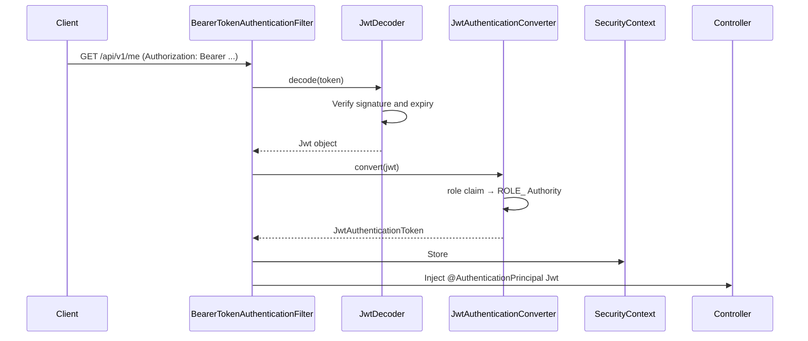
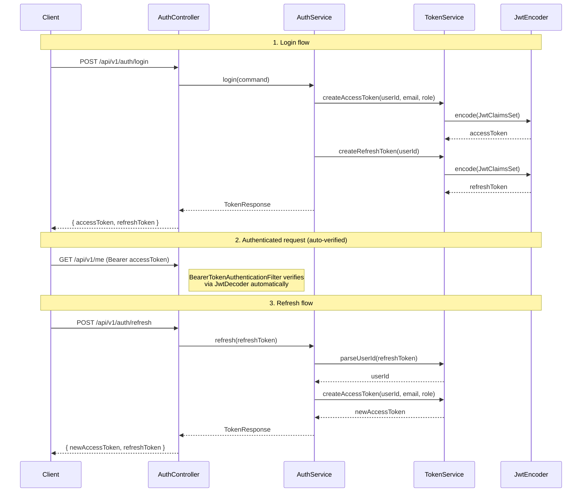
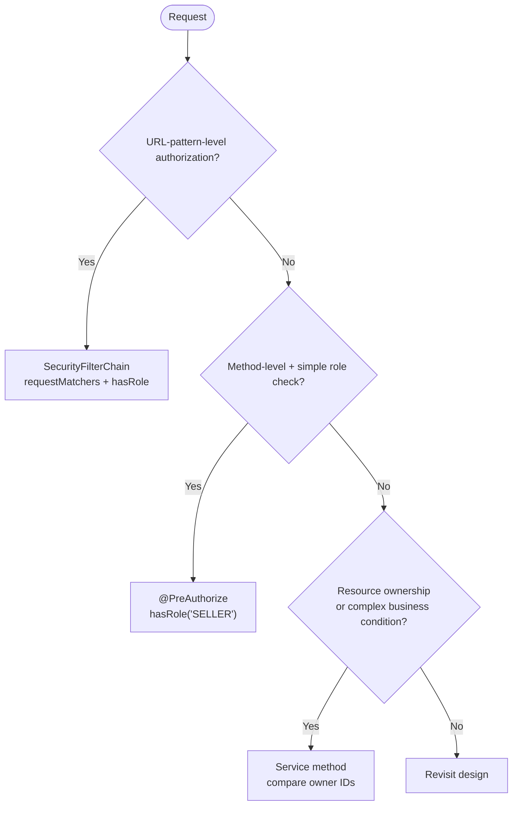

## Introduction

"How much security setup does it take for an evaluator to nod in approval?"

Security in a pre-interview assignment comes in two flavors. One is managing JJWT directly, hand-writing an `OncePerRequestFilter`. The other uses the `oauth2-resource-server` abstraction Spring Security provides. Evaluators read the latter as "this person knows Spring Security." The former leaves an impression of "it works, but it deviates from the standard."

Part 4 covered N+1, caching, and pagination. Part 5 builds the authentication and authorization layer on top of that. Three things are at the core:

- Delegating JWT verification to Spring Security via `spring-boot-starter-oauth2-resource-server`
- Using the `JwtDecoder` + `JwtEncoder` bean pair as the standard API for verification and issuance
- Receiving the current user in a Controller with `@AuthenticationPrincipal Jwt`

The target reader is a junior backend developer who knows Spring Security but is unsure where evaluators actually look.

See the [previous post](/en/blog/spring-boot-pre-interview-guide-4) for Performance & Optimization.

- Part 1 — [Core Application Layer](/en/blog/spring-boot-pre-interview-guide-1)
- Part 2 — [Database & Testing](/en/blog/spring-boot-pre-interview-guide-2)
- Part 3 — [Documentation & AOP](/en/blog/spring-boot-pre-interview-guide-3)
- Part 4 — [Performance & Optimization](/en/blog/spring-boot-pre-interview-guide-4)
- <strong>Part 5 — Security & Authentication (this post)</strong>
- Part 6 — [DevOps & Deployment](/en/blog/spring-boot-pre-interview-guide-6)
- Part 7 — [Advanced Patterns](/en/blog/spring-boot-pre-interview-guide-7)

---

## TL;DR

- <strong>oauth2-resource-server is the Spring Security 7 standard</strong> — `BearerTokenAuthenticationFilter` handles token extraction, verification, and `SecurityContext` population automatically. No custom `OncePerRequestFilter` needed.
- <strong>Register JwtDecoder + JwtEncoder as beans</strong> — `NimbusJwtDecoder` (verify) and `NimbusJwtEncoder` (issue) are managed through the Spring Security abstraction. HMAC and RSA use the same API.
- <strong>JwtAuthenticationConverter maps the role claim to ROLE_ authorities</strong> — Converts the JWT `role` claim to a Spring Security `GrantedAuthority`. `@PreAuthorize("hasRole('SELLER')")` depends on this mapping.
- <strong>@AuthenticationPrincipal Jwt delivers the current user in Controllers</strong> — `jwt.getSubject()` for userId, `jwt.getClaim("email")` for any arbitrary claim. Clean, no casting.
- <strong>BCrypt by default, Argon2 as an option</strong> — `PasswordEncoderFactories.createDelegatingPasswordEncoder()` defaults to BCrypt. Switch to Argon2 for higher security requirements.

---

## 1. Spring Security 7 — The Evaluator's Starting Line

### §1.1 Dependencies and Key Changes from Spring Security 6 to 7

> <strong>Note</strong>: The Spring Boot 4 + Kotlin 2.3 project setup itself (kotlin-spring, kotlin-jpa plugins, etc.) is covered in Part 1 §1.1. Part 5 focuses on the Security layer that runs on top of that. The Kotlin 2.x line is backward-compatible, so the same code works on 2.0–2.3.

In Spring Security 7, adding `spring-boot-starter-oauth2-resource-server` alongside the main security starter is standard practice. This starter pulls in Nimbus JOSE+JWT as a transitive dependency, so no separate JJWT library is needed.

```kotlin
// settings.gradle.kts
dependencyResolutionManagement {
    versionCatalogs {
        create("libs") {
            library("spring-boot-starter-security", "org.springframework.boot:spring-boot-starter-security:3.4.0")
            library("spring-boot-starter-oauth2-resource-server", "org.springframework.boot:spring-boot-starter-oauth2-resource-server:3.4.0")
            library("spring-security-test", "org.springframework.security:spring-security-test:6.4.0")
        }
    }
}
```

```kotlin
// build.gradle.kts
dependencies {
    implementation(libs.spring.boot.starter.security)
    implementation(libs.spring.boot.starter.oauth2.resource.server)
    // JJWT not needed — Nimbus JOSE+JWT is included transitively
    testImplementation(libs.spring.security.test)
}
```

The change points evaluators most commonly check when moving from Spring Security 6 to 7:

| Topic | Spring Security 6 | Spring Security 7 |
|-------|-------------------|-------------------|
| URL authorization API | `antMatchers()` removed | `requestMatchers()` only |
| HTTP DSL | Some legacy APIs coexisted | Lambda DSL fully standard |
| Method security | `@EnableGlobalMethodSecurity` | `@EnableMethodSecurity` |
| JWT filter | Custom `OncePerRequestFilter` | `oauth2ResourceServer` recommended |
| `@EnableWebSecurity` | Explicit declaration needed | Auto-configured by Spring Boot |

### §1.2 SecurityFilterChain at a Glance

When `oauth2ResourceServer` is configured in Spring Security 7, `BearerTokenAuthenticationFilter` is automatically registered in the filter chain. This filter extracts the `Authorization: Bearer ...` header, delegates verification to `JwtDecoder`, converts authorities via `JwtAuthenticationConverter`, and stores the result in `SecurityContext`.



Here is the full SecurityConfig. The key difference from JJWT-based implementations: `addFilterBefore(JwtAuthenticationFilter(...))` is replaced by `oauth2ResourceServer(...)`.

```kotlin
@Configuration
@EnableMethodSecurity
class SecurityConfig(
    @Value("\${jwt.secret}") private val secret: String
) {

    @Bean
    fun filterChain(http: HttpSecurity): SecurityFilterChain =
        http
            .csrf { it.disable() }
            .sessionManagement { it.sessionCreationPolicy(SessionCreationPolicy.STATELESS) }
            .authorizeHttpRequests { auth ->
                auth
                    .requestMatchers("/api/v1/auth/**").permitAll()
                    .requestMatchers(HttpMethod.GET, "/api/v1/products/**").permitAll()
                    .requestMatchers("/swagger-ui/**", "/v3/api-docs/**").permitAll()
                    .anyRequest().authenticated()
            }
            .oauth2ResourceServer { oauth2 ->
                oauth2.jwt { jwt -> jwt.jwtAuthenticationConverter(jwtAuthenticationConverter()) }
            }
            .build()

    @Bean
    fun jwtDecoder(): JwtDecoder {
        val key = SecretKeySpec(secret.toByteArray(StandardCharsets.UTF_8), "HmacSHA256")
        return NimbusJwtDecoder.withSecretKey(key)
            .macAlgorithm(MacAlgorithm.HS256)
            .build()
    }

    @Bean
    fun jwtEncoder(): JwtEncoder {
        val key = SecretKeySpec(secret.toByteArray(StandardCharsets.UTF_8), "HmacSHA256")
        val jwks: JWKSource<SecurityContext> = ImmutableSecret(key)
        return NimbusJwtEncoder(jwks)
    }

    @Bean
    fun passwordEncoder(): PasswordEncoder =
        PasswordEncoderFactories.createDelegatingPasswordEncoder()

    private fun jwtAuthenticationConverter(): JwtAuthenticationConverter {
        val authoritiesConverter = JwtGrantedAuthoritiesConverter().apply {
            setAuthoritiesClaimName("role")
            setAuthorityPrefix("ROLE_")
        }
        return JwtAuthenticationConverter().apply {
            setJwtGrantedAuthoritiesConverter(authoritiesConverter)
        }
    }
}
```

### §1.3 @EnableWebSecurity vs @EnableMethodSecurity

These two annotations are often confused.

| Annotation | Role | In Spring Boot 3.x |
|-----------|------|--------------------|
| `@EnableWebSecurity` | Activates web security auto-configuration | Applied automatically — can be omitted |
| `@EnableMethodSecurity` | Enables `@PreAuthorize` and `@PostAuthorize` | Must be declared explicitly |

Without `@EnableMethodSecurity`, `@PreAuthorize("hasRole('SELLER')")` is silently ignored. It must appear somewhere in a `@Configuration` class.

---

## 2. JWT Authentication — Verify and Issue with oauth2-resource-server

### §2.1 Dependencies and Secret Management

Set the secret in `application.yml` as an environment variable reference. Hard-coding it in source is a deduction point.

```yaml
# application.yml
jwt:
  secret: ${JWT_SECRET:your-256-bit-secret-key-must-be-at-least-32-characters}
```

The secret must be at least 256 bits (32 bytes) to avoid errors when verifying HMAC-SHA256 signatures.

> <strong>Note</strong>: In production, use a secret management system like AWS Secrets Manager or HashiCorp Vault. For assignments, a `.env` file with `.gitignore` coverage is sufficient.

### §2.2 JwtDecoder · JwtEncoder Beans — the Verify/Issue Pair

<strong>`JwtDecoder` is the bean that validates and parses incoming tokens; `JwtEncoder` is the bean that issues new tokens.</strong> When the `oauth2-resource-server` starter is on the classpath, Spring auto-discovers the `JwtDecoder` bean and wires it into `BearerTokenAuthenticationFilter`.

Both beans are already registered in SecurityConfig (see §1.2). For HMAC, the `SecretKeySpec` is shared between them. RSA asymmetric keys are covered in the collapsible section below.

<details>
<summary>RSA asymmetric key approach — more detail</summary>

With an RSA key pair, external services can verify tokens by distributing only the public key — a pattern common in microservice architectures where the auth server is separate.

```kotlin
@Bean
fun jwtDecoder(publicKey: RSAPublicKey): JwtDecoder =
    NimbusJwtDecoder.withPublicKey(publicKey).build()

@Bean
fun jwtEncoder(privateKey: RSAPrivateKey, publicKey: RSAPublicKey): JwtEncoder {
    val rsaKey = RSAKey.Builder(publicKey).privateKey(privateKey).build()
    val jwks: JWKSource<SecurityContext> = ImmutableJWKSet(JWKSet(rsaKey))
    return NimbusJwtEncoder(jwks)
}
```

HMAC is sufficient for assignments. For RSA, knowing "public key distribution enables verification without the private key" is enough.

</details>

### §2.3 JwtAuthenticationConverter — Mapping the role Claim to ROLE_ Authorities

Spring Security's `hasRole('SELLER')` SpEL internally looks for a `GrantedAuthority` named `ROLE_SELLER`. If the JWT's `role` claim contains `SELLER`, `JwtAuthenticationConverter` automatically prepends `ROLE_` to produce `ROLE_SELLER`.

```kotlin
// Private method inside SecurityConfig (already included in §1.2)
private fun jwtAuthenticationConverter(): JwtAuthenticationConverter {
    val authoritiesConverter = JwtGrantedAuthoritiesConverter().apply {
        setAuthoritiesClaimName("role")  // JWT claim name
        setAuthorityPrefix("ROLE_")      // add prefix
    }
    // principal name = sub claim (default) — userId lives here
    return JwtAuthenticationConverter().apply {
        setJwtGrantedAuthoritiesConverter(authoritiesConverter)
    }
}
```

Omitting `setAuthoritiesClaimName("role")` causes the converter to fall back to the default `scope` claim, making every `@PreAuthorize` check fail. This is one of the most commonly missed lines in assignments.

### §2.4 Authentication API — signup, login, and refresh Flows

Start with the sequence diagram, then move to the code.



**TokenService** — issues tokens with `JwtEncoder`, parses them with `JwtDecoder`. This replaces the role that `JwtTokenProvider` played in the JJWT-based approach.

```kotlin
@Service
class TokenService(
    private val jwtEncoder: JwtEncoder,
    private val jwtDecoder: JwtDecoder
) {
    companion object {
        private val ACCESS_TOKEN_TTL: Duration = Duration.ofHours(1)
        private val REFRESH_TOKEN_TTL: Duration = Duration.ofDays(7)
    }

    fun createAccessToken(userId: Long, email: String, role: String): String {
        val now = Instant.now()
        val claims = JwtClaimsSet.builder()
            .issuer("self")
            .issuedAt(now)
            .expiresAt(now.plus(ACCESS_TOKEN_TTL))
            .subject(userId.toString())
            .claim("email", email)
            .claim("role", role)
            .build()
        return jwtEncoder.encode(JwtEncoderParameters.from(claims)).tokenValue
    }

    fun createRefreshToken(userId: Long): String {
        val now = Instant.now()
        val claims = JwtClaimsSet.builder()
            .issuer("self")
            .issuedAt(now)
            .expiresAt(now.plus(REFRESH_TOKEN_TTL))
            .subject(userId.toString())
            .claim("token_type", "refresh")
            .build()
        return jwtEncoder.encode(JwtEncoderParameters.from(claims)).tokenValue
    }

    fun parseUserId(token: String): Long {
        val jwt = jwtDecoder.decode(token)  // verify + parse in one call
        return jwt.subject.toLong()
    }
}
```

**AuthController + AuthService** — inject and use `TokenService`.

```kotlin
@RestController
@RequestMapping("/api/v1/auth")
class AuthController(private val authService: AuthService) {

    @PostMapping("/signup")
    fun signup(@Valid @RequestBody request: SignupRequest): ResponseEntity<Void> {
        authService.signup(request.toCommand())
        return ResponseEntity.status(HttpStatus.CREATED).build()
    }

    @PostMapping("/login")
    fun login(@Valid @RequestBody request: LoginRequest): ResponseEntity<TokenResponse> =
        ResponseEntity.ok(authService.login(request.toCommand()))

    @PostMapping("/refresh")
    fun refresh(@RequestBody request: RefreshTokenRequest): ResponseEntity<TokenResponse> =
        ResponseEntity.ok(authService.refresh(request.refreshToken))
}
```

```kotlin
@Service
@Transactional(readOnly = true)
class AuthService(
    private val memberRepository: MemberRepository,
    private val passwordEncoder: PasswordEncoder,
    private val tokenService: TokenService
) {

    @Transactional
    fun signup(command: SignupCommand) {
        if (memberRepository.existsByEmail(command.email)) {
            throw DuplicateEmailException(command.email)
        }
        val member = Member(
            email = command.email,
            password = passwordEncoder.encode(command.password),
            name = command.name,
            role = MemberRole.USER
        )
        memberRepository.save(member)
    }

    fun login(command: LoginCommand): TokenResponse {
        val member = memberRepository.findByEmail(command.email)
            ?: throw InvalidCredentialsException()

        if (!passwordEncoder.matches(command.password, member.password)) {
            throw InvalidCredentialsException()
        }

        val accessToken = tokenService.createAccessToken(
            member.id, member.email, member.role.name
        )
        val refreshToken = tokenService.createRefreshToken(member.id)
        return TokenResponse(accessToken, refreshToken)
    }

    fun refresh(refreshToken: String): TokenResponse {
        val userId = tokenService.parseUserId(refreshToken)  // throws JwtException if expired
        val member = memberRepository.findById(userId)
            .orElseThrow { MemberNotFoundException(userId) }

        val newAccessToken = tokenService.createAccessToken(
            member.id, member.email, member.role.name
        )
        return TokenResponse(newAccessToken, refreshToken)
    }
}
```

### §2.5 Getting the Current User in Controllers — @AuthenticationPrincipal Jwt

The principal stored in `SecurityContext` by `BearerTokenAuthenticationFilter` is a `Jwt` object. Receiving it with `@AuthenticationPrincipal Jwt jwt` in a Controller gives direct access to claims without any casting.

```kotlin
@GetMapping("/me")
fun getMyProfile(@AuthenticationPrincipal jwt: Jwt): MemberResponse {
    val userId = jwt.subject.toLong()
    return memberService.getMember(userId)
}

@PostMapping
@PreAuthorize("hasRole('SELLER')")
fun createProduct(
    @AuthenticationPrincipal jwt: Jwt,
    @Valid @RequestBody request: CreateProductRequest
): ProductResponse {
    val sellerId = jwt.subject.toLong()
    return productService.createProduct(sellerId, request)
}
```

`jwt.subject` → userId (sub claim), `jwt.getClaim<String>("email")` → any custom claim, `jwt.getClaim<String>("role")` → role claim.

### §2.6 Aside: JJWT direct implementation vs oauth2-resource-server

<details>
<summary>The difference between the two approaches — more detail</summary>

| Comparison | JJWT direct | oauth2-resource-server |
|-----------|-------------|------------------------|
| Dependencies | `jjwt-api` + `jjwt-impl` + `jjwt-jackson` | `oauth2-resource-server` alone |
| JWT filter | Write `OncePerRequestFilter` by hand | `BearerTokenAuthenticationFilter` auto-registered |
| Token verification | Implement `validateToken()` manually | `JwtDecoder` bean handles it |
| Authority mapping | Manually create `SimpleGrantedAuthority` in filter | `JwtAuthenticationConverter` |
| OAuth2 standard compliance | None | RFC 6750 Bearer Token standard |
| Spring Security 7 recommendation | Non-standard | Standard |

Two practical advantages of the oauth2-resource-server approach:
- <strong>Verification and parsing are not separated</strong> — A single `decode()` call verifies the signature and parses the claims. The JJWT pattern often ends up calling `validateToken()` and then `getClaims()` separately.
- <strong>No filter boilerplate</strong> — A 200-line `JwtAuthenticationFilter` is replaced by a few lines in SecurityConfig.

</details>

### §2.7 Aside: Session vs JWT, Token Storage Locations

<details>
<summary>Session vs JWT, storage location comparison</summary>

| Criteria | Session | JWT |
|----------|---------|-----|
| <strong>Storage</strong> | Server (memory/Redis) | Client |
| <strong>Scalability</strong> | Session sharing required across servers | Stateless, horizontal scaling easy |
| <strong>Logout</strong> | Immediately invalidated server-side | Requires blacklist management |
| <strong>Assignment recommendation</strong> | Not expected | De facto standard for REST API assignments |

**Token storage locations**:

| Location | Pros | Cons |
|----------|------|------|
| LocalStorage | Simple | Vulnerable to XSS |
| SessionStorage | Deleted on tab close | Vulnerable to XSS |
| HttpOnly Cookie | XSS protection | Requires CSRF mitigation |
| Memory | Most secure | Lost on page refresh |

Production recommendation: Access Token in memory, Refresh Token in HttpOnly + Secure + SameSite Cookie. For backend-only assignments with no frontend, returning tokens in the response body is acceptable.

</details>

---

## 3. Password Management — BCrypt and Argon2

### §3.1 PasswordEncoderFactories.createDelegatingPasswordEncoder() — The Default

<strong>`PasswordEncoderFactories.createDelegatingPasswordEncoder()` is a factory that reads the algorithm prefix stored with the hash (`{bcrypt}`, `{argon2}`, etc.) and automatically selects the right encoder.</strong>

The default algorithm in Spring Security 7 is `{bcrypt}`. The bean is already registered in SecurityConfig.

```kotlin
@Bean
fun passwordEncoder(): PasswordEncoder =
    PasswordEncoderFactories.createDelegatingPasswordEncoder()
    // Stored format: {bcrypt}$2a$10$...
```

The correct pattern for a password change:

```kotlin
@Transactional
fun changePassword(memberId: Long, currentPassword: String, newPassword: String) {
    val member = memberRepository.findById(memberId)
        .orElseThrow { MemberNotFoundException(memberId) }

    if (!passwordEncoder.matches(currentPassword, member.password)) {
        throw InvalidPasswordException()
    }

    member.changePassword(passwordEncoder.encode(newPassword))
}
```

### §3.2 Password Policy Validation

Enforce input policy with `@Pattern` in the request DTO. In Kotlin, Bean Validation annotations need the `@field:` site target so they land on the underlying field, not the constructor parameter.

```kotlin
data class SignupRequest(
    @field:NotBlank
    @field:Email
    val email: String,

    @field:NotBlank
    @field:Pattern(
        regexp = "^(?=.*[A-Za-z])(?=.*\\d)(?=.*[@\$!%*#?&])[A-Za-z\\d@\$!%*#?&]{8,20}\$",
        message = "Password must be 8-20 characters and include letters, numbers, and a special character"
    )
    val password: String,

    @field:NotBlank
    @field:Size(min = 2, max = 20)
    val name: String
) {
    fun toCommand(): SignupCommand = SignupCommand(email, password, name)
}
```

### §3.3 Aside: BCrypt vs Argon2 and Spring Security 7 Recommendation

| Algorithm | Features | Recommended For |
|---------|----------|-----------------|
| <strong>BCrypt</strong> | Proven since 1999, broadly deployed | General web apps, assignments |
| <strong>Argon2</strong> | 2015 PHC winner, configurable memory cost, resistant to GPU attacks | High-security requirements |
| <strong>scrypt</strong> | Memory-intensive, defends parallel attacks | Some financial services |

Using Argon2 in Spring Security 7:

```kotlin
@Bean
fun passwordEncoder(): PasswordEncoder =
    // saltLength=16, hashLength=32, parallelism=1, memory=65536 KB, iterations=3
    Argon2PasswordEncoder(16, 32, 1, 65536, 3)
```

> <strong>Note</strong>: BCrypt is the de facto standard for assignments. Replacing the bean wholesale with a single `Argon2PasswordEncoder` — as in the snippet above — fails to verify any existing `{bcrypt}`-prefixed hashes. For a gradual migration, keep the `DelegatingPasswordEncoder` structure: add Argon2 to the encoder map and switch `idForEncode` to `"argon2"`. New hashes are stored as `{argon2}` while old `{bcrypt}` hashes continue to verify via prefix lookup.

---

## 4. API Authorization — RBAC and Resource Ownership Checks

### §4.1 Role Definition (Role enum + Member entity)

Define roles to match the assignment requirements. Storing with `@Enumerated(EnumType.STRING)` writes `USER`, `SELLER`, `ADMIN` as strings in the DB, making queries readable.

```kotlin
enum class MemberRole {
    USER,    // Regular user
    SELLER,  // Seller
    ADMIN    // Administrator
}
```

```kotlin
@Entity
class Member(
    @Enumerated(EnumType.STRING)
    @Column(nullable = false)
    var role: MemberRole
)
```

### §4.2 Method-Level Security with @PreAuthorize

Declaring `@EnableMethodSecurity` allows `@PreAuthorize` on Controller methods. Because the JWT's role claim flows through `JwtAuthenticationConverter` to become `ROLE_SELLER`, `hasRole('SELLER')` resolves correctly.

```kotlin
@RestController
@RequestMapping("/api/v1/products")
class ProductController(private val productService: ProductService) {

    // permitAll in SecurityConfig — anyone can view
    @GetMapping("/{productId}")
    fun getProduct(@PathVariable productId: Long): ProductResponse =
        productService.getProduct(productId)

    // Only SELLER role can create products
    @PostMapping
    @PreAuthorize("hasRole('SELLER')")
    fun createProduct(
        @AuthenticationPrincipal jwt: Jwt,
        @Valid @RequestBody request: CreateProductRequest
    ): ProductResponse {
        val sellerId = jwt.subject.toLong()
        return productService.createProduct(sellerId, request)
    }

    // Only SELLER role can update products
    @PatchMapping("/{productId}")
    @PreAuthorize("hasRole('SELLER')")
    fun updateProduct(
        @AuthenticationPrincipal jwt: Jwt,
        @PathVariable productId: Long,
        @RequestBody request: UpdateProductRequest
    ): ProductResponse {
        val sellerId = jwt.subject.toLong()
        return productService.updateProduct(sellerId, productId, request)
    }

    // Only ADMIN can access
    @GetMapping("/admin/all")
    @PreAuthorize("hasRole('ADMIN')")
    fun getAllProductsForAdmin(): List<ProductResponse> =
        productService.getAllProductsForAdmin()
}
```

### §4.3 Resource Ownership Checks — Service vs @PreAuthorize

Role checks are handled by `@PreAuthorize`, but "does this resource belong to the caller?" requires a separate ownership check.

**Approach 1: Direct check in the Service (recommended for assignments)**

```kotlin
@Service
@Transactional(readOnly = true)
class ProductService(private val productRepository: ProductRepository) {

    @Transactional
    fun updateProduct(
        sellerId: Long,
        productId: Long,
        request: UpdateProductRequest
    ): ProductResponse {
        val product = productRepository.findById(productId)
            .orElseThrow { BusinessException(ErrorCode.PRODUCT_NOT_FOUND) }

        if (product.sellerId != sellerId) {
            throw BusinessException(ErrorCode.PRODUCT_NOT_OWNED)
        }

        product.update(request.name, request.price)
        return ProductResponse.from(product)
    }
}
```

**Approach 2: @PreAuthorize + custom SpEL service**

```kotlin
@GetMapping("/{orderId}")
@PreAuthorize("@orderAuthorizationService.isOwner(#orderId, authentication.principal)")
fun getOrder(@PathVariable orderId: Long): OrderResponse =
    orderService.getOrder(orderId)
```

```kotlin
@Service
class OrderAuthorizationService(private val orderRepository: OrderRepository) {

    // authentication.principal is a Jwt object
    fun isOwner(orderId: Long, jwt: Jwt): Boolean {
        val userId = jwt.subject.toLong()
        return orderRepository.findById(orderId)
            .map { it.buyerId == userId }
            .orElse(false)
    }
}
```

Comparing the two:

| Criteria | Service check | @PreAuthorize + SpEL |
|----------|--------------|----------------------|
| <strong>Readability</strong> | Logic explicit in code | Concise via annotation |
| <strong>Unit testing</strong> | Covered by Service tests | SpEL testing is complex |
| <strong>Debugging</strong> | Standard exception traces | SpEL failure messages unclear |
| <strong>Assignment recommendation</strong> | Recommended | Advanced option |

### §4.4 Accessing the Current User — @AuthenticationPrincipal Jwt

Use `@AuthenticationPrincipal Jwt jwt` in Controllers to access the current user's information.

```kotlin
@RestController
@RequestMapping("/api/v1/members")
class MemberController(private val memberService: MemberService) {

    @GetMapping("/me")
    fun getCurrentMember(@AuthenticationPrincipal jwt: Jwt): MemberResponse {
        val userId = jwt.subject.toLong()
        return memberService.getMember(userId)
    }

    @PatchMapping("/me")
    fun updateProfile(
        @AuthenticationPrincipal jwt: Jwt,
        @Valid @RequestBody request: UpdateMemberRequest
    ): MemberResponse {
        val userId = jwt.subject.toLong()
        return memberService.updateMember(userId, request)
    }
}
```

<details>
<summary>Custom annotation approach (optional)</summary>

If `@AuthenticationPrincipal` feels too verbose or the userId extraction is repetitive, wrap it in a custom annotation.

```kotlin
@Target(AnnotationTarget.VALUE_PARAMETER)
@Retention(AnnotationRetention.RUNTIME)
@AuthenticationPrincipal
annotation class CurrentUser
```

Using `@AuthenticationPrincipal` as a meta-annotation lets Spring handle it identically. Controllers then use `@CurrentUser jwt: Jwt`.

</details>

### §4.5 Where to Put Authorization Checks — Filter / @PreAuthorize / Service

Authorization checks can live in three places, each with a different purpose.



| Location | Purpose | Example |
|----------|---------|---------|
| <strong>SecurityFilterChain</strong> | URL group entry control | `/admin/**` → ADMIN only |
| <strong>@PreAuthorize</strong> | Per-method role check | `hasRole('SELLER')` |
| <strong>Service</strong> | Data-driven ownership check | `product.getSellerId().equals(sellerId)` |

---

## 5. CORS Configuration

### §5.1 Global CORS — CorsConfigurationSource + SecurityConfig Integration

When using Spring Security, the `CorsConfigurationSource` bean must be wired into SecurityConfig via `.cors(cors -> cors.configurationSource(...))`. Creating a `CorsConfig` class alone without connecting it to Security causes preflight (OPTIONS) requests to return 401.

```kotlin
@Configuration
class CorsConfig {

    @Bean
    fun corsConfigurationSource(): CorsConfigurationSource {
        val configuration = CorsConfiguration().apply {
            allowedOrigins = listOf(
                "http://localhost:3000",
                "https://your-frontend-domain.com"
            )
            allowedMethods = listOf("GET", "POST", "PUT", "PATCH", "DELETE", "OPTIONS")
            allowedHeaders = listOf("*")
            exposedHeaders = listOf("Authorization")
            allowCredentials = true
            maxAge = 3600L
        }
        return UrlBasedCorsConfigurationSource().apply {
            registerCorsConfiguration("/**", configuration)
        }
    }
}
```

Add `.cors(...)` to the `filterChain` in SecurityConfig:

```kotlin
@Bean
fun filterChain(http: HttpSecurity): SecurityFilterChain =
    http
        .cors { it.configurationSource(corsConfigurationSource()) }
        .csrf { it.disable() }
        // ... rest of the config
        .build()
```

> <strong>Note</strong>: Place `corsConfigurationSource` in the same `@Configuration` class as SecurityConfig, or inject it with `@Autowired` and reference it there.

### §5.2 Controller-Level CORS — @CrossOrigin

Use this when a specific Controller needs a different CORS policy from the global one.

```kotlin
@RestController
@RequestMapping("/api/v1/public")
@CrossOrigin(origins = ["http://localhost:3000"])
class PublicController {
    // CORS origin restriction applied to this controller only
}
```

When both global and controller-level settings exist, Spring merges them.

### §5.3 Common Mistake — allowedOrigins("*") + allowCredentials(true) Conflict

Using `allowedOrigins("*")` together with `allowCredentials(true)` causes browser CORS errors. Spring itself logs a warning at startup.

| Scenario | Correct configuration |
|----------|-----------------------|
| Dev environment, authentication needed | `setAllowedOrigins(List.of("http://localhost:3000"))` + `setAllowCredentials(true)` |
| Public API, no auth needed | `setAllowedOriginPatterns(List.of("*"))` + `setAllowCredentials(false)` |

If you need wildcard origins while sending cookies or `Authorization` headers, use `allowedOriginPatterns("*")` instead of `allowedOrigins("*")`. Unlike the latter, the pattern form can coexist with `allowCredentials(true)`.

---

## Recap

- <strong>oauth2-resource-server is the Spring Security 7 standard</strong> — A single `JwtDecoder` bean powers automatic verification in `BearerTokenAuthenticationFilter`. No custom filter needed.
- <strong>Manage JwtDecoder + JwtEncoder as beans</strong> — Verification (`decode`) and issuance (`encode`) operate at the same API level. The configuration differs between HMAC and RSA, but the usage is identical.
- <strong>JwtAuthenticationConverter maps the role claim to ROLE_</strong> — The single line `setAuthoritiesClaimName("role")` is the most commonly missed piece. Without it, every `@PreAuthorize` check fails.
- <strong>@AuthenticationPrincipal Jwt is the standard pattern</strong> — `jwt.getSubject()` for userId, `jwt.getClaim()` for any claim. No casting, clean.
- <strong>BCrypt by default, wire CORS into Security</strong> — `PasswordEncoderFactories.createDelegatingPasswordEncoder()` keeps algorithm migrations backward-compatible. CORS not connected to Security returns 401 on preflight.

**Checklist**:

| Item | Check |
|------|-------|
| `spring-boot-starter-oauth2-resource-server` dependency added | ⬜ |
| `JwtDecoder` + `JwtEncoder` beans registered | ⬜ |
| `JwtAuthenticationConverter` — `setAuthoritiesClaimName("role")` configured | ⬜ |
| `oauth2ResourceServer` configured, activating `BearerTokenAuthenticationFilter` | ⬜ |
| `@EnableMethodSecurity` declared | ⬜ |
| JWT secret externalized as environment variable (`${JWT_SECRET}`) | ⬜ |
| Passwords encoded with BCrypt confirmed | ⬜ |
| Resource ownership check implemented (ID comparison in Service) | ⬜ |
| CORS wired into SecurityConfig (`cors.configurationSource(...)`) | ⬜ |
| `allowedOrigins("*")` + `allowCredentials(true)` combination verified absent | ⬜ |

Part 6 covers <strong>Docker, Docker Compose, and GitHub Actions CI/CD</strong>. It will walk through the Dockerfile patterns and deployment pipeline pieces that should be in place before submitting an assignment — written from an evaluator's perspective.

---

## Appendix

### Five Common Mistakes

| Mistake | Symptom | Correct Approach |
|---------|---------|-----------------|
| <strong>Hardcoding the JWT secret</strong> | Exposed on GitHub, security vulnerability | Use `${JWT_SECRET}` env var + `.gitignore` |
| <strong>Missing token expiry handling</strong> | Expired tokens continue to authenticate | `JwtDecoder` throws `JwtException` on expiry → map to `401` response |
| <strong>Exposing plaintext passwords</strong> | Password field in response DTO, logged to console | Remove password from DTOs, add log filter |
| <strong>Missing authorization checks</strong> | Users can access other users' resources | Verify ownership in Service: `sellerId.equals(product.getSellerId())` |
| <strong>allowedOrigins("*") + allowCredentials(true)</strong> | Browser CORS error | Use specific origins or `allowedOriginPatterns("*")` |

### Refresh Token Rotation

<strong>Refresh Token Rotation</strong> is the pattern of issuing a new Refresh Token alongside the new Access Token whenever the Refresh Token is used, and invalidating the old one. This makes reuse of a stolen Refresh Token detectable.

```kotlin
fun refresh(refreshToken: String): TokenResponse {
    val userId = tokenService.parseUserId(refreshToken)  // throws JwtException if expired → 401
    val member = memberRepository.findById(userId)
        .orElseThrow { MemberNotFoundException(userId) }

    // Issue both a new Access Token and a new Refresh Token
    val newAccessToken = tokenService.createAccessToken(
        member.id, member.email, member.role.name
    )
    val newRefreshToken = tokenService.createRefreshToken(member.id)

    // Invalidate the old Refresh Token (when stored in DB)
    // refreshTokenRepository.delete(refreshToken)

    return TokenResponse(newAccessToken, newRefreshToken)
}
```

Implementing this earns bonus points in an assignment; not implementing it does not lose points.

### External References

- [Spring Security Reference — OAuth2 Resource Server](https://docs.spring.io/spring-security/reference/servlet/oauth2/resource-server/index.html)
- [Spring Security Reference — JWT Decoder](https://docs.spring.io/spring-security/reference/servlet/oauth2/resource-server/jwt.html)
- [RFC 6749 — The OAuth 2.0 Authorization Framework](https://datatracker.ietf.org/doc/html/rfc6749)
- [RFC 6750 — Bearer Token Usage](https://datatracker.ietf.org/doc/html/rfc6750)
