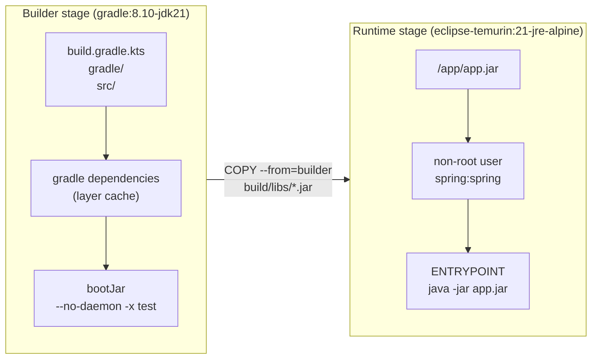
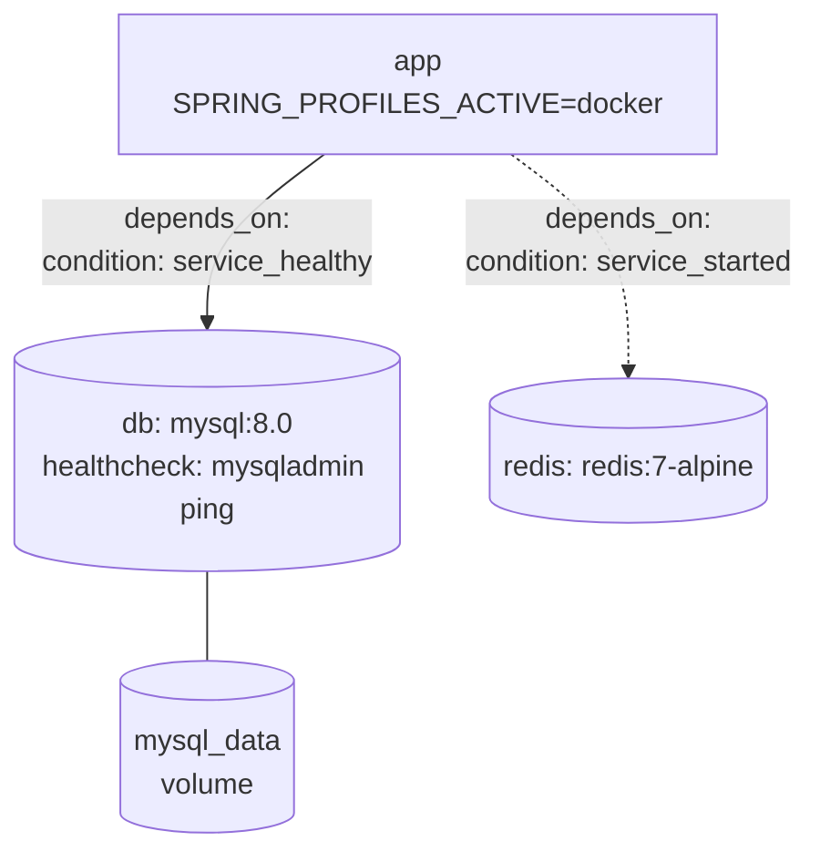
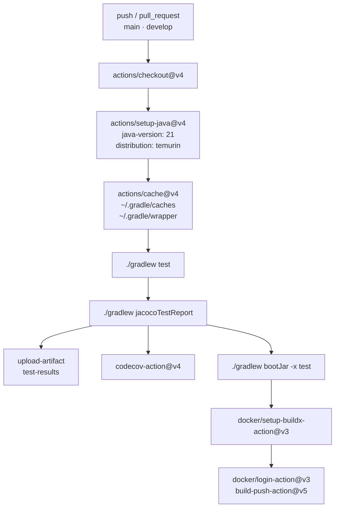
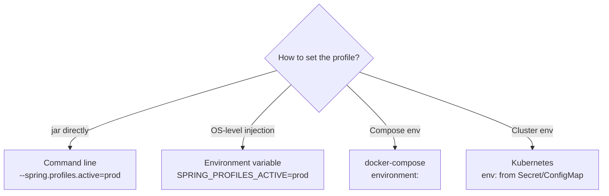

## Introduction

"I set up Docker but the DB connection keeps failing." That's the most common complaint right before submitting a pre-interview assignment. If a reviewer opens your repository and `docker-compose up -d` doesn't bring the app up cleanly, the quality of the code underneath never gets seen.

Part 5 covered Security & Authentication. Part 6 focuses on the deployment layer running on top of that. When a reviewer opens a repository, the first three things they check are the `Dockerfile`, the `docker-compose.yml`, and the execution instructions in `README.md`. Clean versions of all three create a positive first impression before a single line of application code is read.

The target reader is a junior backend developer who knows the basics of Docker and GitHub Actions but isn't sure which configuration choices are actually evaluated in a pre-interview assignment.

See the [previous post](/en/blog/spring-boot-pre-interview-guide-5) for Security & Authentication.

- Part 1 — [Core Application Layer](/en/blog/spring-boot-pre-interview-guide-1)
- Part 2 — [Database & Testing](/en/blog/spring-boot-pre-interview-guide-2)
- Part 3 — [Documentation & AOP](/en/blog/spring-boot-pre-interview-guide-3)
- Part 4 — [Performance & Optimization](/en/blog/spring-boot-pre-interview-guide-4)
- Part 5 — [Security & Authentication](/en/blog/spring-boot-pre-interview-guide-5)
- <strong>Part 6 — DevOps & Deployment (this post)</strong>
- Part 7 — [Advanced Patterns](/en/blog/spring-boot-pre-interview-guide-7)

---

## TL;DR

- <strong>Multi-stage Dockerfile is the baseline</strong> — Splitting into a `gradle:8.10-jdk21` Builder stage and an `eclipse-temurin:21-jre-alpine` Runtime stage cuts image size by more than half. Adding a non-root user tells the reviewer you are thinking about security.
- <strong>depends_on + healthcheck is the key combination</strong> — Only `depends_on: condition: service_healthy` guarantees that the DB is actually ready to accept queries. Using `depends_on` alone means the app can start connecting before MySQL finishes initializing.
- <strong>GitHub Actions Gradle cache + JaCoCo</strong> — Caching `~/.gradle/caches` with `actions/cache@v4` significantly reduces build time. Adding Codecov upload gives you an automatic coverage report on every PR.
- <strong>Profile-separated application.yml</strong> — Splitting into `local` (H2), `docker` (MySQL via env vars), and `prod` (Hikari pool settings) lets a reviewer run the project without any manual configuration.
- <strong>Actuator health + prometheus endpoints</strong> — `/actuator/health` can hook directly into the Docker Compose `healthcheck`. `/actuator/prometheus` becomes a Prometheus scrape target. A custom `HealthIndicator` and `MeterRegistry` usage earns bonus credit.

---

## 1. Docker — The First Place a Reviewer Looks

### 1.1 Basic Dockerfile

> <strong>Note</strong>: Spring Boot 4 + Kotlin 2.3 project setup (kotlin-spring, kotlin-jpa plugins, etc.) is covered in §1.1 of Part 1. Part 6 focuses on the DevOps and deployment layer that runs on top of that. The Kotlin 2.x line is backward-compatible — the same code works on 2.0 through 2.3.

A single-stage Dockerfile is the fastest to write, but it bundles the full JDK into the runtime image and results in a large image. Use it only for quick validation in early development.

```dockerfile
FROM eclipse-temurin:21-jdk-alpine

WORKDIR /app

COPY build/libs/*.jar app.jar

EXPOSE 8080

ENTRYPOINT ["java", "-jar", "app.jar"]
```

### 1.2 Multi-Stage Build

Separate the build stage from the runtime stage. The Builder stage produces the JAR; the Runtime stage only needs a JRE.



```dockerfile
# Build stage
FROM gradle:8.10-jdk21 AS builder

WORKDIR /app

# Copy only gradle files first for dependency caching
COPY build.gradle.kts settings.gradle.kts ./
COPY gradle ./gradle

# Download dependencies (leverage cache)
RUN gradle dependencies --no-daemon || true

# Copy source code and build
COPY src ./src
RUN gradle bootJar --no-daemon -x test

# Runtime stage
FROM eclipse-temurin:21-jre-alpine

WORKDIR /app

# Copy only the built jar file
COPY --from=builder /app/build/libs/*.jar app.jar

# Security: run as non-root user
RUN addgroup -S spring && adduser -S spring -G spring
USER spring:spring

EXPOSE 8080

ENTRYPOINT ["java", "-jar", "app.jar"]
```

<details>
<summary><strong>Aside — Image Size Comparison</strong></summary>

| Method | Base Image | Estimated Size |
|------|-------------|----------|
| JDK + Full Source | eclipse-temurin:21-jdk | ~500MB |
| JDK + JAR Only | eclipse-temurin:21-jdk-alpine | ~350MB |
| JRE + JAR Only | eclipse-temurin:21-jre-alpine | ~200MB |

<strong>Tip</strong>: `-alpine` images are smaller, but may have compatibility issues with some native libraries.

</details>

### 1.3 .dockerignore

```plaintext
# .dockerignore
.git
.gitignore
.idea
*.iml
.gradle
build
!build/libs/*.jar
node_modules
*.md
docker-compose*.yml
Dockerfile*
```

### 1.4 Build and Run

```bash
# Build JAR (skip tests)
./gradlew bootJar -x test

# Build Docker image
docker build -t my-app:latest .

# Run container
docker run -d -p 8080:8080 --name my-app my-app:latest

# Check logs
docker logs -f my-app
```

<details>
<summary><strong>Aside — JIB vs Dockerfile</strong></summary>

| Method | Pros | Cons |
|------|------|------|
| <strong>Dockerfile</strong> | High flexibility, standard approach | Requires Docker daemon, manual optimization |
| <strong>JIB</strong> | No Docker daemon needed, automatic layer optimization, fast builds | Depends on Gradle/Maven plugin |

<strong>JIB Configuration Example</strong>:

```kotlin
// build.gradle.kts
plugins {
    id("com.google.cloud.tools.jib") version "3.4.0"
}

jib {
    from {
        image = "eclipse-temurin:21-jre-alpine"
    }
    to {
        image = "my-app"
        tags = setOf("latest", project.version.toString())
    }
    container {
        jvmFlags = listOf("-Xms512m", "-Xmx512m")
        ports = listOf("8080")
    }
}
```

```bash
# Build to local Docker without a Docker daemon
./gradlew jibDockerBuild
```

<strong>Recommended for assignments</strong>: Dockerfile is more universal and easier to understand

</details>

---

## 2. Docker Compose — Dependencies and Startup Order

### 2.1 Basic Configuration (App + MySQL)

Using `depends_on` alone only guarantees that the MySQL container process has started — it gives no assurance that MySQL is actually ready to accept queries. Pairing it with `healthcheck` and `condition: service_healthy` ensures the app starts only after the DB is truly ready.



```yaml
# docker-compose.yml
services:
  app:
    build:
      context: .
      dockerfile: Dockerfile
    ports:
      - "8080:8080"
    environment:
      - SPRING_PROFILES_ACTIVE=docker
      - SPRING_DATASOURCE_URL=jdbc:mysql://db:3306/myapp?useSSL=false&allowPublicKeyRetrieval=true
      - SPRING_DATASOURCE_USERNAME=root
      - SPRING_DATASOURCE_PASSWORD=password
    depends_on:
      db:
        condition: service_healthy
    restart: unless-stopped

  db:
    image: mysql:8.0
    ports:
      - "3306:3306"
    environment:
      - MYSQL_ROOT_PASSWORD=password
      - MYSQL_DATABASE=myapp
    volumes:
      - mysql_data:/var/lib/mysql
      - ./init.sql:/docker-entrypoint-initdb.d/init.sql
    healthcheck:
      test: ["CMD", "mysqladmin", "ping", "-h", "localhost"]
      interval: 10s
      timeout: 5s
      retries: 5

volumes:
  mysql_data:
```

### 2.2 With Redis

Redis is ready to accept connections immediately after starting, so `service_started` is sufficient. Unlike MySQL, it has no initialization phase.

```yaml
# docker-compose.yml
services:
  app:
    build: .
    ports:
      - "8080:8080"
    environment:
      - SPRING_PROFILES_ACTIVE=docker
      - SPRING_DATASOURCE_URL=jdbc:mysql://db:3306/myapp?useSSL=false&allowPublicKeyRetrieval=true
      - SPRING_DATASOURCE_USERNAME=root
      - SPRING_DATASOURCE_PASSWORD=password
      - SPRING_DATA_REDIS_HOST=redis
      - SPRING_DATA_REDIS_PORT=6379
    depends_on:
      db:
        condition: service_healthy
      redis:
        condition: service_started

  db:
    image: mysql:8.0
    environment:
      - MYSQL_ROOT_PASSWORD=password
      - MYSQL_DATABASE=myapp
    volumes:
      - mysql_data:/var/lib/mysql
    healthcheck:
      test: ["CMD", "mysqladmin", "ping", "-h", "localhost"]
      interval: 10s
      timeout: 5s
      retries: 5

  redis:
    image: redis:7-alpine
    ports:
      - "6379:6379"

volumes:
  mysql_data:
```

### 2.3 Development Configuration — DB Only

Use this when running the app from an IDE locally and only spinning up the DB in Docker.

```yaml
# docker-compose.dev.yml
services:
  db:
    image: mysql:8.0
    ports:
      - "3306:3306"
    environment:
      - MYSQL_ROOT_PASSWORD=password
      - MYSQL_DATABASE=myapp
    volumes:
      - mysql_data:/var/lib/mysql

volumes:
  mysql_data:
```

### 2.4 Common Commands

```bash
# Start all services
docker-compose up -d

# Build and start
docker-compose up -d --build

# Check logs
docker-compose logs -f app

# Start a specific service only
docker-compose up -d db

# Stop and remove services
docker-compose down

# Remove volumes as well
docker-compose down -v
```

<details>
<summary><strong>Aside — depends_on, healthcheck, .env, service networking</strong></summary>

<strong>depends_on and healthcheck</strong>:
- `depends_on` alone only guarantees container startup order
- Use `healthcheck` + `condition: service_healthy` to ensure the service is actually ready

<strong>Environment Variable Management</strong>:
```yaml
# Using .env file
services:
  db:
    environment:
      - MYSQL_ROOT_PASSWORD=${DB_PASSWORD}
```

```bash
# .env file
DB_PASSWORD=secure_password
```

<strong>Networking</strong>:
- Services within the same docker-compose can communicate using service names
- Example: `jdbc:mysql://db:3306/myapp` (db is the service name)

</details>

---

## 3. GitHub Actions — The CI Pipeline

GitHub Actions works by creating a `.github/workflows/` directory in your repository and adding a YAML file. Since pre-interview assignments are almost always on GitHub, you can set up CI without any external infrastructure.



### 3.1 Basic CI Pipeline

```yaml
# .github/workflows/ci.yml
name: CI

on:
  push:
    branches: [ main, develop ]
  pull_request:
    branches: [ main, develop ]

jobs:
  build:
    runs-on: ubuntu-latest

    steps:
      - name: Checkout
        uses: actions/checkout@v4

      - name: Set up JDK 21
        uses: actions/setup-java@v4
        with:
          java-version: '21'
          distribution: 'temurin'

      - name: Grant execute permission for gradlew
        run: chmod +x gradlew

      - name: Cache Gradle packages
        uses: actions/cache@v4
        with:
          path: |
            ~/.gradle/caches
            ~/.gradle/wrapper
          key: ${{ runner.os }}-gradle-${{ hashFiles('**/*.gradle*', '**/gradle-wrapper.properties') }}
          restore-keys: |
            ${{ runner.os }}-gradle-

      - name: Build with Gradle
        run: ./gradlew build

      - name: Run tests
        run: ./gradlew test

      - name: Upload test results
        uses: actions/upload-artifact@v4
        if: always()
        with:
          name: test-results
          path: build/reports/tests/
```

### 3.2 With Test Coverage — JaCoCo

Attaching JaCoCo to CI generates a coverage report on every PR. Adding Codecov integration surfaces that coverage as a badge on the repository.

```kotlin
// build.gradle.kts
plugins {
    jacoco
}

jacoco {
    toolVersion = "0.8.11"
}

tasks.jacocoTestReport {
    dependsOn(tasks.test)
    reports {
        xml.required.set(true)
        html.required.set(true)
    }
}

tasks.test {
    finalizedBy(tasks.jacocoTestReport)
}
```

```yaml
# .github/workflows/ci.yml
name: CI

on:
  push:
    branches: [ main, develop ]
  pull_request:
    branches: [ main, develop ]

jobs:
  build:
    runs-on: ubuntu-latest

    steps:
      - name: Checkout
        uses: actions/checkout@v4

      - name: Set up JDK 21
        uses: actions/setup-java@v4
        with:
          java-version: '21'
          distribution: 'temurin'

      - name: Grant execute permission for gradlew
        run: chmod +x gradlew

      - name: Cache Gradle packages
        uses: actions/cache@v4
        with:
          path: |
            ~/.gradle/caches
            ~/.gradle/wrapper
          key: ${{ runner.os }}-gradle-${{ hashFiles('**/*.gradle*', '**/gradle-wrapper.properties') }}
          restore-keys: |
            ${{ runner.os }}-gradle-

      - name: Build and Test with Coverage
        run: ./gradlew test jacocoTestReport

      - name: Upload test results
        uses: actions/upload-artifact@v4
        if: always()
        with:
          name: test-results
          path: build/reports/tests/

      - name: Upload coverage to Codecov
        uses: codecov/codecov-action@v4
        with:
          file: build/reports/jacoco/test/jacocoTestReport.xml
          fail_ci_if_error: false
```

### 3.3 Docker Image Build and Push

On a merge to main or a tag push, this workflow automatically builds and pushes to Docker Hub. `docker/metadata-action` automatically generates image tags from the branch name, version tag, or commit SHA.

```yaml
# .github/workflows/docker.yml
name: Docker Build and Push

on:
  push:
    branches: [ main ]
    tags: [ 'v*' ]

jobs:
  build:
    runs-on: ubuntu-latest

    steps:
      - name: Checkout
        uses: actions/checkout@v4

      - name: Set up JDK 21
        uses: actions/setup-java@v4
        with:
          java-version: '21'
          distribution: 'temurin'

      - name: Build JAR
        run: ./gradlew bootJar -x test

      - name: Set up Docker Buildx
        uses: docker/setup-buildx-action@v3

      - name: Login to Docker Hub
        uses: docker/login-action@v3
        with:
          username: ${{ secrets.DOCKER_USERNAME }}
          password: ${{ secrets.DOCKER_PASSWORD }}

      - name: Extract metadata
        id: meta
        uses: docker/metadata-action@v5
        with:
          images: ${{ secrets.DOCKER_USERNAME }}/my-app
          tags: |
            type=ref,event=branch
            type=semver,pattern={{version}}
            type=sha,prefix=

      - name: Build and push
        uses: docker/build-push-action@v5
        with:
          context: .
          push: true
          tags: ${{ steps.meta.outputs.tags }}
          cache-from: type=gha
          cache-to: type=gha,mode=max
```

<details>
<summary><strong>Aside — GitHub Actions vs Jenkins vs GitLab CI</strong></summary>

| Tool | Pros | Cons |
|------|------|------|
| <strong>GitHub Actions</strong> | GitHub integration, free tier, marketplace | GitHub lock-in |
| <strong>Jenkins</strong> | Flexibility, rich plugins | Complex setup, infrastructure required |
| <strong>GitLab CI</strong> | GitLab integration, built-in | GitLab lock-in |

<strong>Recommended for assignments</strong>: If the project is managed on GitHub, GitHub Actions is the simplest option

</details>

<details>
<summary><strong>Aside — GitHub Actions Tips</strong></summary>

<strong>Secrets Configuration</strong>:
- Repository → Settings → Secrets and variables → Actions
- Store sensitive information like `DOCKER_USERNAME`, `DOCKER_PASSWORD`, etc.

<strong>Leveraging Cache</strong>:
- Reduce build time with Gradle dependency caching
- Use `actions/cache@v4`

<strong>Conditional Execution</strong>:
```yaml
- name: Deploy
  if: github.ref == 'refs/heads/main'
  run: ./deploy.sh
```

<strong>Matrix Builds</strong>:
```yaml
strategy:
  matrix:
    java: [21]
steps:
  - uses: actions/setup-java@v4
    with:
      java-version: ${{ matrix.java }}
```

</details>

---

## 4. Profile Management — Separating Configuration by Environment

### 4.1 Environment-Specific File Layout

```text
src/main/resources/
├── application.yml           # Common settings
├── application-local.yml     # Local development
├── application-dev.yml       # Development server
├── application-docker.yml    # Docker environment
├── application-prod.yml      # Production environment
└── application-test.yml      # Testing
```

### 4.2 Common Settings (application.yml)

```yaml
# application.yml
spring:
  application:
    name: my-app
  jpa:
    open-in-view: false
    properties:
      hibernate:
        default_batch_fetch_size: 100

server:
  port: 8080

logging:
  level:
    root: INFO
```

### 4.3 Environment-Specific Settings

```yaml
# application-local.yml
spring:
  datasource:
    url: jdbc:h2:mem:testdb
    driver-class-name: org.h2.Driver
    username: sa
    password:
  h2:
    console:
      enabled: true
  jpa:
    hibernate:
      ddl-auto: create-drop
    show-sql: true

logging:
  level:
    org.hibernate.SQL: DEBUG
    com.example: DEBUG
```

```yaml
# application-docker.yml
spring:
  datasource:
    url: jdbc:mysql://${DB_HOST:db}:${DB_PORT:3306}/${DB_NAME:myapp}?useSSL=false&allowPublicKeyRetrieval=true
    driver-class-name: com.mysql.cj.jdbc.Driver
    username: ${DB_USERNAME:root}
    password: ${DB_PASSWORD:password}
  jpa:
    hibernate:
      ddl-auto: validate
    show-sql: false

logging:
  level:
    root: INFO
    com.example: INFO
```

```yaml
# application-prod.yml
spring:
  datasource:
    url: ${DB_URL}
    username: ${DB_USERNAME}
    password: ${DB_PASSWORD}
    hikari:
      maximum-pool-size: 20
      minimum-idle: 5
  jpa:
    hibernate:
      ddl-auto: none
    show-sql: false

logging:
  level:
    root: WARN
    com.example: INFO

server:
  shutdown: graceful

management:
  endpoints:
    web:
      exposure:
        include: health,info,prometheus
```

### 4.4 Activating Profiles

```bash
# Command line
java -jar app.jar --spring.profiles.active=prod

# Environment variable
export SPRING_PROFILES_ACTIVE=prod
java -jar app.jar

# Docker
docker run -e SPRING_PROFILES_ACTIVE=docker my-app

# Docker Compose
environment:
  - SPRING_PROFILES_ACTIVE=docker
```



<details>
<summary><strong>Aside — Environment Variables vs application.yml</strong></summary>

| Method | Pros | Cons | When to Use |
|------|------|------|----------|
| <strong>application.yml</strong> | Version controlled, readable | Fixed at build time | Default settings, non-sensitive info |
| <strong>Environment Variables</strong> | Runtime changes, sensitive info separation | Hard to manage | Passwords, API keys, etc. |

<strong>Recommended Pattern</strong>:
- Set default values in application.yml
- Override sensitive information with environment variables
- Provide default values using `${DB_PASSWORD:default}` syntax

</details>

---

## 5. Actuator & Monitoring — Exposing Health and Metrics

### 5.1 Actuator Configuration

```kotlin
// settings.gradle.kts
dependencyResolutionManagement {
    versionCatalogs {
        create("libs") {
            library("spring-boot-starter-actuator", "org.springframework.boot:spring-boot-starter-actuator:3.4.0")
            library("micrometer-registry-prometheus", "io.micrometer:micrometer-registry-prometheus:1.14.0")
        }
    }
}
```

```kotlin
// build.gradle.kts
dependencies {
    implementation(libs.spring.boot.starter.actuator)
    implementation(libs.micrometer.registry.prometheus)
}
```

```yaml
# application.yml
management:
  endpoints:
    web:
      exposure:
        include: health,info,metrics,prometheus
      base-path: /actuator
  endpoint:
    health:
      show-details: when_authorized
  info:
    env:
      enabled: true

info:
  app:
    name: ${spring.application.name}
    version: 1.0.0
    description: My Spring Boot Application
```

### 5.2 Custom Health Check — HealthIndicator

Spring Boot Actuator automatically provides a basic DB health check, but you can add custom health checks for business-specific concerns.

```kotlin
@Component
class CustomHealthIndicator(
    private val dataSource: DataSource
) : HealthIndicator {

    override fun health(): Health {
        return try {
            dataSource.connection.use { connection ->
                if (connection.isValid(1)) {
                    Health.up()
                        .withDetail("database", "Available")
                        .build()
                } else {
                    Health.down().build()
                }
            }
        } catch (e: SQLException) {
            Health.down()
                .withDetail("database", "Unavailable")
                .withException(e)
                .build()
        }
    }
}
```

### 5.3 Prometheus Metrics

The `micrometer-registry-prometheus` dependency was added in §5.1. Expose the endpoint in application.yml so Prometheus can scrape `/actuator/prometheus`.

```yaml
# application.yml
management:
  endpoints:
    web:
      exposure:
        include: health,info,prometheus
  metrics:
    tags:
      application: ${spring.application.name}
```

### 5.4 Custom Metrics — MeterRegistry

Record business events as metrics. Initialize the counter and timer as `val` properties directly in the primary constructor — no `@PostConstruct` or nullable fields needed.

```kotlin
@Component
class OrderMetrics(
    meterRegistry: MeterRegistry
) {
    private val orderCounter: Counter = Counter.builder("orders.created")
        .description("Number of orders created")
        .register(meterRegistry)

    private val orderProcessingTimer: Timer = Timer.builder("orders.processing.time")
        .description("Order processing time")
        .register(meterRegistry)

    fun incrementOrderCount() {
        orderCounter.increment()
    }

    fun recordProcessingTime(milliseconds: Long) {
        orderProcessingTimer.record(Duration.ofMillis(milliseconds))
    }
}
```

### 5.5 Graceful Shutdown

Setting `server.shutdown: graceful` tells Spring Boot to wait for in-flight requests to complete before shutting down. Add `@PreDestroy` to attach any extra cleanup logic.

```yaml
# application.yml
server:
  shutdown: graceful

spring:
  lifecycle:
    timeout-per-shutdown-phase: 30s
```

```kotlin
@Component
class GracefulShutdownHandler {

    private val log = LoggerFactory.getLogger(this::class.java)

    @PreDestroy
    fun onShutdown() {
        log.info("Application is shutting down gracefully...")
        // wait for in-progress tasks to finish
    }
}
```

### §5.X Aside: Actuator Security

<details>
<summary><strong>Aside — Actuator Security Configuration</strong></summary>

<strong>Limit exposed endpoints in production</strong>:
```yaml
management:
  endpoints:
    web:
      exposure:
        include: health,info,prometheus  # Only what's needed
```

<strong>Apply authentication</strong>:
```kotlin
@Bean
fun actuatorSecurity(http: HttpSecurity): SecurityFilterChain {
    return http
        .securityMatcher("/actuator/**")
        .authorizeHttpRequests { auth ->
            auth
                .requestMatchers("/actuator/health").permitAll()
                .requestMatchers("/actuator/**").hasRole("ADMIN")
        }
        .build()
}
```

<strong>Use a separate port</strong>:
```yaml
management:
  server:
    port: 9090  # Accessible only from internal network
```

</details>

---

## Recap

- <strong>Multi-stage Dockerfile + non-root user</strong> — Reduces image size and signals security awareness. A reviewer who sees a JRE runtime stage instead of a single JDK image reads it as "this person knows about optimization."
- <strong>depends_on + healthcheck combination</strong> — Using `depends_on` without `service_healthy` means the app can start connecting before the DB is ready, causing connection failures. This combination is the signal that you understand Docker properly.
- <strong>GitHub Actions Gradle cache + JaCoCo</strong> — Without caching, every build re-downloads all dependencies. JaCoCo + Codecov integration means coverage is recorded automatically on every push.
- <strong>Profile separation + environment variable injection</strong> — Splitting into `local` (H2), `docker`, and `prod` files with sensitive values injected as env vars is the baseline reviewers expect.
- <strong>Actuator health + prometheus exposure</strong> — `/actuator/health` can serve as the Docker Compose healthcheck target, and custom `HealthIndicator` plus `MeterRegistry` usage earns a "monitoring-aware" evaluation.

Part 7 covers event-driven architecture, asynchronous processing, and multi-module project structure. It walks through cross-module flows with Kafka and Spring Events, the practical differences between `@Async` and `CompletableFuture`, and the criteria for splitting a Gradle project into multiple modules.

### Checklist

| Item | Check |
|------|------|
| Is a Dockerfile written? | ⬜ |
| Does it use a multi-stage build? | ⬜ |
| Can the project run locally via Docker Compose? | ⬜ |
| Does it use the depends_on + healthcheck combination? | ⬜ |
| Are execution instructions specified in the README? | ⬜ |
| Is GitHub Actions CI configured? | ⬜ |
| Are profiles separated by environment? | ⬜ |
| Is sensitive information separated into environment variables? | ⬜ |
| Is the Actuator health endpoint enabled? | ⬜ |

### README Template

````markdown
## How to Run

### Local Execution (H2)

```bash
./gradlew bootRun --args='--spring.profiles.active=local'
```

### Docker Compose Execution

```bash
# Start all services
docker-compose up -d

# Check logs
docker-compose logs -f app

# Stop
docker-compose down
```

### Access Information

- API: http://localhost:8080
- Swagger: http://localhost:8080/swagger-ui.html
- H2 Console: http://localhost:8080/h2-console (local profile)
- Actuator: http://localhost:8080/actuator/health
````

---

## Appendix

<details>
<summary><strong>Common Mistakes on Assignments — 5 Types</strong></summary>

1. <strong>Docker Compose fails to run</strong>
   - Missing environment variables, port conflicts
   - Always test in a clean environment

2. <strong>Error when no profile is specified</strong>
   - Provide a default profile setting or H2 fallback
   - Configure application.yml to work with default behavior

3. <strong>GitHub Actions build failure</strong>
   - gradlew execution permission (`chmod +x`)
   - Do not ignore test failures (fix the issues)

4. <strong>Sensitive information exposure</strong>
   - Hard-coding actual passwords in application.yml
   - Pushing secrets to a public GitHub repository

5. <strong>Using depends_on without a healthcheck</strong>
   - MySQL may still be initializing when the app tries to connect
   - `condition: service_healthy` + `healthcheck` combination is required

</details>

<details>
<summary><strong>Blue-Green vs Rolling vs Canary Deployment</strong></summary>

| Strategy | Characteristics | Pros | Cons |
|------|------|------|------|
| <strong>Blue-Green</strong> | Switch between two environments | Instant rollback, zero downtime | Requires 2x resources |
| <strong>Rolling</strong> | Gradual replacement | Resource efficient | Slow rollback, version mixing |
| <strong>Canary</strong> | Apply to a subset only | Minimized risk | Complex implementation |

<strong>For assignments</strong>: You don't need to implement a deployment strategy, but mentioning it in the README can earn bonus points

</details>

<details>
<summary><strong>Prometheus + Grafana Monitoring Setup</strong></summary>

<strong>1. Spring Boot Actuator + Micrometer Configuration</strong>

Use the `spring-boot-starter-actuator` and `micrometer-registry-prometheus` dependencies added in §5.1.

```yaml
# application.yml
management:
  endpoints:
    web:
      exposure:
        include: health, info, prometheus, metrics
  endpoint:
    health:
      show-details: when_authorized
  metrics:
    tags:
      application: ${spring.application.name}
```

<strong>2. Add Prometheus/Grafana to Docker Compose</strong>

```yaml
# docker-compose.yml
services:
  app:
    build: .
    ports:
      - "8080:8080"
    environment:
      - SPRING_PROFILES_ACTIVE=docker

  prometheus:
    image: prom/prometheus:v2.45.0
    ports:
      - "9090:9090"
    volumes:
      - ./monitoring/prometheus.yml:/etc/prometheus/prometheus.yml
    command:
      - '--config.file=/etc/prometheus/prometheus.yml'

  grafana:
    image: grafana/grafana:10.0.0
    ports:
      - "3000:3000"
    environment:
      - GF_SECURITY_ADMIN_USER=admin
      - GF_SECURITY_ADMIN_PASSWORD=admin
    volumes:
      - grafana-data:/var/lib/grafana

volumes:
  grafana-data:
```

<strong>3. Prometheus Configuration File</strong>

```yaml
# monitoring/prometheus.yml
global:
  scrape_interval: 15s

scrape_configs:
  - job_name: 'spring-boot-app'
    metrics_path: '/actuator/prometheus'
    static_configs:
      - targets: ['app:8080']
```

<strong>4. Grafana Dashboard Setup</strong>

1. Access `http://localhost:3000` (admin/admin)
2. Data Sources → Add data source → Prometheus
3. URL: `http://prometheus:9090`
4. Import Dashboard → ID: `4701` (JVM Micrometer) or `11378` (Spring Boot Statistics)

<strong>For assignments</strong>: Implementing monitoring earns bonus points. At minimum, it is recommended to expose the `/actuator/health` endpoint.

</details>
