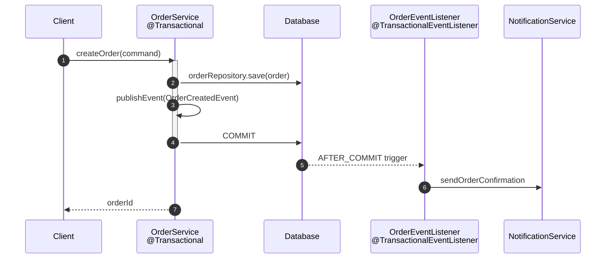
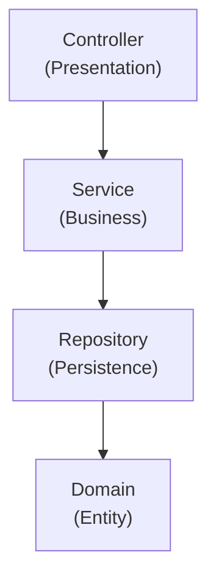
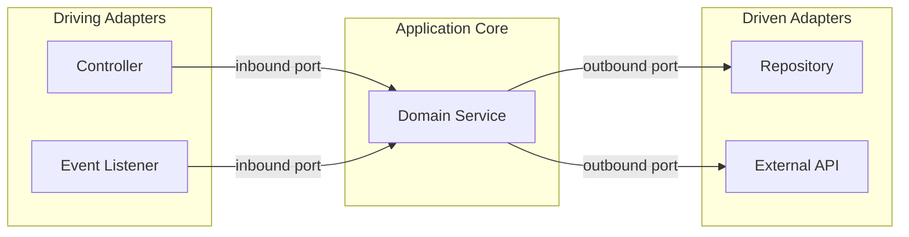
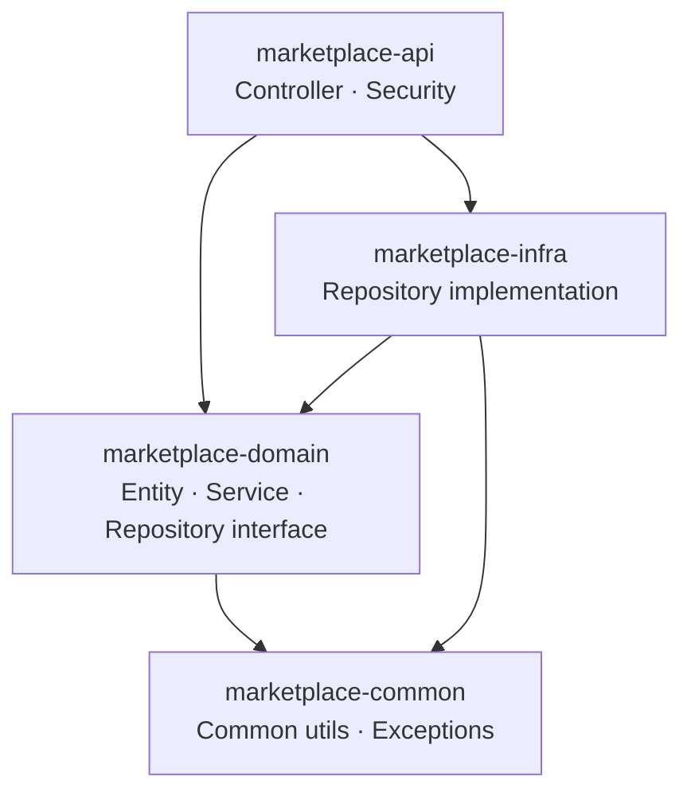
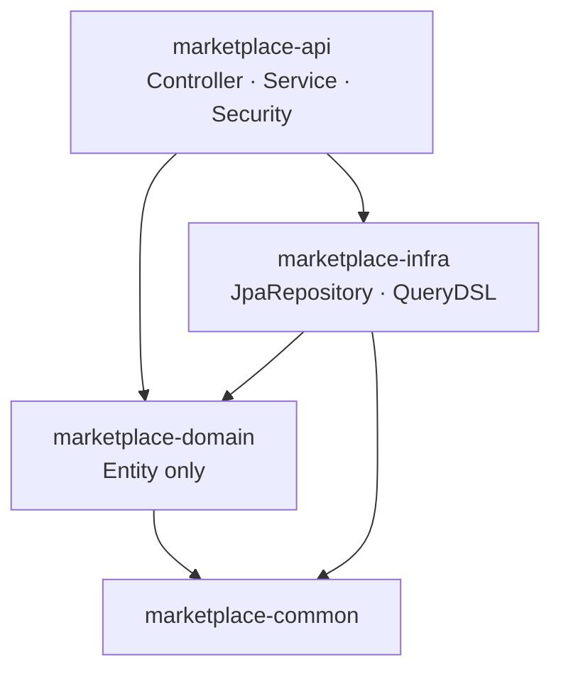

## Introduction

This is the final part of the series. Parts 1–6 covered everything from the Core Application Layer to DevOps & Deployment. Part 7 focuses on the advanced patterns that create a real differentiator. You don't need to apply all of them to a single assignment — the judgment to choose the right pattern for the right situation is itself a signal of design maturity.

Event-driven architecture, async processing, and file handling come up in most assignments in some form. API versioning and architecture patterns are worth documenting in the README even when simple choices are made — explaining *why* you chose an approach tells reviewers as much as the implementation itself. In multi-module projects, maintaining consistent dependency direction after the initial setup matters more than the setup itself.

The target reader is a junior backend developer who has a working Spring Boot assignment and wants to raise the quality bar on design and code structure.

See the [previous post](/en/blog/spring-boot-pre-interview-guide-6) for DevOps & Deployment.

- Part 1 — [Core Application Layer](/en/blog/spring-boot-pre-interview-guide-1)
- Part 2 — [Database & Testing](/en/blog/spring-boot-pre-interview-guide-2)
- Part 3 — [Documentation & AOP](/en/blog/spring-boot-pre-interview-guide-3)
- Part 4 — [Performance & Optimization](/en/blog/spring-boot-pre-interview-guide-4)
- Part 5 — [Security & Authentication](/en/blog/spring-boot-pre-interview-guide-5)
- Part 6 — [DevOps & Deployment](/en/blog/spring-boot-pre-interview-guide-6)
- <strong>Part 7 — Advanced Patterns (this post)</strong>

---

## TL;DR

- <strong>Event-driven architecture</strong> — `@TransactionalEventListener(phase = AFTER_COMMIT)` runs the listener only after the order is durably persisted, separating domain logic from side-effects like notifications.
- <strong>Async processing</strong> — `@Async` is proxy-based, so self-invocation always runs synchronously; always call from a different bean. `AsyncUncaughtExceptionHandler` is mandatory to catch silent failures.
- <strong>File handling</strong> — Validate extension, MIME type, and size before saving. Use UUID-based filenames and `normalize()` to defend against path traversal.
- <strong>API versioning</strong> — URI versioning (`/api/v1/...`) is the clearest choice and the most cache-friendly, test-friendly, and documentation-friendly.
- <strong>Multi-module</strong> — Pick Option A (Dependency Inversion Principle) or Option B (pragmatic) and stay consistent. Mixing them breaks dependency direction. In either option, domain → infra dependency is always forbidden.

---

## 1. Event-Driven Architecture — Separating Domain Logic from Side-Effects

### 1.1 Spring Events Basics

<strong>Event-driven architecture</strong> reduces coupling between domain logic and supplementary features like notifications and logging. When `OrderService` directly calls `NotificationService`, the two classes become tightly coupled. Placing an event in between means `OrderService` only publishes "an order was created" — what happens next is the listener's responsibility.

> <strong>Note</strong>: Spring Boot 4 + Kotlin 2.3 project setup (kotlin-spring, kotlin-jpa plugins, etc.) is covered in §1.1 of Part 1. Part 7 focuses on the Advanced Patterns layer that runs on top of that. The Kotlin 2.x line is backward-compatible — the same code works on 2.0 through 2.3.

```kotlin
// Event definition
data class OrderCreatedEvent(
    val orderId: Long,
    val memberId: Long,
    val totalAmount: Int,
    val occurredAt: LocalDateTime = LocalDateTime.now()
) {
    constructor(order: Order) : this(
        orderId = order.id!!,
        memberId = order.member.id!!,
        totalAmount = order.totalAmount
    )
}

// Event publishing
@Service
class OrderService(
    private val orderRepository: OrderRepository,
    private val eventPublisher: ApplicationEventPublisher
) {
    @Transactional
    fun createOrder(command: OrderCreateCommand): Long {
        val order = Order.create(command)
        orderRepository.save(order)

        eventPublisher.publishEvent(OrderCreatedEvent(order))

        return order.id!!
    }
}

// Event listener
@Component
class OrderEventListener(
    private val notificationService: NotificationService
) {
    private val log = LoggerFactory.getLogger(this::class.java)

    @EventListener
    fun handleOrderCreated(event: OrderCreatedEvent) {
        log.info("Order created: orderId={}, memberId={}", event.orderId, event.memberId)
        notificationService.sendOrderConfirmation(event.memberId, event.orderId)
    }
}
```

### 1.2 @TransactionalEventListener

`@EventListener` runs inside the same transaction. If the listener throws, the order save rolls back too. Notifications should only fire after the order is durably committed. `@TransactionalEventListener` solves exactly this.

```kotlin
@Component
class OrderEventListener(
    private val notificationService: NotificationService
) {
    /**
     * Runs after commit — notification only sent after order is confirmed
     */
    @TransactionalEventListener(phase = TransactionPhase.AFTER_COMMIT)
    fun handleOrderCreatedAfterCommit(event: OrderCreatedEvent) {
        notificationService.sendOrderConfirmation(event.memberId, event.orderId)
    }

    /**
     * Runs on rollback — for failure logging
     */
    @TransactionalEventListener(phase = TransactionPhase.AFTER_ROLLBACK)
    fun handleOrderCreatedOnRollback(event: OrderCreatedEvent) {
        // Failure logging
    }
}
```

The diagram below shows the `AFTER_COMMIT` flow. `publishEvent` is called inside the transaction, but the listener fires only after commit completes.



| Phase | Description | When to Use |
|-------|-------------|-------------|
| `AFTER_COMMIT` | After successful commit | Notifications, external system integration |
| `AFTER_ROLLBACK` | After rollback | Failure logging, compensating actions |
| `AFTER_COMPLETION` | Regardless of commit/rollback | Resource cleanup |
| `BEFORE_COMMIT` | Just before commit | Additional validation |

### 1.3 Async Event Processing

If the notification service depends on a slow external system, making the listener `@Async` prevents blocking the main thread.

```kotlin
@Component
class OrderEventListener(
    private val notificationService: NotificationService
) {
    @Async
    @TransactionalEventListener(phase = TransactionPhase.AFTER_COMMIT)
    fun handleOrderCreatedAsync(event: OrderCreatedEvent) {
        // Runs asynchronously, no impact on the main transaction
        notificationService.sendOrderConfirmation(event.memberId, event.orderId)
    }
}
```

<details>
<summary><strong>Events vs Direct Calls: Selection Criteria</strong></summary>

| Scenario | Recommended Approach | Reason |
|----------|---------------------|--------|
| Core business logic | Direct call | Clear flow, easy debugging |
| Supplementary features (notifications, logging) | Events | Loose coupling, easy to extend |
| External system integration | Events + Async | Main logic unaffected by failures |
| Multiple modules reacting | Events | Publisher doesn't need to know subscribers |

**Recommended for assignments**: Keep core logic as direct calls and separate notifications/logging into events — this signals good design to reviewers.

</details>

<details>
<summary><strong>Cautions When Using Events</strong></summary>

1. **Transaction boundary** — `@EventListener` runs in the same transaction; listener exceptions cause a full rollback.
2. **Circular references** — A → publish event → B listener → call A → infinite loop.
3. **Testing challenges** — Event publishing/subscribing needs verification. Use `@SpyBean` or test listeners.
4. **Debugging difficulty** — Flow tracing is harder with events. Ensure thorough logging.

</details>

---

## 2. Async Processing — @Async and CompletableFuture

### 2.1 @Async Configuration

<strong>@Async</strong> runs an annotated method in a separate thread. Add `@EnableAsync` to a `@Configuration` class and implement `AsyncConfigurer` to configure both the thread pool and the exception handler together. Skipping the exception handler means exceptions from void-returning methods disappear silently.

```kotlin
@Configuration
@EnableAsync
class AsyncConfig : AsyncConfigurer {

    override fun getAsyncExecutor(): Executor {
        val executor = ThreadPoolTaskExecutor()
        executor.corePoolSize = 5
        executor.maxPoolSize = 10
        executor.setQueueCapacity(100)
        executor.setThreadNamePrefix("async-")
        executor.setRejectedExecutionHandler(ThreadPoolExecutor.CallerRunsPolicy())
        executor.initialize()
        return executor
    }

    override fun getAsyncUncaughtExceptionHandler(): AsyncUncaughtExceptionHandler {
        return AsyncUncaughtExceptionHandler { ex, method, _ ->
            val log = LoggerFactory.getLogger(method.declaringClass)
            log.error("Async method {} threw exception: {}", method.name, ex.message, ex)
        }
    }
}
```

### 2.2 Using @Async

```kotlin
@Service
class NotificationService(
    private val emailSender: EmailSender,
    private val smsSender: SmsSender
) {
    private val log = LoggerFactory.getLogger(this::class.java)

    @Async
    fun sendOrderConfirmation(memberId: Long, orderId: Long) {
        log.info("Sending order confirmation: memberId={}, orderId={}", memberId, orderId)
        // Email sending (runs asynchronously)
        emailSender.send(memberId, "Order Confirmation", "Your order has been completed.")
    }

    @Async
    fun sendSmsAsync(phoneNumber: String, message: String): CompletableFuture<Boolean> {
        val result = smsSender.send(phoneNumber, message)
        return CompletableFuture.completedFuture(result)
    }
}
```

### 2.3 Using CompletableFuture

Running independent queries sequentially adds up their latencies. `CompletableFuture.supplyAsync` parallelizes them so only the slowest one determines the total wait time.

```kotlin
@Service
class ProductAggregationService(
    private val productService: ProductService,
    private val reviewService: ReviewService,
    private val inventoryService: InventoryService
) {
    /**
     * Fetch data from multiple services in parallel
     */
    fun getProductDetail(productId: Long): ProductDetailResponse {
        val productFuture = CompletableFuture.supplyAsync { productService.getProduct(productId) }
        val reviewsFuture = CompletableFuture.supplyAsync { reviewService.getReviews(productId) }
        val stockFuture = CompletableFuture.supplyAsync { inventoryService.getStock(productId) }

        // Wait for all async tasks to complete
        CompletableFuture.allOf(productFuture, reviewsFuture, stockFuture).join()

        return ProductDetailResponse.of(
            productFuture.join(),
            reviewsFuture.join(),
            stockFuture.join()
        )
    }

    /**
     * With timeout
     */
    fun getProductDetailWithTimeout(productId: Long): ProductDetailResponse {
        return try {
            val future = CompletableFuture.supplyAsync { getProductDetail(productId) }
            future.get(5, TimeUnit.SECONDS)
        } catch (e: TimeoutException) {
            throw ServiceTimeoutException("Product detail fetch timeout")
        } catch (e: Exception) {
            throw ServiceException("Failed to fetch product detail", e)
        }
    }
}
```

<details>
<summary><strong>Sync vs Async: Decision Guide</strong></summary>

| Scenario | Recommended Approach | Reason |
|----------|---------------------|--------|
| Result needed in response | Synchronous | Must wait for result |
| Result not needed in response | Asynchronous | Reduces response time |
| External API calls | Async (with timeout) | Unaffected by failures/delays |
| Transaction required | Synchronous | Transaction propagation is difficult |
| Multiple tasks in parallel | Asynchronous | Reduces processing time |

**In assignments**: Processing tasks like notification sending asynchronously (when not needed in the response) can earn a good evaluation.

</details>

<details>
<summary><strong>Cautions When Using @Async</strong></summary>

1. **Self-invocation doesn't work** — Proxy-based, so calling `@Async` methods from within the same class runs them synchronously. Always call from a different bean.
2. **No transaction propagation** — `@Async` methods run in a separate thread. Add `@Transactional` explicitly if a new transaction is needed.
3. **Exception handling** — Exceptions may be silently ignored with void return type. `AsyncUncaughtExceptionHandler` is essential.
4. **Thread pool exhaustion** — Set queue capacity and max thread count appropriately. Monitoring is required.

</details>

---

## 3. File Handling — Upload, Validation, and Storage Strategy

### 3.1 File Upload

<strong>MultipartFile</strong> is Spring's interface for extracting files from HTTP multipart requests. Accept it in the controller, pass it to the service, and validate before saving. Validating in the controller means the service can receive an incomplete file — keep validation in the service.

```kotlin
@RestController
@RequestMapping("/api/v1/files")
class FileController(
    private val fileService: FileService
) {
    @PostMapping(consumes = [MediaType.MULTIPART_FORM_DATA_VALUE])
    fun uploadFile(@RequestParam("file") file: MultipartFile): ResponseEntity<FileUploadResponse> {
        val response = fileService.upload(file)
        return ResponseEntity.status(HttpStatus.CREATED).body(response)
    }

    @PostMapping(value = ["/multiple"], consumes = [MediaType.MULTIPART_FORM_DATA_VALUE])
    fun uploadFiles(@RequestParam("files") files: List<MultipartFile>): ResponseEntity<List<FileUploadResponse>> {
        val responses = fileService.uploadMultiple(files)
        return ResponseEntity.status(HttpStatus.CREATED).body(responses)
    }
}
```

```kotlin
@Service
class FileService(
    @Value("\${file.upload-dir}") private val uploadDir: String
) {
    private val log = LoggerFactory.getLogger(this::class.java)

    companion object {
        private val ALLOWED_EXTENSIONS = setOf("jpg", "jpeg", "png", "gif", "pdf")
        private const val MAX_FILE_SIZE = 10L * 1024 * 1024 // 10MB
    }

    fun upload(file: MultipartFile): FileUploadResponse {
        validateFile(file)

        val originalFilename = file.originalFilename ?: "unknown"
        val extension = getExtension(originalFilename)
        val storedFilename = "${UUID.randomUUID()}.$extension"
        val filePath = Paths.get(uploadDir, storedFilename)

        try {
            Files.createDirectories(filePath.parent)
            file.transferTo(filePath)
            log.info("File uploaded: original={}, stored={}", originalFilename, storedFilename)
            return FileUploadResponse(storedFilename, originalFilename, file.size)
        } catch (e: IOException) {
            throw FileUploadException("Failed to upload file", e)
        }
    }

    private fun validateFile(file: MultipartFile) {
        if (file.isEmpty) throw InvalidFileException("File is empty")
        if (file.size > MAX_FILE_SIZE) throw InvalidFileException("File size exceeds limit")
        val extension = getExtension(file.originalFilename ?: "")
        if (extension.lowercase() !in ALLOWED_EXTENSIONS) {
            throw InvalidFileException("File type not allowed: $extension")
        }
    }

    private fun getExtension(filename: String): String =
        filename.substringAfterLast(".", "")
}
```

### 3.2 File Download

The most important security concern in file download is path traversal defense. Call `resolve().normalize()` to canonicalize the path, then verify the result stays inside the upload directory.

```kotlin
@GetMapping("/{filename}")
fun downloadFile(@PathVariable filename: String): ResponseEntity<Resource> {
    val resource = fileService.loadAsResource(filename)

    val contentDisposition = ContentDisposition.attachment()
        .filename(filename, StandardCharsets.UTF_8)
        .build()
        .toString()

    return ResponseEntity.ok()
        .header(HttpHeaders.CONTENT_DISPOSITION, contentDisposition)
        .contentType(MediaType.APPLICATION_OCTET_STREAM)
        .body(resource)
}
```

```kotlin
fun loadAsResource(filename: String): Resource {
    val filePath = Paths.get(uploadDir).resolve(filename).normalize()
    val resource = UrlResource(filePath.toUri())

    return if (resource.exists() && resource.isReadable) {
        resource
    } else {
        throw FileNotFoundException("File not found: $filename")
    }
}
```

### 3.3 External Storage (S3)

Local file storage is difficult to share across multiple servers. S3 offers high scalability and durability and integrates easily with CDNs. Showing S3 integration or an interface abstraction earns bonus credit in assignments.

```kotlin
// settings.gradle.kts
dependencyResolutionManagement {
    versionCatalogs {
        create("libs") {
            library("aws.sdk.s3", "software.amazon.awssdk:s3:2.21.0")
        }
    }
}
```

```kotlin
// build.gradle.kts
dependencies {
    implementation(libs.aws.sdk.s3)
}
```

```kotlin
@Configuration
class S3Config(
    @Value("\${aws.region}") private val region: String
) {
    @Bean
    fun s3Client(): S3Client = S3Client.builder()
        .region(Region.of(region))
        .build()
}
```

```kotlin
@Service
class S3FileService(
    private val s3Client: S3Client,
    @Value("\${aws.s3.bucket}") private val bucket: String
) {
    fun upload(file: MultipartFile): String {
        val key = "uploads/${UUID.randomUUID()}_${file.originalFilename}"

        val request = PutObjectRequest.builder()
            .bucket(bucket)
            .key(key)
            .contentType(file.contentType)
            .build()

        try {
            s3Client.putObject(request, RequestBody.fromInputStream(file.inputStream, file.size))
            return key
        } catch (e: IOException) {
            throw FileUploadException("Failed to upload to S3", e)
        }
    }

    fun download(key: String): ByteArray {
        val request = GetObjectRequest.builder()
            .bucket(bucket)
            .key(key)
            .build()

        return s3Client.getObject(request).use { it.readAllBytes() }
    }
}
```

<details>
<summary><strong>Local File vs Cloud Storage</strong></summary>

| Approach | Pros | Cons | When to Use |
|----------|------|------|-------------|
| **Local file** | Simple, no network cost | Difficult to share when scaling | Single server, development/testing |
| **S3/GCS** | Scalability, durability, CDN integration | Cost, network latency | Production, large-scale |

**Recommended for assignments**: Implement with local file system as the base, and add S3 integration or interface abstraction for bonus credit.

</details>

---

## 4. API Versioning — URI · Header · Accept

### 4.1 URI Versioning (Most Common)

<strong>URI versioning</strong> includes the version number in the URL path (`/api/v1/...`). The URL itself declares the version, making it easy to document, and browsers, caches, and tests all work without special configuration.

```kotlin
@RestController
@RequestMapping("/api/v1/products")
class ProductControllerV1 {

    @GetMapping("/{id}")
    fun getProduct(@PathVariable id: Long): ProductResponseV1 {
        // V1 response
    }
}

@RestController
@RequestMapping("/api/v2/products")
class ProductControllerV2 {

    @GetMapping("/{id}")
    fun getProduct(@PathVariable id: Long): ProductResponseV2 {
        // V2 response (added fields, etc.)
    }
}
```

### 4.2 Header Versioning

```kotlin
@RestController
@RequestMapping("/api/products")
class ProductController {

    @GetMapping(value = ["/{id}"], headers = ["X-API-VERSION=1"])
    fun getProductV1(@PathVariable id: Long): ProductResponseV1 {
        // V1 response
    }

    @GetMapping(value = ["/{id}"], headers = ["X-API-VERSION=2"])
    fun getProductV2(@PathVariable id: Long): ProductResponseV2 {
        // V2 response
    }
}
```

### 4.3 Accept Header Versioning

```kotlin
@RestController
@RequestMapping("/api/products")
class ProductController {

    @GetMapping(value = ["/{id}"], produces = ["application/vnd.myapp.v1+json"])
    fun getProductV1(@PathVariable id: Long): ProductResponseV1 {
        // V1 response
    }

    @GetMapping(value = ["/{id}"], produces = ["application/vnd.myapp.v2+json"])
    fun getProductV2(@PathVariable id: Long): ProductResponseV2 {
        // V2 response
    }
}
```

<details>
<summary><strong>Versioning Strategy Comparison</strong></summary>

| Approach | Pros | Cons |
|----------|------|------|
| **URI** | Clear, cache-friendly, easy to test | Requires URL changes |
| **Header** | Clean URLs | Difficult to test/document |
| **Accept** | RESTful | Complex, harder to understand |
| **Parameter** | Simple | Confused with optional parameters |

**Recommended for assignments**: URI versioning (`/api/v1/...`) is the clearest and most common approach.

</details>

---

## 5. Architecture Patterns — Layered · Hexagonal · CQRS

### 5.1 Layered Architecture (Default)

<strong>Layered architecture</strong> divides responsibilities across four layers: Controller → Service → Repository → Domain. This is the default structure used in most assignments.



### 5.2 Hexagonal Architecture (Ports and Adapters)

<strong>Hexagonal architecture</strong> places the Application Core at the center and treats external systems (controllers, databases, external APIs) as adapters. The Application Core knows only ports (interfaces) — it has no knowledge of specific technologies.



```
src/main/kotlin/com/example/
├── application/              # Application Layer
│   ├── port/
│   │   ├── in/              # Inbound Ports (Use Cases)
│   │   │   └── CreateOrderUseCase.kt
│   │   └── out/             # Outbound Ports
│   │       ├── OrderRepository.kt
│   │       └── PaymentGateway.kt
│   └── service/
│       └── OrderService.kt
├── domain/                   # Domain Layer
│   ├── Order.kt
│   └── OrderItem.kt
└── adapter/                  # Adapter Layer
    ├── in/
    │   └── web/
    │       └── OrderController.kt
    └── out/
        ├── persistence/
        │   └── OrderJpaAdapter.kt
        └── external/
            └── PaymentGatewayAdapter.kt
```

```kotlin
// Inbound Port (Use Case Interface)
interface CreateOrderUseCase {
    fun createOrder(command: CreateOrderCommand): Long
}

// Outbound Port
interface OrderRepository {
    fun save(order: Order): Order
    fun findById(id: Long): Optional<Order>
}

// Application Service
@Service
class OrderService(
    private val orderRepository: OrderRepository,  // Uses Port
    private val paymentGateway: PaymentGateway     // Uses Port
) : CreateOrderUseCase {

    @Transactional
    override fun createOrder(command: CreateOrderCommand): Long {
        val order = Order.create(command)
        orderRepository.save(order)
        paymentGateway.process(order)
        return order.id!!
    }
}

// Outbound Adapter
@Repository
class OrderJpaAdapter(
    private val jpaRepository: OrderJpaRepository
) : OrderRepository {

    override fun save(order: Order): Order = jpaRepository.save(order)

    override fun findById(id: Long): Optional<Order> = jpaRepository.findById(id)
}
```

### 5.3 CQRS (Command Query Responsibility Segregation)

<strong>CQRS</strong> separates commands (writes) and queries (reads) into distinct models. When a single Service class mixes `@Transactional` and `@Transactional(readOnly = true)`, the read path carries unnecessary write overhead.

```
src/main/kotlin/com/example/order/
├── command/                  # Command (Write)
│   ├── CreateOrderCommand.kt
│   ├── OrderCommandService.kt
│   └── OrderCommandRepository.kt
└── query/                    # Query (Read)
    ├── OrderQueryService.kt
    ├── OrderQueryRepository.kt
    └── OrderDetailResponse.kt
```

```kotlin
// Command Service (Write)
@Service
@Transactional
class OrderCommandService(
    private val orderRepository: OrderRepository
) {
    fun createOrder(command: CreateOrderCommand): Long {
        val order = Order.create(command)
        return orderRepository.save(order).id!!
    }

    fun cancelOrder(orderId: Long) {
        val order = orderRepository.findById(orderId)
            ?: throw OrderNotFoundException(orderId)
        order.cancel()
    }
}

// Query Service (Read)
@Service
@Transactional(readOnly = true)
class OrderQueryService(
    private val queryRepository: OrderQueryRepository
) {
    fun getOrderDetail(orderId: Long): OrderDetailResponse =
        queryRepository.findOrderDetail(orderId)
            ?: throw OrderNotFoundException(orderId)

    fun getMyOrders(memberId: Long, pageable: Pageable): Page<OrderSummaryResponse> =
        queryRepository.findOrdersByMemberId(memberId, pageable)
}
```

<details>
<summary><strong>Beware of Architecture Over-Engineering</strong></summary>

**Architecture selection for assignments**:

| Assignment Scale | Recommended Architecture |
|-----------------|------------------------|
| Simple CRUD | Layered (Controller-Service-Repository) |
| Complex domain | Layered + DDD elements (domain services, value objects) |
| Read/write separation needed | Partial CQRS adoption |

**Caution**: Assignments typically need to be completed within 1–2 weeks. Excessive abstraction can actually lead to point deductions. State your architecture choice rationale in the README.

**When to apply Hexagonal**: Assignments with many external system integrations, where testability is emphasized, or when clean architecture is explicitly required.

</details>

---

## 6. Multi-Module Projects — Option A vs Option B

### 6.1 What is Multi-Module?

<strong>Multi-module</strong> splits a single Gradle project into sub-modules to separate concerns and enforce dependency direction at the build system level — not just at the code level. That enforcement is what distinguishes it from a single module.

```
marketplace/
├── build.gradle.kts (root)
├── settings.gradle.kts
├── marketplace-api/           # API module (Controller, execution)
├── marketplace-domain/        # Domain module (Entity, Service)
├── marketplace-infra/         # Infrastructure module (Repository, external integration)
└── marketplace-common/        # Common module (Utils, Exception)
```

### 6.2 Multi-Module Structure Options

There are two approaches to multi-module design. Choose one before starting and apply it consistently — mixing them breaks dependency direction.

| Option | Characteristics | Service Location | Repository Handling |
|--------|----------------|-----------------|-------------------|
| **Option A (Canonical)** | Strict DIP applied | domain module | Interface/implementation separation |
| **Option B (Simplified)** | Pragmatic approach | api module | Direct JpaRepository usage |

<details>
<summary><strong>Which option should you choose?</strong></summary>

**When to choose Option A**: Clean architecture is explicitly required; many external integrations (payments, notifications) make test isolation important; domain logic must be fully decoupled from infrastructure technology.

**When to choose Option B**: A pragmatic and simple structure is wanted; JPA/QueryDSL is used directly in the domain layer; the Repository wrapper layer only does simple delegation.

For most assignments, **Option B** is sufficient and helps avoid over-engineering.

</details>

### 6.3 Gradle Setup (Kotlin DSL)

Kotlin doesn't use Lombok. Kotlin primary constructors with `val` parameters naturally replace everything Lombok provides.

```kotlin
// settings.gradle.kts
rootProject.name = "marketplace"

include("marketplace-api")
include("marketplace-domain")
include("marketplace-infra")
include("marketplace-common")
```

```kotlin
// build.gradle.kts (root)
plugins {
    kotlin("jvm") version "2.3" apply false
    kotlin("plugin.spring") version "2.3" apply false
    kotlin("plugin.jpa") version "2.3" apply false
    id("org.springframework.boot") version "4.0.0" apply false
    id("io.spring.dependency-management") version "1.1.4" apply false
}

allprojects {
    group = "com.example"
    version = "1.0.0"

    repositories {
        mavenCentral()
    }
}

subprojects {
    apply(plugin = "org.jetbrains.kotlin.jvm")
    apply(plugin = "io.spring.dependency-management")

    kotlin {
        jvmToolchain(21)
    }

    the<io.spring.gradle.dependencymanagement.dsl.DependencyManagementExtension>().apply {
        imports {
            mavenBom("org.springframework.boot:spring-boot-dependencies:4.0.0")
        }
    }

    dependencies {
        "testImplementation"("org.springframework.boot:spring-boot-starter-test")
    }

    tasks.withType<Test> {
        useJUnitPlatform()
    }
}

tasks.named<org.springframework.boot.gradle.tasks.bundling.BootJar>("bootJar") {
    enabled = false
}

tasks.named<Jar>("jar") {
    enabled = false
}
```

#### marketplace-common (Common Module)

```kotlin
// marketplace-common/build.gradle.kts
dependencies {
    // Only common utilities
}
```

```
marketplace-common/
└── src/main/kotlin/com/example/common/
    ├── exception/
    │   ├── BusinessException.kt
    │   ├── ErrorCode.kt
    │   └── ErrorResponse.kt
    └── util/
        └── DateUtils.kt
```

#### marketplace-domain (Domain Module)

```kotlin
// marketplace-domain/build.gradle.kts
dependencies {
    implementation(project(":marketplace-common"))

    // JPA
    implementation("org.springframework.boot:spring-boot-starter-data-jpa")

    // Validation
    implementation("org.springframework.boot:spring-boot-starter-validation")
}
```

<details>
<summary><strong>Option A (Canonical) — Entity, Service, Repository Interface</strong></summary>

```
marketplace-domain/
└── src/main/kotlin/com/example/domain/
    ├── member/
    │   ├── Member.kt
    │   ├── MemberRepository.kt (interface)
    │   └── MemberService.kt
    ├── product/
    │   ├── Product.kt
    │   ├── ProductRepository.kt (interface)
    │   └── ProductService.kt
    └── order/
        ├── Order.kt
        ├── OrderRepository.kt (interface)
        └── OrderService.kt
```

</details>

<details>
<summary><strong>Option B (Simplified) — Entity Only</strong></summary>

```
marketplace-domain/
└── src/main/kotlin/com/example/domain/
    ├── common/
    │   └── BaseEntity.kt
    ├── member/
    │   ├── Member.kt
    │   └── Role.kt
    ├── product/
    │   ├── Product.kt
    │   ├── ProductImage.kt
    │   └── ProductStatus.kt
    ├── order/
    │   ├── Order.kt
    │   ├── OrderItem.kt
    │   └── OrderStatus.kt
    └── category/
        └── Category.kt
```

Services live in the api module, and Repositories directly use JpaRepository from the infra module.

</details>

#### marketplace-infra (Infrastructure Module)

QueryDSL follows the kapt pattern from §5.2 of Part 4. Use `kapt` instead of `annotationProcessor` to generate Q-classes from Kotlin source files.

```kotlin
// marketplace-infra/build.gradle.kts
plugins {
    kotlin("kapt") version "2.3"
}

dependencies {
    implementation(project(":marketplace-common"))
    implementation(project(":marketplace-domain"))

    // JPA implementation
    implementation("org.springframework.boot:spring-boot-starter-data-jpa")
    runtimeOnly("com.h2database:h2")
    runtimeOnly("com.mysql:mysql-connector-j")

    // QueryDSL (optional)
    implementation("com.querydsl:querydsl-jpa:5.0.0:jakarta")
    kapt("com.querydsl:querydsl-apt:5.0.0:jakarta")
    kapt("jakarta.annotation:jakarta.annotation-api")
    kapt("jakarta.persistence:jakarta.persistence-api")

    // Redis (optional)
    implementation("org.springframework.boot:spring-boot-starter-data-redis")
}
```

<details>
<summary><strong>Option A (Canonical) — Repository Implementation</strong></summary>

```
marketplace-infra/
└── src/main/kotlin/com/example/infra/
    ├── persistence/
    │   ├── member/
    │   │   ├── MemberJpaRepository.kt
    │   │   └── MemberRepositoryImpl.kt
    │   ├── product/
    │   │   └── ProductRepositoryImpl.kt
    │   └── order/
    │       └── OrderRepositoryImpl.kt
    ├── cache/
    │   └── RedisCacheConfig.kt
    └── external/
        └── PaymentGatewayClient.kt
```

</details>

<details>
<summary><strong>Option B (Simplified) — Direct JpaRepository + QueryDSL Usage</strong></summary>

```
marketplace-infra/
└── src/main/kotlin/com/example/infra/
    ├── member/
    │   └── MemberJpaRepository.kt
    ├── product/
    │   ├── ProductJpaRepository.kt
    │   ├── ProductJpaRepositoryCustom.kt
    │   └── ProductJpaRepositoryImpl.kt (QueryDSL)
    ├── order/
    │   ├── OrderJpaRepository.kt
    │   ├── OrderJpaRepositoryCustom.kt
    │   └── OrderJpaRepositoryImpl.kt (QueryDSL)
    └── category/
        └── CategoryJpaRepository.kt
```

Using the QueryDSL Custom Repository pattern integrates complex dynamic queries directly into the JpaRepository interface.

</details>

#### marketplace-api (API Module)

Part 5 adopted the `oauth2-resource-server` pattern for JWT, so multi-module follows the same approach — replace three JJWT dependencies with a single `spring-boot-starter-oauth2-resource-server` dependency.

```kotlin
// marketplace-api/build.gradle.kts
plugins {
    id("org.springframework.boot")
    kotlin("plugin.spring") version "2.3"
}

dependencies {
    implementation(project(":marketplace-common"))
    implementation(project(":marketplace-domain"))
    implementation(project(":marketplace-infra"))

    // Web
    implementation("org.springframework.boot:spring-boot-starter-web")

    // Security (oauth2-resource-server pattern from Part 5)
    implementation("org.springframework.boot:spring-boot-starter-security")
    implementation("org.springframework.boot:spring-boot-starter-oauth2-resource-server")

    // Swagger
    implementation("org.springdoc:springdoc-openapi-starter-webmvc-ui:2.3.0")
}

tasks.named<org.springframework.boot.gradle.tasks.bundling.BootJar>("bootJar") {
    enabled = true
    archiveFileName.set("marketplace-api.jar")
}
```

<details>
<summary><strong>Option A (Canonical) — Controller and Security Only</strong></summary>

```
marketplace-api/
└── src/main/kotlin/com/example/api/
    ├── MarketplaceApplication.kt
    ├── config/
    │   ├── SecurityConfig.kt
    │   └── SwaggerConfig.kt
    ├── controller/
    │   ├── MemberController.kt
    │   ├── ProductController.kt
    │   └── OrderController.kt
    ├── dto/
    │   ├── request/
    │   └── response/
    └── security/
        └── SecurityConfig.kt
```

</details>

<details>
<summary><strong>Option B (Simplified) — Controller, Service, and Security Included</strong></summary>

```
marketplace-api/
└── src/main/kotlin/com/example/api/
    ├── MarketplaceApplication.kt
    ├── config/
    │   ├── SecurityConfig.kt
    │   ├── SwaggerConfig.kt
    │   └── DataInitializer.kt
    ├── member/
    │   ├── MembersController.kt
    │   ├── AuthController.kt
    │   ├── AuthService.kt
    │   ├── MemberService.kt
    │   └── dto/
    ├── product/
    │   ├── ProductController.kt
    │   ├── ProductService.kt
    │   └── dto/
    ├── order/
    │   ├── OrderController.kt
    │   ├── OrderService.kt
    │   ├── dto/
    │   └── event/
    ├── category/
    │   ├── CategoryController.kt
    │   └── CategoryService.kt
    └── security/
        └── SecurityConfig.kt
```

Since Services are in the api module, organizing by domain package keeps cohesion high.

</details>

### 6.4 Module Dependency Rules

In both options, domain → infra dependency is forbidden. This is the core rule of multi-module design.

#### Option A (Canonical) — Dependency Inversion Applied



**Key point**: No domain → infra dependency. Arrows always point toward the domain.

#### Option B (Simplified) — Pragmatic Approach



**Key point**: api combines both domain and infra. domain contains only pure Entities.

### 6.5 Repository Implementation Patterns

#### Option A: Interface/Implementation Separation (DIP)

```kotlin
// marketplace-domain/src/.../ProductRepository.kt (interface)
interface ProductRepository {
    fun save(product: Product): Product
    fun findById(id: Long): Optional<Product>
    fun findByCategory(category: Category): List<Product>
    fun search(condition: ProductSearchCondition, pageable: Pageable): Page<Product>
}
```

```kotlin
// marketplace-infra/src/.../ProductRepositoryImpl.kt (implementation)
@Repository
class ProductRepositoryImpl(
    private val jpaRepository: ProductJpaRepository,
    private val queryRepository: ProductQueryRepository
) : ProductRepository {

    override fun save(product: Product): Product = jpaRepository.save(product)

    override fun findById(id: Long): Optional<Product> = jpaRepository.findById(id)

    override fun findByCategory(category: Category): List<Product> =
        jpaRepository.findByCategory(category)

    override fun search(condition: ProductSearchCondition, pageable: Pageable): Page<Product> =
        queryRepository.search(condition, pageable)
}

// JPA Repository (used only within infra)
interface ProductJpaRepository : JpaRepository<Product, Long> {
    fun findByCategory(category: Category): List<Product>
}
```

#### Option B: QueryDSL Custom Repository Pattern

A Spring Data standard pattern that integrates QueryDSL with JpaRepository.

```kotlin
// marketplace-infra/src/.../ProductJpaRepository.kt
interface ProductJpaRepository : JpaRepository<Product, Long>, ProductJpaRepositoryCustom {
    fun findBySellerId(sellerId: Long, pageable: Pageable): Page<Product>
    fun findByStatusOrderBySalesCountDesc(status: ProductStatus, pageable: Pageable): List<Product>
}
```

```kotlin
// marketplace-infra/src/.../ProductJpaRepositoryCustom.kt
interface ProductJpaRepositoryCustom {
    fun findByIdWithLock(id: Long): Optional<Product>
    fun search(
        keyword: String?,
        categoryId: Long?,
        minPrice: BigDecimal?,
        maxPrice: BigDecimal?,
        status: ProductStatus?,
        sellerId: Long?,
        pageable: Pageable
    ): Page<Product>
}
```

```kotlin
// marketplace-infra/src/.../ProductJpaRepositoryImpl.kt
class ProductJpaRepositoryImpl(
    private val queryFactory: JPAQueryFactory
) : ProductJpaRepositoryCustom {

    private val product = QProduct.product

    override fun findByIdWithLock(id: Long): Optional<Product> {
        val result = queryFactory
            .selectFrom(product)
            .where(product.id.eq(id))
            .setLockMode(LockModeType.PESSIMISTIC_WRITE)
            .fetchOne()
        return Optional.ofNullable(result)
    }

    override fun search(
        keyword: String?,
        categoryId: Long?,
        minPrice: BigDecimal?,
        maxPrice: BigDecimal?,
        status: ProductStatus?,
        sellerId: Long?,
        pageable: Pageable
    ): Page<Product> {
        val content = queryFactory
            .selectFrom(product)
            .where(
                keywordContains(keyword),
                categoryIdEq(categoryId),
                priceGoe(minPrice),
                priceLoe(maxPrice),
                statusEq(status),
                sellerIdEq(sellerId),
                notDeleted()
            )
            .offset(pageable.offset)
            .limit(pageable.pageSize.toLong())
            .orderBy(product.createdAt.desc())
            .fetch()

        val countQuery = queryFactory
            .select(product.count())
            .from(product)
            .where(/* same conditions */)

        return PageableExecutionUtils.getPage(content, pageable) {
            countQuery.fetchOne() ?: 0L
        }
    }

    private fun keywordContains(keyword: String?) =
        keyword?.takeIf { it.isNotBlank() }?.let {
            product.name.containsIgnoreCase(it)
                .or(product.description.containsIgnoreCase(it))
        }

    // ... other condition methods
}
```

```kotlin
// Service directly uses JpaRepository
@Service
class ProductService(
    private val productJpaRepository: ProductJpaRepository,  // Direct injection
    private val memberJpaRepository: MemberJpaRepository,
    private val categoryJpaRepository: CategoryJpaRepository
) {
    fun searchProducts(req: ProductSearchRequest, pageable: Pageable): Page<ProductResponse> {
        return productJpaRepository.search(
            keyword = req.keyword,
            categoryId = req.categoryId,
            minPrice = req.minPrice,
            maxPrice = req.maxPrice,
            status = req.status?.let { ProductStatus.valueOf(it) },
            sellerId = req.sellerId,
            pageable = pageable
        ).map { ProductResponse.from(it) }
    }
}
```

<details>
<summary><strong>Option A vs Option B Comparison</strong></summary>

| Criteria | Option A (DIP) | Option B (QueryDSL Custom) |
|----------|---------------|---------------------------|
| **Abstraction level** | High (complete separation) | Medium (JPA dependency) |
| **Code volume** | High (wrappers needed) | Low |
| **Testability** | Easy mock replacement | Leverages Spring Data testing |
| **Flexibility** | Easy DB replacement | Optimized for JPA ecosystem |
| **Learning curve** | High | Low |

**Recommendation**: For most assignments, **Option B** is suitable. Choose Option A when there are many external integrations or when clean architecture is explicitly required.

</details>

### 6.6 Build and Run

```bash
# Full build
./gradlew build

# Build specific module only
./gradlew :marketplace-api:build

# Run
./gradlew :marketplace-api:bootRun

# Generate JAR
./gradlew :marketplace-api:bootJar
# -> marketplace-api/build/libs/marketplace-api.jar
```

### 6.7 Docker Configuration (Multi-Module)

Follow the multi-stage pattern from Part 6. The Builder stage uses `gradle:8.10-jdk21`, and the build file copy includes `.kts` extensions.

```dockerfile
# Dockerfile
FROM gradle:8.10-jdk21 AS builder

WORKDIR /app

# Copy Gradle files first (caching)
COPY build.gradle.kts settings.gradle.kts ./
COPY gradle ./gradle
COPY marketplace-common/build.gradle.kts ./marketplace-common/
COPY marketplace-domain/build.gradle.kts ./marketplace-domain/
COPY marketplace-infra/build.gradle.kts ./marketplace-infra/
COPY marketplace-api/build.gradle.kts ./marketplace-api/

RUN gradle dependencies --no-daemon || true

# Copy source and build
COPY . .
RUN gradle :marketplace-api:bootJar --no-daemon -x test

# Runtime
FROM eclipse-temurin:21-jre-alpine

WORKDIR /app
COPY --from=builder /app/marketplace-api/build/libs/marketplace-api.jar app.jar

RUN addgroup -S spring && adduser -S spring -G spring
USER spring:spring

EXPOSE 8080
ENTRYPOINT ["java", "-jar", "app.jar"]
```

<details>
<summary><strong>Single Module vs Multi-Module</strong></summary>

| Aspect | Single Module | Multi-Module |
|--------|--------------|-------------|
| **Complexity** | Simple | Complex initial setup |
| **Build time** | Fast | Optimizable with per-module caching |
| **Dependency management** | Implicit | Explicit, enforced |
| **Testing** | Full testing | Independent testing per module |
| **Scalability** | Limited | Easy to add modules |
| **Team collaboration** | Potential conflicts | Easy to divide work by module |

**Selection criteria for assignments**:

| Scenario | Recommendation |
|----------|---------------|
| Simple CRUD, short deadline | Single module |
| Complex domain, many external integrations | Multi-module |
| Clean architecture required | Multi-module |
| Multi-module explicitly required | Multi-module |

</details>

---

## Recap

- <strong>Event-driven architecture</strong> — `@TransactionalEventListener(AFTER_COMMIT)` decouples notifications and logging from domain logic, reducing coupling and making each independently testable.
- <strong>Async processing</strong> — The `@Async` + `AsyncUncaughtExceptionHandler` pair must be configured together so exceptions never disappear silently. Self-invocation always runs synchronously — always call from a different bean.
- <strong>File handling</strong> — Validation (size, extension, MIME) and path traversal defense (`normalize()`) are always a matched pair. UUID-based filenames prevent overwrite conflicts.
- <strong>API versioning</strong> — URI versioning is the clearest and most cache-friendly option. Decide the strategy before the first deployment and document the rationale in the README.
- <strong>Multi-module</strong> — Apply Option A (DIP) or Option B (pragmatic) consistently. Mixing them breaks dependency direction in both directions.

This concludes Part 7 and the series. From the Core Application Layer in Part 1 to Advanced Patterns here in Part 7, we've covered the major areas a pre-interview assignment reviewer examines. The next step is the **Comprehensive Assignment** — applying what you've learned across Parts 1–7 to a real project, and clearly documenting in the README which patterns you chose and why. That final write-up is often what separates a good submission from a great one.

---

## Appendix

### Assignment Plus Alpha Tips

<details>
<summary><strong>Five Differentiators</strong></summary>

1. **Leverage events** — Separate order completion → notification sending into events. Use `@TransactionalEventListener(AFTER_COMMIT)`.
2. **Async processing** — Process email/SMS sending with `@Async`. Include thread pool configuration.
3. **Interface abstraction** — Abstract external integrations (payments, notifications) with interfaces. Use mock implementations for testing.
4. **Apply multi-module** — Separate into api / domain / infra / common. Ensure testability through dependency inversion. Include a module structure diagram in the README.
5. **State design intent in README** — Why you chose this architecture, what trade-offs you considered.

</details>

### Common Mistakes in Assignments

<details>
<summary><strong>Five Frequent Mistakes and How to Avoid Them</strong></summary>

1. **Event overuse** — Processing all logic through events makes the flow hard to follow. Direct calls are clearer for core logic.
2. **Ignoring async exceptions** — void return + unhandled exceptions means errors go unnoticed. `AsyncUncaughtExceptionHandler` is essential.
3. **Missing file validation** — Saving without extension/size validation creates security vulnerabilities. Malicious file upload prevention is needed.
4. **Excessive architecture** — Applying Hexagonal to simple CRUD only increases complexity. Match the architecture to the assignment scale.
5. **Inconsistent multi-module structure** — Mixing Option A and B causes confusion. Missing Component scan scope configuration is also common.

</details>

### Multi-Module Design Tips and Common Mistakes

<details>
<summary><strong>Tips and Pitfalls</strong></summary>

**Prevent circular dependencies**:
```
// Wrong example: A -> B -> A
marketplace-domain -> marketplace-infra (X)
marketplace-infra -> marketplace-domain (O)
```

**Prevent common module bloat**: Don't put everything in the common module. Include only what is truly shared. Domain-specific logic belongs in the respective module.

**Clarify module responsibilities**:
- api: HTTP request handling, DTO conversion, security
- domain: Business logic, domain rules
- infra: Technical implementation (DB, cache, external APIs)
- common: Utilities, common exceptions

**Configuration file location**: `application.yml` in the api module. Use `@ConfigurationProperties` for module-specific configuration.

**Component scan setup**:
```kotlin
@SpringBootApplication(scanBasePackages = ["com.example"])
class MarketplaceApplication
```

**Test setup**: Each module's tests run within that module. Integration tests run in the api module.

</details>

### External References

- [Spring Events — ApplicationEventPublisher documentation](https://docs.spring.io/spring-framework/docs/current/reference/html/core.html#context-functionality-events)
- [Spring @Async — official documentation](https://docs.spring.io/spring-framework/docs/current/reference/html/integration.html#scheduling-annotation-support-async)
- [Spring Multipart — file upload guide](https://docs.spring.io/spring-framework/docs/current/reference/html/web.html#mvc-multipart)
- [springdoc-openapi — OpenAPI 3 automation](https://springdoc.org/)
