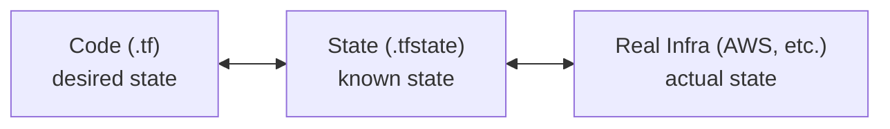

## Introduction -- Why Manage Infrastructure as Code?

Spinning up an EC2 instance with a few clicks in the AWS Console is easy. VPCs, RDS instances, S3 buckets -- the console handles them all quickly.

But over time, problems emerge:

- No way to track who changed which settings
- Recreating the same environment requires relying on memory
- "I changed it in the console" is not reproducible for your teammates
- Accidentally deleting production resources is hard to undo
- Keeping dev, staging, and prod environments identical becomes painful

One or two resources? The console is fine. But once you combine VPC + subnets + security groups + EC2 + RDS + S3 + IAM roles, managing everything through console clicks becomes impossible.

**Terraform** solves this problem. You declare infrastructure as code, run the code to create infrastructure, and manage change history with Git.

> This post is a fundamentals guide for developers learning Terraform for the first time.
> Examples use AWS, but the core concepts apply to any cloud provider.

---

## What Is IaC (Infrastructure as Code)?

IaC is the practice of declaring infrastructure in code files and version-controlling them with Git.

Instead of clicking through a console, you write "this infrastructure should exist" in a code file, and the tool provisions it for you. The code itself becomes both documentation and history.

Key benefits:

| Benefit | Description |
|---------|-------------|
| **Reproducibility** | Running the same code always produces the same infrastructure |
| **Version control** | Git tracks change history. You can see who changed what, when, and why |
| **Code review** | Infrastructure changes go through PRs and team review |
| **Automation** | Integrate with CI/CD pipelines to automate infrastructure deployment |
| **Environment cloning** | Copy dev environment code to easily create staging and prod |

Comparing the console approach to the IaC approach:

```
# Console approach
1. Log into the AWS Console
2. Navigate to EC2 -> Launch Instance
3. Select AMI, instance type, security group...
4. Remember the settings or take screenshots
5. Repeat the same process for other environments

# IaC approach
1. Define infrastructure in a code file
2. Run terraform apply
3. Commit to Git -> history is preserved
4. For other environments, just change the variables and apply
```

---

## Introducing Terraform

[Terraform](https://www.terraform.io/) is an open-source IaC tool created by HashiCorp. It is currently the most widely used infrastructure provisioning tool.

### Key Characteristics

**Declarative**: You declare "this state should exist," and Terraform compares it to the current state and performs the necessary actions.

```hcl
# Declare "a t3.micro EC2 instance should exist"
resource "aws_instance" "web" {
  ami           = "ami-0c55b159cbfafe1f0"
  instance_type = "t3.micro"
}
# Terraform automatically:
# - If it doesn't exist -> creates it
# - If it exists but the config differs -> updates it
# - If removed from code -> destroys it
```

The difference from the imperative approach is clear:

| Approach | Example | Characteristics |
|----------|---------|-----------------|
| **Imperative** | "Create a server, attach a security group, assign an IP" | Executes step by step. Unaware of current state |
| **Declarative** | "This server should exist" | Defines only the final state. Terraform figures out the rest |

**Multi-cloud**: Supports thousands of providers including AWS, GCP, Azure, Kubernetes, GitHub, and Datadog. A single tool can manage infrastructure across multiple clouds.

**HCL (HashiCorp Configuration Language)**: Terraform uses its own configuration language. It is more readable than JSON and simpler than a general-purpose programming language.

### OpenTofu

In 2023, HashiCorp changed Terraform's license to BSL (Business Source License). In response, the community forked it as [OpenTofu](https://opentofu.org/), an open-source project under the Linux Foundation. It provides nearly identical syntax and features. Organizations where licensing matters may consider OpenTofu as an alternative.

---

## Comparison with Other Tools

Several IaC tools exist. Here is a quick comparison:

| Tool | Provider | Language | Multi-cloud | Characteristics |
|------|----------|----------|:-----------:|-----------------|
| **Terraform** | HashiCorp | HCL | O | Most popular, largest ecosystem |
| **CloudFormation** | AWS | JSON/YAML | X (AWS only) | AWS-native, no separate installation |
| **Pulumi** | Pulumi | Python/TS/Go, etc. | O | Uses general-purpose programming languages |
| **Ansible** | Red Hat | YAML | O | Configuration management focused, can also provision infrastructure |
| **CDK** | AWS | TS/Python/Java, etc. | X (AWS only) | Generates CloudFormation using programming languages |

The reason to learn Terraform first is simple: it has overwhelmingly more references, and most companies use it. Whether you search Stack Overflow, blogs, courses, or official docs, Terraform resources are the most abundant.

> Ansible excels at server-internal configuration (installing packages, deploying files, etc.).
> Terraform excels at creating infrastructure itself (servers, networks, databases, etc.).
> They serve different purposes, so they are often used together.

---

## Core Concepts

Here are the essential concepts in Terraform, explained one by one. All examples use AWS.

### Provider

A Provider is a plugin that defines which cloud or service Terraform communicates with. Terraform itself does not know about any cloud. The Provider handles the connection to the AWS API, GCP API, and so on.

```hcl
# AWS Provider configuration
provider "aws" {
  region = "ap-northeast-2"  # Seoul region
}
```

```hcl
# You can use multiple Providers at the same time
provider "aws" {
  region = "ap-northeast-2"
}

provider "aws" {
  alias  = "us_east"          # Distinguish with an alias
  region = "us-east-1"
}
```

Providers are automatically downloaded when you run `terraform init`. You can browse available Providers at the [Terraform Registry](https://registry.terraform.io/browse/providers).

### Resource

A Resource defines the actual infrastructure resource to create. It is the core of Terraform code.

```hcl
resource "aws_instance" "web" {
  ami           = "ami-0c55b159cbfafe1f0"
  instance_type = "t3.micro"

  tags = {
    Name = "web-server"
  }
}
```

Breaking down the syntax:

```
resource "<resource_type>" "<local_name>" {
  <attribute> = <value>
}
```

| Element | Example | Description |
|---------|---------|-------------|
| Resource type | `aws_instance` | An AWS EC2 instance. A resource kind provided by the Provider |
| Local name | `web` | The name used to reference this resource within the code |
| Attributes | `ami`, `instance_type` | Configuration values for the resource |

To reference this resource from another resource, use `aws_instance.web.id`.

### Data Source

A Data Source queries information about resources that already exist. It does not create anything new -- it fetches data from existing resources.

```hcl
# Look up the latest Ubuntu AMI
data "aws_ami" "ubuntu" {
  most_recent = true
  owners      = ["099720109477"]  # Canonical (official Ubuntu publisher)

  filter {
    name   = "name"
    values = ["ubuntu/images/hvm-ssd/ubuntu-*-amd64-server-*"]
  }
}

# Use the retrieved AMI ID for an EC2 instance
resource "aws_instance" "web" {
  ami           = data.aws_ami.ubuntu.id  # Reference with data.
  instance_type = "t3.micro"
}
```

Common use cases:

- Looking up the latest AMI ID
- Querying existing VPC information
- Retrieving current AWS account information
- Looking up Route53 hosted zones

```hcl
# Current AWS account info
data "aws_caller_identity" "current" {}

# Look up an existing VPC
data "aws_vpc" "main" {
  tags = {
    Name = "main-vpc"
  }
}
```

### Variable

A Variable is a reusable input value. It avoids hardcoding and allows injecting different values per environment.

```hcl
# Variable declaration
variable "instance_type" {
  description = "EC2 instance type"
  type        = string
  default     = "t3.micro"
}

variable "environment" {
  description = "Deployment environment (dev, staging, prod)"
  type        = string
  # No default means a value must be provided at runtime
}

variable "allowed_ports" {
  description = "List of allowed ports"
  type        = list(number)
  default     = [80, 443]
}

# Using a variable
resource "aws_instance" "web" {
  instance_type = var.instance_type   # Reference with var.

  tags = {
    Environment = var.environment
  }
}
```

Ways to pass values to Variables:

```bash
# 1. CLI option
terraform apply -var="environment=prod"

# 2. terraform.tfvars file (loaded automatically)
# terraform.tfvars
# environment = "prod"
# instance_type = "t3.large"

# 3. Environment variable
export TF_VAR_environment="prod"

# 4. -var-file option
terraform apply -var-file="prod.tfvars"
```

Variable types:

| Type | Example |
|------|---------|
| `string` | `"t3.micro"` |
| `number` | `3` |
| `bool` | `true` |
| `list(type)` | `["ap-northeast-2a", "ap-northeast-2c"]` |
| `map(type)` | `{ Name = "web", Env = "prod" }` |
| `object({...})` | `{ name = string, port = number }` |

### Local

A Local is a local variable that stores repeated values or computed results within the code. Unlike Variables, Locals cannot receive values from outside.

```hcl
locals {
  common_tags = {
    Project     = "my-app"
    Environment = var.environment
    ManagedBy   = "terraform"
  }

  name_prefix = "${var.project}-${var.environment}"
}

resource "aws_instance" "web" {
  ami           = data.aws_ami.ubuntu.id
  instance_type = var.instance_type

  tags = merge(local.common_tags, {
    Name = "${local.name_prefix}-web"
  })
}
```

> Variables are for external input. Locals are for internal computation.
> Locals are commonly used to apply the same tags across multiple resources or to standardize naming conventions.

### Output

An Output exposes execution results or passes values to other modules.

```hcl
output "instance_ip" {
  description = "Public IP of the web server"
  value       = aws_instance.web.public_ip
}

output "instance_id" {
  description = "EC2 instance ID"
  value       = aws_instance.web.id
}
```

After running `terraform apply`, Outputs are printed to the terminal:

```
Apply complete! Resources: 1 added, 0 changed, 0 destroyed.

Outputs:

instance_id = "i-0abc123def456789"
instance_ip = "54.180.xxx.xxx"
```

Outputs are also used for passing data between modules. For example, a VPC module exports the VPC ID as an output, and an EKS module receives that value.

### State

State is the file where Terraform stores the current state of all managed infrastructure. By default, it is saved locally as a JSON file named `terraform.tfstate`.

```
Code (desired state) <--compare--> State (current state) -> Calculate changes
```

- `terraform plan` compares the code with the State to calculate changes
- `terraform apply` updates the State after applying changes
- Without the State, Terraform does not know about existing resources (and will try to create them again)

State is fundamental to Terraform. The "State Management" section below covers it in detail.

### Module

A Module bundles multiple resources into a reusable package. It is similar to Helm Charts in Kubernetes or functions/libraries in programming.

The "Modules" section below covers this in detail.

---

## Workflow

Terraform's basic workflow has four stages.

```
terraform init    ->  Download Providers, initialize backend
     |
terraform plan    ->  Preview changes (nothing is actually applied)
     |
terraform apply   ->  Apply changes to real infrastructure
     |
terraform destroy ->  Delete all resources (use with caution!)
```

### terraform init

Run this when starting a new project or when Providers/modules change. It downloads the required plugins into the `.terraform/` directory.

```bash
$ terraform init

Initializing the backend...
Initializing provider plugins...
- Finding hashicorp/aws versions matching "~> 5.0"...
- Installing hashicorp/aws v5.31.0...
- Installed hashicorp/aws v5.31.0 (signed by HashiCorp)

Terraform has been successfully initialized!
```

### terraform plan

Compares the code with the current State and shows what changes will occur. **It does not actually modify infrastructure.**

```bash
$ terraform plan

Terraform will perform the following actions:

  # aws_instance.web will be created
  + resource "aws_instance" "web" {
      + ami                          = "ami-0c55b159cbfafe1f0"
      + instance_type                = "t3.micro"
      + id                           = (known after apply)
      + public_ip                    = (known after apply)
      + tags                         = {
          + "Name" = "web-server"
        }
    }

Plan: 1 to add, 0 to change, 0 to destroy.
```

What the symbols mean:

| Symbol | Meaning |
|--------|---------|
| `+` | Create new |
| `-` | Delete |
| `~` | Update (in-place modification) |
| `-/+` | Delete and recreate (replacement) |

> **Why plan matters**: Always review the plan before applying. In particular, if `-/+` (replacement) appears, the resource will be destroyed and recreated, which can cause downtime. Many teams attach plan output to PRs for review.

### terraform apply

Applies the plan to real infrastructure. A confirmation prompt appears before execution.

```bash
$ terraform apply

# ... plan output ...

Do you want to perform these actions?
  Terraform will perform the actions described above.
  Only 'yes' will be accepted to approve.

  Enter a value: yes

aws_instance.web: Creating...
aws_instance.web: Still creating... [10s elapsed]
aws_instance.web: Creation complete after 32s [id=i-0abc123def456789]

Apply complete! Resources: 1 added, 0 changed, 0 destroyed.

Outputs:

instance_ip = "54.180.xxx.xxx"
```

Adding the `-auto-approve` flag skips the confirmation. This is used in CI/CD pipelines, but it is safer to omit it when running manually.

### terraform destroy

Deletes all resources managed by Terraform. Use this for cleaning up learning and test environments.

```bash
$ terraform destroy

# ... list of resources to be deleted ...

Do you want to really destroy all resources?
  Only 'yes' will be accepted to approve.

  Enter a value: yes

aws_instance.web: Destroying... [id=i-0abc123def456789]
aws_instance.web: Destruction complete after 30s

Destroy complete! Resources: 1 destroyed.
```

> **Caution**: Running `terraform destroy` in production is extremely dangerous.
> Use the `prevent_destroy` lifecycle option to prevent accidental deletion.

```hcl
resource "aws_db_instance" "main" {
  # ... configuration ...

  lifecycle {
    prevent_destroy = true  # Raises an error if destroy is attempted
  }
}
```

### Other Useful Commands

```bash
# Format code
terraform fmt

# Validate syntax
terraform validate

# List resources in State
terraform state list

# Show details of a specific resource in State
terraform state show aws_instance.web

# View output values
terraform output
```

---

## State Management

State is one of the most important concepts in Terraform. Failing to understand it properly can lead to infrastructure disasters.

### What Is State?

The `terraform.tfstate` file stores the current state of all resources managed by Terraform in JSON format.



- **terraform plan**: Compares code with State to calculate changes
- **terraform apply**: Applies changes to real infrastructure and updates State
- **terraform refresh**: Syncs real infrastructure state back to State (reflects manual console changes)

### Limitations of Local State

By default, State is stored as a local file (`terraform.tfstate`).

This works fine for solo work, but causes several issues in a team setting:

| Problem | Description |
|---------|-------------|
| **Conflicts** | Two people applying simultaneously corrupts the State |
| **Loss** | Accidentally deleting the file means Terraform loses track of existing resources |
| **No sharing** | Team members need to manually copy the State file |
| **Security** | State files can contain passwords, keys, and other sensitive data in plaintext |

### Remote State (Remote Backend)

The standard for team workflows is the **S3 + DynamoDB** combination.

```hcl
terraform {
  backend "s3" {
    bucket         = "my-terraform-state"
    key            = "prod/terraform.tfstate"
    region         = "ap-northeast-2"
    dynamodb_table = "terraform-locks"   # Prevent concurrent execution (locking)
    encrypt        = true                # Encrypt the State file
  }
}
```

| Component | Role |
|-----------|------|
| **S3 bucket** | Stores the State file. Enable versioning to allow rollback to previous State |
| **DynamoDB table** | Manages locks. If one person is applying, others must wait |
| **encrypt** | Stores State encrypted. Protects sensitive information |

How it works:

```
1. Run terraform plan/apply
2. Download State file from S3
3. Acquire lock in DynamoDB (block other users)
4. Perform the operation
5. Upload new State to S3
6. Release DynamoDB lock
```

> **Note**: The S3 bucket and DynamoDB table specified in `backend "s3"` must exist before Terraform can use them.
> This is the classic "chicken-and-egg" problem. Typically, these resources are created separately beforehand.

### When You Need to Manually Modify State

Occasionally, you need to manipulate State manually:

```bash
# List resources in State
terraform state list

# Show details of a specific resource
terraform state show aws_instance.web

# Remove a resource from State (keeps real infrastructure, just removes from Terraform management)
terraform state rm aws_instance.web

# Rename a resource (when you changed the name in code)
terraform state mv aws_instance.web aws_instance.web_server

# Import an existing resource into Terraform management
terraform import aws_instance.web i-0abc123def456789
```

> `terraform import` is used when you want to bring a resource created manually via the console under Terraform management.
> It adds the resource information to State so it can be managed through code going forward.

---

## Modules

### What Is a Module?

A Module packages related resources into a single unit. It takes inputs (Variables) and returns results (Outputs), just like a function.

Why are they needed?

- Creating a VPC requires defining subnets, route tables, internet gateways, and NAT gateways every time -- tedious
- The same infrastructure pattern needs to be replicated across environments (dev, staging, prod)
- You want to standardize infrastructure patterns within the team

An analogy:

| Concept | Terraform | Kubernetes | Programming |
|---------|-----------|------------|-------------|
| Package | Module | Helm Chart | Function/Library |
| Configuration | Variable | values.yaml | Parameters |
| Result | Output | - | Return value |

### Creating Your Own Module

```
modules/
└── vpc/
    ├── main.tf         # Resource definitions
    ├── variables.tf    # Input variables
    └── outputs.tf      # Output values
```

```hcl
# modules/vpc/variables.tf
variable "cidr_block" {
  description = "VPC CIDR block"
  type        = string
}

variable "azs" {
  description = "List of availability zones to use"
  type        = list(string)
}

variable "environment" {
  description = "Environment name"
  type        = string
}
```

```hcl
# modules/vpc/main.tf
resource "aws_vpc" "this" {
  cidr_block           = var.cidr_block
  enable_dns_hostnames = true

  tags = {
    Name = "${var.environment}-vpc"
  }
}

resource "aws_subnet" "public" {
  count             = length(var.azs)
  vpc_id            = aws_vpc.this.id
  cidr_block        = cidrsubnet(var.cidr_block, 8, count.index)
  availability_zone = var.azs[count.index]

  tags = {
    Name = "${var.environment}-public-${var.azs[count.index]}"
  }
}
```

```hcl
# modules/vpc/outputs.tf
output "vpc_id" {
  description = "ID of the created VPC"
  value       = aws_vpc.this.id
}

output "public_subnet_ids" {
  description = "List of public subnet IDs"
  value       = aws_subnet.public[*].id
}
```

Code that uses this module:

```hcl
# environments/prod/main.tf
module "vpc" {
  source = "../../modules/vpc"

  cidr_block  = "10.0.0.0/16"
  azs         = ["ap-northeast-2a", "ap-northeast-2c"]
  environment = "prod"
}

# Reference the module's output in other resources
resource "aws_instance" "web" {
  subnet_id = module.vpc.public_subnet_ids[0]
  # ...
}
```

### Public Registry Modules

You can use verified modules from the [Terraform Registry](https://registry.terraform.io/). No need to reinvent the wheel.

```hcl
# Using the official AWS VPC module
module "vpc" {
  source  = "terraform-aws-modules/vpc/aws"
  version = "5.0.0"

  name = "my-vpc"
  cidr = "10.0.0.0/16"

  azs             = ["ap-northeast-2a", "ap-northeast-2c"]
  public_subnets  = ["10.0.1.0/24", "10.0.2.0/24"]
  private_subnets = ["10.0.11.0/24", "10.0.12.0/24"]

  enable_nat_gateway = true
  single_nat_gateway = true  # Cost saving (one per AZ recommended for production)

  tags = {
    Environment = "prod"
    ManagedBy   = "terraform"
  }
}
```

Commonly used public modules:

| Module | Description |
|--------|-------------|
| `terraform-aws-modules/vpc/aws` | VPC, subnets, NAT gateways, etc. |
| `terraform-aws-modules/eks/aws` | EKS clusters |
| `terraform-aws-modules/rds/aws` | RDS databases |
| `terraform-aws-modules/s3-bucket/aws` | S3 buckets |
| `terraform-aws-modules/iam/aws` | IAM roles and policies |

> Always pin the `version` when using public modules.
> Without a version, `terraform init` pulls the latest version,
> which may include unexpected breaking changes.

---

## Practical Tips

### Directory Structure

This varies by project size, but separating by environment is the most common pattern.

```
infrastructure/
├── environments/
│   ├── dev/
│   │   ├── main.tf           # Resource definitions
│   │   ├── variables.tf      # Variable declarations
│   │   ├── outputs.tf        # Output definitions
│   │   ├── terraform.tfvars  # Variable values (per environment)
│   │   ├── backend.tf        # Remote State configuration
│   │   └── versions.tf       # Provider version pinning
│   ├── staging/
│   │   ├── main.tf
│   │   ├── variables.tf
│   │   └── ...
│   └── prod/
│       ├── main.tf
│       ├── variables.tf
│       └── ...
└── modules/
    ├── vpc/
    │   ├── main.tf
    │   ├── variables.tf
    │   └── outputs.tf
    ├── eks/
    └── rds/
```

Each environment directory is an independent Terraform project. You run `terraform init` and `terraform apply` separately per environment. This ensures that applying changes in dev does not affect prod.

### .gitignore

Files that must be in `.gitignore` for any Terraform project:

```gitignore
# State files (may contain sensitive information)
*.tfstate
*.tfstate.backup
.terraform.tfstate.lock.info

# Provider plugins (large, downloadable via init)
.terraform/

# Variable files that may contain sensitive data
*.tfvars
!example.tfvars  # Keep example files committed

# Misc
*.tfplan
crash.log
override.tf
override.tf.json
```

### Version Pinning

Pin the versions of both Providers and Terraform itself. This prevents issues caused by version differences between team members.

```hcl
# versions.tf
terraform {
  required_version = ">= 1.5.0, < 2.0.0"

  required_providers {
    aws = {
      source  = "hashicorp/aws"
      version = "~> 5.0"   # Use latest 5.x (not 6.x)
    }
  }
}
```

| Operator | Meaning | Example |
|----------|---------|---------|
| `= 5.31.0` | Exactly this version | Only `5.31.0` |
| `>= 5.0` | This version or higher | `5.0.0`, `5.31.0`, `6.0.0` all valid |
| `~> 5.0` | Within the 5.x range | `5.0.0` to `5.99.99` (not 6.0) |
| `>= 5.0, < 6.0` | Explicit range | Same as `~> 5.0` |

### Managing Sensitive Information

Do not put passwords or API keys directly in `terraform.tfvars`. Instead:

```hcl
# Option 1: Use environment variables
variable "db_password" {
  description = "Database password"
  type        = string
  sensitive   = true  # Hides the value in plan/apply output
}
# At runtime: export TF_VAR_db_password="my-secret"

# Option 2: Retrieve from AWS Secrets Manager
data "aws_secretsmanager_secret_version" "db_password" {
  secret_id = "prod/db-password"
}

resource "aws_db_instance" "main" {
  password = data.aws_secretsmanager_secret_version.db_password.secret_string
  # ...
}
```

> Declaring `sensitive = true` displays `(sensitive value)` in plan/apply output.
> However, the value is still stored in plaintext in the State file, so State encryption (S3 encrypt) is essential.

### terraform fmt and validate

Make it a habit to run these before every commit:

```bash
# Format code (auto-fix)
terraform fmt -recursive

# Validate syntax
terraform validate
```

Many teams check these two commands in their CI/CD pipelines. If formatting is off when you open a PR, the build fails.

---

## Summary

Here is a recap of the core concepts covered in this post:

| Concept | One-line Description |
|---------|---------------------|
| **IaC** | Declare infrastructure as code and manage it with Git |
| **Provider** | Plugin that connects Terraform to a cloud |
| **Resource** | Definition of an infrastructure resource to create |
| **Data Source** | Query information about existing resources |
| **Variable** | Reusable input value |
| **Local** | Local variable for internal computation |
| **Output** | Expose execution results or pass data between modules |
| **State** | File that stores the current state of infrastructure |
| **Module** | Reusable package that bundles resources |
| **Workflow** | init -> plan -> apply -> destroy |

Connecting the big picture:

```
Terraform       ->  EKS           ->  ArgoCD        ->  Loki/Grafana
(Build infra)       (K8s cluster)     (GitOps deploy)   (Monitoring)

Define infra        K8s runtime       Git-based auto    Log collection/
as code             environment       deployment        visualization
VPC, subnets, IAM   Node groups,      Helm Chart        Dashboard
                    networking        management        configuration
```

Now that you have learned Terraform's fundamental concepts, the next post will put them into practice by building an actual AWS EKS cluster with Terraform. We will walk through VPC, subnets, IAM roles, the EKS cluster, and node groups line by line, building production-grade infrastructure from the ground up.
