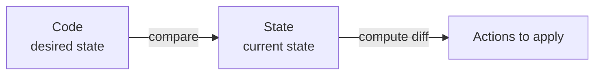
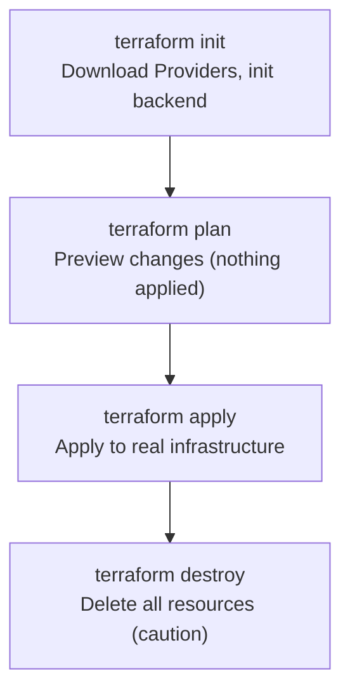
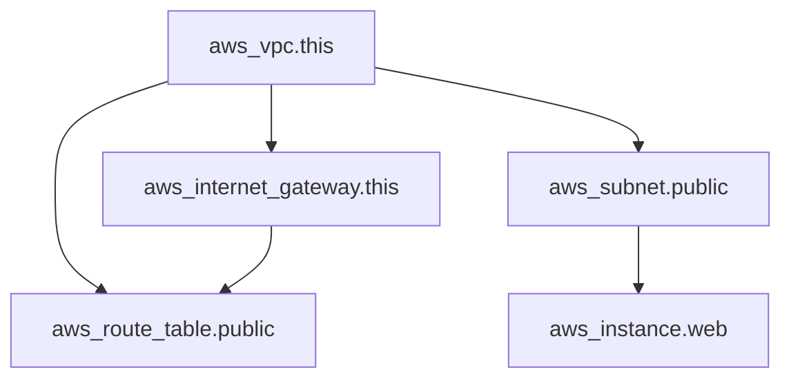
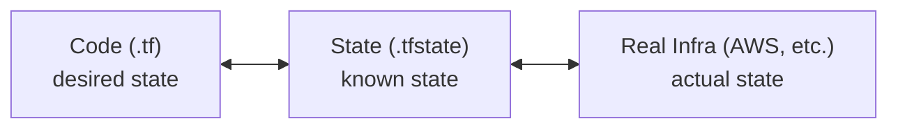
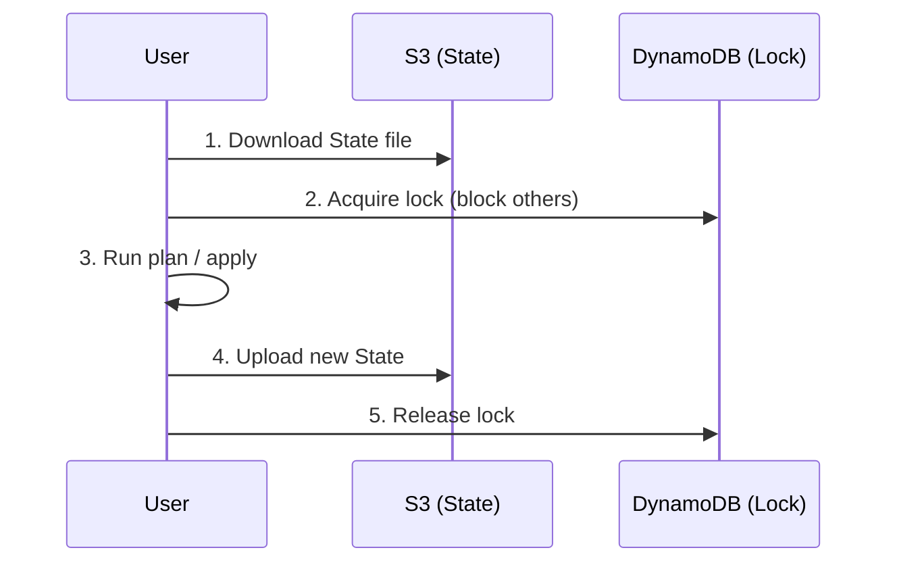
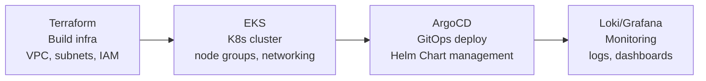

## Introduction -- Why Manage Infrastructure as Code?

Spinning up an EC2 instance with a few clicks in the AWS Console is easy. VPCs, RDS instances, S3 buckets -- the console handles them all quickly.

But over time, problems emerge:

- No way to track who changed which settings
- Recreating the same environment requires relying on memory
- "I changed it in the console" is not reproducible for your teammates
- Accidentally deleting production resources is hard to undo
- Keeping dev, staging, and prod environments identical becomes painful

One or two resources? The console is fine. But once you combine VPC + subnets + security groups + EC2 + RDS + S3 + IAM roles, managing everything through console clicks becomes impossible.

<strong>Terraform</strong> solves this problem. You declare infrastructure as code, run the code to create infrastructure, and manage change history with Git.

This post is a guide for developers learning Terraform for the first time. It starts with the basics (Provider, Resource, State, Module) and goes all the way to the advanced topics you hit on day one of real work (`count`/`for_each`, dependencies and `lifecycle`, `import`/`moved` blocks) -- all in a single post. Examples use AWS, but the core concepts apply to any cloud provider.

---

## TL;DR

- <strong>You declare infrastructure as code.</strong> Instead of clicking through a console, you write "this infrastructure should exist" in a code file, and Terraform reconciles the real infrastructure to that state. The code is both documentation and change history.
- <strong>The workflow has four stages.</strong> Initialize → preview changes → apply for real → destroy. Always review the preview before applying to see exactly what will change.
- <strong>The state file is the heart of it.</strong> Terraform stores the current shape of managed infrastructure in a state file and applies only the diff against your code. On a team, you keep this file remote (S3) and use locking to prevent concurrent edits.
- <strong>You create many resources like a loop.</strong> To make N of the same resource, use two meta-arguments: one count-based, one set-based. The set-based one is safe even when a middle item changes.
- <strong>You reuse with modules.</strong> A module is a package that bundles related resources, takes inputs, and emits outputs. Like a function, it stamps out the same infrastructure by changing only the values per environment.

---

## 1. What Is IaC (Infrastructure as Code)?

<strong>IaC = declaring infrastructure in code files and version-controlling it with Git.</strong>

Instead of clicking through a console, you write "this infrastructure should exist" in a code file, and the tool provisions it for you. The code itself becomes both documentation and history.

Key benefits:

| Benefit | Description |
|---------|-------------|
| <strong>Reproducibility</strong> | Running the same code always produces the same infrastructure |
| <strong>Version control</strong> | Git tracks change history. You can see who changed what, when, and why |
| <strong>Code review</strong> | Infrastructure changes go through PRs and team review |
| <strong>Automation</strong> | Integrate with CI/CD pipelines to automate infrastructure deployment |
| <strong>Environment cloning</strong> | Copy dev environment code to easily create staging and prod |

Comparing the console approach to the IaC approach:

```text
# Console approach
1. Log into the AWS Console
2. Navigate to EC2 -> Launch Instance
3. Select AMI, instance type, security group...
4. Remember the settings or take screenshots
5. Repeat the same process for other environments

# IaC approach
1. Define infrastructure in a code file
2. Run terraform apply
3. Commit to Git -> history is preserved
4. For other environments, just change the variables and apply
```

---

## 2. Introducing Terraform

[Terraform](https://www.terraform.io/) is an open-source IaC tool created by HashiCorp. It is currently the most widely used infrastructure provisioning tool.

### 2.1 Key Characteristics

<strong>Declarative</strong>: You declare "this state should exist," and Terraform compares it to the current state and performs the necessary actions.

```hcl
# Declare "a t3.micro EC2 instance should exist"
resource "aws_instance" "web" {
  ami           = "ami-0c55b159cbfafe1f0"
  instance_type = "t3.micro"
}
# Terraform automatically:
# - If it doesn't exist -> creates it
# - If it exists but the config differs -> updates it
# - If removed from code -> destroys it
```

The difference from the imperative approach is clear:

| Approach | Example | Characteristics |
|----------|---------|-----------------|
| <strong>Imperative</strong> | "Create a server, attach a security group, assign an IP" | Executes step by step. Unaware of current state |
| <strong>Declarative</strong> | "This server should exist" | Defines only the final state. Terraform figures out the rest |

<strong>Multi-cloud</strong>: Supports thousands of providers including AWS, GCP, Azure, Kubernetes, GitHub, and Datadog. A single tool can manage infrastructure across multiple clouds.

<strong>HCL (HashiCorp Configuration Language)</strong>: Terraform uses its own configuration language. It is more readable than JSON and simpler than a general-purpose programming language.

### 2.2 OpenTofu

In 2023, HashiCorp changed Terraform's license to BSL (Business Source License). In response, the community forked it as [OpenTofu](https://opentofu.org/), an open-source project under the Linux Foundation. It provides nearly identical syntax and features. Organizations where licensing matters may consider OpenTofu as an alternative.

---

## 3. Comparison with Other Tools

Several IaC tools exist. Here is a quick comparison:

| Tool | Provider | Language | Multi-cloud | Characteristics |
|------|----------|----------|:-----------:|-----------------|
| <strong>Terraform</strong> | HashiCorp | HCL | O | Most popular, largest ecosystem |
| <strong>CloudFormation</strong> | AWS | JSON/YAML | X (AWS only) | AWS-native, no separate installation |
| <strong>Pulumi</strong> | Pulumi | Python/TS/Go, etc. | O | Uses general-purpose programming languages |
| <strong>Ansible</strong> | Red Hat | YAML | O | Configuration management focused, can also provision infrastructure |
| <strong>CDK</strong> | AWS | TS/Python/Java, etc. | X (AWS only) | Generates CloudFormation using programming languages |

The reason to learn Terraform first is simple: it has overwhelmingly more references, and most companies use it. Whether you search Stack Overflow, blogs, courses, or official docs, Terraform resources are the most abundant.

> <strong>Note</strong>: Ansible excels at server-internal configuration (installing packages, deploying files, etc.). Terraform excels at creating infrastructure itself (servers, networks, databases, etc.). They serve different purposes, so they are often used together.

---

## 4. Core Concepts

Here are the essential concepts in Terraform, explained one by one. All examples use AWS.

### 4.1 Provider

A Provider is a plugin that defines which cloud or service Terraform communicates with. Terraform itself does not know about any cloud. The Provider handles the connection to the AWS API, GCP API, and so on.

```hcl
# AWS Provider configuration
provider "aws" {
  region = "ap-northeast-2"  # Seoul region
}
```

```hcl
# You can use multiple Providers at the same time
provider "aws" {
  region = "ap-northeast-2"
}

provider "aws" {
  alias  = "us_east"          # Distinguish with an alias
  region = "us-east-1"
}
```

Providers are automatically downloaded when you run `terraform init`. You can browse available Providers at the [Terraform Registry](https://registry.terraform.io/browse/providers).

### 4.2 Resource

A Resource defines the actual infrastructure resource to create. It is the core of Terraform code.

```hcl
resource "aws_instance" "web" {
  ami           = "ami-0c55b159cbfafe1f0"
  instance_type = "t3.micro"

  tags = {
    Name = "web-server"
  }
}
```

Breaking down the syntax:

```text
resource "<resource_type>" "<local_name>" {
  <attribute> = <value>
}
```

| Element | Example | Description |
|---------|---------|-------------|
| Resource type | `aws_instance` | An AWS EC2 instance. A resource kind provided by the Provider |
| Local name | `web` | The name used to reference this resource within the code |
| Attributes | `ami`, `instance_type` | Configuration values for the resource |

To reference this resource from another resource, use `aws_instance.web.id`. That reference is what creates a dependency (more in §7).

> <strong>Note -- Terraform names ≠ console service names</strong>: `aws_instance` refers to what the AWS Console calls "EC2." It's not named `aws_ec2` because Terraform resource names follow the <strong>AWS API object name</strong>, not the console brand name (the EC2 API calls a virtual server an `Instance`). Some names diverge like this (`aws_db_instance` for RDS), while others match the service exactly (`aws_s3_bucket` for S3, `aws_eks_cluster` for EKS). Don't guess the name -- look it up in the [Terraform Registry](https://registry.terraform.io/providers/hashicorp/aws/latest/docs).

### 4.3 Data Source

A Data Source queries information about resources that already exist. It does not create anything new -- it fetches data from existing resources.

```hcl
# Look up the latest Ubuntu AMI
data "aws_ami" "ubuntu" {
  most_recent = true
  owners      = ["099720109477"]  # Canonical (official Ubuntu publisher)

  filter {
    name   = "name"
    values = ["ubuntu/images/hvm-ssd/ubuntu-*-amd64-server-*"]
  }
}

# Use the retrieved AMI ID for an EC2 instance
resource "aws_instance" "web" {
  ami           = data.aws_ami.ubuntu.id  # Reference with data.
  instance_type = "t3.micro"
}
```

Common use cases:

- Looking up the latest AMI ID
- Querying existing VPC information
- Retrieving current AWS account information
- Looking up Route53 hosted zones

```hcl
# Current AWS account info
data "aws_caller_identity" "current" {}

# Look up an existing VPC
data "aws_vpc" "main" {
  tags = {
    Name = "main-vpc"
  }
}
```

### 4.4 Variable

A Variable is a reusable input value. It avoids hardcoding and allows injecting different values per environment.

```hcl
# Variable declaration
variable "instance_type" {
  description = "EC2 instance type"
  type        = string
  default     = "t3.micro"
}

variable "environment" {
  description = "Deployment environment (dev, staging, prod)"
  type        = string
  # No default means a value must be provided at runtime
}

variable "allowed_ports" {
  description = "List of allowed ports"
  type        = list(number)
  default     = [80, 443]
}

# Using a variable
resource "aws_instance" "web" {
  instance_type = var.instance_type   # Reference with var.

  tags = {
    Environment = var.environment
  }
}
```

Ways to pass values to Variables:

```bash
# 1. CLI option
terraform apply -var="environment=prod"

# 2. terraform.tfvars file (loaded automatically)
# terraform.tfvars
# environment = "prod"
# instance_type = "t3.large"

# 3. Environment variable
export TF_VAR_environment="prod"

# 4. -var-file option
terraform apply -var-file="prod.tfvars"
```

Variable types:

| Type | Example |
|------|---------|
| `string` | `"t3.micro"` |
| `number` | `3` |
| `bool` | `true` |
| `list(type)` | `["ap-northeast-2a", "ap-northeast-2c"]` |
| `map(type)` | `{ Name = "web", Env = "prod" }` |
| `object({...})` | `{ name = string, port = number }` |

### 4.5 Local

A Local is a local variable that stores repeated values or computed results within the code. Unlike Variables, Locals cannot receive values from outside.

```hcl
locals {
  common_tags = {
    Project     = "my-app"
    Environment = var.environment
    ManagedBy   = "terraform"
  }

  name_prefix = "${var.project}-${var.environment}"
}

resource "aws_instance" "web" {
  ami           = data.aws_ami.ubuntu.id
  instance_type = var.instance_type

  tags = merge(local.common_tags, {
    Name = "${local.name_prefix}-web"
  })
}
```

> <strong>Key</strong>: Variables are for external input. Locals are for internal computation. Locals are commonly used to apply the same tags across multiple resources or to standardize naming conventions.

### 4.6 Output

An Output exposes execution results or passes values to other modules.

```hcl
output "instance_ip" {
  description = "Public IP of the web server"
  value       = aws_instance.web.public_ip
}

output "instance_id" {
  description = "EC2 instance ID"
  value       = aws_instance.web.id
}
```

After running `terraform apply`, Outputs are printed to the terminal:

```text
Apply complete! Resources: 1 added, 0 changed, 0 destroyed.

Outputs:

instance_id = "i-0abc123def456789"
instance_ip = "54.180.xxx.xxx"
```

Outputs are also used for passing data between modules. For example, a VPC module exports the VPC ID as an output, and an EKS module receives that value. For passing data between separate stacks, see §8.6.

### 4.7 State

State is the file where Terraform stores the current state of all managed infrastructure. By default, it is saved locally as a JSON file named `terraform.tfstate`.


```mermaid
flowchart LR
    A["Code<br/>desired state"] -->|compare| B["State<br/>current state"]
    B -->|compute diff| C["Actions to apply"]
```

- `terraform plan` compares the code with the State to calculate changes
- `terraform apply` updates the State after applying changes
- Without the State, Terraform does not know about existing resources (and will try to create them again)

State is fundamental to Terraform. §8 "State Management" covers it in detail.

### 4.8 Module

A Module bundles multiple resources into a reusable package. It is similar to Helm Charts in Kubernetes or functions/libraries in programming. §9 "Modules" covers this in detail.

---

## 5. Workflow

Terraform's basic workflow has four stages.


```mermaid
flowchart TB
    init["terraform init<br/>Download Providers, init backend"]
    plan["terraform plan<br/>Preview changes (nothing applied)"]
    apply["terraform apply<br/>Apply to real infrastructure"]
    destroy["terraform destroy<br/>Delete all resources (caution)"]

    init --> plan --> apply --> destroy
```

### 5.1 terraform init

Run this when starting a new project or when Providers/modules change. It downloads the required plugins into the `.terraform/` directory.

```bash
$ terraform init

Initializing the backend...
Initializing provider plugins...
- Finding hashicorp/aws versions matching "~> 5.0"...
- Installing hashicorp/aws v5.31.0...
- Installed hashicorp/aws v5.31.0 (signed by HashiCorp)

Terraform has been successfully initialized!
```

### 5.2 terraform plan

Compares the code with the current State and shows what changes will occur. <strong>It does not actually modify infrastructure.</strong>

```bash
$ terraform plan

Terraform will perform the following actions:

  # aws_instance.web will be created
  + resource "aws_instance" "web" {
      + ami                          = "ami-0c55b159cbfafe1f0"
      + instance_type                = "t3.micro"
      + id                           = (known after apply)
      + public_ip                    = (known after apply)
      + tags                         = {
          + "Name" = "web-server"
        }
    }

Plan: 1 to add, 0 to change, 0 to destroy.
```

What the symbols mean:

| Symbol | Meaning |
|--------|---------|
| `+` | Create new |
| `-` | Delete |
| `~` | Update (in-place modification) |
| `-/+` | Delete and recreate (replacement) |

> <strong>Why plan matters</strong>: Always review the plan before applying. In particular, if `-/+` (replacement) appears, the resource will be destroyed and recreated, which can cause downtime. Many teams attach plan output to PRs for review.

### 5.3 terraform apply

Applies the plan to real infrastructure. A confirmation prompt appears before execution.

```bash
$ terraform apply

# ... plan output ...

Do you want to perform these actions?
  Terraform will perform the actions described above.
  Only 'yes' will be accepted to approve.

  Enter a value: yes

aws_instance.web: Creating...
aws_instance.web: Still creating... [10s elapsed]
aws_instance.web: Creation complete after 32s [id=i-0abc123def456789]

Apply complete! Resources: 1 added, 0 changed, 0 destroyed.

Outputs:

instance_ip = "54.180.xxx.xxx"
```

Adding the `-auto-approve` flag skips the confirmation. This is used in CI/CD pipelines, but it is safer to omit it when running manually.

### 5.4 terraform destroy

Deletes all resources managed by Terraform. Use this for cleaning up learning and test environments.

```bash
$ terraform destroy

# ... list of resources to be deleted ...

Do you want to really destroy all resources?
  Only 'yes' will be accepted to approve.

  Enter a value: yes

aws_instance.web: Destroying... [id=i-0abc123def456789]
aws_instance.web: Destruction complete after 30s

Destroy complete! Resources: 1 destroyed.
```

> <strong>Caution</strong>: Running `terraform destroy` in production is extremely dangerous. Use the `prevent_destroy` lifecycle option to prevent accidental deletion (§7.3).

### 5.5 Other Useful Commands

```bash
# Format code
terraform fmt

# Validate syntax
terraform validate

# List resources in State
terraform state list

# Show details of a specific resource in State
terraform state show aws_instance.web

# View output values
terraform output
```

---

## 6. Creating Multiple Resources -- count vs for_each

You often need to create several of the same resource: three subnets, five EC2 instances. Copy-pasting blocks makes the code long and error-prone. Terraform provides two <strong>meta-arguments</strong> for this. A meta-argument is a special argument that works on any resource regardless of its type.

### 6.1 count -- Create by Number

Give `count` a number and that many resources are created. Each instance is distinguished by `count.index` (starting at 0).

```hcl
resource "aws_instance" "web" {
  count         = 3
  ami           = data.aws_ami.ubuntu.id
  instance_type = "t3.micro"

  tags = {
    Name = "web-${count.index}"   # web-0, web-1, web-2
  }
}
```

Reference them with an index. To point at all of them at once, use `[*]` (the splat expression).

```hcl
aws_instance.web[0].id          # the first instance
aws_instance.web[*].id          # all IDs as a list
```

### 6.2 for_each -- Create by Set

Give `for_each` a map or set, and one resource is created per key. Each instance is distinguished by `each.key` and `each.value`.

```hcl
resource "aws_instance" "web" {
  for_each = {
    seoul = "ap-northeast-2a"
    busan = "ap-northeast-2c"
  }

  ami               = data.aws_ami.ubuntu.id
  instance_type     = "t3.micro"
  availability_zone = each.value

  tags = {
    Name = "web-${each.key}"   # web-seoul, web-busan
  }
}
```

Reference them by key instead of index.

```hcl
aws_instance.web["seoul"].id
values(aws_instance.web)[*].id   # all IDs
```

### 6.3 Which to Use -- the count Index Trap

Both create multiple resources, but <strong>they behave decisively differently when an item is added or removed in the middle.</strong>

`count` tracks resources by their <strong>position in a list</strong>. Delete one item in the middle and the positions of all following items shift down by one. Terraform reads this as "the resource at that position changed" and <strong>replaces them in a cascade (destroy and recreate)</strong>.

```text
count = 3, Name = ["a", "b", "c"]  ->  web[0]=a, web[1]=b, web[2]=c

Remove "b" -> ["a", "c"]
  web[0]=a  (unchanged)
  web[1]=b -> c   <- replaced!
  web[2]=c -> deleted

Intent: delete only b / Reality: b changed + c deleted = a healthy c gets recreated
```

`for_each` tracks resources by <strong>key</strong>. Delete the `"b"` key and only `web["b"]` disappears; `web["a"]` and `web["c"]` stay untouched.

| Criterion | `count` | `for_each` |
|-----------|---------|-----------|
| Input | Number | map or set |
| Identifier | Index (`count.index`) | Key (`each.key`) |
| Removing a middle item | Cascading replacement ⚠️ | Only that item is removed ✅ |
| Best for | Truly identical N copies | Resources distinguished by name/key |

> <strong>Bottom line</strong>: If each item has a meaningful name, `for_each` is the default. Reserve `count` for "N truly identical copies" or conditional creation (`count = var.enabled ? 1 : 0`).

---

## 7. Dependencies and lifecycle

Terraform does not create resources in the order written in your code. <strong>It analyzes the dependencies between resources and decides the order itself.</strong> Understanding this is essential to reading plan output correctly.

### 7.1 The Dependency Graph -- Who Decides the Order?

When one resource references another's attribute, Terraform creates an <strong>implicit dependency</strong>. For example, if a subnet references `aws_vpc.this.id`, Terraform automatically knows the VPC must be created first.

It assembles all these dependencies into a <strong>DAG (Directed Acyclic Graph)</strong> -- a structure of nodes and arrows expressing order, with no cycles (A→B→A). Terraform topologically sorts this graph and creates resources that don't depend on each other <strong>in parallel</strong>.


```mermaid
flowchart TB
    vpc["aws_vpc.this"]
    igw["aws_internet_gateway.this"]
    subnet["aws_subnet.public"]
    rt["aws_route_table.public"]
    instance["aws_instance.web"]

    vpc --> igw
    vpc --> subnet
    vpc --> rt
    igw --> rt
    subnet --> instance
```

In the graph above, `igw` and `subnet` don't depend on each other, so they are created simultaneously. `instance` only starts after `subnet` finishes.

### 7.2 depends_on -- Explicit Dependencies

Sometimes order matters even without an attribute reference. A classic case: an IAM policy must be attached before an EC2 instance can call a certain API. In code, the EC2 instance doesn't reference the policy directly, so Terraform can't infer the order. Here you declare an <strong>explicit dependency</strong> with `depends_on`.

```hcl
resource "aws_iam_role_policy" "s3_access" {
  # ... S3 access permissions ...
}

resource "aws_instance" "app" {
  ami           = data.aws_ami.ubuntu.id
  instance_type = "t3.micro"

  # Force the policy to be created first
  depends_on = [aws_iam_role_policy.s3_access]
}
```

> <strong>Caution</strong>: `depends_on` is a last resort. Prefer solving ordering with attribute references (implicit dependencies) when possible, since references show up naturally in the graph. Overusing `depends_on` serializes unnecessarily and slows down applies.

### 7.3 lifecycle -- Controlling Create, Destroy, and Update

The `lifecycle` block finely controls how a resource is created, destroyed, and updated. Three options are commonly used.

| Option | Behavior | When to use |
|--------|----------|-------------|
| `create_before_destroy` | On replacement, create the new resource before destroying the old | Avoid downtime |
| `prevent_destroy` | Raise an error if destroy is attempted | Production DBs and other no-delete resources |
| `ignore_changes` | Ignore external changes to specified attributes | Values changed by autoscaling, etc. |

```hcl
resource "aws_instance" "web" {
  ami           = data.aws_ami.ubuntu.id
  instance_type = "t3.micro"

  lifecycle {
    create_before_destroy = true            # Zero-downtime replacement
    prevent_destroy       = false           # true blocks destroy
    ignore_changes        = [tags["LastSeen"]]  # Ignore external changes to this tag
  }
}
```

`ignore_changes` is especially useful. For example, an Auto Scaling group's `desired_capacity` is changed at runtime by AWS itself. Without ignoring it, every `terraform apply` would try to "revert it to the code value," causing conflicts.

> <strong>Note -- drift</strong>: When the code (desired state) and the real infrastructure diverge, that's called drift. It happens when someone changes things manually in the console. `ignore_changes` declares "drift on this attribute is intentional -- don't revert it."

### 7.4 dynamic Blocks -- Repeating Nested Blocks

Sometimes you need to repeat a <strong>nested block inside a resource</strong>, like a security group's `ingress`. Instead of copy-pasting an `ingress` block per port, generate them with a `dynamic` block.

```hcl
variable "ingress_ports" {
  type    = list(number)
  default = [80, 443, 8080]
}

resource "aws_security_group" "web" {
  name = "web-sg"

  dynamic "ingress" {
    for_each = var.ingress_ports
    content {
      from_port   = ingress.value
      to_port     = ingress.value
      protocol    = "tcp"
      cidr_blocks = ["0.0.0.0/0"]
    }
  }
}
```

`dynamic "ingress"` declares "I'll generate ingress blocks repeatedly," and you put each block's body inside `content`. `ingress.value` references the value currently being iterated. The code above creates three ingress rules: 80, 443, and 8080.

> <strong>Caution</strong>: `dynamic` is powerful but hurts readability. If the block count is fixed at two or three, writing them out is easier to read. Use `dynamic` only when the count is variable or controlled by a variable.

---

## 8. State Management

State is one of the most important concepts in Terraform. Failing to understand it properly can lead to infrastructure disasters.

### 8.1 What Is State?

The `terraform.tfstate` file stores the current state of all resources managed by Terraform in JSON format.


```mermaid
flowchart LR
    A["Code (.tf)<br/>desired state"] <--> B["State (.tfstate)<br/>known state"]
    B <--> C["Real Infra (AWS, etc.)<br/>actual state"]
```

- <strong>terraform plan</strong>: Compares code with State to calculate changes
- <strong>terraform apply</strong>: Applies changes to real infrastructure and updates State
- <strong>terraform refresh</strong>: Syncs real infrastructure state back to State (reflects manual console changes)

### 8.2 Limitations of Local State

By default, State is stored as a local file (`terraform.tfstate`). This works fine for solo work, but causes several issues in a team setting:

| Problem | Description |
|---------|-------------|
| <strong>Conflicts</strong> | Two people applying simultaneously corrupts the State |
| <strong>Loss</strong> | Accidentally deleting the file means Terraform loses track of existing resources |
| <strong>No sharing</strong> | Team members need to manually copy the State file |
| <strong>Security</strong> | State files can contain passwords, keys, and other sensitive data in plaintext |

### 8.3 Remote State (Remote Backend)

The standard for team workflows is the <strong>S3 + DynamoDB</strong> combination.

```hcl
terraform {
  backend "s3" {
    bucket         = "my-terraform-state"
    key            = "prod/terraform.tfstate"
    region         = "ap-northeast-2"
    dynamodb_table = "terraform-locks"   # Prevent concurrent execution (locking)
    encrypt        = true                # Encrypt the State file
  }
}
```

| Component | Role |
|-----------|------|
| <strong>S3 bucket</strong> | Stores the State file. Enable versioning to allow rollback to previous State |
| <strong>DynamoDB table</strong> | Manages locks. If one person is applying, others must wait |
| <strong>encrypt</strong> | Stores State encrypted. Protects sensitive information |

How it works:


```mermaid
sequenceDiagram
    participant U as User
    participant S3 as S3 (State)
    participant DDB as DynamoDB (Lock)
    U->>S3: 1. Download State file
    U->>DDB: 2. Acquire lock (block others)
    U->>U: 3. Run plan / apply
    U->>S3: 4. Upload new State
    U->>DDB: 5. Release lock
```

> <strong>Note</strong>: The S3 bucket and DynamoDB table specified in `backend "s3"` must exist before Terraform can use them. This is the classic "chicken-and-egg" problem. Typically, these resources are created separately beforehand.

### 8.4 When You Need to Manually Modify State

Occasionally, you need to manipulate State manually:

```bash
# List resources in State
terraform state list

# Show details of a specific resource
terraform state show aws_instance.web

# Remove a resource from State (keeps real infrastructure, just removes from Terraform management)
terraform state rm aws_instance.web

# Rename a resource (when you changed the name in code)
terraform state mv aws_instance.web aws_instance.web_server
```

These commands are powerful but dangerous. They are nerve-wracking to run, and the execution leaves no trace in your code. So modern Terraform offers a way to do the same things <strong>in code</strong> (§8.5).

### 8.5 import / moved Blocks -- Managing State in Code

A CLI command runs once and is gone, making it hard to review in a PR or reproduce. Terraform 1.1+'s `moved` block and 1.5+'s `import` block <strong>declare</strong> the same operations in code, so they can be committed, reviewed, and reproduced.

<strong>moved block</strong> -- When you rename a resource, declare that State should follow. The code version of `terraform state mv`.

```hcl
# Renamed aws_instance.web -> aws_instance.web_server
moved {
  from = aws_instance.web
  to   = aws_instance.web_server
}

resource "aws_instance" "web_server" {
  # ...
}
```

On apply, it moves the name inside State without destroying/recreating the resource. After applying, you can delete the `moved` block.

<strong>import block</strong> -- Bring a resource created manually in the console under Terraform management. The code version of the `terraform import` command.

```hcl
# Bring a console-created EC2 into code
import {
  to = aws_instance.web
  id = "i-0abc123def456789"
}

resource "aws_instance" "web" {
  # Fill in the actual settings that plan reports
}
```

Running `terraform plan -generate-config-out=generated.tf` auto-generates a config skeleton for the imported resource, saving you from filling an empty `resource` block by hand.

| Operation | CLI command (runs immediately) | Code block (declarable, reviewable) |
|-----------|-------------------------------|-------------------------------------|
| Rename | `terraform state mv` | `moved` block (1.1+) |
| Import existing resource | `terraform import` | `import` block (1.5+) |

### 8.6 terraform_remote_state -- Cross-Stack References

As things grow, you split infrastructure into multiple stacks (network / database / application). Each stack has its own State. To read one stack's output from another, use the `terraform_remote_state` data source.

```hcl
# Read the network stack's outputs from the app stack
data "terraform_remote_state" "network" {
  backend = "s3"
  config = {
    bucket = "my-terraform-state"
    key    = "network/terraform.tfstate"
    region = "ap-northeast-2"
  }
}

resource "aws_instance" "web" {
  ami           = data.aws_ami.ubuntu.id
  instance_type = "t3.micro"
  subnet_id     = data.terraform_remote_state.network.outputs.public_subnet_ids[0]
}
```

The network stack just needs to export `public_subnet_ids` as an output. The app stack reads that value and places the instance in the subnet. The stacks are loosely coupled, so network and app can be deployed and managed separately.

---

## 9. Modules

### 9.1 What Is a Module?

A Module packages related resources into a single unit. It takes inputs (Variables) and returns results (Outputs), just like a function.

Why are they needed?

- Creating a VPC requires defining subnets, route tables, internet gateways, and NAT gateways every time -- tedious
- The same infrastructure pattern needs to be replicated across environments (dev, staging, prod)
- You want to standardize infrastructure patterns within the team

An analogy:

| Concept | Terraform | Kubernetes | Programming |
|---------|-----------|------------|-------------|
| Package | Module | Helm Chart | Function/Library |
| Configuration | Variable | values.yaml | Parameters |
| Result | Output | - | Return value |

### 9.2 Creating Your Own Module

```text
modules/
└── vpc/
    ├── main.tf         # Resource definitions
    ├── variables.tf    # Input variables
    └── outputs.tf      # Output values
```

```hcl
# modules/vpc/variables.tf
variable "cidr_block" {
  description = "VPC CIDR block"
  type        = string
}

variable "azs" {
  description = "List of availability zones to use"
  type        = list(string)
}

variable "environment" {
  description = "Environment name"
  type        = string
}
```

```hcl
# modules/vpc/main.tf
resource "aws_vpc" "this" {
  cidr_block           = var.cidr_block
  enable_dns_hostnames = true

  tags = {
    Name = "${var.environment}-vpc"
  }
}

resource "aws_subnet" "public" {
  count             = length(var.azs)
  vpc_id            = aws_vpc.this.id
  cidr_block        = cidrsubnet(var.cidr_block, 8, count.index)
  availability_zone = var.azs[count.index]

  tags = {
    Name = "${var.environment}-public-${var.azs[count.index]}"
  }
}
```

```hcl
# modules/vpc/outputs.tf
output "vpc_id" {
  description = "ID of the created VPC"
  value       = aws_vpc.this.id
}

output "public_subnet_ids" {
  description = "List of public subnet IDs"
  value       = aws_subnet.public[*].id
}
```

Code that uses this module:

```hcl
# environments/prod/main.tf
module "vpc" {
  source = "../../modules/vpc"

  cidr_block  = "10.0.0.0/16"
  azs         = ["ap-northeast-2a", "ap-northeast-2c"]
  environment = "prod"
}

# Reference the module's output in other resources
resource "aws_instance" "web" {
  subnet_id = module.vpc.public_subnet_ids[0]
  # ...
}
```

### 9.3 Public Registry Modules

You can use verified modules from the [Terraform Registry](https://registry.terraform.io/). No need to reinvent the wheel.

```hcl
# Using the official AWS VPC module
module "vpc" {
  source  = "terraform-aws-modules/vpc/aws"
  version = "5.0.0"

  name = "my-vpc"
  cidr = "10.0.0.0/16"

  azs             = ["ap-northeast-2a", "ap-northeast-2c"]
  public_subnets  = ["10.0.1.0/24", "10.0.2.0/24"]
  private_subnets = ["10.0.11.0/24", "10.0.12.0/24"]

  enable_nat_gateway = true
  single_nat_gateway = true  # Cost saving (one per AZ recommended for production)

  tags = {
    Environment = "prod"
    ManagedBy   = "terraform"
  }
}
```

Commonly used public modules:

| Module | Description |
|--------|-------------|
| `terraform-aws-modules/vpc/aws` | VPC, subnets, NAT gateways, etc. |
| `terraform-aws-modules/eks/aws` | EKS clusters |
| `terraform-aws-modules/rds/aws` | RDS databases |
| `terraform-aws-modules/s3-bucket/aws` | S3 buckets |
| `terraform-aws-modules/iam/aws` | IAM roles and policies |

> <strong>Caution</strong>: Always pin the `version` when using public modules. Without a version, `terraform init` pulls the latest version, which may include unexpected breaking changes.

---

## 10. Practical Tips

### 10.1 Directory Structure

This varies by project size, but separating by environment is the most common pattern.

```text
infrastructure/
├── environments/
│   ├── dev/
│   │   ├── main.tf           # Resource definitions
│   │   ├── variables.tf      # Variable declarations
│   │   ├── outputs.tf        # Output definitions
│   │   ├── terraform.tfvars  # Variable values (per environment)
│   │   ├── backend.tf        # Remote State configuration
│   │   └── versions.tf       # Provider version pinning
│   ├── staging/
│   │   ├── main.tf
│   │   ├── variables.tf
│   │   └── ...
│   └── prod/
│       ├── main.tf
│       ├── variables.tf
│       └── ...
└── modules/
    ├── vpc/
    │   ├── main.tf
    │   ├── variables.tf
    │   └── outputs.tf
    ├── eks/
    └── rds/
```

Each environment directory is an independent Terraform project. You run `terraform init` and `terraform apply` separately per environment. This ensures that applying changes in dev does not affect prod.

### 10.2 Don't Use Workspaces for Environment Separation

`terraform workspace` lets you keep multiple States from the same code and the same backend. The name makes it look perfect for dev/prod separation, but it's not recommended in practice.

| Problem | Description |
|---------|-------------|
| Same code | Nothing stops you from accidentally applying to the dev workspace from prod |
| Conditional hell | Environment differences end up handled with `${terraform.workspace}` conditionals, making the code messy |
| Poor visibility | You can't tell which workspace you're in just by reading the code |

Environment separation is <strong>standardly done by directory</strong>, as in §10.1. Reserve workspaces for short experiments or one-off clones (spinning up a temporary extra environment from the same code).

### 10.3 .gitignore

Files that must be in `.gitignore` for any Terraform project:

```gitignore
# State files (may contain sensitive information)
*.tfstate
*.tfstate.backup
.terraform.tfstate.lock.info

# Provider plugins (large, downloadable via init)
.terraform/

# Variable files that may contain sensitive data
*.tfvars
!example.tfvars  # Keep example files committed

# Misc
*.tfplan
crash.log
override.tf
override.tf.json
```

### 10.4 Version Pinning

Pin the versions of both Providers and Terraform itself. This prevents issues caused by version differences between team members.

```hcl
# versions.tf
terraform {
  required_version = ">= 1.5.0, < 2.0.0"

  required_providers {
    aws = {
      source  = "hashicorp/aws"
      version = "~> 5.0"   # Use latest 5.x (not 6.x)
    }
  }
}
```

| Operator | Meaning | Example |
|----------|---------|---------|
| `= 5.31.0` | Exactly this version | Only `5.31.0` |
| `>= 5.0` | This version or higher | `5.0.0`, `5.31.0`, `6.0.0` all valid |
| `~> 5.0` | Within the 5.x range | `5.0.0` to `5.99.99` (not 6.0) |
| `>= 5.0, < 6.0` | Explicit range | Same as `~> 5.0` |

### 10.5 Managing Sensitive Information

Do not put passwords or API keys directly in `terraform.tfvars`. Instead:

```hcl
# Option 1: Use environment variables
variable "db_password" {
  description = "Database password"
  type        = string
  sensitive   = true  # Hides the value in plan/apply output
}
# At runtime: export TF_VAR_db_password="my-secret"

# Option 2: Retrieve from AWS Secrets Manager
data "aws_secretsmanager_secret_version" "db_password" {
  secret_id = "prod/db-password"
}

resource "aws_db_instance" "main" {
  password = data.aws_secretsmanager_secret_version.db_password.secret_string
  # ...
}
```

> <strong>Caution</strong>: Declaring `sensitive = true` displays `(sensitive value)` in plan/apply output. However, the value is still stored in plaintext in the State file, so State encryption (S3 encrypt) is essential.

### 10.6 tfvars Management Strategy

`*.tfvars` files are where you fill in actual values for variables. Three things trip people up in practice -- loading rules, per-environment separation, and the sensitive/non-sensitive split.

<strong>(1) Loading rules</strong> -- The sources Terraform reads variable values from, and their precedence (stronger toward the bottom; for the same variable, later overrides earlier):

| Precedence | Source | Auto-loaded |
|------------|--------|:-----------:|
| Weakest | `TF_VAR_xxx` environment variable | - |
| ↓ | `terraform.tfvars` / `.json` | ✅ |
| ↓ | `*.auto.tfvars` (alphabetical order) | ✅ |
| ↓ | `-var-file=prod.tfvars` | ❌ (explicit) |
| Strongest | `-var="key=value"` (CLI) | ❌ (explicit) |

The key point: only `terraform.tfvars` and `*.auto.tfvars` are auto-loaded. An arbitrary name like `prod.tfvars` must be specified explicitly with `-var-file`.

<strong>(2) Per-environment separation</strong> -- Two standard patterns:

```text
# Pattern A -- Directory separation (recommended at scale, §10.1)
environments/dev/terraform.tfvars      # auto-loaded in each directory
environments/prod/terraform.tfvars

# Pattern B -- Single directory + var-file (small scale)
terraform apply -var-file="prod.tfvars"
```

Pattern B is simple, but forgetting `-var-file` can apply to the wrong environment, so enforce the file in CI to stay safe.

<strong>(3) Sensitive / non-sensitive split</strong> -- The most important part. Gitignoring all `*.tfvars` is safe but blocks non-sensitive config from being committed, hurting reproducibility. Split the two.

| Kind | Example | Handling |
|------|---------|----------|
| Non-sensitive config | `instance_type`, `azs`, `environment` | <strong>Commit</strong> as `dev.tfvars` (better reproducibility) |
| Sensitive info | DB password, API keys, tokens | <strong>Never commit</strong> -- use methods below |

Three ways to inject sensitive values safely:

- <strong>`TF_VAR_` environment variables</strong> -- Store in CI/CD secrets (GitHub Actions Secrets, etc.) and inject. Most common.
- <strong>AWS Secrets Manager / SSM Parameter Store</strong> -- Query at runtime via a `data` source (§10.5, Option 2).
- <strong>SOPS + KMS</strong> -- Commit an encrypted secret file and decrypt at apply time. Clean when State is split per stack.

For `.gitignore`, blocking only sensitive files (rather than all `*.tfvars`) is better for reproducibility.

```gitignore
# Block only files that hold sensitive values
secrets.auto.tfvars
*.secret.tfvars
# Non-sensitive env config (dev.tfvars, etc.) stays committed
```

Committing a `terraform.tfvars.example` for onboarding lets new teammates just copy and fill it in.

```text
# terraform.tfvars.example
environment   = "dev"
instance_type = "t3.micro"
db_password   = "CHANGEME"   # inject the real value via TF_VAR_db_password
```

### 10.7 terraform fmt and validate

Make it a habit to run these before every commit:

```bash
# Format code (auto-fix)
terraform fmt -recursive

# Validate syntax
terraform validate
```

Many teams check these two commands in their CI/CD pipelines. If formatting is off when you open a PR, the build fails.

---

## Summary

Here is a recap of the core concepts covered in this post:

| Concept | One-line Description |
|---------|---------------------|
| <strong>IaC</strong> | Declare infrastructure as code and manage it with Git |
| <strong>Provider</strong> | Plugin that connects Terraform to a cloud |
| <strong>Resource</strong> | Definition of an infrastructure resource to create |
| <strong>Data Source</strong> | Query information about existing resources |
| <strong>Variable / Local</strong> | External input value / local variable for internal computation |
| <strong>Output</strong> | Expose results or pass data between modules and stacks |
| <strong>count / for_each</strong> | Create multiple resources by number/set |
| <strong>Dependency graph</strong> | Auto-determines creation order from references (DAG) |
| <strong>lifecycle</strong> | Control create/destroy/update (zero-downtime replace, prevent destroy, ignore changes) |
| <strong>State</strong> | File that stores the current state of infrastructure |
| <strong>Module</strong> | Reusable package that bundles resources |
| <strong>Workflow</strong> | init -> plan -> apply -> destroy |

Connecting the big picture:


```mermaid
flowchart LR
    tf["Terraform<br/>Build infra<br/>VPC, subnets, IAM"]
    eks["EKS<br/>K8s cluster<br/>node groups, networking"]
    argo["ArgoCD<br/>GitOps deploy<br/>Helm Chart management"]
    obs["Loki/Grafana<br/>Monitoring<br/>logs, dashboards"]

    tf --> eks --> argo --> obs
```

Now that you have learned Terraform's concepts, the next post will put them into practice by building an actual AWS EKS cluster with Terraform. We will walk through VPC, subnets, IAM roles, the EKS cluster, and node groups line by line, building production-grade infrastructure from the ground up.

---

## Appendix

### A. Glossary

| Term | Description |
|------|-------------|
| HCL | HashiCorp Configuration Language. Terraform's dedicated config language |
| Provider | Plugin that communicates with a specific cloud/service API |
| Resource | An infrastructure object actually created and managed |
| Data Source | A read-only block that retrieves info about an existing resource |
| State | File storing the current state of managed infrastructure (`.tfstate`) |
| Backend | Defines where State is stored (local, S3, etc.) |
| Module | A reusable package bundling multiple resources |
| Meta-argument | A special argument common to all resources (`count`, `for_each`, `depends_on`, `lifecycle`) |
| DAG | Directed Acyclic Graph. A cycle-free structure expressing dependency order |
| Drift | When code and real infrastructure diverge |
| Splat expression | `[*]`. Syntax that collects an attribute from many resources into a list |

### B. Common Functions and Expressions

| Function/Expression | Purpose | Example |
|---------------------|---------|---------|
| `merge(a, b)` | Merge maps | `merge(local.common_tags, { Name = "web" })` |
| `cidrsubnet(prefix, n, i)` | Compute a subnet CIDR | `cidrsubnet("10.0.0.0/16", 8, 0)` -> `10.0.0.0/24` |
| `lookup(map, key, default)` | Look up a key in a map | `lookup(var.amis, "seoul", "ami-xxx")` |
| `coalesce(a, b, ...)` | First non-null value | `coalesce(var.name, "default")` |
| `length(list)` | Length | `count = length(var.azs)` |
| for expression | Transform a list/map | `[for s in var.names : upper(s)]` |
| Conditional expression | Ternary | `var.env == "prod" ? "t3.large" : "t3.micro"` |
| `jsonencode(obj)` | Object to JSON string | When writing IAM policies |
| `templatefile(path, vars)` | Render a template file | Generate user_data scripts |

### C. Command Cheat Sheet

```bash
# Init / validate
terraform init                 # Initialize providers & backend
terraform fmt -recursive       # Format code (auto-fix)
terraform validate             # Validate syntax

# Plan / apply
terraform plan                 # Preview changes
terraform plan -out=tfplan     # Save the plan to a file
terraform apply tfplan         # Apply the saved plan
terraform apply -auto-approve  # Apply without confirmation (for CI)
terraform destroy              # Delete everything

# State inspect / manipulate
terraform state list           # List managed resources
terraform state show <addr>    # Show a specific resource
terraform state rm <addr>      # Remove from State (keeps real infra)
terraform state mv <a> <b>     # Change a resource's address
terraform output               # View output values

# Debugging
terraform graph                # Output the dependency graph (DOT format)
TF_LOG=DEBUG terraform plan     # Verbose logs
```
