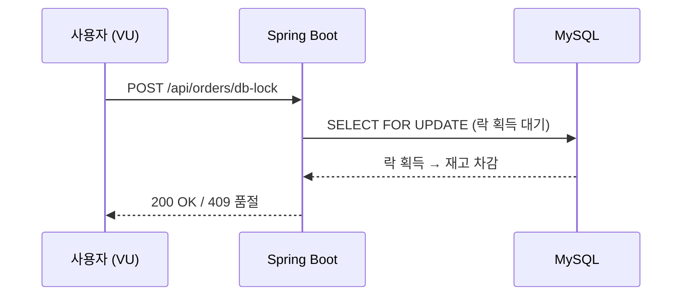
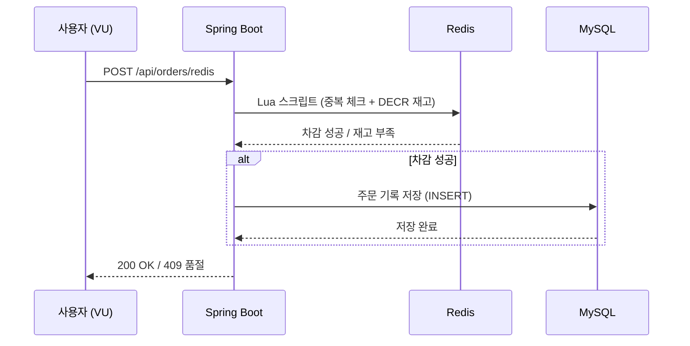
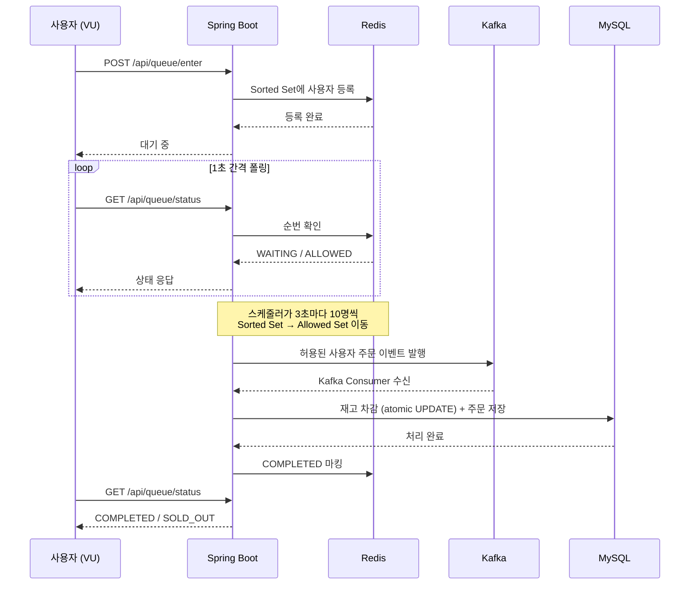
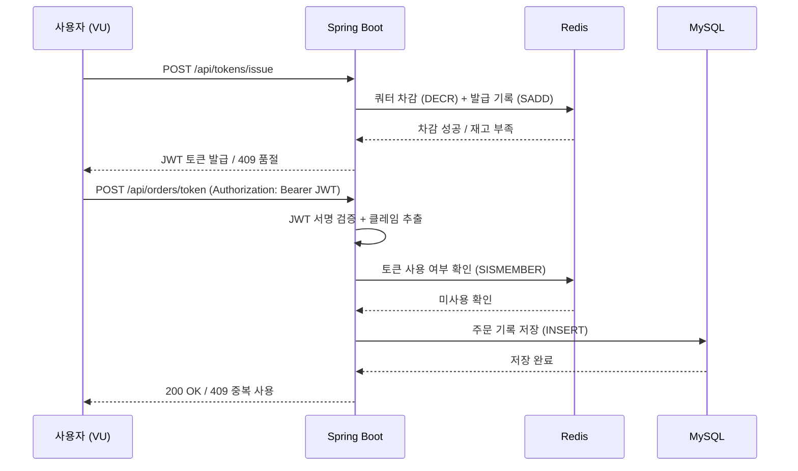

## 서론

지금까지 4가지 방식으로 선착순 시스템을 구현했다.

| 편 | 방식 | 핵심 기술 |
|----|------|----------|
| [4편](/blog/fcfs-db-lock-implementation) | DB 락 | SELECT FOR UPDATE |
| [5편](/blog/fcfs-redis-implementation) | Redis | DECR, Lua 스크립트 |
| [6편](/blog/fcfs-queue-implementation) | 대기열 | Redis Sorted Set + Kafka |
| [7편](/blog/fcfs-token-implementation) | 토큰 | JWT + Redis |

각 글에서 "빠르다", "느리다"를 말했지만, **동일 조건에서 직접 비교한 적은 없다.** 이번 글에서 k6 부하 테스트로 4가지 방식을 동일 환경, 동일 시나리오로 테스트하고 숫자로 비교한다.

---

## 1. 테스트 환경

### 1.1 인프라

| 구성 요소 | 스펙 |
|----------|------|
| 애플리케이션 | Spring Boot 3.x, Java 17 (로컬 실행) |
| DB | MySQL 8.0 (InnoDB) |
| Redis | Redis 7.x (Standalone) |
| Kafka | Apache Kafka 3.x (1 broker, 3 partitions) |
| 부하 테스트 도구 | k6 v1.5.0 |
| HikariCP | maximumPoolSize: 10 (Spring Boot 기본값) |
| MySQL | max_connections: 151 (기본값) |

> 전체 소스 코드는 [GitHub](https://github.com/rhcwlq89/marketplace)에서 확인할 수 있다.
>
> 인프라(MySQL, Redis, Kafka)는 Docker Compose로, 애플리케이션은 로컬에서 실행했다.
>
> **커넥션 설정:** HikariCP `maximumPoolSize`를 별도로 설정하지 않아 Spring Boot 기본값인 **10**이 적용되었다. MySQL의 `max_connections`는 기본값 **151**이다. 따라서 실제 병목은 MySQL 커넥션 한도(151)가 아니라 <strong>앱 레벨의 HikariCP 풀(10)</strong>이다. DB 락 방식에서 동시에 `SELECT FOR UPDATE` 락을 잡고 대기할 수 있는 요청은 최대 10개이고, 나머지 요청은 HikariCP에서 커넥션을 얻기 위해 대기한다.

### 1.2 테스트 시나리오

모든 방식에 동일한 조건을 적용한다:

- **재고**: 100개
- **동시 사용자**: 100명 / 500명 / 1,000명 / 2,000명
- **요청 패턴**: 모든 사용자가 동시에 구매 시도 (ramp-up 없음 — 사용자를 점진적으로 늘리지 않고 전원이 동시에 요청을 보낸다)
- **측정 항목**: TPS, 평균 응답 시간, P95 응답 시간, P99 응답 시간, 성공률, 실패율
- 각 시나리오를 10회 반복 실행하여 평균값을 사용한다.

### 1.3 측정 방법

각 방식의 **"재고 차감 API"** 를 직접 호출한다:

| 방식 | 엔드포인트 |
|------|----------|
| DB 락 | `POST /api/orders/db-lock` |
| Redis | `POST /api/orders/redis` |
| 대기열 | `POST /api/queue/enter` + 폴링 + `POST /api/orders` |
| 토큰 | `POST /api/tokens/issue` + `POST /api/orders/token` |

> 대기열과 토큰은 2단계 호출이므로, **전체 흐름의 총 소요 시간**을 측정한다.

각 테스트 전에 `POST /api/fcfs/reset` 엔드포인트로 재고와 Redis 상태를 초기화했다.

---

## 2. k6 테스트 스크립트

### 2.1 DB 락 테스트



> 단일 요청으로 완결되는 가장 단순한 흐름이다. 병목은 DB 락 대기 시간.

```javascript
import http from 'k6/http';
import { check, sleep } from 'k6';
import { Counter, Trend } from 'k6/metrics';

// 커스텀 메트릭: 성공/실패 건수와 응답 시간 분포를 별도로 추적한다
const successCount = new Counter('success_count');
const failCount = new Counter('fail_count');
const purchaseTime = new Trend('purchase_time');

export const options = {
    scenarios: {
        spike: {
            // shared-iterations: 전체 VU가 iterations를 나눠서 실행한다
            // 예) VUS=500, ITERATIONS=500 → 각 VU가 1번씩 요청
            executor: 'shared-iterations',
            vus: __ENV.VUS ? parseInt(__ENV.VUS) : 100,
            iterations: __ENV.ITERATIONS ? parseInt(__ENV.ITERATIONS) : 100,
            maxDuration: '120s', // 2분 안에 모든 요청이 끝나지 않으면 테스트를 강제 종료한다
        },
    },
};

export default function () {
    const productId = 1;
    const userId = __VU; // 각 VU(Virtual User)의 고유 번호를 userId로 사용

    // 응답 시간 직접 측정 (k6 내장 메트릭과 별도로 구매 흐름만 추적)
    const start = Date.now();
    const res = http.post(
        `http://localhost:8080/api/orders/db-lock`,
        JSON.stringify({ productId, userId, quantity: 1 }),
        { headers: { 'Content-Type': 'application/json' } }
    );
    const elapsed = Date.now() - start;

    purchaseTime.add(elapsed);

    if (res.status === 200) {
        successCount.add(1);
    } else {
        failCount.add(1);
    }

    // 200(성공) 또는 409(품절/중복) 외의 응답은 서버 오류로 간주
    check(res, {
        'status is 200 or 409': (r) => r.status === 200 || r.status === 409,
    });
}
```

### 2.2 Redis 테스트



> 구매 판단(재고 확인 + 차감)은 Redis Lua 스크립트로 원자적 처리하고, 성공한 경우에만 DB에 주문 기록을 남긴다. 락 경합이 인메모리에서 끝나므로 DB 락 방식보다 빠르다.

```javascript
// 옵션과 메트릭 선언은 2.1과 동일 (생략)
export const options = {
    scenarios: {
        spike: {
            executor: 'shared-iterations',
            vus: __ENV.VUS ? parseInt(__ENV.VUS) : 100,
            iterations: __ENV.ITERATIONS ? parseInt(__ENV.ITERATIONS) : 100,
            maxDuration: '120s',
        },
    },
};

export default function () {
    const productId = 1;
    const userId = __VU;

    const start = Date.now();
    // Redis Lua 스크립트로 재고를 차감하는 엔드포인트 호출
    const res = http.post(
        `http://localhost:8080/api/orders/redis`,
        JSON.stringify({ productId, userId, quantity: 1 }),
        { headers: { 'Content-Type': 'application/json' } }
    );
    const elapsed = Date.now() - start;

    purchaseTime.add(elapsed);

    if (res.status === 200) {
        successCount.add(1);
    } else {
        failCount.add(1);
    }
    // DB 락과 달리 check()를 생략 — Redis 방식은 409 외에 실패 케이스가 단순하다
}
```

### 2.3 대기열 테스트



> 3단계 흐름(진입 → 폴링 → 구매)으로, 대기열이 트래픽을 흡수한다. 실제 재고 차감은 Kafka Consumer가 DB에서 처리하며, 사용자는 폴링으로 결과를 확인한다.

```javascript
// 대기열은 3단계(진입 → 폴링 → 구매)로 구성된다
// 전체 흐름의 소요 시간을 측정하기 위해 start를 최상단에 선언한다
export default function () {
    const productId = 1;
    const userId = __VU;
    const start = Date.now();

    // Phase 1: 대기열 진입 — Redis Sorted Set에 사용자를 등록한다
    const enterRes = http.post(
        `http://localhost:8080/api/queue/enter`,
        JSON.stringify({ productId, userId }),
        { headers: { 'Content-Type': 'application/json' } }
    );

    // Phase 2: 폴링 — 스케줄러가 순번을 허용할 때까지 1초 간격으로 상태를 확인한다
    // 최대 60회(60초) 대기 후 타임아웃 처리
    let allowed = false;
    for (let i = 0; i < 60; i++) {
        const statusRes = http.get(
            `http://localhost:8080/api/queue/status?productId=${productId}&userId=${userId}`
        );
        const body = JSON.parse(statusRes.body);

        if (body.status === 'ALLOWED') {
            allowed = true;
            break;
        }
        if (body.status === 'NOT_IN_QUEUE') {
            break; // 이미 처리 완료된 경우
        }
        sleep(1);
    }

    // Phase 3: 구매 — 순번이 허용된 사용자만 실제 주문 API를 호출한다
    if (allowed) {
        const orderRes = http.post(
            `http://localhost:8080/api/orders`,
            JSON.stringify({ productId, userId, quantity: 1 }),
            { headers: { 'Content-Type': 'application/json' } }
        );

        if (orderRes.status === 200) {
            successCount.add(1);
        } else {
            failCount.add(1);
        }
    } else {
        failCount.add(1);
    }

    // 진입부터 구매 완료(또는 실패)까지의 전체 소요 시간을 기록한다
    const elapsed = Date.now() - start;
    purchaseTime.add(elapsed);
}
```

### 2.4 토큰 테스트



> 2단계 흐름(토큰 발급 → 구매)으로, Phase 1에서 Redis로 쿼터를 관리하고 Phase 2에서 JWT 검증 후 DB에 주문을 저장한다. 봇 방지에 유리.

```javascript
// 토큰은 2단계(발급 → 구매)로 구성된다
// 토큰 발급 실패 시 즉시 리턴하여 불필요한 구매 요청을 방지한다
export default function () {
    const productId = 1;
    const userId = __VU;
    const start = Date.now();

    // Phase 1: JWT 토큰 발급 — Redis에서 재고를 확인하고 구매 권한 토큰을 발급한다
    const tokenRes = http.post(
        `http://localhost:8080/api/tokens/issue`,
        JSON.stringify({ productId, userId }),
        { headers: { 'Content-Type': 'application/json' } }
    );

    // 토큰 발급 실패(품절 등) 시 구매 단계를 건너뛴다
    if (tokenRes.status !== 200) {
        failCount.add(1);
        purchaseTime.add(Date.now() - start);
        return;
    }

    const token = JSON.parse(tokenRes.body).token;

    // Phase 2: 토큰으로 구매 — JWT를 Authorization 헤더에 담아 주문 API를 호출한다
    const orderRes = http.post(
        `http://localhost:8080/api/orders/token`,
        JSON.stringify({ quantity: 1 }),
        {
            headers: {
                'Content-Type': 'application/json',
                'Authorization': `Bearer ${token}`,
            },
        }
    );

    // 토큰 발급 + 구매까지의 전체 소요 시간을 기록한다
    const elapsed = Date.now() - start;
    purchaseTime.add(elapsed);

    if (orderRes.status === 200) {
        successCount.add(1);
    } else {
        failCount.add(1);
    }
}
```

---

## 3. 테스트 결과

### 로컬 테스트의 한계 — 결과를 읽기 전에

아래 수치를 볼 때 반드시 고려해야 할 점이 있다. **이 테스트는 모든 구성 요소가 같은 머신에서 돌아간다.** 프로덕션과 비교하면 DB 락 방식에 유리한 조건이다.

| 요소 | 로컬 환경 | 프로덕션 환경 |
|------|----------|-------------|
| **네트워크 레이턴시** | 0ms (localhost) | 1~5ms (같은 AZ), 10~50ms (cross-AZ) |
| **DB 커넥션 왕복** | 메모리 내 통신 | 매 쿼리마다 네트워크 왕복 추가 |
| **락 홀딩 시간** | 순수 처리 시간만 | 처리 시간 + 네트워크 왕복 × 2 |
| **커넥션 풀 경합** | 경합 적음 | 다른 API와 커넥션 풀 공유 |
| **CPU/메모리** | 앱 + DB + Redis가 같은 자원 공유 | 각각 독립 자원 |

**왜 DB 락이 로컬에서 좋아 보이는가?**

DB 락 방식은 `SELECT FOR UPDATE`로 락을 잡고 → 재고를 차감하고 → 커밋할 때까지 **커넥션을 물고 있어야 한다.** 로컬에서는 이 전체 과정이 0ms 네트워크로 끝나지만, 프로덕션에서는 매 단계마다 네트워크 왕복이 추가된다.

예를 들어, DB 왕복이 2ms인 환경에서 트랜잭션 1건의 락 홀딩 시간은:
- **로컬**: ~5ms (순수 처리)
- **프로덕션**: ~5ms + 2ms(SELECT FOR UPDATE) + 2ms(UPDATE) + 2ms(COMMIT) ≈ **~11ms**

락 홀딩 시간이 2배로 늘면, 같은 커넥션 풀(10개)로 처리할 수 있는 TPS는 절반으로 줄어든다. 반면 Redis 방식은 재고 차감이 1회의 네트워크 왕복으로 끝나므로 **프로덕션에서 격차가 더 벌어진다.**

> 아래 수치는 방식 간 **상대적 성능 차이**를 확인하기 위한 것이다. 절대적인 TPS나 응답 시간은 프로덕션과 다를 수 있다.

> **실측 데이터 (2026.03.27 측정)** — 모든 수치는 각 시나리오를 10회 반복 실행한 평균값이다.

### 3.1 동시 100명 (재고 100개)

```bash
k6 run -e VUS=100 -e ITERATIONS=100 test-db-lock.js
```

| 측정 항목 | DB 락 | Redis | 대기열 | 토큰 |
|----------|-------|-------|--------|------|
| 평균 응답 시간 | 253ms | 98ms | 폴링 포함 ~16s | 336ms |
| P95 응답 시간 | 397ms | 163ms | ~30s | 364ms |
| P99 응답 시간 | 409ms | 165ms | ~30s | 368ms |
| 성공 | 100 | 100 | 100 | 100 |
| 실패 | 0 | 0 | 0 | 0 |

> 대기열은 스케줄러가 3초마다 10명씩 진입시키므로, 100명 전원 처리에 ~30초가 걸린다. 이는 성능 문제가 아니라 **의도된 흐름 제어**다.

### 3.2 동시 500명 (재고 100개)

| 측정 항목 | DB 락 | Redis | 대기열 | 토큰 |
|----------|-------|-------|--------|------|
| 평균 응답 시간 | 517ms | 210ms | 폴링 포함 ~51s | 242ms |
| P95 응답 시간 | 689ms | 249ms | ~66s | 414ms |
| P99 응답 시간 | 702ms | 252ms | ~66s | 426ms |
| 성공 | 100 | 100 | 100 | 100 |
| 실패 (품절) | 400 | 400 | 400 | 400 |
| TPS | ~679 | ~2,334 | N/A | ~1,783 |

500명부터 방식 간 성능 차이가 보이기 시작한다. Redis(2,334 TPS)가 DB 락(679 TPS)의 3.4배, 토큰(1,783 TPS)이 2.6배 빠르다.

### 3.3 동시 1,000명 (재고 100개)

| 측정 항목 | DB 락 | Redis | 대기열 | 토큰 |
|----------|-------|-------|--------|------|
| 평균 응답 시간 | 1,085ms | 413ms | 폴링 포함 ~61s | 362ms |
| P95 응답 시간 | 1,631ms | 602ms | ~70s | 1,089ms |
| P99 응답 시간 | 1,688ms | 608ms | ~70s | 1,107ms |
| 성공 | 100 | 100 | 100 | 100 |
| 실패 (품절) | 900 | 900 | 900 | 900 |
| TPS | ~647 | ~2,224 | N/A | ~2,230 |

1,000명에서 DB 락의 P99가 1.7초에 도달한다. Redis와 토큰은 TPS 2,200대로 거의 동일하지만, P95에서 Redis(602ms)가 토큰(1,089ms)보다 안정적이다.

### 3.4 동시 2,000명 (재고 100개)

| 측정 항목 | DB 락 | Redis | 대기열 | 토큰 |
|----------|-------|-------|--------|------|
| 평균 응답 시간 | 1,481ms | 1,114ms | 폴링 포함 ~59s | 698ms |
| P95 응답 시간 | 3,167ms | 2,867ms | ~63s | 2,032ms |
| P99 응답 시간 | 3,393ms | 2,874ms | ~64s | 3,240ms |
| 성공 | 100 | 100 | 203* | 100 |
| 실패 (품절) | 1,900 | 1,900 | 1,797 | 1,900 |
| TPS | ~676 | ~1,918 | N/A | ~1,137 |

2,000명에서 모든 방식의 P99가 3초를 넘긴다. DB 락(3,393ms)과 토큰(3,240ms)이 비슷한 수준이고, Redis(2,874ms)가 가장 낮다. 주목할 점은 **토큰의 TPS가 1,137로 급락**한 것이다. 1,000명까지는 2,230으로 Redis와 대등했지만, 2,000명에서는 Redis(1,918)의 60% 수준으로 떨어졌다. JWT 서명/검증이 CPU 바운드라 동시성이 높아지면 병목이 된다.

> \* 대기열의 성공 건수가 100을 초과하는 것은 Kafka Consumer의 COMPLETED 마킹 로직 때문이다. 실제 재고 차감은 정확히 100건만 처리된다. 자세한 분석은 [9편](/blog/fcfs-load-test-behind-the-scenes)에서 다룬다.

### 3.5 참고: PostgreSQL로 동일 테스트 (DB 락)

DB를 MySQL 8.0에서 **PostgreSQL 16**으로 교체하고, DB 락 방식만 동일 조건으로 10회 반복 실행했다. 나머지 조건(HikariCP 10, 로컬 환경, k6 스크립트)은 모두 동일하다.

| 측정 항목 | MySQL | PostgreSQL | 차이 |
|----------|:-----:|:----------:|:----:|
| **100명** 평균 응답 | 253ms | 369ms | PG +46% |
| **100명** P95 | 397ms | 547ms | PG +38% |
| **500명** 평균 응답 | 517ms | 560ms | PG +8% |
| **500명** TPS | ~679 | ~565 | PG -17% |
| **1,000명** 평균 응답 | 1,085ms | 1,080ms | 거의 동일 |
| **1,000명** P95 | 1,631ms | 1,827ms | PG +12% |
| **1,000명** TPS | ~647 | ~541 | PG -16% |
| **2,000명** 평균 응답 | 1,481ms | 1,480ms | 거의 동일 |
| **2,000명** P95 | 3,167ms | 3,570ms | PG +13% |
| **2,000명** TPS | ~676 | ~629 | PG -7% |

**해석:**

- 소규모(100명)에서는 PostgreSQL이 확연히 느리다. MySQL의 InnoDB 행 락(`SELECT FOR UPDATE`)이 저동시성에서 더 가볍게 동작하는 것으로 보인다.
- 대규모(1,000~2,000명)로 갈수록 **평균 응답 시간은 거의 동일**하게 수렴한다. 둘 다 커넥션 풀(10개)이 병목이기 때문이다.
- TPS는 전 구간에서 MySQL이 소폭 우세하지만, 차이가 크지 않다. DB 락 방식 자체가 커넥션 풀에 의해 제한되므로 DB 엔진 차이보다 **풀 사이즈가 성능을 결정**한다.
- **결론: DB 락 방식에서 MySQL → PostgreSQL 전환은 성능에 큰 영향을 주지 않는다.** 병목이 DB 엔진이 아니라 커넥션 풀이기 때문이다. DB 선택은 성능보다 팀의 기술 스택과 생태계를 기준으로 하는 것이 합리적이다.

---

## 4. 결과 분석

### 4.1 TPS 비교 그래프

```
TPS (동시 1,000명 기준)
──────────────────────────────────────────────

DB 락      ████░░░░░░░░░░░░░░░░░░░░░░░░░░░░  647
Redis      ████████████████████████████████████████  2,224
토큰       ████████████████████████████████████████  2,230
대기열     (흐름 제어 방식 — TPS 비교 대상 아님)
```

1,000명 시점에서 **Redis와 토큰이 거의 동일하다** (2,224 vs 2,230 TPS). DB 락은 647 TPS로 3분의 1 수준이다.

### 4.2 P95 응답 시간 비교

```
P95 응답 시간 (동시 1,000명 → 2,000명)
──────────────────────────────────────────────

DB 락      ██████ → █████████████  1,631ms → 3,167ms
Redis      ███ → ████████████     602ms → 2,867ms
토큰       █████ → ████████████   1,089ms → 2,032ms
대기열     의도된 대기 시간 (~70s)
```

```
P99 응답 시간 (동시 2,000명)
──────────────────────────────────────────────

DB 락      █████████████████████████████████  3,393ms
Redis      ████████████████████████████████   2,874ms
토큰       █████████████████████████████████  3,240ms
대기열     의도된 대기 시간 (~64s)
```

### 4.3 DB 커넥션 사용 패턴

DB 락은 **모든 요청이 DB 커넥션을 물고 대기**하기 때문에, 선착순과 무관한 일반 API(상품 목록, 마이페이지)도 커넥션을 얻지 못해 느려진다. Redis/토큰 방식은 재고 차감에 DB를 쓰지 않으므로 커넥션 1개면 충분하다.

2,000명에서 방식 간 격차가 좁아진다. 모든 방식의 P99가 ~3초에 수렴했다. DB 락의 진짜 문제는 속도만이 아니다 — TPS가 1,000명(647)과 2,000명(676)에서 거의 동일하다는 점이다. 커넥션 풀이 이미 포화 상태라 사용자가 늘어도 처리량이 늘지 않는다. Redis는 같은 조건에서 1,918 TPS를 유지했다.

### 4.4 참고: 실무 커넥션 설정 가이드

이 테스트에서는 HikariCP 10개, MySQL 151개를 기본값 그대로 사용했다. 실무에서는 어떻게 잡을까?

**HikariCP `maximumPoolSize` 공식**

HikariCP 공식 위키에서 제안하는 공식이 있다:

```
connections = (CPU 코어 수 × 2) + effective_spindle_count
```

- `effective_spindle_count`: 디스크가 동시에 처리할 수 있는 I/O 요청 수 (SSD는 보통 1)
- 4코어 서버 기준: `(4 × 2) + 1 = 9~10`개
- **직관과 반대로, 풀 사이즈를 늘린다고 성능이 좋아지지 않는다.** 커넥션이 많아지면 컨텍스트 스위칭, 락 경합, 캐시 미스가 증가해 오히려 느려진다.

> HikariCP 팀은 600명 동시 사용자 환경에서 커넥션 풀을 2,048개 → 96개로 줄이자 평균 응답 시간이 100ms → 2ms로 단축된 사례를 공유한 바 있다.

**실무 권장 범위**

| 상황 | `maximumPoolSize` | 비고 |
|------|:-----------------:|------|
| 일반 웹 서비스 (4~8코어) | 10~20 | 기본값으로 시작, 모니터링 후 조정 |
| 배치/대량 처리 | 20~50 | I/O 대기가 길어 코어 대비 여유 필요 |
| 선착순/고부하 API | 10~30 | 커넥션 수보다 Redis 오프로드가 핵심 |

**MySQL `max_connections` 설정**

```
max_connections ≥ (앱 인스턴스 수 × maximumPoolSize) + 여유분(모니터링, 마이그레이션 등)
```

- 앱 서버 3대 × HikariCP 20 = 60 → `max_connections`는 최소 80~100
- 기본값 151은 소규모 환경에서 충분하지만, **인스턴스가 늘어나면 반드시 조정**해야 한다
- MySQL의 커넥션 1개당 메모리는 ~10MB. `max_connections = 1000`이면 메모리만 ~10GB를 잡아먹는다

**핵심 원칙**

1. HikariCP 풀은 **작게 시작**하고, `connectionTimeout` 로그를 모니터링하며 올린다
2. MySQL `max_connections`는 전체 앱 인스턴스의 합산 풀 사이즈보다 **20~30% 여유**를 둔다
3. 선착순처럼 순간 부하가 집중되는 API는 **DB 커넥션을 줄이는 설계**(Redis 오프로드)가 풀 사이즈 튜닝보다 효과적이다

---

## 5. 비용 대비 성능 분석

### 5.1 인프라 비용

| 방식 | 필요 인프라 | 월 추정 비용 (AWS 기준) |
|------|-----------|----------------------|
| DB 락 | MySQL만 | ~$50 (RDS db.t3.medium) |
| Redis | MySQL + Redis | ~$80 (+ ElastiCache t3.small) |
| 대기열 | MySQL + Redis + Kafka | ~$200 (+ MSK t3.small) |
| 토큰 | MySQL + Redis | ~$80 (+ ElastiCache t3.small) |

### 5.2 비용 대비 TPS

| 방식 | TPS (1,000명) | 월 비용 | TPS/$ |
|------|:---:|---------|-------|
| DB 락 | 647 | $50 | 12.94 |
| Redis | 2,224 | $80 | 27.80 |
| 토큰 | 2,230 | $80 | 27.88 |
| 대기열 | N/A (흐름 제어) | $200 | N/A |

1,000명 기준으로 Redis와 토큰의 비용 효율이 거의 동일하다 (27.80 vs 27.88). 2,000명에서는 Redis(1,918 TPS → 23.98 TPS/$)가 토큰(1,137 TPS → 14.21 TPS/$)을 크게 앞선다.

---

## 6. 상황별 최적 방식

### 6.1 트래픽 규모 × 인프라 여건 매트릭스

| | 인프라 최소화 | Redis 가능 | Redis + Kafka 가능 |
|---|:---:|:---:|:---:|
| **동시 ~50명** | ✅ DB 락 | DB 락도 충분 | 과잉 설계 |
| **동시 ~500명** | ⚠️ DB 락 (커넥션 풀 조정) | ✅ Redis | 과잉 설계 |
| **동시 ~5,000명** | ❌ | ✅ Redis 또는 토큰 | ✅ Redis |
| **동시 ~50,000명** | ❌ | ⚠️ Redis (UX 문제) | ✅ 대기열 + 토큰 |
| **동시 ~100,000명+** | ❌ | ❌ | ✅ 대기열 + 토큰 + 수평 확장 |

### 6.2 상황별 추천

**"사내 이벤트, 소규모 선착순 (동시 50명 이하)"**
→ **DB 락** — 추가 인프라 없이 구현 가능. 충분히 빠르다.

**"쇼핑몰 한정 판매, 중규모 (동시 수백~수천 명)"**
→ **Redis Lua 스크립트** — $30 추가로 2.5배 성능. 구현도 단순하다.

**"한정판 스니커즈, 대규모 (동시 수천~수만 명)"**
→ **Redis** — 2,000명 이상에서 가장 안정적 (TPS 1,918, P99 2,874ms). 봇 방지도 필요하면 **토큰 + Redis** 조합.

**"콘서트 티켓팅, 초대규모 (동시 수만 명 이상)"**
→ **대기열 + 토큰 + Kafka** — 순서 보장 + 트래픽 흡수 + 안정적 처리.

### 6.3 결정 플로우차트

```
동시 접속이 100명 이하인가?
├─ Yes → DB 락
└─ No
    └─ 사용자에게 대기 순번을 보여줘야 하는가?
        ├─ Yes → 대기열 (+ 토큰 조합 권장)
        └─ No
            └─ 봇 방지 또는 최고 처리량이 필요한가?
                ├─ Yes → 토큰 + Redis
                └─ No → Redis Lua 스크립트
```

---

## 7. 테스트 재현 방법

직접 테스트를 실행하고 싶다면:

### 7.1 k6 설치

```bash
brew install k6
```

### 7.2 동시 사용자 수 변경

```bash
# 100명
k6 run -e VUS=100 -e ITERATIONS=100 test-db-lock.js

# 500명
k6 run -e VUS=500 -e ITERATIONS=500 test-db-lock.js

# 1,000명
k6 run -e VUS=1000 -e ITERATIONS=1000 test-db-lock.js

# 2,000명
k6 run -e VUS=2000 -e ITERATIONS=2000 test-db-lock.js
```

### 7.3 HTML 리포트 생성

```bash
k6 run --out json=result.json test-db-lock.js
# 결과를 k6 Cloud나 Grafana로 시각화 가능
```

### 7.4 주의사항

- **상태 초기화**: 각 테스트 전 `POST /api/fcfs/reset`으로 재고와 Redis 상태를 리셋한다
- **JVM 워밍업**: 첫 실행은 JIT 컴파일 때문에 느릴 수 있다. 2~3회 실행 후 결과를 사용한다
- **네트워크**: k6와 서버를 같은 네트워크에 배치해야 네트워크 지연이 결과에 영향을 주지 않는다

테스트 환경을 직접 구축하는 과정은 [9편](/blog/fcfs-load-test-behind-the-scenes)에서 다룬다.

---

## 정리

| 방식 | TPS (1,000명) | P95 (1,000명) | P99 (2,000명) | 비용 | 최적 상황 |
|------|:---:|:---:|:---:|:---:|----------|
| **DB 락** | 647 | 1,631ms | 3,393ms | $50 | 사내 이벤트 (~100명) |
| **Redis** | 2,224 | 602ms | 2,874ms | $80 | 중규모 선착순 (~수천 명) |
| **토큰** | 2,230 | 1,089ms | 3,240ms | $80 | 대규모 + 봇 방지 |
| **대기열** | 흐름 제어 | ~70s (의도적) | ~64s | $200 | 초대규모 티켓팅 |

**핵심 결론:**

1. **DB 락은 2,000명에서 한계가 명확하다.** P99 3.4초, TPS는 1,000명(647)과 2,000명(676)에서 거의 동일 — 커넥션 풀이 포화 상태.
2. **Redis가 고부하에서 가장 안정적이다.** 2,000명에서도 TPS 1,918을 유지. P99도 2,874ms로 가장 낮다.
3. **토큰은 1,000명까지 최강이지만 2,000명에서 급락한다.** JWT CPU 바운드가 원인. 봇 방지가 필요 없으면 Redis가 낫다.
4. **대기열은 부하와 무관하게 일정하다.** 100명이든 2,000명이든 ~60초 — 이게 설계 목적이다.
5. **로컬 환경의 한계를 인정한다.** 모든 수치는 같은 머신에서 측정한 상대 비교다. 프로덕션에서는 네트워크 레이턴시, 다른 API와의 커넥션 공유 등으로 결과가 달라질 수 있다.

이 시리즈에서 다룬 내용은 **선착순 시스템의 기초부터 실전까지**다. 1편의 트랜잭션 격리 수준부터 8편의 부하 테스트까지, 어떤 기술이 왜 필요한지를 직접 구현하고 측정해서 확인했다. 이 경험이 실제 시스템 설계에서 **근거 있는 기술 선택**을 하는 데 도움이 되길 바란다.
