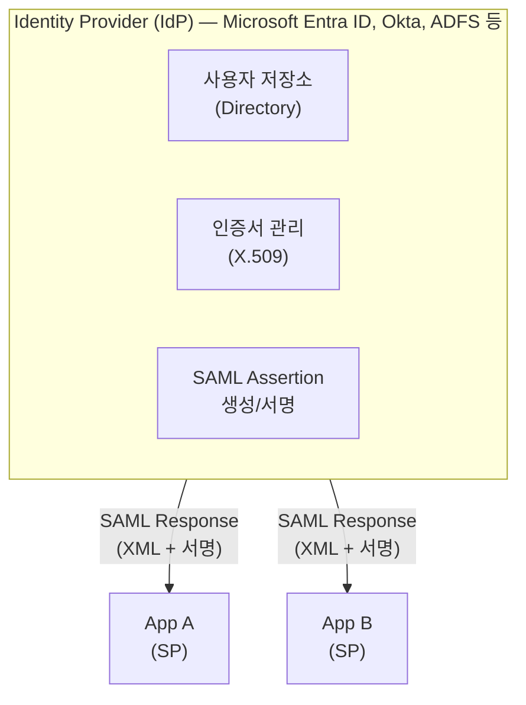
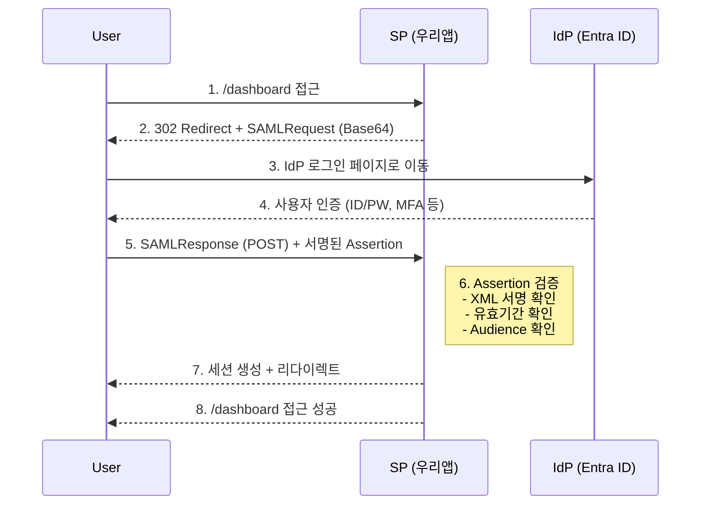
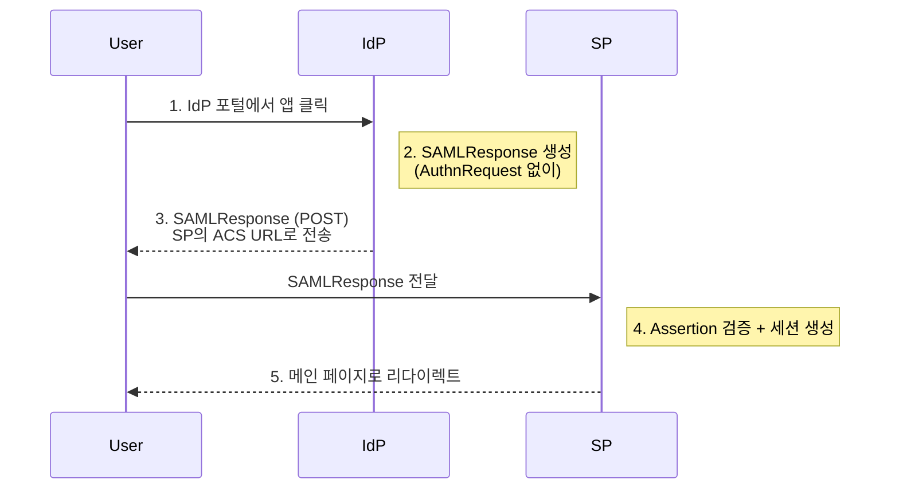
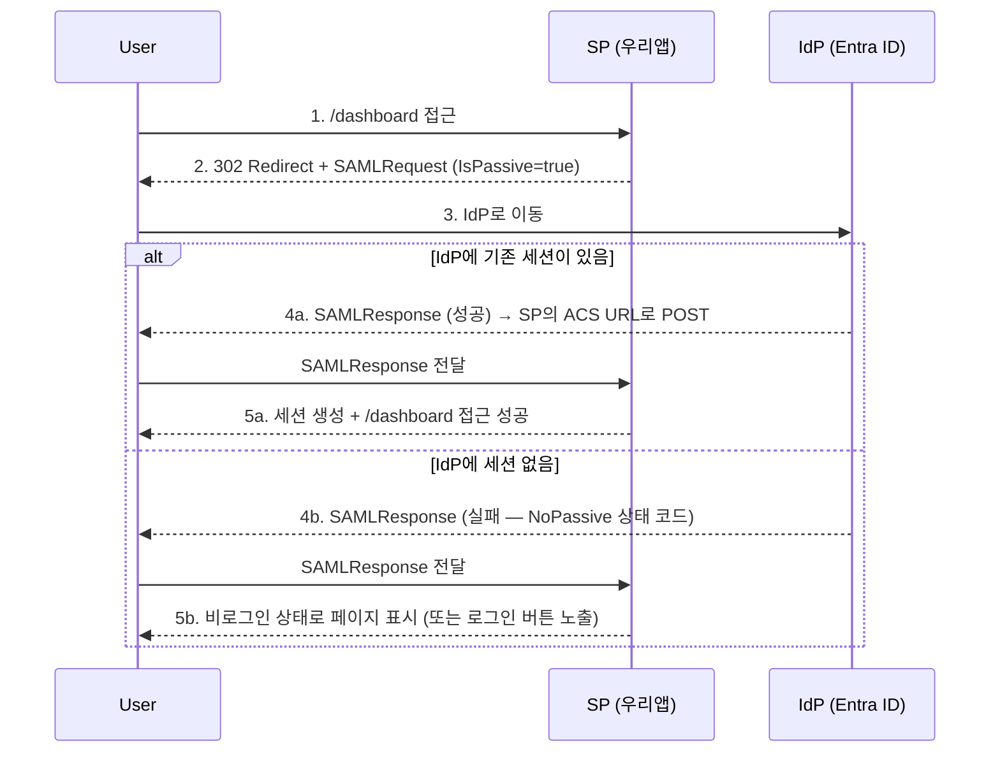
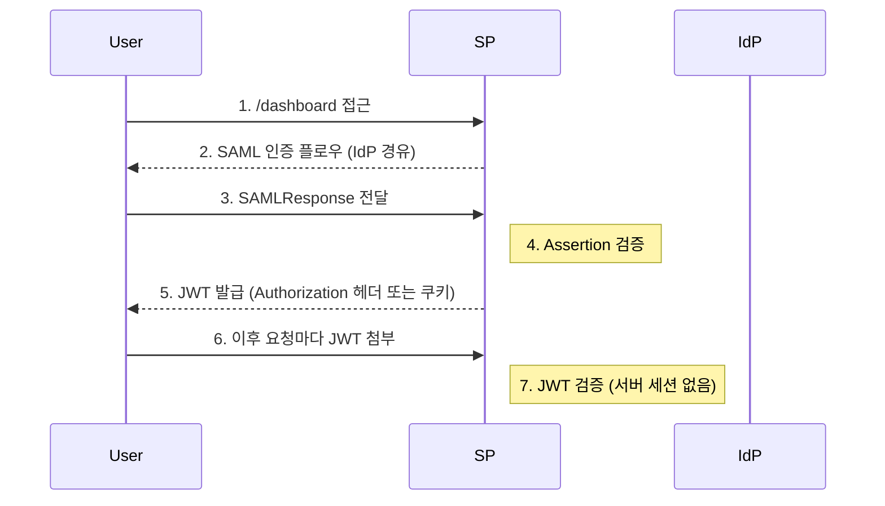
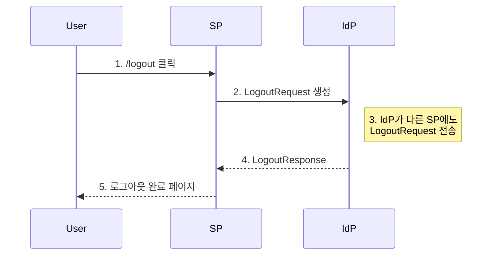

## 서론

엔터프라이즈 환경에서 SAML 2.0은 여전히 가장 널리 사용되는 인증 프로토콜 중 하나다. 특히 Microsoft 365, Salesforce, ServiceNow 같은 SaaS 애플리케이션과의 통합에서 SAML은 사실상 표준이다.

이 가이드에서는 SAML 2.0의 핵심 개념을 정리하고, Spring Boot 애플리케이션에서 **Microsoft Entra ID(구 Azure AD)** 와 SAML 연동을 실제로 구현하는 방법을 다룬다.

### 목차

- [SAML 2.0 핵심 개념](#1-saml-20-핵심-개념)
- [SAML 인증 흐름 상세](#2-saml-인증-흐름-상세)
- [Microsoft Entra ID SAML 설정](#3-microsoft-entra-id-saml-설정)
- [Spring Boot SAML 연동 구현](#4-spring-boot-saml-연동-구현)
- [SAML Assertion 처리와 사용자 매핑](#5-saml-assertion-처리와-사용자-매핑)
- [로그아웃 처리 (SLO)](#6-로그아웃-처리-slo)
- [트러블슈팅과 디버깅](#7-트러블슈팅과-디버깅)
- [보안 체크리스트](#8-보안-체크리스트)
- [FAQ](#9-faq)

---

## 1. SAML 2.0 핵심 개념

### 1.1 SAML이란?

**SAML(Security Assertion Markup Language) 2.0** 은 인증(Authentication)과 인가(Authorization) 데이터를 XML 형식으로 교환하기 위한 표준 프로토콜이다. 2005년에 OASIS에서 제정했으며, 엔터프라이즈 SSO의 핵심 기술로 자리 잡았다.



### 1.2 핵심 용어

| 용어 | 설명 |
|------|------|
| **IdP (Identity Provider)** | 사용자 인증을 수행하고 SAML Assertion을 발급하는 시스템 |
| **SP (Service Provider)** | 사용자에게 서비스를 제공하는 애플리케이션 (우리 앱) |
| **SAML Assertion** | IdP가 SP에게 전달하는 인증 정보가 담긴 XML 문서 |
| **Metadata** | IdP와 SP의 설정 정보를 담은 XML (엔드포인트, 인증서 등) |
| **ACS URL** | Assertion Consumer Service URL. SP가 SAML Response를 받는 엔드포인트 |
| **Entity ID** | IdP와 SP를 고유하게 식별하는 URI |
| **RelayState** | 인증 완료 후 리다이렉트할 원래 URL |
| **Name ID** | 사용자를 식별하는 값 (이메일, UPN 등) |

### 1.3 Spring Security 용어와의 매핑

Spring Security 문서는 SAML 표준 용어(IdP, SP) 대신 **자체 용어** 를 사용한다. `application.yml`이나 API에서 이 용어가 등장하므로 미리 알아두면 혼란을 줄일 수 있다:

| Spring Security 용어 | 일반 SAML 용어 | 의미 |
|---------------------|---------------|------|
| **RP (Relying Party)** | SP (Service Provider) | 우리 서비스 |
| **AP (Asserting Party)** | IdP (Identity Provider) | Microsoft Entra ID 등 |

예를 들어:
- `relyingparty.registration` = **SP(우리 앱)** 의 SAML 설정
- `assertingparty.metadata-uri` = **IdP(Microsoft)** 의 메타데이터 URL
- RP-initiated SLO = 우리 서비스에서 시작하는 로그아웃
- AP-initiated SLO = IdP(Microsoft)에서 시작하는 로그아웃

> **팁**: Spring Security 문서에서 AP라는 용어를 보면 "IdP와 같은 뜻"이라고 생각하면 된다.

### 1.4 SAML Assertion 구조

SAML Assertion은 세 가지 Statement로 구성된다:

```xml
<saml:Assertion xmlns:saml="urn:oasis:names:tc:SAML:2.0:assertion"
                ID="_abc123" Version="2.0"
                IssueInstant="2026-03-12T01:00:00Z">

  <!-- 1. Authentication Statement: 언제, 어떻게 인증했는가 -->
  <saml:AuthnStatement AuthnInstant="2026-03-12T01:00:00Z"
                       SessionIndex="_session_abc123">
    <saml:AuthnContext>
      <saml:AuthnContextClassRef>
        urn:oasis:names:tc:SAML:2.0:ac:classes:PasswordProtectedTransport
      </saml:AuthnContextClassRef>
    </saml:AuthnContext>
  </saml:AuthnStatement>

  <!-- 2. Attribute Statement: 사용자 속성 정보 -->
  <saml:AttributeStatement>
    <saml:Attribute Name="http://schemas.xmlsoap.org/ws/2005/05/identity/claims/emailaddress">
      <saml:AttributeValue>user@company.com</saml:AttributeValue>
    </saml:Attribute>
    <saml:Attribute Name="http://schemas.xmlsoap.org/ws/2005/05/identity/claims/givenname">
      <saml:AttributeValue>홍길동</saml:AttributeValue>
    </saml:Attribute>
    <saml:Attribute Name="http://schemas.microsoft.com/ws/2008/06/identity/claims/groups">
      <saml:AttributeValue>admin-group-id</saml:AttributeValue>
    </saml:Attribute>
  </saml:AttributeStatement>

  <!-- 3. Authorization Decision Statement (선택): 인가 정보 -->
  <!-- 실무에서는 거의 사용하지 않음 -->
</saml:Assertion>
```

### 1.5 SAML vs OAuth2/OIDC 비교

| 항목 | SAML 2.0 | OAuth2/OIDC |
|------|----------|-------------|
| **토큰 형식** | XML Assertion | JWT (JSON) |
| **전송 방식** | Browser Redirect/POST | REST API |
| **서명 방식** | XML Signature (X.509) | JWS (JSON Web Signature) |
| **메타데이터** | XML Metadata | Well-Known Endpoint (JSON) |
| **모바일 지원** | 제한적 (브라우저 필요) | 우수 (네이티브 지원) |
| **복잡도** | 높음 (XML 파싱, 인증서 관리) | 낮음 |
| **엔터프라이즈 채택** | 매우 높음 | 점차 증가 |
| **사용 시나리오** | B2B, 레거시, 정부/금융 | B2C, 모바일, 신규 프로젝트 |

> **언제 SAML을 선택해야 하는가?**
> - 고객사가 SAML만 지원하는 IdP를 사용할 때
> - 기존 SAML 인프라와 통합해야 할 때
> - 정부/금융 규제가 SAML을 요구할 때
> - Microsoft Entra ID의 Enterprise Application으로 등록해야 할 때

---

## 2. SAML 인증 흐름 상세

### 2.1 SP-Initiated SSO (가장 일반적)

사용자가 SP(우리 앱)에 먼저 접근하는 방식이다:



### 2.2 IdP-Initiated SSO

사용자가 IdP 포털(예: Microsoft My Apps)에서 애플리케이션을 클릭하는 방식이다:



> **주의**: IdP-Initiated SSO는 CSRF 공격에 취약할 수 있다. 가능하면 SP-Initiated를 우선 사용하라.

### 2.3 Passive SSO (IsPassive)

SP-Initiated SSO에는 **Passive** 옵션이 있다. AuthnRequest에 `IsPassive="true"`를 설정하면, IdP는 **사용자에게 로그인 화면을 보여주지 않고** 이미 로그인된 세션이 있을 때만 인증을 수행한다.



#### 언제 쓰는가?

| 시나리오 | 설명 |
|---------|------|
| **사일런트 로그인 체크** | 페이지 로드 시 로그인 여부를 확인하되, 로그인 화면으로 튕기지 않아야 할 때 |
| **로그인/비로그인 공존 페이지** | 공개 페이지이지만, 로그인된 사용자에게는 개인화된 UI를 보여주고 싶을 때 |
| **세션 갱신** | 기존 IdP 세션이 살아있으면 자동으로 SP 세션을 연장할 때 |

#### SP-Initiated SSO vs Passive SSO

| 항목 | SP-Initiated (일반) | Passive (IsPassive=true) |
|------|-------------------|------------------------|
| IdP 세션 있음 | 즉시 인증 완료 | 즉시 인증 완료 (동일) |
| IdP 세션 없음 | **로그인 화면 표시** | **로그인 화면 없이 실패 응답** |
| 사용자 경험 | 강제 리다이렉트 | 끊김 없는 UX |
| 주 용도 | 보호된 리소스 접근 | 로그인 여부 사전 확인 |

> **핵심**: Passive SSO는 "로그인되어 있으면 가져오고, 아니면 말고"라는 전략이다. 사용자를 로그인 화면으로 강제로 보내지 않기 때문에 UX가 부드럽다.

### 2.4 SAML Binding 방식

SAML Binding이란 IdP와 SP 사이에서 SAML 메시지(AuthnRequest, SAMLResponse 등)를 **어떤 HTTP 방식으로 전달할지**를 정의하는 규약이다. 같은 SAML 플로우라도 메시지를 실어 나르는 "교통수단"이 다를 수 있고, 그것을 Binding이라고 부른다.

| Binding | 설명 | 용도 |
|---------|------|------|
| **HTTP-Redirect** | URL 쿼리 파라미터로 전송 (GET) | AuthnRequest 전송 |
| **HTTP-POST** | HTML Form의 hidden field로 전송 (POST) | SAMLResponse 전송 |
| **HTTP-Artifact** | 참조 토큰만 전달, 실제 데이터는 백채널로 | 대용량 Assertion |

위의 SP-Initiated SSO 플로우를 예로 들면:

- **2단계** (SP → IdP): AuthnRequest는 데이터가 작기 때문에 **HTTP-Redirect** (GET 요청의 URL 쿼리 파라미터)로 전송한다
- **5단계** (IdP → SP): SAMLResponse는 서명된 XML이라 데이터가 크기 때문에 **HTTP-POST** (HTML Form의 hidden field)로 전송한다

> **참고**: HTTP-Artifact는 브라우저를 통해 참조용 토큰만 전달하고, 실제 SAML 데이터는 서버 간 직접 통신(백채널)으로 교환하는 방식이다. 보안이 중요하거나 Assertion 크기가 클 때 사용하지만, 구현 복잡도가 높아 실무에서는 HTTP-Redirect + HTTP-POST 조합이 가장 일반적이다.

---

## 3. Microsoft Entra ID SAML 설정

### 3.1 Enterprise Application 등록

Microsoft Entra ID(구 Azure AD) 관리 센터에서 SAML 애플리케이션을 등록하는 절차다.

**1단계: 애플리케이션 생성**

```
Microsoft Entra 관리 센터
  └─ Enterprise Applications
       └─ + New Application
            └─ Create your own application
                 └─ "My Spring Boot App"
                 └─ "Integrate any other application you don't find in the gallery"
```

**2단계: SAML SSO 설정**

Single sign-on → SAML 선택 후 다음 항목을 설정한다:

| 설정 항목 | 값 | 설명 |
|-----------|---|------|
| **Identifier (Entity ID)** | `https://myapp.example.com/saml/metadata` | SP의 고유 식별자 |
| **Reply URL (ACS URL)** | `https://myapp.example.com/login/saml2/sso/azure` | SAML Response를 받을 URL |
| **Sign on URL** | `https://myapp.example.com/` | SP-Initiated SSO 시작 URL |
| **Relay State** | (비워두기) | 인증 후 리다이렉트 URL |
| **Logout URL** | `https://myapp.example.com/logout/saml2/slo` | Single Logout URL |

**3단계: Attributes & Claims 설정**

기본 클레임 외에 필요한 사용자 속성을 추가한다:

| Claim Name | Source Attribute | 설명 |
|------------|-----------------|------|
| `emailaddress` | user.mail | 사용자 이메일 |
| `givenname` | user.givenname | 이름 |
| `surname` | user.surname | 성 |
| `name` | user.displayname | 표시 이름 |
| `groups` | user.groups | 그룹 멤버십 |

**4단계: 인증서 다운로드**

- **Certificate (Base64)**: `.cer` 파일 다운로드 → SP의 신뢰 저장소에 등록
- **Federation Metadata XML**: IdP 메타데이터 → SP 설정에 사용
- **Login URL**: `https://login.microsoftonline.com/{tenant-id}/saml2`
- **Microsoft Entra Identifier**: `https://sts.windows.net/{tenant-id}/`

### 3.2 사용자/그룹 할당

```
Enterprise Application
  └─ Users and groups
       └─ + Add user/group
            └─ 접근을 허용할 사용자 또는 그룹 선택
```

> **중요**: 사용자/그룹을 할당하지 않으면 SAML 인증이 실패한다. `AADSTS50105` 에러가 발생한다.

---

## 4. Spring Boot SAML 연동 구현

### 4.1 의존성 추가

```kotlin
// build.gradle.kts
plugins {
    id("org.springframework.boot") version "3.4.3"
    id("io.spring.dependency-management") version "1.1.7"
    kotlin("jvm") version "2.1.10"
    kotlin("plugin.spring") version "2.1.10"
}

dependencies {
    implementation("org.springframework.boot:spring-boot-starter-web")
    implementation("org.springframework.boot:spring-boot-starter-security")
    implementation("org.springframework.boot:spring-boot-starter-thymeleaf")

    // SAML 2.0 핵심 의존성
    implementation("org.springframework.security:spring-security-saml2-service-provider")

    // 개발 편의
    developmentOnly("org.springframework.boot:spring-boot-devtools")
}
```

Maven 사용 시:

```xml
<dependencies>
    <dependency>
        <groupId>org.springframework.boot</groupId>
        <artifactId>spring-boot-starter-security</artifactId>
    </dependency>
    <dependency>
        <groupId>org.springframework.security</groupId>
        <artifactId>spring-security-saml2-service-provider</artifactId>
    </dependency>
</dependencies>
```

### 4.2 application.yml 설정

```yaml
spring:
  security:
    saml2:
      relyingparty:
        registration:
          azure:  # Registration ID (URL 경로에 사용됨)
            entity-id: https://myapp.example.com/saml/metadata

            # ACS 설정
            acs:
              location: "{baseUrl}/login/saml2/sso/{registrationId}"
              binding: POST  # 기본값이 POST이므로 생략 가능. SAMLResponse는 서명된 XML이라 데이터가 크기 때문에 POST만 사용한다

            # SP 서명 키 (AuthnRequest 서명 시 선택, SLO 사용 시 필수)
            # ⚠️ private-key는 비밀키이므로 절대 Git에 커밋하지 말 것 (.gitignore에 추가)
            # certificate는 공개키이므로 커밋해도 무방
            signing:
              credentials:
                - private-key-location: classpath:credentials/sp-private.key
                  certificate-location: classpath:credentials/sp-certificate.crt

            # IdP 설정 - 메타데이터 URL 사용 (권장)
            # 이 URL과 tenant-id, app-id는 공개 정보이므로 Git에 커밋해도 무방
            assertingparty:
              metadata-uri: https://login.microsoftonline.com/{tenant-id}/federationmetadata/2007-06/federationmetadata.xml?appid={app-id}

# 로깅 (개발 시)
logging:
  level:
    org.springframework.security.saml2: DEBUG
    org.opensaml: DEBUG
```

#### metadata-uri란?

`metadata-uri`는 IdP가 제공하는 **Federation Metadata XML 문서의 URL** 이다. 이 URL에 접속하면 IdP의 모든 설정 정보가 담긴 XML을 반환한다:

- **IdP Entity ID** — IdP를 식별하는 고유 URI
- **SSO 로그인 URL** — AuthnRequest를 보낼 엔드포인트
- **SLO 로그아웃 URL** — LogoutRequest를 보낼 엔드포인트
- **서명 인증서** — SAMLResponse의 XML 서명을 검증할 공개 인증서

Spring Security는 이 XML을 자동으로 파싱하여 위 정보를 전부 채워주므로, 개발자가 하나하나 수동으로 입력할 필요가 없다.

`{tenant-id}`와 `{app-id}`는 3.1절에서 등록한 Enterprise Application의 **개요(Overview) 페이지** 에서 확인할 수 있다.

> **Git 커밋 시 보안 체크리스트**
>
> | 항목 | Git 커밋 | 이유 |
> |------|---------|------|
> | `metadata-uri` URL, `tenant-id`, `app-id` | ✅ 가능 | 공개 정보 |
> | `azure-idp.cer` (IdP 공개 인증서) | ✅ 가능 | 공개키 (서명 검증용) |
> | `sp-certificate.crt` (SP 공개 인증서) | ✅ 가능 | 공개키 |
> | **`sp-private.key` (SP 비밀키)** | ❌ **절대 불가** | 유출 시 AuthnRequest 위조 가능 |

> **왜 metadata-uri가 권장인가?**
> - IdP의 인증서가 갱신되면 애플리케이션 재시작 시 **자동으로 새 인증서를 반영** 한다
> - 수동 설정은 인증서 파일을 직접 교체해야 하므로, 갱신을 놓치면 인증이 깨질 수 있다
> - IdP 설정이 변경되어도 별도 수정 없이 반영된다

**메타데이터 URL 대신 수동 설정 시:**

```yaml
spring:
  security:
    saml2:
      relyingparty:
        registration:
          azure:
            entity-id: https://myapp.example.com/saml/metadata
            acs:
              location: "{baseUrl}/login/saml2/sso/{registrationId}"
              binding: POST
            assertingparty:
              entity-id: https://sts.windows.net/{tenant-id}/
              single-sign-on:
                url: https://login.microsoftonline.com/{tenant-id}/saml2
                binding: POST
                sign-request: false
              verification:
                credentials:
                  # IdP의 공개 인증서 — metadata-uri XML에 포함된 것과 동일한 공개키이므로 Git에 커밋해도 무방
                  - certificate-location: classpath:credentials/azure-idp.cer
```

### 4.3 Security Configuration

```kotlin
import org.springframework.context.annotation.Bean
import org.springframework.context.annotation.Configuration
import org.springframework.security.config.annotation.web.builders.HttpSecurity
import org.springframework.security.config.annotation.web.configuration.EnableWebSecurity
import org.springframework.security.web.SecurityFilterChain

@Configuration
@EnableWebSecurity
class SecurityConfig {

    @Bean
    fun securityFilterChain(http: HttpSecurity): SecurityFilterChain {
        http
            .authorizeHttpRequests { auth ->
                auth
                    .requestMatchers("/", "/health", "/error").permitAll()
                    .requestMatchers("/admin/**").hasRole("ADMIN")
                    .anyRequest().authenticated()
            }
            .saml2Login { saml2 ->
                saml2
                    .loginPage("/")  // 커스텀 로그인 페이지
                    .defaultSuccessUrl("/dashboard", true)
                    .failureUrl("/login?error=true")
            }
            .saml2Logout { logout ->
                logout
                    .logoutUrl("/logout")
                    .logoutSuccessUrl("/")
            }
            .saml2Metadata { }  // SP 메타데이터 엔드포인트 활성화

        return http.build()
    }
}
```

### 4.4 세션 관리 방식 선택

SAML 인증은 IdP에서 SAMLResponse를 받아 Assertion을 검증하는 것까지가 역할이다. **그 이후 SP에서 사용자 상태를 어떻게 유지하느냐** 는 별개의 문제이며, 방식에 따라 Security 설정이 달라진다.

| 방식 | 특징 | 적합한 경우 |
|------|------|------------|
| **서버 세션 (기본)** | `JSESSIONID` 쿠키로 서버 측 세션 유지 | MPA, 단일 서버, 빠른 구현 |
| **JWT (Stateless)** | SAML 인증 후 JWT 발급, 서버에 세션 저장 안 함 | SPA + API 서버, 마이크로서비스 |
| **Redis 세션** | 서버 세션을 Redis에 저장 | 다중 인스턴스, 수평 확장 |

위의 4.3절 Security Configuration은 **서버 세션 방식 (기본값)** 이다. JWT 방식이 필요한 경우 아래와 같이 설정한다.

#### JWT 방식 설정

SAML 인증 성공 후 JWT를 발급하고, 이후 요청은 JWT로 인증하는 구조다:



SAML 인증과 JWT 검증은 **서로 다른 세션 정책** 이 필요하다. SAML은 IdP와의 리다이렉트 과정에서 세션이 필요하지만, API 요청은 Stateless여야 한다. 이를 해결하기 위해 `@Order`로 **SecurityFilterChain을 분리** 하는 것이 권장된다:

```kotlin
@Configuration
@EnableWebSecurity
class SecurityConfig(
    private val jwtTokenProvider: JwtTokenProvider
) {

    // ① SAML 인증 체인 — 로그인/로그아웃/메타데이터 경로만 처리
    @Bean
    @Order(1)
    fun samlFilterChain(http: HttpSecurity): SecurityFilterChain {
        http
            .securityMatcher("/login/saml2/**", "/saml2/**", "/logout", "/saml/metadata")
            // SAML 리다이렉트 과정에서 세션이 필요하므로 세션 허용
            .sessionManagement { it.sessionCreationPolicy(SessionCreationPolicy.IF_REQUIRED) }
            .saml2Login { saml2 ->
                saml2
                    // SAML 인증 성공 시 JWT를 발급하는 핸들러
                    .successHandler { request, response, authentication ->
                        val principal = authentication.principal as SamlUserPrincipal
                        val token = jwtTokenProvider.createToken(principal)
                        // SPA: JSON으로 응답
                        response.contentType = "application/json"
                        response.writer.write("""{"token": "$token"}""")
                    }
            }
            .saml2Logout { logout ->
                logout.logoutUrl("/logout").logoutSuccessUrl("/")
            }
            .saml2Metadata { }

        return http.build()
    }

    // ② API 체인 — JWT로 인증, 세션 사용 안 함
    @Bean
    @Order(2)
    fun apiFilterChain(http: HttpSecurity): SecurityFilterChain {
        http
            .securityMatcher("/api/**")
            .sessionManagement { it.sessionCreationPolicy(SessionCreationPolicy.STATELESS) }
            .authorizeHttpRequests { auth ->
                auth
                    .requestMatchers("/api/public/**").permitAll()
                    .anyRequest().authenticated()
            }
            .addFilterBefore(
                JwtAuthenticationFilter(jwtTokenProvider),
                UsernamePasswordAuthenticationFilter::class.java
            )

        return http.build()
    }

    // ③ 나머지 경로 (정적 리소스, 헬스체크 등)
    @Bean
    @Order(3)
    fun defaultFilterChain(http: HttpSecurity): SecurityFilterChain {
        http
            .authorizeHttpRequests { auth ->
                auth
                    .requestMatchers("/", "/health", "/error").permitAll()
                    .anyRequest().authenticated()
            }

        return http.build()
    }
}
```

> **왜 체인을 분리하는가?**
> - 하나의 체인에 `STATELESS`를 설정하면 SAML 리다이렉트 과정에서 세션을 찾지 못해 인증이 실패한다
> - `@Order`로 분리하면 SAML 경로는 세션을 사용하고, API 경로는 JWT만으로 동작한다
> - 각 체인의 `securityMatcher`로 경로를 명확히 구분하므로 설정이 충돌하지 않는다

> **주의사항**:
> - SAML SLO(Single Logout)는 서버 세션에 의존하므로, JWT 환경에서는 **토큰 블랙리스트** 등 별도 처리가 필요하다
> - JWT의 만료 시간은 SAML Assertion의 `SessionNotOnOrAfter` 값을 참고하여 설정하는 것을 권장한다
> - SPA 환경에서는 `successHandler`에서 JWT를 JSON으로 응답하고, MPA 환경에서는 `httpOnly` 쿠키로 설정하는 것이 일반적이다

### 4.5 SAML Response 커스텀 처리

#### 기본 동작

Spring Security는 SAML Response를 처리할 때 내부적으로 `OpenSaml4AuthenticationProvider`를 사용한다. 이 기본 Provider가 하는 일은:

1. SAMLResponse의 **XML 서명을 검증** 한다
2. Assertion의 **유효기간, Audience 등 조건을 확인** 한다
3. `NameID` 값을 Principal 이름으로 설정한다
4. Assertion의 Attribute들을 `Saml2AuthenticatedPrincipal`에 담아 `Saml2Authentication` 객체를 생성한다

별도 설정 없이도 인증 자체는 동작하지만, 기본 Provider는 Attribute를 단순히 맵으로 저장할 뿐이다. 실무에서는 **이메일, 이름, 그룹/역할 등을 추출하여 Spring Security의 `GrantedAuthority`로 매핑** 해야 하므로 커스텀 컨버터가 필요하다:

#### 커스텀 컨버터 구현

```kotlin
import org.opensaml.saml.saml2.core.Assertion
import org.opensaml.saml.saml2.core.Attribute
import org.springframework.core.convert.converter.Converter
import org.springframework.security.authentication.AbstractAuthenticationToken
import org.springframework.security.core.GrantedAuthority
import org.springframework.security.core.authority.SimpleGrantedAuthority
import org.springframework.security.saml2.provider.service.authentication.OpenSaml4AuthenticationProvider
import org.springframework.security.saml2.provider.service.authentication.OpenSaml4AuthenticationProvider.ResponseToken
import org.springframework.security.saml2.provider.service.authentication.Saml2Authentication
import org.springframework.stereotype.Component

@Component
class SamlResponseAuthenticationConverter : Converter<ResponseToken, AbstractAuthenticationToken> {

    companion object {
        // Microsoft Entra ID 표준 클레임 URI
        private const val CLAIM_EMAIL =
            "http://schemas.xmlsoap.org/ws/2005/05/identity/claims/emailaddress"
        private const val CLAIM_GIVEN_NAME =
            "http://schemas.xmlsoap.org/ws/2005/05/identity/claims/givenname"
        private const val CLAIM_SURNAME =
            "http://schemas.xmlsoap.org/ws/2005/05/identity/claims/surname"
        private const val CLAIM_DISPLAY_NAME =
            "http://schemas.xmlsoap.org/ws/2005/05/identity/claims/name"
        private const val CLAIM_GROUPS =
            "http://schemas.microsoft.com/ws/2008/06/identity/claims/groups"
        private const val CLAIM_ROLES =
            "http://schemas.microsoft.com/ws/2008/06/identity/claims/role"
    }

    override fun convert(responseToken: ResponseToken): AbstractAuthenticationToken {
        val response = responseToken.response
        val assertion = response.assertions.firstOrNull()
            ?: throw IllegalArgumentException("SAML Response에 Assertion이 없습니다")

        val attributes = extractAttributes(assertion)
        val authorities = extractAuthorities(assertion)

        val email = attributes[CLAIM_EMAIL] ?: assertion.subject?.nameID?.value ?: "unknown"
        val displayName = attributes[CLAIM_DISPLAY_NAME] ?: email

        val principal = SamlUserPrincipal(
            nameId = assertion.subject?.nameID?.value ?: "",
            email = email,
            displayName = displayName,
            givenName = attributes[CLAIM_GIVEN_NAME],
            surname = attributes[CLAIM_SURNAME],
            groups = extractMultiValueAttribute(assertion, CLAIM_GROUPS),
            attributes = attributes
        )

        return Saml2Authentication(
            principal,
            responseToken.token.samlResponse,
            authorities
        )
    }

    private fun extractAttributes(assertion: Assertion): Map<String, String> {
        return assertion.attributeStatements
            .flatMap { it.attributes }
            .associate { attr ->
                attr.name to (attr.attributeValues.firstOrNull()?.dom?.textContent ?: "")
            }
    }

    private fun extractMultiValueAttribute(assertion: Assertion, claimUri: String): List<String> {
        return assertion.attributeStatements
            .flatMap { it.attributes }
            .filter { it.name == claimUri }
            .flatMap { it.attributeValues }
            .mapNotNull { it.dom?.textContent }
    }

    private fun extractAuthorities(assertion: Assertion): List<GrantedAuthority> {
        val authorities = mutableListOf<GrantedAuthority>()

        // Role 클레임에서 권한 추출
        val roles = extractMultiValueAttribute(assertion, CLAIM_ROLES)
        roles.forEach { role ->
            authorities.add(SimpleGrantedAuthority("ROLE_${role.uppercase()}"))
        }

        // Group 클레임에서 권한 추출 (그룹 ID → 역할 매핑)
        val groups = extractMultiValueAttribute(assertion, CLAIM_GROUPS)
        authorities.addAll(mapGroupsToAuthorities(groups))

        // 기본 ROLE_USER 부여
        if (authorities.isEmpty()) {
            authorities.add(SimpleGrantedAuthority("ROLE_USER"))
        }

        return authorities
    }

    private fun mapGroupsToAuthorities(groupIds: List<String>): List<GrantedAuthority> {
        // Entra ID 그룹 Object ID → 애플리케이션 역할 매핑
        val groupRoleMapping = mapOf(
            "xxxxxxxx-xxxx-xxxx-xxxx-xxxxxxxxxxxx" to "ROLE_ADMIN",
            "yyyyyyyy-yyyy-yyyy-yyyy-yyyyyyyyyyyy" to "ROLE_MANAGER"
        )

        return groupIds
            .mapNotNull { groupRoleMapping[it] }
            .map { SimpleGrantedAuthority(it) }
    }
}
```

### 4.6 사용자 Principal 클래스

`Serializable`을 구현하는 이유: Spring Security는 인증 객체(`Authentication`)를 **HTTP 세션에 저장** 한다. 서버 세션 방식에서는 Principal이 세션에 직렬화되어 저장되고, Redis 세션이나 세션 클러스터링 환경에서는 네트워크를 통해 전송되기도 한다. `Serializable`이 없으면 세션 저장 시 `NotSerializableException`이 발생한다.

```kotlin
import org.springframework.security.saml2.provider.service.authentication.Saml2AuthenticatedPrincipal
import java.io.Serializable

data class SamlUserPrincipal(
    val nameId: String,
    val email: String,
    val displayName: String,
    val givenName: String? = null,
    val surname: String? = null,
    val groups: List<String> = emptyList(),
    private val attributes: Map<String, String> = emptyMap()
) : Saml2AuthenticatedPrincipal, Serializable {

    override fun getName(): String = email

    override fun getFirstAttribute(name: String): String? = attributes[name]

    override fun getAttributes(): Map<String, List<Any>> {
        return attributes.mapValues { listOf(it.value as Any) }
    }

    override fun getSessionIndexes(): List<String> = emptyList()

    override fun getRelyingPartyRegistrationId(): String = ""
}
```

### 4.7 Security Config에 커스텀 컨버터 적용

```kotlin
@Configuration
@EnableWebSecurity
class SecurityConfig(
    private val samlResponseConverter: SamlResponseAuthenticationConverter
) {

    @Bean
    fun securityFilterChain(http: HttpSecurity): SecurityFilterChain {
        val authProvider = OpenSaml4AuthenticationProvider().apply {
            setResponseAuthenticationConverter(samlResponseConverter)
        }

        http
            .authorizeHttpRequests { auth ->
                auth
                    .requestMatchers("/", "/health", "/error").permitAll()
                    .requestMatchers("/admin/**").hasRole("ADMIN")
                    .anyRequest().authenticated()
            }
            .saml2Login { saml2 ->
                saml2
                    .authenticationManager { authentication ->
                        authProvider.authenticate(authentication)
                    }
                    .defaultSuccessUrl("/dashboard", true)
            }
            .saml2Logout { logout ->
                logout
                    .logoutUrl("/logout")
                    .logoutSuccessUrl("/")
            }
            .saml2Metadata { }

        return http.build()
    }
}
```

---

## 5. SAML Assertion 처리와 사용자 매핑

### 5.1 컨트롤러에서 사용자 정보 사용

`@AuthenticationPrincipal`을 파라미터에 붙이면 현재 인증된 사용자의 Principal 객체를 바로 주입받을 수 있다. Spring Security가 `AuthenticationPrincipalArgumentResolver`를 자동 등록하기 때문에 별도 설정은 필요 없다. 내부적으로는 `SecurityContextHolder` → `Authentication` → `getPrincipal()` 순서로 꺼내오는 것과 동일하다.

```kotlin
import org.springframework.security.core.annotation.AuthenticationPrincipal
import org.springframework.stereotype.Controller
import org.springframework.ui.Model
import org.springframework.web.bind.annotation.GetMapping

@Controller
class DashboardController {

    @GetMapping("/dashboard")
    fun dashboard(
        @AuthenticationPrincipal principal: SamlUserPrincipal,
        model: Model
    ): String {
        model.addAttribute("user", principal)
        model.addAttribute("email", principal.email)
        model.addAttribute("displayName", principal.displayName)
        model.addAttribute("groups", principal.groups)
        return "dashboard"
    }

    @GetMapping("/admin")
    fun admin(
        @AuthenticationPrincipal principal: SamlUserPrincipal,
        model: Model
    ): String {
        model.addAttribute("user", principal)
        return "admin"
    }
}
```

### 5.2 자동 사용자 프로비저닝 (JIT Provisioning)

**JIT(Just-In-Time) Provisioning** 이란 사용자가 처음 SAML 로그인할 때 로컬 DB에 해당 사용자가 없으면 **그 즉시 자동으로 생성** 하는 패턴이다. 관리자가 미리 사용자를 등록할 필요 없이, IdP에서 인증만 통과하면 자동으로 계정이 만들어진다.

구현 방법은 여러 가지가 있지만, 여기서는 Spring의 `@EventListener`를 사용한다. Spring Security는 인증 성공 시 `AuthenticationSuccessEvent`를 발행하는데 (Spring Security 4.0+, Spring Boot 1.3+부터 지원), 이 이벤트를 구독하면 **인증 로직을 수정하지 않고도** 부가 작업(사용자 생성/업데이트)을 처리할 수 있다:

```kotlin
import org.springframework.context.event.EventListener
import org.springframework.security.authentication.event.AuthenticationSuccessEvent
import org.springframework.security.saml2.provider.service.authentication.Saml2Authentication
import org.springframework.stereotype.Component
import org.springframework.transaction.annotation.Transactional

@Component
class SamlUserProvisioningListener(
    private val userRepository: UserRepository
) {

    @EventListener
    @Transactional
    fun onAuthenticationSuccess(event: AuthenticationSuccessEvent) {
        val authentication = event.authentication as? Saml2Authentication ?: return
        val principal = authentication.principal as? SamlUserPrincipal ?: return

        val user = userRepository.findByEmail(principal.email)

        if (user != null) {
            // 기존 사용자 정보 업데이트
            user.apply {
                displayName = principal.displayName
                givenName = principal.givenName
                surname = principal.surname
                lastLoginAt = java.time.Instant.now()
            }
            userRepository.save(user)
        } else {
            // 신규 사용자 자동 생성
            val newUser = User(
                email = principal.email,
                nameId = principal.nameId,
                displayName = principal.displayName,
                givenName = principal.givenName,
                surname = principal.surname,
                lastLoginAt = java.time.Instant.now()
            )
            userRepository.save(newUser)
        }
    }
}
```

---

## 6. 로그아웃 처리 (SLO)

### 6.1 Single Logout 흐름



### 6.2 SLO 설정

SLO에서는 SP가 IdP에 **LogoutRequest를 XML 서명하여 전송** 해야 한다. 따라서 4.2절의 `signing.credentials` (SP private key + certificate)가 **필수** 다. 설정이 없으면 LogoutRequest 서명에 실패하여 SLO가 동작하지 않는다.

```yaml
# application.yml에 추가
spring:
  security:
    saml2:
      relyingparty:
        registration:
          azure:
            singlelogout:
              url: https://login.microsoftonline.com/{tenant-id}/saml2
              binding: POST
              response-url: "{baseUrl}/logout/saml2/slo/{registrationId}"
```

### 6.3 커스텀 로그아웃 핸들러

```kotlin
import jakarta.servlet.http.HttpServletRequest
import jakarta.servlet.http.HttpServletResponse
import org.springframework.security.core.Authentication
import org.springframework.security.web.authentication.logout.LogoutSuccessHandler
import org.springframework.stereotype.Component

@Component
class SamlLogoutSuccessHandler : LogoutSuccessHandler {

    override fun onLogoutSuccess(
        request: HttpServletRequest,
        response: HttpServletResponse,
        authentication: Authentication?
    ) {
        // 로컬 세션 정리
        request.session?.invalidate()

        // 로그아웃 완료 페이지로 리다이렉트
        response.sendRedirect("/?logout=true")
    }
}
```

---

## 7. 트러블슈팅과 디버깅

### 7.1 SAML Response 디버깅

브라우저 개발자 도구에서 SAML Response를 확인하는 방법:

```
1. 브라우저 개발자 도구 (F12) → Network 탭
2. "Preserve log" 체크
3. SAML 로그인 수행
4. ACS URL로의 POST 요청 찾기
5. Form Data에서 SAMLResponse 값 복사
6. Base64 디코딩하여 XML 확인
```

**SAML 디코딩 유틸리티:**

```kotlin
import java.util.Base64
import java.io.ByteArrayInputStream
import java.util.zip.Inflater
import java.util.zip.InflaterInputStream

object SamlDebugUtil {

    /**
     * Base64 인코딩된 SAML Response를 디코딩한다.
     * 개발 환경에서만 사용할 것.
     */
    fun decodeSamlResponse(encoded: String): String {
        val decoded = Base64.getDecoder().decode(encoded)
        return String(decoded, Charsets.UTF_8)
    }

    /**
     * HTTP-Redirect Binding에서 사용하는 Deflate + Base64 인코딩을 디코딩한다.
     */
    fun decodeSamlRequest(encoded: String): String {
        val decoded = Base64.getDecoder().decode(encoded)
        val inflater = Inflater(true)
        val inputStream = InflaterInputStream(ByteArrayInputStream(decoded), inflater)
        return inputStream.bufferedReader().readText()
    }
}
```

### 7.2 자주 발생하는 에러와 해결 방법

#### AADSTS50105: User not assigned to application

```
원인: 사용자가 Entra ID Enterprise Application에 할당되지 않음
해결: Enterprise Application → Users and groups → 사용자/그룹 추가
```

#### AADSTS700016: Application not found in the directory

```
원인: Entity ID가 Entra ID에 등록된 것과 불일치
해결: application.yml의 entity-id와 Entra ID의 Identifier (Entity ID) 일치시키기
```

#### Signature validation failed

```
원인: IdP 인증서가 만료되었거나 잘못된 인증서를 사용
해결:
  1. Entra ID에서 최신 인증서 다운로드
  2. classpath의 인증서 파일 교체
  3. 메타데이터 URL 사용 시 애플리케이션 재시작
```

#### Invalid destination

```
원인: SAMLResponse의 Destination과 SP의 ACS URL 불일치
해결:
  1. Entra ID의 Reply URL 확인
  2. application.yml의 acs.location 확인
  3. 프록시/로드밸런서 뒤에서 운영 시 X-Forwarded 헤더 설정:

server:
  forward-headers-strategy: framework
```

#### Clock skew 에러

```
원인: IdP와 SP 서버 시간 차이가 허용 범위(기본 60초)를 초과
해결:
  1. 서버 NTP 동기화 확인
  2. 허용 범위 조정 (권장하지 않음):
```

```kotlin
@Bean
fun authenticationProvider(): OpenSaml4AuthenticationProvider {
    return OpenSaml4AuthenticationProvider().apply {
        setAssertionValidator { assertionToken ->
            val assertion = assertionToken.assertion
            val conditions = assertion.conditions

            // Clock skew 허용 범위를 5분으로 조정
            val notBefore = conditions?.notBefore?.minus(java.time.Duration.ofMinutes(5))
            val notOnOrAfter = conditions?.notOnOrAfter?.plus(java.time.Duration.ofMinutes(5))

            // 유효성 검증 로직
            Saml2ResponseValidatorResult.success()
        }
    }
}
```

### 7.3 유용한 로깅 설정

```yaml
logging:
  level:
    # SAML 관련 상세 로그
    org.springframework.security.saml2: TRACE
    org.opensaml: DEBUG

    # HTTP 요청/응답 확인
    org.springframework.web.filter.CommonsRequestLoggingFilter: DEBUG

    # 인증 이벤트
    org.springframework.security.authentication: DEBUG
```

---

## 8. 보안 체크리스트

### 8.1 필수 보안 설정

```
✅ HTTPS 사용 (SAML Response는 반드시 TLS 위에서 전송)
✅ XML Signature 검증 활성화
✅ Assertion 유효기간(NotBefore/NotOnOrAfter) 검증
✅ Audience Restriction 검증 (Entity ID 일치)
✅ InResponseTo 검증 (Replay Attack 방지)
✅ 인증서 만료일 모니터링 및 자동 갱신 프로세스
✅ IdP-Initiated SSO 비활성화 또는 CSRF 방어 추가
✅ 에러 메시지에 SAML 내부 정보 노출 금지
```

### 8.2 인증서 관리

```kotlin
import java.security.cert.X509Certificate
import java.security.cert.CertificateFactory
import java.time.Instant
import java.time.temporal.ChronoUnit

/**
 * IdP 인증서 만료일을 확인하는 헬스체크.
 * 만료 30일 전부터 경고를 발생시킨다.
 */
@Component
class SamlCertificateHealthIndicator(
    private val relyingPartyRegistrationRepository: RelyingPartyRegistrationRepository
) : HealthIndicator {

    override fun health(): Health {
        val registration = relyingPartyRegistrationRepository
            .findByRegistrationId("azure") ?: return Health.unknown().build()

        val credentials = registration.assertingPartyDetails
            .verificationX509Credentials

        for (credential in credentials) {
            val cert = credential.certificate
            val expiresAt = cert.notAfter.toInstant()
            val daysUntilExpiry = ChronoUnit.DAYS.between(Instant.now(), expiresAt)

            if (daysUntilExpiry < 0) {
                return Health.down()
                    .withDetail("certificate", "EXPIRED")
                    .withDetail("expiredAt", expiresAt.toString())
                    .build()
            }

            if (daysUntilExpiry < 30) {
                return Health.status("WARNING")
                    .withDetail("certificate", "EXPIRING_SOON")
                    .withDetail("daysUntilExpiry", daysUntilExpiry)
                    .withDetail("expiresAt", expiresAt.toString())
                    .build()
            }
        }

        return Health.up().build()
    }
}
```

### 8.3 프로덕션 배포 시 주의사항

```yaml
# 프로덕션 application-prod.yml
spring:
  security:
    saml2:
      relyingparty:
        registration:
          azure:
            # 메타데이터 URL 사용 권장 (인증서 자동 갱신)
            assertingparty:
              metadata-uri: https://login.microsoftonline.com/{tenant-id}/federationmetadata/2007-06/federationmetadata.xml?appid={app-id}

server:
  # 로드밸런서/프록시 뒤에서 운영 시 필수
  forward-headers-strategy: framework
  servlet:
    session:
      cookie:
        secure: true
        http-only: true
        same-site: lax

# 프로덕션에서는 SAML 디버그 로그 비활성화
logging:
  level:
    org.springframework.security.saml2: WARN
    org.opensaml: WARN
```

---

## 9. FAQ

### Q1. SAML과 OIDC 중 어떤 것을 선택해야 하나?

신규 프로젝트라면 **OIDC** 를 우선 고려하라. 다만 다음 경우에는 SAML이 적합하다:
- 고객사 IdP가 SAML만 지원
- 정부/금융 규제 요구사항
- 기존 SAML 인프라 연동

### Q2. SP 인증서(서명 키)는 반드시 필요한가?

SP-Initiated SSO에서 AuthnRequest에 서명을 하려면 필요하다. Microsoft Entra ID는 서명된 AuthnRequest를 **선택사항** 으로 처리하므로, 초기 연동 시에는 없이도 동작한다. 다만 보안 강화를 위해 프로덕션에서는 설정을 권장한다.

### Q3. 멀티 테넌트(여러 IdP) 연동은 어떻게 하나?

```yaml
spring:
  security:
    saml2:
      relyingparty:
        registration:
          # 테넌트 A
          tenant-a:
            entity-id: https://myapp.example.com/saml/metadata/tenant-a
            assertingparty:
              metadata-uri: https://login.microsoftonline.com/{tenant-a-id}/federationmetadata/...
          # 테넌트 B
          tenant-b:
            entity-id: https://myapp.example.com/saml/metadata/tenant-b
            assertingparty:
              metadata-uri: https://login.microsoftonline.com/{tenant-b-id}/federationmetadata/...
```

사용자가 로그인 시 자신의 테넌트를 선택할 수 있도록 커스텀 로그인 페이지를 구현한다:

```kotlin
@Controller
class LoginController(
    private val registrationRepository: RelyingPartyRegistrationRepository
) {

    @GetMapping("/")
    fun loginPage(model: Model): String {
        // 등록된 모든 IdP 목록을 로그인 페이지에 전달
        val idpList = listOf("tenant-a", "tenant-b").map { id ->
            val reg = registrationRepository.findByRegistrationId(id)
            IdpInfo(id, reg?.entityId ?: id)
        }
        model.addAttribute("idpList", idpList)
        return "login"
    }

    data class IdpInfo(val registrationId: String, val name: String)
}
```

### Q4. SAML 인증서가 만료되면 어떻게 되나?

IdP 인증서가 만료되면 **모든 SAML 인증이 실패** 한다. 대응 방법:
1. 메타데이터 URL 사용 시: 애플리케이션 재시작으로 자동 갱신
2. 수동 인증서 사용 시: 새 인증서 다운로드 → 교체 → 배포
3. **예방**: 인증서 만료 30일 전 알림 설정 (위의 HealthIndicator 활용)

### Q5. 로컬 개발 환경에서 SAML 테스트는 어떻게 하나?

```
1. Keycloak Docker 컨테이너로 로컬 IdP 구성
2. MockIdP (samltest.id 같은 테스트 IdP 사용)
3. Spring Security Test의 SAML 지원 활용:
```

```kotlin
@SpringBootTest
@AutoConfigureMockMvc
class SamlAuthTest {

    @Autowired
    lateinit var mockMvc: MockMvc

    @Test
    fun `SAML 인증 후 dashboard 접근 성공`() {
        mockMvc.perform(
            get("/dashboard")
                .with(saml2Login()
                    .nameId("user@company.com")
                    .authorities(SimpleGrantedAuthority("ROLE_USER"))
                )
        )
            .andExpect(status().isOk)
            .andExpect(view().name("dashboard"))
    }

    @Test
    fun `미인증 사용자는 SAML 로그인으로 리다이렉트`() {
        mockMvc.perform(get("/dashboard"))
            .andExpect(status().is3xxRedirection)
    }
}
```

---

## 마무리

SAML 2.0은 복잡해 보이지만, Spring Security의 `spring-security-saml2-service-provider` 모듈이 대부분의 무거운 작업을 처리해 준다. 핵심은:

1. **메타데이터 URL 활용** - 수동 설정보다 안정적이고 인증서 갱신이 편리하다
2. **커스텀 Authentication Converter** - Entra ID의 클레임을 애플리케이션 역할로 매핑
3. **인증서 만료 모니터링** - 프로덕션 장애의 가장 흔한 원인
4. **테스트 코드** - `saml2Login()` MockMvc 지원으로 인증 흐름 검증

Microsoft Entra ID와의 연동은 Enterprise Application 설정만 정확히 하면 Spring Boot 측 코드는 비교적 단순하다. 먼저 메타데이터 URL 방식으로 시작하고, 요구사항에 맞게 커스터마이징하는 것을 권장한다.
