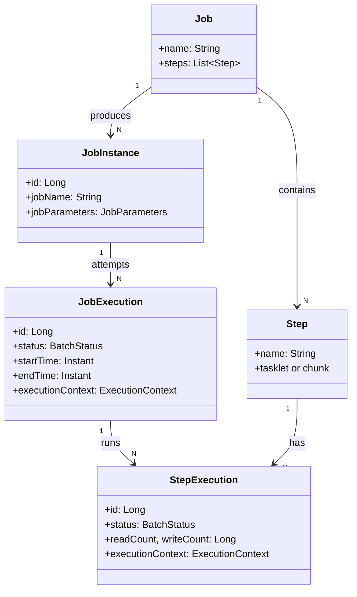
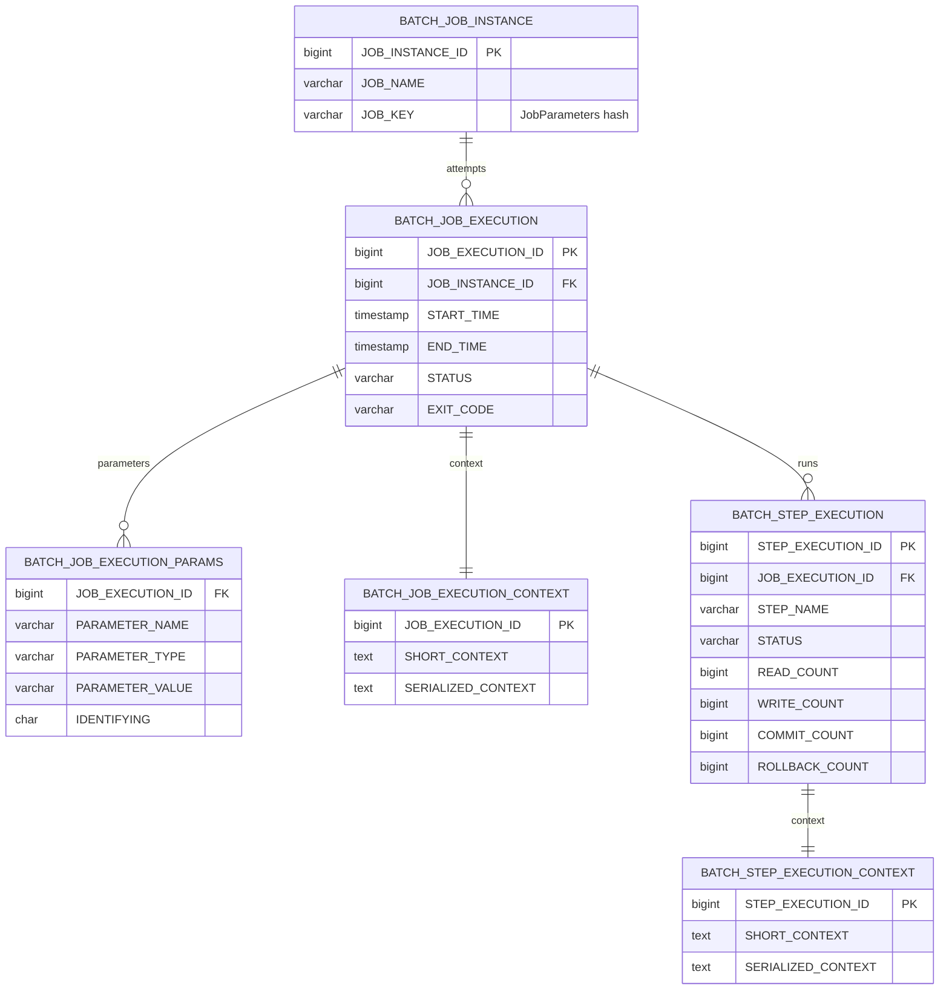

## 서론

"마켓플레이스에서 어제 매출은 얼마였지?"

사전과제 가이드 시리즈에서 다룬 마켓플레이스가 운영에 들어가면 곧 백오피스 요구가 따라온다. 일별 매출 집계, 미정산 주문 정리, 만료된 토큰 청소, 비활성 회원 휴면 전환 — 모두 사용자 요청 트리거가 아니라 시간 트리거로 도는 일들이다.

가장 단순한 접근은 `@Scheduled`로 매일 새벽에 도는 메서드 하나를 짜는 것이다. 잘 돈다, 한동안은. 그러다 "어제 잡이 절반쯤 돌다가 죽었는데 어디부터 다시 돌리지?", "재시작했더니 같은 주문을 두 번 처리해 매출이 두 배가 됐다", "한 건 검증 실패에 전체 잡이 롤백되어 23만 건이 사라졌다" 같은 질문이 쌓이는 순간이 온다.

이 지점이 <strong>Spring Batch</strong>가 등장하는 자리다. Spring Batch는 "배치 잡을 안전하게 실행하고, 중간 상태를 메타데이터로 보존하고, 실패 지점부터 재시작 가능하게" 만드는 프레임워크다. 1편은 그 출발점인 어휘(Job·Step·JobInstance·JobExecution), JobRepository 메타데이터 6 테이블, 첫 Hello Tasklet, 그리고 5.x → 6.x 마이그레이션 핵심 변경까지 다룬다.

대상 독자는 사전과제 가이드 시리즈를 봤거나 Spring Boot 기본기는 있는 백엔드 엔지니어다. Spring Batch 5.x 경험이 없어도 된다 — 6.x를 처음부터 정착시키는 방향으로 쓴다.

- <strong>1편 — Job · Step · 메타데이터의 정체 (이 글)</strong>
- 2편 — 청크 지향 처리 — Reader · Processor · Writer (예정)
- 3편 — 트랜잭션 · 실패 처리 — Skip · Retry · 재시작 (예정)
- 4편 — 잡 실행 · 스케줄링 · 운영 (예정)
- 5편 — 성능 · 병렬화 — 멀티 스레드 · 파티셔닝 · 원격 워커 (예정)
- 6편 — 관측성 · 테스트 · 배포 (예정)
- 종합 — 마켓플레이스 분석 파이프라인 (예정)

---

## TL;DR

- <strong>Job = 배치의 정의, Step = 일을 수행하는 단계</strong> — 1 Job은 1개 이상의 Step으로 구성된다. JobInstance는 비즈니스 키 단위의 논리적 실행, JobExecution은 그 한 번의 시도다.
- <strong>JobRepository = 메타데이터의 단일 진실</strong> — 6개 테이블(`BATCH_JOB_INSTANCE` / `BATCH_JOB_EXECUTION` / `BATCH_JOB_EXECUTION_PARAMS` / `BATCH_JOB_EXECUTION_CONTEXT` / `BATCH_STEP_EXECUTION` / `BATCH_STEP_EXECUTION_CONTEXT`)이 실행 이력·상태·context를 보존해 재시작과 멱등의 근거가 된다.
- <strong>청크 vs Tasklet</strong> — 대량 read-process-write 사이클은 청크(2편 본격), 단발 시스템 작업(파일 삭제·외부 API 한 번 호출)은 Tasklet. 1편 Hello는 Tasklet으로 시작한다.
- <strong>5.x → 6.x 핵심 변경</strong> — Jakarta EE 10(`javax.batch` → `jakarta.batch`), Java 17 baseline, `@EnableBatchProcessing` 자동 활성화, `JobBuilderFactory`/`StepBuilderFactory` 제거(`JobBuilder`/`StepBuilder` 직접 사용), Spring Boot 4 자동 구성과 호환.
- <strong>Hello Job</strong> — Spring Boot 4 자동 구성 + Kotlin DSL로 한 클래스에서 시작한다. PostgreSQL 16 + `spring.batch.jdbc.initialize-schema=always`로 메타데이터 테이블을 자동 생성한다.

---

## 1. 왜 Spring Batch인가

### 1.1 프로젝트 셋업 — build.gradle.kts + application.yml

본 시리즈는 <strong>Spring Boot 4 + Kotlin 2.3 + Java 21 + PostgreSQL 16</strong>이 default다.

> <strong>참고 — Spring Boot 4 + Kotlin 2.3 프로젝트 셋업</strong>: Spring Boot 4 기본 셋업(`kotlin-spring`·`kotlin-jpa` plugin, `build.gradle.kts` 기본 구조, `application.yml` 프로파일 분리)은 [사전과제 가이드 1편 1.1절](/blog/spring-boot-pre-interview-guide-1)에서 다뤘다. 본 글은 그 위에 Spring Batch 6 의존성과 메타데이터 datasource 설정만 얹는다. Kotlin 2.x 시리즈는 백워드 호환이라 2.0~2.3 어느 버전이든 같은 코드가 작동한다.

**build.gradle.kts** (배치 관련 부분만):

```kotlin
plugins {
    id("org.springframework.boot") version "4.0.0"
    id("io.spring.dependency-management") version "1.1.6"
    kotlin("jvm") version "2.3.0"
    kotlin("plugin.spring") version "2.3.0"
    kotlin("plugin.jpa") version "2.3.0"
}

dependencies {
    implementation(libs.spring.boot.starter.batch)
    implementation(libs.spring.boot.starter.data.jpa)
    runtimeOnly(libs.postgresql)

    testImplementation(libs.spring.boot.starter.test)
    testImplementation(libs.spring.batch.test)
}
```

`spring-boot-starter-batch`가 Spring Batch 6의 모든 진입점이다. JPA starter는 잡 자체에는 필수가 아니지만 도메인 객체를 다룰 때 자연스러워 1편부터 같이 끌어둔다.

> <strong>참고 — `libs.x` 표기는 Gradle Version Catalog</strong>: 의존성을 `gradle/libs.versions.toml` 한 파일에 카탈로그로 선언하고 `build.gradle.kts`에서는 `libs.x.y.z` 타입 안전 accessor로 참조하는 패턴이다(Gradle 7.4+ stable, 2022.03). 카탈로그를 안 쓰고 `implementation("org.springframework.boot:spring-boot-starter-batch")` 같은 문자열을 그대로 써도 동작은 같으니, 카탈로그가 생소하면 문자열 형태로 바꿔 읽어도 무방하다. 본 시리즈가 카탈로그를 쓰는 이유는 사전과제 가이드 시리즈와 같은 컨벤션 유지 + 7편 멀티 모듈에서 여러 모듈이 한 카탈로그를 공유하기 위함이다. TOML 본문은 아래 details 참고.

<details>
<summary><strong>펼치기 — 위 의존성에 대응하는 gradle/libs.versions.toml</strong></summary>

```toml
[versions]
spring-boot = "4.0.0"
kotlin = "2.3.0"
postgresql = "42.7.4"

[libraries]
spring-boot-starter-batch = { module = "org.springframework.boot:spring-boot-starter-batch" }
spring-boot-starter-data-jpa = { module = "org.springframework.boot:spring-boot-starter-data-jpa" }
spring-boot-starter-test = { module = "org.springframework.boot:spring-boot-starter-test" }
spring-batch-test = { module = "org.springframework.batch:spring-batch-test" }
postgresql = { module = "org.postgresql:postgresql", version.ref = "postgresql" }
```

두 가지만 기억하면 된다.

- <strong>TOML의 하이픈(`-`)이 Kotlin accessor의 점(`.`)으로 매핑된다</strong> — `spring-boot-starter-batch` → `libs.spring.boot.starter.batch`. 자동완성이 IDE에서 그대로 잡힌다.
- <strong>Spring Boot BOM이 batch/jpa/test의 transitive 버전을 관리한다</strong> — 그래서 카탈로그에서 `spring-boot-starter-batch`에는 `version.ref`를 명시하지 않았다. BOM 외부 의존성(PostgreSQL 드라이버)에만 버전을 박는다.

카탈로그를 활성화하려면 `settings.gradle.kts`에 한 블록을 더 둔다.

```kotlin
dependencyResolutionManagement {
    versionCatalogs {
        create("libs") {
            from(files("gradle/libs.versions.toml"))
        }
    }
}
```

`create("libs")`의 이름이 곧 `build.gradle.kts`에서 쓰는 `libs.x` accessor의 prefix가 된다. 다른 이름(예: `bundles`)을 쓰면 `bundles.x.y.z`처럼 된다.

</details>

**application.yml**:

```yaml
spring:
  datasource:
    url: jdbc:postgresql://localhost:5432/batch_guide
    username: batch
    password: batch
    driver-class-name: org.postgresql.Driver

  batch:
    jdbc:
      initialize-schema: always   # 메타데이터 테이블 자동 생성
    job:
      enabled: false              # 부팅 시 잡을 자동 실행하지 않도록
```

두 설정 키가 핵심이다.

- `spring.batch.jdbc.initialize-schema: always` — Spring Batch가 메타데이터 6 테이블이 없으면 자동으로 만든다. 로컬·테스트는 `always`가 편하지만 운영에서는 `never`로 두고 Flyway/Liquibase로 명시적 마이그레이션이 권장.
- `spring.batch.job.enabled: false` — 기본값(`true`)은 애플리케이션 시작 시 컨텍스트의 모든 Job을 한 번 실행한다. 잡은 보통 스케줄러나 외부 트리거로 돌리므로 꺼두는 게 안전하다(4편 잡 실행에서 더 다룬다).

### 1.2 @Scheduled로 시작했을 때의 문제

가장 단순한 백오피스 잡은 다음과 같이 짠다.

```kotlin
@Component
class DailySalesAggregator(
    private val orderRepository: OrderRepository,
    private val dailySalesRepository: DailySalesRepository,
) {
    @Scheduled(cron = "0 0 1 * * *")  // 매일 01:00
    fun aggregate() {
        val yesterday = LocalDate.now().minusDays(1)
        val orders = orderRepository.findByOrderedOn(yesterday)
        val total = orders.sumOf { it.totalPrice }
        dailySalesRepository.save(DailySales(date = yesterday, total = total))
    }
}
```

잘 돈다. 다음 질문들이 나타나기 전까지는.

- 어제 잡이 중간에 죽었다. 어디까지 처리됐는지, 어디부터 다시 돌려야 하는지 모른다.
- 똑같은 날짜로 두 번 돌면 `DailySales`에 같은 날짜 row가 두 번 쌓인다.
- 100만 건을 한 메서드에서 처리하다가 OOM이 났다.
- 한 건 검증 실패로 전체 트랜잭션이 롤백돼 99만 건이 사라졌다.
- 다른 인스턴스에도 같이 배포되어 잡이 동시에 두 번 돈다.

각 문제를 따로따로 해결하면 결국 직접 "잡 실행 메타데이터 테이블"을 만들고, "체크포인트 컬럼"을 박고, "배치 락 테이블"을 만들고, "재시작 로직"을 짜게 된다. 이 작업의 결과물이 사실상 Spring Batch와 같다.

### 1.3 Spring Batch가 해결해 주는 것

비교 표로 정리하면 다음과 같다.

| 관심사 | `@Scheduled` 만 | Spring Batch 6 |
|--------|----------------|----------------|
| 실행 이력 | 로그·DB에 직접 적어야 함 | JobRepository 자동 기록 |
| 재시작 지점 | 직접 관리 | ExecutionContext에 자동 저장 |
| 멱등 보장 | 직접 키 설계 | JobParameters로 자연스럽게 |
| 트랜잭션 경계 | 메서드 1개 = 1 트랜잭션 | 청크 단위 commit |
| 실패 처리 | try-catch 직접 | Skip · Retry · NoRollback 정책 |
| 동시 실행 방지 | 외부 락 직접 | JobInstance + JobExecution 락 |
| 병렬화 | 직접 ThreadPool | 멀티 스레드 Step · 파티셔닝 |
| 메트릭 | 직접 노출 | Micrometer 6 메트릭 기본 노출 |

`@Scheduled`가 "언제 도냐"의 문제를 풀어 준다면, Spring Batch는 그 안에서 "어떻게 안전하게 도느냐"를 풀어 준다. 둘은 보통 함께 쓴다 — `@Scheduled`가 `JobLauncher`를 호출하는 식이다(4편).

---

## 2. Job · Step · JobInstance · JobExecution

### 2.1 어휘 매핑

다섯 개념의 관계가 처음엔 헷갈린다. 한 줄씩 정리하면 다음과 같다.

- <strong>Job</strong> — 배치 잡의 정의(definition). 이름이 "daily-sales-aggregation"인 잡 1개를 코드로 1번 정의한다. 즉 Spring 컨텍스트에 `Job` Bean 1개.
- <strong>JobInstance</strong> — 비즈니스 키(JobParameters) 단위의 논리적 실행. "daily-sales-aggregation · `targetDate=2026-05-16`" 한 조합이 한 JobInstance다. 같은 키로 두 번째 실행을 하면 같은 JobInstance를 다시 시도하는 셈이다.
- <strong>JobExecution</strong> — 한 JobInstance에 대한 1회 시도. 같은 JobInstance가 첫 시도에서 실패하면 두 번째 시도는 새 JobExecution이지만 같은 JobInstance에 묶인다.
- <strong>Step</strong> — Job 안의 단계 정의. "주문 읽기 → 집계 → 저장"이 한 Step.
- <strong>StepExecution</strong> — Step의 1회 시도. JobExecution 1개당 그 잡에 속한 Step 수만큼 StepExecution이 생긴다.

### 2.2 관계 다이어그램

다섯 개념의 관계를 한 그림으로 보면 다음과 같다.



핵심은 두 가지다.

- <strong>JobInstance는 비즈니스 키로 고유하다</strong>. 같은 `targetDate=2026-05-16`으로 두 번 실행하면 첫 번째 JobInstance를 재사용한다 — 그 JobInstance가 이미 성공으로 끝났다면 두 번째 실행은 `JobInstanceAlreadyCompleteException`으로 막힌다. 멱등성을 위한 1차 방어선이다.
- <strong>실패한 JobInstance는 재시작 가능</strong>. 같은 키로 다시 실행하면 같은 JobInstance에 새 JobExecution이 붙고, 이전 StepExecution의 ExecutionContext를 읽어 어디서부터 다시 돌지 결정한다.

### 2.3 ExecutionContext의 역할

`ExecutionContext`는 "이 잡(또는 스텝)이 지금까지 무엇을 했는지" 기록하는 Map 형태의 메타데이터다. 두 종류가 있다.

| 종류 | 보존 단위 | 용도 |
|------|----------|------|
| Job ExecutionContext | JobExecution 1개 | 잡 전체에 걸친 상태(예: 어떤 파일을 처리 중인지) |
| Step ExecutionContext | StepExecution 1개 | 한 Step의 진행 상태(예: 페이징 Reader가 몇 페이지까지 읽었는지) |

대표적인 쓰임은 <strong>Reader가 어디까지 읽었는지 자동 저장</strong>하는 부분이다. `JdbcPagingItemReader`나 `JpaPagingItemReader`는 한 청크가 commit 될 때마다 Step ExecutionContext에 "현재 페이지 번호"를 기록한다. 잡이 중간에 죽고 재시작하면 그 위치부터 다시 읽는다. 3편(실패 처리·재시작)에서 본격적으로 다룬다.

---

## 3. JobRepository 메타데이터 6 테이블

`JobRepository`는 위에서 다룬 모든 메타데이터를 DB에 영속화하는 Spring Batch의 핵심 컴포넌트다. Spring Boot 4 자동 구성이 datasource를 발견하면 자동으로 만들어 등록한다. 우리가 직접 빈으로 정의할 일은 거의 없다.

### 3.1 6 테이블 ER

`spring.batch.jdbc.initialize-schema: always`가 만들어 주는 6 테이블의 관계는 다음과 같다.



### 3.2 각 테이블 역할

| 테이블 | 책임 |
|--------|------|
| `BATCH_JOB_INSTANCE` | 잡 이름 + JobParameters 해시(`JOB_KEY`)로 고유한 논리적 실행 단위 |
| `BATCH_JOB_EXECUTION` | JobInstance에 대한 1회 시도의 상태·시작·종료 시각 |
| `BATCH_JOB_EXECUTION_PARAMS` | JobParameters의 key/value를 한 행씩 보관(타입 정보 포함) |
| `BATCH_JOB_EXECUTION_CONTEXT` | Job 레벨 ExecutionContext의 직렬화 본문 |
| `BATCH_STEP_EXECUTION` | StepExecution의 상태·read/write/commit/rollback 카운터 |
| `BATCH_STEP_EXECUTION_CONTEXT` | Step 레벨 ExecutionContext의 직렬화 본문 |

`IDENTIFYING` 컬럼이 흥미롭다. JobParameters의 각 키가 "JobInstance 동일성 판정에 쓰일지" 여부를 `Y/N`으로 저장한다. 예를 들어 `targetDate`는 Y(같은 날짜는 같은 잡), `triggeredBy=manual`은 N(트리거 출처는 동일성에 영향 없음)으로 둘 수 있다.

### 3.3 메타데이터가 운영에서 갖는 의미

운영자가 보는 관점에서 메타데이터의 가치는 세 가지다.

- <strong>실행 이력 추적</strong> — 어떤 잡이 언제 몇 번 돌았고, 어느 시도가 실패했는지 모두 DB에 남는다. 별도 로그 파이프라인 없이도 `BATCH_JOB_EXECUTION` 한 테이블에서 추적 가능하다.
- <strong>재시작 결정 근거</strong> — 같은 `JOB_KEY`로 들어온 잡이 이전에 실패했다면 그 JobInstance를 이어서 시도한다. 사용자(스케줄러)는 같은 파라미터로 다시 부르기만 하면 된다.
- <strong>대시보드의 원천 데이터</strong> — Spring Batch Admin은 더 이상 없지만(2014년 EOL), 이 6 테이블을 그대로 읽어서 Grafana나 사내 대시보드를 짜면 된다. 6편 관측성에서 다룬다.

---

## 4. 첫 잡 — Hello Tasklet

이제 Hello Job을 만든다. Tasklet은 "한 번 실행되고 끝"인 가장 단순한 Step 타입이다.

### 4.1 Tasklet 구현

```kotlin
import org.springframework.batch.core.StepContribution
import org.springframework.batch.core.scope.context.ChunkContext
import org.springframework.batch.core.step.tasklet.Tasklet
import org.springframework.batch.repeat.RepeatStatus
import org.springframework.stereotype.Component

@Component
class HelloTasklet : Tasklet {
    override fun execute(contribution: StepContribution, chunkContext: ChunkContext): RepeatStatus {
        val jobName = chunkContext.stepContext.jobName
        val stepName = chunkContext.stepContext.stepName
        println("[$jobName / $stepName] Hello, Spring Batch 6!")
        return RepeatStatus.FINISHED
    }
}
```

`RepeatStatus.FINISHED`는 "한 번 실행 끝, 다음으로 넘어가도 좋다"는 신호다. `RepeatStatus.CONTINUABLE`을 반환하면 같은 Tasklet이 다시 호출되는데, 청크 지향이 아닌 경우 거의 쓸 일이 없다.

### 4.2 Job · Step 결합 — Kotlin DSL

Spring Batch 6에서는 `JobBuilder`/`StepBuilder`를 직접 생성한다. 5.x의 `JobBuilderFactory`/`StepBuilderFactory`는 제거됐다.

```kotlin
import org.springframework.batch.core.Job
import org.springframework.batch.core.Step
import org.springframework.batch.core.job.builder.JobBuilder
import org.springframework.batch.core.repository.JobRepository
import org.springframework.batch.core.step.builder.StepBuilder
import org.springframework.context.annotation.Bean
import org.springframework.context.annotation.Configuration
import org.springframework.transaction.PlatformTransactionManager

@Configuration
class HelloJobConfig {

    @Bean
    fun helloJob(jobRepository: JobRepository, helloStep: Step): Job =
        JobBuilder("helloJob", jobRepository)
            .start(helloStep)
            .build()

    @Bean
    fun helloStep(
        jobRepository: JobRepository,
        transactionManager: PlatformTransactionManager,
        helloTasklet: HelloTasklet,
    ): Step =
        StepBuilder("helloStep", jobRepository)
            .tasklet(helloTasklet, transactionManager)
            .build()
}
```

세 개의 주입이 핵심이다.

- `JobRepository` — 위 6 테이블에 메타데이터를 쓰는 컴포넌트. Spring Boot 4 자동 구성으로 만들어진다.
- `PlatformTransactionManager` — Tasklet 실행을 감싸는 트랜잭션. JPA를 같이 쓰면 `JpaTransactionManager`가 자동으로 등록된다.
- `HelloTasklet` — 위에서 만든 Tasklet 빈. `@Component`로 등록해 두면 의존성 주입으로 끌어온다.

### 4.3 실행과 메타데이터 확인

`spring.batch.job.enabled: false`로 자동 실행을 껐으므로 잡을 명시적으로 띄워야 한다. 가장 간단한 방법은 `CommandLineRunner`다.

```kotlin
@Component
class HelloJobRunner(
    private val jobLauncher: JobLauncher,
    private val helloJob: Job,
) : CommandLineRunner {
    override fun run(vararg args: String) {
        val params = JobParametersBuilder()
            .addLocalDateTime("runAt", LocalDateTime.now())
            .toJobParameters()
        jobLauncher.run(helloJob, params)
    }
}
```

`runAt`은 매번 달라지므로 매 실행마다 새 JobInstance가 만들어진다. 운영에서는 보통 `targetDate=2026-05-16`처럼 비즈니스 키를 쓴다(4편 JobParameters 설계).

콘솔에는 한 줄이 찍힌다.

```text
[helloJob / helloStep] Hello, Spring Batch 6!
```

이게 전부지만, DB를 들여다보면 그 사이 메타데이터가 채워진 것을 확인할 수 있다.

```sql
SELECT job_instance_id, job_name, job_key
FROM batch_job_instance;

SELECT job_execution_id, job_instance_id, status, start_time, end_time
FROM batch_job_execution;

SELECT step_execution_id, step_name, status, read_count, write_count, commit_count
FROM batch_step_execution;
```

3 테이블 모두에 1행씩 row가 쌓였을 것이다. 같은 코드로 다시 실행하면 `BATCH_JOB_INSTANCE`에는 새 행(다른 `runAt`이라 다른 JOB_KEY), `BATCH_JOB_EXECUTION`에도 새 행, `BATCH_STEP_EXECUTION`에도 새 행이 쌓인다.

---

## 5. 5.x → 6.x 마이그레이션 노트

이미 5.x 코드를 가진 독자를 위한 변경 요약이다. 신규 프로젝트라면 본문 4절까지의 패턴이 6.x 정석이므로 5절은 참고용으로 건너뛰어도 된다.

### 5.1 변경 요약

| 영역 | Spring Batch 5.x | Spring Batch 6.x |
|------|------------------|------------------|
| Java baseline | Java 17 | Java 17 (Spring Boot 4는 Java 21 권장) |
| Jakarta | `jakarta.*` (5.0부터) | `jakarta.*` 유지 |
| Builder Factory | `JobBuilderFactory`/`StepBuilderFactory` (deprecated) | 제거 — `JobBuilder`/`StepBuilder` 직접 생성 |
| `@EnableBatchProcessing` | 명시적으로 붙여야 자동 구성 활성화 | 자동 활성화(스타터만 끌면 충분), 옵션 커스터마이즈 시에만 명시 |
| `AbstractBatchConfiguration` | 존재 | 제거 |
| 메타데이터 스키마 | 기존 스키마 호환 | 동일 스키마, 일부 인덱스 추가 |
| `DefaultBatchConfigurer` | deprecated | 제거 — `DefaultBatchConfiguration` 상속 패턴 사용 |

5.x → 6.x 코드 변경은 대부분 두 가지로 수렴한다.

- `JobBuilderFactory.get("name").start(...)` → `JobBuilder("name", jobRepository).start(...)`
- `StepBuilderFactory.get("name").tasklet(...)` → `StepBuilder("name", jobRepository).tasklet(taskletBean, transactionManager)`

### 5.2 @EnableBatchProcessing 자동 활성화의 의미

5.x까지는 `@EnableBatchProcessing`을 안 붙이면 Spring Batch 인프라(JobRepository·JobLauncher 등)가 등록되지 않았다. 6.x + Spring Boot 4 조합은 클래스패스에 `spring-boot-starter-batch`만 있으면 자동으로 활성화한다.

`@EnableBatchProcessing`을 그래도 붙이고 싶을 때는 두 경우다.

- **여러 datasource 중에서 특정 것을 메타데이터용으로 지정하고 싶을 때** — `@EnableBatchProcessing(dataSourceRef = "batchDataSource", transactionManagerRef = "batchTransactionManager")`
- **자동 구성 빈 일부만 교체하고 싶을 때** — `DefaultBatchConfiguration`을 상속해 메서드 오버라이드

사전과제 마켓플레이스 + 배치 메타데이터를 같은 PostgreSQL 인스턴스에 두는 본 시리즈 default 환경에서는 자동 활성화로 충분하다. capstone(종합 과제)에서 운영 schema와 분석 schema를 datasource 2개로 나눌 때 비로소 `@EnableBatchProcessing`을 명시한다.

### 5.3 의존성 버전 정리

`build.gradle.kts`에서 Spring Batch 버전을 직접 박을 일은 거의 없다. Spring Boot 4 BOM이 Spring Batch 6 버전을 관리한다. 1.1절의 카탈로그 예시에서도 `spring-boot-starter-batch`에 `version.ref`를 명시하지 않은 이유가 이것이다 — BOM이 transitive로 끌어 준다.

Spring Boot 4.0이 Spring Batch 6.0과 짝이다. 두 버전을 따로 박지 말고 BOM을 통해 같이 올리는 게 안전하다.

---

## 정리

1편의 핵심 takeaway를 한 줄씩 정리하면 다음과 같다.

- <strong>Job · Step · JobInstance · JobExecution 어휘부터 잡는다</strong> — 정의(Job) / 비즈니스 키 단위 실행(JobInstance) / 한 번의 시도(JobExecution) / 단계(Step) / 단계의 시도(StepExecution). 이 다섯 단어 위에 모든 것이 쌓인다.
- <strong>JobRepository 메타데이터 6 테이블이 재시작·멱등의 근거</strong> — 별도의 체크포인트 테이블을 직접 만들 필요가 없다. `JOB_KEY`가 비즈니스 키 해시고, ExecutionContext가 어디까지 처리됐는지 자동 저장한다.
- <strong>Tasklet은 단발성, 청크는 대량 처리</strong> — 1편 Hello는 Tasklet으로 시작하지만 실제 잡의 99%는 청크 지향(2편).
- <strong>5.x → 6.x 핵심은 두 줄</strong> — `JobBuilderFactory`/`StepBuilderFactory` 제거, `@EnableBatchProcessing` 자동 활성화. 그 외 코드는 거의 그대로.
- <strong>Spring Boot 4 자동 구성이 90%를 처리한다</strong> — datasource만 주면 JobRepository · JobLauncher · TransactionManager가 자동으로 등록된다. 우리가 직접 정의하는 빈은 Job·Step·Tasklet/Chunk 셋뿐이다.

다음 편은 <strong>청크 지향 처리</strong>다. Tasklet으로 한 줄 찍는 것을 넘어, "주문 10만 건을 1000건씩 끊어 읽고 가공해서 다시 쓴다"는 청크 사이클의 메커니즘과 `ItemReader` · `ItemProcessor` · `ItemWriter`의 선택 기준, 그리고 가장 자주 헷갈리는 <strong>페이지 크기 vs 청크 크기</strong>를 본격적으로 다룬다.

---

## 부록

### A. 메타데이터 6 테이블 DDL (PostgreSQL)

`spring.batch.jdbc.initialize-schema: always`가 만들어 주는 DDL과 동일하다. 운영에서 Flyway/Liquibase로 명시 마이그레이션할 때 참고.

<details>
<summary><strong>전체 DDL 펼치기 — PostgreSQL용 6 테이블 + 시퀀스</strong></summary>

```sql
CREATE TABLE BATCH_JOB_INSTANCE (
    JOB_INSTANCE_ID BIGINT NOT NULL PRIMARY KEY,
    VERSION BIGINT,
    JOB_NAME VARCHAR(100) NOT NULL,
    JOB_KEY VARCHAR(32) NOT NULL,
    CONSTRAINT JOB_INST_UN UNIQUE (JOB_NAME, JOB_KEY)
);

CREATE TABLE BATCH_JOB_EXECUTION (
    JOB_EXECUTION_ID BIGINT NOT NULL PRIMARY KEY,
    VERSION BIGINT,
    JOB_INSTANCE_ID BIGINT NOT NULL,
    CREATE_TIME TIMESTAMP NOT NULL,
    START_TIME TIMESTAMP DEFAULT NULL,
    END_TIME TIMESTAMP DEFAULT NULL,
    STATUS VARCHAR(10),
    EXIT_CODE VARCHAR(2500),
    EXIT_MESSAGE VARCHAR(2500),
    LAST_UPDATED TIMESTAMP,
    CONSTRAINT JOB_INST_EXEC_FK FOREIGN KEY (JOB_INSTANCE_ID)
        REFERENCES BATCH_JOB_INSTANCE(JOB_INSTANCE_ID)
);

CREATE TABLE BATCH_JOB_EXECUTION_PARAMS (
    JOB_EXECUTION_ID BIGINT NOT NULL,
    PARAMETER_NAME VARCHAR(100) NOT NULL,
    PARAMETER_TYPE VARCHAR(100) NOT NULL,
    PARAMETER_VALUE VARCHAR(2500),
    IDENTIFYING CHAR(1) NOT NULL,
    CONSTRAINT JOB_EXEC_PARAMS_FK FOREIGN KEY (JOB_EXECUTION_ID)
        REFERENCES BATCH_JOB_EXECUTION(JOB_EXECUTION_ID)
);

CREATE TABLE BATCH_JOB_EXECUTION_CONTEXT (
    JOB_EXECUTION_ID BIGINT NOT NULL PRIMARY KEY,
    SHORT_CONTEXT VARCHAR(2500) NOT NULL,
    SERIALIZED_CONTEXT TEXT,
    CONSTRAINT JOB_EXEC_CTX_FK FOREIGN KEY (JOB_EXECUTION_ID)
        REFERENCES BATCH_JOB_EXECUTION(JOB_EXECUTION_ID)
);

CREATE TABLE BATCH_STEP_EXECUTION (
    STEP_EXECUTION_ID BIGINT NOT NULL PRIMARY KEY,
    VERSION BIGINT NOT NULL,
    STEP_NAME VARCHAR(100) NOT NULL,
    JOB_EXECUTION_ID BIGINT NOT NULL,
    CREATE_TIME TIMESTAMP NOT NULL,
    START_TIME TIMESTAMP DEFAULT NULL,
    END_TIME TIMESTAMP DEFAULT NULL,
    STATUS VARCHAR(10),
    COMMIT_COUNT BIGINT,
    READ_COUNT BIGINT,
    FILTER_COUNT BIGINT,
    WRITE_COUNT BIGINT,
    READ_SKIP_COUNT BIGINT,
    WRITE_SKIP_COUNT BIGINT,
    PROCESS_SKIP_COUNT BIGINT,
    ROLLBACK_COUNT BIGINT,
    EXIT_CODE VARCHAR(2500),
    EXIT_MESSAGE VARCHAR(2500),
    LAST_UPDATED TIMESTAMP,
    CONSTRAINT JOB_EXEC_STEP_FK FOREIGN KEY (JOB_EXECUTION_ID)
        REFERENCES BATCH_JOB_EXECUTION(JOB_EXECUTION_ID)
);

CREATE TABLE BATCH_STEP_EXECUTION_CONTEXT (
    STEP_EXECUTION_ID BIGINT NOT NULL PRIMARY KEY,
    SHORT_CONTEXT VARCHAR(2500) NOT NULL,
    SERIALIZED_CONTEXT TEXT,
    CONSTRAINT STEP_EXEC_CTX_FK FOREIGN KEY (STEP_EXECUTION_ID)
        REFERENCES BATCH_STEP_EXECUTION(STEP_EXECUTION_ID)
);

CREATE SEQUENCE BATCH_STEP_EXECUTION_SEQ START WITH 1 INCREMENT BY 1;
CREATE SEQUENCE BATCH_JOB_EXECUTION_SEQ START WITH 1 INCREMENT BY 1;
CREATE SEQUENCE BATCH_JOB_SEQ START WITH 1 INCREMENT BY 1;
```

</details>

### B. 자주 묻는 5.x → 6.x 변경 (확장)

<details>
<summary><strong>변경 항목 확장 표 — Builder · Configuration · Listener 시그니처</strong></summary>

| 영역 | 5.x | 6.x |
|------|-----|-----|
| Job 생성 | `JobBuilderFactory.get("x")` | `JobBuilder("x", jobRepository)` |
| Step 생성 | `StepBuilderFactory.get("x")` | `StepBuilder("x", jobRepository)` |
| Tasklet 결합 | `.tasklet(tasklet)` | `.tasklet(tasklet, transactionManager)` |
| Chunk 시그니처 | `.<I, O>chunk(size)` | `.<I, O>chunk(size, transactionManager)` |
| 자동 구성 | `@EnableBatchProcessing` 필수 | 스타터만 끌면 자동 활성화 |
| 커스터마이즈 | `DefaultBatchConfigurer` 상속 | `DefaultBatchConfiguration` 상속 |
| Job 트리거 어노테이션 | `@EnableTask`(Spring Cloud Task) | 변경 없음 |

</details>

### C. 외부 참조

- [Spring Batch 6 reference](https://docs.spring.io/spring-batch/reference/) — 6.x 공식 문서
- [Spring Boot 4 batch auto-configuration](https://docs.spring.io/spring-boot/reference/io/batch.html) — `spring.batch.*` 프로퍼티 전체
- [Spring Batch 5.x → 6.x migration guide](https://github.com/spring-projects/spring-batch/wiki/Spring-Batch-6.0-Migration-Guide) — Wiki 마이그레이션 노트
