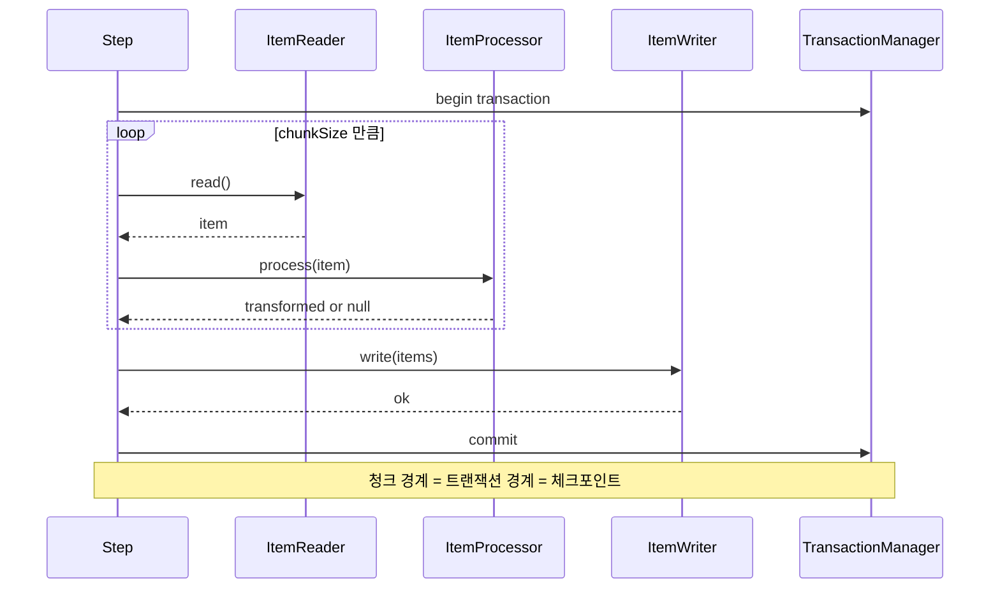
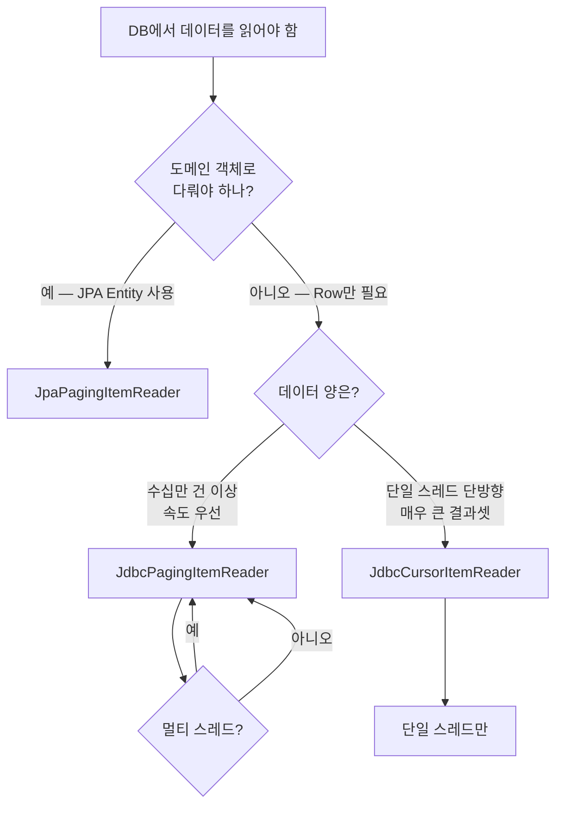
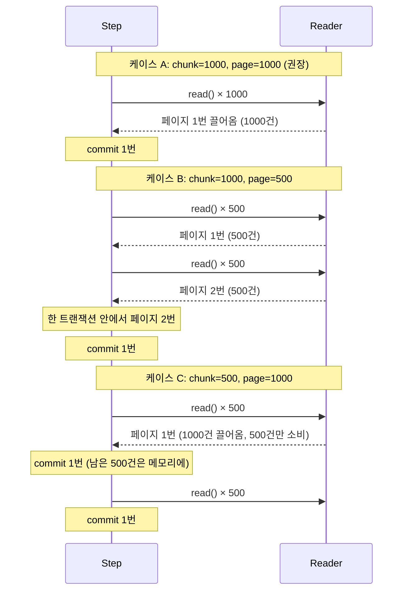

## 서론

[1편](/blog/spring-batch-6-guide-1)에서 Hello Tasklet으로 "잡 한 번 띄우기"를 끝냈다. 하지만 실제 배치 잡의 99%는 한 줄 찍는 게 아니라 "주문 10만 건을 끊어 읽고, 가공해서, 다시 쓰는" 사이클이다.

이 사이클이 <strong>청크 지향 처리(chunk-oriented processing)</strong>다. Spring Batch가 다른 스케줄러 프레임워크와 갈라지는 지점이 바로 여기다. "N건씩 끊어 읽고 → N건 가공 → N건 한 번에 쓰고 → commit"이라는 사이클을 한 트랜잭션으로 묶어 주며, 그 경계가 곧 메타데이터의 체크포인트가 된다(3편 재시작과 직결).

2편은 청크의 메커니즘부터 시작한다. `ItemReader` 6종 중 어느 것을 언제 쓰는지, `ItemProcessor`의 변환·필터·합성 패턴, `JpaItemWriter`와 `JdbcBatchItemWriter`의 트레이드오프(특히 멱등 키 패턴), 그리고 가장 자주 헷갈리는 <strong>페이지 크기 vs 청크 크기</strong>까지 한 편에서 끝낸다.

대상 독자는 1편을 읽었거나 Spring Batch 어휘는 잡혀 있는 백엔드 엔지니어다. JPA·JDBC 기본기를 가정한다.

- 1편 — Job · Step · 메타데이터의 정체
- <strong>2편 — 청크 지향 처리 — Reader · Processor · Writer (이 글)</strong>
- [3편 — 트랜잭션 · 실패 처리 — Skip · Retry · 재시작](/blog/spring-batch-6-guide-3)
- [4편 — 잡 실행 · 스케줄링 · 운영](/blog/spring-batch-6-guide-4)
- [5편 — 성능 · 병렬화 — 멀티 스레드 · 파티셔닝 · 원격 워커](/blog/spring-batch-6-guide-5)
- [6편 — 관측성 · 테스트 · 배포](/blog/spring-batch-6-guide-6)
- 종합 — 마켓플레이스 분석 파이프라인 (예정)

---

## TL;DR

- <strong>청크 사이클 = read N → process N → write N → commit, 이 한 사이클이 한 트랜잭션</strong> — 1만 건을 청크 1000으로 돌리면 트랜잭션 10번이 일어난다. 청크 경계가 곧 메타데이터 체크포인트다.
- <strong>Reader 선택 트리</strong> — DB는 `JpaPagingItemReader`(도메인 객체) 또는 `JdbcPagingItemReader`(빠르고 가벼움), 단방향 대량은 `JdbcCursorItemReader`, 파일은 `FlatFileItemReader` / `JsonItemReader` / `StaxEventItemReader`.
- <strong>ItemProcessor는 변환 + 필터 + 합성</strong> — `null`을 반환하면 그 아이템은 Writer로 넘어가지 않는다(필터 역할). `CompositeItemProcessor`로 여러 Processor를 파이프라인처럼 엮는다.
- <strong>Writer는 JPA vs JDBC 트레이드오프</strong> — `JpaItemWriter`는 도메인 영속화에 자연스럽지만 flush/clear와 dirty checking에 주의. `JdbcBatchItemWriter`는 batch insert로 훨씬 빠르지만 영속성 컨텍스트를 우회한다. 멱등성은 PostgreSQL `INSERT ... ON CONFLICT DO UPDATE` upsert로 해결.
- <strong>페이지 크기 ≠ 청크 크기</strong> — 페이지 크기는 Reader가 한 번에 끌어오는 양, 청크 크기는 한 트랜잭션에서 처리·commit하는 양. 보통 같게 두지만 다르게 두면 한 트랜잭션 안에서 Reader가 여러 번 페이지를 끌어오거나, 한 페이지가 여러 트랜잭션에 걸쳐 처리된다.

---

## 1. 청크 메커니즘

### 1.1 한 사이클의 흐름

청크 지향 Step은 다음 순서를 반복한다.



핵심은 세 가지다.

- <strong>read는 1건씩, write는 N건 한 번에</strong> — Reader는 한 번에 한 아이템만 반환한다(`null`이면 Step 종료). Processor도 1건씩 변환. Writer만 청크 끝에서 List를 한 번에 받는다.
- <strong>한 청크 = 한 트랜잭션</strong> — 청크 시작에 begin, 청크 끝에 commit. 중간에 한 건이라도 예외가 나면 그 청크 전체가 rollback (3편 Skip/Retry로 완화 가능).
- <strong>commit 시점에 메타데이터 갱신</strong> — `BATCH_STEP_EXECUTION`의 `READ_COUNT`/`WRITE_COUNT`/`COMMIT_COUNT`가 청크 commit마다 +1 (Reader가 Step ExecutionContext에 페이지 위치도 같이 저장).

### 1.2 청크 vs Tasklet

1편 Hello에서 본 Tasklet과의 차이는 다음 표 한 장으로 정리된다.

| 관점 | Tasklet | 청크 지향 (chunk) |
|------|---------|------------------|
| 실행 모델 | 한 번 실행 (또는 `RepeatStatus.CONTINUABLE`로 반복) | read → process → write → commit 사이클 반복 |
| 트랜잭션 경계 | Tasklet 호출 1번 = 1 트랜잭션 | 청크 1개 = 1 트랜잭션 |
| 적합한 작업 | 파일 삭제, 외부 API 한 번 호출, 디렉터리 정리 | 대량 데이터 read-process-write |
| 메타데이터 카운터 | `WRITE_COUNT`/`READ_COUNT` 사용 안 함 | 카운터 정확히 갱신 |
| 재시작 위치 | StepExecution 단위 (재시작 시 처음부터) | ExecutionContext 페이지 위치부터 |

대원칙은 단순하다 — <strong>입력이 1건이면 Tasklet, 입력이 N건이면 청크</strong>.

### 1.3 청크 Step 골격 (Kotlin DSL)

6.x의 `StepBuilder.chunk()` 시그니처는 `chunkSize`와 `transactionManager`를 둘 다 요구한다. 5.x의 `chunk(size)` 단일 인자 시그니처는 제거됐다.

```kotlin
import org.springframework.batch.core.Step
import org.springframework.batch.core.repository.JobRepository
import org.springframework.batch.core.step.builder.StepBuilder
import org.springframework.batch.item.ItemProcessor
import org.springframework.batch.item.ItemReader
import org.springframework.batch.item.ItemWriter
import org.springframework.context.annotation.Bean
import org.springframework.context.annotation.Configuration
import org.springframework.transaction.PlatformTransactionManager

@Configuration
class DailySalesStepConfig {

    @Bean
    fun aggregateSalesStep(
        jobRepository: JobRepository,
        transactionManager: PlatformTransactionManager,
        orderReader: ItemReader<Order>,
        orderToSalesProcessor: ItemProcessor<Order, DailySalesLine>,
        salesWriter: ItemWriter<DailySalesLine>,
    ): Step =
        StepBuilder("aggregateSalesStep", jobRepository)
            .chunk<Order, DailySalesLine>(1000, transactionManager)
            .reader(orderReader)
            .processor(orderToSalesProcessor)
            .writer(salesWriter)
            .build()
}
```

타입 파라미터 `<Order, DailySalesLine>`은 Reader가 내놓는 타입(Input)과 Processor를 통과해 Writer에 들어가는 타입(Output)을 명시한다. Processor가 없는 Step은 In = Out이라 한 타입만 써도 된다.

---

## 2. ItemReader 종류와 선택

### 2.1 비교 표

Spring Batch 6에는 십수 개의 Reader 구현체가 있다. 실무에서 손에 익혀 두면 좋은 6개만 정리하면 다음과 같다.

| Reader | 데이터 소스 | 전략 | 동시성 안전 | 재시작 |
|--------|------------|------|------------|--------|
| `JpaPagingItemReader` | DB (JPA Entity) | 페이징 (OFFSET/LIMIT) | 안전 | 페이지 번호 |
| `JdbcPagingItemReader` | DB (JDBC) | 페이징 (정렬키 기반) | 안전 | 정렬키 + 페이지 |
| `JdbcCursorItemReader` | DB (JDBC) | 커서 (1개 연결을 잡고 fetch) | <strong>스레드 안전 아님</strong> | 행 번호 |
| `FlatFileItemReader` | CSV·TSV·고정폭 텍스트 | LineMapper로 한 줄씩 | 안전 | 라인 번호 |
| `JsonItemReader` | JSON 배열 | Jackson 스트리밍 | 안전 | 객체 인덱스 |
| `StaxEventItemReader` | XML | StAX 이벤트 스트림 | 안전 | 이벤트 인덱스 |

"동시성 안전"은 5편 멀티 스레드 Step에서 같은 Reader 인스턴스를 여러 스레드가 공유해도 되는지에 대한 답이다. 커서 기반 Reader는 한 연결을 잡고 있어 공유 불가다 — 멀티 스레드를 쓰려면 페이징 Reader로 대체하거나 파티셔닝(5편)을 쓴다.

### 2.2 DB Reader 결정 트리

DB에서 읽을 때 가장 먼저 결정해야 할 것이 페이징이냐 커서냐, 그리고 JPA냐 JDBC냐다.



대부분은 두 가지로 수렴한다.

- <strong>도메인 객체가 필요하면 `JpaPagingItemReader`</strong> — Processor에서 도메인 메서드 호출, dirty checking 활용, 가독성 우선.
- <strong>속도가 우선이면 `JdbcPagingItemReader`</strong> — 영속성 컨텍스트를 건너뛰어 메모리·CPU 모두 가볍다. 분석 ETL Job에서 압도적으로 자주 쓴다.

### 2.3 JpaPagingItemReader 빌더

> <strong>참고 — `@StepScope`와 late binding</strong>: 스프링 빈은 기본이 싱글톤이라 앱 시작(잡 빌드) 시점에 한 번 만들어지는데, `targetDate` 같은 JobParameters는 그때 아직 없다. <strong>`@StepScope`는 빈 생성을 Step이 시작되는 시점으로 미뤄 StepExecution마다 새로 만드는 Spring Batch 전용 스코프</strong>다. 덕분에 `#{jobParameters['targetDate']}` 같은 <strong>late binding(지연 바인딩)</strong> 표현식이 실행 시점 값으로 주입된다. 값이 잡 전체에 걸치면 `@JobScope`(JobExecution마다 생성)를 쓴다. 매 실행마다 새 인스턴스라 재시작·병렬에서도 상태가 섞이지 않는다.

```kotlin
import jakarta.persistence.EntityManagerFactory
import org.springframework.batch.item.database.JpaPagingItemReader
import org.springframework.batch.item.database.builder.JpaPagingItemReaderBuilder
import org.springframework.beans.factory.annotation.Value
import org.springframework.context.annotation.Bean
import org.springframework.context.annotation.Configuration
import java.time.LocalDate

@Configuration
class OrderReaderConfig {

    @Bean
    @org.springframework.batch.core.configuration.annotation.StepScope
    fun orderReader(
        emf: EntityManagerFactory,
        @Value("#{jobParameters['targetDate']}") targetDate: LocalDate,
    ): JpaPagingItemReader<Order> =
        JpaPagingItemReaderBuilder<Order>()
            .name("orderReader")
            .entityManagerFactory(emf)
            .queryString("SELECT o FROM Order o WHERE o.orderedOn = :targetDate ORDER BY o.id")
            .parameterValues(mapOf("targetDate" to targetDate))
            .pageSize(1000)
            .build()
}
```

세 가지가 핵심이다.

- <strong>`@StepScope`가 사실상 필수</strong> — 위 참고처럼 `jobParameters['targetDate']` late binding을 쓰려면 Step 시작 시점에 빈이 생성돼야 한다. 빠뜨리면 빌드 시점에 값이 없어 주입이 깨진다.
- <strong>`ORDER BY`는 반드시 안정적인 키로</strong> — 페이징 Reader는 OFFSET/LIMIT으로 동작한다. 정렬키가 흔들리면 같은 행을 두 번 읽거나 빠뜨린다. PK처럼 변하지 않는 컬럼을 권장.
- <strong>`name()`이 필요한 이유</strong> — Step ExecutionContext의 키 prefix로 쓰인다. 같은 Step에 두 Reader가 있을 때 ExecutionContext 충돌을 막는다.

### 2.4 JdbcPagingItemReader 빌더

```kotlin
import org.springframework.batch.item.database.JdbcPagingItemReader
import org.springframework.batch.item.database.Order
import org.springframework.batch.item.database.builder.JdbcPagingItemReaderBuilder
import org.springframework.batch.item.database.support.PostgresPagingQueryProvider
import javax.sql.DataSource

@Bean
@org.springframework.batch.core.configuration.annotation.StepScope
fun jdbcOrderReader(
    dataSource: DataSource,
    @Value("#{jobParameters['targetDate']}") targetDate: LocalDate,
): JdbcPagingItemReader<OrderRow> {
    val provider = PostgresPagingQueryProvider().apply {
        setSelectClause("id, member_id, total_price, ordered_on")
        setFromClause("FROM orders")
        setWhereClause("WHERE ordered_on = :targetDate")
        setSortKeys(mapOf("id" to Order.ASCENDING))
    }
    return JdbcPagingItemReaderBuilder<OrderRow>()
        .name("jdbcOrderReader")
        .dataSource(dataSource)
        .queryProvider(provider)
        .parameterValues(mapOf("targetDate" to targetDate))
        .rowMapper { rs, _ ->
            OrderRow(
                id = rs.getLong("id"),
                memberId = rs.getLong("member_id"),
                totalPrice = rs.getLong("total_price"),
                orderedOn = rs.getDate("ordered_on").toLocalDate(),
            )
        }
        .pageSize(1000)
        .build()
}
```

JPA Reader와 다른 두 가지가 있다.

- <strong>`PagingQueryProvider`로 DB 방언을 고른다</strong> — PostgreSQL이면 `PostgresPagingQueryProvider`. 페이징 SQL을 DB에 맞게 생성해 준다.
- <strong>`rowMapper`로 도메인 객체 우회</strong> — `RowMapper<OrderRow>`만 정의하면 끝. 영속성 컨텍스트가 없으니 dirty checking은 안 되지만 그만큼 가볍다.

### 2.5 참고: 파일 Reader

파일 Reader는 비중을 가볍게 둔다. 핵심 패턴만 짚는다.

| Reader | LineMapper / Tokenizer | 흔한 용도 |
|--------|------------------------|----------|
| `FlatFileItemReader` | `DelimitedLineTokenizer`(CSV) / `FixedLengthTokenizer`(고정폭) + `FieldSetMapper` | CSV 적재, 레거시 시스템 export |
| `JsonItemReader` | `JacksonJsonObjectReader<T>` | API 페이지네이션 결과 백업, 외부 시스템 dump |
| `StaxEventItemReader` | `Jaxb2Marshaller` + 루트 태그 지정 | SOAP/XML 인터페이스 잔재 |

파일 Reader 모두 `Resource`만 주면 동작하고, 재시작 시 라인/객체 인덱스를 ExecutionContext에 저장한다.

---

## 3. ItemProcessor 패턴

### 3.1 세 가지 역할

`ItemProcessor<I, O>`는 한 함수형 인터페이스가 세 가지 역할을 동시에 한다.

- <strong>변환(transform)</strong> — `Order` → `DailySalesLine`처럼 타입을 바꾼다. 이게 가장 자주 쓰는 용도.
- <strong>필터(filter)</strong> — `null`을 반환하면 그 아이템은 Writer로 넘어가지 않고 사라진다. `StepExecution.filterCount`만 +1.
- <strong>합성(composite)</strong> — `CompositeItemProcessor`로 여러 Processor를 파이프라인처럼 연쇄.

### 3.2 변환 Processor

```kotlin
import org.springframework.batch.item.ItemProcessor
import org.springframework.stereotype.Component

@Component
class OrderToSalesProcessor : ItemProcessor<Order, DailySalesLine> {
    override fun process(item: Order): DailySalesLine =
        DailySalesLine(
            date = item.orderedOn,
            memberId = item.memberId,
            amount = item.totalPrice,
        )
}
```

한 함수가 끝이다. 트랜잭션 경계가 청크 단위라 Processor 안에서는 트랜잭션을 신경 쓸 일이 거의 없다.

### 3.3 필터 Processor

```kotlin
@Component
class SkipRefundedOrderProcessor : ItemProcessor<Order, Order> {
    override fun process(item: Order): Order? =
        if (item.status == OrderStatus.REFUNDED) null else item
}
```

`null`을 반환한 아이템은 통계만 남기고 사라진다. 검증 실패로 다음 단계로 보내지 않는 경우에 자주 쓴다 — 단, "검증 실패를 무시"라는 의도가 명시적이어야 한다. 3편의 Skip 정책과 헷갈리지 말 것:

- <strong>Processor null 반환 = 의도된 필터링</strong> (filterCount +1, 정상)
- <strong>Skip 정책 = 예외 발생을 허용 범위 안에서 묵인</strong> (skipCount +1, 비정상 허용)

### 3.4 합성 Processor

여러 Processor를 직렬로 엮어 한 파이프라인을 만들 수 있다.

```kotlin
import org.springframework.batch.item.support.CompositeItemProcessor
import org.springframework.context.annotation.Bean

@Bean
fun orderProcessingPipeline(
    skipRefundedOrderProcessor: SkipRefundedOrderProcessor,
    orderToSalesProcessor: OrderToSalesProcessor,
): CompositeItemProcessor<Order, DailySalesLine> =
    CompositeItemProcessor<Order, DailySalesLine>().apply {
        setDelegates(listOf(skipRefundedOrderProcessor, orderToSalesProcessor))
    }
```

순서대로 적용된다 — 환불 주문을 먼저 걸러낸 뒤, 남은 주문만 매출 라인으로 변환. 중간에 한 Processor가 `null`을 반환하면 그 시점에서 파이프라인이 종료된다(뒤 Processor는 호출 안 됨).

### 3.5 흔한 함정

> <strong>주의 — Processor에서 영속 객체를 수정하지 말 것</strong>: `JpaPagingItemReader`가 끌어온 Entity를 Processor에서 setter로 바꾸면, dirty checking이 청크 commit 시점에 의도치 않은 UPDATE를 일으킨다. 의도한 게 아니라면 Processor는 새 객체를 만들어 반환하라(immutable 변환). 도메인을 수정해 다시 쓸 거면 그 의도를 명시적으로 두고 Writer는 두지 않거나 같은 Entity를 다시 쓰는 패턴으로 갈 것.

---

## 4. ItemWriter 선택

### 4.1 JPA vs JDBC 비교

| 관점 | `JpaItemWriter` | `JdbcBatchItemWriter` |
|------|----------------|----------------------|
| 영속성 컨텍스트 | 사용 | 우회 |
| 쿼리 형태 | `merge()` 또는 `persist()` | `addBatch()` → batch insert |
| 속도 | 보통 | <strong>5~10배 빠름</strong> (벤치마크 의존) |
| dirty checking | 활용 가능 | 안 됨 |
| 멱등 (upsert) | `merge()`는 PK 있으면 update | SQL에 `ON CONFLICT` 직접 명시 |
| flush/clear | 청크 끝에 자동 flush, clear는 직접 신경 | 해당 없음 |
| 권장 용도 | 도메인 적재, 소량/중량 | 분석 적재, 대량 |

대원칙은 단순하다.

- <strong>도메인 영속화 = JpaItemWriter</strong> — 회원 휴면 전환, 주문 상태 마감처럼 도메인 메서드와 invariant를 거쳐야 하는 경우.
- <strong>대량 적재 = JdbcBatchItemWriter</strong> — 분석 테이블에 어제 주문 100만 건 적재, 외부에서 가져온 CSV 적재처럼 도메인 invariant가 필요 없는 경우.

### 4.2 JpaItemWriter 패턴

```kotlin
import jakarta.persistence.EntityManagerFactory
import org.springframework.batch.item.database.JpaItemWriter
import org.springframework.batch.item.database.builder.JpaItemWriterBuilder

@Bean
fun salesWriter(emf: EntityManagerFactory): JpaItemWriter<DailySalesLine> =
    JpaItemWriterBuilder<DailySalesLine>()
        .entityManagerFactory(emf)
        .usePersist(false)  // false = merge (upsert-ish), true = persist (insert only)
        .build()
```

`usePersist`가 핵심 분기다.

- `usePersist = true` — 새 Entity 적재만. PK가 이미 있으면 예외.
- `usePersist = false`(default) — `merge()` 사용. PK가 있으면 update, 없으면 insert.

`merge()`는 편하지만 두 번의 select (existence check + 본 update)를 일으킬 수 있다 — 정말 upsert가 필요하면 다음 절의 JDBC + `ON CONFLICT`가 훨씬 빠르고 명시적이다.

### 4.3 JdbcBatchItemWriter + PostgreSQL upsert

대량 적재의 멱등성은 PostgreSQL의 `INSERT ... ON CONFLICT DO UPDATE` 한 줄로 해결한다.

```kotlin
import org.springframework.batch.item.database.JdbcBatchItemWriter
import org.springframework.batch.item.database.builder.JdbcBatchItemWriterBuilder
import org.springframework.jdbc.core.namedparam.BeanPropertySqlParameterSource

@Bean
fun jdbcSalesWriter(dataSource: DataSource): JdbcBatchItemWriter<DailySalesLine> =
    JdbcBatchItemWriterBuilder<DailySalesLine>()
        .dataSource(dataSource)
        .sql(
            """
            INSERT INTO daily_sales (sale_date, member_id, amount)
            VALUES (:date, :memberId, :amount)
            ON CONFLICT (sale_date, member_id)
            DO UPDATE SET amount = EXCLUDED.amount
            """.trimIndent()
        )
        .itemSqlParameterSourceProvider { BeanPropertySqlParameterSource(it) }
        .build()
```

세 가지가 일어난다.

- <strong>같은 `(sale_date, member_id)`로 재실행해도 row가 한 개만 남는다</strong> — `ON CONFLICT` 위에 `UNIQUE` 인덱스가 있어야 한다.
- <strong>`EXCLUDED.amount`로 새 값 사용</strong> — INSERT 시도가 가져온 값. 누적이 필요하면 `amount = daily_sales.amount + EXCLUDED.amount`처럼 바꾼다.
- <strong>한 청크가 batch insert 1번</strong> — JDBC가 SQL 파라미터를 묶어 한 라운드트립으로 보낸다.

### 4.4 CompositeItemWriter — 한 청크를 여러 곳에 적재

분석 테이블 적재와 동시에 알림 큐에도 발행해야 하면 `CompositeItemWriter`를 쓴다.

```kotlin
import org.springframework.batch.item.support.CompositeItemWriter

@Bean
fun salesAndNotificationWriter(
    jdbcSalesWriter: JdbcBatchItemWriter<DailySalesLine>,
    notificationWriter: ItemWriter<DailySalesLine>,
): CompositeItemWriter<DailySalesLine> =
    CompositeItemWriter<DailySalesLine>().apply {
        setDelegates(listOf(jdbcSalesWriter, notificationWriter))
    }
```

> <strong>주의 — Composite는 같은 트랜잭션</strong>: 두 Writer 모두 청크의 한 트랜잭션 안에서 돈다. notificationWriter가 외부 API에 직접 발행하면 트랜잭션 안에서 외부 호출이 일어나는 구조라 위험하다. 외부 시스템 알림은 이벤트 outbox 패턴(사전과제 가이드 7편 1절) 또는 청크 commit 후 별도 후처리로 빼는 게 안전하다.

---

## 5. 청크 크기 vs 페이지 크기

### 5.1 두 개념의 분리

가장 자주 헷갈리는 부분이다. 한 줄로 정의하면 다음과 같다.

- <strong>페이지 크기(pageSize)</strong> — Reader가 DB(또는 파일)에서 <strong>한 번에 끌어오는 양</strong>. `JpaPagingItemReader.setPageSize(500)`은 "한 SQL로 500건 가져와 메모리에 둔다"는 의미.
- <strong>청크 크기(chunkSize)</strong> — Step이 <strong>한 트랜잭션으로 처리·commit하는 양</strong>. `chunk(1000, transactionManager)`은 "1000건 처리할 때마다 commit"이라는 의미.

### 5.2 세 가지 조합과 동작



세 가지 모두 합법이지만, 권장은 다음과 같다.

| 케이스 | 권장도 | 이유 |
|--------|--------|------|
| A: chunk = page | ★★★ | 가장 단순. 한 트랜잭션 = 한 DB 라운드트립. |
| B: chunk > page | ★★ | 한 트랜잭션이 길어지면서 DB 라운드트립이 늘어남. 트랜잭션 길이를 의도적으로 늘리고 싶을 때만. |
| C: chunk < page | ★ | Reader가 가져온 페이지 일부가 commit 후에도 메모리에 남는다. 거의 안 씀. |

### 5.3 적정값을 고르는 기준

청크 크기는 다음 두 가지의 균형이다.

- <strong>너무 작으면(예: 10)</strong> — commit 횟수가 폭증해 트랜잭션 오버헤드가 처리량을 깎는다. 1만 건이면 commit 1000번.
- <strong>너무 크면(예: 100000)</strong> — 한 트랜잭션이 길어져 lock 보유 시간 증가, OOM 위험, 실패 시 rollback 비용 폭증, 그리고 재시작 시 잃는 진행분이 커진다.

실무 시작점은 다음과 같다.

| 워크로드 | 시작 청크 크기 |
|----------|---------------|
| 도메인 적재 (JPA Writer) | 100 ~ 500 |
| 분석 적재 (JDBC batch insert) | 1000 ~ 5000 |
| 외부 API 호출이 섞인 Processor | 10 ~ 50 |
| 단순 카운팅·집계 | 1000 |

벤치마크로 조정하되, "메모리에 한 청크가 들어가는가"와 "한 트랜잭션이 1초 안에 끝나는가"를 가드레일로 둔다. 5편 성능에서 멀티 스레드·파티셔닝과 함께 다시 다룬다.

---

## 정리

2편의 핵심 takeaway를 한 줄씩 정리하면 다음과 같다.

- <strong>청크 사이클은 read N → process N → write N → commit, 그 한 사이클이 한 트랜잭션</strong> — 청크 경계가 곧 트랜잭션 경계이자 메타데이터 체크포인트다. 3편 재시작이 의지하는 지점.
- <strong>Reader 선택은 두 갈래</strong> — 도메인 객체가 필요하면 `JpaPagingItemReader`, 속도가 우선이면 `JdbcPagingItemReader`. 커서 Reader는 단일 스레드 단방향에서만.
- <strong>Processor는 변환·필터·합성을 한 인터페이스에서 해결</strong> — `null` 반환이 필터, `CompositeItemProcessor`가 합성. 영속 객체를 setter로 만지지 말 것.
- <strong>Writer는 JPA vs JDBC 트레이드오프</strong> — 대량 적재는 `JdbcBatchItemWriter` + PostgreSQL `ON CONFLICT` upsert가 정석. JpaItemWriter는 도메인 영속화에만.
- <strong>페이지 크기 ≠ 청크 크기</strong> — 페이지는 Reader가 끌어오는 양, 청크는 commit 단위. 보통 같게 두는 게 가장 단순하고 권장.

다음 편은 <strong>트랜잭션 · 실패 처리</strong>다. 청크 한 사이클 안에서 한 건이 실패하면 무엇이 rollback되고 무엇이 살아남는지, Skip/Retry/NoRollback 정책을 어떻게 설계하는지, ExecutionContext가 어떻게 재시작 위치를 보존하는지, 그리고 멱등 키를 JobParameters에 어떻게 박는지까지 본격적으로 다룬다.

---

## 부록

### A. 파일 Reader 시그니처 (확장)

<details>
<summary><strong>펼치기 — FlatFileItemReader · JsonItemReader · StaxEventItemReader Kotlin 빌더 3종</strong></summary>

CSV 1행 = 1 도메인 객체 매핑은 다음과 같다.

```kotlin
import org.springframework.batch.item.file.FlatFileItemReader
import org.springframework.batch.item.file.builder.FlatFileItemReaderBuilder
import org.springframework.core.io.FileSystemResource

@Bean
fun csvOrderReader(): FlatFileItemReader<OrderRow> =
    FlatFileItemReaderBuilder<OrderRow>()
        .name("csvOrderReader")
        .resource(FileSystemResource("/var/batch/in/orders.csv"))
        .delimited()
        .delimiter(",")
        .names("id", "memberId", "totalPrice", "orderedOn")
        .targetType(OrderRow::class.java)
        .linesToSkip(1)  // 헤더 한 줄 건너뛰기
        .build()
```

JSON 배열은 다음과 같다.

```kotlin
import com.fasterxml.jackson.databind.ObjectMapper
import org.springframework.batch.item.json.JacksonJsonObjectReader
import org.springframework.batch.item.json.builder.JsonItemReaderBuilder

@Bean
fun jsonOrderReader(objectMapper: ObjectMapper): JsonItemReader<OrderRow> =
    JsonItemReaderBuilder<OrderRow>()
        .name("jsonOrderReader")
        .resource(FileSystemResource("/var/batch/in/orders.json"))
        .jsonObjectReader(JacksonJsonObjectReader(OrderRow::class.java).apply { setMapper(objectMapper) })
        .build()
```

XML(StAX)은 다음과 같다.

```kotlin
import org.springframework.batch.item.xml.StaxEventItemReader
import org.springframework.batch.item.xml.builder.StaxEventItemReaderBuilder
import org.springframework.oxm.jaxb.Jaxb2Marshaller

@Bean
fun xmlOrderReader(): StaxEventItemReader<OrderRow> {
    val marshaller = Jaxb2Marshaller().apply {
        classesToBeBound = arrayOf(OrderRow::class.java)
    }
    return StaxEventItemReaderBuilder<OrderRow>()
        .name("xmlOrderReader")
        .resource(FileSystemResource("/var/batch/in/orders.xml"))
        .addFragmentRootElements("order")
        .unmarshaller(marshaller)
        .build()
}
```

</details>

### B. PostgreSQL ON CONFLICT 패턴 모음

<details>
<summary><strong>펼치기 — UNIQUE 제약, DO UPDATE, DO NOTHING, partial unique index</strong></summary>

upsert가 의지하는 UNIQUE 인덱스를 먼저 두어야 한다.

```sql
-- 1. UNIQUE 제약 (가장 단순)
CREATE TABLE daily_sales (
    id          BIGSERIAL PRIMARY KEY,
    sale_date   DATE   NOT NULL,
    member_id   BIGINT NOT NULL,
    amount      BIGINT NOT NULL,
    CONSTRAINT uk_daily_sales UNIQUE (sale_date, member_id)
);

-- 2. DO UPDATE — 새 값으로 덮어쓰기
INSERT INTO daily_sales (sale_date, member_id, amount)
VALUES (:date, :memberId, :amount)
ON CONFLICT (sale_date, member_id)
DO UPDATE SET amount = EXCLUDED.amount;

-- 3. DO UPDATE — 누적합 (멱등 아님, 주의)
INSERT INTO daily_sales (sale_date, member_id, amount)
VALUES (:date, :memberId, :amount)
ON CONFLICT (sale_date, member_id)
DO UPDATE SET amount = daily_sales.amount + EXCLUDED.amount;

-- 4. DO NOTHING — 이미 있으면 건너뛰기 (재시도 안전)
INSERT INTO daily_sales (sale_date, member_id, amount)
VALUES (:date, :memberId, :amount)
ON CONFLICT (sale_date, member_id)
DO NOTHING;

-- 5. partial unique index — 활성 상태에서만 unique
CREATE UNIQUE INDEX uk_member_active_email
    ON members (email)
    WHERE deleted_at IS NULL;
```

3번 누적합 패턴은 "같은 날짜로 두 번 돌리면 두 배가 된다" — 멱등이 아니다. 같은 날짜 재실행이 안전하려면 ETL Job 시작 시 그 날짜 데이터를 먼저 DELETE하거나 (1번/2번) 덮어쓰기 패턴으로 쓴다.

</details>

### C. 외부 참조

- [Spring Batch — Chunk-oriented processing](https://docs.spring.io/spring-batch/reference/step/chunk-oriented-processing.html) — 청크 모델 공식 문서
- [Spring Batch — Item readers and writers](https://docs.spring.io/spring-batch/reference/readers-and-writers/index.html) — Reader/Writer 카탈로그 전체
- [PostgreSQL — INSERT ... ON CONFLICT](https://www.postgresql.org/docs/16/sql-insert.html#SQL-ON-CONFLICT) — upsert 공식 문서
