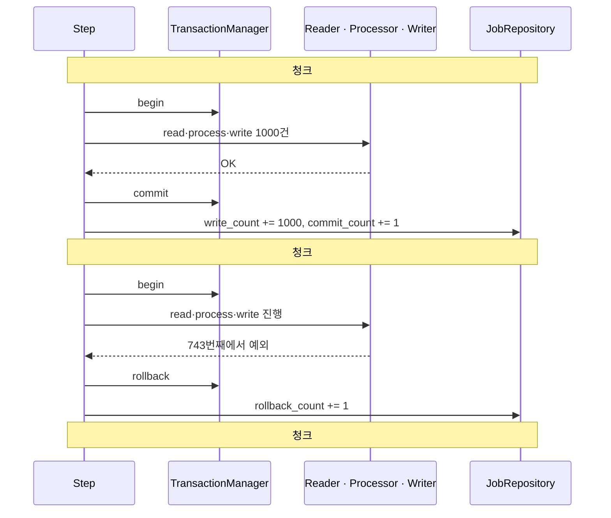
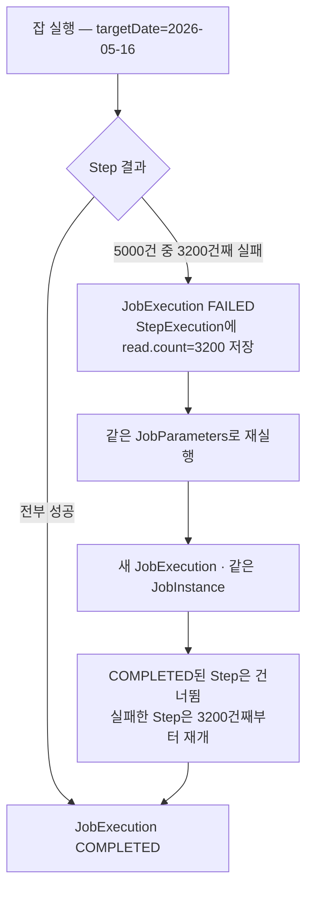

## 서론

[2편](/blog/spring-batch-6-guide-2)에서 청크 사이클 = read N → process N → write N → commit, 그 경계가 곧 트랜잭션 경계라는 걸 봤다. 그런데 청크 안에서 한 건이 깨지면 무슨 일이 벌어질까?

현실의 배치는 더럽다. 100만 건 중 3건은 형식이 깨진 주문이고, DB는 가끔 데드락을 던지며, 외부 알림 API는 종종 타임아웃 난다. 이때 선택지는 셋이다 — 그 한 건 때문에 <strong>전체를 버릴 것인가</strong>, 더러운 건만 <strong>건너뛸 것인가(Skip)</strong>, 아니면 잠깐 뒤에 <strong>다시 시도할 것인가(Retry)</strong>. 그리고 잡이 중간에 죽었다면 처음부터 다시 돌리지 않고 <strong>죽은 지점부터 재개</strong>할 수 있어야 한다.

3편은 이 "실패를 다루는 도구"를 다섯 묶음으로 본다. 청크 트랜잭션 경계가 정확히 어디서 rollback되는지, `faultTolerant` Step의 Skip·Retry·NoRollback 정책을 예외 의미에 맞춰 어떻게 설계하는지, 실패를 관측하는 Listener 6종, `ExecutionContext`가 어떻게 재시작 위치를 보존하는지, 마지막으로 같은 잡을 두 번 돌려도 안전하게 만드는 멱등성까지.

대상 독자는 2편의 청크 메커니즘을 이해한 백엔드 엔지니어다. 트랜잭션과 예외 계층 기본기를 가정한다.

- 1편 — Job · Step · 메타데이터의 정체
- 2편 — 청크 지향 처리 — Reader · Processor · Writer
- <strong>3편 — 트랜잭션 · 실패 처리 — Skip · Retry · 재시작 (이 글)</strong>
- [4편 — 잡 실행 · 스케줄링 · 운영](/blog/spring-batch-6-guide-4)
- [5편 — 성능 · 병렬화 — 멀티 스레드 · 파티셔닝 · 원격 워커](/blog/spring-batch-6-guide-5)
- [6편 — 관측성 · 테스트 · 배포](/blog/spring-batch-6-guide-6)
- [종합 — 마켓플레이스 분석 파이프라인](/blog/spring-batch-6-guide-capstone)

---

## TL;DR

- <strong>청크 1건 실패 = 그 청크 전체 rollback이 기본</strong> — 1000건짜리 청크에서 한 건이 예외를 던지면 999건도 함께 rollback된다. commit된 이전 청크는 살아남는다. 이게 청크가 트랜잭션 경계인 이유이자 재시작의 근거다.
- <strong>Skip · Retry · NoRollback은 예외 의미로 가른다</strong> — 형식 오류 같은 <strong>데이터 문제는 Skip</strong>, 데드락·타임아웃 같은 <strong>일시적 오류는 Retry</strong>, 알림 실패처럼 <strong>데이터를 더럽히지 않는 예외는 NoRollback</strong>. 나머지는 Fail.
- <strong>Skip을 켜면 청크가 item별로 재처리된다(scan)</strong> — 실패 청크는 rollback 후 한 건씩 다시 돌려 범인만 골라낸다. 이때 Processor·Writer가 같은 아이템에 다시 호출되므로 부작용이 없어야 한다.
- <strong>ExecutionContext = 재시작의 핵심</strong> — Reader가 "어디까지 읽었는지"를 StepExecution의 ExecutionContext에 저장한다. 같은 JobParameters로 재실행하면 완료된 Step은 건너뛰고, 실패한 Step은 저장된 지점부터 재개한다.
- <strong>멱등성은 JobParameters 키 + Writer upsert</strong> — 멱등 키는 비즈니스 날짜(`targetDate`)로, Writer는 PostgreSQL `INSERT ... ON CONFLICT DO UPDATE`로. 같은 날짜를 두 번 돌려도 결과가 같아진다.

---

## 1. 청크 트랜잭션 경계

### 1.1 성공과 실패의 갈림길

청크 지향 Step은 청크 하나를 한 트랜잭션으로 처리한다. 성공이면 commit하고 메타데이터 카운트를 올린 뒤 다음 청크로 간다. 실패면 그 청크를 통째로 rollback한다.



여기서 핵심은 두 가지다.

- <strong>실패한 청크의 1000건은 전부 사라진다</strong> — 743번째 한 건 때문에 앞선 742건까지 함께 rollback된다. "한 건만 실패했으니 나머지는 저장됐겠지"는 틀렸다.
- <strong>이전에 commit된 청크는 영향받지 않는다</strong> — 청크 #1의 1000건은 이미 별도 트랜잭션으로 commit됐다. 이 "이미 끝난 지점"이 4절 재시작이 의지하는 체크포인트다.

### 1.2 메타데이터에 남는 흔적

각 청크의 결과는 `BATCH_STEP_EXECUTION`의 카운터에 그대로 누적된다. 운영에서 잡 상태를 읽을 때 이 숫자가 1차 진단 도구다.

| 카운터 | 의미 |
|--------|------|
| `read_count` | Reader가 읽은 아이템 수 |
| `write_count` | Writer가 쓴 아이템 수 |
| `commit_count` | commit된 청크(트랜잭션) 수 |
| `rollback_count` | rollback된 청크 수 |
| `skip_count` | Skip된 아이템 수 (2절) |
| `process_skip_count` · `write_skip_count` | 단계별 Skip 수 |

`read_count`와 `write_count`가 벌어져 있고 `skip_count`가 0이 아니면, 무언가 걸러지고 있다는 신호다.

### 1.3 주의: Skip을 켜면 청크가 item별로 재처리된다

기본 동작은 "청크 1건 실패 → 청크 전체 rollback → Step 실패"다. 그런데 Skip(2절)을 켜면 동작이 한 단계 복잡해진다. Spring Batch는 실패한 청크를 rollback한 뒤, 같은 청크를 <strong>한 건씩 다시 처리(scan)</strong>해서 어떤 아이템이 범인인지 찾아낸다. 범인만 Skip하고 나머지는 정상 commit하기 위해서다.

> <strong>주의</strong>: scan 단계에서 이미 읽은 아이템은 버퍼에 있어 Reader를 다시 부르지 않는다. 하지만 <strong>Processor와 Writer는 같은 아이템에 대해 다시 호출된다.</strong> 따라서 Processor에서 외부 API를 호출하거나 카운터를 증가시키는 등 부작용이 있으면 중복 실행된다. Processor·Writer는 같은 입력에 대해 몇 번 호출돼도 결과가 같도록(부작용 없이) 설계해야 한다 — 5절 멱등성과 직결되는 이유다.

---

## 2. Skip · Retry · NoRollback 정책

### 2.1 세 가지 결정 — 예외의 의미로 가른다

실패를 만났을 때의 선택은 예외가 "무엇을 뜻하는지"로 갈린다. 행 수나 빈도가 아니라 의미가 기준이다.

| 상황 | 예외 성격 | 정책 | 예시 |
|------|-----------|------|------|
| 데이터가 더럽다 | 영구적·해당 건 한정 | <strong>Skip</strong> | 형식 깨진 CSV 행, 검증 실패 주문 |
| 일시적으로 막혔다 | 일시적·재시도하면 풀림 | <strong>Retry</strong> | DB 데드락, 락 타임아웃, 순간 네트워크 오류 |
| 데이터는 멀쩡한데 곁다리가 실패 | 데이터 무결성과 무관 | <strong>NoRollback</strong> | 알림 발송 실패 같은 부수 작업 |
| 그 외 전부 | 잡을 멈춰야 하는 진짜 오류 | <strong>Fail</strong> | 스키마 불일치, NPE, 설정 오류 |

판단 기준은 단순하다. <strong>"다시 시도하면 풀리나?"</strong> → 예면 Retry. <strong>"이 건만 버리면 나머지는 괜찮나?"</strong> → 예면 Skip. <strong>"이 예외가 데이터 트랜잭션을 더럽히나?"</strong> → 아니면 NoRollback. 셋 다 아니면 Fail이 옳다. 의심스러우면 Fail이 기본값이어야 한다 — 조용히 넘어가는 잡이 가장 위험하다.

### 2.2 faultTolerant Step

Skip·Retry·NoRollback은 `faultTolerant()`를 붙인 Step에서만 동작한다. 2편의 집계 Step에 정책을 얹으면 다음과 같다.

```kotlin
import org.springframework.batch.core.Step
import org.springframework.batch.core.repository.JobRepository
import org.springframework.batch.core.step.builder.StepBuilder
import org.springframework.batch.item.ItemProcessor
import org.springframework.batch.item.ItemWriter
import org.springframework.batch.item.database.JpaPagingItemReader
import org.springframework.batch.item.validator.ValidationException
import org.springframework.context.annotation.Bean
import org.springframework.dao.TransientDataAccessException
import org.springframework.transaction.PlatformTransactionManager

@Bean
fun aggregateStep(
    jobRepository: JobRepository,
    txManager: PlatformTransactionManager,
    orderReader: JpaPagingItemReader<Order>,
    salesProcessor: ItemProcessor<Order, DailySalesLine>,
    salesWriter: ItemWriter<DailySalesLine>,
    skipRecorder: SkippedItemRecorder,
): Step =
    StepBuilder("aggregateStep", jobRepository)
        .chunk<Order, DailySalesLine>(1000, txManager)
        .reader(orderReader)
        .processor(salesProcessor)
        .writer(salesWriter)
        .faultTolerant()
        .skip(ValidationException::class.java)   // 데이터 문제 → Skip
        .skipLimit(10)                            // 10건 넘게 Skip되면 Step 실패
        .retry(TransientDataAccessException::class.java)  // 일시 오류 → Retry
        .retryLimit(3)                            // 같은 건을 최대 3번까지
        .noRollback(NotificationFailedException::class.java)  // 곁다리 실패는 rollback 안 함
        .listener(skipRecorder)                   // Skip된 아이템 기록 (3절)
        .build()
```

### 2.3 Skip — 허용 가능한 더러움

`skip(예외)` + `skipLimit(n)`은 "이 예외는 해당 아이템만 버리고 진행하되, 누적 n건을 넘으면 그땐 Step을 실패시켜라"는 뜻이다. `skipLimit`이 중요하다. 더러운 데이터 3건은 무시할 수 있어도, 절반이 깨졌다면 그건 데이터 소스 자체가 망가진 것이므로 잡이 멈춰야 한다.

- <strong>`skipLimit`은 "정상의 마지노선"</strong> — 무한 Skip은 오류를 조용히 묻는다. 전체의 0.1% 같은 현실적 임계치를 잡는다.
- <strong>Skip된 아이템은 반드시 기록</strong> — 그냥 버리면 "왜 3건이 빠졌는지" 영영 모른다. `SkipListener`로 별도 테이블·로그에 남긴다(3절).
- <strong>세밀한 제어는 `SkipPolicy`</strong> — "읽기 오류는 무제한 Skip, 쓰기 오류는 5건까지" 같은 규칙이 필요하면 `SkipPolicy`를 직접 구현한다.

### 2.4 Retry — 일시적 오류

`retry(예외)` + `retryLimit(n)`은 일시적 오류에 쓴다. 데드락은 트랜잭션을 다시 시작하면 대개 풀리고, 락 타임아웃도 잠깐 뒤엔 통과한다. 영구적 오류(검증 실패)에 Retry를 걸면 같은 실패를 n번 반복할 뿐 의미가 없다.

Retry와 Skip은 함께 쓸 수 있다. 한 예외를 Retry 목록과 Skip 목록 모두에 넣으면, 먼저 `retryLimit`까지 재시도하고 그래도 실패하면 Skip된다.

> <strong>참고</strong>: Retry 백오프(재시도 간격)는 `RetryTemplate`/`BackOffPolicy`로 설정한다. 데드락 재시도에는 짧은 고정 간격, 외부 API에는 지수 백오프가 일반적이다. 다만 청크 단위 Retry는 그 청크 전체를 다시 처리하므로, 외부 호출은 Processor보다 Writer 쪽에서 묶어 제어하는 편이 부작용을 줄인다.

### 2.5 NoRollback — rollback 없이 넘기기

기본적으로 청크에서 던진 모든 예외는 트랜잭션을 rollback시킨다. 하지만 데이터 적재는 성공했는데 그 뒤 알림 발송이 실패한 경우라면, 적재까지 되돌릴 이유가 없다. `noRollback(예외)`은 "이 예외는 던져지더라도 트랜잭션을 rollback하지 말라"는 선언이다.

전제가 중요하다. <strong>NoRollback 대상 예외는 트랜잭션 상태를 더럽히지 않아야 한다.</strong> DB 작업 도중 터진 예외에 NoRollback을 걸면 어중간하게 커밋된 데이터가 남을 수 있다. 안전한 후보는 "데이터 쓰기가 끝난 뒤의 순수 부수 작업" 실패뿐이다.

---

## 3. 실패를 관측하는 Listener 6종

Skip·Retry 정책을 걸었다면, 그 결과를 들여다보는 창이 Listener다. Spring Batch는 잡 생애주기의 각 지점에 콜백을 꽂을 수 있다.

### 3.1 빠른 카탈로그

| 리스너 | 주요 콜백 | 대표 쓰임 |
|--------|-----------|-----------|
| `StepExecutionListener` | `beforeStep` / `afterStep` | Step 시작·종료 훅, `ExitStatus` 조정 |
| `ChunkListener` | `beforeChunk` / `afterChunk` / `afterChunkError` | 청크 경계 로깅, 실패 청크 감지 |
| `ItemReadListener` | `beforeRead` / `afterRead` / `onReadError` | 읽기·파싱 오류 진단 |
| `ItemWriteListener` | `beforeWrite` / `afterWrite` / `onWriteError` | 쓰기 실패·배치 insert 오류 진단 |
| `SkipListener` | `onSkipInRead` / `onSkipInProcess` / `onSkipInWrite` | Skip된 아이템을 별도 저장·로그로 보존 |
| `RetryListener` | 재시도 라이프사이클(`open` / `onError` / `close`) | 재시도 횟수·원인 관측 |

`ItemProcessListener`(가공 단계)와 `JobExecutionListener`(잡 전체)도 같은 결로 존재한다. 6종을 다 붙일 필요는 없다 — 실무에서 가장 자주 쓰는 건 단연 `SkipListener`다.

### 3.2 SkipListener — Skip된 아이템을 기록한다

2절에서 "Skip된 아이템은 반드시 기록하라"고 했다. 그 도구가 `SkipListener`다. Skip 콜백은 <strong>청크가 commit된 뒤</strong> 호출되므로, 여기서 남긴 기록은 정상 데이터와 함께 안전하게 저장된다(rollback에 휩쓸리지 않는다).

```kotlin
import org.springframework.batch.core.SkipListener
import org.springframework.stereotype.Component

@Component
class SkippedItemRecorder(
    private val skipLogRepository: SkipLogRepository,
) : SkipListener<Order, DailySalesLine> {

    override fun onSkipInProcess(item: Order, t: Throwable) {
        skipLogRepository.save(
            SkipLog(orderId = item.id, phase = "PROCESS", reason = t.message ?: t.javaClass.simpleName),
        )
    }

    override fun onSkipInWrite(item: DailySalesLine, t: Throwable) {
        skipLogRepository.save(
            SkipLog(orderId = item.orderId, phase = "WRITE", reason = t.message ?: t.javaClass.simpleName),
        )
    }

    override fun onSkipInRead(t: Throwable) {
        // 읽기 단계 Skip(파싱 오류 등)은 원본 아이템을 식별할 수 없어 메시지만 남긴다.
        skipLogRepository.save(SkipLog(orderId = null, phase = "READ", reason = t.message))
    }
}
```

이렇게 남긴 `skip_log` 테이블은 "어제 잡에서 어떤 주문이 왜 빠졌는지"를 사후에 추적·재처리하는 근거가 된다.

---

## 4. ExecutionContext와 재시작

### 4.1 ExecutionContext란

<strong>`ExecutionContext`는 잡 실행 중간 상태를 담는 key-value 저장소</strong>다. JobExecution 단위와 StepExecution 단위 두 개가 있고, 각각 `BATCH_JOB_EXECUTION_CONTEXT` · `BATCH_STEP_EXECUTION_CONTEXT` 테이블에 직렬화돼 저장된다(1편 메타데이터 6 테이블 참고).

핵심 용도는 <strong>재시작 위치 보존</strong>이다. 잡이 중간에 죽어도, 어디까지 했는지를 DB에 적어 두면 다음 실행에서 그 지점부터 이어 갈 수 있다.

### 4.2 Reader는 위치를 어떻게 저장하나

대부분의 Reader는 `ItemStream`을 구현한다. Step이 도는 동안 `update()`가 주기적으로 호출돼 "지금까지 N건 읽었다"를 StepExecution의 ExecutionContext에 적는다. 재시작 시 `open()`이 그 값을 읽어 N건째 다음부터 시작한다.

- <strong>`saveState`(기본 `true`)</strong> — Reader가 상태를 저장할지 여부. 끄면 재시작해도 처음부터 다시 읽는다. 재시작이 필요하면 켜 둬야 한다.
- <strong>`name()`이 키 prefix</strong> — 2편에서 본 Reader의 `name()`은 ExecutionContext 키 충돌을 막는 prefix다. 같은 Step에 Reader가 둘이면 이름이 달라야 한다.
- <strong>커스텀 키도 저장 가능</strong> — 직접 `ItemStream`을 구현하거나 Listener에서 `stepExecution.executionContext`에 임의 값을 넣고 뺄 수 있다.

### 4.3 재시작은 이렇게 동작한다

재시작의 전제는 <strong>같은 JobInstance</strong>다. 즉 식별용 JobParameters(예: `targetDate`)가 같아야 한다. 같은 키로 다시 실행하면 프레임워크가 새 JobExecution을 만들되 같은 JobInstance에 묶고, 직전 실패 지점을 복원한다.



이미 commit된 3000건(청크 3개)은 재처리하지 않고, 3001건째 청크부터 이어 간다. 1절에서 "이전에 commit된 청크는 살아남는다"고 한 게 여기서 값을 한다.

### 4.4 흔한 함정

- <strong>COMPLETED된 JobInstance는 같은 파라미터로 재실행 불가</strong> — 성공으로 끝난 잡을 같은 `targetDate`로 또 돌리면 `JobInstanceAlreadyCompleteException`이 난다. 재실행이 필요하면 파라미터를 바꾸거나(4편 `run.id`), 5절 멱등 설계로 풀어야 한다.
- <strong>ExecutionContext는 작게 유지</strong> — DB에 직렬화되므로 큰 객체나 컬렉션을 넣으면 안 된다. 위치 정보 같은 작은 값만.
- <strong>`saveState=false`면 재시작이 무의미</strong> — 멀티 스레드 Step처럼 상태 저장이 어려운 경우 끄기도 하는데(5편), 그러면 재시작은 처음부터다.

---

## 5. 멱등성 패턴

### 5.1 왜 멱등이 필요한가

재시작이 있는데도 멱등성이 따로 필요한 이유는, <strong>"재시작"과 "재실행"이 다르기 때문</strong>이다. 재시작은 실패한 JobInstance를 이어 가는 것이라 이미 쓴 데이터를 건드리지 않는다. 하지만 운영에서는 "어제 집계가 이상하니 다시 돌려라" 같은 <strong>의도적 재실행</strong>이 흔하다. 이때 같은 날짜 데이터를 또 적재하면 매출이 두 배로 부풀 수 있다.

<strong>멱등 = 같은 입력으로 몇 번을 실행해도 결과가 같다.</strong> 배치에서 이건 두 층위로 보장한다 — 잡 식별(JobParameters)과 쓰기 연산(Writer).

### 5.2 JobParameters 비즈니스 날짜로 멱등 키

집계 잡의 멱등 키는 처리 대상을 가리키는 비즈니스 값, 즉 `targetDate`다. "2026-05-16 매출 집계"는 몇 번을 정의하든 하나의 JobInstance여야 한다.

- <strong>식별 파라미터는 비즈니스 날짜</strong> — `targetDate=2026-05-16`. 같은 날짜 = 같은 JobInstance = 중복 완료 차단.
- <strong>실행마다 바뀌는 값은 비식별로</strong> — 실행 시각 로그 같은 건 식별에서 빼야(4편 `run.id` incrementer) 재실행이 가능해진다.
- 단, 식별 파라미터만으로는 "성공한 잡 재실행 차단"까지다. 데이터를 덮어쓰는 재실행을 허용하려면 Writer가 멱등이어야 한다.

### 5.3 Writer upsert — PostgreSQL ON CONFLICT

쓰기 멱등의 정석은 upsert다. 2편 4.3절에서 본 `JdbcBatchItemWriter` + PostgreSQL `INSERT ... ON CONFLICT DO UPDATE`를 그대로 쓴다. 같은 `(sale_date, member_id)`가 이미 있으면 INSERT 대신 UPDATE되므로, 같은 날짜를 두 번 돌려도 행이 중복되지 않고 값만 갱신된다.

```kotlin
import org.springframework.batch.item.database.JdbcBatchItemWriter
import org.springframework.batch.item.database.builder.JdbcBatchItemWriterBuilder
import org.springframework.context.annotation.Bean
import javax.sql.DataSource

@Bean
fun salesWriter(dataSource: DataSource): JdbcBatchItemWriter<DailySalesLine> =
    JdbcBatchItemWriterBuilder<DailySalesLine>()
        .dataSource(dataSource)
        .sql(
            """
            INSERT INTO daily_sales (sale_date, member_id, amount)
            VALUES (:saleDate, :memberId, :amount)
            ON CONFLICT (sale_date, member_id)
            DO UPDATE SET amount = EXCLUDED.amount
            """.trimIndent(),
        )
        .beanMapped()
        .build()
```

이게 동작하려면 `daily_sales`에 `UNIQUE (sale_date, member_id)` 제약이 있어야 한다. 멱등성은 코드가 아니라 그 유니크 제약이 보장한다.

### 5.4 대안 — delete-then-insert

upsert가 부담스럽거나 "그날 데이터를 통째로 새로 쓴다"가 더 자연스러우면, 집계 Step 앞에 삭제 Tasklet Step을 두는 방법도 있다.

```kotlin
@Bean
fun purgeStep(
    jobRepository: JobRepository,
    txManager: PlatformTransactionManager,
    jdbcTemplate: JdbcTemplate,
    @Value("#{jobParameters['targetDate']}") targetDate: LocalDate,
): Step =
    StepBuilder("purgeStep", jobRepository)
        .tasklet({ _, _ ->
            jdbcTemplate.update("DELETE FROM daily_sales WHERE sale_date = ?", targetDate)
            RepeatStatus.FINISHED
        }, txManager)
        .build()
```

`purgeStep` → `aggregateStep` 순으로 잡을 엮으면, 재실행 때마다 해당 날짜를 비우고 새로 채운다. 트레이드오프는 명확하다 — upsert는 <strong>행 단위 멱등</strong>(부분 갱신에 강함), delete-then-insert는 <strong>"깨끗한 슬레이트"</strong>(추론이 단순하지만 삭제와 적재 사이 빈 구간이 생긴다). 단일 잡 안에서 순차 실행하면 그 빈 구간은 잡 실행 중에만 존재한다.

---

## 정리

3편의 핵심 takeaway를 한 줄씩 정리하면 다음과 같다.

- <strong>청크 1건 실패는 그 청크 전체를 rollback시킨다</strong> — 999건이 함께 사라지고, 이미 commit된 이전 청크만 살아남는다. 이 경계가 재시작 체크포인트다.
- <strong>Skip·Retry·NoRollback은 예외의 의미로 가른다</strong> — 데이터 문제는 Skip, 일시 오류는 Retry, 곁다리 실패는 NoRollback, 나머지는 Fail. 의심스러우면 Fail이 안전하다.
- <strong>Skip은 청크를 item별로 다시 돌린다</strong> — Processor·Writer가 같은 아이템에 재호출되므로 부작용이 없어야 한다. Skip된 아이템은 `SkipListener`로 반드시 기록.
- <strong>ExecutionContext가 재시작 위치를 보존한다</strong> — 같은 JobParameters면 같은 JobInstance로 묶여, 완료 Step은 건너뛰고 실패 Step은 저장된 지점부터 재개한다.
- <strong>멱등성은 JobParameters 키 + Writer upsert 두 층</strong> — 비즈니스 날짜로 잡을 식별하고, `ON CONFLICT DO UPDATE`로 같은 날짜 재실행을 안전하게 만든다.

다음 편은 <strong>잡 실행 · 스케줄링 · 운영</strong>이다. 지금까지는 잡을 어떻게 "짜는지"였다면, 4편은 어떻게 "돌리는지"다. `JobLauncher`와 `JobOperator`의 차이, `@Scheduled`/Quartz/K8s CronJob/Argo 중 무엇으로 트리거할지, 여러 인스턴스에서 같은 잡이 중복 실행되는 걸 어떻게 막는지(이번 5절 멱등이 그 최후 안전망이다), 그리고 배치가 데이터를 읽어 오는 5가지 패턴까지 다룬다.

---

## 부록

### A. faultTolerant Step 전체 예제

<details>
<summary><strong>펼치기 — purgeStep → aggregateStep을 엮은 Job 전체 골격</strong></summary>

```kotlin
import org.springframework.batch.core.Job
import org.springframework.batch.core.job.builder.JobBuilder
import org.springframework.batch.core.repository.JobRepository
import org.springframework.context.annotation.Bean
import org.springframework.context.annotation.Configuration

@Configuration
class DailySalesJobConfig {

    @Bean
    fun dailySalesJob(
        jobRepository: JobRepository,
        purgeStep: Step,
        aggregateStep: Step,
    ): Job =
        JobBuilder("dailySalesJob", jobRepository)
            .start(purgeStep)       // 해당 날짜를 비우고 (5.4절)
            .next(aggregateStep)    // 새로 집계해 적재 (2.2절)
            .build()
}
```

`purgeStep`이 멱등의 첫 층(깨끗한 슬레이트), `aggregateStep`의 upsert Writer가 두 번째 층이다. 둘 중 하나만 써도 되지만, 둘을 겹쳐 두면 재실행이 어떤 경로로 들어와도 중복이 생기지 않는다.

</details>

### B. Skip / Retry 예외 분류 치트시트

<details>
<summary><strong>펼치기 — 자주 만나는 예외별 권장 정책</strong></summary>

| 예외 | 성격 | 권장 정책 |
|------|------|-----------|
| `org.springframework.batch.item.validator.ValidationException` | 검증 실패(데이터) | Skip |
| `FlatFileParseException` | 파일 행 파싱 실패 | Skip |
| `org.springframework.dao.DeadlockLoserDataAccessException` | DB 데드락(일시) | Retry |
| `org.springframework.dao.TransientDataAccessException` | 일시적 DB 오류 전반 | Retry |
| `java.net.SocketTimeoutException` | 외부 호출 타임아웃 | Retry (백오프) |
| `org.springframework.dao.DataIntegrityViolationException` | 제약 위반(무결성) | Fail |
| `NullPointerException` / 설정 오류 | 코드·환경 버그 | Fail |

원칙: 같은 예외를 Retry와 Skip 양쪽에 넣으면 "재시도 후 그래도 안 되면 버린다"가 된다. 외부 API 타임아웃에 자주 쓰는 조합이다.

</details>

### C. 외부 참조

- [Spring Batch — Configuring Skip and Retry](https://docs.spring.io/spring-batch/reference/step/chunk-oriented-processing/configuring-skip.html) — Skip·Retry·SkipPolicy 공식 레퍼런스
- [Spring Batch — Controlling Rollback](https://docs.spring.io/spring-batch/reference/step/chunk-oriented-processing/controlling-rollback.html) — NoRollback 동작과 트랜잭션 속성
- [Spring Batch — Restartability & ExecutionContext](https://docs.spring.io/spring-batch/reference/domain.html) — 재시작 의미론과 ExecutionContext 보존
- [PostgreSQL — INSERT ... ON CONFLICT](https://www.postgresql.org/docs/16/sql-insert.html#SQL-ON-CONFLICT) — upsert 문법
