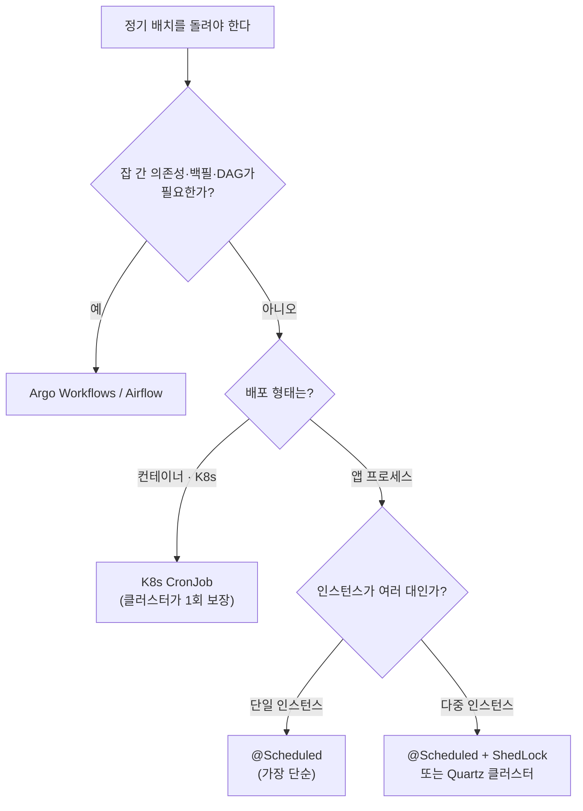
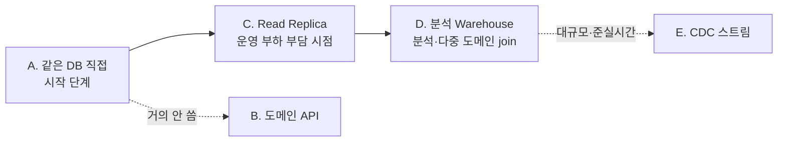

## 서론

[3편](/blog/spring-batch-6-guide-3)까지는 잡을 어떻게 "짜는지"였다. 청크로 읽고 가공하고 쓰고, 실패를 Skip·Retry로 다루고, 죽으면 재시작했다. 4편은 그 잡을 어떻게 "돌리는지"다.

질문이 줄줄이 따라온다. 잡은 누가 언제 실행하나? `@Scheduled` 한 줄이면 충분한가, cron이나 K8s가 나아 보이는데? 서버를 여러 대로 늘렸더니 같은 잡이 두 번 도는데? 집계 잡이 운영 DB를 직접 긁어도 괜찮나, 아니면 따로 읽어야 하나?

4편은 이 "운영"의 일곱 갈래를 본다. `JobLauncher`와 `JobOperator`의 역할 분담, 스케줄러 4종 중 선택, `JobParameters` 멱등 설계, 실패 잡 재시작, 운영 모니터링, 그리고 실무에서 가장 자주 막히는 두 가지 — <strong>여러 인스턴스에서의 중복 실행 방지</strong>와 <strong>배치가 데이터를 읽어 오는 5가지 패턴</strong>까지.

대상 독자는 1~3편으로 잡을 만들어 본 백엔드 엔지니어다. 스케줄링과 운영 환경(컨테이너·다중 인스턴스) 기본 개념을 가정한다.

- 1편 — Job · Step · 메타데이터의 정체
- 2편 — 청크 지향 처리 — Reader · Processor · Writer
- 3편 — 트랜잭션 · 실패 처리 — Skip · Retry · 재시작
- <strong>4편 — 잡 실행 · 스케줄링 · 운영 (이 글)</strong>
- 5편 — 성능 · 병렬화 — 멀티 스레드 · 파티셔닝 · 원격 워커 (예정)
- 6편 — 관측성 · 테스트 · 배포 (예정)
- 종합 — 마켓플레이스 분석 파이프라인 (예정)

---

## TL;DR

- <strong>JobLauncher는 코드가 잡을 실행하는 입구, JobOperator는 운영자의 리모컨</strong> — `@Scheduled`가 호출하는 건 `JobLauncher`, 실패 실행을 ID로 재시작·중단하는 건 `JobOperator`.
- <strong>스케줄러는 4종에서 고른다</strong> — `@Scheduled`(단순·단일 인스턴스), Quartz(앱 내 HA), K8s CronJob(컨테이너), Argo·Airflow(잡 간 의존성 DAG).
- <strong>JobParameters 설계 = 멱등 키냐, 매번 새 인스턴스냐</strong> — 비즈니스 날짜(`targetDate`)를 식별 키로 두면 "하루 1회·재시작 가능", `RunIdIncrementer`를 붙이면 실행마다 새 JobInstance(쓰기 멱등은 따로 필요).
- <strong>재시작은 같은 식별 파라미터 또는 JobOperator.restart</strong> — `preventRestart` · `startLimit` · `allowStartIfComplete`로 재시작 동작을 제어하고, `ExitStatus`로 흐름을 분기한다.
- <strong>모니터링: Spring Batch Admin은 없다</strong> — Actuator + Micrometer 메트릭(6편) + `JobExplorer` 질의 + 실패 알림 조합으로 대체한다.
- <strong>멀티 인스턴스 중복 실행 방지</strong> — 앱을 N개로 띄우면 `@Scheduled`가 N번 트리거된다. JobInstance 락이 같은 파라미터 동시 실행은 막지만 한계가 있어, ShedLock·Quartz 클러스터·CronJob 단일 실행으로 보장한다.
- <strong>배치는 어디서 데이터를 읽나 — 5 패턴</strong> — A.같은 DB / B.도메인 API / C.Read Replica / D.분석 Warehouse / E.CDC. 보통 A → C → D로 진화하고, B는 거의 안 쓴다.

---

## 1. JobLauncher vs JobOperator

### 1.1 JobLauncher — 잡을 실행한다

`JobLauncher`는 코드에서 잡을 시작하는 입구다. `Job`과 `JobParameters`를 받아 실행하고 `JobExecution`을 돌려준다. 1편의 `CommandLineRunner`나 아래의 `@Scheduled`가 호출하는 게 바로 이것이다.

```kotlin
import org.springframework.batch.core.Job
import org.springframework.batch.core.launch.JobLauncher
import org.springframework.batch.core.JobParametersBuilder
import org.springframework.scheduling.annotation.Scheduled
import org.springframework.stereotype.Component
import java.time.LocalDate

@Component
class DailySalesScheduler(
    private val jobLauncher: JobLauncher,
    private val dailySalesJob: Job,
) {
    @Scheduled(cron = "0 0 1 * * *")  // 매일 01:00
    fun launch() {
        val params = JobParametersBuilder()
            .addLocalDate("targetDate", LocalDate.now().minusDays(1))
            .toJobParameters()
        jobLauncher.run(dailySalesJob, params)
    }
}
```

기본 `JobLauncher`는 <strong>동기</strong>다 — 호출 스레드에서 잡이 끝날 때까지 블로킹한다. `@Scheduled` 스레드를 오래 잡고 싶지 않으면 `TaskExecutor`를 주입해 비동기로 띄울 수 있지만, 그러면 호출 즉시 리턴하므로 완료를 따로 관측해야 한다.

### 1.2 JobOperator — 운영자의 리모컨

`JobOperator`는 사람이 운영 중에 잡을 다루는 API다. `JobLauncher`가 "코드가 잡을 시작"하는 거라면, `JobOperator`는 이름·파라미터 문자열·실행 ID로 <strong>실행/중단/재시작/폐기</strong>를 다룬다. JMX, 운영 CLI, 어드민 엔드포인트에서 호출하기 좋게 설계됐다.

```kotlin
// 운영 엔드포인트·CLI에서 (이름·문자열 파라미터·실행 ID로 다룸)
val executionId: Long = jobOperator.start("dailySalesJob", properties)  // 새 실행
jobOperator.restart(failedExecutionId)   // 실패한 실행 재시작 (4절)
jobOperator.stop(runningExecutionId)     // 실행 중단 요청
jobOperator.abandon(stoppedExecutionId)  // 중단된 실행 폐기
```

### 1.3 언제 무엇을 쓰나

| 구분 | JobLauncher | JobOperator |
|------|-------------|-------------|
| 주 사용자 | 애플리케이션 코드 | 운영자·관리 도구 |
| 입력 | `Job` + `JobParameters` 객체 | 잡 이름 + 문자열 파라미터 / 실행 ID |
| 대표 호출 | `@Scheduled`, `CommandLineRunner` | 어드민 화면, JMX, 운영 CLI |
| 잘하는 일 | 정해진 잡을 트리거 | 실행 이력 조회·중단·재시작 등 사후 개입 |

> <strong>참고</strong>: Spring Batch 6에서 `JobOperator` API가 확장돼 운영 작업의 단일 진입점 역할이 강해졌다. 다만 개념 구분은 그대로다 — "정상 흐름의 트리거는 `JobLauncher`, 사후 개입은 `JobOperator`"로 기억하면 된다.

---

## 2. 스케줄러 선택

`JobLauncher`를 누가 호출하느냐 — 즉 "언제 도느냐"를 정하는 게 스케줄러다. 1편 1.1절에서 trigger(언제)와 실행 엔진(어떻게)이 별개 축이라고 했는데, 4편이 그 trigger 층을 본격적으로 고른다.

### 2.1 4종 비교

| 스케줄러 | 실행 위치 | 단일 실행(HA) | 잡 간 의존성(DAG) | 적합 |
|----------|-----------|---------------|-------------------|------|
| `@Scheduled` | 앱 내부 | ❌ (인스턴스마다 실행 → 7절) | ❌ | 단일 인스턴스·단순 정기 |
| Quartz | 앱 내부 | ✅ 클러스터 모드 | 제한적 | 앱 안에서 HA가 필요할 때 |
| K8s CronJob | 클러스터 | ✅ 클러스터가 1회 보장 | ❌ | 컨테이너 배포 환경 |
| Argo · Airflow | 외부 오케스트레이터 | ✅ | ✅ DAG·백필·재시도 | 여러 잡의 의존 관계·파이프라인 |

### 2.2 결정 트리



핵심은 두 질문이다. <strong>잡들 사이에 의존성이 있나</strong>(A→B→C 순서·백필·시각화) → 있으면 Argo/Airflow. 없으면 <strong>배포 형태가 컨테이너인가</strong> → CronJob, 앱 프로세스면 인스턴스 수에 따라 `@Scheduled`(단일) 또는 ShedLock·Quartz(다중, 7절).

### 2.3 @Scheduled로 잡 띄우기

가장 흔한 형태는 1.1절 코드 그대로 `@Scheduled`가 `JobLauncher.run`을 호출하는 것이다. cron 표현식으로 시각을 정하고, 처리 대상 날짜는 `JobParameters`로 넘긴다(3절). 단, `@Scheduled`는 단일 인스턴스 가정이다 — 여러 대면 7절의 단일 실행 보장이 필요하다.

---

## 3. JobParameters 설계

`JobParameters`는 단순한 입력값이 아니다. <strong>JobInstance의 정체성</strong>을 정의한다(1편 3절). 그래서 어떤 파라미터를 식별 키로 둘지가 "같은 잡을 두 번 돌렸을 때 어떻게 되는가"를 결정한다.

### 3.1 식별 vs 비식별 파라미터

1편에서 본 `IDENTIFYING` 플래그가 여기서 작동한다. <strong>식별 파라미터가 같으면 같은 JobInstance</strong>다. 즉 식별 파라미터 조합이 JobInstance의 비즈니스 키다.

- <strong>식별(identifying)</strong> — JobInstance를 가른다. 비즈니스 의미를 담는 값. 예: `targetDate`.
- <strong>비식별(non-identifying)</strong> — 같은 JobInstance 안에서 실행만 구분. 예: 디버그 플래그, 실행 시각.

### 3.2 멱등 키 = 비즈니스 날짜

집계 잡의 멱등 키는 "무엇을 처리하는가"를 가리키는 비즈니스 값, 즉 `targetDate`다.

```kotlin
val params = JobParametersBuilder()
    .addLocalDate("targetDate", LocalDate.now().minusDays(1))  // 식별 (기본)
    .addString("triggeredBy", "scheduler", false)              // 비식별
    .toJobParameters()
```

`targetDate`만 식별로 두면 "2026-05-16 집계"는 하나의 JobInstance다. 같은 날짜로 또 실행하면 — 실패했었다면 재시작, 성공했었다면 `JobInstanceAlreadyCompleteException`(3편 4.4절). 이게 "하루 1회, 재시작 가능"이라는 가장 흔한 배치의 정체성이다.

### 3.3 incrementer — 매번 새 인스턴스로

반대로 "같은 잡을 언제든 다시, 여러 번 돌리고 싶다"면 `RunIdIncrementer`를 붙인다. 실행마다 `run.id`가 증가해 <strong>매번 새 JobInstance</strong>가 된다.

```kotlin
JobBuilder("dailySalesJob", jobRepository)
    .incrementer(RunIdIncrementer())   // 실행마다 run.id 증가 → 새 JobInstance
    .start(aggregateStep)
    .build()
```

트레이드오프가 명확하다. incrementer를 쓰면 "성공한 잡 재실행 차단"이 사라진다 — 같은 날짜를 두 번 돌리면 두 번 다 처리된다. 그래서 <strong>incrementer를 쓰면 쓰기 멱등이 필수</strong>다(3편 5절 upsert). 정리하면:

| 선택 | JobInstance | 같은 날짜 재실행 | 멱등 보장 주체 |
|------|-------------|------------------|----------------|
| 날짜 식별 키만 | 날짜당 1개 | 차단(또는 재시작) | 프레임워크 |
| incrementer | 실행마다 새로 | 매번 새로 처리 | Writer upsert(3편) |

### 3.4 파라미터 검증

필수 파라미터 누락을 부팅·실행 시점에 잡으려면 `JobParametersValidator`를 둔다. `DefaultJobParametersValidator`에 필수/선택 키를 선언하면, `targetDate` 없이 실행하는 사고를 사전에 막는다.

---

## 4. 실패 잡 재시작 전략

3편 4절에서 재시작의 메커니즘(`ExecutionContext`가 위치를 보존)을 봤다. 4편은 그걸 운영에서 어떻게 <strong>트리거하고 제어</strong>하는지를 본다.

### 4.1 재시작을 거는 두 가지 길

- <strong>같은 식별 파라미터로 재실행</strong> — `JobLauncher`로 같은 `targetDate`를 다시 넘기면, 프레임워크가 미완료 JobInstance를 찾아 이어서 실행한다. 스케줄러 기반 운영의 기본 경로.
- <strong>`JobOperator.restart(executionId)`</strong> — 실패한 실행 ID를 직접 지정해 재시작. 어드민·CLI에서 사람이 개입할 때.

### 4.2 재시작 제어 노브

잡·스텝에는 재시작 동작을 바꾸는 설정이 있다.

| 설정 | 위치 | 효과 |
|------|------|------|
| `preventRestart()` | Job | 한 번 실패하면 재시작 자체를 금지 |
| `startLimit(n)` | Step | 그 Step을 최대 n번까지만 시작 허용 |
| `allowStartIfComplete(true)` | Step | 이미 완료된 Step도 재시작 시 다시 실행 |

`allowStartIfComplete`가 특히 유용하다. 기본은 "완료된 Step은 재시작 시 건너뜀"인데, 검증·정리처럼 <strong>매 실행마다 무조건 다시 돌아야 하는 Step</strong>은 이 플래그를 켠다.

### 4.3 ExitStatus로 흐름 분기

Step의 결과(`ExitStatus`)에 따라 다음 흐름을 바꿀 수 있다. 예를 들어 "Skip이 있었으면 알림 Step으로, 아니면 바로 종료"처럼.

```kotlin
JobBuilder("dailySalesJob", jobRepository)
    .start(aggregateStep)
        .on("COMPLETED WITH SKIPS").to(notifySkipStep)  // Skip 발생 시 알림
        .from(aggregateStep).on("*").end()              // 그 외 정상 종료
    .end()
    .build()
```

`afterStep`에서 `ExitStatus`를 커스텀으로 돌려주면(예: `"COMPLETED WITH SKIPS"`), 위 `on(...)` 매핑이 그 값을 받아 분기한다.

---

## 5. 운영 관점 모니터링

### 5.1 Spring Batch Admin은 없다

한때 표준이던 Spring Batch Admin은 오래전 EOL됐다. 지금은 별도 UI 대신 <strong>Actuator + Micrometer + 메타데이터 질의</strong> 조합으로 운영을 관측한다.

### 5.2 무엇으로 보나

- <strong>메트릭 → Micrometer/Prometheus</strong> — `spring.batch.job` · `step` · `item.*` 메트릭을 `/actuator/prometheus`로 노출해 Grafana로 본다. 메트릭 6종과 대시보드는 6편에서 본격적으로 다룬다.
- <strong>실행 이력 → `JobExplorer`</strong> — 잡·스텝 실행 이력, 상태, 카운트를 코드로 질의한다. 어드민 엔드포인트를 직접 만들 때의 데이터 소스.
- <strong>실패 알림</strong> — `JobExecutionListener.afterJob`에서 `BatchStatus.FAILED`를 감지해 Slack·Email로 보낸다. 운영에서 가장 먼저 붙이는 안전장치.

> <strong>참고</strong>: 메타데이터 6 테이블(1편 3절)을 직접 SQL로 조회해도 된다. `BATCH_JOB_EXECUTION`의 `STATUS`·`EXIT_CODE`, `BATCH_STEP_EXECUTION`의 카운트가 1차 진단 도구다. 관측성 심화는 6편으로 미룬다.

---

## 6. 배치는 어디서 데이터를 읽나 — 5 데이터 소스 패턴

지금까지 예시는 모두 "배치가 운영 DB를 직접 읽는다"를 가정했다. 하지만 데이터가 커지고 운영 트래픽과 부딪히기 시작하면, "어디서 읽을 것인가"가 잡 설계 전체를 좌우한다. 실무에서 마주치는 패턴은 다섯이다.

### 6.1 5 패턴 비교

| 패턴 | 결합도 | 인프라 비용 | 운영 부하 전가 | 데이터 신선도 | 언제 |
|------|--------|-------------|----------------|---------------|------|
| <strong>A. 같은 DB 직접</strong> | 높음 | 없음 | 운영 DB에 그대로 | 실시간 | 시작 단계·소규모 |
| <strong>B. 도메인 API 호출</strong> | 중간 | 낮음 | 운영 서비스에 전가 | 실시간 | 거의 안 씀(6.3) |
| <strong>C. Read Replica</strong> | 높음 | 중간 | 복제본으로 분리 | 거의 실시간(복제 지연) | 운영 부하 격리 필요 시 |
| <strong>D. 분석 Warehouse</strong> | 낮음 | 높음 | 완전 분리 | ETL 주기만큼 지연 | 분석·여러 도메인 join |
| <strong>E. CDC 이벤트 스트림</strong> | 낮음 | 매우 높음 | 완전 분리 | 준실시간(분 단위) | 대규모·준실시간 요구 |

읽기 전용 계정으로 운영 DB에 붙는 A가 가장 단순하고, 분석 전용 저장소를 따로 두는 D가 가장 깔끔하게 분리된다. 비용과 분리도가 반비례한다.

### 6.2 진화 경로 — A → C → D

대부분의 회사는 한 번에 D로 가지 않는다. 다음 순서로 자연스럽게 밟는다.



처음엔 A로 충분하다. 배치가 운영 DB의 부하를 키우기 시작하면 <strong>C(Read Replica)</strong>로 읽기를 복제본에 떠넘긴다(2편 `JdbcPagingItemReader`의 datasource만 교체). 분석 요구가 커지고 여러 도메인을 join해야 하면 <strong>D(Warehouse)</strong>로 간다.

### 6.3 B(API 호출)가 거의 안 쓰이는 이유

- <strong>API는 단건·소량 응답용</strong> — 수십만 건을 페이징으로 끌어오기엔 직렬화 오버헤드가 크다.
- <strong>페이징 경계의 트랜잭션 일관성이 없다</strong> — 페이지 사이에 데이터가 바뀌면 누락·중복이 생긴다.
- <strong>운영 서비스에 배치 부하를 전가</strong> — 대량 조회가 운영 API의 응답을 망친다.
- 예외는 <strong>외부사 API</strong>(DB 접근이 불가능한 경우)나 <strong>1000건 이하 실시간</strong> 정도뿐이다.

### 6.4 E(CDC)는 언제 등장하나

CDC(Change Data Capture)는 DB 변경 로그를 Kafka 등으로 흘려보내 준실시간으로 소비하는 방식이다. 강력하지만 비싸다.

- Debezium · Kafka · Schema Registry 같은 <strong>인프라 비용</strong>이 든다.
- 배치라기보다 <strong>micro-batch</strong>(5분~1시간 윈도)에 가깝다. 시간 단위 집계와 궁합이 좋다.
- 도입 임계 규모가 높다 — "준실시간 분석이 비즈니스 요구"일 때라야 값을 한다.

### 6.5 본 시리즈와의 연결

1~6편 본문 예시는 모두 <strong>A(같은 DB)</strong>를 가정한다 — 학습 흐름이 단순하기 때문이다. 종합 capstone은 <strong>D(분석 Warehouse)의 단순화 변형</strong>을 택한다 — 같은 PostgreSQL 인스턴스 안에서 운영 schema와 분석 schema를 나누는 방식이다(종합편에서 다룬다). 데이터 소스 결정이 Reader 선택(2편)부터 멱등 설계(3편)까지 전부에 영향을 준다는 점만 기억하면 된다.

---

## 7. 멀티 인스턴스 중복 실행 방지

### 7.1 문제 — 앱이 N개면 잡도 N번

운영에서 앱은 보통 여러 인스턴스로 떠 있다. 그런데 `@Scheduled`는 <strong>인스턴스마다 독립적으로</strong> 동작한다. 3대면 매일 01:00에 같은 집계 잡이 세 번 트리거된다. 1편 1.1절 트리거 비교 표의 "멀티 인스턴스 중복" 열이 가리킨 바로 그 문제다.

### 7.2 Spring Batch가 막아주는 범위와 한계

좋은 소식은 Spring Batch가 일부를 막아 준다는 것이다. <strong>같은 JobInstance(동일 식별 JobParameters)를 동시에 두 번 실행하려 하면</strong>, JobRepository 락이 두 번째 실행을 `JobExecutionAlreadyRunningException`으로 거부한다.

문제는 한계다. 트리거가 매번 다른 파라미터를 주면 — 예컨대 `targetDate` 대신 `LocalDateTime.now()`를 넘기면 — 매 실행이 다른 JobInstance가 되어 <strong>락이 걸리지 않는다.</strong> 세 인스턴스가 미세하게 다른 시각을 넘기면 셋 다 따로 돈다. 그래서 트리거 레벨에서 단일 실행을 따로 보장해야 한다.

### 7.3 트리거별 단일 실행 보장

| 방식 | 단일 실행 보장 | 추가 인프라 | 적합한 상황 |
|------|----------------|-------------|-------------|
| `@Scheduled` 단독 | ❌ 인스턴스마다 실행 | 없음 | 단일 인스턴스 배포만 |
| `@Scheduled` + ShedLock | ✅ 분산 락으로 1회 | 락 저장소(DB/Redis) | 앱 내 스케줄 유지하며 HA |
| Quartz 클러스터 | ✅ 클러스터 모드 1회 | Quartz 스키마(DB) | 복잡한 스케줄 + HA |
| K8s CronJob | ✅ 클러스터가 1회 보장 | K8s | 컨테이너 배포 |
| leader election | ✅ 리더만 실행 | 코디네이터(ZK/etcd 등) | 이미 클러스터 코디네이터 보유 |

### 7.4 권장 조합

- <strong>컨테이너 배포면 K8s CronJob</strong> — 클러스터가 한 번만 띄워 주니 추가 락이 필요 없다. 가장 깔끔하다.
- <strong>`@Scheduled`를 유지하면 ShedLock 필수</strong> — 분산 락으로 한 인스턴스만 잡을 띄우게 한다(부록 A).
- <strong>멱등 설계(3편 5절)는 최후 안전망</strong> — 트리거 단일화가 뚫려 잡이 두 번 돌더라도, Writer가 upsert면 결과는 같다.

결론은 한 줄이다 — <strong>중복 방지 = 트리거 단일화 + 멱등 이중 안전망.</strong> 둘 중 하나만 믿지 말고 겹쳐 둔다.

---

## 정리

4편의 핵심 takeaway를 한 줄씩 정리하면 다음과 같다.

- <strong>JobLauncher는 트리거, JobOperator는 사후 개입</strong> — `@Scheduled`가 부르는 건 Launcher, 실패 실행을 ID로 재시작하는 건 Operator.
- <strong>스케줄러는 의존성과 배포 형태로 고른다</strong> — DAG가 필요하면 Argo/Airflow, 컨테이너면 CronJob, 앱 프로세스면 인스턴스 수에 따라 @Scheduled 또는 ShedLock/Quartz.
- <strong>JobParameters가 JobInstance의 정체성</strong> — 날짜 식별 키는 "하루 1회·재시작", incrementer는 "매번 새로"(쓰기 멱등 필수).
- <strong>데이터 소스는 보통 A → C → D로 진화한다</strong> — 같은 DB에서 시작해 Read Replica로 부하를 분리하고, 분석 요구가 커지면 Warehouse로. B(API)는 거의 안 쓴다.
- <strong>멀티 인스턴스 중복은 트리거 단일화 + 멱등으로 막는다</strong> — JobInstance 락은 같은 파라미터 동시 실행만 막으니, ShedLock·CronJob으로 트리거를 단일화하고 upsert를 안전망으로 둔다.

다음 편은 <strong>성능 · 병렬화</strong>다. 지금까지는 잡을 한 줄(단일 스레드)로 돌렸다. 5편은 같은 잡을 더 빨리 돌리는 법 — 멀티 스레드 Step, 파티셔닝, 원격 워커, 그리고 JDK 21 가상 스레드까지 다룬다. 단, 이건 "한 잡을 쪼개 빨리 도는 것"이지 이번 7절의 "중복 실행 방지"와는 별개 축이라는 점을 미리 짚어 둔다.

---

## 부록

### A. @Scheduled + ShedLock 단일 실행

<details>
<summary><strong>펼치기 — 다중 인스턴스에서 한 번만 트리거하기</strong></summary>

ShedLock은 공유 저장소(DB·Redis)에 락을 잡아, 여러 인스턴스 중 하나만 스케줄 메서드를 실행하게 한다.

```kotlin
import net.javacrumbs.shedlock.spring.annotation.SchedulerLock
import org.springframework.scheduling.annotation.Scheduled
import org.springframework.stereotype.Component

@Component
class DailySalesScheduler(
    private val jobLauncher: JobLauncher,
    private val dailySalesJob: Job,
) {
    @Scheduled(cron = "0 0 1 * * *")
    @SchedulerLock(name = "dailySalesJob", lockAtMostFor = "30m", lockAtLeastFor = "1m")
    fun launch() {
        val params = JobParametersBuilder()
            .addLocalDate("targetDate", LocalDate.now().minusDays(1))
            .toJobParameters()
        jobLauncher.run(dailySalesJob, params)
    }
}
```

`lockAtMostFor`는 인스턴스가 죽어도 락이 영원히 안 풀리는 걸 막는 안전장치다. 잡 최대 실행 시간보다 넉넉히 잡는다.

</details>

### B. 데이터 소스 5 패턴 선택 치트시트

<details>
<summary><strong>펼치기 — 상황별 권장 패턴</strong></summary>

| 상황 | 권장 패턴 |
|------|-----------|
| 이제 막 시작, 데이터 적음 | A. 같은 DB(읽기 전용 계정) |
| 배치가 운영 DB 부하를 키움 | C. Read Replica |
| 여러 도메인 join·분석 리포트 | D. 분석 Warehouse |
| 준실시간 분석이 비즈니스 요구 | E. CDC 스트림 |
| DB 접근 불가한 외부사 데이터 | B. API(예외적) |

</details>

### C. 외부 참조

- [Spring Batch — Running a Job (JobLauncher · JobOperator)](https://docs.spring.io/spring-batch/reference/job/running.html) — 실행·운영 API 공식 레퍼런스
- [Spring Batch — Configuring a Step (restart · startLimit · allowStartIfComplete)](https://docs.spring.io/spring-batch/reference/step/controlling-step-flow.html) — 흐름 제어와 재시작 설정
- [ShedLock](https://github.com/lukas-krecan/ShedLock) — 다중 인스턴스 스케줄 단일 실행 분산 락
- [Kubernetes — CronJob](https://kubernetes.io/docs/concepts/workloads/controllers/cron-jobs/) — `concurrencyPolicy` 등 단일 실행 보장
