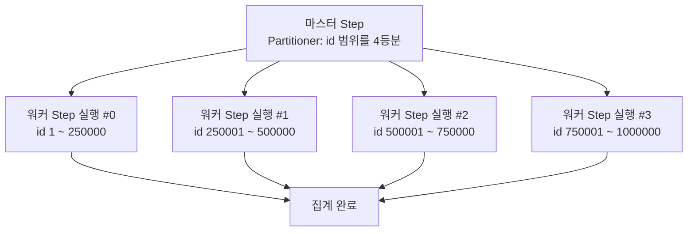
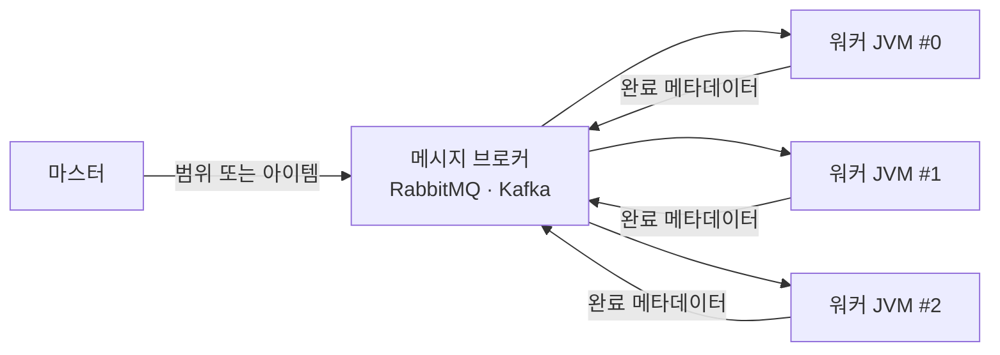

## 서론

[4편](/blog/spring-batch-6-guide-4)까지 잡을 짜고, 실패를 다루고, 안전하게 돌리는 법을 봤다. 그런데 다 좋은데 — <strong>느리다.</strong> 어제치 주문 100만 건을 단일 스레드로 한 건씩 읽어 가공하고 쓰면, 새벽 집계가 출근 시간까지 안 끝난다.

5편은 같은 잡을 더 빨리 돌리는 네 가지 무기를 본다. 한 줄 설정으로 스레드를 늘리는 <strong>멀티 스레드 Step</strong>, 데이터를 범위로 쪼개 병렬로 도는 <strong>파티셔닝</strong>, 워커를 다른 프로세스로 분리하는 <strong>원격 파티셔닝/청킹</strong>, 그리고 JDK 21의 <strong>가상 스레드</strong>. 각각 얻는 것과 잃는 것(특히 재시작과 동시성 안전)이 다르므로, 마지막에 100만 건 기준으로 나란히 비교한다.

> <strong>용어</strong>: <strong>처리량(throughput)</strong>은 단위 시간당 처리하는 아이템 수다(예: 초당 1만 건). <strong>IO-bound</strong>는 CPU 계산보다 DB·네트워크 응답을 기다리는 시간이 지배적인 작업, <strong>CPU-bound</strong>는 계산이 지배적인 작업이다. 병렬화는 보통 IO-bound에서 이득이 크다.

대상 독자는 1~4편으로 잡을 만들어 본 백엔드 엔지니어다. 스레드·동시성 기본 개념을 가정한다.

- 1편 — Job · Step · 메타데이터의 정체
- 2편 — 청크 지향 처리 — Reader · Processor · Writer
- 3편 — 트랜잭션 · 실패 처리 — Skip · Retry · 재시작
- 4편 — 잡 실행 · 스케줄링 · 운영
- <strong>5편 — 성능 · 병렬화 — 멀티 스레드 · 파티셔닝 · 원격 워커 (이 글)</strong>
- [6편 — 관측성 · 테스트 · 배포](/blog/spring-batch-6-guide-6)
- 종합 — 마켓플레이스 분석 파이프라인 (예정)

---

## TL;DR

- <strong>멀티 스레드 Step은 가장 쉬운 가속, 대신 재시작을 잃는다</strong> — `TaskExecutor`만 꽂으면 청크가 병렬로 돈다. 단 Reader·Writer가 동시성 안전해야 하고, 읽기 순서가 비결정적이라 `saveState`를 끄게 돼 재시작이 깨진다.
- <strong>파티셔닝은 데이터를 범위로 쪼갠다</strong> — key range(예: id 0~20만, 20만~40만…)로 나눠 각 파티션이 <strong>독립 StepExecution</strong>으로 돈다. 파티션별 메타데이터가 남아 재시작이 보존된다.
- <strong>원격 파티셔닝/청킹은 워커를 다른 프로세스로</strong> — 메시지 브로커로 일을 워커 JVM에 분산한다. 파티셔닝은 "범위만" 보내고 워커가 직접 읽고, 청킹은 마스터가 읽어 "아이템을" 보낸다.
- <strong>가상 스레드(JDK 21)는 IO-bound 잡의 무기</strong> — 수천 개를 띄워도 가벼워 대기 많은 잡의 처리량을 올린다. 단 CPU-bound엔 효과 없고, 진짜 병목이 DB 커넥션 풀로 옮겨갈 뿐일 수 있다.
- <strong>섣불리 원격으로 가지 말 것</strong> — 단일 → 멀티 스레드 → 파티셔닝 → 원격 순으로 올린다. 대부분의 잡은 파티셔닝 선에서 충분하다.

---

## 1. 단일 vs 멀티 스레드 Step

### 1.1 기본은 단일 스레드

2편에서 본 청크 Step은 기본적으로 <strong>한 스레드</strong>가 청크를 하나씩 순차로 처리한다. 안전하고 재시작도 깔끔하지만, 한 번에 한 청크라 느리다.

### 1.2 TaskExecutor 한 줄로 병렬화

<strong>`TaskExecutor`는 스레드 풀을 추상화한 인터페이스</strong>다. Step에 꽂으면 여러 청크가 풀의 스레드들에서 동시에 처리된다.

```kotlin
import org.springframework.batch.core.Step
import org.springframework.batch.core.repository.JobRepository
import org.springframework.batch.core.step.builder.StepBuilder
import org.springframework.context.annotation.Bean
import org.springframework.scheduling.concurrent.ThreadPoolTaskExecutor
import org.springframework.transaction.PlatformTransactionManager

@Bean
fun batchTaskExecutor(): ThreadPoolTaskExecutor =
    ThreadPoolTaskExecutor().apply {
        corePoolSize = 4
        maxPoolSize = 4
        setThreadNamePrefix("batch-")
        initialize()
    }

@Bean
fun aggregateStep(
    jobRepository: JobRepository,
    txManager: PlatformTransactionManager,
    orderReader: org.springframework.batch.item.ItemReader<Order>,
    salesProcessor: org.springframework.batch.item.ItemProcessor<Order, DailySalesLine>,
    salesWriter: org.springframework.batch.item.ItemWriter<DailySalesLine>,
    batchTaskExecutor: ThreadPoolTaskExecutor,
): Step =
    StepBuilder("aggregateStep", jobRepository)
        .chunk<Order, DailySalesLine>(1000, txManager)
        .reader(orderReader)
        .processor(salesProcessor)
        .writer(salesWriter)
        .taskExecutor(batchTaskExecutor)   // 이 한 줄로 청크가 병렬 처리
        .build()
```

### 1.3 공짜가 아니다 — 세 가지 함정

쉬운 만큼 대가가 있다.

- <strong>Reader가 동시성 안전해야 한다</strong> — `JdbcCursorItemReader`는 스레드 안전하지 않다. 페이징 Reader(`JpaPagingItemReader`·`JdbcPagingItemReader`)를 쓰되, 동시 접근에서 같은 페이지를 두 번 읽지 않도록 주의한다.
- <strong>재시작이 깨진다</strong> — 여러 스레드가 동시에 읽으면 "어디까지 읽었는지"를 한 값으로 저장할 수 없다. 그래서 `saveState(false)`로 두게 되고, 3편 4절의 재시작 보존을 포기하게 된다.
- <strong>순서가 보장되지 않는다</strong> — 처리 순서에 의존하는 로직(누적 합 등)은 멀티 스레드 Step에서 깨진다.

> <strong>주의</strong>: 멀티 스레드 Step은 "한 잡을 빨리"이지 "중복 실행 방지"가 아니다. 여러 인스턴스에서 같은 잡이 도는 문제는 4편 7절의 별개 주제다.

---

## 2. 파티셔닝 Step

### 2.1 데이터를 범위로 쪼갠다

파티셔닝은 멀티 스레드 Step의 재시작 문제를 해결한다. <strong>마스터 Step이 데이터를 범위(partition)로 나누고, 각 범위를 같은 워커 Step의 독립 실행으로 돌린다.</strong> 예를 들어 주문 id를 4구간으로 쪼개면 워커 Step이 4번 실행되고, 각 실행은 자기 구간만 읽는다.

핵심 이점은 <strong>각 파티션이 독립된 StepExecution</strong>이라는 점이다. 파티션마다 메타데이터·ExecutionContext가 따로 남아, 3편의 재시작이 파티션 단위로 보존된다 — 멀티 스레드 Step이 포기했던 그 재시작이다.



### 2.2 Partitioner — 범위를 나누는 코드

<strong>`Partitioner`는 전체 작업을 gridSize개의 파티션으로 나누는 인터페이스</strong>다. 각 파티션의 범위를 `ExecutionContext`에 담아 돌려준다.

```kotlin
import org.springframework.batch.core.partition.support.Partitioner
import org.springframework.batch.item.ExecutionContext

class ColumnRangePartitioner(
    private val minId: Long,
    private val maxId: Long,
) : Partitioner {
    override fun partition(gridSize: Int): Map<String, ExecutionContext> {
        val targetSize = (maxId - minId) / gridSize + 1
        val result = mutableMapOf<String, ExecutionContext>()
        var start = minId
        var partition = 0
        while (start <= maxId) {
            val end = minOf(start + targetSize - 1, maxId)
            result["partition$partition"] = ExecutionContext().apply {
                putLong("minId", start)
                putLong("maxId", end)
            }
            start += targetSize
            partition++
        }
        return result
    }
}
```

워커 Step의 Reader는 `@StepScope`로 두고 `#{stepExecutionContext['minId']}`로 자기 범위를 주입받는다(2편 2.3절의 late binding 그대로, JobParameters 대신 stepExecutionContext에서).

### 2.3 마스터 Step 조립

```kotlin
@Bean
fun masterStep(
    jobRepository: JobRepository,
    workerStep: Step,
    batchTaskExecutor: ThreadPoolTaskExecutor,
): Step =
    StepBuilder("masterStep", jobRepository)
        .partitioner(workerStep.name, ColumnRangePartitioner(1, 1_000_000))
        .step(workerStep)
        .gridSize(4)                       // 파티션 4개
        .taskExecutor(batchTaskExecutor)   // 로컬: 스레드로 병렬 실행
        .build()
```

`gridSize`는 파티션 개수다. 로컬 파티셔닝은 `TaskExecutor`로 파티션들을 스레드에 분배해 한 JVM 안에서 병렬 실행한다.

---

## 3. 원격 파티셔닝 / 원격 청킹

한 JVM의 스레드로 부족하면 일을 <strong>다른 프로세스(워커 JVM)</strong>로 분산한다. 메시지 브로커(RabbitMQ·Kafka)와 Spring Integration 채널이 마스터와 워커를 잇는다. 여기서 두 방식이 갈린다.

### 3.1 둘의 차이 — 무엇을 네트워크로 보내나

| 구분 | 원격 파티셔닝 | 원격 청킹 |
|------|---------------|-----------|
| 마스터가 보내는 것 | 파티션 <strong>범위</strong>(minId/maxId, 작음) | 실제 <strong>아이템</strong>(청크 데이터, 큼) |
| 읽기(Read) | 워커가 각자 직접 | 마스터가 전담 |
| 가공·쓰기 | 워커 | 워커 |
| 네트워크 부하 | 낮음(메타데이터만) | 높음(전체 데이터가 오감) |
| 적합 | 읽기까지 분산하고 싶을 때 | 읽기는 가벼운데 <strong>가공이 병목</strong>일 때 |



### 3.2 언제 원격까지 가나

원격은 메시지 브로커와 Spring Integration 설정이라는 <strong>인프라·운영 비용</strong>을 동반한다. 그래서 한 JVM의 멀티 스레드·로컬 파티셔닝으로 처리량이 안 나올 때, 즉 <strong>수천만~억 건 규모</strong>에서야 값을 한다. 대부분의 사내 배치는 로컬 파티셔닝 선에서 끝난다 — 원격은 "정말 필요할 때만".

---

## 4. 가상 스레드 (Spring Batch 6 + JDK 21)

### 4.1 가상 스레드란

<strong>가상 스레드(virtual thread)는 JDK 21이 정식 도입한 경량 스레드</strong>다. OS 스레드 하나에 수천 개의 가상 스레드를 얹을 수 있어, 대기가 많은 작업을 값싸게 동시에 굴린다. Spring Batch 6은 가상 스레드 기반 `TaskExecutor`를 멀티 스레드 Step·파티셔닝에 그대로 쓸 수 있게 지원한다.

```kotlin
import org.springframework.core.task.SimpleAsyncTaskExecutor

@Bean
fun virtualThreadExecutor(): SimpleAsyncTaskExecutor =
    SimpleAsyncTaskExecutor("batch-vt-").apply {
        setVirtualThreads(true)   // JDK 21 가상 스레드 사용
    }
```

### 4.2 IO-bound에서만 빛난다

가상 스레드의 이득은 <strong>대기 시간을 겹쳐서</strong> 나온다. 외부 API 호출, DB 응답 대기처럼 IO-bound 잡이라야 효과가 크다. 계산이 지배적인 CPU-bound 잡은 가상 스레드를 아무리 늘려도 코어 수가 천장이라 빨라지지 않는다.

> <strong>주의</strong>: 가상 스레드를 수천 개 띄워도 DB 커넥션 풀이 20개면, 실제로 동시에 DB에 붙는 건 20개뿐이다. 병목이 스레드에서 <strong>커넥션 풀로 옮겨갈 뿐</strong>일 수 있다. 가상 스레드를 켤 땐 커넥션 풀·DB 부하를 함께 키울지 반드시 같이 본다.

---

## 5. 벤치마크 — 100만 건 시나리오

네 방식을 100만 건 집계 기준으로 나란히 두면 다음과 같다. 숫자는 <strong>환경마다 크게 달라지는 대략적 상대 비교</strong>이지 절대치가 아니다.

| 방식 | 상대 처리 시간 | 동시성 단위 | 재시작 | 인프라 | 적합 |
|------|----------------|-------------|--------|--------|------|
| 단일 스레드 | 1.0× (기준) | 1 | ✅ 보존 | 없음 | 소량·순서 의존 |
| 멀티 스레드 Step | 약 0.3~0.4× | 스레드 풀 | ❌ 포기 | 없음 | 중간 규모·재시작 불필요 |
| 로컬 파티셔닝 | 약 0.25~0.35× | 파티션×스레드 | ✅ 파티션 단위 | 없음 | 대부분의 대량 잡 |
| 원격 파티셔닝 | 워커 수에 비례 | 워커 JVM | ✅ 파티션 단위 | 브로커+워커 | 초대량·수평 확장 |

읽는 법은 단순하다. <strong>재시작이 필요하면 멀티 스레드 Step을 건너뛰고 파티셔닝</strong>으로 간다. 로컬 파티셔닝이 한 JVM 한계에 부딪힐 때만 원격을 검토한다. 가상 스레드는 위 방식들의 `TaskExecutor`를 교체하는 옵션이지 별도 방식이 아니다 — IO-bound면 얹어 본다.

---

## 정리

5편의 핵심 takeaway를 한 줄씩 정리하면 다음과 같다.

- <strong>멀티 스레드 Step은 가장 쉬운 가속이지만 재시작을 잃는다</strong> — `TaskExecutor` 한 줄로 병렬화되나 Reader 동시성·순서·재시작을 포기한다.
- <strong>파티셔닝은 범위로 쪼개 재시작을 지킨다</strong> — 각 파티션이 독립 StepExecution이라 메타데이터가 파티션 단위로 남는다. 대량 잡의 기본 선택.
- <strong>원격은 워커를 다른 프로세스로 분산한다</strong> — 파티셔닝은 범위만, 청킹은 아이템을 보낸다. 인프라 비용이 커서 초대량에서만.
- <strong>가상 스레드는 IO-bound 잡의 옵션</strong> — `TaskExecutor`만 교체하면 되지만, CPU-bound엔 무효이고 병목이 커넥션 풀로 옮겨갈 수 있다.
- <strong>단계적으로 올린다</strong> — 단일 → 멀티 스레드 → 파티셔닝 → 원격. 섣불리 원격으로 가지 않는다.

다음 편은 <strong>관측성 · 테스트 · 배포</strong>다. 잡을 만들고(2~3편), 돌리고(4편), 빠르게 만들었으니(5편), 이제 "정말 잘 돌고 있나, 회귀가 잡히나, 안전하게 배포되나"를 마무리한다. Micrometer 메트릭과 MDC, `@SpringBatchTest`와 Testcontainers, Docker·K8s CronJob까지 — 시리즈의 운영 마지막 조각이다.

---

## 부록

### A. 워커 Step의 @StepScope Reader

<details>
<summary><strong>펼치기 — stepExecutionContext에서 범위를 주입받는 워커 Reader</strong></summary>

파티셔닝의 워커 Reader는 `@StepScope`로 두고, Partitioner가 넣어 둔 `minId`·`maxId`를 late binding으로 받는다(2편 2.3절의 `@StepScope` 개념 그대로, JobParameters 대신 stepExecutionContext).

```kotlin
import org.springframework.batch.item.database.JdbcPagingItemReader
import org.springframework.batch.item.database.builder.JdbcPagingItemReaderBuilder
import org.springframework.beans.factory.annotation.Value
import javax.sql.DataSource

@Bean
@org.springframework.batch.core.configuration.annotation.StepScope
fun workerOrderReader(
    dataSource: DataSource,
    @Value("#{stepExecutionContext['minId']}") minId: Long,
    @Value("#{stepExecutionContext['maxId']}") maxId: Long,
): JdbcPagingItemReader<OrderRow> {
    // WHERE id BETWEEN :minId AND :maxId 로 자기 파티션 범위만 읽는다
    // (queryProvider 설정은 2편 2.4절 패턴과 동일)
    return JdbcPagingItemReaderBuilder<OrderRow>()
        .name("workerOrderReader")
        .dataSource(dataSource)
        .pageSize(1000)
        // .queryProvider(...)  // sortKeys=id, whereClause="id BETWEEN :minId AND :maxId"
        .parameterValues(mapOf("minId" to minId, "maxId" to maxId))
        .build()
}
```

</details>

### B. 가상 스레드 vs 플랫폼 스레드

<details>
<summary><strong>펼치기 — 언제 무엇을 쓰나</strong></summary>

| 구분 | 플랫폼 스레드(ThreadPoolTaskExecutor) | 가상 스레드(SimpleAsyncTaskExecutor + virtual) |
|------|----------------------------------------|------------------------------------------------|
| 개수 | 수십~수백(OS 스레드 1:1) | 수천~수만(경량) |
| 강점 | CPU-bound·예측 가능한 풀 크기 | IO-bound·대량 동시 대기 |
| 약점 | 대량 동시 IO엔 풀이 부족 | CPU-bound 무효, 커넥션 풀이 진짜 천장 |
| 권장 | 가공이 CPU 집약적인 잡 | 외부 호출·IO 대기가 많은 잡 |

결론: 가상 스레드는 만능이 아니다. 잡이 무엇을 기다리는지(CPU냐 IO냐)부터 보고, IO-bound일 때 커넥션 풀과 함께 키운다.

</details>

### C. 외부 참조

- [Spring Batch — Multi-threaded Step](https://docs.spring.io/spring-batch/reference/scalability.html) — 멀티 스레드 Step·파티셔닝·원격 확장 공식 레퍼런스
- [Spring Batch — Partitioning](https://docs.spring.io/spring-batch/reference/scalability.html#partitioning) — Partitioner·PartitionHandler
- [JEP 444 — Virtual Threads](https://openjdk.org/jeps/444) — JDK 21 가상 스레드 명세
- [Spring Batch — Remote Partitioning / Remote Chunking](https://docs.spring.io/spring-batch/reference/spring-batch-integration.html) — Spring Integration 기반 원격 확장
