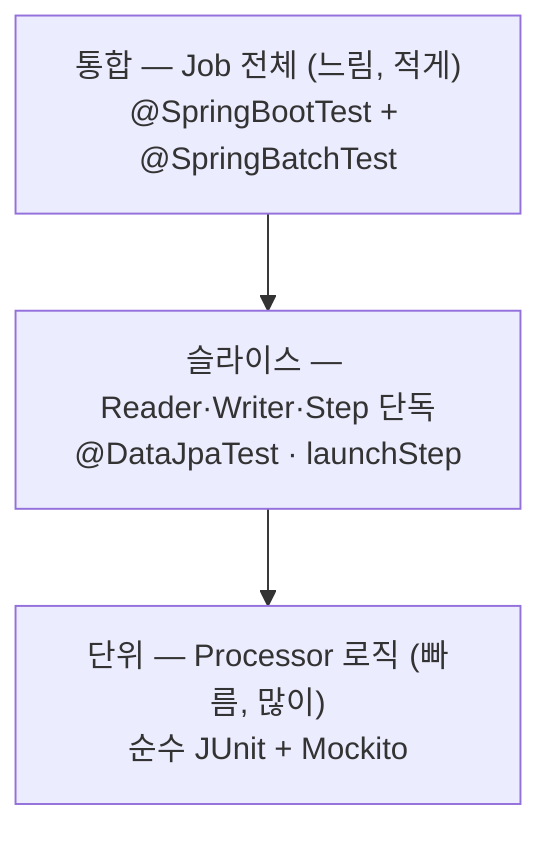
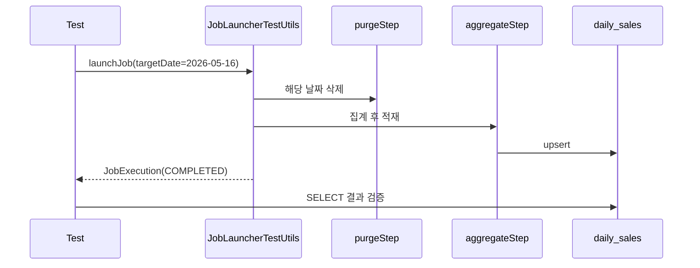

## 서론

[5편](/blog/spring-batch-6-guide-5)까지 잡을 만들고(2~3편), 돌리고(4편), 빠르게도 만들었다(5편). 이제 마지막 질문이 남는다 — <strong>정말 잘 돌고 있는지 어떻게 아나? 회귀는 어떻게 잡나? 안전하게 배포는 어떻게 하나?</strong>

6편은 운영의 마지막 세 조각을 본다 — 관측성·테스트·배포. 잡 상태를 숫자로 보는 <strong>관측성</strong>은 Micrometer 메트릭과 MDC 로그다. 회귀를 막는 <strong>테스트</strong>는 피라미드·대역 기초부터 `@SpringBatchTest`·Testcontainers 특화까지다. 컨테이너로 묶어 스케줄에 올리는 <strong>배포</strong>는 Java 21 멀티 스테이지와 K8s CronJob이다.

테스트 기초(피라미드·어노테이션·대역)는 일반적인 Spring 테스트와 겹치지만, 이 시리즈만 봐도 끝낼 수 있도록 <strong>배치 컨텍스트 예시로 자체완결</strong>로 다시 푼다. 이미 익숙하면 3절은 건너뛰고 4절(배치 특화)부터 봐도 된다.

대상 독자는 1~5편으로 잡을 만들어 돌려 본 백엔드 엔지니어다. JUnit·테스트 기본기를 가정한다.

- 1편 — Job · Step · 메타데이터의 정체
- 2편 — 청크 지향 처리 — Reader · Processor · Writer
- 3편 — 트랜잭션 · 실패 처리 — Skip · Retry · 재시작
- 4편 — 잡 실행 · 스케줄링 · 운영
- 5편 — 성능 · 병렬화 — 멀티 스레드 · 파티셔닝 · 원격 워커
- <strong>6편 — 관측성 · 테스트 · 배포 (이 글)</strong>
- 종합 — 마켓플레이스 분석 파이프라인 (예정)

---

## TL;DR

- <strong>Micrometer 메트릭 6종이 자동 등록된다</strong> — `spring.batch.job` · `job.active` · `step` · `item.read` · `item.process` · `chunk.write`. `/actuator/prometheus`로 노출해 Grafana에서 처리량·실패율·소요시간을 본다.
- <strong>MDC로 모든 로그에 잡 좌표를 박는다</strong> — `jobName` · `jobExecutionId` · `stepName` · `chunkIndex`를 MDC에 넣으면, 3편의 실패 로그가 "어느 잡 · 어느 실행 · 어느 청크"인지 즉시 추적된다.
- <strong>테스트는 자체완결</strong> — 피라미드(단위·슬라이스·통합), 어노테이션 4종(`@ExtendWith(MockitoExtension)`·`@DataJpaTest`·`@SpringBatchTest`·`@SpringBootTest`), 대역 5종(Dummy·Stub·Spy·Mock·Fake)을 배치 예시로 정리한다.
- <strong>`@SpringBatchTest`가 배치 테스트 도구를 주입한다</strong> — `JobLauncherTestUtils`로 Step 슬라이스·Job 통합·재시작을 검증하고, `StepScopeTestExecutionListener`가 `@StepScope` 빈을 실제 잡 없이 풀어 준다(2편 2.3절).
- <strong>H2 말고 Testcontainers PostgreSQL 16</strong> — window 함수·CTE·`ON CONFLICT` upsert는 H2가 흉내 못 낸다. 실제 PostgreSQL 컨테이너로 테스트해야 운영과 같은 쿼리를 검증한다.
- <strong>Java 21 멀티 스테이지 + K8s CronJob</strong> — 빌드/런타임 스테이지를 분리한 Dockerfile, `concurrencyPolicy: Forbid` · `backoffLimit` · `activeDeadlineSeconds`로 단일 실행·실패 처리를 선언한다.

---

## 1. Micrometer 메트릭과 Prometheus 노출

### 1.1 자동 등록되는 6 메트릭

<strong>Micrometer는 메트릭 수집 표준 파사드</strong>(SLF4J가 로깅에 하는 역할을 메트릭에 하는 것)다. Spring Batch 6은 잡이 돌 때 다음 메트릭을 자동으로 등록한다.

| 메트릭 | 타입 | 의미 |
|--------|------|------|
| `spring.batch.job` | timer | 잡 1회 실행 소요 시간 (`status` 태그로 성공/실패 구분) |
| `spring.batch.job.active` | gauge | 현재 실행 중인 잡 수 |
| `spring.batch.step` | timer | Step 소요 시간 |
| `spring.batch.item.read` | timer | 아이템 1건 읽기 시간 |
| `spring.batch.item.process` | timer | 아이템 1건 가공 시간 |
| `spring.batch.chunk.write` | timer | 청크 1개 쓰기 시간 |

> <strong>참고</strong>: 쓰기는 아이템이 아니라 <strong>청크 단위</strong>로 측정된다(`chunk.write`). 2편에서 Writer가 청크를 한 번에 받는다고 한 것과 일치한다 — 그래서 `item.write`가 아니라 `chunk.write`다.

### 1.2 Prometheus로 노출

`micrometer-registry-prometheus` 의존성을 더하고 엔드포인트를 열면, 메트릭이 Prometheus 포맷으로 노출된다.

```yaml
management:
  endpoints:
    web:
      exposure:
        include: health, prometheus   # /actuator/prometheus 열기
  metrics:
    tags:
      application: daily-sales-batch  # 모든 메트릭에 공통 태그
```

### 1.3 무엇을 보나

대시보드(Grafana)에서 세 가지를 본다 — <strong>처리량</strong>(`item.read`/`chunk.write` rate), <strong>실패율</strong>(`spring.batch.job`의 `status="FAILED"` 비율), <strong>소요 시간</strong>(`spring.batch.job` timer의 p95). 잡이 평소보다 느려지거나 실패율이 튀면 여기서 가장 먼저 잡힌다.

---

## 2. 구조화 로그 + MDC

### 2.1 MDC란

<strong>MDC(Mapped Diagnostic Context)는 SLF4J가 제공하는 스레드 로컬 key-value 저장소</strong>다. MDC에 값을 넣으면, 그 스레드가 찍는 <strong>모든 로그 줄에 그 값이 자동으로 붙는다.</strong> 배치에서 이게 결정적이다 — 로그 한 줄만 봐도 "어느 잡의 어느 실행, 어느 Step, 어느 청크"인지 알 수 있어야 3편의 실패를 추적할 수 있다.

### 2.2 배치 MDC 키 4종

Listener에서 잡 좌표를 MDC에 넣는다. Step 시작 시 `jobName`·`jobExecutionId`·`stepName`을, 청크마다 `chunkIndex`를.

```kotlin
import org.slf4j.MDC
import org.springframework.batch.core.StepExecution
import org.springframework.batch.core.annotation.BeforeStep
import org.springframework.batch.core.annotation.AfterStep
import org.springframework.stereotype.Component

@Component
class MdcStepListener {
    @BeforeStep
    fun beforeStep(stepExecution: StepExecution) {
        MDC.put("jobName", stepExecution.jobExecution.jobInstance.jobName)
        MDC.put("jobExecutionId", stepExecution.jobExecutionId.toString())
        MDC.put("stepName", stepExecution.stepName)
    }

    @AfterStep
    fun afterStep(stepExecution: StepExecution) {
        listOf("jobName", "jobExecutionId", "stepName").forEach(MDC::remove)
    }
}
```

로그 패턴에 `%X{jobName}`·`%X{stepName}`를 넣으면 모든 줄에 좌표가 박힌다. JSON 구조화 로그로 내보내면 로그 수집기(Loki·ELK)에서 잡 단위로 필터링·집계할 수 있다.

### 2.3 3편 디버깅과 연결

3편에서 Skip된 아이템을 `SkipListener`로 기록했는데, 그 로그에 MDC 좌표가 붙어 있으면 "어느 잡 실행의 몇 번째 청크에서 빠졌는지"가 한눈에 보인다. 관측성은 별도 기능이 아니라 앞 편들의 실패 처리를 <strong>읽을 수 있게</strong> 만드는 층이다.

---

## 3. 테스트 기초 — 피라미드 · 어노테이션 · 대역

> <strong>참고</strong>: 이 절(피라미드·어노테이션·대역)은 일반 Spring 테스트와 겹친다. 이 시리즈만으로 완결되도록 배치 예시로 다시 풀되, 이미 익숙하면 4절부터 봐도 된다.

### 3.1 테스트 피라미드



피라미드의 뜻은 단순하다 — <strong>빠르고 좁은 단위 테스트는 많이, 느리고 넓은 통합 테스트는 적게.</strong> 배치에서는 Processor의 변환·필터 로직을 순수 단위로 촘촘히 깔고, Reader/Writer는 슬라이스로, Job 전체는 핵심 시나리오만 통합으로 검증한다.

### 3.2 어노테이션 4종

<strong>슬라이스 테스트는 필요한 Spring 빈만 부분 로딩</strong>해 빠르게 도는 테스트다. 배치에서 쓰는 네 가지를 정리하면 다음과 같다.

| 어노테이션 | 로딩 범위 | 용도 |
|-----------|-----------|------|
| `@ExtendWith(MockitoExtension::class)` | Spring 컨텍스트 없음 | 순수 단위 — Processor 로직 |
| `@DataJpaTest` | JPA 슬라이스 | Repository · 엔티티 매핑 검증 |
| `@SpringBatchTest` | 배치 테스트 유틸 주입 | `JobLauncherTestUtils` 등 (4절) |
| `@SpringBootTest` | 전체 컨텍스트 | Job 전체 통합 |

### 3.3 테스트 대역 5종

<strong>테스트 대역(test double)은 실제 협력 객체 대신 끼우는 가짜</strong>다. 다섯 종류를 배치 예시로 보면 다음과 같다.

| 대역 | 정의 | 배치 예시 |
|------|------|-----------|
| Dummy | 전달되지만 쓰이지 않음 | 호출 시그니처를 채우는 빈 인자 |
| Stub | 정해진 답만 반환 | 항상 고정 환율을 주는 가짜 환율 조회 |
| Spy | 호출을 기록 | Writer가 몇 번 불렸는지 세는 가짜 |
| Mock | 상호작용을 검증 | 알림 서비스가 호출됐는지 verify |
| Fake | 가볍지만 동작하는 진짜 구현 | `ListItemReader`(인메모리 Reader) |

배치에서 가장 자주 쓰는 건 <strong>Fake Reader</strong>다. `ListItemReader`에 입력 몇 건을 담아 Processor·Writer만 떼어 검증하면, DB 없이도 청크 로직을 빠르게 돌릴 수 있다.

---

## 4. Spring Batch 특화 테스트

### 4.1 @SpringBatchTest 셋업

`@SpringBatchTest`를 붙이면 `JobLauncherTestUtils`·`JobRepositoryTestUtils`와 Scope용 TestExecutionListener가 자동 주입된다. 잡을 코드로 띄우고 결과를 단언한다.

```kotlin
import org.springframework.batch.core.BatchStatus
import org.springframework.batch.core.JobParametersBuilder
import org.springframework.batch.test.JobLauncherTestUtils
import org.springframework.batch.test.JobRepositoryTestUtils
import org.springframework.batch.test.context.SpringBatchTest
import org.springframework.beans.factory.annotation.Autowired
import org.springframework.boot.test.context.SpringBootTest
import org.junit.jupiter.api.AfterEach
import org.junit.jupiter.api.Test
import org.assertj.core.api.Assertions.assertThat
import java.time.LocalDate

@SpringBatchTest
@SpringBootTest
class DailySalesJobTest {

    @Autowired lateinit var jobLauncherTestUtils: JobLauncherTestUtils
    @Autowired lateinit var jobRepositoryTestUtils: JobRepositoryTestUtils

    @AfterEach
    fun cleanUp() = jobRepositoryTestUtils.removeJobExecutions()  // 메타데이터 청소 (부록 A)

    @Test
    fun `일별 집계 잡이 정상 완료된다`() {
        val params = JobParametersBuilder()
            .addLocalDate("targetDate", LocalDate.of(2026, 5, 16))
            .toJobParameters()

        val execution = jobLauncherTestUtils.launchJob(params)

        assertThat(execution.status).isEqualTo(BatchStatus.COMPLETED)
    }
}
```

### 4.2 Reader · Processor · Writer 슬라이스

Step 하나만 떼어 돌리려면 `launchStep("스텝 이름")`을 쓴다. `@StepScope` Reader처럼 실제 Step 실행이 있어야 풀리는 빈은 `StepScopeTestExecutionListener`(`@SpringBatchTest`가 자동 등록)가 가짜 StepExecution 컨텍스트를 깔아 줘서 단독 검증이 가능해진다 — 2편 2.3절에서 본 `@StepScope`·late binding이 테스트에서 풀리는 원리다.

```kotlin
@Test
fun `aggregateStep이 입력을 모두 집계한다`() {
    val params = JobParametersBuilder()
        .addLocalDate("targetDate", LocalDate.of(2026, 5, 16))
        .toJobParameters()

    val stepExecution = jobLauncherTestUtils.launchStep("aggregateStep", params)

    assertThat(stepExecution.status).isEqualTo(BatchStatus.COMPLETED)
    assertThat(stepExecution.writeCount).isGreaterThan(0)
}
```

### 4.3 Job 전체 통합 테스트

여러 Step을 엮은 잡은 `launchJob`으로 끝까지 돌리고 최종 상태와 적재 결과를 함께 단언한다.



### 4.4 재시작 시나리오 테스트

3편의 재시작이 실제로 동작하는지도 테스트로 못박을 수 있다. 일부러 실패시킨 뒤 같은 파라미터로 다시 띄워, 두 번째 실행이 <strong>이어서</strong> 완료되는지 검증한다.

- 1차 실행 → 중간 실패 유도 → `JobExecution`이 `FAILED`, `StepExecution`에 `read.count` 저장 확인
- 같은 `targetDate`로 2차 실행 → 저장된 지점부터 재개 → `COMPLETED` 확인
- 최종 적재 행 수가 "한 번 다 돈 것"과 같은지(중복 적재 없음) 단언

이 테스트가 통과하면 3편의 ExecutionContext·멱등 설계가 코드로 보장된다.

---

## 5. Testcontainers로 PostgreSQL 16 통합 테스트

### 5.1 왜 H2가 아니라 Testcontainers인가

흔히 통합 테스트를 인메모리 H2로 돌린다. 빠르지만 배치에선 위험하다. <strong>운영에서 쓰는 PostgreSQL 쿼리를 H2가 흉내 내지 못하기 때문</strong>이다.

- <strong>window 함수</strong> — `ROW_NUMBER() OVER (...)` 같은 분석 쿼리.
- <strong>CTE</strong>(Common Table Expression, `WITH ... AS (...)` 임시 결과 집합) — 복잡한 집계의 가독성.
- <strong>`INSERT ... ON CONFLICT` upsert</strong> — 3편 5절의 멱등 Writer가 의존하는 바로 그 문법.

H2로 통과한 테스트가 운영 PostgreSQL에서 깨지는 건 흔한 사고다. <strong>Testcontainers는 테스트 중에 실제 DB·서비스를 도커 컨테이너로 띄워 주는 라이브러리</strong>다. 진짜 PostgreSQL 16을 띄워 검증하면 이 격차가 사라진다.

### 5.2 셋업 — @ServiceConnection

Spring Boot 4의 `@ServiceConnection`을 쓰면, 컨테이너가 뜬 주소·계정을 datasource에 자동으로 연결한다. 수동 프로퍼티 설정이 사라진다.

```kotlin
import org.springframework.boot.testcontainers.service.connection.ServiceConnection
import org.springframework.boot.test.context.SpringBootTest
import org.testcontainers.containers.PostgreSQLContainer
import org.testcontainers.junit.jupiter.Container
import org.testcontainers.junit.jupiter.Testcontainers

@Testcontainers
@SpringBootTest
@SpringBatchTest
class DailySalesJobIntegrationTest {

    companion object {
        @Container
        @ServiceConnection
        @JvmStatic
        val postgres = PostgreSQLContainer("postgres:16")
    }

    // ... 4절의 launchJob 테스트가 실제 PostgreSQL 16에서 돈다
}
```

### 5.3 메타데이터 테이블 격리

배치는 `BATCH_*` 메타데이터 6 테이블(1편 3절)도 DB에 필요하다. 컨테이너에 이 스키마를 자동 생성하려면 테스트 프로파일에서 `spring.batch.jdbc.initialize-schema=always`를 둔다. 컨테이너는 테스트가 끝나면 통째로 사라지므로, 매 실행이 깨끗한 메타데이터에서 시작한다.

---

## 6. Docker 멀티 스테이지 + K8s CronJob

### 6.1 Java 21 멀티 스테이지 Dockerfile

<strong>멀티 스테이지 빌드는 빌드 도구가 든 무거운 이미지에서 jar를 만들고, 실행은 가벼운 런타임 이미지에만 jar를 복사</strong>하는 패턴이다. 최종 이미지에 Gradle·소스가 안 들어가 작고 안전하다.

```dockerfile
# 1) 빌드 스테이지 — Gradle + JDK 21
FROM gradle:8.10-jdk21 AS build
WORKDIR /app
COPY . .
RUN gradle bootJar --no-daemon

# 2) 런타임 스테이지 — JRE만
FROM eclipse-temurin:21-jre-alpine
WORKDIR /app
COPY --from=build /app/build/libs/*.jar app.jar
ENTRYPOINT ["java", "-jar", "app.jar"]
```

### 6.2 K8s CronJob YAML

4편 7절에서 CronJob이 클러스터 차원의 단일 실행을 보장한다고 했다. 실패 처리·이력 보관까지 YAML로 선언한다.

```yaml
apiVersion: batch/v1
kind: CronJob
metadata:
  name: daily-sales
spec:
  schedule: "0 1 * * *"          # 매일 01:00
  concurrencyPolicy: Forbid       # 이전 실행이 안 끝났으면 다음 건 스킵 (단일 실행)
  successfulJobsHistoryLimit: 3   # 성공 이력 3개만 보관
  failedJobsHistoryLimit: 3       # 실패 이력 3개 보관 (사후 진단용)
  jobTemplate:
    spec:
      backoffLimit: 2             # 실패 시 최대 2회 재시도
      activeDeadlineSeconds: 3600 # 1시간 넘으면 강제 종료 (무한 실행 방지)
      template:
        spec:
          restartPolicy: OnFailure
          containers:
            - name: daily-sales
              image: registry.example.com/daily-sales:1.0.0
              args:
                - "--spring.batch.job.name=dailySalesJob"
                # targetDate는 엔트리포인트에서 어제 날짜로 계산해 주입
```

`concurrencyPolicy: Forbid`·`activeDeadlineSeconds`·`backoffLimit`가 운영의 3대 안전장치다 — 중복 실행 방지, 무한 실행 방지, 실패 재시도. 실패 알림은 `failedJobsHistoryLimit`로 남은 실패 Job을 감시하거나, 잡 내부 `JobExecutionListener.afterJob`에서 Slack으로 보낸다(4편 5절).

---

## 정리

6편의 핵심 takeaway를 한 줄씩 정리하면 다음과 같다.

- <strong>Micrometer 6 메트릭이 자동 등록된다</strong> — `/actuator/prometheus`로 노출해 처리량·실패율·소요시간을 Grafana로 본다. 쓰기는 청크 단위(`chunk.write`).
- <strong>MDC가 로그에 잡 좌표를 박는다</strong> — `jobName`·`stepName`·`chunkIndex`로 3편의 실패 로그를 추적 가능하게 만든다.
- <strong>테스트는 피라미드대로</strong> — Processor는 단위로 촘촘히, Reader/Writer는 슬라이스로, Job은 핵심만 통합으로. Fake Reader(`ListItemReader`)가 배치 단위 테스트의 주력.
- <strong>`@SpringBatchTest` + Testcontainers가 정석</strong> — 슬라이스·통합·재시작을 `JobLauncherTestUtils`로 검증하고, window 함수·CTE·upsert는 H2가 아닌 실제 PostgreSQL 16으로 돌린다.
- <strong>멀티 스테이지 + CronJob으로 배포</strong> — 작은 런타임 이미지, `concurrencyPolicy: Forbid`·`activeDeadlineSeconds`·`backoffLimit`로 단일 실행·무한 실행 방지·재시도를 선언한다.

다음은 시리즈의 마지막, <strong>종합 capstone</strong>이다. 1~6편에서 따로 배운 조각 — 청크·트랜잭션·스케줄링·병렬화·관측성·테스트 — 을 한 프로젝트에 모은다. 마켓플레이스 주문 데이터를 운영 schema에서 분석 schema로 옮기는 ETL Job과, 그 위에서 일별·월별 KPI를 집계하는 Job을 PostgreSQL 16 한 인스턴스에 올려 K8s CronJob으로 돌리는 실전 파이프라인이다.

---

## 부록

### A. 통합 테스트 사이 메타데이터 누적 청소

<details>
<summary><strong>펼치기 — BATCH_* 테이블이 테스트 간에 쌓이는 문제와 해결</strong></summary>

`@SpringBatchTest`로 잡을 여러 번 띄우면 `BATCH_JOB_EXECUTION` 등에 실행 이력이 누적된다. 같은 `targetDate`로 다시 띄울 때 "이미 완료된 JobInstance" 충돌(3편 4.4절)이 나거나, 테스트 간 간섭이 생긴다.

`JobRepositoryTestUtils.removeJobExecutions()`를 `@AfterEach`에서 호출해 매 테스트 후 메타데이터를 비운다(4.1절 코드 참고).

```kotlin
@AfterEach
fun cleanUp() = jobRepositoryTestUtils.removeJobExecutions()
```

시드 데이터 SQL을 여러 개 합칠 때 `@SqlMergeMode(MERGE)`를 쓰면 클래스·메서드 레벨 `@Sql`이 합쳐져 중복 선언을 줄일 수 있다. Testcontainers를 쓰면 컨테이너 자체가 테스트 클래스 단위로 격리되므로 이 누적 문제는 한층 가벼워진다.

</details>

### B. 외부 참조

- [Spring Batch — Metrics](https://docs.spring.io/spring-batch/reference/monitoring-and-metrics.html) — 자동 등록 Micrometer 메트릭 목록
- [Spring Batch — Testing](https://docs.spring.io/spring-batch/reference/testing.html) — `@SpringBatchTest` · `JobLauncherTestUtils` · Scope 테스트
- [Testcontainers — PostgreSQL Module](https://testcontainers.com/modules/postgresql/) — 컨테이너 기반 통합 테스트
- [Spring Boot — @ServiceConnection](https://docs.spring.io/spring-boot/reference/testing/testcontainers.html) — 컨테이너 datasource 자동 연결
- [Kubernetes — CronJob](https://kubernetes.io/docs/concepts/workloads/controllers/cron-jobs/) — `concurrencyPolicy` · `backoffLimit` · `activeDeadlineSeconds`
