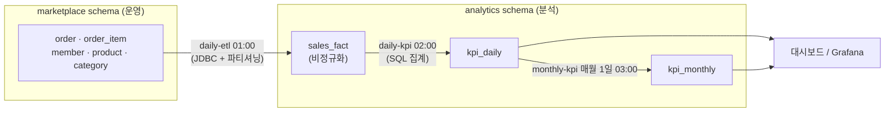
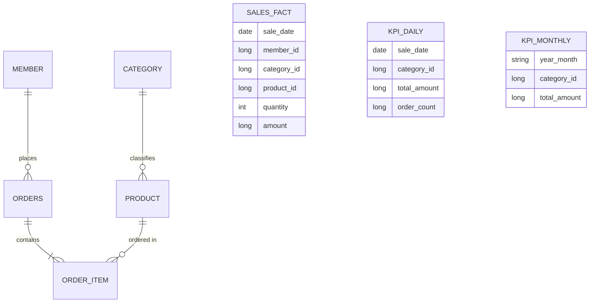
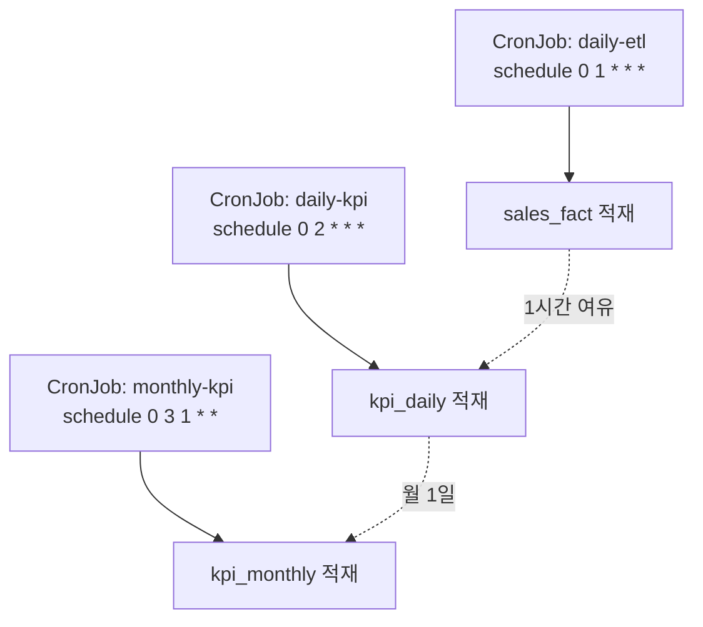

## 서론

[6편](/blog/spring-batch-6-guide-6)까지 청크·트랜잭션·스케줄링·병렬화·관측성·테스트를 따로따로 배웠다. 종합편은 그 조각들을 <strong>한 프로젝트에 모은다.</strong>

만들 것은 마켓플레이스 분석 파이프라인이다. 운영 DB에 쌓인 주문을 매일 새벽 분석용 저장소로 옮기고(ETL), 그 위에서 일별·월별 KPI(총 매출·주문 수·카테고리별 매출·인기 상품 top 10)를 집계해 대시보드가 읽을 테이블로 만든다. 세 개의 Job이 시간 차를 두고 이어 돌고, 전부 멱등하며, 관측 가능하고, K8s CronJob으로 단일 실행된다.

이 한 파이프라인 안에서 1~6편이 전부 만난다 — 2편 Reader/Writer, 3편 멱등·재시작, 4편 스케줄링·데이터 소스, 5편 파티셔닝, 6편 관측성·배포. 각 절에서 "이건 몇 편 기법"인지 표시하니, 막히면 해당 편으로 돌아가면 된다.

대상 독자는 1~6편을 읽었거나 Spring Batch 잡을 만들어 운영해 본 백엔드 엔지니어다.

- 1편 — Job · Step · 메타데이터의 정체
- 2편 — 청크 지향 처리 — Reader · Processor · Writer
- 3편 — 트랜잭션 · 실패 처리 — Skip · Retry · 재시작
- 4편 — 잡 실행 · 스케줄링 · 운영
- 5편 — 성능 · 병렬화 — 멀티 스레드 · 파티셔닝 · 원격 워커
- 6편 — 관측성 · 테스트 · 배포
- <strong>종합 — 마켓플레이스 분석 파이프라인 (이 글)</strong>

---

## TL;DR

- <strong>종합편은 1~6편을 한 파이프라인에 모은다</strong> — 청크·멱등·파티셔닝·관측성·CronJob이 한 프로젝트에서 만난다. 각 절에 출처 편을 표시한다.
- <strong>도메인 — 운영 schema → 분석 schema</strong> — 운영 `marketplace` schema의 주문을 분석 `analytics` schema로 옮긴다. 4편 6절의 <strong>D(분석 Warehouse) 패턴의 단순화 변형</strong>으로, 별도 인스턴스 대신 같은 PostgreSQL 16 인스턴스 안에서 schema만 나눈다.
- <strong>3 Job 시간차 DAG</strong> — `daily-etl`(01:00) → `daily-kpi`(02:00) → `monthly-kpi`(매월 1일 03:00). CronJob 3개를 시간 차로 단순 의존시킨다.
- <strong>두 datasource로 schema별 트랜잭션 경계 분리</strong> — `operationalDataSource`(읽기 전용)와 `analyticsDataSource`(쓰기). 같은 인스턴스를 `currentSchema`와 role로 가른다.
- <strong>기법 종합</strong> — ETL은 JDBC + 파티셔닝(5편), KPI는 SQL 집계(window 함수, 6편), 전부 멱등 upsert(3편)·관측성(6편)·CronJob 단일 실행(4편 7절).

---

## 1. 무엇을 만드나 — 아키텍처

운영 트래픽을 건드리지 않고 분석을 돌리는 가장 단순한 구조다. 주문은 운영 schema에 쌓이고, 배치가 그것을 분석 schema로 옮긴 뒤 그 위에서만 집계한다.



### 1.1 왜 단일 인스턴스 + schema 분리인가

4편 6절에서 본 데이터 소스 5 패턴 중, 이 capstone은 <strong>D(분석 Warehouse) 패턴의 단순화 변형</strong>이다. 진짜 D는 별도 분석 엔진(BigQuery·Redshift 등)을 두지만, 여기선 같은 PostgreSQL 16 인스턴스 안에서 schema만 나눈다.

- <strong>로컬 실행이 단순하다</strong> — Docker Compose로 PostgreSQL 하나만 띄우면 독자가 30분 안에 전체 파이프라인을 돌려볼 수 있다.
- <strong>schema 분리만으로 경계가 충분히 명확하다</strong> — `marketplace`와 `analytics`를 role·grant로 나눠 운영/분석 권한을 가른다.
- <strong>진화 경로가 열려 있다</strong> — 운영 부하 격리가 진짜 필요해지면 `analyticsDataSource`의 URL만 read replica나 별도 인스턴스로 바꾸면 된다. 코드는 그대로다(4편 6절의 A → C → D 진화).

---

## 2. 데이터 모델

운영 schema는 사전과제 종합 과제의 도메인을 PostgreSQL로 재현한다. 분석 schema는 집계에 최적화된 비정규화 테이블을 둔다.



- <strong>운영 `marketplace`</strong> — `member` · `product` · `category` · `orders` · `order_item`. 정규화된 트랜잭션 모델.
- <strong>분석 `analytics.sales_fact`</strong> — 주문 1건을 카테고리·상품·금액으로 펼친 <strong>비정규화 fact</strong>. ETL이 채운다.
- <strong>분석 `analytics.kpi_daily` · `kpi_monthly`</strong> — 집계 결과. 대시보드가 읽는다.

---

## 3. 두 datasource 설정

운영과 분석을 서로 다른 트랜잭션 경계로 다루기 위해 datasource를 둘로 둔다. 같은 인스턴스를 가리키되 `currentSchema`와 role이 다르다.

```yaml
app:
  datasource:
    operational:    # 운영 schema — 읽기 전용 계정
      jdbc-url: jdbc:postgresql://localhost:5432/market?currentSchema=marketplace
      username: etl_reader
      password: ${ETL_READER_PW}
    analytics:      # 분석 schema — 쓰기 계정
      jdbc-url: jdbc:postgresql://localhost:5432/market?currentSchema=analytics
      username: analytics_writer
      password: ${ANALYTICS_WRITER_PW}
```

```kotlin
import com.zaxxer.hikari.HikariDataSource
import org.springframework.boot.context.properties.ConfigurationProperties
import org.springframework.boot.jdbc.DataSourceBuilder
import org.springframework.context.annotation.Bean
import org.springframework.context.annotation.Configuration
import org.springframework.context.annotation.Primary
import javax.sql.DataSource

@Configuration
class DataSourceConfig {

    @Bean
    @Primary   // Spring Batch 메타데이터(JobRepository)는 운영 datasource에 둔다
    @ConfigurationProperties("app.datasource.operational")
    fun operationalDataSource(): DataSource =
        DataSourceBuilder.create().type(HikariDataSource::class.java).build()

    @Bean
    @ConfigurationProperties("app.datasource.analytics")
    fun analyticsDataSource(): DataSource =
        DataSourceBuilder.create().type(HikariDataSource::class.java).build()
}
```

> <strong>참고</strong>: ETL Job은 운영 datasource에서 <strong>읽고</strong> 분석 datasource에 <strong>쓴다.</strong> Reader와 Writer가 다른 datasource를 쓰므로, 한 청크의 commit 경계(2편·3편)는 쓰기 쪽인 분석 트랜잭션 매니저를 기준으로 잡는다. 메타데이터는 `@Primary`(운영)에 둬 단순화했다 — 분리가 더 필요하면 배치 전용 datasource를 따로 둘 수도 있다.

---

## 4. Job A — daily-etl (운영 → 분석 적재)

매일 01:00, 어제 주문을 `marketplace` → `analytics.sales_fact`로 옮긴다. 운영 부하를 최소화하려고 JPA를 우회한 <strong>JDBC Reader/Writer</strong>(2편 4절)를 쓰고, 대량 주문을 <strong>파티셔닝</strong>(5편)으로 병렬 처리하며, <strong>멱등 upsert</strong>(3편 5절)로 재실행을 안전하게 만든다.

### 4.1 파티셔닝 + JDBC 워커 Step

5편의 `ColumnRangePartitioner`로 어제 주문 id를 4구간으로 쪼개고, 각 워커가 자기 범위만 읽어 `sales_fact`에 upsert한다.

```kotlin
@Bean
fun etlMasterStep(
    jobRepository: JobRepository,
    etlWorkerStep: Step,
    batchTaskExecutor: ThreadPoolTaskExecutor,
): Step =
    StepBuilder("etlMasterStep", jobRepository)
        .partitioner(etlWorkerStep.name, ColumnRangePartitioner(/* 어제 주문 id 범위 */))
        .step(etlWorkerStep)
        .gridSize(4)
        .taskExecutor(batchTaskExecutor)
        .build()

@Bean
fun etlWorkerStep(
    jobRepository: JobRepository,
    analyticsTxManager: PlatformTransactionManager,   // 쓰기 = 분석 트랜잭션 경계
    orderRangeReader: JdbcPagingItemReader<OrderRow>, // @StepScope, 운영 datasource
    salesFactWriter: JdbcBatchItemWriter<SalesFactRow>, // 분석 datasource, upsert
): Step =
    StepBuilder("etlWorkerStep", jobRepository)
        .chunk<OrderRow, SalesFactRow>(1000, analyticsTxManager)
        .reader(orderRangeReader)
        .processor(orderToSalesFactProcessor())  // 주문 → 비정규화 fact 변환 (2편 3절)
        .writer(salesFactWriter)
        .faultTolerant()
        .skip(org.springframework.batch.item.validator.ValidationException::class.java)
        .skipLimit(100)                           // 더러운 주문 100건까지 허용 (3편 2절)
        .build()
```

### 4.2 멱등 Writer

`sales_fact`에 `UNIQUE (sale_date, order_item_id)`를 두고 `ON CONFLICT DO UPDATE`로 쓴다. 같은 날짜를 두 번 돌려도 행이 중복되지 않는다(3편 5.3절).

```kotlin
@Bean
fun salesFactWriter(analyticsDataSource: DataSource): JdbcBatchItemWriter<SalesFactRow> =
    JdbcBatchItemWriterBuilder<SalesFactRow>()
        .dataSource(analyticsDataSource)
        .sql(
            """
            INSERT INTO sales_fact (sale_date, order_item_id, member_id, category_id, product_id, quantity, amount)
            VALUES (:saleDate, :orderItemId, :memberId, :categoryId, :productId, :quantity, :amount)
            ON CONFLICT (sale_date, order_item_id)
            DO UPDATE SET amount = EXCLUDED.amount, quantity = EXCLUDED.quantity
            """.trimIndent(),
        )
        .beanMapped()
        .build()
```

---

## 5. Job B · C — KPI 집계

집계는 in-memory가 아니라 <strong>PostgreSQL이 직접</strong> 한다. 6편 5절에서 본 window 함수·`GROUP BY`를 Reader 쿼리에 넣어, Reader가 <strong>이미 집계된 행</strong>을 한 건씩 흘려보내면 Writer는 그대로 upsert만 한다.

### 5.1 daily-kpi — 카테고리별 일 매출

```kotlin
@Bean
@org.springframework.batch.core.configuration.annotation.StepScope
fun categoryKpiReader(
    analyticsDataSource: DataSource,
    @Value("#{jobParameters['targetDate']}") targetDate: LocalDate,
): JdbcPagingItemReader<KpiDailyRow> {
    // SELECT category_id, SUM(amount) AS total_amount, COUNT(DISTINCT ...) AS order_count
    // FROM sales_fact WHERE sale_date = :targetDate GROUP BY category_id
    // → 카테고리 1개 = 1 row, Reader가 집계된 행을 흘려보낸다
    return JdbcPagingItemReaderBuilder<KpiDailyRow>()
        .name("categoryKpiReader")
        .dataSource(analyticsDataSource)
        .pageSize(500)
        // .queryProvider(...) GROUP BY category_id
        .parameterValues(mapOf("targetDate" to targetDate))
        .build()
}
```

`kpi_daily`에 `UNIQUE (sale_date, category_id)`를 두고 upsert하면 daily-kpi도 멱등이다. "상품 인기 top 10"은 `ROW_NUMBER() OVER (ORDER BY SUM(amount) DESC)` window 함수로 뽑아 별도 KPI 테이블에 적재한다 — H2로는 안 되고 실제 PostgreSQL이라야 한다(6편 5.1절).

### 5.2 monthly-kpi — 월별 롤업

매월 1일 03:00, `kpi_daily`를 월 단위로 다시 집계해 `kpi_monthly`에 적재한다. 원천이 이미 일별로 집계돼 있으니 가볍다.

```kotlin
// SELECT to_char(sale_date, 'YYYY-MM') AS year_month, category_id, SUM(total_amount)
// FROM kpi_daily WHERE sale_date >= :monthStart AND sale_date < :nextMonth
// GROUP BY year_month, category_id  → kpi_monthly upsert
```

KPI Job들은 도메인 객체 변환이 필요하면 `JpaPagingItemReader`(2편 2.3절)로 바꿔도 되지만, 순수 집계는 SQL이 가장 빠르고 단순하다.

---

## 6. 오케스트레이션 & 운영

### 6.1 3 CronJob 시간차 DAG

잡 사이 의존성은 시간 차로 단순화한다(4편 2절). ETL이 끝날 시간을 벌어 두고 KPI를 돌린다.



엄밀한 의존성(ETL 성공 후에만 KPI)이 필요하면 Argo Workflows·Airflow의 DAG로 묶는다(4편 2절). 시간 차 방식은 단순하지만 ETL이 1시간 안에 안 끝나면 KPI가 옛 데이터를 집계할 위험이 있다 — 규모가 커지면 DAG로 올린다.

### 6.2 운영 요구사항 — 시리즈가 다 답한다

| 요구사항 | 해결 | 출처 |
|----------|------|------|
| 같은 날짜 재실행 안전 | JobParameters 날짜 키 + `ON CONFLICT` upsert | 3편 5절 |
| 부분 실패 복구 | `faultTolerant` + skipLimit + SkipListener 기록 | 3편 2·3절 |
| 실패 알림 | `JobExecutionListener.afterJob`에서 Slack | 4편 5절 |
| 처리량·실패율·소요시간 | Micrometer + Prometheus + Grafana | 6편 1절 |
| 멀티 인스턴스 단일 실행 | K8s CronJob `concurrencyPolicy: Forbid` | 4편 7절 |
| 대량 ETL 가속 | 파티셔닝 4분할 | 5편 2절 |
| 운영 부하 격리 | 읽기 전용 계정 + (필요 시) read replica | 4편 6절 |

### 6.3 로컬은 Docker Compose, 운영은 CronJob

로컬에선 PostgreSQL 16 하나를 Docker Compose로 띄우고 잡을 직접 실행한다(부록 A). 운영에선 같은 이미지를 K8s CronJob 3개로 올린다(6편 6.2절). 멀티 인스턴스라도 CronJob이 각 잡을 1회만 띄우므로 중복 실행이 없다.

---

## 7. 시리즈 매핑 — 어느 편이 어디에 쓰였나

이 한 파이프라인이 시리즈 전체를 어떻게 흡수했는지 한눈에 보면 다음과 같다.

| 편 | 기법 | capstone 적용 지점 |
|----|------|--------------------|
| 1편 | JobRepository 메타데이터 | 3 Job의 실행 이력·재시작 근거 |
| 2편 | 청크 · JDBC Reader/Writer | ETL의 JdbcPagingItemReader + JdbcBatchItemWriter |
| 3편 | 멱등 · Skip · 재시작 | `ON CONFLICT` upsert, faultTolerant, 날짜 키 |
| 4편 | 스케줄링 · 데이터 소스 | CronJob 트리거, D 패턴 schema 분리, 단일 실행 |
| 5편 | 파티셔닝 | ETL 워커 Step 4분할 병렬 |
| 6편 | 관측성 · 테스트 · 배포 | Micrometer·MDC, Testcontainers, 멀티 스테이지 + CronJob |

---

## 정리

종합편의 핵심 takeaway를 한 줄씩 정리하면 다음과 같다.

- <strong>한 파이프라인이 시리즈 전체를 흡수한다</strong> — 청크·멱등·파티셔닝·관측성·CronJob이 daily-etl · daily-kpi · monthly-kpi 세 잡 안에서 한꺼번에 작동한다.
- <strong>schema 분리로 운영과 분석을 가른다</strong> — 같은 PostgreSQL 16 인스턴스, 두 datasource(`currentSchema` + role). 부하 격리가 필요해지면 URL만 바꿔 read replica·별도 인스턴스로 진화한다.
- <strong>집계는 PostgreSQL이 한다</strong> — `GROUP BY`·window 함수를 Reader 쿼리에 넣어 이미 집계된 행을 흘려보내고, Writer는 upsert만 한다. H2가 아닌 실제 PostgreSQL로 검증한다.
- <strong>멱등 + 단일 실행이 운영의 두 기둥</strong> — 날짜 키 + upsert로 재실행을 안전하게, CronJob `Forbid`로 중복 실행을 막는다.
- <strong>로컬과 운영을 같은 코드로</strong> — Docker Compose로 30분 안에 띄우고, 같은 이미지를 CronJob으로 운영에 올린다.

이 글로 <strong>스프링 배치 6 가이드 시리즈가 마무리된다.</strong> 1편의 Hello Tasklet에서 시작해, 청크와 트랜잭션을 거쳐, 스케줄링과 병렬화와 관측성을 지나, 여기 실전 분석 파이프라인까지 왔다. 입문자가 시리즈를 처음부터 끝까지 따라오면, Spring Batch 6으로 "안전하게 도는 배치"를 설계·구현·운영할 수 있다. 다음 주제로는 이 파이프라인의 알림을 이벤트 기반으로 확장하는 Spring Cloud Stream, 또는 관측성을 OpenTelemetry로 심화하는 방향이 자연스럽다.

---

## 부록

### A. 로컬 실행 — Docker Compose

<details>
<summary><strong>펼치기 — PostgreSQL 16 하나로 두 schema 띄우기</strong></summary>

```yaml
services:
  postgres:
    image: postgres:16
    environment:
      POSTGRES_DB: market
      POSTGRES_PASSWORD: postgres
    ports:
      - "5432:5432"
    volumes:
      - ./init:/docker-entrypoint-initdb.d   # marketplace·analytics schema·role 생성 SQL
```

`init/` 디렉터리에 두 schema와 role(`etl_reader`·`analytics_writer`) 생성 SQL을 두면, 컨테이너 첫 기동 시 자동 적용된다. 이후 `--spring.batch.job.name=daily-etl --targetDate=2026-05-16`으로 잡을 직접 띄워 본다.

</details>

### B. 외부 참조

- [Spring Batch 6 Reference](https://docs.spring.io/spring-batch/reference/) — 전체 레퍼런스
- [Spring Boot — Configure Two DataSources](https://docs.spring.io/spring-boot/how-to/data-access.html#howto.data-access.configure-two-datasources) — 다중 datasource 구성
- [PostgreSQL 16 — Window Functions](https://www.postgresql.org/docs/16/tutorial-window.html) — KPI 집계용 window 함수
- [Kubernetes — CronJob](https://kubernetes.io/docs/concepts/workloads/controllers/cron-jobs/) — 3 Job 스케줄·단일 실행
