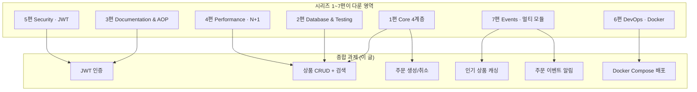
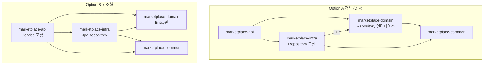
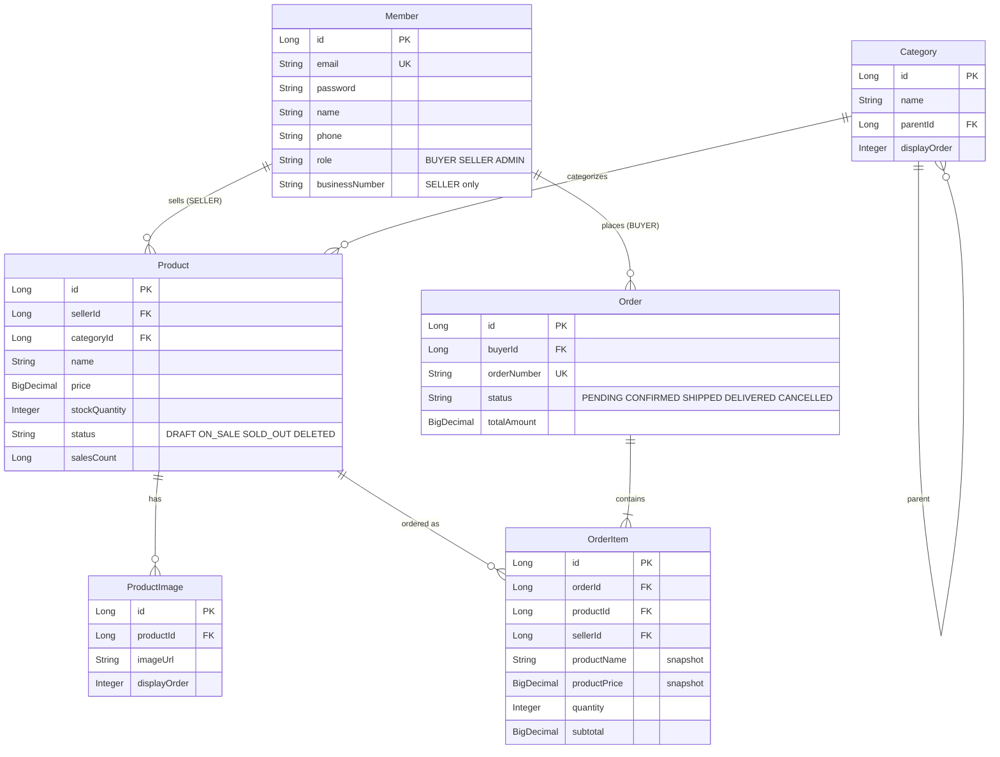

## 서론

"스프링 사전과제, 7일 동안 어디까지 해야 잘했다고 할까?"

1편부터 7편까지 평가자가 보는 영역을 한 편씩 풀었다. 그러나 실제 과제는 각 편이 독립적으로 출제되지 않는다. <strong>한 번의 REST API 구현 안에 4계층 책임 분리·JPA 매핑·테스트·N+1 최적화·JWT 인증·Docker 배포·이벤트 알림이 모두 섞여 있다.</strong> 그래서 시리즈를 마치는 마지막 글로 종합 과제를 둔다.

이 글은 시리즈 capstone이자 사양서다. 가상의 온라인 마켓플레이스 REST API를 7일 안에 구현하는 과제로, 회원·상품·주문 3대 도메인을 다룬다. 1~7편에서 다룬 패턴이 어디에 적용되는지 함께 적어 두었다. 평가자가 README와 코드를 어떻게 읽는지 시뮬레이션해 본다는 마음으로 풀면 된다.

대상 독자는 1~7편을 한 번 훑어본 주니어 백엔드 개발자다. 모든 항목을 다 구현할 필요는 없다 — 필수 구현으로 70점을 채운 뒤 가산점 35점에서 선택과 집중을 하는 것이 현실적인 전략이다. README에 "왜 이 구조를 골랐는지" 한 단락만 명확하게 적어도 다른 제출자와 격차가 벌어진다.

- 1편 — [Core Application Layer](/blog/spring-boot-pre-interview-guide-1)
- 2편 — [Database & Testing](/blog/spring-boot-pre-interview-guide-2)
- 3편 — [Documentation & AOP](/blog/spring-boot-pre-interview-guide-3)
- 4편 — [Performance & Optimization](/blog/spring-boot-pre-interview-guide-4)
- 5편 — [Security & Authentication](/blog/spring-boot-pre-interview-guide-5)
- 6편 — [DevOps & Deployment](/blog/spring-boot-pre-interview-guide-6)
- 7편 — [Advanced Patterns](/blog/spring-boot-pre-interview-guide-7)
- <strong>종합 과제 — 마켓플레이스 REST API (이 글)</strong>

[7편으로 돌아가기](/blog/spring-boot-pre-interview-guide-7)

---

## TL;DR

- <strong>7일 안의 마켓플레이스 REST API</strong> — 회원(BUYER·SELLER·ADMIN), 상품 CRUD, 주문 생성/취소, 이미지 업로드, 검색·페이징·캐싱·이벤트 알림까지 한 번에. 1~7편의 모든 영역이 한 프로젝트에 들어간다.
- <strong>기술 스택은 Spring Boot 4 + Kotlin 2.3 기준</strong> — Java 21 권장, JPA/Hibernate, Gradle, H2(로컬) + MySQL 8(Docker), QueryDSL·Redis는 선택. Lombok은 쓰지 않는다.
- <strong>구조 선택이 1차 평가 포인트</strong> — 싱글 모듈(권장)과 멀티 모듈(Option A 정석 의존 역전 원칙 / Option B 간소화) 중 하나를 골라 일관되게 적용. README에 선택 이유를 명시하지 않으면 그 자체로 감점.
- <strong>기본 70점 + 가산 35점</strong> — 기본은 기능·코드 품질·설계·테스트. 가산은 Docker·Swagger·CI·캐싱·이벤트·QueryDSL·멀티 모듈. 빌드 실패 -20, README 부실 -10, 비밀번호 평문 저장 -10 같은 감점이 더 무겁다.
- <strong>제출 전 5가지 체크</strong> — `./gradlew build` 통과, `docker-compose up` 작동, Swagger 접근 가능, 시크릿/`.idea` 미포함, README 완성. 이 다섯이 못 박혀 있어야 평가자가 본 코드를 보기 시작한다.

---

## 1. 과제 개요

### 1.1 무엇을 만들어야 하는가

온라인 마켓플레이스의 백엔드 API를 구현한다. 판매자는 상품을 등록하고, 구매자는 상품을 검색해 주문할 수 있다. 알림은 비동기로 처리되고, 인기 상품은 캐싱된다 — 실제 서비스의 핵심 흐름이 그대로 들어가 있다.



각 편의 패턴이 어디에 들어가는지 위 다이어그램으로 한눈에 보인다. 구현하는 동안 막히는 영역이 있으면 해당 편으로 돌아가 다시 읽고 와도 된다.

> <strong>참고 — Spring Boot 4 + Kotlin 2.3 셋업</strong>: 본 과제는 <strong>Spring Boot 4 + Kotlin 2.3</strong> 기준이다. `kotlin-spring`과 `kotlin-jpa` 플러그인, `build.gradle.kts`의 `kotlin("plugin.spring") version "2.3"` 같은 셋업은 1편 1.1절에서 다뤘으므로 그쪽을 참고. Kotlin 2.x는 백워드 호환이라 2.0~2.3 어느 버전이든 같은 코드가 작동한다. Lombok은 이 환경에서 쓰지 않는다.

### 1.2 제출 기한과 기술 스택

| 항목 | 내용 |
|------|------|
| <strong>기한</strong> | 과제 수령일로부터 7일 |
| <strong>언어/프레임워크</strong> | Kotlin 2.3, Spring Boot 4 (Java 21 권장) |
| <strong>영속성</strong> | JPA/Hibernate, Gradle |
| <strong>데이터베이스</strong> | H2(로컬), MySQL 8.0(Docker) |
| <strong>선택</strong> | QueryDSL, Redis |

---

## 2. 비즈니스 요구사항

### 2.1 회원 관리

- 회원 유형: `BUYER`(구매자), `SELLER`(판매자), `ADMIN`(관리자)
- 회원가입 시 이메일 중복 검사
- 로그인 시 JWT 토큰 발급 (Access Token + Refresh Token)
- 판매자는 사업자등록번호 필수 입력

### 2.2 상품 관리 (판매자 전용)

- 상품 등록·수정·삭제 (본인 상품만)
- 상품 이미지 업로드 (최대 5장, 각 10MB 이하)
- 상품 상태: `DRAFT`(임시저장), `ON_SALE`(판매중), `SOLD_OUT`(품절), `DELETED`(삭제)
- 재고 관리

### 2.3 상품 조회 (전체 공개)

- 상품 목록 조회 (페이지네이션·검색·필터링)
- 상품 상세 조회
- 카테고리별 조회
- 인기 상품 목록 (캐싱 적용)

### 2.4 주문 관리

- 구매자: 주문 생성·취소·내역 조회
- 판매자: 본인 상품 주문 확인, 배송 상태 변경
- 주문 상태 전이: `PENDING` → `CONFIRMED` → `SHIPPED` → `DELIVERED`
- 주문 취소는 `PENDING`·`CONFIRMED` 상태에서만 가능

### 2.5 알림

- 주문 생성 시 판매자에게 알림 (비동기)
- 배송 상태 변경 시 구매자에게 알림 (비동기)
- 알림은 로그로 대체 (실제 발송 구현 불필요)

---

## 3. API 명세

### 3.1 인증 API

| Method | URI | Description | 인증 |
|--------|-----|-------------|------|
| POST | `/api/v1/auth/signup` | 회원가입 | X |
| POST | `/api/v1/auth/login` | 로그인 | X |
| POST | `/api/v1/auth/refresh` | 토큰 갱신 | X |

### 3.2 회원 API

| Method | URI | Description | 인증 |
|--------|-----|-------------|------|
| GET | `/api/v1/members/me` | 내 정보 조회 | O |
| PATCH | `/api/v1/members/me` | 내 정보 수정 | O |
| GET | `/api/v1/admin/members` | 회원 목록 (관리자) | ADMIN |

### 3.3 상품 API

| Method | URI | Description | 인증 |
|--------|-----|-------------|------|
| POST | `/api/v1/products` | 상품 등록 | SELLER |
| GET | `/api/v1/products` | 상품 목록 조회 | X |
| GET | `/api/v1/products/{productId}` | 상품 상세 조회 | X |
| PATCH | `/api/v1/products/{productId}` | 상품 수정 | SELLER (본인) |
| DELETE | `/api/v1/products/{productId}` | 상품 삭제 | SELLER (본인) |
| POST | `/api/v1/products/{productId}/images` | 상품 이미지 업로드 | SELLER (본인) |
| GET | `/api/v1/products/popular` | 인기 상품 목록 | X |

### 3.4 주문 API

| Method | URI | Description | 인증 |
|--------|-----|-------------|------|
| POST | `/api/v1/orders` | 주문 생성 | BUYER |
| GET | `/api/v1/orders` | 내 주문 목록 | O |
| GET | `/api/v1/orders/{orderId}` | 주문 상세 조회 | O (본인) |
| POST | `/api/v1/orders/{orderId}/cancel` | 주문 취소 | BUYER (본인) |
| GET | `/api/v1/sellers/orders` | 판매자 주문 목록 | SELLER |
| PATCH | `/api/v1/sellers/orders/{orderId}/status` | 배송 상태 변경 | SELLER |

### 3.5 카테고리 API

| Method | URI | Description | 인증 |
|--------|-----|-------------|------|
| GET | `/api/v1/categories` | 카테고리 목록 | X |
| POST | `/api/v1/admin/categories` | 카테고리 등록 | ADMIN |

---

## 4. 상세 요구사항

### 4.1 인증/인가

- JWT 기반 인증 — Access Token 1시간, Refresh Token 7일
- 비밀번호는 BCrypt로 암호화 (5편 3.1절 참고)
- Role 기반 접근 제어 — `BUYER`·`SELLER`·`ADMIN`
- 리소스 소유자 검증 — 본인 상품·주문만 수정 가능 (5편 4.3절 참고)

### 4.2 상품 검색·필터링

쿼리 예시:

```
GET /api/v1/products?keyword=노트북&categoryId=1&minPrice=100000&maxPrice=2000000&status=ON_SALE&page=0&size=20&sort=createdAt,desc
```

| Parameter | Type | Description |
|-----------|------|-------------|
| keyword | String | 상품명 검색 (부분 일치) |
| categoryId | Long | 카테고리 필터 |
| minPrice | BigDecimal | 최소 가격 |
| maxPrice | BigDecimal | 최대 가격 |
| status | String | 상품 상태 |
| sellerId | Long | 판매자 필터 |
| page | Integer | 페이지 번호 (0부터) |
| size | Integer | 페이지 크기 (기본 20, 최대 100) |
| sort | String | 정렬 (createdAt, price, salesCount) |

### 4.3 주문 생성

요청 본문 예시:

```json
// POST /api/v1/orders
{
  "orderItems": [
    { "productId": 1, "quantity": 2 },
    { "productId": 3, "quantity": 1 }
  ],
  "shippingAddress": {
    "zipCode": "12345",
    "address": "서울시 강남구 테헤란로 123",
    "addressDetail": "456호",
    "receiverName": "홍길동",
    "receiverPhone": "010-1234-5678"
  }
}
```

처리 규칙:

- 재고 확인 후 차감 (동시성 고려 — 비관적 락 또는 낙관적 락+재시도, 부록 힌트 참고)
- 여러 판매자 상품 동시 주문 가능 (판매자별로 주문 분리)
- 주문 생성 시 판매자에게 알림 이벤트 발행 (7편 1절 패턴)
- 재고 부족 시 주문 실패 처리

### 4.4 파일 업로드

- 지원 확장자: `jpg`, `jpeg`, `png`, `gif`
- 최대 파일 크기: 10MB
- 상품당 최대 5장
- 저장 경로: `/uploads/products/{productId}/{filename}`
- 파일명은 UUID로 변환하여 저장 (7편 3절 참고)

### 4.5 캐싱

| 대상 | TTL | 비고 |
|------|-----|------|
| 인기 상품 목록 | 10분 | 4편 4절 참고 |
| 카테고리 목록 | 1시간 | 변경 빈도 낮음 |
| 상품 상세 (선택) | 5분 | 수정 시 무효화 |

### 4.6 로깅

- 모든 요청에 고유 Request ID 부여 (MDC, 3편 2절 참고)
- API 요청·응답 로깅 (AOP, 3편 2절 참고)
- 로그 포맷: `[timestamp] [level] [requestId] [class] message`

---

## 5. 기술 요구사항

### 5.1 프로젝트 구조 선택

싱글 모듈 또는 멀티 모듈 중 하나를 골라 일관되게 적용한다. <strong>선택 자체보다 README에 "왜 이걸 골랐는지" 한 단락 명시하는 것이 점수에 직결</strong>된다.

#### Option A: 싱글 모듈 (권장)

```
marketplace/
└── src/main/kotlin/com/example/
    ├── controller/
    ├── service/
    ├── repository/
    ├── domain/
    ├── dto/
    └── config/
```

#### Option B: 멀티 모듈 (도전)

두 가지 변형 중 선택 가능 (7편 6절 참고).

<strong>B-1. 정석 (DIP 적용)</strong>

```
marketplace/
├── marketplace-api/           # Controller, Security, 실행
├── marketplace-domain/        # Entity, Service, Repository 인터페이스
├── marketplace-infra/         # Repository 구현, 외부 연동
└── marketplace-common/        # 공통 예외, 유틸리티
```

<strong>B-2. 간소화 (실용적)</strong>

```
marketplace/
├── marketplace-api/           # Controller, Service, Security, 실행
├── marketplace-domain/        # Entity만
├── marketplace-infra/         # JpaRepository, QueryDSL
└── marketplace-common/        # 공통 예외, 유틸리티
```

의존성 방향은 다음과 같다:



> <strong>멀티 모듈 선택 시 요구사항</strong>:
> - 선택한 구조(B-1 또는 B-2)를 일관되게 적용
> - B-1 선택 시: `domain → infra` 의존 금지, Repository 인터페이스/구현 분리
> - B-2 선택 시: Service는 `api` 모듈에 위치, JpaRepository 직접 사용
> - README에 선택한 구조와 이유 명시

### 5.2 필수 구현

| 항목 | 설명 |
|------|------|
| <strong>계층 분리</strong> | Controller → Service → Repository, DTO/Command 분리 (1편 2~4절) |
| <strong>예외 처리</strong> | GlobalExceptionHandler, 커스텀 예외, 일관된 에러 응답 (1편 5절) |
| <strong>Validation</strong> | Request DTO에 Bean Validation 적용 (1편 2.2절) |
| <strong>트랜잭션</strong> | Service 계층 트랜잭션 관리, readOnly 분리 (1편 3.2절) |
| <strong>테스트</strong> | Controller·Service·Repository 테스트 (각 1개 이상, 2편 3~5절) |
| <strong>API 문서</strong> | Swagger 또는 REST Docs (3편 1절) |
| <strong>Docker</strong> | Dockerfile + docker-compose.yml (App + MySQL, 6편 1~2절) |
| <strong>README</strong> | 실행 방법, 기술 선택 이유, API 문서 링크 |

### 5.3 선택 구현 (가산점)

| 항목 | 설명 | 참고 |
|------|------|------|
| <strong>멀티 모듈</strong> | api/domain/infra/common 분리, DIP 적용 | 7편 6절 |
| <strong>QueryDSL</strong> | 동적 검색 쿼리 | 4편 5.2절 |
| <strong>Redis 캐싱</strong> | 인기 상품 캐싱 | 4편 4.3절 |
| <strong>GitHub Actions</strong> | CI 파이프라인 (빌드·테스트) | 6편 3절 |
| <strong>테스트 커버리지</strong> | JaCoCo 70% 이상 | 6편 3.2절 |
| <strong>이벤트 기반</strong> | 주문/알림 이벤트 분리 | 7편 1절 |

---

## 6. 데이터 모델

엔티티 6개의 관계는 다음과 같다.



`OrderItem`이 상품명·가격을 스냅샷으로 들고 있는 점에 주목한다. 주문 후 상품 정보가 바뀌어도 주문 시점의 가격을 보존하기 위해서다.

---

## 7. 평가 기준

### 7.1 기본 점수 (70점)

| 항목 | 배점 | 세부 기준 |
|------|------|----------|
| <strong>기능 구현</strong> | 30점 | 요구사항 충족, 정상 동작 |
| <strong>코드 품질</strong> | 20점 | 가독성, 네이밍, 일관성 |
| <strong>설계</strong> | 10점 | 계층 분리, 책임 분배, 예외 처리 |
| <strong>테스트</strong> | 10점 | 테스트 커버리지, 테스트 품질 |

### 7.2 가산점 (35점)

| 항목 | 배점 |
|------|------|
| Docker Compose 실행 가능 | +5점 |
| Swagger/REST Docs 문서화 | +5점 |
| GitHub Actions CI | +5점 |
| 캐싱 적용 (Redis 또는 로컬) | +5점 |
| 이벤트 기반 알림 처리 | +5점 |
| QueryDSL 동적 쿼리 | +5점 |
| 멀티 모듈 구조 (DIP 적용) | +5점 |

### 7.3 감점 요소

| 항목 | 감점 |
|------|------|
| 빌드 실패 | -20점 |
| README 누락/부실 | -10점 |
| 테스트 미작성 | -10점 |
| SQL Injection 취약점 | -10점 |
| 비밀번호 평문 저장 | -10점 |
| N+1 문제 (명백한 경우) | -5점 |

가산점은 다 챙겨도 +35점이지만, 감점은 한 번에 -20점이 나오기도 한다. 기본을 단단히 잡은 다음 가산점을 노리는 순서가 맞다.

---

## 8. 제출 가이드

### 8.1 제출 방법

1. GitHub Repository에 코드 업로드
2. README.md에 다음 내용 포함:
   - 실행 방법 (로컬, Docker)
   - 기술 스택 및 선택 이유
   - API 문서 접근 방법
   - 프로젝트 구조 설명
   - 추가 구현 사항
3. Repository URL 제출

### 8.2 실행 환경

<strong>싱글 모듈</strong>

```bash
# 로컬 실행 (H2)
./gradlew bootRun --args='--spring.profiles.active=local'

# Docker Compose 실행
docker-compose up -d
```

<strong>멀티 모듈</strong>

```bash
# 로컬 실행 (H2)
./gradlew :marketplace-api:bootRun --args='--spring.profiles.active=local'

# JAR 빌드
./gradlew :marketplace-api:bootJar

# Docker Compose 실행
docker-compose up -d
```

### 8.3 테스트 계정 (시드 데이터)

| Role | Email | Password |
|------|-------|----------|
| ADMIN | admin@example.com | admin123! |
| SELLER | seller@example.com | seller123! |
| BUYER | buyer@example.com | buyer123! |

### 8.4 체크리스트

제출 전 다음을 확인한다.

- [ ] `./gradlew build` 성공
- [ ] `docker-compose up` 실행 가능
- [ ] Swagger UI 또는 REST Docs 접근 가능
- [ ] 테스트 전체 통과
- [ ] README.md 작성 완료
- [ ] `.env`, 시크릿 키 등 민감 정보 제외
- [ ] 불필요한 파일 (`.idea`, `.DS_Store` 등) 제외

> <strong>질문</strong>: 과제 진행 중 질문은 이메일로 문의. 요구사항 해석이 모호한 경우 합리적으로 판단해 구현하고 README에 명시한다.

---

## 정리

- <strong>1~7편이 한 프로젝트 안에서 만난다</strong> — 4계층(1편)·JPA와 테스트(2편)·문서·로깅(3편)·N+1 최적화(4편)·JWT(5편)·Docker(6편)·이벤트·멀티 모듈(7편)이 모두 같은 마켓플레이스에 들어간다. 막히는 영역은 해당 편으로 돌아가 다시 읽으면 된다.
- <strong>구조 선택은 README가 말해 준다</strong> — 싱글 모듈을 골랐든 멀티 모듈을 골랐든, 선택 이유를 README에 한 단락 적는 것 자체가 평가 요소다. "왜 이걸 골랐는가"가 비면 평가자는 코드를 읽기 시작하기 전에 이미 감점한다.
- <strong>기본 70점이 가산점보다 무겁다</strong> — 가산점 35점 다 챙기는 것보다 빌드 실패(-20)·README 부실(-10)·비밀번호 평문(-10)을 피하는 것이 점수에 직결된다. 기본부터 단단히.
- <strong>Spring Boot 4 + Kotlin 2.3 default</strong> — Lombok 없이 Kotlin primary constructor·`val`/`var`만으로 풀이된다. data class·scope function·`when` 표현식이 코드량을 자연스럽게 줄여 준다.
- <strong>7일은 짧다</strong> — 부록의 구현 순서 추천을 참고해 매일 끝낼 단위를 정하면 막판에 몰리지 않는다. 마지막 하루는 README와 빌드 검증에 통째로 쓰는 것이 안전하다.

이 글로 스프링 사전과제 가이드 시리즈가 마무리된다. 1편의 Controller 한 줄부터 종합 과제의 마켓플레이스 전체까지, 평가자가 보는 영역을 모두 한 번씩 거쳤다. 시리즈를 다 따라온 독자라면 다음 사전과제에서 망설일 영역이 어디인지 이제 알 것이다. Good Luck!

👉 [구현 코드 보러가기](https://github.com/rhcwlq89/marketplace)

---

## 부록

<details>
<summary><strong>구현 순서 추천 — 싱글 모듈</strong></summary>

1. <strong>프로젝트 설정</strong>: 의존성, 프로파일 분리, Docker Compose
2. <strong>도메인 설계</strong>: Entity, Repository
3. <strong>인증 구현</strong>: Spring Security, JWT (5편)
4. <strong>회원 API</strong>: 가입·로그인·내 정보
5. <strong>상품 API</strong>: CRUD, 이미지 업로드
6. <strong>주문 API</strong>: 생성·조회·상태 변경
7. <strong>검색/페이징</strong>: 상품 검색, 필터링 (4편)
8. <strong>캐싱/이벤트</strong>: 인기 상품 캐싱, 알림 이벤트 (7편)
9. <strong>테스트 작성</strong>: 단위·통합 테스트 (2편)
10. <strong>문서화</strong>: Swagger 설정, README 작성

</details>

<details>
<summary><strong>구현 순서 추천 — 멀티 모듈</strong></summary>

1. <strong>프로젝트 구조 설정</strong>: `settings.gradle.kts`, 각 모듈 `build.gradle.kts`
2. <strong>common 모듈</strong>: 공통 예외, ErrorCode, 유틸리티
3. <strong>domain 모듈</strong>: Entity, Repository 인터페이스, Service (Option A) / Entity만 (Option B)
4. <strong>infra 모듈</strong>: Repository 구현체, JPA 설정
5. <strong>api 모듈</strong>: Controller, Security, Swagger
6. <strong>통합 테스트</strong>: `api` 모듈에서 전체 흐름 테스트
7. <strong>Docker 설정</strong>: 멀티 모듈 빌드 Dockerfile
8. <strong>문서화</strong>: 모듈 구조 다이어그램 포함 README

<strong>주의</strong>: 모듈 분리 후에는 순환 의존성이 발생하지 않도록 한다.

</details>

<details>
<summary><strong>동시성 처리 힌트 — 재고 차감</strong></summary>

재고 차감 시 동시성 문제 해결 방법이다. 비관적 락은 단순하고 안전하지만 처리량이 떨어지고, 낙관적 락은 처리량이 높지만 충돌 시 재시도 로직이 필요하다.

```kotlin
// 1. 비관적 락
interface ProductRepository : JpaRepository<Product, Long> {
    @Lock(LockModeType.PESSIMISTIC_WRITE)
    @Query("SELECT p FROM Product p WHERE p.id = :id")
    fun findByIdWithLock(@Param("id") id: Long): Product?
}

// 2. 낙관적 락 + 재시도
@Entity
class Product(
    @Id @GeneratedValue
    val id: Long? = null,

    @Version
    var version: Long = 0,
    // ...
)
```

</details>

<details>
<summary><strong>이벤트 처리 힌트 — 주문 생성 후 알림</strong></summary>

`@TransactionalEventListener(phase = AFTER_COMMIT)`로 주문 트랜잭션이 커밋된 뒤에만 알림이 발송되도록 한다. 7편 1절의 패턴 그대로다.

```kotlin
data class OrderCreatedEvent(
    val orderId: Long,
    val sellerId: Long,
    val createdAt: LocalDateTime = LocalDateTime.now(),
)

@Component
class OrderEventListener(
    private val notificationService: NotificationService,
) {
    @Async
    @TransactionalEventListener(phase = TransactionPhase.AFTER_COMMIT)
    fun handleOrderCreated(event: OrderCreatedEvent) {
        notificationService.notifySeller(event.sellerId, event.orderId)
    }
}
```

</details>

<details>
<summary><strong>멀티 모듈 구조 힌트 — Gradle 설정과 Option A/B 코드</strong></summary>

멀티 모듈에는 두 가지 접근 방식이 있다.

| 옵션 | Service 위치 | Repository 처리 | 특징 |
|------|-------------|----------------|------|
| <strong>Option A (정석)</strong> | domain | 인터페이스/구현 분리 | DIP 엄격 적용 |
| <strong>Option B (간소화)</strong> | api | JpaRepository 직접 사용 | 실용적, 코드량 적음 |

<strong>settings.gradle.kts</strong>

```kotlin
rootProject.name = "marketplace"

include("marketplace-api")
include("marketplace-domain")
include("marketplace-infra")
include("marketplace-common")

dependencyResolutionManagement {
    versionCatalogs {
        create("libs") {
            // Spring Boot 4 + Kotlin 2.3 BOM
        }
    }
}
```

<strong>모듈별 build.gradle.kts 의존성</strong>

```kotlin
// marketplace-common: 의존성 없음 (공통 유틸·예외)

// marketplace-domain
dependencies {
    implementation(project(":marketplace-common"))
    implementation(libs.spring.boot.starter.data.jpa)
}

// marketplace-infra
dependencies {
    implementation(project(":marketplace-common"))
    implementation(project(":marketplace-domain"))
    implementation(libs.spring.boot.starter.data.jpa)
    // QueryDSL (선택)
    implementation("com.querydsl:querydsl-jpa:5.0.0:jakarta")
    kapt("com.querydsl:querydsl-apt:5.0.0:jakarta")
    runtimeOnly(libs.h2)
    runtimeOnly(libs.mysql.connector.j)
}

// marketplace-api (실행 모듈)
dependencies {
    implementation(project(":marketplace-common"))
    implementation(project(":marketplace-domain"))
    implementation(project(":marketplace-infra"))
    implementation(libs.spring.boot.starter.web)
    implementation(libs.spring.boot.starter.security)
}
```

<strong>Option A: Repository 인터페이스/구현 분리 (DIP)</strong>

```kotlin
// marketplace-domain/.../ProductRepository.kt (인터페이스)
interface ProductRepository {
    fun save(product: Product): Product
    fun findById(id: Long): Product?
}

// marketplace-infra/.../ProductRepositoryImpl.kt (구현)
@Repository
class ProductRepositoryImpl(
    private val jpaRepository: ProductJpaRepository,
) : ProductRepository {

    override fun save(product: Product): Product = jpaRepository.save(product)

    override fun findById(id: Long): Product? = jpaRepository.findById(id).orElse(null)
}
```

<strong>Option B: QueryDSL Custom Repository 패턴 (간소화)</strong>

```kotlin
// marketplace-infra/.../ProductJpaRepository.kt
interface ProductJpaRepository : JpaRepository<Product, Long>, ProductJpaRepositoryCustom {
    fun findBySellerId(sellerId: Long, pageable: Pageable): Page<Product>
}

// marketplace-infra/.../ProductJpaRepositoryCustom.kt
interface ProductJpaRepositoryCustom {
    fun search(keyword: String?, categoryId: Long?, pageable: Pageable): Page<Product>
}

// marketplace-infra/.../ProductJpaRepositoryImpl.kt (QueryDSL)
class ProductJpaRepositoryImpl(
    private val queryFactory: JPAQueryFactory,
) : ProductJpaRepositoryCustom {
    override fun search(keyword: String?, categoryId: Long?, pageable: Pageable): Page<Product> {
        // queryFactory.selectFrom(product).where(...).fetch()
        TODO()
    }
}

// marketplace-api/.../ProductService.kt (Service는 api 모듈에 위치)
@Service
class ProductService(
    private val productJpaRepository: ProductJpaRepository,
) {
    // 직접 주입해 사용
}
```

<strong>Component 스캔 설정</strong>

```kotlin
// marketplace-api의 MarketplaceApplication.kt
@SpringBootApplication(scanBasePackages = ["com.example"])
class MarketplaceApplication

fun main(args: Array<String>) {
    runApplication<MarketplaceApplication>(*args)
}
```

</details>

<details>
<summary><strong>멀티 모듈 Docker 빌드 힌트</strong></summary>

Java 21 + Gradle 8.10 기준 멀티 스테이지 빌드. 6편 1.2절 패턴 그대로다.

```dockerfile
FROM gradle:8.10-jdk21 AS builder
WORKDIR /app

# Gradle 파일 먼저 복사 (캐싱)
COPY build.gradle.kts settings.gradle.kts ./
COPY gradle ./gradle
COPY marketplace-common/build.gradle.kts ./marketplace-common/
COPY marketplace-domain/build.gradle.kts ./marketplace-domain/
COPY marketplace-infra/build.gradle.kts ./marketplace-infra/
COPY marketplace-api/build.gradle.kts ./marketplace-api/

RUN gradle dependencies --no-daemon || true

# 소스 복사 및 빌드
COPY . .
RUN gradle :marketplace-api:bootJar --no-daemon -x test

# Runtime
FROM eclipse-temurin:21-jre-alpine
WORKDIR /app
COPY --from=builder /app/marketplace-api/build/libs/*.jar app.jar
EXPOSE 8080
ENTRYPOINT ["java", "-jar", "app.jar"]
```

</details>

### 외부 참조

- [Spring Boot 4 공식 문서](https://docs.spring.io/spring-boot/)
- [Kotlin Spring 가이드](https://kotlinlang.org/docs/jvm-spring-boot-restful.html)
- [JPA Buddy — Kotlin entities](https://www.jpa-buddy.com/blog/best-practices-and-common-pitfalls/)
- [Spring Security 7 reference](https://docs.spring.io/spring-security/reference/)
- [QueryDSL 공식 문서](https://querydsl.com/)
