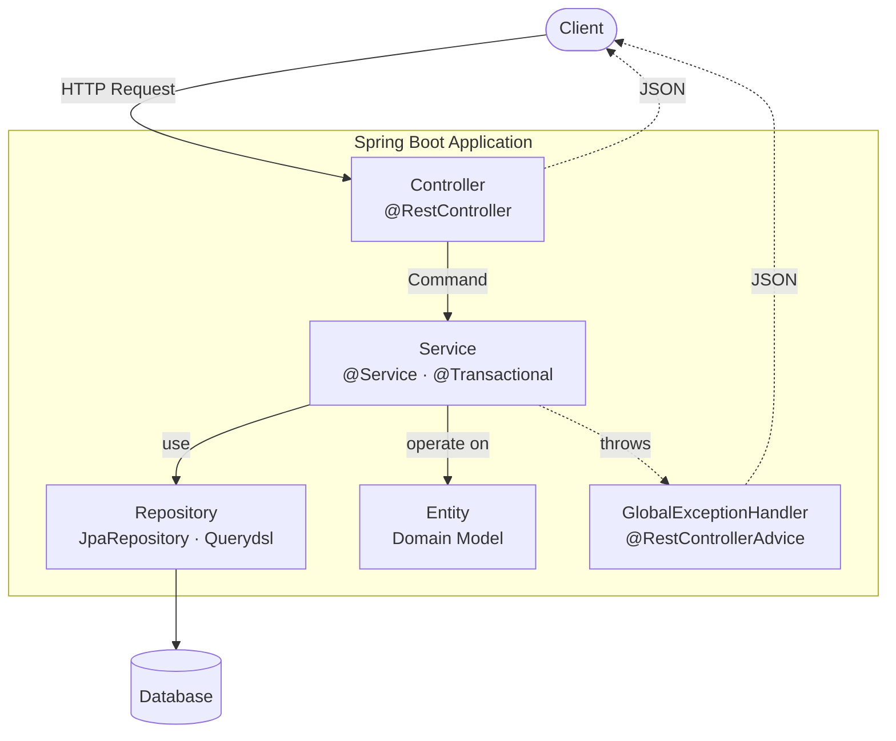

## 서론

"스프링 사전과제, 어디까지 해야 잘했다고 할까?"

여러 번 사전과제를 제출하고 리뷰하면서 반복적으로 지적되는 포인트들이 있다. 대부분은 "기능은 동작한다"가 아니라 <strong>"계층 책임이 섞여 있다"</strong>에서 시작된다. 이 시리즈는 그 포인트들을 평가자 시점으로 정리한 가이드다.

1편은 출발점인 <strong>Controller · Service · Repository · Domain 4계층</strong>이다. 4계층의 책임을 어떻게 나누는지, Request DTO를 Service에 직접 넘기지 않고 Command로 변환하는 이유, `@Transactional(readOnly = true)`가 실제로 무엇을 하는지, 그리고 GlobalExceptionHandler가 왜 단순한 catch-all이 아닌지를 다룬다.

대상 독자는 "스프링은 안다, 그런데 사전과제 평가자가 어디를 보는지는 잘 모르겠는" 주니어 백엔드 개발자다. 다 읽고 나면 4계층 사이에서 무엇을 어디에 둘지 망설이지 않게 된다.

- <strong>1편 — Core Application Layer (이 글)</strong>
- 2편 — [Database & Testing](/blog/spring-boot-pre-interview-guide-2)
- 3편 — [Documentation & AOP](/blog/spring-boot-pre-interview-guide-3)
- 4편 — [Logging](/blog/spring-boot-pre-interview-guide-4)
- 5편 — [Authentication & Validation](/blog/spring-boot-pre-interview-guide-5)
- 6편 — [Performance](/blog/spring-boot-pre-interview-guide-6)
- 7편 — [Production Readiness](/blog/spring-boot-pre-interview-guide-7)

---

## TL;DR

- <strong>4계층 책임 구분이 평가의 절반</strong> — Controller는 HTTP만, Service는 트랜잭션과 비즈니스 로직, Repository는 쿼리, Domain은 상태와 불변식. 책임이 섞이면 감점.
- <strong>Request DTO ≠ Service 입력</strong> — Request DTO는 Controller에서만 살고, Service에는 Command로 변환해서 넘긴다. 웹 의존성을 Service 테스트에서 떼어내기 위해서다.
- <strong>`@Transactional(readOnly = true)`는 No Transaction이 아니다</strong> — 트랜잭션은 시작되지만 Dirty Checking과 자동 flush가 꺼지고, Read Replica 라우팅 힌트로 쓰일 수 있다. 클래스 레벨에 두고 쓰기 메서드에서만 오버라이드하는 패턴이 표준.
- <strong>Entity는 Setter 대신 비즈니스 메서드</strong> — `setName()` 대신 `update(name, category)`. 무분별한 상태 변경을 막고, 불변식이 코드로 드러난다. 기본 생성자는 protected.
- <strong>GlobalExceptionHandler는 3단</strong> — `CommonException`(의도된 비즈니스 예외) → `MethodArgumentNotValidException`(Validation 실패) → `Exception`(Fallback). Fallback이 없으면 Whitelabel 페이지가 노출되고, 그 자체가 감점이다.

---

## 1. 4계층 한눈에 보기

### 1.1 요청 흐름

요청 하나가 들어와서 응답이 나가기까지의 흐름과 각 계층의 자리는 다음과 같다.



핵심은 화살표의 방향이다. <strong>Controller는 Service만 알고, Service는 Repository와 Entity를 알고, Repository는 DB만 안다.</strong> 역방향 의존(Service가 HTTP를 알거나, Entity가 DTO를 아는)은 전부 안티패턴이다.

### 1.2 계층별 책임

| 계층 | 책임 | 절대 하면 안 되는 것 |
|------|------|--------------------|
| <strong>Controller</strong> | HTTP 매핑, Validation, DTO ↔ Command 변환 | 비즈니스 로직, 트랜잭션 |
| <strong>Service</strong> | 트랜잭션, 비즈니스 규칙, DTO 변환 | HTTP 어노테이션 의존 |
| <strong>Repository</strong> | 쿼리, 페이징 | 비즈니스 분기 |
| <strong>Domain</strong> | 상태와 불변식, 비즈니스 메서드 | Setter 노출 |

> <strong>참고</strong>: 작은 과제라고 해서 계층을 합치지는 않는다. "지금은 Service에 로직이 한 줄뿐이라 Controller로 옮길까"는 함정이다 — 평가자는 책임 분리 자체를 본다.

---

## 2. Presentation Layer (Controller)

### 2.1 CRUD와 HTTP Method 매핑

PUT은 전체 수정, PATCH는 부분 수정으로 구분하는 것도 방법이지만, 혼용하지 않고 한 가지 방식으로 통일하는 것이 좋다.

| 작업 | HTTP Method |
|------|-------------|
| Create | POST |
| Read | GET |
| Update | PUT / PATCH |
| Delete | DELETE |

<details>
<summary><strong>PUT vs PATCH 논쟁</strong></summary>

<strong>REST 원칙상 구분</strong>
- `PUT`: 리소스 전체를 대체 (멱등성 보장)
- `PATCH`: 리소스 일부만 수정

<strong>실무에서의 현실</strong>

대부분의 실무 프로젝트에서는 PATCH만 쓰거나 PUT만 쓰는 경우가 많다.

- <strong>PATCH만 사용</strong>: 대부분의 수정이 부분 수정이고, 전체 교체가 필요한 경우가 거의 없음
- <strong>PUT만 사용</strong>: 팀 내 컨벤션이 PUT으로 통일되어 있거나, 프론트엔드에서 항상 전체 데이터를 전송

<strong>과제에서의 권장</strong>

과제에서는 둘 중 하나로 통일하되, README에 선택 이유를 명시하면 좋다. 두 방식을 혼용하면서 명확한 기준이 없으면 오히려 감점 요인이 될 수 있다.

</details>

### 2.2 URI 설계 원칙

- <strong>복수형</strong> 사용: `/orders`, `/users`, `/products`
- <strong>소유관계</strong>: `/users/{userId}/orders`
- <strong>행위 표현</strong>: `/orders/{orderId}/cancel`

> <strong>Tip</strong>: cancel 같은 행위 URI는 도메인 성격에 따라 허용 여부가 갈릴 수 있다. 단순 CRUD 과제에서는 상태 변경(PATCH)으로 표현하는 것도 고려해볼 것.

<details>
<summary><strong>행위를 PATCH로 표현할 때 URL을 어떻게 채우나</strong></summary>

핵심은 <strong>URL에는 동사를 박지 않고, 리소스 경로 그대로 두고 "무엇을 바꿀지"는 body에 담는다</strong>는 것.

```http
# 행위 URI 스타일 (RPC-ish)
POST /api/v1/orders/{orderId}/cancel

# PATCH 스타일 — URL에서 동사가 사라지고, 의도는 body로
PATCH /api/v1/orders/{orderId}
Content-Type: application/json

{ "status": "CANCELLED" }
```

<strong>실무에서 보이는 세 가지 변형</strong>

| 패턴 | URL | Body | 쓸 때 |
|------|-----|------|------|
| 행위 URI | `POST /orders/{id}/cancel` | 없음/소량 | 행위 자체가 핵심 동작일 때(결제·환불·승인) |
| 리소스 PATCH | `PATCH /orders/{id}` | `{"status":"CANCELLED"}` | 단순 상태 머신 — 사전과제 권장 |
| 서브리소스 | `PUT /orders/{id}/status` | `{"value":"CANCELLED"}` | status를 별도 리소스로 모델링 |

<strong>Spring Boot에서의 모양 (Java)</strong>

```java
// Controller — URL에는 cancel 안 들어간다
@PatchMapping("/{orderId}")
public CommonResponse<Long> modifyOrder(
        @PathVariable Long orderId,
        @Valid @RequestBody ModifyOrderRequest request) {
    return CommonResponse.success(orderService.modifyOrder(orderId, request.toCommand()));
}

// Service — 상태 전이는 도메인 메서드에 위임
@Transactional
public Long modifyOrder(Long orderId, ModifyOrderCommand command) {
    Order order = orderRepository.findById(orderId)
        .orElseThrow(NotFoundException::new);

    if (command.status() == OrderStatus.CANCELLED) {
        order.cancel();   // 전이 가능 여부 검증은 Entity 책임
    }
    return order.getId();
}

// Entity — 5장의 비즈니스 메서드 + 불변식 패턴 그대로
public void cancel() {
    if (this.status == OrderStatus.COMPLETED) {
        throw new BadRequestException(ErrorCode.ORDER_ALREADY_COMPLETED);
    }
    this.status = OrderStatus.CANCELLED;
    this.cancelledAt = LocalDateTime.now();
}
```

<strong>PATCH로 통일했을 때의 함정</strong>

- <strong>전이 외 필드까지 받을 위험</strong> — `ModifyOrderRequest`가 status, name, address를 다 받으면 cancel 하려다 다른 필드까지 같이 바뀔 수 있다. DTO를 행위별로 분리하거나 status 전용 엔드포인트로 가는 게 안전.
- <strong>의도 모호</strong> — `{"status":"CANCELLED"}`는 "사용자가 취소"인지 "관리자가 강제 변경"인지 감사 로그에서 안 드러난다.
- <strong>부수 효과가 묶인 동작</strong> — 취소가 "환불 + 재고 복구 + 알림"을 트리거하면 PATCH는 너무 가볍다. 이런 케이스는 `POST /orders/{id}/cancel`이 더 정직.

요약: 단순 상태 변경은 리소스 PATCH로, 도메인 동사가 핵심인 워크플로는 행위 URI로. 둘을 섞지 말고 README에 선택 이유만 적으면 된다.

</details>

### 2.3 URI 하드코딩 방지

반복적으로 사용되는 URI는 상수로 관리한다.

<details>
<summary><strong>ApiPaths (Kotlin)</strong></summary>

```kotlin
object ApiPaths {
    const val API = "/api"
    const val V1 = "/v1"
    const val PRODUCTS = "/products"
}
```

</details>

<details>
<summary><strong>ApiPaths (Java)</strong></summary>

```java
public final class ApiPaths {
    public static final String API = "/api";
    public static final String V1 = "/v1";
    public static final String PRODUCTS = "/products";

    private ApiPaths() {}
}
```

</details>

### 2.4 공통 응답 클래스

일반적으로 응답코드, 응답메시지, 데이터 영역으로 구성한다.

- <strong>HTTP Status</strong>: 프로토콜 의미 (200, 400, 500 등)
- <strong>code</strong>: 비즈니스 에러 분류 (ERR001, ERR002 등)

> <strong>예외</strong>: 파일 다운로드, 스트리밍 API, HealthCheck는 공통 응답 클래스를 적용하지 않는 것이 적절하다.

<details>
<summary><strong>공통 응답 클래스, 꼭 필요한가?</strong></summary>

<strong>찬성 의견</strong>
- 클라이언트가 응답 형식을 예측할 수 있어 파싱이 쉬움
- 에러 코드를 통해 비즈니스 에러를 세분화할 수 있음
- 프론트엔드와의 협업 시 일관된 인터페이스 제공

<strong>반대 의견</strong>
- HTTP Status Code만으로 충분히 에러를 구분할 수 있음
- 불필요한 래핑으로 응답 크기가 증가
- REST 원칙에 따르면 HTTP Status가 응답의 성공/실패를 나타내야 함

<strong>실무 팁</strong>

대부분의 국내 기업에서는 공통 응답 클래스를 사용한다. 특히 레거시 시스템이나 다양한 클라이언트(웹, 앱, 외부 연동)를 지원해야 하는 경우 유용하다.

<strong>과제에서는</strong> 요구사항에 명시되어 있지 않다면 공통 응답 클래스를 사용하는 것이 안전하다. 단, HTTP Status도 함께 적절히 설정해야 한다 (예: 201 Created, 404 Not Found).

</details>

<details>
<summary><strong>CommonResponse (Kotlin)</strong></summary>

```kotlin
data class CommonResponse<T>(
    val code: String = CODE_SUCCESS,
    val message: String = MSG_SUCCESS,
    val data: T? = null
) {
    companion object {
        const val CODE_SUCCESS = "SUC200"
        const val MSG_SUCCESS = "success"

        fun <T> success(data: T? = null): CommonResponse<T> {
            return CommonResponse(CODE_SUCCESS, MSG_SUCCESS, data)
        }

        fun <T> error(code: String, message: String, data: T? = null): CommonResponse<T> {
            return CommonResponse(code, message, data)
        }
    }
}
```

</details>

<details>
<summary><strong>CommonResponse (Java)</strong></summary>

```java
public record CommonResponse<T>(
    String code,
    String message,
    T data
) {
    public static final String CODE_SUCCESS = "SUC200";
    public static final String MSG_SUCCESS = "success";

    public static <T> CommonResponse<T> success() {
        return new CommonResponse<>(CODE_SUCCESS, MSG_SUCCESS, null);
    }

    public static <T> CommonResponse<T> success(T data) {
        return new CommonResponse<>(CODE_SUCCESS, MSG_SUCCESS, data);
    }

    public static <T> CommonResponse<T> error(String code, String message) {
        return new CommonResponse<>(code, message, null);
    }
}
```

</details>

### 2.5 DTO Validation과 Command 변환

- `@Valid`, `@NotBlank`, `@Size`, `@NotNull` 등 활용
- 중첩된 DTO도 `@Valid` 처리
- ExceptionHandler에서 Validation 예외 처리
- <strong>Request DTO는 Controller에서만 사용하고, Service에는 Command 객체로 변환하여 전달</strong>

> <strong>Tip</strong>: Request DTO를 직접 Service로 전달하면 Presentation Layer와 Business Layer 간의 결합도가 높아진다. Command 객체를 사용하면 레이어 간 책임이 명확히 분리되고, Service 테스트 시 웹 관련 의존성 없이 테스트할 수 있다.

<details>
<summary><strong>Command 패턴, 과연 항상 필요한가?</strong></summary>

<strong>찬성 의견</strong>
- 레이어 간 의존성이 명확히 분리됨
- Service 테스트 시 웹 어노테이션 의존성 없음
- Request DTO 변경이 Service에 영향을 주지 않음
- 여러 Controller에서 동일한 Service 메서드를 다른 방식으로 호출 가능

<strong>반대 의견</strong>
- 단순한 CRUD에서는 오버엔지니어링
- 변환 코드가 추가되어 보일러플레이트 증가
- Request와 Command가 거의 동일한 경우가 많음
- 과제처럼 작은 프로젝트에서는 불필요한 복잡성

<strong>실무 팁</strong>

- <strong>대규모 프로젝트</strong>: Command 패턴 권장. 특히 도메인 로직이 복잡하거나, 여러 채널(API, 배치, 메시지 큐)에서 동일한 로직을 호출하는 경우
- <strong>소규모 프로젝트/과제</strong>: Request DTO를 직접 전달해도 무방. 단, 일관성 있게 한 가지 방식으로 통일

<strong>과제에서의 권장</strong>

시간이 충분하다면 Command 패턴을 사용하여 레이어 분리에 대한 이해도를 보여주는 것이 좋다. 하지만 시간이 부족하다면 Request DTO를 직접 사용해도 감점 요인은 아니다.

</details>

<details>
<summary><strong>Request DTO &amp; Command (Kotlin)</strong></summary>

```kotlin
// Request DTO - Controller에서 Validation 용도로 사용
data class RegisterProductRequest(
    @field:NotBlank
    @field:Size(max = 100)
    val name: String?,

    @field:Size(min = 1)
    @field:Valid
    val details: List<ProductDetailDto>?
) {
    fun toCommand() = RegisterProductCommand(
        name = name!!,
        details = details!!.map { it.toCommand() }
    )
}

data class ProductDetailDto(
    @field:NotNull
    val type: ProductCategoryType?,

    @field:NotBlank
    val name: String?
) {
    fun toCommand() = ProductDetailCommand(
        type = type!!,
        name = name!!
    )
}

data class ModifyProductRequest(
    @field:NotBlank
    @field:Size(max = 100)
    val name: String?,

    @field:NotNull
    val category: ProductCategoryType?
) {
    fun toCommand() = ModifyProductCommand(
        name = name!!,
        category = category!!
    )
}

// Command - Service Layer에서 사용하는 순수한 데이터 객체
data class RegisterProductCommand(
    val name: String,
    val details: List<ProductDetailCommand>
)

data class ProductDetailCommand(
    val type: ProductCategoryType,
    val name: String
)

data class ModifyProductCommand(
    val name: String,
    val category: ProductCategoryType
)

enum class ProductCategoryType {
    FOOD, HOTEL
}
```

</details>

<details>
<summary><strong>Request DTO &amp; Command (Java)</strong></summary>

```java
// Request DTO - Controller에서 Validation 용도로 사용
public record RegisterProductRequest(
    @NotBlank
    @Size(max = 100)
    String name,

    @Size(min = 1)
    @Valid
    List<ProductDetailDto> details
) {
    public RegisterProductCommand toCommand() {
        return new RegisterProductCommand(
            name,
            details.stream()
                .map(ProductDetailDto::toCommand)
                .toList()
        );
    }
}

public record ProductDetailDto(
    @NotNull
    ProductCategoryType type,

    @NotBlank
    String name
) {
    public ProductDetailCommand toCommand() {
        return new ProductDetailCommand(type, name);
    }
}

public record ModifyProductRequest(
    @NotBlank
    @Size(max = 100)
    String name,

    @NotNull
    ProductCategoryType category
) {
    public ModifyProductCommand toCommand() {
        return new ModifyProductCommand(name, category);
    }
}

// Command - Service Layer에서 사용하는 순수한 데이터 객체
public record RegisterProductCommand(
    String name,
    List<ProductDetailCommand> details
) {}

public record ProductDetailCommand(
    ProductCategoryType type,
    String name
) {}

public record ModifyProductCommand(
    String name,
    ProductCategoryType category
) {}

public enum ProductCategoryType {
    FOOD, HOTEL
}
```

</details>

### 2.6 Controller 작성

Controller는 비즈니스 로직을 포함하지 않는다. <strong>Request DTO를 Command로 변환한 뒤 Service에 위임하는 게 전부</strong>다.

<details>
<summary><strong>Controller (Kotlin)</strong></summary>

```kotlin
@RestController
@RequestMapping(API + V1 + PRODUCTS)
class ProductController(
    private val productService: ProductService
) {
    @GetMapping("/{productId}")
    fun findProductDetail(
        @PathVariable productId: Long
    ): CommonResponse<FindProductDetailResponse> {
        return CommonResponse.success(productService.findProductDetail(productId))
    }

    @GetMapping
    fun findProducts(
        @Valid @ModelAttribute request: FindProductRequest,
        @PageableDefault(page = 0, size = 20) pageable: Pageable
    ): CommonResponse<Page<FindProductResponse>> {
        return CommonResponse.success(productService.findProducts(request.toCommand(), pageable))
    }

    @PostMapping
    @ResponseStatus(HttpStatus.CREATED)
    fun registerProduct(
        @Valid @RequestBody request: RegisterProductRequest
    ): CommonResponse<Long> {
        return CommonResponse.success(productService.registerProduct(request.toCommand()))
    }

    @PutMapping("/{productId}")
    fun modifyProduct(
        @PathVariable productId: Long,
        @Valid @RequestBody request: ModifyProductRequest
    ): CommonResponse<Long> {
        return CommonResponse.success(productService.modifyProduct(productId, request.toCommand()))
    }

    @DeleteMapping
    fun deleteProducts(
        @Valid @Size(min = 1) @RequestParam productIds: Set<Long>
    ): CommonResponse<Unit> {
        productService.deleteProducts(productIds)
        return CommonResponse.success()
    }
}
```

</details>

<details>
<summary><strong>Controller (Java)</strong></summary>

```java
@RestController
@RequestMapping(API + V1 + PRODUCTS)   // import static com.example.config.ApiPaths.*;
@RequiredArgsConstructor
public class ProductController {

    private final ProductService productService;

    @GetMapping("/{productId}")
    public CommonResponse<FindProductDetailResponse> findProductDetail(
            @PathVariable Long productId) {
        return CommonResponse.success(productService.findProductDetail(productId));
    }

    @GetMapping
    public CommonResponse<Page<FindProductResponse>> findProducts(
            @Valid @ModelAttribute FindProductRequest request,
            @PageableDefault(page = 0, size = 20) Pageable pageable) {
        return CommonResponse.success(productService.findProducts(request.toCommand(), pageable));
    }

    @PostMapping
    @ResponseStatus(HttpStatus.CREATED)
    public CommonResponse<Long> registerProduct(
            @Valid @RequestBody RegisterProductRequest request) {
        return CommonResponse.success(productService.registerProduct(request.toCommand()));
    }

    @PutMapping("/{productId}")
    public CommonResponse<Long> modifyProduct(
            @PathVariable Long productId,
            @Valid @RequestBody ModifyProductRequest request) {
        return CommonResponse.success(productService.modifyProduct(productId, request.toCommand()));
    }

    @DeleteMapping
    public CommonResponse<Void> deleteProducts(
            @Valid @Size(min = 1) @RequestParam Set<Long> productIds) {
        productService.deleteProducts(productIds);
        return CommonResponse.success();
    }
}
```

</details>

---

## 3. Business Layer (Service)

### 3.1 트랜잭션 처리

- 조회 트랜잭션은 `readOnly = true`로 분리하여 불필요한 Dirty Checking 방지
- 클래스 레벨에 `@Transactional(readOnly = true)`를 두고, 쓰기 메서드에만 `@Transactional`로 오버라이드
- 로깅 설정으로 트랜잭션 동작 확인

<details>
<summary><strong>readOnly = true의 실제 효과</strong></summary>

<strong>동작 원리</strong>
1. <strong>Dirty Checking 비활성화</strong>: 엔티티 변경 감지를 하지 않아 스냅샷 저장 비용 절약
2. <strong>Flush 모드 변경</strong>: `FlushMode.MANUAL`로 설정되어 자동 flush 방지
3. <strong>DB 힌트 전달</strong>: 일부 DB(MySQL의 경우 Read Replica 라우팅 등)에서 읽기 전용 힌트로 활용

<strong>주의사항</strong>
- `readOnly = true`여도 <strong>트랜잭션은 시작</strong>된다 (No Transaction이 아님)
- 엔티티를 수정하면 <strong>예외 없이 무시</strong>된다 (조용히 실패할 수 있어 주의)
- OSIV가 켜져 있으면 지연 로딩은 여전히 동작함

<strong>FlushMode 종류</strong>

| 모드 | 설명 | 사용 시점 |
|------|------|----------|
| `AUTO` | 쿼리 실행 전, 커밋 전 자동 flush (기본값) | 일반 트랜잭션 |
| `COMMIT` | 커밋 시에만 flush | 대량 읽기 작업 |
| `MANUAL` | 명시적 `flush()` 호출 시에만 | `readOnly = true` 시 자동 설정 |
| `ALWAYS` | 모든 쿼리 전에 flush | 거의 사용하지 않음 |

<strong>OSIV (Open Session In View)</strong>

OSIV는 영속성 컨텍스트의 생존 범위를 HTTP 요청 전체로 확장하는 설정이다.

```yaml
# Spring Boot 기본값: true
spring:
  jpa:
    open-in-view: true  # OSIV 활성화 (기본값)
```

| OSIV 상태 | 영속성 컨텍스트 범위 | 장점 | 단점 |
|----------|-------------------|------|------|
| `true` (기본) | 요청 시작 ~ 응답 완료 | Controller에서 지연로딩 가능 | DB 커넥션 오래 점유 |
| `false` | 트랜잭션 범위 내 | 커넥션 빠른 반환 | Controller에서 `LazyInitializationException` 발생 가능 |

<strong>권장</strong>: 실무에서는 `open-in-view: false`로 설정하고, 필요한 데이터는 Service 계층에서 미리 로딩하는 것이 좋다.

<strong>표준 패턴</strong>

```java
@Service
@Transactional(readOnly = true)  // 기본값: 읽기 전용
public class ProductService {

    public Product findById(Long id) { ... }  // readOnly = true 적용

    @Transactional  // 쓰기 작업: readOnly = false로 오버라이드
    public Long save(Product product) { ... }
}
```

</details>

<details>
<summary><strong>트랜잭션 로깅레벨 설정 (application.yml)</strong></summary>

```yaml
logging:
  level:
    org.springframework.orm.jpa: DEBUG
    org.springframework.transaction: DEBUG
    org.hibernate.SQL: DEBUG
    org.hibernate.orm.jdbc.bind: DEBUG
```

</details>

### 3.2 Custom Exception 정의

비즈니스 규칙 위반은 Custom Exception으로 던지고, 각 예외에 HTTP 상태 코드와 에러 코드를 박아둔다. Handler가 분기 없이 그대로 응답에 매핑할 수 있도록 하기 위해서다.

<details>
<summary><strong>Custom Exception (Kotlin)</strong></summary>

```kotlin
enum class ErrorCode(
    val code: String,
    val message: String
) {
    ERR000("ERR000", "일시적인 오류가 발생했습니다. 잠시 후 다시 시도해주세요."),
    ERR001("ERR001", "잘못된 요청입니다."),
    ERR002("ERR002", "상품을 찾을 수 없습니다.")
}

open class CommonException(
    val statusCode: HttpStatus,
    val errorCode: ErrorCode
) : RuntimeException(errorCode.message)

class BadRequestException(errorCode: ErrorCode = ErrorCode.ERR001)
    : CommonException(HttpStatus.BAD_REQUEST, errorCode)

class NotFoundException(errorCode: ErrorCode = ErrorCode.ERR002)
    : CommonException(HttpStatus.NOT_FOUND, errorCode)
```

</details>

<details>
<summary><strong>Custom Exception (Java)</strong></summary>

```java
@Getter
@RequiredArgsConstructor
public enum ErrorCode {
    ERR000("ERR000", "일시적인 오류가 발생했습니다. 잠시 후 다시 시도해주세요."),
    ERR001("ERR001", "잘못된 요청입니다."),
    ERR002("ERR002", "상품을 찾을 수 없습니다.");

    private final String code;
    private final String message;
}

@Getter
public class CommonException extends RuntimeException {
    private final HttpStatus statusCode;
    private final ErrorCode errorCode;

    public CommonException(HttpStatus statusCode, ErrorCode errorCode) {
        super(errorCode.getMessage());
        this.statusCode = statusCode;
        this.errorCode = errorCode;
    }
}

public class NotFoundException extends CommonException {
    public NotFoundException() {
        super(HttpStatus.NOT_FOUND, ErrorCode.ERR002);
    }

    public NotFoundException(ErrorCode errorCode) {
        super(HttpStatus.NOT_FOUND, errorCode);
    }
}
```

</details>

### 3.3 Nullable 처리

- Kotlin: `?:` (Elvis operator)와 nullable 타입
- Java: `Optional`과 `orElseThrow()`

<details>
<summary><strong>Service 조회 (Kotlin)</strong></summary>

```kotlin
@Service
@Transactional(readOnly = true)
class ProductService(
    private val productRepository: ProductRepository
) {
    fun findProductDetail(productId: Long): FindProductDetailResponse {
        val product = productRepository.findById(productId)
            ?: throw NotFoundException()

        return FindProductDetailResponse.from(product)
    }
}
```

</details>

<details>
<summary><strong>Service 조회 (Java)</strong></summary>

```java
@Service
@Transactional(readOnly = true)
@RequiredArgsConstructor
public class ProductService {

    private final ProductRepository productRepository;

    public FindProductDetailResponse findProductDetail(Long productId) {
        Product product = productRepository.findById(productId)
            .orElseThrow(NotFoundException::new);

        return FindProductDetailResponse.from(product);
    }
}
```

</details>

### 3.4 Service 작성 원칙

- Domain Model을 직접 반환하지 않고 응답 전용 DTO로 변환
- 반복 로직은 Stream을 활용하되 가독성 유지
- <strong>Request DTO가 아닌 Command 객체를 파라미터로 받는다</strong>

<details>
<summary><strong>단일 엔티티 삭제 — 4가지 방법과 deleteById 미신</strong></summary>

단일 엔티티를 지우는 데에는 보통 두 가지가 떠오른다 — `deleteById(id)`와 `findById + delete(entity)`. 그 사이에 자주 듣는 미신과 잘 안 알려진 두 변형까지 같이 본다.

<strong>미신 — "deleteById는 SELECT 안 해서 빠르다"</strong>

거의 사실이 아니다. Spring Data의 `SimpleJpaRepository.deleteById()` 실제 구현은 다음과 같다.

```java
@Override
@Transactional
public void deleteById(ID id) {
    Assert.notNull(id, "...");
    findById(id).ifPresent(this::delete);   // ← 내부에서 findById부터 호출
}
```

JPA가 영속성 컨텍스트에서 엔티티를 관리해야 cascade와 `@PreRemove`/`@PostRemove`를 보장할 수 있어서, 그냥 DELETE 한 방으로 못 보낸다. <strong>SELECT + DELETE 두 쿼리</strong>가 똑같이 나간다.

<strong>4가지 방법 비교</strong>

| 방법 | 쿼리 수 | 미존재 처리 | 비즈니스 검증 | cascade · @PreRemove | 권장 |
|------|:---:|------|:---:|:---:|------|
| 1. `deleteById(id)` | 2 (SELECT + DELETE) | 조용히 무시 | ✗ | ✓ | 거의 안 씀 |
| <strong>2. `findById` + `delete`</strong> | 2 | <strong>예외 던지기</strong> | <strong>✓</strong> | ✓ | <strong>실무 표준</strong> |
| 3. `@Modifying @Query DELETE` | 1 | 영향 row 수 반환 | ✗ | <strong>✗</strong> | 단일엔 부적합 (bulk용) |
| 4. 도메인 메서드 | 2 (SELECT + UPDATE) | 예외 던지기 | <strong>✓</strong> | ✓ | <strong>soft delete</strong> |

<strong>방법 1 — `deleteById`가 거의 쓰이지 않는 이유</strong>

```java
productRepository.deleteById(productId);   // 한 줄, 그러나
```

modern Spring Data에선 미존재 ID로 호출해도 예외가 안 난다. 호출자 입장에선 "정말 지웠는지" 알 길이 없어서 <strong>버그를 조용히 숨기는 입구</strong>가 된다. 또 삭제 전 검증("이미 결제된 주문은 삭제 못 함")이나 audit 로그를 끼우기도 어렵다.

<strong>방법 2 — 실무 표준 (findById + delete)</strong>

```java
@Transactional
public void deleteProduct(Long productId) {
    Product product = productRepository.findById(productId)
        .orElseThrow(NotFoundException::new);

    // 여기서 도메인 검증·이벤트 발행 가능
    productRepository.delete(product);
}
```

쿼리 수는 deleteById와 같고, 대신 <strong>404를 명확히 던지고 검증을 끼울 수 있다</strong>. 1편에서 일관되게 쓴 "Service가 도메인을 꺼내서 작업한다"는 흐름과도 맞물린다.

<strong>방법 3 — 함정이 큰 단축경로</strong>

```java
@Modifying(clearAutomatically = true)   // ← 빠뜨리면 영속성 컨텍스트가 stale
@Query("DELETE FROM Product p WHERE p.id = :id")
int deleteByIdInBulk(@Param("id") Long id);
```

DELETE 한 방이 나가지만:
- <strong>`@PreRemove`·`@PostRemove` 미실행</strong>
- <strong>cascade 미적용</strong> → 자식 엔티티 남아 FK 제약 위반 가능
- <strong>영속성 컨텍스트 stale</strong> → 같은 트랜잭션에서 다시 조회 시 옛 캐시가 나옴

단일 엔티티에 쓸 가치가 없고, "WHERE id IN (...)"으로 수만 건 일괄 삭제할 때만 의미 있다.

<strong>방법 4 — soft delete의 정석</strong>

```java
// Service
@Transactional
public void deleteProduct(Long productId) {
    Product product = productRepository.findById(productId)
        .orElseThrow(NotFoundException::new);
    product.softDelete();   // Dirty Checking이 UPDATE 발행
}

// Entity
public void softDelete() {
    if (this.deletedAt != null) {
        throw new BadRequestException(ErrorCode.ALREADY_DELETED);
    }
    this.deletedAt = LocalDateTime.now();
}
```

도메인이 "삭제 가능 여부"의 책임을 가지고, 명시적 save 호출 없이 Dirty Checking으로 UPDATE가 나간다.

<strong>요구사항별 선택</strong>

```text
요구사항 ─┬─ 그냥 hard delete                    → 방법 2 (findById + delete)
          ├─ 검증·audit 필요한 hard delete       → 방법 2 + 도메인 메서드 호출
          ├─ Soft delete                        → 방법 4 (도메인 메서드)
          └─ 수만 건 일괄 (배치)                  → 방법 3 (@Modifying)
```

<strong>"deleteById는 거의 안 쓴다"</strong>가 결론. 짧긴 하지만 "조용한 성공"이 거의 항상 버그의 입구가 된다.

</details>

<details>
<summary><strong>deleteAll() vs deleteAllInBatch() 차이</strong></summary>

<strong>deleteAll()</strong>
- 엔티티를 하나씩 조회 후 삭제 (N+1 쿼리 발생)
- `@PreRemove`, `@PostRemove` 등 JPA 콜백 실행됨
- Cascade 삭제가 동작함

<strong>deleteAllInBatch()</strong>
- 단일 DELETE 쿼리로 일괄 삭제
- JPA 콜백 실행되지 않음
- Cascade 삭제가 동작하지 않음 (FK 제약조건 위반 가능)

<strong>실무 팁</strong>

- 연관 엔티티가 있거나 삭제 콜백이 필요하면 `deleteAll()` 사용
- 대량 삭제가 필요하고 연관관계가 없으면 `deleteAllInBatch()` 사용
- 과제에서는 <strong>`deleteAll()`이 안전한 선택</strong>

</details>

<details>
<summary><strong>Soft Delete vs Hard Delete</strong></summary>

<strong>Hard Delete</strong>
- 데이터를 실제로 삭제
- 구현이 단순하고 직관적
- 저장 공간 절약

<strong>Soft Delete</strong>
- `deletedAt`(timestamp, nullable) 컬럼으로 논리 삭제 — null이면 살아있음, 값이 있으면 그 시점에 삭제
- 데이터 복구 가능, 감사(Audit) 용이
- 조회 시 항상 삭제 여부 조건 필요 (`@Where`, `@SQLRestriction`)

> <strong>컬럼 선택</strong>: `deletedAt`(timestamp)이 `deleted`(boolean)보다 표준이다. 언제 삭제됐는지가 한 컬럼에 담기고, 메서드명도 `findByIdAndDeletedAtIsNull`("deletedAt이 null인 것 = 살아있는 것")로 자연스럽게 읽힌다. boolean `deleted`는 `findByIdAndDeletedFalse`처럼 어순이 어색해지고, 삭제 시점도 따로 컬럼을 둬야 한다.

<strong>실무에서의 선택</strong>

대부분의 실무 프로젝트에서는 Soft Delete를 사용한다. 특히:
- 법적으로 데이터 보관이 필요한 경우 (금융, 의료 등)
- 삭제 취소 기능이 필요한 경우
- 삭제된 데이터도 통계/분석에 활용하는 경우

<strong>과제에서의 권장</strong>

요구사항에 명시되지 않았다면 Hard Delete로 구현해도 무방하다. Soft Delete를 구현한다면 조회 로직에서 삭제된 데이터를 필터링하는 것을 잊지 말아야 한다.

```java
// Soft Delete 구현 시 조회 메서드 예시 (deletedAt 컬럼 기준)
Optional<Product> findByIdAndDeletedAtIsNull(Long id);
```

</details>

<details>
<summary><strong>Soft Delete 성능 미신과 대안 패턴 5가지</strong></summary>

규모가 커지면 단순 `deletedAt` 플래그만으로는 부족해진다. 먼저 자주 듣는 미신부터 깨고, 실무 패턴들을 정리한다.

<strong>미신: "boolean보다 deletedAt이 빠르다"</strong>

거의 사실이 아니다. 두 컬럼 모두 cardinality가 사실상 2(살아있음/삭제됨)이고, 실서비스에서는 살아있는 행이 99%를 차지한다. 이 컬럼만 단독 인덱싱하는 건 옵티마이저 입장에선 "거의 모든 행을 도는 조건"이라 큰 의미가 없다.

진짜 성능이 갈리는 지점은 <strong>부분 인덱스(partial index, filtered index)</strong>에 있다.

```sql
-- PostgreSQL — 살아있는 행만 인덱싱
CREATE INDEX idx_products_alive ON products (category)
WHERE deleted_at IS NULL;
```

부분 인덱스는 boolean이든 timestamp든 정의할 수 있지만, `IS NULL`이 정의에 더 자연스럽게 어울린다. 다만 이 차이도 미미하고, 진짜 성능 압박이 오면 다음 단계(아카이브 테이블)로 넘어가야 한다.

<strong>5가지 패턴 비교</strong>

| 패턴 | 핵심 구조 | 적합한 상황 |
|------|----------|------------|
| <strong>A. `deletedAt` 플래그</strong> | live 테이블에 nullable timestamp | 사전과제·중소 규모 (기본) |
| <strong>B. `status` enum</strong> | 다중 lifecycle 상태 | 주문·콘텐츠처럼 상태가 여럿 |
| <strong>C. Archive 테이블</strong> | 삭제 시점에 별도 테이블로 이관 | live 테이블이 수천만~수억 행 |
| <strong>D. Hard Delete + Audit Log</strong> | 실제 삭제 + 별도 audit 테이블 기록 | 사용자 개인정보, GDPR/CCPA |
| <strong>E. Event Sourcing</strong> | 모든 변경을 append-only 이벤트로 | 금융·의료·감사 추적 필수 |

<strong>패턴 B — status enum</strong>

삭제가 단일 boolean이 아닌, lifecycle 일부일 때:

```java
public enum OrderStatus { PENDING, PAID, CANCELLED, REFUNDED, DELETED }

@Entity
public class Order {
    @Enumerated(EnumType.STRING)   // ORDINAL은 enum 추가/순서 변경 시 마이그레이션이 깨진다
    @Column(nullable = false)
    private OrderStatus status;
}
```

조회는 `status != 'DELETED'` 또는 `IN (...)`. <strong>반드시 `EnumType.STRING`</strong> — `ORDINAL`은 enum 값이 추가되거나 순서가 바뀌면 기존 데이터의 의미가 통째로 어긋난다.

<strong>패턴 C — Archive 테이블</strong>

```sql
-- 삭제 트랜잭션에서
INSERT INTO products_archive
SELECT *, NOW() AS archived_at FROM products WHERE id = ?;

DELETE FROM products WHERE id = ?;
```

live 테이블이 항상 lean하게 유지되어 인덱스가 의미 있게 동작한다. 복원이 필요하면 archive에서 다시 INSERT. 대규모 SaaS의 표준.

<strong>패턴 D — Hard Delete + Audit Log</strong>

GDPR "잊혀질 권리"에 대응할 때:

```java
@Transactional
public void deleteUser(Long userId) {
    User user = userRepository.findById(userId).orElseThrow(NotFoundException::new);

    auditLogRepository.save(AuditLog.of(user, "DELETE"));  // 흔적은 audit에
    userRepository.delete(user);                            // 실제로 지움
}
```

live 테이블이 가장 가볍고, 감사 흔적은 별도 테이블에. 사용자 개인정보가 들어 있는 도메인이면 사실상 필수.

<strong>패턴 E — Event Sourcing</strong>

"삭제"라는 이벤트 자체를 append-only로 기록하고, 현재 상태는 이벤트 재생으로 derive. 금융·의료·규제 산업에서 쓰지만 복잡도가 한 단계 뛰는 패턴이라 <strong>사전과제 수준에선 거의 안 한다</strong>.

<strong>면접에서 답할 때</strong>

> "기본은 `deletedAt` timestamp로 했습니다. boolean보다 정보량이 많고 부분 인덱스도 자연스럽습니다. 다만 규모가 커지면 archive 테이블로 이관하는 패턴이 표준이고, 사용자 개인정보면 GDPR 때문에 hard delete + audit log가 더 적합합니다."

이 정도까지 짚으면 "soft delete 패턴을 깊게 이해하고 있다"는 신호가 된다.

</details>

<details>
<summary><strong>Service (Kotlin)</strong></summary>

```kotlin
@Service
@Transactional(readOnly = true)
class ProductService(
    private val productRepository: ProductRepository
) {
    @Transactional
    fun modifyProduct(productId: Long, command: ModifyProductCommand): Long {
        val product = productRepository.findById(productId)
            ?: throw NotFoundException()

        product.update(
            name = command.name,
            category = command.category
        )

        return product.id!!
    }

    @Transactional
    fun deleteProduct(productId: Long) {
        val product = productRepository.findById(productId)
            ?: throw NotFoundException()

        productRepository.delete(product)
    }

    @Transactional
    fun deleteProducts(productIds: Set<Long>) {
        val products = productRepository.findAllById(productIds)

        if (products.size != productIds.size) {
            throw NotFoundException()
        }

        productRepository.deleteAll(products)
    }
}
```

</details>

<details>
<summary><strong>Service (Java)</strong></summary>

```java
@Service
@Transactional(readOnly = true)
@RequiredArgsConstructor
public class ProductService {

    private final ProductRepository productRepository;

    @Transactional
    public Long modifyProduct(Long productId, ModifyProductCommand command) {
        Product product = productRepository.findById(productId)
            .orElseThrow(NotFoundException::new);

        product.update(command.name(), command.category());

        return product.getId();
    }

    @Transactional
    public void deleteProduct(Long productId) {
        Product product = productRepository.findById(productId)
            .orElseThrow(NotFoundException::new);

        productRepository.delete(product);
    }

    @Transactional
    public void deleteProducts(Set<Long> productIds) {
        List<Product> products = productRepository.findAllById(productIds);

        if (products.size() != productIds.size()) {
            throw new NotFoundException();
        }

        productRepository.deleteAll(products);
    }
}
```

</details>

### 3.5 Response DTO 변환 패턴

Service는 Entity를 그대로 반환하지 않고 Response DTO로 변환한다. 변환 코드를 어디에 두느냐로 세 가지 패턴이 갈린다.

| 패턴 | 변환 코드 위치 | 적합 |
|------|--------------|------|
| <strong>정적 팩토리</strong> | DTO의 `from(entity)` 메서드 | 사전과제 권장 |
| 생성자 변환 | DTO 생성자가 Entity를 받음 | 매핑이 한 줄로 끝날 때 |
| MapStruct | 별도 Mapper 자동 생성 | 매핑이 많거나 그래프가 깊을 때 |

핵심은 <strong>변환 책임을 DTO 쪽에 둔다</strong>는 점이다. Entity가 DTO 모양을 알면 도메인이 표현 계층에 끌려다닌다.

<details>
<summary><strong>정적 팩토리 (Java)</strong></summary>

```java
public record FindProductDetailResponse(
    Long id,
    String name,
    ProductCategoryType category,
    boolean enabled,
    LocalDateTime createdAt
) {
    public static FindProductDetailResponse from(Product product) {
        return new FindProductDetailResponse(
            product.getId(),
            product.getName(),
            product.getCategory(),
            product.isEnabled(),
            product.getCreatedAt()
        );
    }
}

// Service에서 사용
public FindProductDetailResponse findProductDetail(Long productId) {
    Product product = productRepository.findById(productId)
        .orElseThrow(NotFoundException::new);
    return FindProductDetailResponse.from(product);
}
```

컬렉션 응답은 `entities.stream().map(Response::from).toList()`. 페이지 응답은 `page.map(Response::from)` — Spring Data `Page`가 `map`을 직접 지원한다.

</details>

<details>
<summary><strong>정적 팩토리 (Kotlin)</strong></summary>

```kotlin
data class FindProductDetailResponse(
    val id: Long,
    val name: String,
    val category: ProductCategoryType,
    val enabled: Boolean,
    val createdAt: LocalDateTime
) {
    companion object {
        fun from(product: Product) = FindProductDetailResponse(
            id = product.id!!,
            name = product.name,
            category = product.category,
            enabled = product.enabled,
            createdAt = product.createdAt
        )
    }
}
```

확장 함수(`fun Product.toResponse()`)도 가능하지만, 정적 팩토리가 다른 코드 스타일과 더 일관된다.

</details>

<details>
<summary><strong>MapStruct 대안</strong></summary>

DTO가 많거나 그래프가 깊으면(Order → OrderItems → Product) 보일러플레이트를 크게 줄여준다.

```java
@Mapper(componentModel = "spring")
public interface ProductMapper {
    FindProductDetailResponse toDetailResponse(Product product);
    List<FindProductResponse> toListResponse(List<Product> products);
}
```

장점은 컴파일 타임 매핑 검증과 성능. 단점은 의존성과 어노테이션 학습 비용. <strong>사전과제처럼 도메인이 작으면 정적 팩토리가 더 빠르고 평가자가 읽기도 쉽다.</strong>

</details>

---

## 4. Data Access Layer (Repository)

### 4.1 기본 원칙

- <strong>Nullable 처리</strong>: Java는 Optional, Kotlin은 Nullable
- <strong>단순 조회</strong>: JPA Query Method 활용
- <strong>복잡한 조회</strong>: Querydsl 활용
- <strong>Querydsl 사용 시</strong>: `@Transactional` 명시

### 4.2 페이징 처리

`PageableExecutionUtils.getPage()`를 사용하면 마지막 페이지일 경우 count 쿼리를 생략하여 성능상 이점이 있다. 그리고 한 가지 잊기 쉬운 것 — Spring Data는 클라이언트가 `?size=10000` 같은 큰 페이지를 요청하면 그대로 받아준다. <strong>전역 상한을 application.yml에 박아두지 않으면 메모리·DB 부하의 입구가 된다.</strong>

<details>
<summary><strong>페이징 전역 설정 (application.yml)</strong></summary>

```yaml
spring:
  data:
    web:
      pageable:
        default-page-size: 20    # @PageableDefault 누락 시 기본
        max-page-size: 100       # 상한 — 이걸 넘는 size 요청은 잘림
```

`max-page-size`는 Controller에서 `Pageable`을 받는 모든 엔드포인트에 자동 적용된다. Controller마다 따로 검증할 필요가 없어서 빠뜨리기 쉬운 보호막이다.

</details>

<details>
<summary><strong>Repository (Kotlin)</strong></summary>

```kotlin
interface ProductRepository : JpaRepository<Product, Long>, ProductRepositoryCustom {
    fun findByIdAndDeletedAtIsNull(id: Long): Product?
    fun findAllByIdIn(ids: Collection<Long>): List<Product>
}

interface ProductRepositoryCustom {
    fun findProducts(
        name: String?,
        enabled: Boolean?,
        pageable: Pageable
    ): Page<Product>
}

class ProductRepositoryImpl(
    private val queryFactory: JPAQueryFactory
) : ProductRepositoryCustom {

    override fun findProducts(
        name: String?,
        enabled: Boolean?,
        pageable: Pageable
    ): Page<Product> {
        val product = QProduct.product

        val results = queryFactory
            .selectFrom(product)
            .where(
                nameContains(name),
                enabledEq(enabled)
            )
            .offset(pageable.offset)
            .limit(pageable.pageSize.toLong())
            .orderBy(product.id.desc())
            .fetch()

        val countQuery = queryFactory
            .select(product.count())
            .from(product)
            .where(
                nameContains(name),
                enabledEq(enabled)
            )

        return PageableExecutionUtils.getPage(results, pageable) {
            countQuery.fetchOne() ?: 0L
        }
    }

    private fun nameContains(name: String?): BooleanExpression? {
        return name?.let { QProduct.product.name.containsIgnoreCase(it) }
    }

    private fun enabledEq(enabled: Boolean?): BooleanExpression? {
        return enabled?.let { QProduct.product.enabled.eq(it) }
    }
}
```

</details>

<details>
<summary><strong>Repository (Java)</strong></summary>

```java
public interface ProductRepository extends JpaRepository<Product, Long>,
        ProductRepositoryCustom {

    Optional<Product> findByIdAndDeletedAtIsNull(Long id);
    List<Product> findAllByIdIn(Collection<Long> ids);
}

public interface ProductRepositoryCustom {
    Page<Product> findProducts(String name, Boolean enabled, Pageable pageable);
}

@RequiredArgsConstructor
public class ProductRepositoryImpl implements ProductRepositoryCustom {

    private final JPAQueryFactory queryFactory;

    @Override
    public Page<Product> findProducts(String name, Boolean enabled, Pageable pageable) {
        QProduct product = QProduct.product;

        List<Product> results = queryFactory
            .selectFrom(product)
            .where(
                nameContains(name),
                enabledEq(enabled)
            )
            .offset(pageable.getOffset())
            .limit(pageable.getPageSize())
            .orderBy(product.id.desc())
            .fetch();

        JPAQuery<Long> countQuery = queryFactory
            .select(product.count())
            .from(product)
            .where(
                nameContains(name),
                enabledEq(enabled)
            );

        return PageableExecutionUtils.getPage(results, pageable, countQuery::fetchOne);
    }

    private BooleanExpression nameContains(String name) {
        return name != null ? QProduct.product.name.containsIgnoreCase(name) : null;
    }

    private BooleanExpression enabledEq(Boolean enabled) {
        return enabled != null ? QProduct.product.enabled.eq(enabled) : null;
    }
}
```

</details>

> <strong>참고</strong>: 페이지네이션 심화(Page vs Slice, 커서 기반 페이지네이션)는 [4편 — Performance](/blog/spring-boot-pre-interview-guide-4)에서, Querydsl 의존성과 설정은 [2편 — Database &amp; Testing](/blog/spring-boot-pre-interview-guide-2)에서 다룬다.

---

## 5. Domain Layer (Entity)

### 5.1 설계 원칙

- <strong>Setter 대신 비즈니스 메서드</strong>: `updateName()`, `activate()` 등
- <strong>기본 생성자는 protected</strong>: JPA 스펙 만족 + 무분별한 객체 생성 방지
- <strong>연관 Entity 분리</strong>: 하위 Entity가 필요하면 분리
- <strong>고정 값</strong>: Enum 활용

<details>
<summary><strong>왜 protected인가 — JPA 스펙·프록시·캡슐화</strong></summary>

엄밀히는 <strong>꼭 protected여야 하는 건 아니다</strong>. JPA 2.1 스펙(§2.1)은 무인자 생성자의 접근제한자를 <strong>"public or protected"</strong>로 명시하므로 public도 동작한다. 그럼에도 protected가 표준이 된 이유는 세 가지 압력이 모두 그쪽으로 수렴하기 때문이다.

<strong>1. public을 피하는 이유 — 불완전한 객체 생성 방지</strong>

```java
@Entity
@NoArgsConstructor  // public이 기본
public class Product extends BaseEntity {
    @Column(nullable = false)
    private String name;

    public Product(String name) { this.name = name; }
}

// 어디서든 가능
Product p = new Product();    // name이 null인 좀비 객체
productRepository.save(p);    // DB에 NULL 박힐 때까지 안 들킨다
```

Entity는 Setter를 없애고 생성자 + 비즈니스 메서드로만 상태가 바뀌도록 설계하는데, public 무인자 생성자가 열려 있으면 이 원칙이 즉시 무너진다.

<strong>2. private을 피하는 이유 — Hibernate 프록시가 부모 생성자를 호출해야 함</strong>

Hibernate는 지연 로딩을 위해 Entity의 <strong>서브클래스(프록시)를 런타임에 생성</strong>한다. 프록시가 부모(우리 Entity)의 무인자 생성자를 호출해야 하므로, 자식 클래스가 그 생성자를 볼 수 있어야 한다.

| 접근제한자 | 프록시가 호출 가능? |
|------------|:---:|
| `public` | ✓ |
| `protected` | ✓ (서브클래스이므로) |
| `package-private` | △ (같은 패키지면 가능) |
| `private` | ✗ |

private이어도 reflection으로 우회는 가능하지만 JPA 스펙 위반이고, 일부 바이트코드 enhancement 환경에서는 실제로 깨진다.

<strong>3. protected가 두 압력의 교집합</strong>

- JPA / Hibernate에는 충분히 보임 (스펙 만족, 프록시 가능)
- 애플리케이션 코드에는 안 보임 (`new Product()` 차단)

```java
@Entity
@NoArgsConstructor(access = AccessLevel.PROTECTED)  // ← 표준 한 줄
public class Product extends BaseEntity {
    public Product(String name) { this.name = name; }
}

new Product();   // ❌ 컴파일 에러 — protected access
```

<strong>Kotlin은 사정이 다르다</strong>

```kotlin
// build.gradle.kts
plugins {
    kotlin("plugin.jpa") version "..."     // @Entity에 무인자 생성자 자동 합성
    kotlin("plugin.allopen") version "..." // @Entity 클래스의 final 해제 (프록시용)
}
```

`kotlin-jpa` 플러그인이 컴파일 시점에 `@Entity` 클래스의 무인자 생성자를 자동으로 합성하므로, Kotlin에서는 직접 protected 생성자를 쓸 일이 거의 없다. 1편 Kotlin 예시에 명시적 protected 생성자가 없는데도 동작하는 게 그 이유다.

</details>

<details>
<summary><strong>Entity에서 Lombok 사용, 괜찮은가?</strong></summary>

<strong>주의가 필요한 어노테이션</strong>

| 어노테이션 | 위험도 | 이유 |
|-----------|:---:|------|
| `@Data` | 높음 | `@EqualsAndHashCode` 포함 — 양방향 연관관계에서 무한 루프 |
| `@EqualsAndHashCode` | 높음 | 연관 엔티티 포함 시 StackOverflow |
| `@ToString` | 중간 | 지연 로딩 프록시 강제 초기화, 무한 루프 |
| `@AllArgsConstructor` | 중간 | 필드 순서 변경 시 버그 발생 가능 |
| `@Setter` | 낮음 | 의도하지 않은 상태 변경 가능 |
| `@Getter` | 안전 | 일반적으로 문제없음 |
| `@NoArgsConstructor` | 안전 | `access = PROTECTED`와 함께 사용 권장 |
| `@Builder` | 안전 | 단, `@AllArgsConstructor`와 함께 사용 시 주의 |

<strong>@Builder + @AllArgsConstructor 조합 주의</strong>

❌ 문제가 될 수 있는 패턴

```java
@Entity
@Builder
@AllArgsConstructor
@NoArgsConstructor
public class Product {
    @Id @GeneratedValue
    private Long id;
    private String name;
    private int price;
}

// Builder를 사용하면 AllArgsConstructor가 호출됨
// 필드 순서가 변경되면 값이 잘못 들어갈 수 있음
Product product = Product.builder()
    .name("상품")
    .price(1000)
    .build();
```

✅ 권장 패턴 — 생성자에 직접 `@Builder` 적용

```java
@Entity
@Getter
@NoArgsConstructor(access = AccessLevel.PROTECTED)
public class Product {
    @Id @GeneratedValue
    private Long id;
    private String name;
    private int price;

    @Builder
    private Product(String name, int price) {
        this.name = name;
        this.price = price;
    }
}
```

생성자에 `@Builder`를 적용하면 필요한 필드만 명시적으로 받을 수 있고, 필드 순서 변경에도 안전하다.

<strong>실무 권장 패턴</strong>

```java
@Entity
@Getter
@NoArgsConstructor(access = AccessLevel.PROTECTED)
public class Product {
    // @Setter 사용하지 않음 - 비즈니스 메서드로 상태 변경
    // @ToString - 필요시 연관 엔티티 제외하고 직접 구현
    // @EqualsAndHashCode - ID 기반으로 직접 구현하거나 사용하지 않음
}
```

<strong>과제에서의 권장</strong>

`@Getter`, `@NoArgsConstructor(access = PROTECTED)` 정도만 사용하고, 나머지는 직접 구현하는 것이 안전하다. `@Data`는 절대 사용하지 않는다.

</details>

### 5.2 BaseEntity

생성일시, 수정일시 등 공통 영역은 BaseEntity로 분리한다.

<details>
<summary><strong>BaseEntity (Kotlin)</strong></summary>

```kotlin
@MappedSuperclass
@EntityListeners(AuditingEntityListener::class)
abstract class BaseEntity {

    @CreatedDate
    @Column(updatable = false)
    var createdAt: LocalDateTime = LocalDateTime.now()
        protected set

    @LastModifiedDate
    @Column
    var updatedAt: LocalDateTime = LocalDateTime.now()
        protected set
}

@MappedSuperclass
abstract class BaseEntityWithAuditor : BaseEntity() {

    @CreatedBy
    @Column(updatable = false)
    var createdBy: Long? = null
        protected set

    @LastModifiedBy
    @Column
    var updatedBy: Long? = null
        protected set
}
```

</details>

<details>
<summary><strong>BaseEntity (Java)</strong></summary>

```java
@MappedSuperclass
@EntityListeners(AuditingEntityListener.class)
@Getter
public abstract class BaseEntity {

    @CreatedDate
    @Column(updatable = false)
    private LocalDateTime createdAt;

    @LastModifiedDate
    @Column
    private LocalDateTime updatedAt;
}

@MappedSuperclass
@Getter
public abstract class BaseEntityWithAuditor extends BaseEntity {

    @CreatedBy
    @Column(updatable = false)
    private Long createdBy;

    @LastModifiedBy
    @Column
    private Long updatedBy;
}
```

</details>

### 5.3 Entity 작성

<details>
<summary><strong>Entity (Kotlin)</strong></summary>

```kotlin
@Entity
@Table(name = "products")
class Product(
    @Id
    @GeneratedValue(strategy = GenerationType.IDENTITY)
    val id: Long? = null,

    @Column(nullable = false)
    var name: String,

    @Column(nullable = false)
    var enabled: Boolean = true,

    @Enumerated(EnumType.STRING)
    @Column(nullable = false)
    var category: ProductCategoryType
) : BaseEntity() {

    fun update(name: String, category: ProductCategoryType) {
        this.name = name
        this.category = category
    }

    fun enable() {
        this.enabled = true
    }

    fun disable() {
        this.enabled = false
    }
}
```

</details>

<details>
<summary><strong>Entity (Java)</strong></summary>

```java
@Entity
@Table(name = "products")
@Getter
@NoArgsConstructor(access = AccessLevel.PROTECTED)
public class Product extends BaseEntity {

    @Id
    @GeneratedValue(strategy = GenerationType.IDENTITY)
    private Long id;

    @Column(nullable = false)
    private String name;

    @Column(nullable = false)
    private Boolean enabled = true;

    @Enumerated(EnumType.STRING)
    @Column(nullable = false)
    private ProductCategoryType category;

    public Product(String name, ProductCategoryType category) {
        this.name = name;
        this.category = category;
    }

    public void update(String name, ProductCategoryType category) {
        this.name = name;
        this.category = category;
    }

    public void enable() {
        this.enabled = true;
    }

    public void disable() {
        this.enabled = false;
    }
}
```

</details>

### 5.4 연관관계 매핑

사전과제 도메인은 거의 항상 연관관계를 가진다(주문-상품, 회원-주문 등). 평가에서 가장 자주 지적되는 두 가지가 <strong>fetch 타입 미지정</strong>과 <strong>양방향 매핑 남용</strong>이다.

핵심 원칙 세 가지:

- <strong>fetch는 항상 LAZY로 명시</strong> — `@ManyToOne`/`@OneToOne`의 기본값이 EAGER라서 명시 안 하면 N+1의 단골손님이 된다.
- <strong>양방향은 꼭 필요할 때만</strong> — 양쪽에서 다 탐색해야 하는 경우가 아니면 단방향(`@ManyToOne` 한쪽만)이 안전하다.
- <strong>Cascade는 ALL을 피하고 필요한 것만</strong> — 자식 lifecycle이 부모와 정말 동일한 경우에만 `PERSIST`/`REMOVE` 명시.

<details>
<summary><strong>단방향 @ManyToOne (Java) — 가장 안전한 기본형</strong></summary>

```java
@Entity
@Table(name = "orders")
@Getter
@NoArgsConstructor(access = AccessLevel.PROTECTED)
public class Order extends BaseEntity {

    @Id
    @GeneratedValue(strategy = GenerationType.IDENTITY)
    private Long id;

    @ManyToOne(fetch = FetchType.LAZY)
    @JoinColumn(name = "user_id", nullable = false)
    private User user;

    @Enumerated(EnumType.STRING)
    @Column(nullable = false)
    private OrderStatus status = OrderStatus.PENDING;

    public Order(User user) {
        this.user = user;
    }
}
```

`fetch = LAZY` 명시는 거의 마법 주문 — 빠뜨리면 Order 조회마다 User까지 SELECT가 따라붙는다.

</details>

<details>
<summary><strong>양방향 @OneToMany (Java) — 진짜 필요할 때만</strong></summary>

```java
@Entity
public class Order extends BaseEntity {
    // ...
    @OneToMany(mappedBy = "order", cascade = CascadeType.ALL, orphanRemoval = true)
    private List<OrderItem> items = new ArrayList<>();

    // 연관관계 편의 메서드 — 양쪽 동기화는 도메인 책임
    public void addItem(OrderItem item) {
        this.items.add(item);
        item.assignTo(this);
    }
}

@Entity
@Table(name = "order_items")
public class OrderItem {
    @Id
    @GeneratedValue(strategy = GenerationType.IDENTITY)
    private Long id;

    @ManyToOne(fetch = FetchType.LAZY)
    @JoinColumn(name = "order_id", nullable = false)
    private Order order;

    void assignTo(Order order) {
        this.order = order;
    }
}
```

양방향에선 <strong>"연관관계의 주인"</strong>이 한쪽이고(보통 `@ManyToOne` 쪽), 반대편은 `mappedBy`로 읽기 전용임을 표시. cascade는 자식 lifecycle이 부모와 같을 때만(`OrderItem`은 `Order` 없으면 의미 없음).

</details>

<details>
<summary><strong>fetch / cascade 빠른 가이드</strong></summary>

| 어노테이션 | 기본 fetch | 권장 |
|------|:---:|:---:|
| `@ManyToOne` | EAGER | <strong>LAZY 명시</strong> |
| `@OneToOne` | EAGER | <strong>LAZY 명시</strong> |
| `@OneToMany` | LAZY | LAZY 유지 |
| `@ManyToMany` | LAZY | <strong>중간 엔티티로 풀기</strong> |

| Cascade | 의미 | 언제 |
|---------|------|------|
| `PERSIST` | 부모 저장 시 자식도 저장 | 자식 단독 저장이 의미 없을 때 |
| `REMOVE` | 부모 삭제 시 자식도 삭제 | lifecycle 동일 |
| `ALL` | 모든 cascade 활성 | 거의 쓰지 말 것 |
| (없음) | 명시적 save 필요 | <strong>기본값 — 가장 안전</strong> |

`@ManyToMany`는 거의 함정 — 중간 엔티티(`OrderItem` 같은)로 풀면 추가 컬럼(quantity, price)도 자연스럽게 들어간다.

</details>

> <strong>참고</strong>: 연관관계가 만드는 N+1, fetch join, `@EntityGraph` 같은 심화 기법은 [4편 — Performance](/blog/spring-boot-pre-interview-guide-4)에서 다룬다.

---

## 6. Global Exception Handling

`@RestControllerAdvice`로 애플리케이션 전역에서 발생하는 예외를 일관되게 처리한다. 단순 catch-all이 아니라 <strong>예외 종류에 따라 응답 형태가 갈리도록</strong> 명시적으로 분기한다.

### 6.1 핸들러 우선순위

Spring은 예외 클래스의 상속 계층을 기준으로 <strong>가장 구체적인 핸들러</strong>를 먼저 매칭한다.

| 우선순위 | 핸들러 | 처리 대상 |
|:---:|--------|----------|
| 1 | `CommonException.class` | 비즈니스 로직에서 의도적으로 발생시킨 예외 |
| 2 | `MethodArgumentNotValidException.class` | `@Valid` 검증 실패 시 발생하는 예외 |
| 3 | `Exception.class` | 위에서 처리되지 않은 모든 예외 (Fallback) |

### 6.2 핸들러별 역할

- <strong>CommonException 핸들러</strong> — 서비스 로직에서 명시적으로 던진 예외(`NotFoundException`, `BadRequestException` 등). 예외에 정의된 HTTP 상태 코드와 에러 코드를 그대로 응답한다.
- <strong>MethodArgumentNotValidException 핸들러</strong> — Controller에서 `@Valid` 검증 실패 시 발생. 어떤 필드가 왜 실패했는지 메시지를 추출해 클라이언트에 전달한다.
- <strong>Exception 핸들러 (Fallback)</strong> — 위 두 핸들러에서 잡히지 않은 모든 예외를 받는 최후 방어선. 내부 정보(NPE, DB 연결 오류 등)는 절대 클라이언트로 노출하지 않고, 서버 로그에만 전체 스택트레이스를 남긴다.

> <strong>주의</strong>: Fallback 핸들러가 없으면 Spring 기본 에러 페이지(Whitelabel Error Page)나 스택트레이스가 그대로 노출된다. 과제 평가 시 이런 화면이 노출되면 예외 처리 미흡으로 감점된다.

### 6.3 GlobalExceptionHandler 구현

<details>
<summary><strong>GlobalExceptionHandler (Kotlin)</strong></summary>

```kotlin
@RestControllerAdvice
class GlobalExceptionHandler {

    private val log = LoggerFactory.getLogger(javaClass)

    /**
     * 비즈니스 예외 처리
     * - 서비스에서 의도적으로 발생시킨 예외
     * - 예외에 정의된 HTTP 상태 코드와 에러 코드를 그대로 사용
     */
    @ExceptionHandler(CommonException::class)
    fun handleCommonException(e: CommonException): ResponseEntity<CommonResponse<Unit>> {
        val response = CommonResponse.error<Unit>(
            e.errorCode.code,
            e.errorCode.message
        )
        return ResponseEntity(response, e.statusCode)
    }

    /**
     * Validation 예외 처리
     * - @Valid 검증 실패 시 발생
     * - 실패한 필드명과 메시지를 추출하여 응답
     */
    @ExceptionHandler(MethodArgumentNotValidException::class)
    fun handleValidationException(
        e: MethodArgumentNotValidException
    ): ResponseEntity<CommonResponse<Unit>> {
        val fieldError = e.bindingResult.fieldErrors.firstOrNull()
        val message = fieldError?.let { "${it.field}: ${it.defaultMessage}" }
            ?: "Validation failed"

        val response = CommonResponse.error<Unit>(ErrorCode.ERR001.code, message)
        return ResponseEntity(response, HttpStatus.BAD_REQUEST)
    }

    /**
     * 예상치 못한 예외 처리 (Fallback)
     * - 위 핸들러에서 잡히지 않은 모든 예외를 처리
     * - 내부 정보 노출 방지를 위해 일반적인 메시지만 응답
     * - 디버깅을 위해 서버 로그에는 전체 스택트레이스 기록
     */
    @ExceptionHandler(Exception::class)
    fun handleException(e: Exception): ResponseEntity<CommonResponse<Unit>> {
        log.error("Unexpected error occurred", e)

        val response = CommonResponse.error<Unit>(
            ErrorCode.ERR000.code,
            ErrorCode.ERR000.message
        )
        return ResponseEntity(response, HttpStatus.INTERNAL_SERVER_ERROR)
    }
}
```

</details>

<details>
<summary><strong>GlobalExceptionHandler (Java)</strong></summary>

```java
@Slf4j
@RestControllerAdvice
public class GlobalExceptionHandler {

    /**
     * 비즈니스 예외 처리
     */
    @ExceptionHandler(CommonException.class)
    public ResponseEntity<CommonResponse<Void>> handleCommonException(CommonException e) {
        CommonResponse<Void> response = CommonResponse.error(
            e.getErrorCode().getCode(),
            e.getErrorCode().getMessage()
        );
        return ResponseEntity.status(e.getStatusCode()).body(response);
    }

    /**
     * Validation 예외 처리
     */
    @ExceptionHandler(MethodArgumentNotValidException.class)
    public ResponseEntity<CommonResponse<Void>> handleValidationException(
            MethodArgumentNotValidException e) {
        FieldError fieldError = e.getBindingResult().getFieldErrors().stream()
            .findFirst()
            .orElse(null);

        String message = fieldError != null
            ? fieldError.getField() + ": " + fieldError.getDefaultMessage()
            : "Validation failed";

        CommonResponse<Void> response = CommonResponse.error(
            ErrorCode.ERR001.getCode(),
            message
        );
        return ResponseEntity.badRequest().body(response);
    }

    /**
     * Fallback
     */
    @ExceptionHandler(Exception.class)
    public ResponseEntity<CommonResponse<Void>> handleException(Exception e) {
        log.error("Unexpected error occurred", e);

        CommonResponse<Void> response = CommonResponse.error(
            ErrorCode.ERR000.getCode(),
            ErrorCode.ERR000.getMessage()
        );
        return ResponseEntity.internalServerError().body(response);
    }
}
```

</details>

> <strong>참고</strong>: Spring Security가 던지는 인증/인가 예외(`AuthenticationException`, `AccessDeniedException`)를 같은 핸들러 형식으로 통합하는 방법은 [5편 — Security](/blog/spring-boot-pre-interview-guide-5)에서 다룬다.

---

## 정리

- <strong>4계층은 의존 방향이 한쪽이다</strong> — Controller → Service → Repository → DB. 역방향 의존은 전부 안티패턴, 평가자는 이걸 가장 먼저 본다.
- <strong>Request DTO는 Controller에서 죽인다</strong> — Service에는 Command만 들어간다. Service 테스트에서 `MockMvc` 없이 단위 테스트가 가능해야 한다는 신호다.
- <strong>읽기 트랜잭션과 쓰기 트랜잭션을 분리한다</strong> — 클래스에 `@Transactional(readOnly = true)`, 쓰기 메서드에만 `@Transactional`. 단순한 한 줄이지만 Dirty Checking 비용과 Read Replica 라우팅 가능성을 동시에 챙긴다.
- <strong>Entity는 상태 변경 메서드로 말한다</strong> — Setter 대신 `update()`, `enable()`, `disable()`. 무엇을 바꿀 수 있는지가 코드에 드러나야 한다.
- <strong>예외는 핸들러에서 응답으로 변환한다</strong> — `CommonException` → 의도된 에러 응답, Validation → 필드 메시지, Fallback → 내부 정보 숨기고 일반 메시지. Fallback 누락은 그 자체가 감점.

### 레이어별 체크리스트

| 레이어 | 체크 포인트 |
|--------|------------|
| <strong>Controller</strong> | HTTP Method 매핑, URI 설계, Validation, 공통 응답, Request → Command 변환 |
| <strong>Service</strong> | 트랜잭션 분리, 예외 처리, Response DTO 정적 팩토리, Command 입력 |
| <strong>Repository</strong> | Nullable 처리, 페이징, Querydsl 활용 |
| <strong>Domain</strong> | 비즈니스 메서드, BaseEntity, protected 생성자, 연관관계 fetch=LAZY |
| <strong>Exception Handler</strong> | 우선순위 3단, Fallback의 정보 노출 차단 |

<details>
<summary><strong>제출 직전 Quick Checklist</strong></summary>

- [ ] CRUD와 HTTP Method가 올바르게 매핑되어 있는가?
- [ ] URI가 자원을 명확하게 표현하는가?
- [ ] DTO에 Validation이 적용되어 있는가?
- [ ] Request DTO를 Command로 변환하여 Service에 전달하는가?
- [ ] 조회 트랜잭션에 `readOnly = true`가 설정되어 있는가?
- [ ] Entity → Response DTO 변환이 `from()` 정적 팩토리 패턴인가?
- [ ] `@ManyToOne` / `@OneToOne`의 fetch가 `LAZY`로 명시되어 있는가?
- [ ] 양방향 매핑이 정말 필요한 경우에만 사용되었는가?
- [ ] 예외 처리가 GlobalExceptionHandler에서 일관되게 처리되는가?
- [ ] Entity에 setter 대신 비즈니스 메서드가 있는가?
- [ ] Fallback 핸들러(`Exception.class`)가 정의되어 있는가?

</details>

다음 편은 <strong>Database & Testing</strong>이다. 4계층을 코드로 그렸다면, 이제 그 코드가 어떤 DB 위에서 어떻게 검증되는지를 본다. 프로파일별 H2/MySQL 분리, JPA 매핑의 함정, 그리고 단위·슬라이스·통합 테스트를 어떻게 나눠서 작성하면 평가자에게 "이 사람은 테스트를 진짜로 짠다"는 인상을 주는지를 다룰 예정이다.

[다음: 2편 — Database &amp; Testing](/blog/spring-boot-pre-interview-guide-2)
