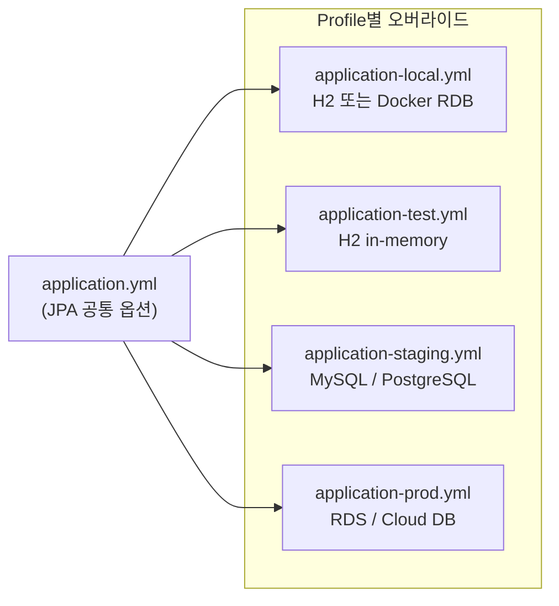
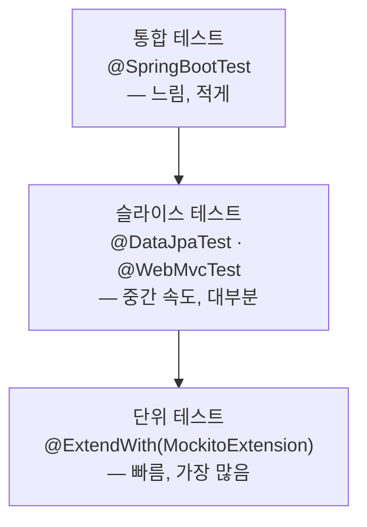

## 서론

1편에서 Controller · Service · Repository · Domain 4계층을 어떻게 나누는지를 다뤘다.

계층 설계 다음으로 평가자가 가장 많이 지적하는 영역은 <strong>Database 설정과 테스트 전략</strong>이다.

기능은 동작하는데 환경별 DB가 분리되지 않거나, 테스트가 전부 `@SpringBootTest`로 도배되거나, Mock을 무분별하게 남용하면 감점이 이어진다.

2편은 그 두 번째 축을 다룬다. 어떤 환경에 어떤 DB를 쓸지, `ddl-auto`는 환경마다 어떻게 달라야 하는지를 먼저 살핀다.

그 다음으로 테스트 어노테이션 선택 기준, Mock·Fake·실제 객체의 트레이드오프를 다루고, H2가 숨기는 버그를 Testcontainers로 잡는 방법으로 마무리한다.

대상 독자는 1편을 읽었거나 4계층 구조는 이미 아는 주니어 백엔드 개발자다. 읽고 나면 환경별 DB 설정과 테스트 계층 선택에서 망설이지 않게 된다.

[이전 글](/blog/spring-boot-pre-interview-guide-1)에서 4계층 설계를 먼저 익히고 오면 더 좋다.

- 1편 — [Core Application Layer](/blog/spring-boot-pre-interview-guide-1)
- <strong>2편 — Database & Testing (이 글)</strong>
- 3편 — [Documentation & AOP](/blog/spring-boot-pre-interview-guide-3)
- 4편 — [Performance & Optimization](/blog/spring-boot-pre-interview-guide-4)
- 5편 — [Security & Authentication](/blog/spring-boot-pre-interview-guide-5)
- 6편 — [DevOps & Deployment](/blog/spring-boot-pre-interview-guide-6)
- 7편 — [Advanced Patterns](/blog/spring-boot-pre-interview-guide-7)

---

## TL;DR

- <strong>환경별 DB 선택과 ddl-auto는 글로벌 설정이 아니다</strong> — 로컬은 `create-drop` + H2, 테스트는 `create-drop` + H2, 스테이징은 `validate`, 운영은 `none` + Flyway/Liquibase. 환경마다 `application-{profile}.yml`로 분리한다.
- <strong>Memory Repository ≠ JPA Repository</strong> — `AtomicLong`으로 ID를 생성하고, `findById()` 반환 시 방어적 복사를 해야 외부 수정이 저장소에 영향을 주지 않는다. 페이징도 직접 구현해야 한다.
- <strong>Test Pyramid — `@SpringBootTest`는 예외, 슬라이스 테스트가 기본</strong> — Repository는 `@DataJpaTest`, Controller는 `@WebMvcTest`, 순수 단위는 `@ExtendWith(MockitoExtension.class)`. `@SpringBootTest`는 E2E 시나리오 한두 개에만 쓴다.
- <strong>Mock은 경계에만, 내부 의존은 Fake나 실제 객체로</strong> — 외부 API·시간처럼 제어 불가능한 것만 Mock하고, Repository 의존이 많은 Service는 Fake Repository로 테스트한다. 과도한 Mock은 테스트가 구현 세부사항만 검증하게 만든다.
- <strong>H2 방언 차이가 버그를 가린다면 Testcontainers</strong> — 네이티브 쿼리·DB 전용 함수·JSON 컬럼 등을 쓸 때는 실제 MySQL/PostgreSQL 컨테이너로 검증한다. CRUD만 있는 과제에서는 H2로 충분하다.

---

## 1. Database 환경 매트릭스 — 로컬·테스트·운영 분리

### 1.1 환경별 DB 선택 기준

환경마다 DB 선택과 `ddl-auto` 정책이 달라야 한다. 아래 표가 기준이다.

| 환경 | DB 선택 | ddl-auto | 프로파일 | 이유 |
|------|---------|----------|----------|------|
| 로컬 개발 | H2 또는 Docker RDB | `create-drop` (H2) / `update` (RDB) | `local` | 빠른 개발 사이클, 스키마 자동 생성 |
| 테스트 | H2 | `create-drop` | `test` | 매 테스트마다 깨끗한 상태 보장 |
| 스테이징 | Docker RDB (MySQL/PostgreSQL) | `validate` | `staging` | 스키마 불일치 조기 발견 |
| 운영 | RDS / Cloud DB | `none` | `prod` | 스키마 변경은 마이그레이션 도구로만 |

### 1.2 application.yml 패턴 — 공통 + H2 + Docker RDB

`application.yml`에 공통 설정을 두고, 프로파일별 파일에서 DB를 오버라이드하는 패턴이 표준이다.



**공통 설정 (application.yml)**

```yaml
spring:
  jpa:
    show-sql: true
    properties:
      hibernate:
        format_sql: true
        default_batch_fetch_size: 100
    open-in-view: false
```

**로컬 H2 설정 (application-local.yml)**

```yaml
spring:
  datasource:
    url: jdbc:h2:mem:localdb;DB_CLOSE_DELAY=-1
    driver-class-name: org.h2.Driver
    username: sa
    password:
  h2:
    console:
      enabled: true
      path: /h2-console
  jpa:
    hibernate:
      ddl-auto: create-drop
```

**테스트 H2 설정 (application-test.yml)**

```yaml
spring:
  datasource:
    url: jdbc:h2:mem:testdb;DB_CLOSE_DELAY=-1;DB_CLOSE_ON_EXIT=FALSE
    driver-class-name: org.h2.Driver
    username: sa
    password:
  jpa:
    hibernate:
      ddl-auto: create-drop
    show-sql: false
```

**Docker RDB 설정 (application-staging.yml 예시)**

```yaml
spring:
  datasource:
    url: jdbc:mysql://localhost:3306/app
    driver-class-name: com.mysql.cj.jdbc.Driver
    username: app
    password: secret
  jpa:
    hibernate:
      ddl-auto: validate
```

<details>
<summary><strong>docker-compose.yml (MySQL + PostgreSQL)</strong></summary>

```yaml
services:
  mysql-db:
    container_name: mysql-db
    image: mysql:8.0
    restart: unless-stopped
    environment:
      MYSQL_ROOT_PASSWORD: ${MYSQL_ROOT_PASSWORD:-rootpassword}
      MYSQL_DATABASE: testdb
      MYSQL_USER: ${MYSQL_USER:-user}
      MYSQL_PASSWORD: ${MYSQL_PASSWORD:-password}
      TZ: Asia/Seoul
    ports:
      - "3306:3306"
    volumes:
      - db_data:/var/lib/mysql
    command:
      - --character-set-server=utf8mb4
      - --collation-server=utf8mb4_unicode_ci
    healthcheck:
      test: ["CMD", "mysqladmin", "ping", "-h", "localhost"]
      interval: 10s
      timeout: 5s
      retries: 5

volumes:
  db_data:
```

</details>

### 1.3 ddl-auto와 마이그레이션 도구 — 운영 안전 가이드

<strong>ddl-auto</strong>는 Hibernate가 애플리케이션 시작 시 스키마를 어떻게 다룰지 결정하는 옵션이다.

| 값 | 동작 | 사용 환경 |
|----|------|----------|
| `create` | 시작 시 테이블 새로 생성 (기존 데이터 삭제) | 절대 운영 금지 |
| `create-drop` | 시작 시 생성, 종료 시 삭제 | 로컬·테스트 |
| `update` | 변경된 스키마만 반영 (컬럼 삭제는 안 됨) | 로컬만, 운영 금지 |
| `validate` | 엔티티와 테이블 매핑 검증만 수행 | 스테이징 |
| `none` | 아무 작업도 하지 않음 | 운영 |

운영에서 `ddl-auto`를 벗어나는 시점은 명확하다. <strong>팀에 DB가 생기는 순간부터 마이그레이션 도구를 써야 한다.</strong>

| 항목 | Flyway | Liquibase |
|------|--------|-----------|
| 마이그레이션 방식 | SQL 파일 기반 | XML/YAML/JSON/SQL 지원 |
| 파일 명명 | `V1__init.sql`, `V2__add_column.sql` | `changelog.xml` |
| 롤백 | 유료 버전에서 지원 | 무료 버전에서 지원 |
| 러닝커브 | 낮음 (SQL만 알면 됨) | 중간 (추상화 레이어 존재) |
| Spring Boot 통합 | `spring-boot-starter-flyway` | `spring-boot-starter-liquibase` |

> <strong>참고</strong>: 사전과제에서 마이그레이션 도구까지 도입할 필요는 없다. 로컬·테스트는 `create-drop`, Docker RDB 스테이징은 `validate`로 충분하다.
> 단, 왜 운영에서 `update`를 쓰면 안 되는지는 설명할 수 있어야 한다.

### 1.4 참고: Memory Repository 구현 시 주의사항

과제에서 "순수 메모리 저장소"를 요구하는 경우, 흔히 빠지는 함정이 세 가지다.

**1. ID 생성 — `AtomicLong`을 써야 한다**

```java
// ❌ 잘못된 예 — 동시성 문제
private long sequence = 0;
product.setId(++sequence);  // Race condition 발생 가능

// ✅ 올바른 예
private final AtomicLong sequence = new AtomicLong(0);
product.setId(sequence.incrementAndGet());
```

**2. 방어적 복사 — 반환값이 저장소 원본을 노출하면 안 된다**

```java
// ❌ 위험 — 외부에서 수정하면 저장소 데이터도 바뀜
return store.get(id);

// ✅ 안전 — 새 객체로 복사해서 반환
return store.get(id).copy();  // 또는 new Product(store.get(id))
```

JPA는 영속성 컨텍스트가 변경 감지를 책임지지만, Memory Repository에는 그 메커니즘이 없다. 방어적 복사 없이는 테스트가 저장소 상태를 오염시킨다.

**3. 페이징 — 직접 구현해야 한다**

```java
public Page<Product> findAll(Pageable pageable) {
    List<Product> all = new ArrayList<>(store.values());
    int start = (int) pageable.getOffset();
    int end = Math.min(start + pageable.getPageSize(), all.size());
    return new PageImpl<>(all.subList(start, end), pageable, all.size());
}
```

| 항목 | Memory Repository | JPA Repository |
|------|:-----------------:|:--------------:|
| ID 자동 생성 | `AtomicLong` 직접 구현 | `@GeneratedValue` |
| 변경 감지 | 방어적 복사 필요 | 영속성 컨텍스트 |
| 페이징 | `PageImpl` 직접 구현 | Spring Data 제공 |

---

## 2. JPA & Querydsl 설정

### 2.1 application.yml 핵심 옵션

공통 `application.yml`에 들어가는 JPA 옵션들이다. 각 옵션을 왜 설정하는지가 중요하다.

| 옵션 | 권장값 | 이유 |
|------|--------|------|
| `show-sql` | `true` (개발), `false` (운영) | SQL 가시성 — 운영에선 성능·보안 이슈 |
| `format_sql` | `true` | 쿼리 가독성 |
| `default_batch_fetch_size` | `100` | N+1 문제 완화 (IN 쿼리로 일괄 로딩) |
| `open-in-view` | `false` | OSIV를 끄면 트랜잭션 범위 밖 지연 로딩 예외가 즉시 드러남 |
| `naming.physical-strategy` | 기본값(snake_case) 유지 | 엔티티 필드명과 컬럼명이 자동으로 매핑됨 |

> <strong>참고</strong>: `open-in-view`의 기본값은 `true`다.
> `true`이면 HTTP 요청 전 구간에서 영속성 컨텍스트가 열려 지연 로딩이 자유롭지만, DB 커넥션을 오래 점유한다.
> 사전과제에서는 `false`로 설정하고, Service 계층 안에서 Fetch 조인으로 필요한 연관 엔티티를 처리하는 패턴이 더 나은 평가를 받는다.

### 2.2 Querydsl 도입 시점과 Q-Class 생성

<strong>Querydsl</strong>은 타입 안전한 JPQL을 빌더 패턴으로 작성할 수 있게 해 주는 라이브러리다.

Querydsl을 도입하는 시점의 기준은 다음과 같다.

| 기준 | Spring Data JPA 메서드만 | Querydsl 필요 |
|------|:---:|:---:|
| 조건이 1~2개인 단순 쿼리 | ✅ | — |
| 조건이 3개 이상이거나 동적 | — | ✅ |
| 집계·서브쿼리·다중 조인 | — | ✅ |
| 정렬·페이징이 동적으로 바뀜 | — | ✅ |

**JPAQueryFactory Bean 등록 (Kotlin)**

```kotlin
@Configuration(proxyBeanMethods = false)
class QuerydslConfig(
    private val entityManager: EntityManager
) {
    @Bean
    fun jpaQueryFactory(): JPAQueryFactory = JPAQueryFactory(entityManager)
}
```

**build.gradle.kts 의존성**

```kotlin
dependencies {
    implementation("com.querydsl:querydsl-jpa:5.0.0:jakarta")
    kapt("com.querydsl:querydsl-apt:5.0.0:jakarta")
}
```

Q-Class는 빌드 시 `kapt`가 엔티티 클래스를 스캔하여 자동 생성한다. 생성 경로는 `build/generated/source/kapt/main` 이며, `.gitignore`에 추가한다.

### 2.3 참고: `@Configuration(proxyBeanMethods = false)`의 의미

> <strong>결론</strong>: 새로 작성하는 설정 클래스는 기본적으로 `proxyBeanMethods = false`로 둔다. default(`true`)는 "한 `@Bean` 메서드 본문이 같은 클래스의 다른 `@Bean` 메서드를 직접 호출"할 때만 필요한데, 그런 코드 자체가 안티패턴이다. 의존성은 매개변수로 주입받는 게 정답이고, 그렇게 쓰면 `false`가 항상 안전하면서 더 가볍다. Spring Boot의 모든 auto-configuration이 `false`를 쓰는 이유다.

<strong>`proxyBeanMethods`</strong>는 Spring이 `@Configuration` 클래스를 CGLIB으로 감쌀지를 결정하는 플래그다. 기본값은 `true`(Full mode)이고, `false`로 끄면 Lite mode로 동작한다. 이름은 단순한 최적화 스위치 같지만, 실제로는 `@Bean` 메서드 호출의 의미 자체를 바꾸는 설정이다. 아래에서 그 의미를 따라가 본다.

<strong>Full mode(기본) — CGLIB 프록시가 하는 일</strong>

`@Configuration` 클래스는 컨텍스트 기동 시 CGLIB이 런타임에 동적으로 상속받은 서브클래스를 만든다. 이 서브클래스가 모든 `@Bean` 메서드를 오버라이드해서 호출을 가로챈다. 오버라이드된 메서드는 다음과 같이 동작한다.

1. BeanFactory에 같은 이름의 싱글톤이 이미 등록돼 있으면, 원본을 호출하지 않고 캐시된 인스턴스를 반환한다.
2. 등록돼 있지 않으면 `super.<beanMethod>()`로 원본을 한 번 호출하고, 결과를 BeanFactory에 등록한 뒤 반환한다.

덕분에 `@Bean` 메서드끼리 서로를 호출해도(inter-bean method reference) 싱글톤이 깨지지 않는다.

```kotlin
@Configuration  // proxyBeanMethods = true (기본값)
class AppConfig {
    @Bean fun repo(): Repo = Repo()
    @Bean fun service(): Service = Service(repo())  // ← 프록시가 가로채서 캐시된 Repo 반환
}
```

`service()` 안의 `repo()`는 일반 메서드 호출처럼 보이지만, 실제로는 CGLIB 서브클래스의 오버라이드된 `repo()`로 라우팅된다. 그래서 `repo()`를 몇 번 호출하든 같은 인스턴스가 돌아온다.

<strong>Lite mode(`proxyBeanMethods = false`) — 프록시를 만들지 않는다</strong>

`@Bean` 메서드는 그냥 정적 팩토리 메서드처럼 컨테이너가 한 번씩 호출할 뿐이다. 클래스 안에서 다른 `@Bean` 메서드를 직접 호출하면, 그건 진짜 자기 자신의 메서드 호출이고 매번 새 인스턴스가 만들어진다.

```kotlin
@Configuration(proxyBeanMethods = false)
class AppConfig {
    @Bean fun repo(): Repo = Repo()
    @Bean fun service(): Service = Service(repo())  // ← 프록시 없음 → 새 Repo 생성!
}
```

이 코드는 컨테이너가 등록하는 `repo` 빈과, `service()` 내부에서 직접 호출돼 만들어진 또 다른 `Repo`가 공존하게 된다. inter-bean 호출이 있을 때 Lite mode를 쓰면 안 되는 이유다.

대신 의존성은 매개변수로 주입받으면 안전하다.

```kotlin
@Configuration(proxyBeanMethods = false)
class AppConfig {
    @Bean fun repo(): Repo = Repo()
    @Bean fun service(repo: Repo): Service = Service(repo)  // ← 컨테이너가 주입
}
```

<strong>Full vs Lite 비교</strong>

| 항목 | Full mode (기본값) | Lite mode (`false`) |
|------|-------------------|---------------------|
| CGLIB 프록시 | 생성 | 생성 안 함 |
| inter-bean 메서드 호출 | 싱글톤 보장 | 매번 새 인스턴스 |
| 클래스 제약 | `final` 불가, 인자 없는 생성자 필요 | 제약 없음 (`final`, `data class`, `private constructor` 모두 가능) |
| 시작 시간 | 프록시 생성 비용 만큼 느림 | 더 빠름 |
| 메모리 | 클래스당 추가 서브클래스 | 추가 없음 |
| 권장 시점 | @Bean끼리 호출이 있는 전통적 설정 | 단순 빈 등록, 매개변수 주입 사용 시 |

<strong>그래서 어떻게 쓰면 되는가</strong>

| 상황 | 설정 |
|------|------|
| 새 코드를 쓸 때 | <strong>`proxyBeanMethods = false`</strong>로 시작. 의존성은 매개변수로 주입. |
| `@Bean` 본문에서 다른 `@Bean`을 직접 호출해야만 하는 드문 경우 | default(`true`) — 다만 매개변수 주입으로 리팩터링하는 쪽이 거의 항상 더 낫다 |
| 이미 inter-bean 호출이 있는 레거시 설정 클래스 | default(`true`) — `false`로 바꾸려면 호출 구조부터 매개변수 주입으로 변환 |

<strong>한 줄 판정</strong>: 같은 클래스 안에서 `@Bean` 메서드끼리 본문에서 직접 호출하는 줄이 있는가? 없으면(=거의 모든 경우) `false`. 있으면 default 또는 리팩터링.

위 `QuerydslConfig`는 `@Bean`이 하나뿐이라 자명하게 안전하다. Spring Boot의 auto-configuration이 거의 전부 `proxyBeanMethods = false`를 쓰는 이유도 같다 — 각 설정 클래스가 보통 한두 개 빈만 등록하고, 의존성은 매개변수로 받기 때문이다. 시작 시간 단축 효과는 클래스 하나로는 미미하지만, 수백 개의 auto-configuration 클래스가 누적되면 의미 있는 차이가 된다.

---

## 3. Test Pyramid — 어노테이션 선택 기준

### 3.1 Test Pyramid

테스트는 피라미드 구조를 따른다. 아래로 갈수록 수가 많고 빠르며, 위로 갈수록 수가 적고 느리다.



사전과제에서 흔히 보이는 실수는 모든 테스트를 `@SpringBootTest`로 작성하는 것이다. `@SpringBootTest`는 전체 ApplicationContext를 로드하므로 느리고 무겁다.

슬라이스 테스트를 기본으로 쓰고, `@SpringBootTest`는 주요 E2E 시나리오 한두 개로 제한한다.

### 3.2 어노테이션 비교 표

| 어노테이션 | 로드 범위 | 속도 | 사용 시점 |
|-----------|----------|------|----------|
| `@ExtendWith(MockitoExtension.class)` | 없음 (순수 JUnit) | 가장 빠름 | 의존성이 없는 순수 로직 |
| `@DataJpaTest` | JPA 관련 빈만 | 빠름 | Repository 쿼리 검증 |
| `@WebMvcTest` | MVC 관련 빈만 | 빠름 | Controller HTTP 응답 검증 |
| `@SpringBootTest` | 전체 컨텍스트 | 느림 | E2E, 여러 계층 통합 |

`@DataJpaTest`와 `@WebMvcTest`는 각각 `@Transactional`이 기본 적용되어 테스트 종료 후 자동 롤백된다.

### 3.3 테스트 대역(Test Double) — Dummy·Stub·Spy·Mock·Fake

테스트의 첫 원칙: <strong>가능하면 실제 객체를 쓴다.</strong> 실제 객체로 다룰 수 없는 의존성(외부 API, 시간, 메시지 큐, 메일 발송 등)을 위해 가짜 객체를 쓰며, 이 가짜 객체들을 통틀어 <strong>테스트 대역(Test Double)</strong>이라고 한다. 흔히 "Mock"으로 뭉뚱그려 부르지만 실제로는 다섯 종류로 나뉘고 쓰임이 다르다.

| 종류 | 한 줄 정의 | 대표 예시 |
|------|-----------|----------|
| Dummy | 호출되지 않을 인자 자리만 채우는 객체 | `null`, 빈 더미 객체 |
| Stub | 정해진 값만 돌려주는 단순 대역 | Mockito `when().thenReturn()` |
| Spy | 실제 객체를 감싸 호출 기록·일부만 가로챔 | Mockito `@Spy`, `spy()` |
| Mock | 호출 자체(횟수·인자)를 검증하는 대역 | Mockito `@Mock` + `verify()` |
| Fake | 단순화된 진짜 구현체 (메모리 등) | 직접 구현한 `FakeProductRepository` |

<strong>Stub vs Mock — 라이브러리는 같지만 의도가 다르다</strong>

Mockito의 `mock()`은 라이브러리 레벨에서 Stub과 Mock을 구분하지 않는다. 둘을 가르는 건 사용자가 `verify()`를 쓰느냐다.

- 호출 결과만 정의하고 호출 여부를 검증하지 않으면 → <strong>Stub</strong>
- `verify()`로 호출 횟수·인자를 단언하면 → <strong>Mock</strong>

```kotlin
// Stub — 시간 고정. 호출 자체는 신경 쓰지 않음
val clock = mock<Clock>()
whenever(clock.now()).thenReturn(Instant.parse("2026-01-01T00:00:00Z"))

// Mock — 메일이 정확히 이 인자로 발송됐는지가 본질
val mailer = mock<Mailer>()
service.signUp(request)
verify(mailer).send(eq("welcome"), eq(request.email))
```

외부 API, 메일 발송, 메시지 큐처럼 사이드 이펙트가 있는 경계는 Mock이 자연스럽다. 단순히 "값 하나 받아오는" 의존성은 Stub으로 충분하다.

<strong>Spy — 실제 객체를 감싸고 일부만 가로챈다</strong>

Spy는 실제 객체의 동작을 그대로 유지하면서, 일부 메서드만 stub으로 덮거나 호출 이력을 검증할 수 있게 해 주는 대역이다. Mock이 "처음부터 빈 껍데기"라면, Spy는 "진짜 객체 위에 부분 가짜를 덧씌운 것"에 가깝다.

```kotlin
val realRepo = JpaProductRepository(em)
val spy = spy(realRepo)

doReturn(emptyList<Product>()).whenever(spy).findAll()  // 일부 메서드만 stub
spy.save(product)                                        // 나머지는 실제 동작 그대로
verify(spy).save(product)                                // 호출도 검증
```

Spy가 적합한 상황:

- 레거시 코드에서 일부 메서드만 가짜로 바꾸고 나머지는 실제 동작을 유지해야 할 때.
- 호출 이력은 검증하고 싶지만 전체를 Mock으로 바꾸면 stub 설정이 과도하게 늘어날 때.

> <strong>주의</strong>: 새 코드에서 Spy를 자주 쓰고 있다면 설계 신호일 수 있다. 클래스의 책임이 너무 크거나 의존성 주입 경계가 잘못 잡혀 있을 가능성이 높다. 인터페이스를 분리해 Mock 또는 Fake로 대체하거나, 책임을 쪼개는 리팩터링을 먼저 검토한다.

<strong>Fake — 단순화된 진짜 구현체</strong>

인터페이스를 그대로 구현하되 메모리(또는 단순 자료구조)로 동작한다. Repository처럼 호출이 많고 결과를 다음 단계에서 다시 읽어야 하는 의존성에는 Mock보다 Fake가 적합하다. 이유는 아래 안티패턴에서 본다.

<strong>실제 객체</strong>

Repository는 `@DataJpaTest` + 실제 H2 또는 Testcontainers로 검증한다. 도메인 계층의 값 객체(VO)·엔티티는 거의 항상 실제 객체를 그대로 쓴다.

**과도한 Mock 사용의 안티패턴**

```java
// ❌ 과도한 Mock — 테스트가 구현 세부사항만 검증함
given(repository.save(any())).willReturn(product);
given(repository.findById(1L)).willReturn(Optional.of(product));

Product saved = service.create(request);
Product found = service.find(1L);

// Mock이 같은 객체를 반환하도록 설정했기 때문에 항상 성공
// 실제 저장·조회 로직은 검증하지 못함
assertThat(found.getId()).isEqualTo(saved.getId());
```

**Fake Repository로 개선**

먼저 `FakeProductRepository`의 정체를 명확히 해 두자. JPA Repository 인터페이스를 그대로 구현하되, DB 대신 `Map`으로 동작한다.

```java
class FakeProductRepository implements ProductRepository {
    private final Map<Long, Product> store = new HashMap<>();
    private long sequence = 0L;

    @Override
    public Product save(Product product) {
        long id = product.getId() != null ? product.getId() : ++sequence;
        Product saved = new Product(id, product.getName(), product.getPrice());
        store.put(id, saved);
        return saved;
    }

    @Override
    public Optional<Product> findById(Long id) {
        return Optional.ofNullable(store.get(id));
    }
}
```

이 가짜 객체는 JPA 없이도 실제 Repository의 핵심 계약 — <strong>저장하면 ID가 부여되고, 그 ID로 다시 조회하면 같은 데이터가 나온다</strong> — 을 그대로 따른다. 이걸로 Service를 검증하면:

```java
// ✅ Fake Repository 사용 — 실제 저장·조회 동작을 검증
class ProductServiceTest {
    private ProductService service;
    private FakeProductRepository repository;

    @BeforeEach
    void setUp() {
        repository = new FakeProductRepository();
        service = new ProductService(repository);
    }

    @Test
    void 상품_저장_후_조회() {
        CreateProductRequest request = new CreateProductRequest("상품", 1000);

        Long savedId = service.create(request);
        Product found = service.findById(savedId);

        assertThat(found.getName()).isEqualTo("상품");
    }
}
```

테스트 흐름은 다음과 같다.

1. `service.create(request)` → 내부에서 `repository.save(product)`를 호출 → Fake가 ID를 부여하고 `store`에 넣은 뒤 저장된 Product를 반환 → Service가 그 ID를 호출자에게 돌려준다.
2. `service.findById(savedId)` → `repository.findById(savedId)` 호출 → Fake가 `store`에서 같은 인스턴스를 꺼내 온다.
3. 돌아온 Product의 `name`이 처음 요청한 `"상품"`과 같은지 검증.

이 테스트가 통과하려면 ProductService가 다음 세 가지를 모두 제대로 해야 한다.

- (a) `request.name`을 새 Product에 옮겨 담기.
- (b) `save`의 결과에서 ID를 추출해 호출자에게 반환.
- (c) `findById`에 같은 ID를 그대로 전달.

셋 중 하나라도 빠지면 테스트가 깨진다. 예컨대 Service가 실수로 빈 문자열을 이름으로 넣어 저장한다면 마지막 `assertThat`이 실패한다.

반면 위쪽 Mock 버전은 `save()`와 `findById()`가 모두 사전에 만들어 둔 `product` 객체를 그대로 돌려주도록 stub돼 있어서, ProductService가 request를 통째로 무시하고 빈 Product를 만들어도 테스트는 그대로 통과한다. <strong>"구현 세부사항만 검증한다"는 말의 구체적 의미가 이것이다 — Mock이 돌려주는 값이 이미 정답이므로, 실제 로직이 무엇을 하든 테스트는 항상 같은 답에 도달한다.</strong>

| 테스트 대상 | 권장 방식 |
|------------|----------|
| Repository | 실제 DB (`@DataJpaTest` 또는 Testcontainers) |
| Service | Fake Repository 또는 `@SpringBootTest` |
| Controller | Mock Service (`@WebMvcTest`) |
| 외부 API 연동 | Mock (WireMock, Mockito) |
| 시간·랜덤 | Stub (`Clock`, `Random` 주입 후 고정값) |
| 도메인 객체 (VO·엔티티) | 실제 객체 |
| 레거시 부분 교체 | Spy (임시 — 리팩터링 후 Mock/Fake로) |

---

## 4. 계층별 테스트 패턴

### 4.1 Repository — `@DataJpaTest`로 쿼리 검증

**Java**

```java
@DataJpaTest
class ProductRepositoryTest {

    @Autowired
    private ProductRepository productRepository;

    @Test
    @DisplayName("상품 저장 테스트")
    void saveProduct() {
        // given
        Product product = new Product("테스트 상품", 10000);

        // when
        Product saved = productRepository.save(product);

        // then
        assertThat(saved.getId()).isNotNull();
        assertThat(saved.getName()).isEqualTo("테스트 상품");
    }

    @Test
    @DisplayName("상품 조회 테스트")
    void findById() {
        // given
        Product product = productRepository.save(new Product("테스트 상품", 10000));

        // when
        Optional<Product> found = productRepository.findById(product.getId());

        // then
        assertThat(found).isPresent();
        assertThat(found.get().getName()).isEqualTo("테스트 상품");
    }
}
```

**Kotlin + Kotest FunSpec**

```kotlin
@DataJpaTest
class ProductRepositoryTest(
    private val productRepository: ProductRepository
) : FunSpec({

    test("상품 저장") {
        val product = Product(name = "테스트 상품", price = 10000)
        val saved = productRepository.save(product)

        saved.id shouldNotBe null
        saved.name shouldBe "테스트 상품"
    }
})
```

### 4.2 Service — Mock과 Fake의 트레이드오프

**Java + Mockito (Mock 방식)**

```java
@ExtendWith(MockitoExtension.class)
class ProductServiceTest {

    @Mock
    private ProductRepository productRepository;

    @InjectMocks
    private ProductService productService;

    @Test
    @DisplayName("상품 생성 테스트")
    void createProduct() {
        // given
        ProductRequest request = new ProductRequest("테스트 상품", 10000);
        Product product = new Product(1L, "테스트 상품", 10000);
        given(productRepository.save(any(Product.class))).willReturn(product);

        // when
        ProductResponse response = productService.create(request);

        // then
        assertThat(response.getName()).isEqualTo("테스트 상품");
        verify(productRepository, times(1)).save(any(Product.class));
    }
}
```

**Kotlin + MockK BehaviorSpec (Mock 방식)**

```kotlin
class ProductServiceTest : BehaviorSpec({

    val productRepository = mockk<ProductRepository>()
    val productService = ProductService(productRepository)

    Given("상품 생성 요청이 주어졌을 때") {
        val request = ProductRequest(name = "테스트 상품", price = 10000)
        val product = Product(id = 1L, name = "테스트 상품", price = 10000)
        every { productRepository.save(any()) } returns product

        When("상품을 생성하면") {
            val response = productService.create(request)

            Then("상품이 정상적으로 생성된다") {
                response.name shouldBe "테스트 상품"
                verify(exactly = 1) { productRepository.save(any()) }
            }
        }
    }
})
```

**Fake Repository 패턴 — Repository 의존이 많은 Service에 적합**

```java
class ProductServiceFakeTest {
    private ProductService service;
    private FakeProductRepository repository;

    @BeforeEach
    void setUp() {
        repository = new FakeProductRepository();
        service = new ProductService(repository);
    }

    @Test
    void 상품_저장_후_조회() {
        Long savedId = service.create(new CreateProductRequest("상품", 1000));
        Product found = service.findById(savedId);
        assertThat(found.getName()).isEqualTo("상품");
    }
}
```

Fake Repository는 `ProductRepository` 인터페이스를 구현한 메모리 저장소다. Mock과 달리 실제 저장·조회 동작이 일어난다.

덕분에 "저장 후 조회" 시나리오를 자연스럽게 검증할 수 있다.

### 4.3 Controller — `@WebMvcTest` + MockMvc

**Java**

```java
@WebMvcTest(ProductController.class)
class ProductControllerTest {

    @Autowired
    private MockMvc mockMvc;

    @MockBean
    private ProductService productService;

    @Autowired
    private ObjectMapper objectMapper;

    @Test
    @DisplayName("상품 생성 API 테스트")
    void createProduct() throws Exception {
        // given
        ProductRequest request = new ProductRequest("테스트 상품", 10000);
        ProductResponse response = new ProductResponse(1L, "테스트 상품", 10000);
        given(productService.create(any())).willReturn(response);

        // when & then
        mockMvc.perform(post("/api/products")
                .contentType(MediaType.APPLICATION_JSON)
                .content(objectMapper.writeValueAsString(request)))
            .andExpect(status().isCreated())
            .andExpect(jsonPath("$.id").value(1))
            .andExpect(jsonPath("$.name").value("테스트 상품"));
    }
}
```

**Kotlin + Kotest DescribeSpec**

```kotlin
@WebMvcTest(ProductController::class)
class ProductControllerKotestTest(
    private val mockMvc: MockMvc,
    @MockkBean private val productService: ProductService
) : DescribeSpec({

    val objectMapper = ObjectMapper().registerModule(JavaTimeModule())

    describe("POST /api/v1/products") {
        context("유효한 요청이 주어지면") {
            it("201 Created와 생성된 상품 ID를 반환한다") {
                val request = RegisterProductRequest(name = "테스트 상품", price = 10000)
                every { productService.registerProduct(any()) } returns 1L

                mockMvc.perform(
                    post("/api/v1/products")
                        .contentType(MediaType.APPLICATION_JSON)
                        .content(objectMapper.writeValueAsString(request))
                )
                    .andExpect(status().isCreated)
                    .andExpect(jsonPath("$.data").value(1))
            }
        }

        context("상품명이 비어있으면") {
            it("400 Bad Request를 반환한다") {
                val invalidRequest = mapOf("name" to "", "price" to 10000)

                mockMvc.perform(
                    post("/api/v1/products")
                        .contentType(MediaType.APPLICATION_JSON)
                        .content(objectMapper.writeValueAsString(invalidRequest))
                )
                    .andExpect(status().isBadRequest)
            }
        }
    }
})
```

> <strong>참고</strong>: Kotlin MockMvc 테스트에서 `@MockkBean`을 사용하려면 `spring-mockk` 의존성이 필요하다.
>
> ```kotlin
> // build.gradle.kts
> testImplementation("com.ninja-squad:springmockk:4.0.2")
> ```

### 4.4 참고: Kotlin + Kotest BDD 스타일 — Spec 유형 선택

<strong>Kotest</strong>는 Kotlin에서 사용하는 테스트 프레임워크로, JUnit과 달리 다양한 Spec 스타일을 제공한다.

| Spec | 스타일 | 적합한 상황 |
|------|--------|-----------|
| `FunSpec` | `test("name") { }` | Repository처럼 단순한 단위 테스트 |
| `BehaviorSpec` | Given-When-Then | Service처럼 시나리오 기반 테스트 |
| `DescribeSpec` | describe-context-it | Controller처럼 API 엔드포인트 그룹화 |
| `StringSpec` | `"name" { }` | 매우 단순한 테스트 |

Kotest를 도입하는 시점은 주로 <strong>Kotlin 프로젝트에서 BDD 스타일의 표현력이 필요할 때</strong>다.

`@DataJpaTest`와 `@WebMvcTest`는 Kotest Spec과도 잘 통합된다.

---

## 5. Testcontainers — 운영 DB와 동일한 검증

### 5.1 H2의 한계 — MySQL/PostgreSQL 방언 차이가 가리는 버그

H2는 빠르고 설정이 간단하지만, MySQL이나 PostgreSQL과 완전히 동일하지 않다. 다음 상황에서는 H2 테스트가 통과해도 운영에서 터진다.

| 상황 | 예시 |
|------|------|
| 네이티브 쿼리 | `SELECT * FROM product USE INDEX (idx_name)` — H2에서 무시됨 |
| DB 전용 함수 | `DATE_FORMAT()`, `JSON_EXTRACT()` — H2 미지원 |
| Full-text search | `MATCH AGAINST` — H2 미지원 |
| `ON DUPLICATE KEY UPDATE` | MySQL 전용 문법 |
| 인덱스 힌트·쿼리 플랜 | H2에서 실행 계획이 다름 |

### 5.2 Testcontainers 설정

**의존성 (build.gradle)**

```groovy
dependencies {
    testImplementation 'org.testcontainers:testcontainers:1.19.0'
    testImplementation 'org.testcontainers:mysql:1.19.0'
    testImplementation 'org.testcontainers:junit-jupiter:1.19.0'
}
```

**테스트 클래스 설정**

```java
@SpringBootTest
@Testcontainers
class ProductIntegrationTest {

    @Container
    static MySQLContainer<?> mysql = new MySQLContainer<>("mysql:8.0")
        .withDatabaseName("testdb")
        .withUsername("test")
        .withPassword("test");

    @DynamicPropertySource
    static void configureProperties(DynamicPropertyRegistry registry) {
        registry.add("spring.datasource.url", mysql::getJdbcUrl);
        registry.add("spring.datasource.username", mysql::getUsername);
        registry.add("spring.datasource.password", mysql::getPassword);
    }

    @Test
    void 네이티브_쿼리_검증() {
        // 실제 MySQL에서만 동작하는 쿼리 테스트
    }
}
```

### 5.3 적용 기준 — 항상 vs 핵심만

Testcontainers는 컨테이너 기동 시간 때문에 슬라이스 테스트보다 훨씬 느리다. 다음 기준으로 적용 범위를 결정한다.

| 기준 | H2로 충분 | Testcontainers 필요 |
|------|:---------:|:------------------:|
| CRUD, 단순 JPQL | ✅ | — |
| 네이티브 쿼리, DB 전용 함수 | — | ✅ |
| JSON 컬럼, Full-text search | — | ✅ |
| 운영과 동일한 쿼리 플랜 검증 | — | ✅ |
| 사전과제 수준 CRUD | ✅ | — |

> <strong>참고</strong>: CI에서 Testcontainers를 쓰려면 Docker가 필요하다.
> GitHub Actions의 `ubuntu-latest` 러너에는 Docker가 기본 설치되어 있어 별도 설정 없이 동작한다.

---

## 정리

- <strong>환경별 DB와 ddl-auto는 분리하라</strong> — `application-{profile}.yml`로 환경마다 DB와 ddl-auto 정책을 다르게 가져간다. 운영에서 `create`나 `update`는 절대 금지다.
- <strong>Memory Repository는 JPA를 흉내 내야 한다</strong> — `AtomicLong` ID 생성, 방어적 복사, 페이징 직접 구현까지 빠뜨리지 않는다.
- <strong>Test Pyramid를 따르면 테스트가 빠르고 유지 가능해진다</strong> — Repository는 `@DataJpaTest`, Controller는 `@WebMvcTest`, 순수 로직은 `@ExtendWith(MockitoExtension.class)`. `@SpringBootTest`는 E2E 한두 개로 제한한다.
- <strong>Mock은 경계에만, Fake는 내부 Repository 의존에</strong> — 외부 API·시간처럼 제어 불가능한 것만 Mock하고, 내부 Repository 의존은 Fake로 실제 저장·조회 동작을 검증한다.
- <strong>H2가 숨기는 버그는 Testcontainers로 잡는다</strong> — 네이티브 쿼리나 DB 전용 기능을 쓴다면 `@DynamicPropertySource`로 실제 MySQL/PostgreSQL 컨테이너를 연결한다.

3편에서는 API 문서화(Swagger/OpenAPI), AOP를 이용한 횡단 관심사 처리, 로깅 기반 설정을 다룬다.

Swagger UI가 단순 어노테이션 이상인 이유, `@Around` AOP로 로깅과 성능 측정을 어떻게 분리하는지를 살핀다.

[이전: 1편 - Core Application Layer](/blog/spring-boot-pre-interview-guide-1) | [다음: 3편 - Documentation & AOP](/blog/spring-boot-pre-interview-guide-3)

---

## 부록

### 의미 있는 테스트 vs 의미 없는 테스트

테스트가 없는 것보다는 낫지만, 의미 없는 테스트는 유지 비용만 높인다.

| 구분 | 예시 | 이유 |
|------|------|------|
| 의미 없음 | getter/setter 호출 후 값 일치 확인 | 컴파일러가 이미 보장함 |
| 의미 없음 | `new Product("test", 1000)` 후 `getName()` 확인 | 로직이 없음 |
| 의미 있음 | 재고 부족 시 예외 발생 여부 | 비즈니스 규칙을 검증 |
| 의미 있음 | 동일 이름 상품 저장 시 유니크 제약 위반 | DB 제약조건을 검증 |

```java
// ❌ 의미 없는 테스트
@Test
void getterTest() {
    Product p = new Product("test", 1000);
    assertThat(p.getName()).isEqualTo("test");
}

// ✅ 의미 있는 테스트
@Test
void 재고가_부족하면_예외가_발생한다() {
    Product product = new Product("test", 1000, 5);
    assertThrows(InsufficientStockException.class,
        () -> product.decreaseStock(10));
}
```

### 커버리지 가이드

<details>
<summary><strong>더 자세히 — 커버리지 목표와 사전과제 우선순위</strong></summary>

커버리지는 팀과 프로젝트마다 다르다. 일반적인 기준은 다음과 같다.

| 레이어 | 일반적인 목표 | 비고 |
|--------|------------|------|
| Service (비즈니스 로직) | 80~90% | 핵심 로직은 반드시 |
| Repository | 복잡한 쿼리만 | 단순 CRUD는 선택 |
| Controller | 주요 시나리오 | Happy path + 주요 예외 |
| Config / Util | 선택적 | 복잡한 로직이 있는 경우만 |
| 전체 | 60~80% | 팀 합의에 따라 다름 |

사전과제에서 시간이 제한적이라면 다음 우선순위를 따른다.

1. <strong>필수</strong>: Service 레이어의 핵심 비즈니스 로직 (예외 경로 포함)
2. <strong>권장</strong>: 복잡한 Querydsl 쿼리, 예외 상황 처리
3. <strong>선택</strong>: Controller, 단순 CRUD Repository

</details>
