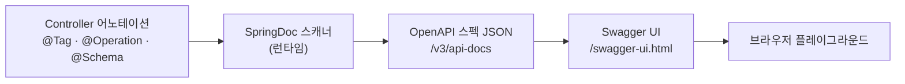
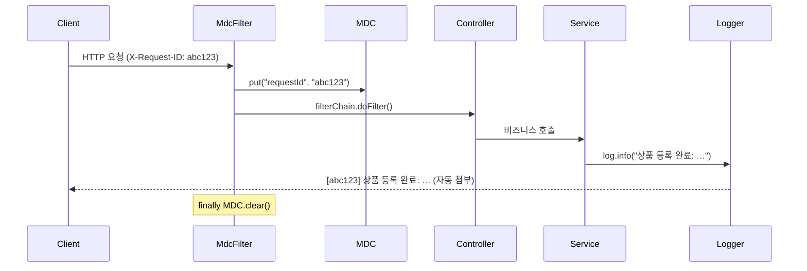
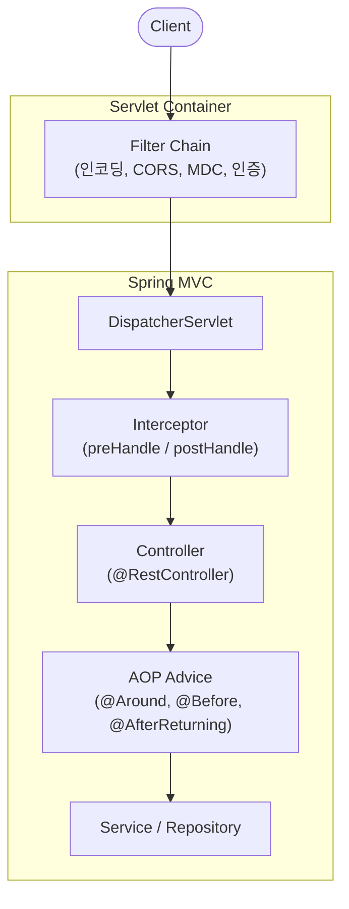

## 서론

"API 문서화, AOP, 로깅까지 신경 써야 가점이 될까?"

사전과제에서 이 영역은 명확하게 갈린다. Swagger UI가 동작하고 요청 ID가 로그에 찍히면 가점이다.

반대로 Springfox를 그대로 쓰거나, 로그 레벨을 모두 INFO로 통일하거나, AOP를 비즈니스 분기에 남용하면 감점이다.

1편은 4계층, 2편은 Database & Testing을 다뤘다. 3편은 그 위에 올라가는 <strong>운용·관측 영역</strong>이다.

평가자에게 "이 개발자는 운영 환경을 이해한다"는 신호를 어떻게 보낼 수 있는지를 다룬다.

대상 독자는 스프링은 알지만 평가자가 이 영역을 어떻게 보는지 잘 모르겠는 주니어 백엔드 개발자다.

[이전 글](/blog/spring-boot-pre-interview-guide-2)에서 Database & Testing을 먼저 다뤘다.

- 1편 — [Core Application Layer](/blog/spring-boot-pre-interview-guide-1)
- 2편 — [Database & Testing](/blog/spring-boot-pre-interview-guide-2)
- <strong>3편 — Documentation & AOP (이 글)</strong>
- 4편 — [Logging](/blog/spring-boot-pre-interview-guide-4)
- 5편 — [Authentication & Validation](/blog/spring-boot-pre-interview-guide-5)
- 6편 — [Performance](/blog/spring-boot-pre-interview-guide-6)
- 7편 — [Production Readiness](/blog/spring-boot-pre-interview-guide-7)

---

## TL;DR

- <strong>SpringDoc은 최소 문서화로 충분하다</strong> — `@Tag`, `@Operation(summary)`, 주요 `@ApiResponse`면 평가에 충분하다. 모든 필드에 `@Schema`를 채우는 건 시간 낭비다.
- <strong>로깅 성능 미신을 버려라</strong> — `{}` 플레이스홀더가 기본이다. `isDebugEnabled()` 체크는 비싼 `toString()` 호출이나 루프 안에서만 필요하다.
- <strong>MDC로 단일 앱 요청을 추적하라</strong> — 스레드 로컬에 요청 ID를 박아두면 Logback이 모든 로그에 자동으로 찍는다. 분산 추적은 과제 범위 밖이다.
- <strong>AOP는 횡단 관심사에만 쓴다</strong> — 로깅·트랜잭션·재시도는 AOP가 맞다. 비즈니스 로직 분기에 AOP를 쓰면 디버깅이 불가능해진다.
- <strong>self-invocation 함정을 반드시 알아야 한다</strong> — 같은 클래스 안에서 `@Retry` 메서드를 호출하면 프록시를 거치지 않아 AOP가 붙지 않는다. 책임을 다른 빈으로 분리하는 게 정답이다.

---

## 1. API 문서화 — SpringDoc/Swagger 운용 기준

### 1.1 SpringDoc 동작 원리와 기본 설정

<strong>SpringDoc OpenAPI = 런타임에 OpenAPI 스펙을 생성하고 Swagger UI로 서빙하는 라이브러리다.</strong>

애플리케이션이 뜰 때 `@Tag`, `@Operation`, `@Schema` 어노테이션을 스캔해 OpenAPI JSON을 만든다. 이 JSON을 `/v3/api-docs`(또는 설정한 경로)로 서빙하면, Swagger UI가 그것을 받아 브라우저에 플레이그라운드를 렌더링한다.



> <strong>참고</strong>: Springfox는 Spring Boot 2.6+부터 호환 이슈가 생겨 더 이상 사용하지 않는다. SpringDoc OpenAPI가 현재 표준이다.

<strong>버전 — Spring Boot에 맞춰 SpringDoc 라인을 고른다</strong>

SpringDoc은 Spring Boot 메이저 버전에 따라 별도 라인으로 배포된다. 과제 환경의 Spring Boot 버전을 먼저 확인하고 거기에 맞춰 잡는다.

| Spring Boot | SpringDoc 라인 | 최신 버전 (2026-05) | 비고 |
|-------------|---------------|--------------------|------|
| 4.x | `3.x` | <strong>3.0.3</strong> | Java 17+, Jakarta EE 9, OpenAPI 3.1 지원 |
| 3.x (LTS) | `2.x` | <strong>2.8.17</strong> | 2.8.7부터 BOM 제공, 여전히 활발히 유지보수 |
| 2.x | `1.x` | 1.8.0 | 레거시 — 신규 과제에서 만날 일은 거의 없음 |

**의존성 추가 (Kotlin DSL)**

```kotlin
// build.gradle.kts
dependencies {
    // Spring Boot 4.x
    implementation("org.springdoc:springdoc-openapi-starter-webmvc-ui:3.0.3")

    // Spring Boot 3.x (LTS) — 회사 코드베이스가 LTS에 묶여 있는 경우
    // implementation("org.springdoc:springdoc-openapi-starter-webmvc-ui:2.8.17")
}
```

<details>
<summary><strong>More detail — Groovy DSL 의존성</strong></summary>

```groovy
// build.gradle
dependencies {
    // Spring Boot 4.x
    implementation 'org.springdoc:springdoc-openapi-starter-webmvc-ui:3.0.3'

    // Spring Boot 3.x (LTS)
    // implementation 'org.springdoc:springdoc-openapi-starter-webmvc-ui:2.8.17'
}
```

</details>

> <strong>참고</strong>: WebFlux 환경이라면 `springdoc-openapi-starter-webflux-ui`로 교체한다. artifact 이름만 바뀔 뿐 같은 라인의 같은 버전을 그대로 쓴다.

**application.yml 주요 옵션**

| 설정 | 설명 | 기본값 |
|------|------|--------|
| `api-docs.path` | OpenAPI JSON 스펙 경로 | `/v3/api-docs` |
| `swagger-ui.path` | Swagger UI 경로 | `/swagger-ui.html` |
| `tags-sorter` | Controller 정렬 (`alpha`, 선언순) | 선언순 |
| `operations-sorter` | API 정렬 (`alpha`, `method`) | 선언순 |

```yaml
springdoc:
  api-docs:
    path: /api-docs
  swagger-ui:
    path: /swagger-ui.html
    tags-sorter: alpha
    operations-sorter: alpha
  default-consumes-media-type: application/json
  default-produces-media-type: application/json
```

**OpenApiConfig (Kotlin)**

API의 메타데이터(제목·버전·연락처·서버 URL)를 한 곳에 모아 두는 빈이다. 시작 시 컨테이너에 등록되면 SpringDoc이 자동으로 픽업해 OpenAPI 스펙에 박는다. 별도 설정이 없어도 SpringDoc은 동작하지만, 평가자가 Swagger UI를 열었을 때 비어 있는 제목·버전을 보면 "기본만 켜뒀다"는 인상을 주므로 이 빈 한 짝은 박아 두는 게 좋다.

```kotlin
@Configuration
class OpenApiConfig {

    @Bean
    fun openAPI(): OpenAPI {
        return OpenAPI()
            .info(
                Info()
                    .title("Product API")
                    .description("상품 관리 API 문서")
                    .version("v1.0.0")
                    .contact(Contact().name("Developer").email("dev@example.com"))
            )
            .servers(listOf(Server().url("http://localhost:8080").description("Local Server")))
    }
}
```

<details>
<summary><strong>More detail — OpenApiConfig (Java)</strong></summary>

```java
@Configuration
public class OpenApiConfig {

    @Bean
    public OpenAPI openAPI() {
        return new OpenAPI()
            .info(new Info()
                .title("Product API")
                .description("상품 관리 API 문서")
                .version("v1.0.0")
                .contact(new Contact().name("Developer").email("dev@example.com")))
            .servers(List.of(
                new Server().url("http://localhost:8080").description("Local Server")
            ));
    }
}
```

</details>

### 1.2 Controller·DTO 어노테이션 — "최소" vs "과다"

<strong>결론부터: `@Tag`, `@Operation(summary)`, 주요 `@ApiResponse`면 평가에 충분하다.</strong> 모든 필드에 `@Schema`를 채우는 건 시간 낭비다. Swagger 어노테이션에 쓰는 시간은 핵심 기능 완성 시간을 잠식한다.

| 항목 | 최소 (권장) | 과다 (비권장) |
|------|------------|-------------|
| API 설명 | `@Operation(summary = "…")` | `description`, 모든 에러 케이스 `@ApiResponse` |
| 파라미터 | 경로 변수에만 `@Parameter` | 모든 쿼리 파라미터 상세 기술 |
| DTO 필드 | 클래스 레벨 `@Schema(description)` | 모든 필드 `@Schema(example, minimum, maxLength)` |

**Controller 예시 (Kotlin)**

위 표의 "최소" 컬럼을 그대로 적용한 모습이다. 클래스에 `@Tag` 한 번, 메서드마다 `@Operation(summary)`와 핵심 `@ApiResponse` 두세 개, 경로 변수에는 `@Parameter`를 한 줄씩만 붙인다. 이만큼이면 Swagger UI에서 그룹·요약·응답 코드까지 깔끔하게 보인다.

```kotlin
@Tag(name = "Product", description = "상품 관리 API")
@RestController
@RequestMapping("/api/v1/products")
class ProductController(private val productService: ProductService) {

    @Operation(summary = "상품 상세 조회")
    @ApiResponses(
        ApiResponse(responseCode = "200", description = "조회 성공"),
        ApiResponse(responseCode = "404", description = "상품을 찾을 수 없음")
    )
    @GetMapping("/{productId}")
    fun findProductDetail(
        @Parameter(description = "상품 ID", example = "1")
        @PathVariable productId: Long
    ): CommonResponse<FindProductDetailResponse> {
        return CommonResponse.success(productService.findProductDetail(productId))
    }

    @Operation(summary = "상품 등록")
    @ApiResponses(
        ApiResponse(responseCode = "201", description = "등록 성공"),
        ApiResponse(responseCode = "400", description = "잘못된 요청")
    )
    @PostMapping
    @ResponseStatus(HttpStatus.CREATED)
    fun registerProduct(@RequestBody request: RegisterProductRequest): CommonResponse<Long> {
        return CommonResponse.success(productService.registerProduct(request))
    }
}
```

<details>
<summary><strong>More detail — Controller 예시 (Java)</strong></summary>

```java
@Tag(name = "Product", description = "상품 관리 API")
@RestController
@RequestMapping("/api/v1/products")
@RequiredArgsConstructor
public class ProductController {

    private final ProductService productService;

    @Operation(summary = "상품 상세 조회")
    @ApiResponses({
        @ApiResponse(responseCode = "200", description = "조회 성공"),
        @ApiResponse(responseCode = "404", description = "상품을 찾을 수 없음")
    })
    @GetMapping("/{productId}")
    public CommonResponse<FindProductDetailResponse> findProductDetail(
            @Parameter(description = "상품 ID", example = "1")
            @PathVariable Long productId) {
        return CommonResponse.success(productService.findProductDetail(productId));
    }

    @Operation(summary = "상품 등록")
    @ApiResponses({
        @ApiResponse(responseCode = "201", description = "등록 성공"),
        @ApiResponse(responseCode = "400", description = "잘못된 요청")
    })
    @PostMapping
    @ResponseStatus(HttpStatus.CREATED)
    public CommonResponse<Long> registerProduct(@RequestBody RegisterProductRequest request) {
        return CommonResponse.success(productService.registerProduct(request));
    }
}
```

</details>

**Request DTO — 가격 타입 트레이드오프**

가격 필드 타입은 과제 상황에 따라 선택하면 된다.

| 타입 | 장점 | 단점 | 권장 상황 |
|------|------|------|----------|
| `Int`/`Long` | 단순, 성능 우수 | 소수점 불가, 오버플로우 위험 | 단순 개수, ID |
| `BigDecimal` | 정밀도 보장, 소수점 처리 | 연산 복잡, 직렬화 주의 | 금액, 가격, 비율 |

아래 DTO는 표에서 `BigDecimal`을 골랐을 때의 예시이고, `@Schema`도 1.2절의 "최소" 원칙대로 클래스 레벨 한 줄 + 필드 레벨 한 줄씩만 붙였다. 모든 필드에 `example`·`minimum`·`maxLength`까지 채우는 일은 의도적으로 피했다.

```kotlin
@Schema(description = "상품 등록 요청")
data class RegisterProductRequest(
    @field:NotBlank
    @field:Size(max = 100)
    @Schema(description = "상품명", example = "맛있는 사과")
    val name: String?,

    @field:NotNull
    @field:DecimalMin(value = "0", inclusive = false)
    @Schema(description = "가격", example = "10000.00")
    val price: BigDecimal?,

    @field:NotNull
    @Schema(description = "카테고리", example = "FOOD")
    val category: ProductCategoryType?
)
```

### 1.3 Spring Security와 Swagger 경로 허용

SecurityConfig가 있으면 `/swagger-ui/**`, `/v3/api-docs/**` 가 401/403으로 막힌다. 평가자가 Swagger UI에 접근하지 못하면 점수 손해다.

```kotlin
@Configuration
@EnableWebSecurity
class SecurityConfig {

    @Bean
    fun securityFilterChain(http: HttpSecurity): SecurityFilterChain {
        return http
            .csrf { it.disable() }
            .authorizeHttpRequests { auth ->
                auth
                    .requestMatchers(
                        "/swagger-ui/**",
                        "/swagger-ui.html",
                        "/api-docs/**",
                        "/v3/api-docs/**"
                    ).permitAll()
                    .anyRequest().authenticated()
            }
            .build()
    }
}
```

<details>
<summary><strong>More detail — JWT 환경에서 bearerAuth 스키마 추가</strong></summary>

JWT 인증이 있는 경우 Swagger UI에서 토큰을 입력해 테스트할 수 있도록 bearerAuth 스키마를 추가한다.

```kotlin
@Configuration
class OpenApiConfig {

    @Bean
    fun openAPI(): OpenAPI {
        val securityScheme = SecurityScheme()
            .type(SecurityScheme.Type.HTTP)
            .scheme("bearer")
            .bearerFormat("JWT")
            .`in`(SecurityScheme.In.HEADER)
            .name("Authorization")

        val securityRequirement = SecurityRequirement().addList("bearerAuth")

        return OpenAPI()
            .info(Info().title("Product API").version("v1.0.0"))
            .addSecurityItem(securityRequirement)
            .components(Components().addSecuritySchemes("bearerAuth", securityScheme))
    }
}
```

</details>

### 1.4 참고: SpringDoc vs REST Docs — 선택 기준

<strong>과제는 SpringDoc이 정답이다.</strong> 설정이 간단하고 평가자가 Try it out으로 바로 API를 테스트할 수 있다.

REST Docs는 테스트를 통과해야만 문서가 생성되므로 코드-문서 동기화가 강제된다. 문서 정확성이 핵심인 금융·공공 API 환경에서 의미 있다.

| 비교 항목 | SpringDoc (Swagger) | REST Docs |
|----------|---------------------|-----------|
| 문서 생성 방식 | 어노테이션 기반 | 테스트 기반 |
| 문서-코드 동기화 | 수동 관리 필요 | 테스트 통과 시 자동 보장 |
| 런타임 의존성 | 있음 (운영 배포 포함) | 없음 (빌드 시에만) |
| Try it out | 기본 제공 | 별도 구현 필요 |
| 학습 곡선 | 낮음 | 높음 |
| 프로덕션 코드 침투 | 어노테이션 추가 필요 | 없음 (테스트 코드에만) |

<details>
<summary><strong>More detail — REST Docs 의존성·테스트 코드·AsciiDoc 템플릿</strong></summary>

**의존성 추가 (build.gradle.kts)**

```kotlin
plugins {
    id("org.asciidoctor.jvm.convert") version "4.0.5"
}

val asciidoctorExt: Configuration by configurations.creating
val snippetsDir by extra { file("build/generated-snippets") }

dependencies {
    asciidoctorExt("org.springframework.restdocs:spring-restdocs-asciidoctor")
    testImplementation("org.springframework.restdocs:spring-restdocs-mockmvc")
}

tasks.test { outputs.dir(snippetsDir) }

tasks.asciidoctor {
    inputs.dir(snippetsDir)
    configurations(asciidoctorExt.name)
    dependsOn(tasks.test)
}

tasks.register<Copy>("copyDocument") {
    dependsOn(tasks.asciidoctor)
    from(file("build/docs/asciidoc"))
    into(file("src/main/resources/static/docs"))
}

tasks.build { dependsOn("copyDocument") }
```

**테스트 코드 (Kotlin)**

```kotlin
@WebMvcTest(ProductController::class)
@AutoConfigureRestDocs
class ProductControllerDocsTest {

    @Autowired private lateinit var mockMvc: MockMvc
    @MockkBean private lateinit var productService: ProductService

    @Test
    @DisplayName("상품 상세 조회 API")
    fun findProductDetail() {
        val response = FindProductDetailResponse(1L, "맛있는 사과", 10000, ProductCategoryType.FOOD, true, LocalDateTime.now())
        every { productService.findProductDetail(1L) } returns response

        mockMvc.perform(get("/api/v1/products/{productId}", 1L).accept(MediaType.APPLICATION_JSON))
            .andExpect(status().isOk)
            .andDo(document("product-detail",
                pathParameters(parameterWithName("productId").description("상품 ID")),
                responseFields(
                    fieldWithPath("code").description("응답 코드"),
                    fieldWithPath("message").description("응답 메시지"),
                    fieldWithPath("data.id").description("상품 ID"),
                    fieldWithPath("data.name").description("상품명"),
                    fieldWithPath("data.price").description("가격"),
                    fieldWithPath("data.category").description("카테고리"),
                    fieldWithPath("data.enabled").description("활성화 여부"),
                    fieldWithPath("data.createdAt").description("생성일시")
                )
            ))
    }
}
```

**AsciiDoc 템플릿 (src/docs/asciidoc/index.adoc)**

```asciidoc
= Product API 문서
:doctype: book
:icons: font
:source-highlighter: highlightjs
:toc: left
:toclevels: 2

== 상품 API

=== 상품 상세 조회

operation::product-detail[snippets='path-parameters,response-fields,curl-request,http-response']
```

</details>

---

## 2. 로깅 전략 — SLF4J · MDC · 마스킹

### 2.1 Logback 설정과 프로파일 분기

<strong>Spring Boot의 기본 로깅 구현체는 Logback이다.</strong> 별도 의존성 없이 `spring-boot-starter`에 포함되어 있다.

`application.yml`에서 빠르게 설정하고, 더 세밀한 제어가 필요할 때 `logback-spring.xml`을 추가한다.

```yaml
# application.yml — 기본 로깅 설정
logging:
  level:
    root: INFO
    com.example.app: DEBUG
    org.hibernate.SQL: DEBUG
    org.hibernate.orm.jdbc.bind: TRACE
  pattern:
    console: "%d{yyyy-MM-dd HH:mm:ss.SSS} [%thread] [%X{requestId}] %-5level %logger{36} - %msg%n"
```

`logback-spring.xml`은 프로파일 분기와 파일 롤링 정책이 필요할 때 사용한다.

설계 의도는 세 가지다. <strong>(1)</strong> `<springProfile>`로 local/prod 환경별 로그 레벨을 분리해 운영 환경에서 DEBUG 노이즈를 차단한다. <strong>(2)</strong> `CONSOLE` appender는 stdout으로 흘려보내 컨테이너 로그 수집기(Docker/Kubernetes)가 받아 처리하게 한다. <strong>(3)</strong> `FILE` appender는 100MB 단위로 회전하고 30일치만 보관해 디스크 폭주를 막는다. 운영에서 흔히 마주치는 두 가지 사고(과다 로그·디스크 풀)를 설정 시점에 미리 차단하는 구조다.

```xml
<?xml version="1.0" encoding="UTF-8"?>
<configuration>
    <springProfile name="local">
        <property name="LOG_LEVEL" value="DEBUG"/>
    </springProfile>
    <springProfile name="prod">
        <property name="LOG_LEVEL" value="INFO"/>
    </springProfile>

    <appender name="CONSOLE" class="ch.qos.logback.core.ConsoleAppender">
        <encoder>
            <pattern>%d{yyyy-MM-dd HH:mm:ss.SSS} [%thread] [%X{requestId}] %-5level %logger{36} - %msg%n</pattern>
        </encoder>
    </appender>

    <appender name="FILE" class="ch.qos.logback.core.rolling.RollingFileAppender">
        <file>logs/application.log</file>
        <rollingPolicy class="ch.qos.logback.core.rolling.TimeBasedRollingPolicy">
            <fileNamePattern>logs/application.%d{yyyy-MM-dd}.%i.log</fileNamePattern>
            <timeBasedFileNamingAndTriggeringPolicy class="ch.qos.logback.core.rolling.SizeAndTimeBasedFNATP">
                <maxFileSize>100MB</maxFileSize>
            </timeBasedFileNamingAndTriggeringPolicy>
            <maxHistory>30</maxHistory>
        </rollingPolicy>
        <encoder>
            <pattern>%d{yyyy-MM-dd HH:mm:ss.SSS} [%thread] [%X{requestId}] %-5level %logger{36} - %msg%n</pattern>
        </encoder>
    </appender>

    <root level="${LOG_LEVEL:-INFO}">
        <appender-ref ref="CONSOLE"/>
        <appender-ref ref="FILE"/>
    </root>

    <logger name="com.example.app" level="DEBUG"/>
    <logger name="org.hibernate.SQL" level="DEBUG"/>
</configuration>
```

<strong>JSON 구조화 로그 — Spring Boot 3.4+ 네이티브 지원</strong>

운영 환경에서 ELK/Loki 같은 로그 수집 파이프라인에 들어가려면 JSON 포맷이 표준이다. 예전에는 `logstash-logback-encoder` 같은 외부 encoder를 logback-spring.xml에 직접 끼워야 했지만, Spring Boot 3.4부터 별도 의존성 없이 한 줄로 켤 수 있다. 4.0에서는 포맷 옵션이 더 늘었다.

```yaml
logging:
  structured:
    format:
      console: logstash   # 또는 ecs, gelf — 수집기 스펙에 맞춰 선택
```

사전과제에서 굳이 켤 필요는 없지만, "운영 시 로그 수집 파이프라인을 고려했다"는 신호로 README에 한 줄 언급하는 정도는 가점 요소가 된다.

### 2.2 로그 레벨 선택 기준

<strong>기준 한 줄: INFO에 비즈니스 이벤트, DEBUG에 디버깅용 상세, ERROR는 즉시 대응이 필요한 것만.</strong>

| 레벨 | 용도 | 예시 |
|------|------|------|
| <strong>ERROR</strong> | 즉시 대응이 필요한 오류 | DB 연결 실패, 외부 API 장애 |
| <strong>WARN</strong> | 잠재적 문제, 대응 필요 | 재시도 발생, 임계치 근접 |
| <strong>INFO</strong> | 주요 비즈니스 이벤트 | 주문 완료, 결제 성공 |
| <strong>DEBUG</strong> | 개발/디버깅용 상세 | 메서드 진입, 파라미터 값 |
| <strong>TRACE</strong> | 매우 상세한 정보 | 루프 내 값 변화 |

이 표를 메서드별로 적용하면 패턴이 자연스럽게 정해진다 — <strong>입력을 받은 직후 `debug`로 파라미터를 남기고, 비즈니스 이벤트가 완료된 시점에 `info`로 기록하고, 정상이지만 주의가 필요한 분기(예: not-found)에서 `warn`을 찍는다.</strong> 아래 ProductService가 그 패턴이다.

```kotlin
import org.springframework.data.repository.findByIdOrNull

@Service
class ProductService(private val productRepository: ProductRepository) {
    private val log = LoggerFactory.getLogger(javaClass)

    @Transactional
    fun registerProduct(command: RegisterProductCommand): Long {
        log.debug("상품 등록 요청: name={}, price={}", command.name, command.price)

        val saved = productRepository.save(Product(command.name, command.price, command.category))
        log.info("상품 등록 완료: productId={}", saved.id)

        return saved.id!!
    }

    fun findProductDetail(productId: Long): FindProductDetailResponse {
        log.debug("상품 조회: productId={}", productId)

        val product = productRepository.findByIdOrNull(productId)
            ?: run {
                log.warn("상품을 찾을 수 없음: productId={}", productId)
                throw NotFoundException()
            }

        return FindProductDetailResponse.from(product)
    }
}
```

> <strong>참고</strong>: `JpaRepository.findById(id)`는 `Optional<T>`를 반환하므로 `?: run { … }`이 작동하지 않는다. Spring Data가 제공하는 Kotlin 확장 `findByIdOrNull(id)`을 쓰면 `T?`를 돌려받아 elvis 연산자(`?:`)와 자연스럽게 결합된다. Optional을 그대로 쓰고 싶다면 Java 예시처럼 `.orElseThrow { … }`를 쓴다.

<details>
<summary><strong>More detail — ProductService 로깅 예시 (Java)</strong></summary>

```java
@Slf4j
@Service
@RequiredArgsConstructor
public class ProductService {

    private final ProductRepository productRepository;

    @Transactional
    public Long registerProduct(RegisterProductCommand command) {
        log.debug("상품 등록 요청: name={}, price={}", command.name(), command.price());

        Product saved = productRepository.save(
            new Product(command.name(), command.price(), command.category()));
        log.info("상품 등록 완료: productId={}", saved.getId());

        return saved.getId();
    }

    public FindProductDetailResponse findProductDetail(Long productId) {
        log.debug("상품 조회: productId={}", productId);

        Product product = productRepository.findById(productId)
            .orElseThrow(() -> {
                log.warn("상품을 찾을 수 없음: productId={}", productId);
                return new NotFoundException();
            });

        return FindProductDetailResponse.from(product);
    }
}
```

</details>

### 2.3 MDC로 요청 추적

<strong>MDC(Mapped Diagnostic Context) = 스레드 로컬에 키-값을 박아 두면 Logback의 `%X{key}` 패턴이 자동으로 모든 로그에 같이 찍힌다.</strong>

요청마다 고유 ID를 MDC에 넣으면 한 요청의 모든 로그를 grep 한 번으로 묶어볼 수 있다.



아래 `MdcFilter`가 다이어그램의 두 번째 박스다. `OncePerRequestFilter`를 상속해 한 요청에 한 번만 실행되도록 보장하고, `@Order(HIGHEST_PRECEDENCE)`로 다른 모든 Filter보다 먼저 실행되게 해서 이후 단계의 모든 로그가 `requestId`를 갖게 한다. `try-finally`로 감싸 응답 후 반드시 `MDC.clear()`를 호출하는 것이 핵심이다 — 스레드 풀이 이 스레드를 재사용할 때 이전 요청의 ID가 남아 있으면 다른 요청 로그에 잘못된 ID가 찍힌다.

```kotlin
@Component
@Order(Ordered.HIGHEST_PRECEDENCE)
class MdcFilter : OncePerRequestFilter() {

    companion object {
        const val REQUEST_ID = "requestId"
    }

    override fun doFilterInternal(
        request: HttpServletRequest,
        response: HttpServletResponse,
        filterChain: FilterChain
    ) {
        val requestId = request.getHeader("X-Request-ID")
            ?: UUID.randomUUID().toString().substring(0, 8)

        try {
            MDC.put(REQUEST_ID, requestId)
            response.setHeader("X-Request-ID", requestId)
            filterChain.doFilter(request, response)
        } finally {
            MDC.clear()
        }
    }
}
```

<details>
<summary><strong>More detail — MdcFilter (Java)</strong></summary>

```java
@Component
@Order(Ordered.HIGHEST_PRECEDENCE)
public class MdcFilter extends OncePerRequestFilter {

    public static final String REQUEST_ID = "requestId";

    @Override
    protected void doFilterInternal(
            HttpServletRequest request,
            HttpServletResponse response,
            FilterChain filterChain) throws ServletException, IOException {

        String requestId = request.getHeader("X-Request-ID");
        if (requestId == null || requestId.isBlank()) {
            requestId = UUID.randomUUID().toString().substring(0, 8);
        }

        try {
            MDC.put(REQUEST_ID, requestId);
            response.setHeader("X-Request-ID", requestId);
            filterChain.doFilter(request, response);
        } finally {
            MDC.clear();
        }
    }
}
```

</details>

> <strong>참고</strong>: MDC는 단일 앱 요청 추적용이다. Zipkin·Jaeger 같은 분산 추적 시스템은 인프라 설정이 필요해 과제 범위를 벗어난다.

### 2.4 민감 정보 마스킹

<strong>핵심: 마스킹은 로그 출력 시점에만 적용한다. 비즈니스 로직은 반드시 원본 데이터를 사용한다.</strong>

```kotlin
object MaskingUtils {

    fun maskEmail(email: String?): String {
        if (email.isNullOrBlank()) return "***"
        val atIndex = email.indexOf('@')
        if (atIndex <= 1) return "***"
        return email.substring(0, 2) + "***" + email.substring(atIndex)
    }

    fun maskPhone(phone: String?): String {
        if (phone.isNullOrBlank() || phone.length < 4) return "***"
        return phone.substring(0, 3) + "****" + phone.takeLast(4)
    }

    fun maskCardNumber(cardNumber: String?): String {
        if (cardNumber.isNullOrBlank() || cardNumber.length < 4) return "***"
        return "*".repeat(cardNumber.length - 4) + cardNumber.takeLast(4)
    }
}
```

호출 측에서는 비즈니스 로직은 원본 `member` 객체로 처리하고, `log.info(...)`에 들어가는 인자만 `MaskingUtils`로 한 번 감싼다. 다음 예시가 그 형태다.

```kotlin
// 사용 예시
fun findMemberDetail(memberId: Long): MemberDetailResponse {
    val member = memberRepository.findById(memberId)
        .orElseThrow { NotFoundException("회원을 찾을 수 없습니다") }

    log.info(
        "회원 조회 완료: memberId={}, email={}, phone={}",
        member.id,
        MaskingUtils.maskEmail(member.email),   // ho***@example.com
        MaskingUtils.maskPhone(member.phone)    // 010****1234
    )

    return MemberDetailResponse.from(member)
}
```

### 2.5 참고: 로깅 성능 미신과 진실

**미신 1 — 문자열 연결은 `{}` 플레이스홀더와 같다**

```kotlin
// 안티패턴 — DEBUG가 꺼져 있어도 문자열 연결이 실행됨
log.debug("User " + userId + " requested " + itemCount + " items")

// 올바른 방법 — DEBUG가 꺼져 있으면 연결 자체를 건너뜀
log.debug("User {} requested {} items", userId, itemCount)
```

**미신 2 — `isDebugEnabled()` 체크는 항상 필요하다**

`isDebugEnabled()` 체크가 필요한 경우는 두 가지뿐이다.

```kotlin
// 필요한 경우 1 — 비싼 toString() 호출
if (log.isDebugEnabled) {
    log.debug("Request details: {}", expensiveJsonSerialization(request))
}

// 필요한 경우 2 — 루프 안에서 반복 로깅
items.forEach { item ->
    if (log.isDebugEnabled) {
        log.debug("Processing item: {}", item.toDetailString())
    }
}

// 불필요한 체크 — {} 플레이스홀더는 알아서 평가를 지연시킴
if (log.isDebugEnabled) {
    log.debug("User {} logged in", userId)  // 이건 체크 없이도 됨
}
```

---

## 3. AOP — 횡단 관심사 분리

<strong>AOP(Aspect-Oriented Programming) = 본질이 다른 코드(로깅·트랜잭션·재시도·권한 체크)가 비즈니스 로직 메서드 앞뒤에 반복적으로 끼어드는 것을 별도 객체로 떼어내는 기법이다.</strong> 이렇게 "여러 메서드에 공통으로 끼어드는 코드"를 <strong>횡단 관심사(cross-cutting concern)</strong>라고 부른다.

문제는 이런 코드의 발생 빈도다. 메서드 30개짜리 Service에 시작·종료 로그를 박으려면 각 메서드 첫 줄과 끝 줄에 `log.info(...)`가 들어간다. 60줄이 비즈니스 로직과 무관한 보일러플레이트로 채워지고, 로그 포맷을 한 번 바꾸려면 30곳을 동시에 고쳐야 한다.

```kotlin
// AOP 없이 — 메서드마다 같은 패턴이 반복된다
fun registerProduct(...): Long {
    log.info("[START] registerProduct")                       // ← boilerplate
    val start = System.currentTimeMillis()                    // ← boilerplate
    try {
        val saved = repository.save(...)                      // ← 진짜 비즈니스 로직
        log.info("[END] registerProduct - {}ms", elapsed())   // ← boilerplate
        return saved.id!!
    } catch (e: Exception) {
        log.error("[ERROR] registerProduct - {}", e.message)  // ← boilerplate
        throw e
    }
}

// AOP로 분리 — 비즈니스 로직만 남는다
@Loggable   // ← 이 어노테이션 하나가 30개 메서드의 시작·종료·에러 로그를 일괄 처리
fun registerProduct(...): Long {
    val saved = repository.save(...)
    return saved.id!!
}
```

`@Loggable`은 예시용 가상 어노테이션이지만, 3.2~3.5절에서 만들 실제 Aspect들(`RequestLoggingAspect`, `@ExecutionTime`, `@Retry`)이 정확히 이 형태다. 로그 포맷을 바꾸려면 Aspect 한 곳만 고치면 된다.

<strong>핵심 용어</strong>

| 용어 | 정의 |
|------|------|
| <strong>Aspect</strong> | 횡단 관심사를 모은 클래스 (`@Aspect`로 선언) |
| <strong>JoinPoint</strong> | Advice가 실행될 수 있는 지점. 스프링 AOP에서는 "메서드 실행"이 유일한 JoinPoint다 |
| <strong>Pointcut</strong> | 어떤 JoinPoint에 Advice를 적용할지 고르는 표현식 (`@annotation(...)`, `within(...)` 등) |
| <strong>Advice</strong> | JoinPoint에서 실행할 동작. `@Before` / `@Around` / `@AfterReturning` / `@AfterThrowing` |
| <strong>Weaving</strong> | Aspect를 대상 빈에 엮는 과정. 스프링은 런타임에 프록시를 만들어 weave한다 |

<strong>스프링 AOP는 런타임 프록시 기반이다.</strong> 컨텍스트가 뜰 때 CGLIB(클래스) 또는 JDK Dynamic Proxy(인터페이스)로 대상 빈을 감싼 객체를 만들고, 다른 빈에 주입할 때 원본 대신 이 프록시를 넘긴다. Pointcut에 매칭되는 메서드 호출은 프록시가 가로채 Advice를 실행한 뒤 원본 메서드로 위임한다. 이 "프록시를 거쳐야만 동작한다"는 사실이 3.4절 self-invocation 함정의 근원이 된다.

### 3.1 Filter vs Interceptor vs AOP — 선택 기준

<strong>셋 다 횡단 처리 도구지만 적용 경계가 다르다.</strong> 잘못된 계층에 로직을 두면 의존성이 섞이거나 스프링 컨텍스트에 접근하지 못한다.



| 구분 | 적용 범위 | 실행 시점 | 사용 예시 |
|------|----------|----------|----------|
| <strong>Filter</strong> | 서블릿 | DispatcherServlet 전/후 | 인코딩, CORS, MDC, 인증 토큰 파싱 |
| <strong>Interceptor</strong> | Spring MVC | Controller 전/후 | 권한 체크, 로깅, 공통 응답 헤더 |
| <strong>AOP</strong> | Spring Bean | 메서드 실행 전/후 | 트랜잭션, 실행 시간 측정, 재시도 |

**선택 기준 한 줄씩:**
- HTTP 요청/응답 자체를 다룬다면 → Filter
- Controller 진입 전/후 처리라면 → Interceptor
- Service/Repository 등 비즈니스 로직이라면 → AOP

### 3.2 요청·응답 로깅 Aspect

MDC가 requestId를 이미 처리하므로 `RequestLoggingAspect`는 메서드명·URI·duration을 한 줄로 모으는 역할만 담당한다. `[REQUEST]`/`[RESPONSE]`/`[ERROR]` 접두사를 붙이면 grep으로 빠르게 묶어볼 수 있다.

```kotlin
@Aspect
@Component
class RequestLoggingAspect {

    private val log = LoggerFactory.getLogger(javaClass)
    private val jsonWriter = ObjectMapper().apply {
        registerModule(JavaTimeModule())
        configure(SerializationFeature.FAIL_ON_EMPTY_BEANS, false)
    }

    @Pointcut("within(@org.springframework.web.bind.annotation.RestController *)")
    fun restController() {}

    @Around("restController()")
    fun logAround(joinPoint: ProceedingJoinPoint): Any? {
        val request = (RequestContextHolder.getRequestAttributes() as? ServletRequestAttributes)?.request
        val className = joinPoint.target.javaClass.simpleName
        val methodName = joinPoint.signature.name

        log.info("[REQUEST] {} {} - {}.{}", request?.method, request?.requestURI, className, methodName)

        if (log.isDebugEnabled) {
            val args = joinPoint.args.filterNotNull()
                .filter { it !is HttpServletRequest && it !is HttpServletResponse }
            if (args.isNotEmpty()) log.debug("[REQUEST BODY] {}", toJson(args))
        }

        val startTime = System.currentTimeMillis()

        return try {
            val result = joinPoint.proceed()
            val duration = System.currentTimeMillis() - startTime
            log.info("[RESPONSE] {} {} - {}ms", request?.method, request?.requestURI, duration)
            if (log.isDebugEnabled && result != null) log.debug("[RESPONSE BODY] {}", toJson(result))
            result
        } catch (e: Exception) {
            val duration = System.currentTimeMillis() - startTime
            log.error("[ERROR] {} {} - {}ms - {}", request?.method, request?.requestURI, duration, e.message)
            throw e
        }
    }

    private fun toJson(obj: Any): String = try {
        jsonWriter.writeValueAsString(obj)
    } catch (e: Exception) {
        obj.toString()
    }
}
```

<details>
<summary><strong>More detail — RequestLoggingAspect (Java)</strong></summary>

```java
@Aspect
@Component
@Slf4j
public class RequestLoggingAspect {

    private final ObjectMapper jsonWriter;

    public RequestLoggingAspect() {
        this.jsonWriter = new ObjectMapper();
        this.jsonWriter.registerModule(new JavaTimeModule());
        this.jsonWriter.configure(SerializationFeature.FAIL_ON_EMPTY_BEANS, false);
    }

    @Pointcut("within(@org.springframework.web.bind.annotation.RestController *)")
    public void restController() {}

    @Around("restController()")
    public Object logAround(ProceedingJoinPoint joinPoint) throws Throwable {
        HttpServletRequest request = ((ServletRequestAttributes)
            RequestContextHolder.getRequestAttributes()).getRequest();
        String className = joinPoint.getTarget().getClass().getSimpleName();
        String methodName = joinPoint.getSignature().getName();

        log.info("[REQUEST] {} {} - {}.{}",
            request.getMethod(), request.getRequestURI(), className, methodName);

        long startTime = System.currentTimeMillis();

        try {
            Object result = joinPoint.proceed();
            long duration = System.currentTimeMillis() - startTime;
            log.info("[RESPONSE] {} {} - {}ms",
                request.getMethod(), request.getRequestURI(), duration);
            return result;
        } catch (Exception e) {
            long duration = System.currentTimeMillis() - startTime;
            log.error("[ERROR] {} {} - {}ms - {}",
                request.getMethod(), request.getRequestURI(), duration, e.getMessage());
            throw e;
        }
    }
}
```

</details>

### 3.3 실행 시간 측정 Aspect

`@ExecutionTime` 커스텀 어노테이션을 붙인 메서드의 실행 시간을 측정한다. <strong>1000ms를 초과하면 WARN을 찍어 느린 메서드를 즉시 식별할 수 있게 한다.</strong>

```kotlin
@Target(AnnotationTarget.FUNCTION)
@Retention(AnnotationRetention.RUNTIME)
annotation class ExecutionTime
```

```kotlin
@Aspect
@Component
class ExecutionTimeAspect {

    private val log = LoggerFactory.getLogger(javaClass)

    @Around("@annotation(com.example.app.common.annotation.ExecutionTime)")
    fun measureExecutionTime(joinPoint: ProceedingJoinPoint): Any? {
        val className = joinPoint.target.javaClass.simpleName
        val methodName = joinPoint.signature.name
        val startTime = System.currentTimeMillis()

        return try {
            joinPoint.proceed()
        } finally {
            val duration = System.currentTimeMillis() - startTime
            log.info("[EXECUTION TIME] {}.{} - {}ms", className, methodName, duration)
            if (duration > 1000) {
                log.warn("[SLOW EXECUTION] {}.{} took {}ms", className, methodName, duration)
            }
        }
    }
}
```

```kotlin
// 사용 예시
@Service
class ProductService(private val productRepository: ProductRepository) {

    @ExecutionTime
    fun findAllProducts(): List<FindProductResponse> {
        return productRepository.findAll().map { FindProductResponse.from(it) }
    }
}
```

### 3.4 재시도 Aspect와 self-invocation 함정

외부 API 호출이나 일시적인 네트워크 실패는 "한 번 실패해도 다시 시도하면 성공할 수 있는" 시나리오다. 이 재시도 로직을 비즈니스 메서드 안에 try-catch로 박으면 메서드마다 같은 패턴이 반복되고 진짜 로직이 묻힌다. 어노테이션 한 줄로 분리하는 게 AOP가 잘 어울리는 전형적인 케이스다.

```kotlin
@Target(AnnotationTarget.FUNCTION)
@Retention(AnnotationRetention.RUNTIME)
annotation class Retry(
    val maxAttempts: Int = 3,
    val delay: Long = 1000
)
```

```kotlin
@Aspect
@Component
class RetryAspect {

    private val log = LoggerFactory.getLogger(javaClass)

    @Around("@annotation(retry)")
    fun retry(joinPoint: ProceedingJoinPoint, retry: Retry): Any? {
        val methodName = joinPoint.signature.name
        var lastException: Exception? = null

        repeat(retry.maxAttempts) { attempt ->
            try {
                if (attempt > 0) {
                    log.info("[RETRY] {} - attempt {}/{}", methodName, attempt + 1, retry.maxAttempts)
                }
                return joinPoint.proceed()
            } catch (e: Exception) {
                lastException = e
                log.warn("[RETRY FAILED] {} - attempt {}/{} - {}",
                    methodName, attempt + 1, retry.maxAttempts, e.message)
                if (attempt < retry.maxAttempts - 1) Thread.sleep(retry.delay)
            }
        }

        log.error("[RETRY EXHAUSTED] {} after {} attempts", methodName, retry.maxAttempts)
        throw lastException!!
    }
}
```

**self-invocation 함정 — 반드시 알아야 한다**

<strong>AOP는 스프링 프록시 기반이다.</strong> 같은 클래스 안에서 메서드를 직접 호출하면 프록시를 거치지 않아 AOP가 붙지 않는다.

```kotlin
@Service
class ExternalApiService {

    fun callWithFallback() {
        callApi()  // ❌ self-invocation — @Retry가 붙지 않는다
    }

    @Retry(maxAttempts = 3)
    fun callApi() {
        // 외부 API 호출
    }
}
```

우회 방법은 세 가지다.

| 방법 | 예시 | 권장 여부 |
|------|------|----------|
| 의존성을 다른 빈으로 분리 | `ApiCaller` 빈을 별도로 만들어 주입 | ✅ 가장 일반적 |
| `AopContext.currentProxy()` 사용 | `(AopContext.currentProxy() as ExternalApiService).callApi()` | ❌ 코드 오염 |
| Self-injection | `@Autowired private lateinit var self: ExternalApiService` | ⚠️ 트랜잭션 패턴과 동일 |

실무에서는 Spring Retry(`@Retryable`)나 Resilience4j를 쓰는 편이 낫다. 커스텀 `RetryAspect`보다 예외 타입 필터링, 백오프 전략, Circuit Breaker 통합이 훨씬 견고하다.

### 3.5 참고: 트랜잭션 로깅 Aspect와 `@Transactional` 한계

<strong>`@Transactional`은 트랜잭션을 시작·커밋·롤백 시키지만, 그 사실을 로그로 남기지는 않는다.</strong> 운영 환경에서 "이 요청이 트랜잭션을 열었는가, 커밋됐는가 롤백됐는가"를 확인하려면 직접 로그를 찍어야 한다. AOP로 `@Transactional`이 붙은 메서드 주변에 START/COMMIT/ROLLBACK 마커 로그를 추가하면 이 가시성을 얻을 수 있다.

`@Before`/`@AfterReturning`/`@AfterThrowing`을 조합해 트랜잭션 경계를 따라 로그를 찍는 Aspect는 다음과 같이 만든다.

```kotlin
@Aspect
@Component
class TransactionLoggingAspect {

    private val log = LoggerFactory.getLogger(javaClass)

    @Before("@annotation(transactional)")
    fun logTransactionStart(joinPoint: JoinPoint, transactional: Transactional) {
        val readOnly = if (transactional.readOnly) "(readOnly)" else ""
        log.debug("[TX START{}] {}", readOnly, joinPoint.signature.name)
    }

    @AfterReturning("@annotation(org.springframework.transaction.annotation.Transactional)")
    fun logTransactionCommit(joinPoint: JoinPoint) {
        log.debug("[TX COMMIT] {}", joinPoint.signature.name)
    }

    @AfterThrowing(
        pointcut = "@annotation(org.springframework.transaction.annotation.Transactional)",
        throwing = "ex"
    )
    fun logTransactionRollback(joinPoint: JoinPoint, ex: Exception) {
        log.warn("[TX ROLLBACK] {} - {}", joinPoint.signature.name, ex.message)
    }
}
```

> <strong>주의</strong>: 이 Aspect는 `@Transactional` 메서드를 감싸는 것일 뿐이다. 실제 커밋/롤백은 Spring의 `TransactionInterceptor`가 결정한다. 따라서 이 로그가 실제 DB 트랜잭션 경계와 항상 일치하지는 않는다. 정확한 TX 추적이 필요하다면 `TransactionSynchronizationManager`로 훅해야 한다.

---

## 정리

- <strong>Swagger는 최소 설정이 정답이다</strong> — `@Tag`, `@Operation(summary)`, Security 경로 허용으로 평가자가 바로 API를 테스트할 수 있게 하는 것이 목표다.
- <strong>Logback 설정은 프로파일 분기가 핵심이다</strong> — local은 DEBUG, prod는 INFO. `logback-spring.xml`의 `<springProfile>`로 분기하면 프로파일만 바꿔도 레벨이 바뀐다.
- <strong>MDC가 단일 앱 요청 추적의 완성이다</strong> — `MdcFilter`에서 requestId를 박고 `%X{requestId}`로 패턴에 넣으면 모든 로그에 자동으로 찍힌다. 분산 추적 시스템은 과제 범위를 벗어난다.
- <strong>AOP는 로깅·시간 측정·재시도에만 쓴다</strong> — 비즈니스 로직 분기에 AOP를 쓰면 코드가 어디서 실행되는지 추적이 불가능해진다.
- <strong>self-invocation은 면접 단골 질문이다</strong> — "AOP가 왜 안 붙나요?"의 답은 프록시 패턴 이해다. 해결책은 의존성을 다른 빈으로 분리하는 것이다.

다음 편에서는 인증·인가, Validation, N+1·캐싱 같은 후반부 평가 포인트를 다룬다. 운용·관측 기반이 탄탄하면 그 위의 성능·보안 포인트가 더 설득력 있게 전달된다.

---

## 부록

### 사전과제 제출 직전 Quick Checklist

- [ ] Swagger UI가 접속 가능한가? (`/swagger-ui.html`)
- [ ] Security 환경이면 `/swagger-ui/**`, `/v3/api-docs/**` 경로를 허용했는가?
- [ ] 로그에 요청 ID가 포함되어 추적 가능한가?
- [ ] 민감 정보(비밀번호, 카드번호 등)가 로그에 노출되지 않는가?
- [ ] 적절한 로그 레벨을 사용하고 있는가? (ERROR/WARN/INFO/DEBUG 혼용)
- [ ] AOP를 사용했다면 README에 설명을 추가했는가?
- [ ] self-invocation 케이스가 있다면 의존성 분리로 우회했는가?

### 가점 요소 vs "굳이 안 해도 되는 것"

| 항목 | 효과 | 가점 여부 |
|------|------|:--------:|
| Swagger UI 접속 가능 | 평가자가 바로 테스트 가능 | ✅ |
| 요청 ID 로깅 (MDC) | 로그 추적 용이 | ✅ |
| 실행 시간 로깅 AOP | 성능 관심 어필 | ✅ |
| API 버저닝 (`/v1/`) | 확장성 고려 | ✅ |
| 모든 필드 `@Schema` 상세 기술 | 시간 대비 효과 없음 | ❌ |
| REST Docs 도입 | 과제 범위 초과 | ❌ |
| 분산 추적 시스템 (Zipkin 등) | 인프라 필요, 과제 범위 초과 | ❌ |
| 100% 테스트 커버리지 | 핵심 기능 완성이 더 중요 | ❌ |

### 파일 구조 예시

```text
src/main/kotlin/com/example/app/
├── common/
│   ├── annotation/
│   │   ├── ExecutionTime.kt
│   │   └── Retry.kt
│   ├── aop/
│   │   ├── RequestLoggingAspect.kt
│   │   ├── ExecutionTimeAspect.kt
│   │   ├── RetryAspect.kt
│   │   └── TransactionLoggingAspect.kt
│   ├── filter/
│   │   └── MdcFilter.kt
│   └── util/
│       └── MaskingUtils.kt
├── config/
│   ├── OpenApiConfig.kt
│   └── SecurityConfig.kt
└── ...
```
