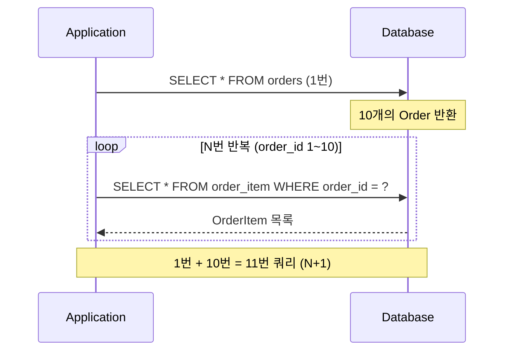
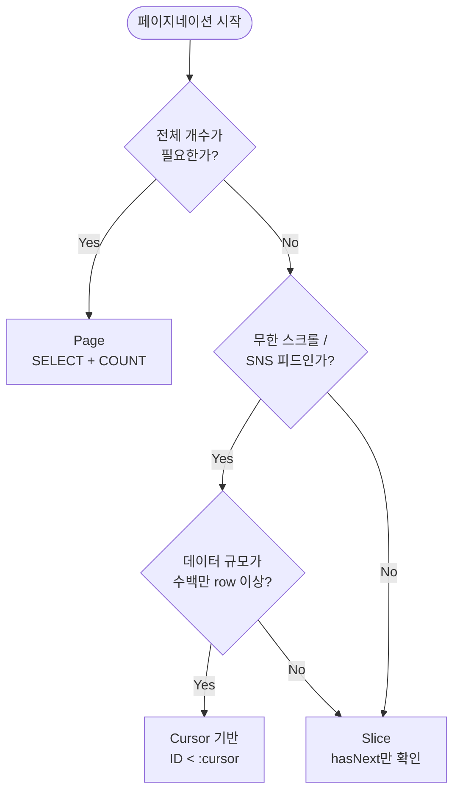
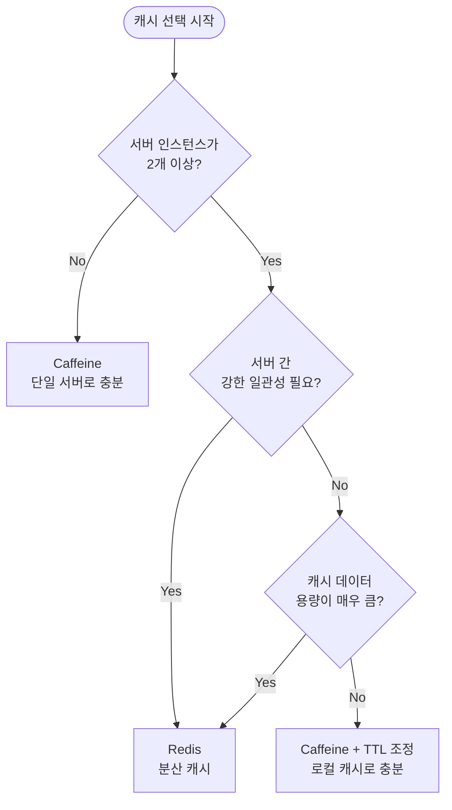

## 서론

"성능 최적화, 어디서 시작해야 가점이 될까?"

사전과제에서 Performance 영역은 두 가지로 갈린다. LAZY를 설정하고 @BatchSize를 전역으로 잡은 것과, EAGER가 그대로 남은 것. 이 차이가 리뷰어의 평가를 가른다.

1편은 4계층, 2편은 Database & Testing, 3편은 Documentation & AOP를 다뤘다. 4편은 그 위에서 실제 쿼리 비용을 줄이는 영역이다. 주요 내용은 세 가지다.

- N+1 해결 도구 3종의 트레이드오프
- 페이지네이션 세 가지 타입의 분기 기준
- 캐시 선택 논리, 동적 쿼리와 Projection 적용 기준

대상 독자는 기능은 돌아가는데 성능 최적화가 막막한 주니어 백엔드 개발자다. 다 읽으면 도구별 선택 기준이 생긴다.

[이전 글](/blog/spring-boot-pre-interview-guide-3)에서 Documentation & AOP를 먼저 다뤘다.

- 1편 — [Core Application Layer](/blog/spring-boot-pre-interview-guide-1)
- 2편 — [Database & Testing](/blog/spring-boot-pre-interview-guide-2)
- 3편 — [Documentation & AOP](/blog/spring-boot-pre-interview-guide-3)
- <strong>4편 — Performance & Optimization (이 글)</strong>
- 5편 — [Security & Authentication](/blog/spring-boot-pre-interview-guide-5)
- 6편 — [DevOps & Deployment](/blog/spring-boot-pre-interview-guide-6)
- 7편 — [Advanced Patterns](/blog/spring-boot-pre-interview-guide-7)

---

## TL;DR

- <strong>LAZY가 기본, 예외가 EAGER다</strong> — `@ManyToOne`·`@OneToOne` 기본값이 EAGER이므로 명시적으로 LAZY로 바꿔야 한다. EAGER를 그대로 두면 JPQL에서도 N+1이 발생한다.
- <strong>Fetch Join은 페이징 불가, @BatchSize는 페이징 가능</strong> — 컬렉션 Fetch Join 후 페이징하면 메모리 페이징이 발생한다. 페이징이 필요하면 @BatchSize가 정답이다.
- <strong>Page vs Cursor 분기점은 "전체 개수가 필요한가"</strong> — 전체 개수가 필요하면 Page(Offset), 무한 스크롤이면 Cursor, 그 중간이면 Slice다.
- <strong>캐시 선택은 서버 수로 시작한다</strong> — 단일 서버면 Caffeine으로 충분하다. 멀티 서버거나 강한 일관성이 필요하면 Redis로 간다.
- <strong>Projection은 목록 조회의 기본 옵션이다</strong> — 전체 Entity를 반환할 이유가 없는 목록 조회에서 DTO Projection으로 바꾸면 쿼리 컬럼 수가 줄고 성능이 오른다.

---

## 1. N+1 문제 — 왜 LAZY가 정답이고 어디서 새는가

### 1.1 N+1 발생 흐름

> <strong>참고</strong>: Spring Boot 4 + Kotlin 2.3 프로젝트 셋업(kotlin-spring·kotlin-jpa plugin 등) 자체는 [1편 1.1절](/blog/spring-boot-pre-interview-guide-1)에서 다뤘다. 4편은 그 위에서 도는 Performance 영역에 집중한다. Kotlin 2.x 시리즈는 백워드 호환이라 같은 코드가 2.0~2.3 모두 작동한다.

<strong>N+1 문제는 1번의 쿼리로 N개의 레코드를 가져온 뒤, 각 레코드의 연관 데이터를 조회하기 위해 N번의 추가 쿼리가 발생하는 현상이다.</strong>

"쿼리 1번으로 주문 목록을 가져왔는데, OrderItem을 접근할 때마다 SELECT가 터진다"는 게 N+1의 실체다.



10개의 주문이면 1 + 10 = 11번 쿼리다. 100개면 101번. 연관이 중첩되면 기하급수로 늘어난다.

```kotlin
// Order : OrderItem = 1 : N 관계
val orders = orderRepository.findAll() // 1번 쿼리

for (order in orders) {
    // 각 Order마다 OrderItem 조회 쿼리 발생 (N번)
    val items = order.orderItems
    items.forEach { println(it.productName) }
}
```

### 1.2 LAZY가 기본 — 그래도 새는 두 시나리오

<strong>모든 연관관계는 `FetchType.LAZY`로 설정하는 것이 기본 원칙이다.</strong> LAZY는 연관 데이터를 실제 접근 시점까지 쿼리를 미룬다. EAGER는 부모 로딩과 동시에 연관 데이터를 불러온다.

kotlin-jpa 플러그인이 JPA Entity에 no-arg 생성자를 자동으로 합성하므로, 직접 추가할 필요가 없다(1편 1.1절 참고).

그런데 LAZY로 설정해도 N+1이 터지는 시나리오가 두 가지 있다.

**시나리오 1 — @ManyToOne·@OneToOne 기본값이 EAGER**

JPA 스펙에서 `@ManyToOne`, `@OneToOne`의 기본 fetch 전략은 `EAGER`다. 명시적으로 LAZY를 선언하지 않으면 부모 로딩 시 연관 Entity가 항상 따라온다.

```kotlin
@Entity
class Order(
    // 기본값 EAGER — 반드시 LAZY로 바꿔야 한다
    @ManyToOne(fetch = FetchType.LAZY)
    val member: Member,

    // @OneToMany는 기본값이 LAZY라 그나마 낫다
    @OneToMany(mappedBy = "order", fetch = FetchType.LAZY)
    val orderItems: MutableList<OrderItem> = mutableListOf()
)
```

**시나리오 2 — JPQL에서는 EAGER도 N+1**

연관관계가 EAGER라도 JPQL이 JOIN을 자동으로 넣지 않는다. JPQL은 쿼리를 그대로 실행한 뒤 EAGER 설정을 보고 추가 쿼리를 발사한다. 결국 1 + N이다.

```kotlin
// JPQL로 조회해도 EAGER 연관관계는 추가 쿼리가 발생한다
@Query("SELECT o FROM Order o")
fun findAll(): List<Order>
// → SELECT * FROM orders
// → SELECT * FROM member WHERE id = ? (EAGER라서 N번 추가)
```

---

## 2. N+1 해결 도구 3종 — Fetch Join · @EntityGraph · @BatchSize

### 2.1 Fetch Join — 페이징 못 쓰는 이유

<strong>Fetch Join은 JPQL에서 연관 Entity를 한 번의 JOIN 쿼리로 함께 가져오는 방법이다.</strong>

N+1을 단 1번의 쿼리로 해결하는 가장 직접적인 방법이다. 그러나 치명적인 한계가 있다.

```kotlin
interface OrderRepository : JpaRepository<Order, Long> {

    @Query("SELECT DISTINCT o FROM Order o JOIN FETCH o.orderItems")
    fun findAllWithOrderItems(): List<Order>
}
```

> <strong>주의</strong>: 컬렉션 Fetch Join + 페이징은 Hibernate가 경고를 남긴다. 전체 데이터를 메모리에 올린 뒤 페이징하므로 OOM 위험이 있다.

왜 뻥튀기가 되는가? Order 1개에 OrderItem 3개면 JOIN 결과는 3행이다. 여기서 페이징하면 "Order 기준 10개"가 아니라 "행 기준 10개"가 잘린다.

### 2.2 @EntityGraph — 선언적 fetch

<strong>@EntityGraph는 JPQL 없이 어노테이션으로 연관관계의 fetch 전략을 메서드 단위로 오버라이드하는 방법이다.</strong>

Fetch Join과 동일한 JOIN 전략을 사용하지만, JPQL을 직접 작성하지 않아도 된다. 중첩 연관관계도 attributePaths 배열로 선언한다.

```kotlin
interface OrderRepository : JpaRepository<Order, Long> {

    // 1단계 연관관계: Order → OrderItems
    @EntityGraph(attributePaths = ["orderItems"])
    @Query("SELECT o FROM Order o")
    fun findAllWithOrderItemsGraph(): List<Order>

    // 2단계 연관관계: Order → OrderItems → Product
    @EntityGraph(attributePaths = ["orderItems", "orderItems.product"])
    fun findByStatus(status: OrderStatus): List<Order>

    // 3단계 연관관계: Order → OrderItems → Product → Category
    @EntityGraph(attributePaths = [
        "orderItems",
        "orderItems.product",
        "orderItems.product.category"
    ])
    fun findWithFullDetailsById(id: Long): Optional<Order>
}
```

그런데 @EntityGraph도 Fetch Join과 동일하게 컬렉션을 포함하면 페이징이 메모리 처리로 넘어간다. 이 한계는 두 방법이 공유한다.

### 2.3 @BatchSize — 페이징과 양립

<strong>@BatchSize는 지연 로딩 시 발생하는 N번의 쿼리를 IN 조건 하나로 묶어주는 방법이다.</strong>

Fetch Join이 "미리 JOIN해서 가져오는" 전략이라면, @BatchSize는 "나중에 한꺼번에 가져오는" 전략이다. 쿼리가 1 + 1로 줄고, 페이징과 함께 써도 안전하다.

```yaml
# application.yml — 전역 설정 (권장)
spring:
  jpa:
    properties:
      hibernate:
        default_batch_fetch_size: 100
```

전역 설정 대신 Entity 필드에 직접 붙일 수도 있다.

```kotlin
@Entity
class Order(
    @BatchSize(size = 100)
    @OneToMany(mappedBy = "order", fetch = FetchType.LAZY)
    val orderItems: MutableList<OrderItem> = mutableListOf()
)
```

적용 전후 쿼리 차이를 보면 차이가 명확하다.

```sql
-- 적용 전: 주문 10개면 10번 쿼리
SELECT * FROM order_item WHERE order_id = 1;
SELECT * FROM order_item WHERE order_id = 2;
...

-- 적용 후: IN 쿼리 1번으로 처리
SELECT * FROM order_item WHERE order_id IN (1, 2, 3, ..., 10);
```

### 2.4 셋 중 무엇을 언제

결국 세 방법 모두 N+1을 줄이지만, 페이징 여부와 컬렉션 수에 따라 선택이 달라진다.

| 방법 | 쿼리 수 | 페이징 | 주요 제약 | 권장 시나리오 |
|------|---------|--------|-----------|--------------|
| <strong>Fetch Join</strong> | 1번 | 컬렉션 포함 시 불가 | 카테시안 곱, 컬렉션 2개 이상 MultipleBagFetchException | 페이징 없는 단건·소량 조회 |
| <strong>@EntityGraph</strong> | 1번 | 컬렉션 포함 시 불가 | Fetch Join과 동일 | 특정 쿼리 메서드에만 즉시 로딩 필요 |
| <strong>@BatchSize</strong> | 1 + 1 | 가능 | 추가 쿼리 1회 | 페이징 필요 / 컬렉션 여러 개 |

> <strong>핵심</strong>: 과제에서는 `default_batch_fetch_size: 100`을 전역으로 설정한다. 페이징 없는 단건 상세 조회에만 Fetch Join을 선택적으로 쓰는 것이 가장 안전한 조합이다.

---

## 3. 페이지네이션 — Page · Slice · Cursor

### 3.1 Pageable과 Page<T> 응답 형식

<strong>Pageable은 Spring Data JPA가 페이지 번호·크기·정렬을 추상화한 인터페이스다.</strong> Repository 메서드 파라미터로 받으면 자동으로 LIMIT/OFFSET SQL로 변환해준다.

응답을 어떤 타입으로 내보낼지는 상황에 따라 세 가지 선택지가 있다.

| 방식 | 특징 | 과제 권장 여부 |
|------|------|--------------|
| `Page<T>` 직접 반환 | Spring 표준, sort·pageable 메타 포함 | 충분 |
| `CommonResponse<Page<T>>` | 일관된 응답 형식 | 1편에서 CommonResponse를 쓴다면 적합 |
| 커스텀 PageResponse | 필요한 필드만 선택 | 선택 사항 |

Kotlin은 Lombok을 쓰지 않는다 — 주입은 primary constructor의 `val` 파라미터로 처리한다. 아래는 Service와 Controller에서의 기본 구조다.

```kotlin
@Service
class ProductService(
    private val productRepository: ProductRepository
) {
    fun getProducts(pageable: Pageable): Page<ProductResponse> =
        productRepository.findAll(pageable).map { ProductResponse.from(it) }
}
```

```kotlin
@RestController
@RequestMapping("/api/v1/products")
class ProductController(
    private val productService: ProductService
) {
    @GetMapping
    fun getProducts(
        @PageableDefault(size = 20, sort = ["createdAt"], direction = Sort.Direction.DESC)
        pageable: Pageable
    ): Page<ProductResponse> = productService.getProducts(pageable)
}
```

<details>
<summary>커스텀 PageResponse 예시 (선택)</summary>

```kotlin
data class PageResponse<T>(
    val content: List<T>,
    val page: Int,
    val size: Int,
    val totalElements: Long,
    val totalPages: Int,
    val hasNext: Boolean
) {
    companion object {
        fun <T> from(page: Page<T>): PageResponse<T> = PageResponse(
            content = page.content,
            page = page.number,
            size = page.size,
            totalElements = page.totalElements,
            totalPages = page.totalPages,
            hasNext = page.hasNext()
        )
    }
}
```

</details>

### 3.2 Page vs Slice

<strong>Page와 Slice의 차이는 COUNT 쿼리 실행 여부다.</strong>

| 타입 | 전체 개수 | 실행 쿼리 | 사용 패턴 |
|------|---------|---------|---------|
| <strong>Page</strong> | 포함 (`totalElements`) | SELECT + COUNT | 관리자 목록, 전체 페이지 수 표시 |
| <strong>Slice</strong> | 미포함 (`hasNext`만) | SELECT (size + 1) | 무한 스크롤 초기, 다음 여부만 필요 |

```kotlin
// Page - 전체 개수가 필요한 경우 (일반적인 페이지네이션)
fun findByCategory(category: Category, pageable: Pageable): Page<Product>

// Slice - 무한 스크롤 등 전체 개수가 불필요한 경우
fun findByCategory(category: Category, pageable: Pageable): Slice<Product>

// List - 페이징 정보 없이 데이터만 필요한 경우
fun findByCategory(category: Category, pageable: Pageable): List<Product>
```

### 3.3 Offset vs Cursor — 대용량의 분기

Offset 기반 페이징의 약점은 `OFFSET`이 커질수록 DB가 앞 행을 전부 스캔해야 한다는 것이다. 수백만 row 테이블에서 page=500 요청은 500 × size개의 행을 건너뛰는 비용이 든다.

<strong>Cursor 기반 페이징은 마지막으로 조회한 ID를 기준으로 다음 데이터를 가져와, 앞 행 스캔 비용을 완전히 제거한다.</strong>

아래 결정 트리로 어떤 방식을 고를지 판단할 수 있다.



Cursor 구현의 핵심은 "마지막 항목의 ID를 다음 요청의 기준으로 사용"하는 것이다.

```kotlin
interface ProductRepository : JpaRepository<Product, Long> {

    // ID 기반 커서 페이지네이션
    @Query("SELECT p FROM Product p WHERE p.id < :cursor ORDER BY p.id DESC")
    fun findByIdLessThan(@Param("cursor") cursor: Long, pageable: Pageable): List<Product>
}
```

```kotlin
@Service
class ProductService(
    private val productRepository: ProductRepository
) {
    fun getProductsWithCursor(cursor: Long?, size: Int): CursorResponse<ProductResponse> {
        val pageable = PageRequest.of(0, size + 1) // 다음 페이지 확인용 +1

        var products = if (cursor == null) {
            productRepository.findAll(
                PageRequest.of(0, size + 1, Sort.by(Sort.Direction.DESC, "id"))
            ).content
        } else {
            productRepository.findByIdLessThan(cursor, pageable)
        }

        val hasNext = products.size > size
        if (hasNext) {
            products = products.subList(0, size)
        }

        val nextCursor = if (hasNext) products.last().id else null

        return CursorResponse(
            content = products.map { ProductResponse.from(it) },
            nextCursor = nextCursor,
            hasNext = hasNext
        )
    }
}
```

<details>
<summary>CursorResponse 클래스</summary>

```kotlin
data class CursorResponse<T>(
    val content: List<T>,
    val nextCursor: Long?,
    val hasNext: Boolean
)
```

</details>

> <strong>과제 권장</strong>: 기본적으로 Offset(Page)을 사용한다. README에 "대용량이면 Cursor 방식으로 전환 가능하며, 트레이드오프는 ~"를 한 문단 써두면 가산점이 된다.

### 3.4 참고: COUNT 쿼리 최적화

Page를 쓸 때 COUNT 쿼리도 함께 실행된다. JOIN이 많은 복잡한 조회에서는 COUNT 쿼리도 느려진다. 이때는 countQuery를 분리한다.

```kotlin
@Query(
    value = "SELECT p FROM Product p JOIN FETCH p.category WHERE p.status = :status",
    countQuery = "SELECT COUNT(p) FROM Product p WHERE p.status = :status"
)
fun findByStatus(@Param("status") status: ProductStatus, pageable: Pageable): Page<Product>
```

> <strong>참고</strong>: 과제 규모에서는 이 수준의 최적화가 필요한 경우가 드물다. 구조 자체를 알고 코드에 적용해두면 "의도적으로 설계했다"는 신호가 된다.

---

## 4. 캐싱 — Spring Cache · Caffeine · Redis

### 4.1 Spring Cache 추상화 (@Cacheable·@CachePut·@CacheEvict)

<strong>Spring Cache 추상화는 캐시 구현체에 상관없이 어노테이션만으로 캐싱 로직을 선언하는 방법이다.</strong>

캐시 구현체를 Caffeine으로 바꾸든 Redis로 바꾸든, 서비스 코드의 어노테이션은 변경 없이 동작한다. 세 가지 핵심 어노테이션의 역할은 다음과 같다.

| 어노테이션 | 동작 | 사용 시점 |
|-----------|------|---------|
| `@Cacheable` | 캐시에 있으면 반환, 없으면 실행 후 저장 | 조회 메서드 |
| `@CachePut` | 항상 실행 후 캐시 갱신 | 수정 메서드 |
| `@CacheEvict` | 캐시에서 해당 키 제거 | 삭제 메서드 |

```kotlin
@Service
class ProductService(
    private val productRepository: ProductRepository
) {
    @Cacheable(value = "product", key = "#productId")
    fun getProductDetail(productId: Long): ProductDetailResponse {
        val product = productRepository.findById(productId)
            ?: throw ProductNotFoundException(productId)
        return ProductDetailResponse.from(product)
    }

    @CachePut(value = "product", key = "#productId")
    fun updateProduct(productId: Long, command: ProductUpdateCommand): ProductDetailResponse {
        val product = productRepository.findById(productId)
            ?: throw ProductNotFoundException(productId)
        product.update(command.name, command.price)
        return ProductDetailResponse.from(product)
    }

    @CacheEvict(value = "product", key = "#productId")
    fun deleteProduct(productId: Long) {
        productRepository.deleteById(productId)
    }

    @CacheEvict(value = "product", allEntries = true)
    fun clearProductCache() {
        // 캐시 전체 제거만 수행
    }
}
```

### 4.2 Caffeine — 단일 서버 표준

<strong>Caffeine은 JVM 메모리 내에서 동작하는 고성능 로컬 캐시 라이브러리다.</strong>

네트워크 통신 없이 메모리 직접 접근이라 속도가 가장 빠르다. 단일 서버 과제에서 기본 선택지다.

```kotlin
// settings.gradle.kts
dependencyResolutionManagement {
    versionCatalogs {
        create("libs") {
            library("caffeine", "com.github.ben-manes.caffeine", "caffeine").withoutVersion()
            library("spring-boot-starter-cache", "org.springframework.boot", "spring-boot-starter-cache").withoutVersion()
        }
    }
}
```

```kotlin
// build.gradle.kts
dependencies {
    implementation(libs.caffeine)
    implementation(libs.spring.boot.starter.cache)
}
```

기본 설정은 전체 캐시에 동일한 정책을 적용한다.

```kotlin
@Configuration
@EnableCaching
class CacheConfig {

    @Bean
    fun cacheManager(): CacheManager {
        val cacheManager = CaffeineCacheManager()
        cacheManager.setCaffeine(Caffeine.newBuilder()
            .maximumSize(1000)
            .expireAfterWrite(10, TimeUnit.MINUTES)
            .recordStats())
        return cacheManager
    }
}
```

캐시별로 TTL과 용량을 다르게 설정할 때는 SimpleCacheManager를 쓴다.

```kotlin
@Configuration
@EnableCaching
class CacheConfig {

    @Bean
    fun cacheManager(): CacheManager {
        val cacheManager = SimpleCacheManager()
        cacheManager.setCaches(listOf(
            buildCache("product", 500, 30, TimeUnit.MINUTES),
            buildCache("category", 100, 1, TimeUnit.HOURS),
            buildCache("config", 50, 24, TimeUnit.HOURS)
        ))
        return cacheManager
    }

    private fun buildCache(name: String, maxSize: Long, duration: Long, unit: TimeUnit): CaffeineCache =
        CaffeineCache(name, Caffeine.newBuilder()
            .maximumSize(maxSize)
            .expireAfterWrite(duration, unit)
            .recordStats()
            .build())
}
```

### 4.3 Redis — 분산 캐시

<strong>Redis는 외부 서버에서 동작하는 분산 캐시로, 여러 애플리케이션 인스턴스 간에 캐시 데이터를 공유한다.</strong>

멀티 서버 환경에서 각 인스턴스가 로컬 캐시를 따로 유지하면 데이터 불일치가 생긴다. Redis는 이 문제를 해결하는 공유 저장소 역할을 한다.

```kotlin
// settings.gradle.kts
dependencyResolutionManagement {
    versionCatalogs {
        create("libs") {
            library("spring-boot-starter-data-redis", "org.springframework.boot", "spring-boot-starter-data-redis").withoutVersion()
            library("spring-boot-starter-cache", "org.springframework.boot", "spring-boot-starter-cache").withoutVersion()
        }
    }
}
```

```kotlin
// build.gradle.kts
dependencies {
    implementation(libs.spring.boot.starter.data.redis)
    implementation(libs.spring.boot.starter.cache)
}
```

```yaml
spring:
  redis:
    host: localhost
    port: 6379
  cache:
    type: redis
    redis:
      time-to-live: 600000
      cache-null-values: false
```

```kotlin
@Configuration
@EnableCaching
class RedisCacheConfig {

    @Bean
    fun cacheManager(connectionFactory: RedisConnectionFactory): CacheManager {
        val defaultConfig = RedisCacheConfiguration.defaultCacheConfig()
            .entryTtl(Duration.ofMinutes(10))
            .serializeKeysWith(RedisSerializationContext.SerializationPair
                .fromSerializer(StringRedisSerializer()))
            .serializeValuesWith(RedisSerializationContext.SerializationPair
                .fromSerializer(GenericJackson2JsonRedisSerializer()))

        val cacheConfigurations = mapOf(
            "product" to defaultConfig.entryTtl(Duration.ofMinutes(30)),
            "category" to defaultConfig.entryTtl(Duration.ofHours(1))
        )

        return RedisCacheManager.builder(connectionFactory)
            .cacheDefaults(defaultConfig)
            .withInitialCacheConfigurations(cacheConfigurations)
            .build()
    }
}
```

### 4.4 로컬 vs 분산 결정

어떤 캐시를 선택할지는 서버 수와 일관성 요구사항으로 결정한다.



| 구분 | Caffeine (로컬) | Redis (분산) |
|------|----------------|-------------|
| 속도 | 매우 빠름 (메모리 직접) | 상대적으로 느림 (네트워크) |
| 일관성 | 서버 간 불일치 가능 | 공유 저장소로 일관성 보장 |
| 용량 | 서버 JVM 메모리 제한 | 별도 서버로 확장 가능 |
| 복잡도 | 간단 | Redis 인프라 필요 |

> <strong>과제 권장</strong>: 단일 서버라면 Caffeine이 충분하다. Docker Compose에 Redis 컨테이너를 추가해서 Redis 캐시를 연결하면 "분산 환경도 고려했다"는 가산점이 된다.

### 4.5 참고: 캐시 무효화 전략

캐시를 잘 쓰려면 무효화 전략도 함께 설계해야 한다. 자주 쓰는 두 패턴은 다음과 같다.

**Cache-Aside (Lazy Loading)** — Spring Cache 기본 동작 방식

1. 조회 시 캐시에서 먼저 확인
2. 캐시 미스 → DB 조회 후 캐시에 저장
3. 수정/삭제 시 `@CacheEvict`로 해당 키 제거

**Write-Through** — 쓰기 시 캐시와 DB 동시 갱신

1. `@CachePut`으로 항상 실행 후 캐시 갱신
2. 조회는 캐시에서 바로 반환

주의사항이 두 가지 있다. 첫째, 목록 조회 캐시는 항목 하나가 변경될 때 전체 무효화(`allEntries = true`)가 필요하다. 둘째, 캐시 키에 prefix를 붙여 키 충돌을 막는다.

---

## 5. 쿼리 최적화 — Projection · QueryDSL · 인덱스

### 5.1 Projection — Entity 대신 필드만

<strong>Projection은 전체 Entity 대신 필요한 필드만 선택해서 조회하는 방법이다.</strong>

목록 조회에서 전체 Entity를 반환하면 사용하지 않는 컬럼도 SELECT에 포함된다. Projection을 쓰면 DB 전송량과 메모리 사용이 줄어든다.

두 가지 방식이 있다. Interface Projection은 인터페이스를 정의하면 Hibernate가 프록시를 생성한다.

```kotlin
interface ProductSummary {
    val id: Long
    val name: String
    val price: Int
}

interface ProductRepository : JpaRepository<Product, Long> {
    fun findByCategory(category: Category): List<ProductSummary>
}
```

DTO Projection은 data class로 직접 생성하므로 프록시 오버헤드가 없어 성능이 더 낫다.

```kotlin
data class ProductSummaryDto(
    val id: Long,
    val name: String,
    val price: Int
)

interface ProductRepository : JpaRepository<Product, Long> {

    @Query("SELECT new com.example.dto.ProductSummaryDto(p.id, p.name, p.price) " +
           "FROM Product p WHERE p.category = :category")
    fun findSummaryByCategory(@Param("category") category: Category): List<ProductSummaryDto>
}
```

성능 순서는 DTO Projection > Interface Projection > Entity 전체 조회다. 단, 조회 후 Entity를 수정해야 하면 Entity로 조회해야 한다.

<details>
<summary>Projection 성능 비교 코드</summary>

```kotlin
// 1. Entity 전체 조회 - 모든 컬럼 + 연관 Entity
val products: List<Product> = productRepository.findAll()

// 2. Interface Projection - 필요한 컬럼만 (Proxy 생성)
val summaries: List<ProductSummary> = productRepository.findAllProjectedBy()

// 3. DTO Projection - 필요한 컬럼만 (직접 생성, 가장 빠름)
val dtos: List<ProductSummaryDto> = productRepository.findAllSummary()
```

</details>

### 5.2 QueryDSL — 동적 쿼리

<strong>QueryDSL은 타입 안전한 Kotlin/Java 코드로 JPQL을 생성하는 프레임워크다.</strong>

JPQL은 문자열이라 컴파일 타임에 오류를 잡지 못하고, 동적 조건을 붙이려면 문자열 조작이 필요하다. QueryDSL은 이 두 문제를 해결한다.

Kotlin에서는 `annotationProcessor` 대신 `kapt`(Kotlin Annotation Processing Tool)로 Q 클래스를 생성한다.

```kotlin
// build.gradle.kts — QueryDSL + kapt 설정
plugins {
    kotlin("kapt") version "2.3"
}

dependencies {
    implementation("com.querydsl:querydsl-jpa:5.0.0:jakarta")
    kapt("com.querydsl:querydsl-apt:5.0.0:jakarta")
    kapt("jakarta.annotation:jakarta.annotation-api")
    kapt("jakarta.persistence:jakarta.persistence-api")
}
```

동적 검색 조건을 BooleanExpression으로 구성한 전형적인 패턴은 다음과 같다.

```kotlin
@Repository
class ProductQueryRepository(
    private val queryFactory: JPAQueryFactory
) {
    fun searchProducts(condition: ProductSearchCondition): List<Product> {
        return queryFactory
            .selectFrom(product)
            .where(
                categoryEq(condition.categoryId),
                priceGoe(condition.minPrice),
                priceLoe(condition.maxPrice),
                nameContains(condition.keyword)
            )
            .orderBy(product.createdAt.desc())
            .offset(condition.offset)
            .limit(condition.limit)
            .fetch()
    }

    private fun categoryEq(categoryId: Long?) =
        categoryId?.let { product.category.id.eq(it) }

    private fun priceGoe(minPrice: Int?) =
        minPrice?.let { product.price.goe(it) }

    private fun priceLoe(maxPrice: Int?) =
        maxPrice?.let { product.price.loe(it) }

    private fun nameContains(keyword: String?) =
        keyword?.takeIf { it.isNotBlank() }?.let { product.name.contains(it) }
}
```

조건 메서드가 null을 반환하면 QueryDSL이 해당 WHERE 절을 자동으로 제외한다. 이게 "동적 쿼리가 쉽다"는 이유다.

QueryDSL 도입이 맞는 시점은 "검색 조건이 2개 이상이고, 선택적으로 적용된다"이다. 단순 CRUD는 Spring Data JPA가 더 간결하다.

| 방식 | 타입 안전 | 동적 쿼리 | 사용 시점 |
|------|---------|---------|---------|
| <strong>JPQL</strong> | X (문자열) | 어려움 | 단순 정적 쿼리 |
| <strong>QueryDSL</strong> | O | 쉬움 | 복잡한 동적 검색 |
| <strong>Native Query</strong> | X | 어려움 | DB 특화 기능, 복잡한 통계 |

### 5.3 인덱스 설계 — Entity 어노테이션으로

<strong>인덱스는 WHERE·JOIN·ORDER BY에 자주 쓰이는 컬럼에 대한 DB 검색 최적화 구조다.</strong>

JPA에서는 Entity `@Table` 어노테이션에 `@Index`를 선언하면 DDL 자동 생성 시 인덱스가 포함된다. "이 컬럼에 인덱스가 필요하다"는 의도를 코드 레벨에서 드러내는 방식이다.

```kotlin
@Entity
@Table(name = "product", indexes = [
    Index(name = "idx_product_category", columnList = "category_id"),
    Index(name = "idx_product_status_created", columnList = "status, created_at"),
    Index(name = "idx_product_name", columnList = "name")
])
class Product {
    // ...
}
```

<details>
<summary>인덱스 설계 기준</summary>

**인덱스가 필요한 경우**:
- WHERE 절에 자주 사용되는 컬럼
- JOIN 조건에 사용되는 컬럼 (FK)
- ORDER BY에 사용되는 컬럼
- 카디널리티가 높은 컬럼 (고유값이 많은)

**인덱스 주의사항**:
- INSERT/UPDATE/DELETE 성능을 저하시킨다 (인덱스 갱신 비용)
- 복합 인덱스는 컬럼 순서가 중요하다 (왼쪽부터 사용)
- 과도한 인덱스는 오히려 성능 저하 원인이 된다

</details>

---

## 정리

- <strong>LAZY 전역 + @BatchSize 100</strong> — 모든 연관관계를 LAZY로 선언하고 `default_batch_fetch_size: 100`을 전역 설정하면 N+1을 안전하게 잡는 기본 방어선이 된다.
- <strong>페이징 분기는 전체 개수 필요 여부로</strong> — 전체 개수가 필요하면 Page, 다음 존재 여부만 필요하면 Slice, 대용량 무한 스크롤이면 Cursor다.
- <strong>캐시는 서버 수로 시작한다</strong> — 단일 서버면 Caffeine, 멀티 서버면 Redis. 과제에서 Docker Compose에 Redis를 추가하면 가산점이다.
- <strong>목록 조회에는 Projection을 기본으로 쓴다</strong> — 수정이 필요 없는 목록에서 Entity 대신 DTO Projection을 쓰면 쿼리 컬럼 수와 메모리 사용이 줄어든다.
- <strong>복잡한 동적 검색에만 QueryDSL을 쓴다</strong> — 단순 CRUD는 Spring Data JPA가 더 간결하다. 선택적 검색 조건이 2개 이상일 때 QueryDSL이 명확한 이점을 준다.

### 체크리스트

| 항목 | 확인 |
|------|------|
| 모든 연관관계가 `FetchType.LAZY`로 설정되어 있는가? | ⬜ |
| `@ManyToOne`·`@OneToOne`에 명시적 `LAZY` 선언이 있는가? | ⬜ |
| `default_batch_fetch_size` 전역 설정이 적용되어 있는가? | ⬜ |
| 페이지네이션이 필요한 API에 `Pageable`이 적용되어 있는가? | ⬜ |
| 자주 조회되는 데이터에 캐싱이 적용되어 있는가? | ⬜ |
| 목록 조회 시 필요한 필드만 Projection으로 가져오는가? | ⬜ |
| 복잡한 동적 쿼리에 QueryDSL이 사용되었는가? | ⬜ |

5편 Security & Authentication에서는 Spring Security 필터 체인, JWT 발급·검증, 비밀번호 암호화를 다룬다. 인증·인가 분기 설계와 감점 패턴 4종도 함께 정리한다.

---

## 부록

### 흔한 실수 5종

<details>
<summary>과제에서 자주 보이는 성능 실수 목록</summary>

1. **EAGER 로딩 그대로 사용** — `@ManyToOne`, `@OneToOne` 기본값이 EAGER다. 명시적으로 LAZY를 선언하지 않으면 모든 조회에서 연관 데이터가 따라온다.

2. **무분별한 컬렉션 Fetch Join** — 컬렉션을 Fetch Join한 상태에서 페이징하면 메모리 페이징이 발생한다. 컬렉션이 2개 이상이면 `MultipleBagFetchException`이 터진다.

3. **COUNT 쿼리 무시** — Page를 쓰면 COUNT 쿼리도 실행된다. JOIN이 복잡한 조회라면 COUNT 쿼리도 같이 느려진다. countQuery 분리 또는 Slice 전환을 고려한다.

4. **캐시 키 충돌** — 서로 다른 메서드에서 같은 캐시명 + 같은 키를 쓰면 의도하지 않은 데이터가 반환된다. 메서드별로 고유한 캐시명이나 키 prefix를 설계한다.

5. **목록 조회에서 Entity 반환** — 전체 Entity 대신 DTO Projection으로 바꾸면 SELECT 컬럼 수와 DB 전송량이 줄어든다. 수정이 필요 없는 조회에서는 Projection이 기본 옵션이다.

</details>

### 외부 참조

- [Spring Data JPA 공식 문서](https://docs.spring.io/spring-data/jpa/docs/current/reference/html/)
- [Hibernate ORM 공식 문서 — Fetching](https://docs.jboss.org/hibernate/orm/6.4/userguide/html_single/Hibernate_User_Guide.html#fetching)
- [Caffeine 공식 GitHub](https://github.com/ben-manes/caffeine)
- [Spring Cache 추상화 공식 문서](https://docs.spring.io/spring-framework/docs/current/reference/html/integration.html#cache)
- [QueryDSL 공식 문서](http://querydsl.com/static/querydsl/5.0.0/reference/html_single/)
