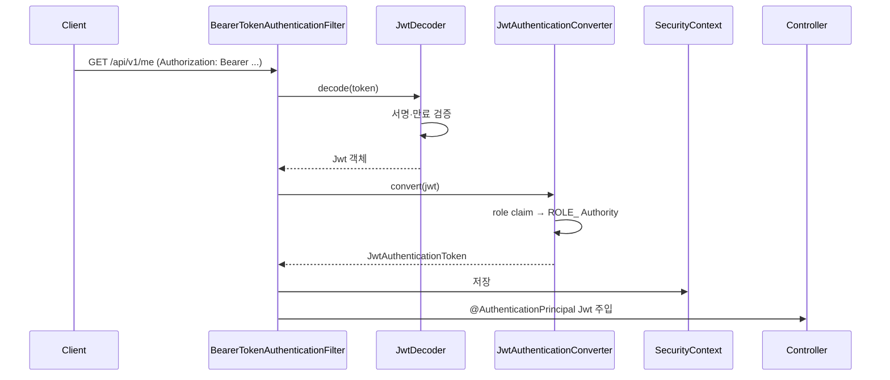
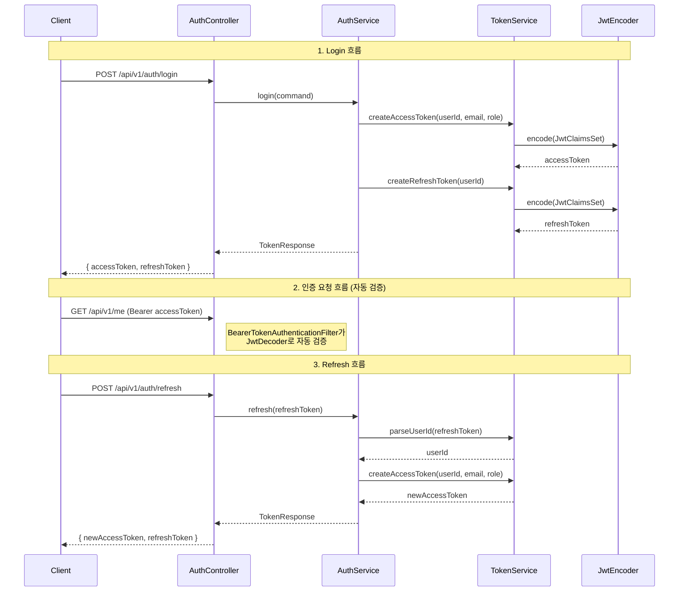
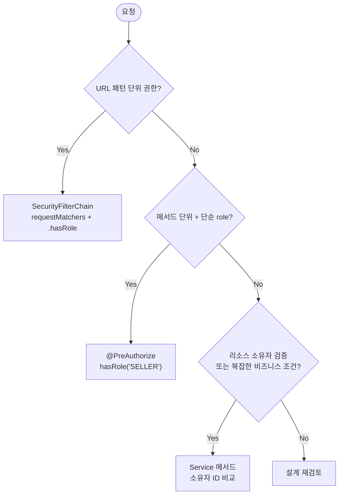

## 서론

"보안 설정, 어디까지 해야 평가자가 고개를 끄덕일까?"

사전과제에서 Security 영역은 두 갈래다. JJWT를 직접 다루며 `OncePerRequestFilter`를 손으로 짠 것과, Spring Security가 제공하는 `oauth2-resource-server` 추상화를 쓴 것. 평가자는 후자를 보면 "Spring Security를 알고 있구나"라고 읽는다. 전자는 "동작하지만 표준과 다르다"는 인상을 남긴다.

4편에서 N+1·캐시·페이지네이션을 다뤘다. 5편은 그 위에서 인증·인가 레이어를 쌓는다. 핵심은 세 가지다.

- `spring-boot-starter-oauth2-resource-server`로 JWT 검증을 Spring Security에게 위임하는 방법
- `JwtDecoder`·`JwtEncoder` Bean 한 짝으로 검증·발급을 표준 API로 처리하는 패턴
- `@AuthenticationPrincipal Jwt`로 Controller에서 현재 사용자를 받는 방법

대상 독자는 Spring Security는 아는데 사전과제 평가자가 어디를 보는지 모르는 주니어 백엔드 개발자다.

[이전 글](/blog/spring-boot-pre-interview-guide-4)에서 Performance & Optimization을 다뤘다.

- 1편 — [Core Application Layer](/blog/spring-boot-pre-interview-guide-1)
- 2편 — [Database & Testing](/blog/spring-boot-pre-interview-guide-2)
- 3편 — [Documentation & AOP](/blog/spring-boot-pre-interview-guide-3)
- 4편 — [Performance & Optimization](/blog/spring-boot-pre-interview-guide-4)
- <strong>5편 — Security & Authentication (이 글)</strong>
- 6편 — [DevOps & Deployment](/blog/spring-boot-pre-interview-guide-6)
- 7편 — [Advanced Patterns](/blog/spring-boot-pre-interview-guide-7)

---

## TL;DR

- <strong>oauth2-resource-server가 Spring Security 7의 표준</strong> — `BearerTokenAuthenticationFilter`가 토큰 추출·검증·SecurityContext 설정을 자동으로 처리한다. 직접 `OncePerRequestFilter`를 만들 필요 없다.
- <strong>JwtDecoder + JwtEncoder를 Bean으로 등록</strong> — `NimbusJwtDecoder`(검증)와 `NimbusJwtEncoder`(발급)를 Spring Security 추상화로 다룬다. HMAC과 RSA 모두 같은 API를 쓴다.
- <strong>JwtAuthenticationConverter로 role claim → ROLE_ 매핑</strong> — JWT의 `role` claim을 Spring Security `GrantedAuthority`로 변환한다. `@PreAuthorize("hasRole('SELLER')")` 가 이 매핑에 의존한다.
- <strong>@AuthenticationPrincipal Jwt로 Controller에서 현재 사용자</strong> — `jwt.getSubject()`로 userId, `jwt.getClaim("email")`로 임의 claim을 꺼낸다. 타입 캐스팅 없이 깔끔하다.
- <strong>BCrypt는 기본, Argon2는 옵션</strong> — `PasswordEncoderFactories.createDelegatingPasswordEncoder()`가 기본값으로 BCrypt를 쓴다. 보안 요구사항이 높으면 Argon2로 교체한다.

---

## 1. Spring Security 7 — 평가의 출발선

### 1.1 의존성과 Spring Security 6 → 7 주요 변경

> <strong>참고</strong>: Spring Boot 4 + Kotlin 2.3 프로젝트 셋업(kotlin-spring·kotlin-jpa plugin 등) 자체는 1편 1.1절에서 다뤘다. 5편은 그 위에서 도는 Security 영역에 집중한다. Kotlin 2.x 시리즈는 백워드 호환이라 같은 코드가 2.0~2.3 모두 작동한다.

Spring Security 7에서는 `spring-boot-starter-oauth2-resource-server`를 함께 추가하는 것이 표준이다. 이 스타터는 Nimbus JOSE+JWT를 transitive 의존성으로 가져오기 때문에 JJWT 라이브러리를 별도로 추가할 필요가 없다.

```kotlin
// settings.gradle.kts
dependencyResolutionManagement {
    versionCatalogs {
        create("libs") {
            library("spring-boot-starter-security", "org.springframework.boot:spring-boot-starter-security:3.4.0")
            library("spring-boot-starter-oauth2-resource-server", "org.springframework.boot:spring-boot-starter-oauth2-resource-server:3.4.0")
            library("spring-security-test", "org.springframework.security:spring-security-test:6.4.0")
        }
    }
}
```

```kotlin
// build.gradle.kts
dependencies {
    implementation(libs.spring.boot.starter.security)
    implementation(libs.spring.boot.starter.oauth2.resource.server)
    // JJWT 라이브러리 불필요 — Nimbus JOSE+JWT가 transitive로 포함됨
    testImplementation(libs.spring.security.test)
}
```

Spring Security 6에서 7로 올라오면서 평가자가 자주 확인하는 변경 포인트는 다음과 같다.

| 항목 | Spring Security 6 | Spring Security 7 |
|------|-------------------|-------------------|
| URL 권한 API | `antMatchers()` 제거 | `requestMatchers()`만 사용 |
| HTTP DSL | 일부 구 API 병존 | Lambda DSL 전면 표준 |
| 메서드 보안 | `@EnableGlobalMethodSecurity` | `@EnableMethodSecurity` |
| JWT 필터 | 직접 `OncePerRequestFilter` 구현 | `oauth2ResourceServer` 설정 권장 |
| `@EnableWebSecurity` | 명시 선언 필요 | Spring Boot 자동 설정, 생략 가능 |

### 1.2 SecurityFilterChain 한 장으로 보기

Spring Security 7에서 `oauth2ResourceServer`를 설정하면 `BearerTokenAuthenticationFilter`가 자동으로 필터 체인에 등록된다. 이 필터가 `Authorization: Bearer ...` 헤더를 추출하고, `JwtDecoder`에게 검증을 위임하고, `JwtAuthenticationConverter`로 Authority를 변환한 뒤 `SecurityContext`에 저장한다.



SecurityConfig 전체 코드다. JJWT 기반 구현과의 차이는 `addFilterBefore(JwtAuthenticationFilter(...))` 줄이 `oauth2ResourceServer(...)` 한 줄로 대체된다는 점이다.

```kotlin
@Configuration
@EnableMethodSecurity
class SecurityConfig(
    @Value("\${jwt.secret}") private val secret: String
) {

    @Bean
    fun filterChain(http: HttpSecurity): SecurityFilterChain =
        http
            .csrf { it.disable() }
            .sessionManagement { it.sessionCreationPolicy(SessionCreationPolicy.STATELESS) }
            .authorizeHttpRequests { auth ->
                auth
                    .requestMatchers("/api/v1/auth/**").permitAll()
                    .requestMatchers(HttpMethod.GET, "/api/v1/products/**").permitAll()
                    .requestMatchers("/swagger-ui/**", "/v3/api-docs/**").permitAll()
                    .anyRequest().authenticated()
            }
            .oauth2ResourceServer { oauth2 ->
                oauth2.jwt { jwt -> jwt.jwtAuthenticationConverter(jwtAuthenticationConverter()) }
            }
            .build()

    @Bean
    fun jwtDecoder(): JwtDecoder {
        val key = SecretKeySpec(secret.toByteArray(StandardCharsets.UTF_8), "HmacSHA256")
        return NimbusJwtDecoder.withSecretKey(key)
            .macAlgorithm(MacAlgorithm.HS256)
            .build()
    }

    @Bean
    fun jwtEncoder(): JwtEncoder {
        val key = SecretKeySpec(secret.toByteArray(StandardCharsets.UTF_8), "HmacSHA256")
        val jwks: JWKSource<SecurityContext> = ImmutableSecret(key)
        return NimbusJwtEncoder(jwks)
    }

    @Bean
    fun passwordEncoder(): PasswordEncoder =
        PasswordEncoderFactories.createDelegatingPasswordEncoder()

    private fun jwtAuthenticationConverter(): JwtAuthenticationConverter {
        val authoritiesConverter = JwtGrantedAuthoritiesConverter().apply {
            setAuthoritiesClaimName("role")
            setAuthorityPrefix("ROLE_")
        }
        return JwtAuthenticationConverter().apply {
            setJwtGrantedAuthoritiesConverter(authoritiesConverter)
        }
    }
}
```

### 1.3 @EnableWebSecurity vs @EnableMethodSecurity

두 어노테이션을 혼동하는 경우가 많다.

| 어노테이션 | 역할 | Spring Boot 3.x에서 |
|-----------|------|---------------------|
| `@EnableWebSecurity` | 웹 보안 자동 설정 활성화 | Spring Boot가 자동 적용 → 생략 가능 |
| `@EnableMethodSecurity` | `@PreAuthorize`·`@PostAuthorize` 활성화 | 명시적으로 선언 필요 |

`@EnableMethodSecurity`가 없으면 `@PreAuthorize("hasRole('SELLER')")`를 붙여도 무시된다. `@Configuration` 클래스 어딘가에 반드시 선언해야 한다.

---

## 2. JWT 인증 — oauth2-resource-server로 검증·발급

### 2.1 의존성과 secret 관리

`application.yml`에 secret을 환경변수로 받아 설정한다. 소스 코드에 평문으로 넣으면 감점이다.

```yaml
# application.yml
jwt:
  secret: ${JWT_SECRET:your-256-bit-secret-key-must-be-at-least-32-characters}
```

Secret은 256비트(32바이트) 이상이어야 HMAC-SHA256 서명 검증 시 오류가 발생하지 않는다.

> <strong>참고</strong>: 프로덕션에서는 AWS Secrets Manager 또는 Vault 같은 시크릿 관리 시스템을 쓴다. 과제에서는 `.env` 파일 + `.gitignore` 처리로 충분하다.

### 2.2 JwtDecoder · JwtEncoder Bean — 검증·발급의 한 짝

<strong>JwtDecoder는 수신한 토큰을 검증하고 파싱하는 Bean이고, JwtEncoder는 새 토큰을 발급하는 Bean이다.</strong> oauth2-resource-server 스타터를 추가하면 `JwtDecoder` Bean을 컨테이너에서 자동으로 찾아 `BearerTokenAuthenticationFilter`에 연결한다.

SecurityConfig에 이미 두 Bean을 등록했다(1.2절 참조). HMAC 방식의 경우 `SecretKeySpec`을 공유해 쓴다. RSA 방식이 필요한 경우는 아래를 참고한다.

<details>
<summary>RSA 비대칭 키 방식 (더 자세히)</summary>

RSA 키 쌍을 사용하면 공개키 배포만으로 외부 서비스가 토큰을 검증할 수 있다. 인증 서버가 분리된 MSA 구조에서 주로 쓴다.

```kotlin
@Bean
fun jwtDecoder(publicKey: RSAPublicKey): JwtDecoder =
    NimbusJwtDecoder.withPublicKey(publicKey).build()

@Bean
fun jwtEncoder(privateKey: RSAPrivateKey, publicKey: RSAPublicKey): JwtEncoder {
    val rsaKey = RSAKey.Builder(publicKey).privateKey(privateKey).build()
    val jwks: JWKSource<SecurityContext> = ImmutableJWKSet(JWKSet(rsaKey))
    return NimbusJwtEncoder(jwks)
}
```

과제에서는 HMAC이 충분하다. RSA는 "MSA에서 공개키만 배포해 검증한다"는 개념만 알면 된다.

</details>

### 2.3 JwtAuthenticationConverter — role claim → ROLE_ Authority 매핑

Spring Security의 `hasRole('SELLER')` SpEL은 내부적으로 `ROLE_SELLER`라는 이름의 `GrantedAuthority`를 찾는다. JWT의 `role` claim 값이 `SELLER`라면 자동으로 `ROLE_SELLER`로 변환해 주는 것이 `JwtAuthenticationConverter`다.

```kotlin
// SecurityConfig 내부 private 메서드 (1.2절에 이미 포함)
private fun jwtAuthenticationConverter(): JwtAuthenticationConverter {
    val authoritiesConverter = JwtGrantedAuthoritiesConverter().apply {
        setAuthoritiesClaimName("role")  // JWT claim 이름
        setAuthorityPrefix("ROLE_")      // prefix 추가
    }
    // principal name = sub claim (기본값) → userId가 들어있음
    return JwtAuthenticationConverter().apply {
        setJwtGrantedAuthoritiesConverter(authoritiesConverter)
    }
}
```

`setAuthoritiesClaimName("role")`을 빠뜨리면 기본값 `scope` claim을 바라봐서 `@PreAuthorize`가 항상 실패한다. 과제에서 자주 빠지는 부분이다.

### 2.4 인증 API — signup · login · refresh 흐름

인증 흐름 세 가지를 시퀀스로 먼저 보고 코드로 들어간다.



**TokenService** — `JwtEncoder`로 발급, `JwtDecoder`로 파싱한다. JJWT의 `JwtTokenProvider`가 하던 역할을 Spring Security 추상화로 대체한다.

```kotlin
@Service
class TokenService(
    private val jwtEncoder: JwtEncoder,
    private val jwtDecoder: JwtDecoder
) {
    companion object {
        private val ACCESS_TOKEN_TTL: Duration = Duration.ofHours(1)
        private val REFRESH_TOKEN_TTL: Duration = Duration.ofDays(7)
    }

    fun createAccessToken(userId: Long, email: String, role: String): String {
        val now = Instant.now()
        val claims = JwtClaimsSet.builder()
            .issuer("self")
            .issuedAt(now)
            .expiresAt(now.plus(ACCESS_TOKEN_TTL))
            .subject(userId.toString())
            .claim("email", email)
            .claim("role", role)
            .build()
        return jwtEncoder.encode(JwtEncoderParameters.from(claims)).tokenValue
    }

    fun createRefreshToken(userId: Long): String {
        val now = Instant.now()
        val claims = JwtClaimsSet.builder()
            .issuer("self")
            .issuedAt(now)
            .expiresAt(now.plus(REFRESH_TOKEN_TTL))
            .subject(userId.toString())
            .claim("token_type", "refresh")
            .build()
        return jwtEncoder.encode(JwtEncoderParameters.from(claims)).tokenValue
    }

    fun parseUserId(token: String): Long {
        val jwt = jwtDecoder.decode(token)  // 검증 + 파싱 한 번에
        return jwt.subject.toLong()
    }
}
```

**AuthController + AuthService** — `TokenService`를 주입해서 쓴다.

```kotlin
@RestController
@RequestMapping("/api/v1/auth")
class AuthController(private val authService: AuthService) {

    @PostMapping("/signup")
    fun signup(@Valid @RequestBody request: SignupRequest): ResponseEntity<Void> {
        authService.signup(request.toCommand())
        return ResponseEntity.status(HttpStatus.CREATED).build()
    }

    @PostMapping("/login")
    fun login(@Valid @RequestBody request: LoginRequest): ResponseEntity<TokenResponse> =
        ResponseEntity.ok(authService.login(request.toCommand()))

    @PostMapping("/refresh")
    fun refresh(@RequestBody request: RefreshTokenRequest): ResponseEntity<TokenResponse> =
        ResponseEntity.ok(authService.refresh(request.refreshToken))
}
```

```kotlin
@Service
@Transactional(readOnly = true)
class AuthService(
    private val memberRepository: MemberRepository,
    private val passwordEncoder: PasswordEncoder,
    private val tokenService: TokenService
) {

    @Transactional
    fun signup(command: SignupCommand) {
        if (memberRepository.existsByEmail(command.email)) {
            throw DuplicateEmailException(command.email)
        }
        val member = Member(
            email = command.email,
            password = passwordEncoder.encode(command.password),
            name = command.name,
            role = MemberRole.USER
        )
        memberRepository.save(member)
    }

    fun login(command: LoginCommand): TokenResponse {
        val member = memberRepository.findByEmail(command.email)
            ?: throw InvalidCredentialsException()

        if (!passwordEncoder.matches(command.password, member.password)) {
            throw InvalidCredentialsException()
        }

        val accessToken = tokenService.createAccessToken(
            member.id, member.email, member.role.name
        )
        val refreshToken = tokenService.createRefreshToken(member.id)
        return TokenResponse(accessToken, refreshToken)
    }

    fun refresh(refreshToken: String): TokenResponse {
        val userId = tokenService.parseUserId(refreshToken)  // 만료 시 JwtException
        val member = memberRepository.findById(userId)
            .orElseThrow { MemberNotFoundException(userId) }

        val newAccessToken = tokenService.createAccessToken(
            member.id, member.email, member.role.name
        )
        return TokenResponse(newAccessToken, refreshToken)
    }
}
```

### 2.5 Controller에서 현재 사용자 — @AuthenticationPrincipal Jwt

`BearerTokenAuthenticationFilter`가 SecurityContext에 저장한 `JwtAuthenticationToken`의 principal은 `Jwt` 객체다. Controller에서 `@AuthenticationPrincipal Jwt jwt`로 직접 받으면 타입 캐스팅 없이 claim을 꺼낼 수 있다.

```kotlin
@GetMapping("/me")
fun getMyProfile(@AuthenticationPrincipal jwt: Jwt): MemberResponse {
    val userId = jwt.subject.toLong()
    return memberService.getMember(userId)
}

@PostMapping
@PreAuthorize("hasRole('SELLER')")
fun createProduct(
    @AuthenticationPrincipal jwt: Jwt,
    @Valid @RequestBody request: CreateProductRequest
): ProductResponse {
    val sellerId = jwt.subject.toLong()
    return productService.createProduct(sellerId, request)
}
```

`jwt.subject` — userId(sub claim), `jwt.getClaim<String>("email")` — 임의 claim, `jwt.getClaim<String>("role")` — role claim이다.

### 2.6 참고: JJWT 직접 구현 vs oauth2-resource-server

<details>
<summary>두 방식의 차이 — 더 자세히</summary>

| 비교 항목 | JJWT 직접 구현 | oauth2-resource-server |
|-----------|---------------|------------------------|
| 의존성 | `jjwt-api` + `jjwt-impl` + `jjwt-jackson` | `oauth2-resource-server` 하나 |
| JWT 필터 | `OncePerRequestFilter` 직접 작성 | `BearerTokenAuthenticationFilter` 자동 등록 |
| 토큰 검증 | `validateToken()` 직접 구현 | `JwtDecoder` Bean이 처리 |
| Authority 매핑 | 필터에서 `SimpleGrantedAuthority` 수동 생성 | `JwtAuthenticationConverter` |
| OAuth2 표준 호환 | 없음 | RFC 6750 Bearer Token 표준 준수 |
| Spring Security 7 권장도 | 비표준 | 표준 |

oauth2-resource-server 방식의 실질적 장점은 두 가지다.
- <strong>검증과 파싱이 분리되지 않는다</strong> — `decode()` 한 번에 서명 검증 + 파싱을 같이 한다. JJWT 방식은 `validateToken()` + `getClaims()` 두 번 호출하는 패턴이 자주 나온다.
- <strong>Filter 보일러플레이트가 없다</strong> — 200줄짜리 `JwtAuthenticationFilter`가 SecurityConfig 설정 몇 줄로 대체된다.

</details>

### 2.7 참고: Session vs JWT, 토큰 저장 위치

<details>
<summary>Session vs JWT, 저장 위치 비교</summary>

| 구분 | Session | JWT |
|------|---------|-----|
| <strong>저장 위치</strong> | 서버(메모리/Redis) | 클라이언트 |
| <strong>확장성</strong> | 서버 간 세션 공유 필요 | Stateless, 수평 확장 용이 |
| <strong>로그아웃</strong> | 서버에서 즉시 무효화 | 블랙리스트 관리 필요 |
| <strong>과제 권장</strong> | 불필요 | REST API 과제의 사실상 표준 |

**토큰 저장 위치**:

| 위치 | 장점 | 단점 |
|------|------|------|
| LocalStorage | 구현 간단 | XSS 취약 |
| SessionStorage | 탭 닫으면 삭제 | XSS 취약 |
| HttpOnly Cookie | XSS 방어 | CSRF 대응 필요 |
| 메모리 | 가장 안전 | 새로고침 시 소멸 |

프로덕션 권장: Access Token → 메모리, Refresh Token → HttpOnly + Secure + SameSite Cookie. 백엔드만 있는 과제라면 응답 Body로 반환해도 무방하다.

</details>

---

## 3. 비밀번호 관리 — BCrypt와 Argon2

### 3.1 PasswordEncoderFactories.createDelegatingPasswordEncoder() — 기본

<strong>`PasswordEncoderFactories.createDelegatingPasswordEncoder()`는 저장된 해시의 알고리즘 prefix(`{bcrypt}`, `{argon2}` 등)를 보고 자동으로 적절한 인코더를 선택하는 팩토리다.</strong>

Spring Security 7의 기본 알고리즘은 `{bcrypt}`다. SecurityConfig에서 이미 등록했다.

```kotlin
@Bean
fun passwordEncoder(): PasswordEncoder =
    PasswordEncoderFactories.createDelegatingPasswordEncoder()
    // 저장 형식: {bcrypt}$2a$10$...
```

비밀번호 변경 로직의 올바른 패턴은 다음과 같다.

```kotlin
@Transactional
fun changePassword(memberId: Long, currentPassword: String, newPassword: String) {
    val member = memberRepository.findById(memberId)
        .orElseThrow { MemberNotFoundException(memberId) }

    if (!passwordEncoder.matches(currentPassword, member.password)) {
        throw InvalidPasswordException()
    }

    member.changePassword(passwordEncoder.encode(newPassword))
}
```

### 3.2 비밀번호 정책 Validation

Request DTO에서 `@Pattern`으로 입력 정책을 강제한다. Kotlin에서 Bean Validation 어노테이션은 `@field:` site target으로 붙여야 underlying field에 적용된다.

```kotlin
data class SignupRequest(
    @field:NotBlank
    @field:Email
    val email: String,

    @field:NotBlank
    @field:Pattern(
        regexp = "^(?=.*[A-Za-z])(?=.*\\d)(?=.*[@\$!%*#?&])[A-Za-z\\d@\$!%*#?&]{8,20}\$",
        message = "비밀번호는 8~20자, 영문·숫자·특수문자를 포함해야 합니다"
    )
    val password: String,

    @field:NotBlank
    @field:Size(min = 2, max = 20)
    val name: String
) {
    fun toCommand(): SignupCommand = SignupCommand(email, password, name)
}
```

### 3.3 참고: BCrypt vs Argon2 비교 표 + Spring Security 7에서의 권장도

| 알고리즘 | 특징 | 권장 상황 |
|---------|------|----------|
| <strong>BCrypt</strong> | 1999년부터 검증된 알고리즘, 광범위 사용 | 일반 웹 애플리케이션, 사전과제 |
| <strong>Argon2</strong> | 2015 PHC 우승, 메모리 비용 조절 가능, GPU 공격에 강함 | 높은 보안 요구사항 |
| <strong>scrypt</strong> | 메모리 집약적, 병렬 공격 방어 | 일부 금융 서비스 |

Spring Security 7에서 Argon2 사용:

```kotlin
@Bean
fun passwordEncoder(): PasswordEncoder =
    // saltLength=16, hashLength=32, parallelism=1, memory=65536KB, iterations=3
    Argon2PasswordEncoder(16, 32, 1, 65536, 3)
```

> <strong>참고</strong>: 과제에서는 BCrypt가 사실상 표준이다. 위 예시처럼 단일 `Argon2PasswordEncoder` Bean으로 통째 교체하면 기존 `{bcrypt}` prefix 해시는 검증 실패한다. 점진 마이그레이션이 필요하면 `DelegatingPasswordEncoder` 구조를 유지하면서 인코더 맵에 Argon2를 추가하고 `idForEncode`만 `"argon2"`로 바꾸면 된다 — 새 해시는 `{argon2}`로 저장되고 기존 `{bcrypt}` 해시는 prefix 기반으로 BCrypt에서 계속 검증된다.

---

## 4. API 권한 관리 — RBAC와 리소스 소유자 검증

### 4.1 역할 정의 (Role enum + Member entity)

과제 요구사항에 맞게 역할을 정의한다. `@Enumerated(EnumType.STRING)`으로 저장하면 DB에 `USER`, `SELLER`, `ADMIN` 문자열이 들어가 쿼리가 읽기 편하다.

```kotlin
enum class MemberRole {
    USER,    // 일반 사용자
    SELLER,  // 판매자
    ADMIN    // 관리자
}
```

```kotlin
@Entity
class Member(
    @Enumerated(EnumType.STRING)
    @Column(nullable = false)
    var role: MemberRole
)
```

### 4.2 메서드 수준 보안 @PreAuthorize

`@EnableMethodSecurity`를 선언하면 Controller 메서드에 `@PreAuthorize`를 붙일 수 있다. JWT의 role claim이 `JwtAuthenticationConverter`를 거쳐 `ROLE_SELLER`로 변환되기 때문에 `hasRole('SELLER')`가 작동한다.

```kotlin
@RestController
@RequestMapping("/api/v1/products")
class ProductController(private val productService: ProductService) {

    // SecurityConfig에서 permitAll 설정 → 누구나 조회
    @GetMapping("/{productId}")
    fun getProduct(@PathVariable productId: Long): ProductResponse =
        productService.getProduct(productId)

    // SELLER 권한만 상품 등록
    @PostMapping
    @PreAuthorize("hasRole('SELLER')")
    fun createProduct(
        @AuthenticationPrincipal jwt: Jwt,
        @Valid @RequestBody request: CreateProductRequest
    ): ProductResponse {
        val sellerId = jwt.subject.toLong()
        return productService.createProduct(sellerId, request)
    }

    // SELLER 권한만 상품 수정
    @PatchMapping("/{productId}")
    @PreAuthorize("hasRole('SELLER')")
    fun updateProduct(
        @AuthenticationPrincipal jwt: Jwt,
        @PathVariable productId: Long,
        @RequestBody request: UpdateProductRequest
    ): ProductResponse {
        val sellerId = jwt.subject.toLong()
        return productService.updateProduct(sellerId, productId, request)
    }

    // ADMIN 권한만 전체 조회
    @GetMapping("/admin/all")
    @PreAuthorize("hasRole('ADMIN')")
    fun getAllProductsForAdmin(): List<ProductResponse> =
        productService.getAllProductsForAdmin()
}
```

### 4.3 리소스 소유자 검증 — Service vs @PreAuthorize 두 방식

role 검증은 `@PreAuthorize`로 충분하지만, "본인 것인가"를 확인하는 소유자 검증은 별도로 필요하다.

**방식 1: Service에서 직접 검증 (과제 권장)**

```kotlin
@Service
@Transactional(readOnly = true)
class ProductService(private val productRepository: ProductRepository) {

    @Transactional
    fun updateProduct(
        sellerId: Long,
        productId: Long,
        request: UpdateProductRequest
    ): ProductResponse {
        val product = productRepository.findById(productId)
            .orElseThrow { BusinessException(ErrorCode.PRODUCT_NOT_FOUND) }

        if (product.sellerId != sellerId) {
            throw BusinessException(ErrorCode.PRODUCT_NOT_OWNED)
        }

        product.update(request.name, request.price)
        return ProductResponse.from(product)
    }
}
```

**방식 2: @PreAuthorize + SpEL 커스텀 서비스**

```kotlin
@GetMapping("/{orderId}")
@PreAuthorize("@orderAuthorizationService.isOwner(#orderId, authentication.principal)")
fun getOrder(@PathVariable orderId: Long): OrderResponse =
    orderService.getOrder(orderId)
```

```kotlin
@Service
class OrderAuthorizationService(private val orderRepository: OrderRepository) {

    // authentication.principal은 Jwt 객체
    fun isOwner(orderId: Long, jwt: Jwt): Boolean {
        val userId = jwt.subject.toLong()
        return orderRepository.findById(orderId)
            .map { it.buyerId == userId }
            .orElse(false)
    }
}
```

두 방식의 비교:

| 구분 | Service 검증 | @PreAuthorize + SpEL |
|------|-------------|----------------------|
| <strong>가독성</strong> | 로직이 코드에 명시적 | 어노테이션으로 간결 |
| <strong>단위 테스트</strong> | Service 테스트로 커버 | SpEL 테스트 복잡 |
| <strong>디버깅</strong> | 일반 예외 추적 | SpEL 실패 메시지 불명확 |
| <strong>과제 권장</strong> | 권장 | 심화 옵션 |

### 4.4 현재 사용자 정보 접근 — @AuthenticationPrincipal Jwt

`@AuthenticationPrincipal Jwt jwt` 패턴으로 Controller에서 현재 사용자의 정보를 꺼낸다.

```kotlin
@RestController
@RequestMapping("/api/v1/members")
class MemberController(private val memberService: MemberService) {

    @GetMapping("/me")
    fun getCurrentMember(@AuthenticationPrincipal jwt: Jwt): MemberResponse {
        val userId = jwt.subject.toLong()
        return memberService.getMember(userId)
    }

    @PatchMapping("/me")
    fun updateProfile(
        @AuthenticationPrincipal jwt: Jwt,
        @Valid @RequestBody request: UpdateMemberRequest
    ): MemberResponse {
        val userId = jwt.subject.toLong()
        return memberService.updateMember(userId, request)
    }
}
```

<details>
<summary>커스텀 어노테이션 방식 (선택사항)</summary>

`@AuthenticationPrincipal`이 너무 길거나, userId 추출 코드가 반복된다면 커스텀 어노테이션으로 감쌀 수 있다.

```kotlin
@Target(AnnotationTarget.VALUE_PARAMETER)
@Retention(AnnotationRetention.RUNTIME)
@AuthenticationPrincipal
annotation class CurrentUser
```

`@AuthenticationPrincipal`을 메타 어노테이션으로 붙이면 Spring이 동일하게 처리한다. Controller에서는 `@CurrentUser jwt: Jwt`로 쓰면 된다.

</details>

### 4.5 권한 체크 위치 — Filter / @PreAuthorize / Service

권한 검사는 세 곳에서 할 수 있다. 각각 역할이 다르다.



| 위치 | 역할 | 예시 |
|------|------|------|
| <strong>SecurityFilterChain</strong> | URL 그룹 단위 진입 제어 | `/admin/**` → ADMIN만 허용 |
| <strong>@PreAuthorize</strong> | 메서드 단위 role 검사 | `hasRole('SELLER')` |
| <strong>Service</strong> | 데이터 기반 소유자 검증 | `product.getSellerId().equals(sellerId)` |

---

## 5. CORS 설정

### 5.1 전역 CORS — CorsConfigurationSource + SecurityConfig 통합

Spring Security를 쓸 때는 반드시 `SecurityConfig`에서 `.cors(cors -> cors.configurationSource(...))`로 CORS 설정을 연결해야 한다. `CorsConfig`만 만들고 Security에 연결하지 않으면 preflight(OPTIONS) 요청이 401을 반환한다.

```kotlin
@Configuration
class CorsConfig {

    @Bean
    fun corsConfigurationSource(): CorsConfigurationSource {
        val configuration = CorsConfiguration().apply {
            allowedOrigins = listOf(
                "http://localhost:3000",
                "https://your-frontend-domain.com"
            )
            allowedMethods = listOf("GET", "POST", "PUT", "PATCH", "DELETE", "OPTIONS")
            allowedHeaders = listOf("*")
            exposedHeaders = listOf("Authorization")
            allowCredentials = true
            maxAge = 3600L
        }
        return UrlBasedCorsConfigurationSource().apply {
            registerCorsConfiguration("/**", configuration)
        }
    }
}
```

SecurityConfig의 `filterChain`에 `.cors(...)` 추가:

```kotlin
@Bean
fun filterChain(http: HttpSecurity): SecurityFilterChain =
    http
        .cors { it.configurationSource(corsConfigurationSource()) }
        .csrf { it.disable() }
        // ... 나머지 설정
        .build()
```

> <strong>참고</strong>: `corsConfigurationSource`를 같은 `@Configuration` 클래스에 두거나, `@Autowired`로 주입해서 `SecurityConfig`에서 참조하면 된다.

### 5.2 Controller 수준 — @CrossOrigin

특정 Controller에만 CORS를 다르게 적용할 때 쓴다.

```kotlin
@RestController
@RequestMapping("/api/v1/public")
@CrossOrigin(origins = ["http://localhost:3000"])
class PublicController {
    // 이 Controller에만 Origin 제한 적용
}
```

전역 설정과 Controller 수준 설정이 동시에 있으면 Spring은 두 설정을 병합한다.

### 5.3 흔한 실수 — allowedOrigins("*") + allowCredentials(true) 충돌

`allowedOrigins("*")`와 `allowCredentials(true)`를 함께 쓰면 브라우저가 CORS 오류를 내고, Spring도 시작 시 경고를 출력한다.

| 상황 | 올바른 설정 |
|------|-----------|
| 개발 환경, 인증 필요 | `setAllowedOrigins(List.of("http://localhost:3000"))` + `setAllowCredentials(true)` |
| 공개 API, 인증 불필요 | `setAllowedOriginPatterns(List.of("*"))` + `setAllowCredentials(false)` |

와일드카드를 쓰면서 쿠키·Authorization 헤더를 보내야 한다면 `allowedOriginPatterns("*")`를 사용한다. 이 설정은 `allowedOrigins("*")`와 달리 `allowCredentials(true)`와 공존할 수 있다.

---

## 정리

- <strong>oauth2-resource-server가 Spring Security 7 표준</strong> — `JwtDecoder` Bean 하나로 BearerTokenAuthenticationFilter에서 자동 검증이 돌아간다. 필터를 직접 만들 필요 없다.
- <strong>JwtDecoder + JwtEncoder를 Bean으로 관리</strong> — 검증(`decode`)과 발급(`encode`)이 같은 API 레벨에서 움직인다. HMAC과 RSA 모두 설정 차이만 있을 뿐 사용 방법이 같다.
- <strong>JwtAuthenticationConverter로 role claim → ROLE_ 변환</strong> — `setAuthoritiesClaimName("role")` 한 줄이 없으면 `@PreAuthorize`가 전부 실패한다. 빠뜨리기 쉬운 부분이다.
- <strong>@AuthenticationPrincipal Jwt가 표준 패턴</strong> — `jwt.getSubject()`로 userId, `jwt.getClaim()`으로 임의 claim. 타입 캐스팅 없이 깔끔하다.
- <strong>BCrypt 기본, CORS는 Security와 반드시 연결</strong> — `PasswordEncoderFactories.createDelegatingPasswordEncoder()`가 알고리즘 전환을 하위 호환으로 처리한다. CORS는 Security에 연결하지 않으면 preflight가 401이다.

**체크리스트**:

| 항목 | 확인 |
|------|------|
| `spring-boot-starter-oauth2-resource-server` 의존성 추가 | ⬜ |
| `JwtDecoder` + `JwtEncoder` Bean 등록 | ⬜ |
| `JwtAuthenticationConverter` — `setAuthoritiesClaimName("role")` 설정 | ⬜ |
| `oauth2ResourceServer` 설정으로 `BearerTokenAuthenticationFilter` 활성화 | ⬜ |
| `@EnableMethodSecurity` 선언 | ⬜ |
| JWT secret을 환경변수로 분리 (`${JWT_SECRET}`) | ⬜ |
| 비밀번호 BCrypt 암호화 확인 | ⬜ |
| 리소스 소유자 검증 (Service 내 ID 비교) | ⬜ |
| CORS를 SecurityConfig에 연결 (`cors.configurationSource(...)`) | ⬜ |
| `allowedOrigins("*")` + `allowCredentials(true)` 혼용 확인 | ⬜ |

다음 편에서는 <strong>Docker · Docker Compose · GitHub Actions CI/CD</strong>를 다룬다. 6편에서는 사전과제 제출 전에 꼭 넣어야 할 Dockerfile 패턴과 배포 파이프라인을 평가자 시점으로 정리한다.

---

## 부록

### 흔한 실수 5종

| 실수 | 증상 | 올바른 처리 |
|------|------|------------|
| <strong>JWT secret 하드코딩</strong> | GitHub에 노출, 보안 취약점 | `${JWT_SECRET}` 환경변수 + `.gitignore` |
| <strong>토큰 만료 처리 누락</strong> | 만료 토큰으로 계속 요청 성공 | `JwtDecoder`가 만료 시 `JwtException` 발생 → `401` 응답 처리 |
| <strong>비밀번호 평문 노출</strong> | Response DTO에 password 필드 포함, 로그 출력 | DTO에서 password 제거, 로그 필터 적용 |
| <strong>권한 검사 누락</strong> | 다른 사용자 리소스 접근 가능 | Service에서 `sellerId.equals(product.getSellerId())` 검증 |
| <strong>CORS allowedOrigins("*") + allowCredentials(true)</strong> | 브라우저 CORS 오류 | 특정 Origin 명시 또는 `allowedOriginPatterns("*")` 사용 |

### Refresh Token Rotation

<strong>Refresh Token Rotation</strong>이란 Refresh Token 사용 시 새 Refresh Token도 함께 발급하고 기존 것을 무효화하는 패턴이다. 탈취된 Refresh Token의 재사용을 감지할 수 있다.

```kotlin
fun refresh(refreshToken: String): TokenResponse {
    val userId = tokenService.parseUserId(refreshToken)  // 만료 시 JwtException → 401
    val member = memberRepository.findById(userId)
        .orElseThrow { MemberNotFoundException(userId) }

    // Access Token + 새 Refresh Token 둘 다 발급
    val newAccessToken = tokenService.createAccessToken(
        member.id, member.email, member.role.name
    )
    val newRefreshToken = tokenService.createRefreshToken(member.id)

    // 기존 Refresh Token 무효화 (DB 저장 시)
    // refreshTokenRepository.delete(refreshToken)

    return TokenResponse(newAccessToken, newRefreshToken)
}
```

과제에서 구현하면 가산점, 구현하지 않아도 감점은 아니다.

### 외부 참조

- [Spring Security Reference — OAuth2 Resource Server](https://docs.spring.io/spring-security/reference/servlet/oauth2/resource-server/index.html)
- [Spring Security Reference — JWT Decoder](https://docs.spring.io/spring-security/reference/servlet/oauth2/resource-server/jwt.html)
- [RFC 6749 — The OAuth 2.0 Authorization Framework](https://datatracker.ietf.org/doc/html/rfc6749)
- [RFC 6750 — Bearer Token Usage](https://datatracker.ietf.org/doc/html/rfc6750)
