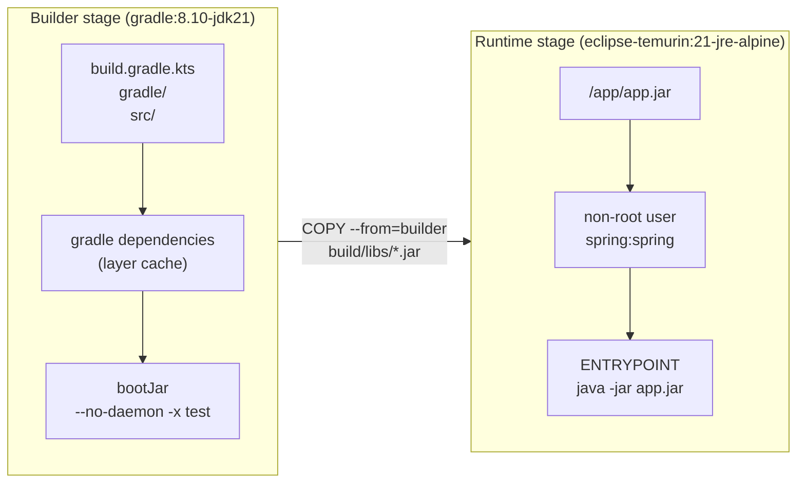
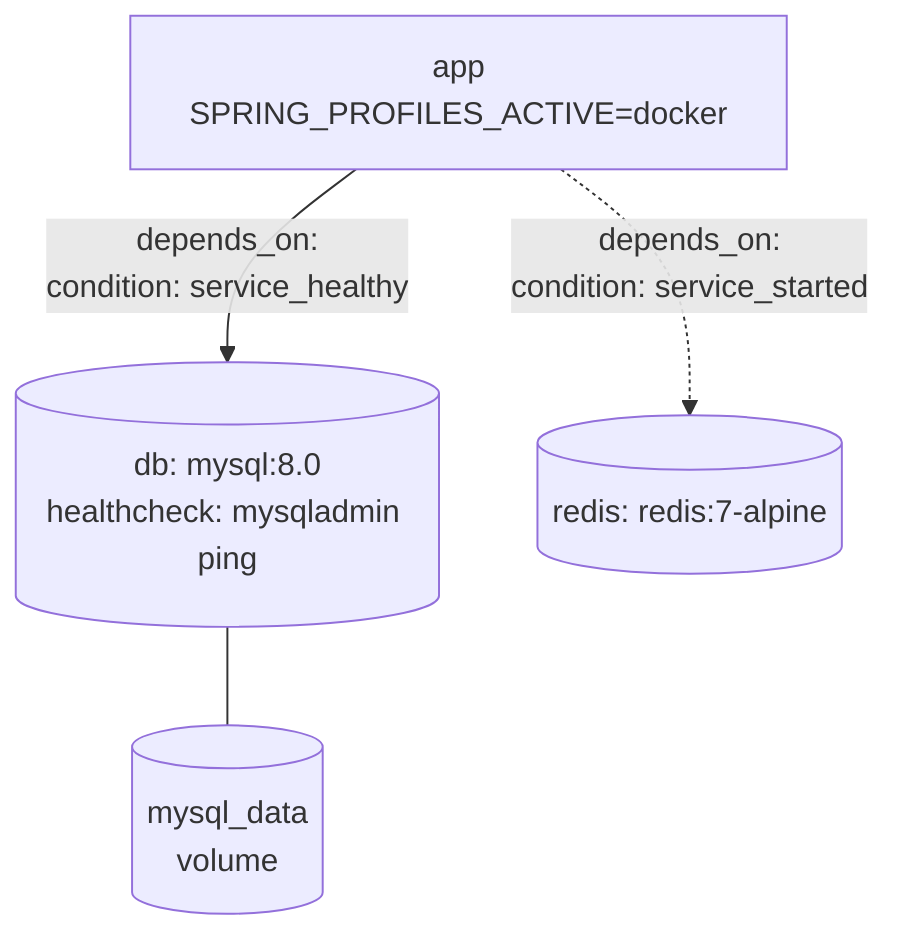
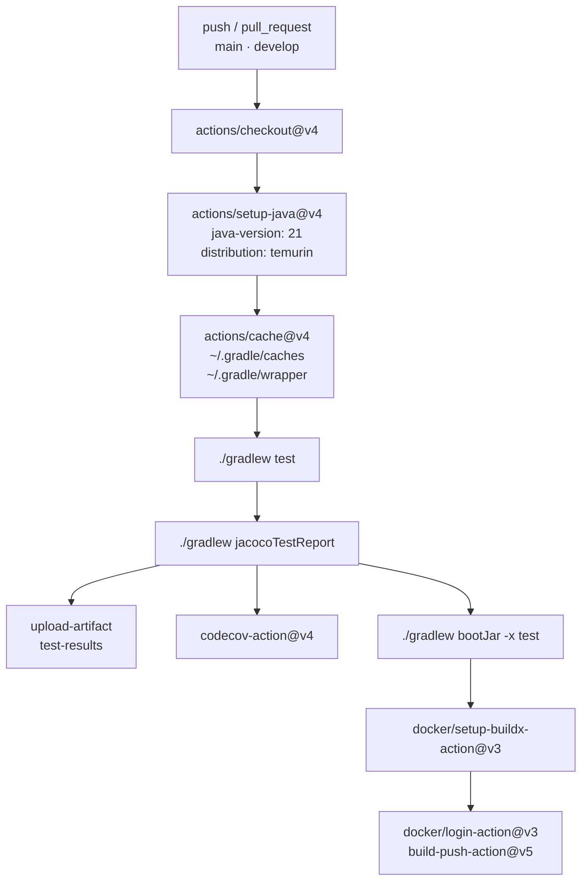
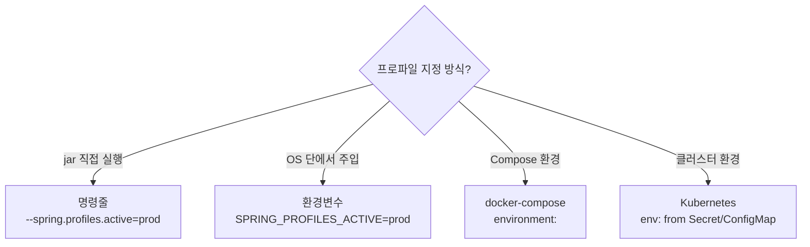

## 서론

"Docker 올려봤는데 DB 연결이 안 돼요." 사전과제 제출 직전에 가장 많이 나오는 말이다. 평가자가 `docker-compose up -d` 한 번에 앱을 띄울 수 없으면, 그 뒤의 코드 품질은 보이지 않는다.

5편에서 Security & Authentication을 다뤘다. 6편은 그 위에서 동작하는 배포 레이어를 다룬다.

평가자가 처음 확인하는 파일은 `Dockerfile`, `docker-compose.yml`, `README.md`다. 이 세 파일이 깔끔하면 기술적인 내용을 읽기 전부터 긍정적인 인상을 얻는다.

대상 독자는 Docker와 GitHub Actions 기본 사용법은 아는데, 사전과제에서 어떤 설정이 평가 포인트가 되는지 모르는 주니어 백엔드 개발자다.

[이전 글](/blog/spring-boot-pre-interview-guide-5)에서 Security & Authentication을 다뤘다.

- 1편 — [Core Application Layer](/blog/spring-boot-pre-interview-guide-1)
- 2편 — [Database & Testing](/blog/spring-boot-pre-interview-guide-2)
- 3편 — [Documentation & AOP](/blog/spring-boot-pre-interview-guide-3)
- 4편 — [Performance & Optimization](/blog/spring-boot-pre-interview-guide-4)
- 5편 — [Security & Authentication](/blog/spring-boot-pre-interview-guide-5)
- <strong>6편 — DevOps & Deployment (이 글)</strong>
- 7편 — [Advanced Patterns](/blog/spring-boot-pre-interview-guide-7)

---

## TL;DR

- <strong>멀티 스테이지 Dockerfile이 기본</strong> — `gradle:8.10-jdk21` Builder + `eclipse-temurin:21-jre-alpine` Runtime으로 분리하면 이미지 크기가 절반 이하로 줄고, non-root 사용자 실행까지 챙기면 평가자가 보안 의식을 읽는다.
- <strong>depends_on + healthcheck 조합이 핵심</strong> — `depends_on: condition: service_healthy`만이 DB가 실제로 쿼리를 받을 준비가 됐음을 보장한다. `depends_on`만 쓰면 MySQL 컨테이너가 시작됐어도 앱이 연결에 실패할 수 있다.
- <strong>GitHub Actions Gradle 캐시 + JaCoCo</strong> — `actions/cache@v4`로 `~/.gradle/caches`를 캐싱하면 빌드 시간이 크게 줄고, Codecov 업로드까지 붙이면 커버리지 리포트가 자동으로 생긴다.
- <strong>프로파일별 application.yml 분리</strong> — `local`(H2)·`docker`(MySQL 환경변수)·`prod`(Hikari 풀 설정)로 나누면 평가자가 환경 전환 없이 바로 실행할 수 있다.
- <strong>Actuator health + prometheus 노출</strong> — `/actuator/health`는 Docker Compose `healthcheck`와 연동할 수 있고, `/actuator/prometheus`는 Prometheus 스크랩 대상이 된다. 커스텀 HealthIndicator와 MeterRegistry까지 보여주면 가점이다.

---

## 1. Docker — 평가자가 처음 보는 곳

### 1.1 기본 Dockerfile

> <strong>참고</strong>: Spring Boot 4 + Kotlin 2.3 프로젝트 셋업(kotlin-spring·kotlin-jpa plugin 등) 자체는 1편 1.1절에서 다뤘다. 6편은 그 위에서 도는 DevOps·Deployment 영역에 집중한다. Kotlin 2.x 시리즈는 백워드 호환이라 같은 코드가 2.0~2.3 모두 작동한다.

단일 스테이지 Dockerfile은 가장 빠르게 만들 수 있지만, JDK까지 런타임 이미지에 포함되어 크기가 커진다. 과제 초기에 빠르게 검증할 때 쓴다.

```dockerfile
FROM eclipse-temurin:21-jdk-alpine

WORKDIR /app

COPY build/libs/*.jar app.jar

EXPOSE 8080

ENTRYPOINT ["java", "-jar", "app.jar"]
```

### 1.2 멀티 스테이지 빌드

빌드 단계와 런타임 단계를 분리한다. Builder 스테이지에서 JAR를 만들고, Runtime 스테이지에는 JRE만 올린다.



```dockerfile
# Build stage
FROM gradle:8.10-jdk21 AS builder

WORKDIR /app

# 의존성 캐싱을 위해 gradle 파일만 먼저 복사
COPY build.gradle.kts settings.gradle.kts ./
COPY gradle ./gradle

# 의존성 다운로드 (캐시 활용)
RUN gradle dependencies --no-daemon || true

# 소스 코드 복사 및 빌드
COPY src ./src
RUN gradle bootJar --no-daemon -x test

# Runtime stage
FROM eclipse-temurin:21-jre-alpine

WORKDIR /app

# 빌드된 jar 파일만 복사
COPY --from=builder /app/build/libs/*.jar app.jar

# 보안: non-root 사용자로 실행
RUN addgroup -S spring && adduser -S spring -G spring
USER spring:spring

EXPOSE 8080

ENTRYPOINT ["java", "-jar", "app.jar"]
```

<details>
<summary><strong>참고 — 이미지 크기 비교</strong></summary>

| 방식 | 베이스 이미지 | 예상 크기 |
|------|-------------|----------|
| JDK + 소스 전체 | eclipse-temurin:21-jdk | ~500MB |
| JDK + JAR만 | eclipse-temurin:21-jdk-alpine | ~350MB |
| JRE + JAR만 | eclipse-temurin:21-jre-alpine | ~200MB |

<strong>팁</strong>: `-alpine` 이미지는 크기가 작지만, 일부 네이티브 라이브러리 호환 문제가 있을 수 있다.

</details>

### 1.3 .dockerignore

```plaintext
# .dockerignore
.git
.gitignore
.idea
*.iml
.gradle
build
!build/libs/*.jar
node_modules
*.md
docker-compose*.yml
Dockerfile*
```

### 1.4 빌드 및 실행

```bash
# JAR 빌드 (테스트 스킵)
./gradlew bootJar -x test

# Docker 이미지 빌드
docker build -t my-app:latest .

# 컨테이너 실행
docker run -d -p 8080:8080 --name my-app my-app:latest

# 로그 확인
docker logs -f my-app
```

<details>
<summary><strong>참고 — JIB vs Dockerfile</strong></summary>

| 방식 | 장점 | 단점 |
|------|------|------|
| <strong>Dockerfile</strong> | 유연성 높음, 표준 방식 | Docker 데몬 필요, 수동 최적화 |
| <strong>JIB</strong> | Docker 데몬 불필요, 자동 레이어 최적화, 빠른 빌드 | Gradle/Maven 플러그인 의존 |

<strong>JIB 설정 예시</strong>:

```kotlin
// settings.gradle.kts
dependencyResolutionManagement {
    versionCatalogs {
        create("libs") {
            plugin("jib", "com.google.cloud.tools.jib").version("3.4.0")
        }
    }
}
```

```kotlin
// build.gradle.kts
plugins {
    id("com.google.cloud.tools.jib") version "3.4.0"
}

jib {
    from {
        image = "eclipse-temurin:21-jre-alpine"
    }
    to {
        image = "my-app"
        tags = setOf("latest", project.version.toString())
    }
    container {
        jvmFlags = listOf("-Xms512m", "-Xmx512m")
        ports = listOf("8080")
    }
}
```

```bash
# Docker 데몬 없이 로컬 Docker에 빌드
./gradlew jibDockerBuild
```

<strong>과제에서 권장</strong>: Dockerfile이 더 보편적이고 이해하기 쉬움

</details>

---

## 2. Docker Compose — 의존성과 시작 순서

### 2.1 기본 구성 (App + MySQL)

`depends_on`만 쓰면 MySQL 컨테이너 프로세스가 시작됐을 뿐, 실제로 쿼리를 받을 준비가 됐다는 보장이 없다. `healthcheck` + `condition: service_healthy`를 함께 써야 앱이 DB가 준비된 뒤에 시작된다.



```yaml
# docker-compose.yml
services:
  app:
    build:
      context: .
      dockerfile: Dockerfile
    ports:
      - "8080:8080"
    environment:
      - SPRING_PROFILES_ACTIVE=docker
      - SPRING_DATASOURCE_URL=jdbc:mysql://db:3306/myapp?useSSL=false&allowPublicKeyRetrieval=true
      - SPRING_DATASOURCE_USERNAME=root
      - SPRING_DATASOURCE_PASSWORD=password
    depends_on:
      db:
        condition: service_healthy
    restart: unless-stopped

  db:
    image: mysql:8.0
    ports:
      - "3306:3306"
    environment:
      - MYSQL_ROOT_PASSWORD=password
      - MYSQL_DATABASE=myapp
    volumes:
      - mysql_data:/var/lib/mysql
      - ./init.sql:/docker-entrypoint-initdb.d/init.sql
    healthcheck:
      test: ["CMD", "mysqladmin", "ping", "-h", "localhost"]
      interval: 10s
      timeout: 5s
      retries: 5

volumes:
  mysql_data:
```

### 2.2 Redis 포함 구성

Redis는 시작 즉시 요청을 받을 수 있어 `service_started`로 충분하다. MySQL과 달리 초기화 시간이 짧다.

```yaml
# docker-compose.yml
services:
  app:
    build: .
    ports:
      - "8080:8080"
    environment:
      - SPRING_PROFILES_ACTIVE=docker
      - SPRING_DATASOURCE_URL=jdbc:mysql://db:3306/myapp?useSSL=false&allowPublicKeyRetrieval=true
      - SPRING_DATASOURCE_USERNAME=root
      - SPRING_DATASOURCE_PASSWORD=password
      - SPRING_DATA_REDIS_HOST=redis
      - SPRING_DATA_REDIS_PORT=6379
    depends_on:
      db:
        condition: service_healthy
      redis:
        condition: service_started

  db:
    image: mysql:8.0
    environment:
      - MYSQL_ROOT_PASSWORD=password
      - MYSQL_DATABASE=myapp
    volumes:
      - mysql_data:/var/lib/mysql
    healthcheck:
      test: ["CMD", "mysqladmin", "ping", "-h", "localhost"]
      interval: 10s
      timeout: 5s
      retries: 5

  redis:
    image: redis:7-alpine
    ports:
      - "6379:6379"

volumes:
  mysql_data:
```

### 2.3 개발용 구성 — DB만

로컬에서 앱을 IDE로 실행하고 DB만 Docker로 띄울 때 쓴다.

```yaml
# docker-compose.dev.yml
services:
  db:
    image: mysql:8.0
    ports:
      - "3306:3306"
    environment:
      - MYSQL_ROOT_PASSWORD=password
      - MYSQL_DATABASE=myapp
    volumes:
      - mysql_data:/var/lib/mysql

volumes:
  mysql_data:
```

### 2.4 자주 쓰는 명령어

```bash
# 전체 서비스 실행
docker-compose up -d

# 빌드 후 실행
docker-compose up -d --build

# 로그 확인
docker-compose logs -f app

# 특정 서비스만 실행
docker-compose up -d db

# 서비스 중지 및 삭제
docker-compose down

# 볼륨까지 삭제
docker-compose down -v
```

<details>
<summary><strong>참고 — depends_on·healthcheck·.env·서비스 네트워크</strong></summary>

<strong>depends_on과 healthcheck</strong>:
- `depends_on`만으로는 컨테이너 시작 순서만 보장
- 실제 서비스 준비 완료를 위해 `healthcheck` + `condition: service_healthy` 사용

<strong>환경 변수 관리</strong>:
```yaml
# .env 파일 사용
services:
  db:
    environment:
      - MYSQL_ROOT_PASSWORD=${DB_PASSWORD}
```

```bash
# .env 파일
DB_PASSWORD=secure_password
```

<strong>네트워크</strong>:
- 같은 docker-compose 내 서비스는 서비스명으로 통신 가능
- 예: `jdbc:mysql://db:3306/myapp` (db는 서비스명)

</details>

---

## 3. GitHub Actions — CI 파이프라인

GitHub Actions는 `.github/workflows/` 디렉토리에 YAML 파일을 추가하는 것만으로 동작한다. 사전과제는 대부분 GitHub에서 관리하므로, 별도 인프라 없이 CI를 붙일 수 있다.



### 3.1 기본 CI 파이프라인

```yaml
# .github/workflows/ci.yml
name: CI

on:
  push:
    branches: [ main, develop ]
  pull_request:
    branches: [ main, develop ]

jobs:
  build:
    runs-on: ubuntu-latest

    steps:
      - name: Checkout
        uses: actions/checkout@v4

      - name: Set up JDK 21
        uses: actions/setup-java@v4
        with:
          java-version: '21'
          distribution: 'temurin'

      - name: Grant execute permission for gradlew
        run: chmod +x gradlew

      - name: Cache Gradle packages
        uses: actions/cache@v4
        with:
          path: |
            ~/.gradle/caches
            ~/.gradle/wrapper
          key: ${{ runner.os }}-gradle-${{ hashFiles('**/*.gradle*', '**/gradle-wrapper.properties') }}
          restore-keys: |
            ${{ runner.os }}-gradle-

      - name: Build with Gradle
        run: ./gradlew build

      - name: Run tests
        run: ./gradlew test

      - name: Upload test results
        uses: actions/upload-artifact@v4
        if: always()
        with:
          name: test-results
          path: build/reports/tests/
```

### 3.2 테스트 커버리지 — JaCoCo

JaCoCo를 CI에 붙이면 PR마다 커버리지 리포트가 생긴다. Codecov 연동까지 하면 리포지토리 배지로 커버리지를 외부에 노출할 수 있다.

```kotlin
// build.gradle.kts
plugins {
    jacoco
}

jacoco {
    toolVersion = "0.8.11"
}

tasks.jacocoTestReport {
    dependsOn(tasks.test)
    reports {
        xml.required.set(true)
        html.required.set(true)
    }
}

tasks.test {
    finalizedBy(tasks.jacocoTestReport)
}
```

```yaml
# .github/workflows/ci.yml
name: CI

on:
  push:
    branches: [ main, develop ]
  pull_request:
    branches: [ main, develop ]

jobs:
  build:
    runs-on: ubuntu-latest

    steps:
      - name: Checkout
        uses: actions/checkout@v4

      - name: Set up JDK 21
        uses: actions/setup-java@v4
        with:
          java-version: '21'
          distribution: 'temurin'

      - name: Grant execute permission for gradlew
        run: chmod +x gradlew

      - name: Cache Gradle packages
        uses: actions/cache@v4
        with:
          path: |
            ~/.gradle/caches
            ~/.gradle/wrapper
          key: ${{ runner.os }}-gradle-${{ hashFiles('**/*.gradle*', '**/gradle-wrapper.properties') }}
          restore-keys: |
            ${{ runner.os }}-gradle-

      - name: Build and Test with Coverage
        run: ./gradlew test jacocoTestReport

      - name: Upload test results
        uses: actions/upload-artifact@v4
        if: always()
        with:
          name: test-results
          path: build/reports/tests/

      - name: Upload coverage to Codecov
        uses: codecov/codecov-action@v4
        with:
          file: build/reports/jacoco/test/jacocoTestReport.xml
          fail_ci_if_error: false
```

### 3.3 Docker 이미지 빌드 및 푸시

main 브랜치 머지나 태그 푸시 시 자동으로 Docker Hub에 이미지를 올린다. `docker/metadata-action`이 브랜치명·태그·SHA를 자동으로 이미지 태그로 만들어준다.

```yaml
# .github/workflows/docker.yml
name: Docker Build and Push

on:
  push:
    branches: [ main ]
    tags: [ 'v*' ]

jobs:
  build:
    runs-on: ubuntu-latest

    steps:
      - name: Checkout
        uses: actions/checkout@v4

      - name: Set up JDK 21
        uses: actions/setup-java@v4
        with:
          java-version: '21'
          distribution: 'temurin'

      - name: Build JAR
        run: ./gradlew bootJar -x test

      - name: Set up Docker Buildx
        uses: docker/setup-buildx-action@v3

      - name: Login to Docker Hub
        uses: docker/login-action@v3
        with:
          username: ${{ secrets.DOCKER_USERNAME }}
          password: ${{ secrets.DOCKER_PASSWORD }}

      - name: Extract metadata
        id: meta
        uses: docker/metadata-action@v5
        with:
          images: ${{ secrets.DOCKER_USERNAME }}/my-app
          tags: |
            type=ref,event=branch
            type=semver,pattern={{version}}
            type=sha,prefix=

      - name: Build and push
        uses: docker/build-push-action@v5
        with:
          context: .
          push: true
          tags: ${{ steps.meta.outputs.tags }}
          cache-from: type=gha
          cache-to: type=gha,mode=max
```

<details>
<summary><strong>참고 — GitHub Actions vs Jenkins vs GitLab CI</strong></summary>

| 도구 | 장점 | 단점 |
|------|------|------|
| <strong>GitHub Actions</strong> | GitHub 통합, 무료 제공량, 마켓플레이스 | GitHub 종속 |
| <strong>Jenkins</strong> | 유연성, 플러그인 풍부 | 설정 복잡, 인프라 필요 |
| <strong>GitLab CI</strong> | GitLab 통합, 기본 제공 | GitLab 종속 |

<strong>과제에서 권장</strong>: GitHub에서 관리하는 과제라면 GitHub Actions가 가장 간단

</details>

<details>
<summary><strong>참고 — GitHub Actions 팁</strong></summary>

<strong>Secrets 설정</strong>:
- Repository → Settings → Secrets and variables → Actions
- `DOCKER_USERNAME`, `DOCKER_PASSWORD` 등 민감 정보 저장

<strong>캐시 활용</strong>:
- Gradle 의존성 캐시로 빌드 시간 단축
- `actions/cache@v4` 사용

<strong>조건부 실행</strong>:
```yaml
- name: Deploy
  if: github.ref == 'refs/heads/main'
  run: ./deploy.sh
```

<strong>Matrix 빌드</strong>:
```yaml
strategy:
  matrix:
    java: [21]
steps:
  - uses: actions/setup-java@v4
    with:
      java-version: ${{ matrix.java }}
```

</details>

---

## 4. 프로파일 관리 — 환경별 설정 분리

### 4.1 환경별 파일 구조

```text
src/main/resources/
├── application.yml           # 공통 설정
├── application-local.yml     # 로컬 개발
├── application-dev.yml       # 개발 서버
├── application-docker.yml    # Docker 환경
├── application-prod.yml      # 운영 환경
└── application-test.yml      # 테스트
```

### 4.2 공통 설정 (application.yml)

```yaml
# application.yml
spring:
  application:
    name: my-app
  jpa:
    open-in-view: false
    properties:
      hibernate:
        default_batch_fetch_size: 100

server:
  port: 8080

logging:
  level:
    root: INFO
```

### 4.3 환경별 설정

```yaml
# application-local.yml
spring:
  datasource:
    url: jdbc:h2:mem:testdb
    driver-class-name: org.h2.Driver
    username: sa
    password:
  h2:
    console:
      enabled: true
  jpa:
    hibernate:
      ddl-auto: create-drop
    show-sql: true

logging:
  level:
    org.hibernate.SQL: DEBUG
    com.example: DEBUG
```

```yaml
# application-docker.yml
spring:
  datasource:
    url: jdbc:mysql://${DB_HOST:db}:${DB_PORT:3306}/${DB_NAME:myapp}?useSSL=false&allowPublicKeyRetrieval=true
    driver-class-name: com.mysql.cj.jdbc.Driver
    username: ${DB_USERNAME:root}
    password: ${DB_PASSWORD:password}
  jpa:
    hibernate:
      ddl-auto: validate
    show-sql: false

logging:
  level:
    root: INFO
    com.example: INFO
```

```yaml
# application-prod.yml
spring:
  datasource:
    url: ${DB_URL}
    username: ${DB_USERNAME}
    password: ${DB_PASSWORD}
    hikari:
      maximum-pool-size: 20
      minimum-idle: 5
  jpa:
    hibernate:
      ddl-auto: none
    show-sql: false

logging:
  level:
    root: WARN
    com.example: INFO

server:
  shutdown: graceful

management:
  endpoints:
    web:
      exposure:
        include: health,info,prometheus
```

### 4.4 프로파일 활성화

```bash
# 명령줄
java -jar app.jar --spring.profiles.active=prod

# 환경변수
export SPRING_PROFILES_ACTIVE=prod
java -jar app.jar

# Docker
docker run -e SPRING_PROFILES_ACTIVE=docker my-app

# Docker Compose
environment:
  - SPRING_PROFILES_ACTIVE=docker
```



<details>
<summary><strong>참고 — 환경변수 vs application.yml</strong></summary>

| 방식 | 장점 | 단점 | 사용 시점 |
|------|------|------|----------|
| <strong>application.yml</strong> | 버전 관리, 가독성 | 빌드 시 고정 | 기본 설정, 비민감 정보 |
| <strong>환경변수</strong> | 런타임 변경, 민감 정보 분리 | 관리 어려움 | 비밀번호, API Key 등 |

<strong>권장 패턴</strong>:
- 기본값은 application.yml에 설정
- 민감 정보는 환경변수로 오버라이드
- `${DB_PASSWORD:default}` 형태로 기본값 제공

</details>

---

## 5. Actuator & Monitoring — 상태와 메트릭 노출

### 5.1 Actuator 설정

```kotlin
// settings.gradle.kts
dependencyResolutionManagement {
    versionCatalogs {
        create("libs") {
            library("spring-boot-starter-actuator", "org.springframework.boot:spring-boot-starter-actuator:3.4.0")
            library("micrometer-registry-prometheus", "io.micrometer:micrometer-registry-prometheus:1.14.0")
        }
    }
}
```

```kotlin
// build.gradle.kts
dependencies {
    implementation(libs.spring.boot.starter.actuator)
    implementation(libs.micrometer.registry.prometheus)
}
```

```yaml
# application.yml
management:
  endpoints:
    web:
      exposure:
        include: health,info,metrics,prometheus
      base-path: /actuator
  endpoint:
    health:
      show-details: when_authorized
  info:
    env:
      enabled: true

info:
  app:
    name: ${spring.application.name}
    version: 1.0.0
    description: My Spring Boot Application
```

### 5.2 Health Check 커스터마이징 — HealthIndicator

Spring Boot Actuator는 기본 DB 헬스 체크를 자동으로 제공하지만, 비즈니스 로직에 필요한 커스텀 헬스 체크를 추가할 수 있다.

```kotlin
@Component
class CustomHealthIndicator(
    private val dataSource: DataSource
) : HealthIndicator {

    override fun health(): Health {
        return try {
            dataSource.connection.use { connection ->
                if (connection.isValid(1)) {
                    Health.up()
                        .withDetail("database", "Available")
                        .build()
                } else {
                    Health.down().build()
                }
            }
        } catch (e: SQLException) {
            Health.down()
                .withDetail("database", "Unavailable")
                .withException(e)
                .build()
        }
    }
}
```

### 5.3 Prometheus 메트릭

`micrometer-registry-prometheus` 의존성은 5.1절에서 추가했다. Prometheus가 `/actuator/prometheus`를 스크랩할 수 있도록 application.yml에서 해당 엔드포인트를 노출한다.

```yaml
# application.yml
management:
  endpoints:
    web:
      exposure:
        include: health,info,prometheus
  metrics:
    tags:
      application: ${spring.application.name}
```

### 5.4 커스텀 메트릭 — MeterRegistry

비즈니스 이벤트를 메트릭으로 기록한다. `@PostConstruct`나 nullable 필드 없이, primary constructor에서 직접 초기화한다.

```kotlin
@Component
class OrderMetrics(
    meterRegistry: MeterRegistry
) {
    private val orderCounter: Counter = Counter.builder("orders.created")
        .description("Number of orders created")
        .register(meterRegistry)

    private val orderProcessingTimer: Timer = Timer.builder("orders.processing.time")
        .description("Order processing time")
        .register(meterRegistry)

    fun incrementOrderCount() {
        orderCounter.increment()
    }

    fun recordProcessingTime(milliseconds: Long) {
        orderProcessingTimer.record(Duration.ofMillis(milliseconds))
    }
}
```

### 5.5 Graceful Shutdown

Graceful Shutdown은 `server.shutdown: graceful`을 설정하면 Spring Boot가 처리 중인 요청을 완료한 뒤 종료한다. `@PreDestroy`로 추가 정리 로직을 붙일 수 있다.

```yaml
# application.yml
server:
  shutdown: graceful

spring:
  lifecycle:
    timeout-per-shutdown-phase: 30s
```

```kotlin
@Component
class GracefulShutdownHandler {

    private val log = LoggerFactory.getLogger(this::class.java)

    @PreDestroy
    fun onShutdown() {
        log.info("Application is shutting down gracefully...")
        // 진행 중인 작업 완료 대기 등
    }
}
```

### 5.X 참고: Actuator 보안

<details>
<summary><strong>참고 — Actuator 보안 설정</strong></summary>

<strong>프로덕션 노출 엔드포인트 제한</strong>:
```yaml
management:
  endpoints:
    web:
      exposure:
        include: health,info,prometheus  # 필요한 것만
```

<strong>인증 적용</strong>:
```kotlin
@Bean
fun actuatorSecurity(http: HttpSecurity): SecurityFilterChain {
    return http
        .securityMatcher("/actuator/**")
        .authorizeHttpRequests { auth ->
            auth
                .requestMatchers("/actuator/health").permitAll()
                .requestMatchers("/actuator/**").hasRole("ADMIN")
        }
        .build()
}
```

<strong>별도 포트 사용</strong>:
```yaml
management:
  server:
    port: 9090  # 내부 네트워크에서만 접근
```

</details>

---

## 정리

- <strong>멀티 스테이지 Dockerfile + non-root 사용자</strong> — 이미지 크기를 줄이고 보안 의식을 보여준다. 평가자는 단일 JDK 이미지 대신 JRE 런타임 스테이지를 보면 "최적화를 알고 있다"고 읽는다.
- <strong>depends_on + healthcheck 조합</strong> — `service_healthy` 조건 없이 `depends_on`만 쓰면 DB가 준비되기 전에 앱이 시작해 연결 실패가 난다. 이 조합이 "Docker를 제대로 안다"는 신호다.
- <strong>GitHub Actions Gradle 캐시 + JaCoCo</strong> — 캐시 없이 매 빌드마다 의존성을 내려받으면 빌드 시간이 길어진다. JaCoCo + Codecov까지 붙이면 커버리지가 자동으로 기록된다.
- <strong>프로파일 분리 + 환경변수 주입</strong> — `local`(H2)·`docker`·`prod` 세 파일로 나누고 민감 정보는 환경변수로 주입하는 패턴이 평가자가 기대하는 기본이다.
- <strong>Actuator health + prometheus 노출</strong> — `/actuator/health`는 Docker Compose healthcheck 대상이 되고, 커스텀 HealthIndicator와 MeterRegistry까지 보여주면 모니터링 의식이 있다는 평가를 받는다.

다음 7편에서는 이벤트 기반 아키텍처와 비동기 처리, 멀티 모듈 프로젝트 구성을 다룬다. Kafka·Spring Events로 모듈 경계를 넘는 흐름을 정리하고, `@Async`와 `CompletableFuture`의 실무적 차이도 함께 본다. Gradle 멀티 모듈 분할 기준까지 정리한다.

### 체크리스트

| 항목 | 확인 |
|------|------|
| Dockerfile이 작성되어 있는가? | ⬜ |
| 멀티 스테이지 빌드를 사용하는가? | ⬜ |
| Docker Compose로 로컬 실행이 가능한가? | ⬜ |
| depends_on + healthcheck 조합을 사용하는가? | ⬜ |
| README에 실행 방법이 명시되어 있는가? | ⬜ |
| GitHub Actions CI가 설정되어 있는가? | ⬜ |
| 환경별 프로파일이 분리되어 있는가? | ⬜ |
| 민감 정보가 환경변수로 분리되어 있는가? | ⬜ |
| Actuator health 엔드포인트가 활성화되어 있는가? | ⬜ |

### README 템플릿

````markdown
## 실행 방법

### 로컬 실행 (H2)

```bash
./gradlew bootRun --args='--spring.profiles.active=local'
```

### Docker Compose 실행

```bash
# 전체 서비스 실행
docker-compose up -d

# 로그 확인
docker-compose logs -f app

# 종료
docker-compose down
```

### 접속 정보

- API: http://localhost:8080
- Swagger: http://localhost:8080/swagger-ui.html
- H2 Console: http://localhost:8080/h2-console (로컬 프로파일)
- Actuator: http://localhost:8080/actuator/health
````

---

## 부록

<details>
<summary><strong>과제에서 흔한 실수 — 5종</strong></summary>

1. <strong>Docker Compose 실행 불가</strong>
   - 환경변수 누락, 포트 충돌
   - 반드시 클린 환경에서 테스트

2. <strong>프로파일 미지정 시 에러</strong>
   - 기본 프로파일 설정 또는 H2 폴백 제공
   - application.yml에 기본 동작 가능하도록 설정

3. <strong>GitHub Actions 빌드 실패</strong>
   - gradlew 실행 권한 (`chmod +x`)
   - 테스트 실패 무시 금지 (문제 수정 필요)

4. <strong>민감 정보 노출</strong>
   - application.yml에 실제 비밀번호 하드코딩
   - GitHub 공개 저장소에 secret 푸시

5. <strong>depends_on만 쓰고 healthcheck 생략</strong>
   - MySQL이 시작됐어도 초기화가 끝나지 않으면 앱이 연결 실패
   - `condition: service_healthy` + `healthcheck` 조합 필수

</details>

<details>
<summary><strong>Blue-Green vs Rolling vs Canary 배포</strong></summary>

| 방식 | 특징 | 장점 | 단점 |
|------|------|------|------|
| <strong>Blue-Green</strong> | 두 환경 전환 | 즉시 롤백, 다운타임 없음 | 리소스 2배 필요 |
| <strong>Rolling</strong> | 점진적 교체 | 리소스 효율적 | 롤백 느림, 버전 혼재 |
| <strong>Canary</strong> | 일부에만 적용 | 위험 최소화 | 구현 복잡 |

<strong>과제에서</strong>: 배포 전략까지 구현할 필요는 없지만, README에 언급하면 가산점

</details>

<details>
<summary><strong>Prometheus + Grafana 모니터링 설정</strong></summary>

<strong>1. Spring Boot Actuator + Micrometer 설정</strong>

5.1절에서 추가한 `spring-boot-starter-actuator`와 `micrometer-registry-prometheus` 의존성을 그대로 사용한다.

```yaml
# application.yml
management:
  endpoints:
    web:
      exposure:
        include: health, info, prometheus, metrics
  endpoint:
    health:
      show-details: when_authorized
  metrics:
    tags:
      application: ${spring.application.name}
```

<strong>2. Docker Compose에 Prometheus/Grafana 추가</strong>

```yaml
# docker-compose.yml
services:
  app:
    build: .
    ports:
      - "8080:8080"
    environment:
      - SPRING_PROFILES_ACTIVE=docker

  prometheus:
    image: prom/prometheus:v2.45.0
    ports:
      - "9090:9090"
    volumes:
      - ./monitoring/prometheus.yml:/etc/prometheus/prometheus.yml
    command:
      - '--config.file=/etc/prometheus/prometheus.yml'

  grafana:
    image: grafana/grafana:10.0.0
    ports:
      - "3000:3000"
    environment:
      - GF_SECURITY_ADMIN_USER=admin
      - GF_SECURITY_ADMIN_PASSWORD=admin
    volumes:
      - grafana-data:/var/lib/grafana

volumes:
  grafana-data:
```

<strong>3. Prometheus 설정 파일</strong>

```yaml
# monitoring/prometheus.yml
global:
  scrape_interval: 15s

scrape_configs:
  - job_name: 'spring-boot-app'
    metrics_path: '/actuator/prometheus'
    static_configs:
      - targets: ['app:8080']
```

<strong>4. Grafana 대시보드 설정</strong>

1. `http://localhost:3000` 접속 (admin/admin)
2. Data Sources → Add data source → Prometheus
3. URL: `http://prometheus:9090`
4. Import Dashboard → ID: `4701` (JVM Micrometer) 또는 `11378` (Spring Boot Statistics)

<strong>과제에서</strong>: 모니터링 설정까지 구현하면 가산점. 최소한 `/actuator/health` 엔드포인트는 노출하는 것을 권장.

</details>
