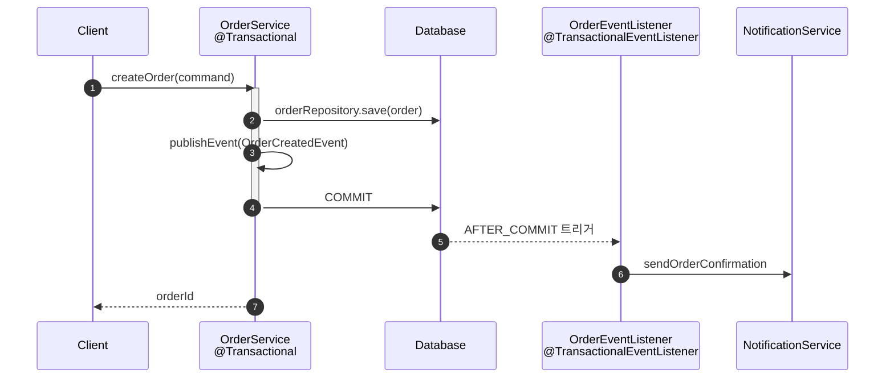
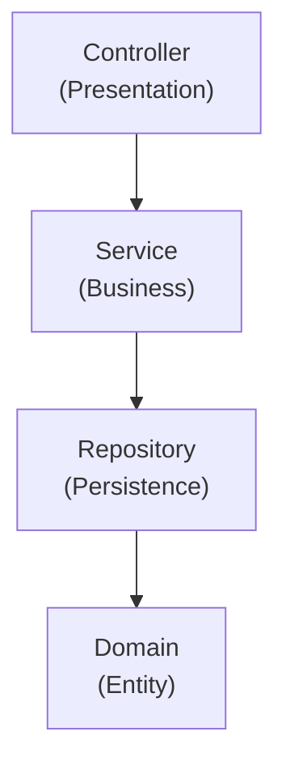
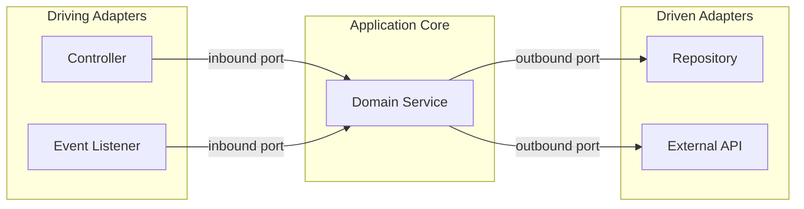
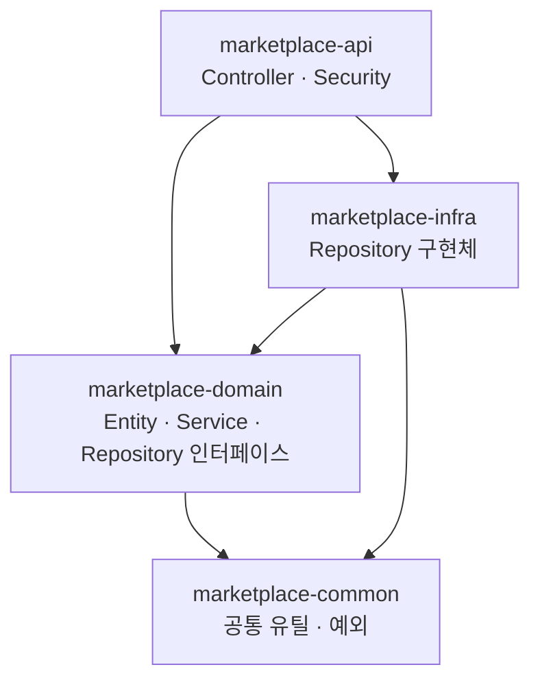
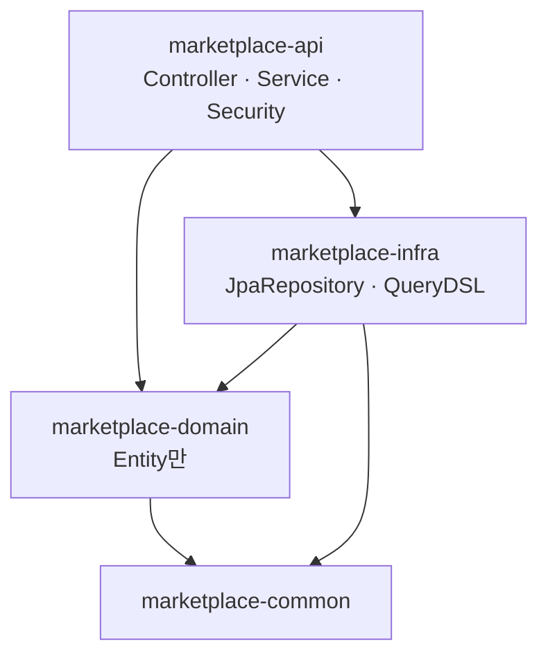

## 서론

시리즈 마지막 편이다. 앞서 1~6편에서 Core Application Layer부터 DevOps & Deployment까지 다뤘는데, 7편은 그 위에서 차별화를 만드는 고급 패턴을 다룬다. 모든 항목을 한 번에 적용할 필요는 없다. 과제의 요구사항과 복잡도를 읽고 적절한 패턴을 선택하는 판단력 자체가 평가 포인트다.

이벤트 기반 아키텍처, 비동기 처리, 파일 처리는 대부분의 과제에서 한두 개는 필요하다. API 버저닝과 아키텍처 패턴은 설계 결정의 이유를 README에 남기면 그것만으로도 평가자에게 설계 역량을 보여줄 수 있다. 멀티 모듈은 적용 자체보다 적용 이후 의존성 방향을 일관되게 유지하는 것이 더 중요하다.

대상 독자는 Spring Boot 기본 과제를 완성했고, 코드 품질과 설계 완성도를 한 단계 높이고 싶은 주니어 백엔드 개발자다.

[이전 글](/blog/spring-boot-pre-interview-guide-6)에서 DevOps & Deployment를 다뤘다.

- 1편 — [Core Application Layer](/blog/spring-boot-pre-interview-guide-1)
- 2편 — [Database & Testing](/blog/spring-boot-pre-interview-guide-2)
- 3편 — [Documentation & AOP](/blog/spring-boot-pre-interview-guide-3)
- 4편 — [Performance & Optimization](/blog/spring-boot-pre-interview-guide-4)
- 5편 — [Security & Authentication](/blog/spring-boot-pre-interview-guide-5)
- 6편 — [DevOps & Deployment](/blog/spring-boot-pre-interview-guide-6)
- <strong>7편 — Advanced Patterns (이 글)</strong>

---

## TL;DR

- <strong>이벤트 기반 아키텍처</strong> — `@TransactionalEventListener(phase = AFTER_COMMIT)`로 주문 저장이 확정된 후에만 알림을 발송해 도메인 로직과 부가 기능을 분리한다.
- <strong>비동기 처리</strong> — `@Async`는 같은 클래스 내 self-invocation에서 동기로 실행되므로 반드시 별도 Bean에서 호출하고, `AsyncUncaughtExceptionHandler`를 반드시 설정한다.
- <strong>파일 처리</strong> — 확장자·MIME·크기 검증 후 UUID 기반 파일명으로 저장하고, `normalize()`로 경로 traversal을 방어한다.
- <strong>API 버저닝</strong> — URI 방식(`/api/v1/...`)이 가장 명확하고 캐싱·테스트·문서화 모두 친화적이다.
- <strong>멀티 모듈</strong> — Option A(의존 역전 원칙)·Option B(간소화) 중 하나로 일관되게 적용하고, domain → infra 의존은 어떤 옵션을 선택해도 금지다.

---

## 1. 이벤트 기반 아키텍처 — 도메인 로직과 부가 기능 분리

### 1.1 Spring Events 기본

<strong>이벤트 기반 아키텍처</strong>는 도메인 로직과 알림·로깅 같은 부가 기능 사이의 결합도를 낮추는 패턴이다. 주문 생성 서비스가 알림 서비스를 직접 호출하면 두 클래스가 강하게 결합된다. 이벤트를 사이에 두면 OrderService는 "주문이 생성됐다"는 사실만 발행하고, 그 이후 일은 리스너가 담당한다.

> <strong>참고</strong>: Spring Boot 4 + Kotlin 2.3 프로젝트 셋업(kotlin-spring·kotlin-jpa plugin 등) 자체는 1편 1.1절에서 다뤘다. 7편은 그 위에서 도는 Advanced Patterns 영역에 집중한다. Kotlin 2.x 시리즈는 백워드 호환이라 같은 코드가 2.0~2.3 모두 작동한다.

```kotlin
// 이벤트 정의
data class OrderCreatedEvent(
    val orderId: Long,
    val memberId: Long,
    val totalAmount: Int,
    val occurredAt: LocalDateTime = LocalDateTime.now()
) {
    constructor(order: Order) : this(
        orderId = order.id!!,
        memberId = order.member.id!!,
        totalAmount = order.totalAmount
    )
}

// 이벤트 발행
@Service
class OrderService(
    private val orderRepository: OrderRepository,
    private val eventPublisher: ApplicationEventPublisher
) {
    @Transactional
    fun createOrder(command: OrderCreateCommand): Long {
        val order = Order.create(command)
        orderRepository.save(order)

        eventPublisher.publishEvent(OrderCreatedEvent(order))

        return order.id!!
    }
}

// 이벤트 리스너
@Component
class OrderEventListener(
    private val notificationService: NotificationService
) {
    private val log = LoggerFactory.getLogger(this::class.java)

    @EventListener
    fun handleOrderCreated(event: OrderCreatedEvent) {
        log.info("Order created: orderId={}, memberId={}", event.orderId, event.memberId)
        notificationService.sendOrderConfirmation(event.memberId, event.orderId)
    }
}
```

### 1.2 @TransactionalEventListener

`@EventListener`는 트랜잭션 내부에서 실행된다. 리스너에서 예외가 발생하면 주문 저장까지 롤백된다. 알림은 주문 저장이 확정된 후에만 발송하는 것이 맞다. 이 문제를 `@TransactionalEventListener`가 해결한다.

```kotlin
@Component
class OrderEventListener(
    private val notificationService: NotificationService
) {
    /**
     * 트랜잭션 커밋 후 실행 — 주문 저장이 확정된 후에만 알림 발송
     */
    @TransactionalEventListener(phase = TransactionPhase.AFTER_COMMIT)
    fun handleOrderCreatedAfterCommit(event: OrderCreatedEvent) {
        notificationService.sendOrderConfirmation(event.memberId, event.orderId)
    }

    /**
     * 트랜잭션 롤백 시 실행 — 실패 로깅 등
     */
    @TransactionalEventListener(phase = TransactionPhase.AFTER_ROLLBACK)
    fun handleOrderCreatedOnRollback(event: OrderCreatedEvent) {
        // 실패 로깅
    }
}
```

아래 다이어그램은 `AFTER_COMMIT` 흐름을 보여준다. `publishEvent`는 트랜잭션 안에서 호출되지만 리스너는 커밋 완료 후 실행된다.



| Phase | 설명 | 사용 시점 |
|-------|------|----------|
| `AFTER_COMMIT` | 커밋 성공 후 | 알림, 외부 시스템 연동 |
| `AFTER_ROLLBACK` | 롤백 후 | 실패 로깅, 보상 처리 |
| `AFTER_COMPLETION` | 커밋/롤백 상관없이 | 리소스 정리 |
| `BEFORE_COMMIT` | 커밋 직전 | 추가 검증 |

### 1.3 비동기 이벤트 처리

알림 발송이 느린 외부 시스템에 의존한다면, 리스너를 `@Async`로 만들면 메인 스레드를 블록하지 않는다.

```kotlin
@Component
class OrderEventListener(
    private val notificationService: NotificationService
) {
    @Async
    @TransactionalEventListener(phase = TransactionPhase.AFTER_COMMIT)
    fun handleOrderCreatedAsync(event: OrderCreatedEvent) {
        // 비동기로 실행되어 메인 트랜잭션에 영향 없음
        notificationService.sendOrderConfirmation(event.memberId, event.orderId)
    }
}
```

<details>
<summary><strong>이벤트 vs 직접 호출 선택 기준</strong></summary>

| 상황 | 권장 방식 | 이유 |
|------|----------|------|
| 핵심 비즈니스 로직 | 직접 호출 | 명확한 흐름, 디버깅 용이 |
| 부가 기능 (알림, 로깅) | 이벤트 | 느슨한 결합, 확장 용이 |
| 외부 시스템 연동 | 이벤트 + 비동기 | 실패해도 메인 로직 영향 없음 |
| 여러 모듈에서 반응 | 이벤트 | 발행자가 구독자를 몰라도 됨 |

**과제에서 권장**: 핵심 로직은 직접 호출, 알림/로깅 등은 이벤트로 분리하면 좋은 설계로 평가받을 수 있다.

</details>

<details>
<summary><strong>이벤트 사용 시 주의점</strong></summary>

1. **트랜잭션 경계 주의** — `@EventListener`는 같은 트랜잭션 내에서 실행되어 리스너 예외 시 전체 롤백.
2. **순환 참조 주의** — A → 이벤트 발행 → B 리스너 → A 호출 → 무한 루프.
3. **테스트 어려움** — 이벤트 발행/구독 검증 필요. `@SpyBean`이나 테스트용 리스너 활용.
4. **디버깅 어려움** — 흐름 추적이 어려우므로 로깅을 충실히 남길 것.

</details>

---

## 2. 비동기 처리 — @Async와 CompletableFuture

### 2.1 @Async 설정

<strong>@Async</strong>는 메서드를 별도 스레드에서 실행하게 만드는 어노테이션이다. `@Configuration`에 `@EnableAsync`를 붙이고, `AsyncConfigurer`로 스레드풀과 예외 핸들러를 함께 설정해야 한다. 예외 핸들러를 빠뜨리면 void 반환 메서드의 예외가 조용히 사라진다.

```kotlin
@Configuration
@EnableAsync
class AsyncConfig : AsyncConfigurer {

    override fun getAsyncExecutor(): Executor {
        val executor = ThreadPoolTaskExecutor()
        executor.corePoolSize = 5
        executor.maxPoolSize = 10
        executor.setQueueCapacity(100)
        executor.setThreadNamePrefix("async-")
        executor.setRejectedExecutionHandler(ThreadPoolExecutor.CallerRunsPolicy())
        executor.initialize()
        return executor
    }

    override fun getAsyncUncaughtExceptionHandler(): AsyncUncaughtExceptionHandler {
        return AsyncUncaughtExceptionHandler { ex, method, _ ->
            val log = LoggerFactory.getLogger(method.declaringClass)
            log.error("Async method {} threw exception: {}", method.name, ex.message, ex)
        }
    }
}
```

### 2.2 @Async 사용

```kotlin
@Service
class NotificationService(
    private val emailSender: EmailSender,
    private val smsSender: SmsSender
) {
    private val log = LoggerFactory.getLogger(this::class.java)

    @Async
    fun sendOrderConfirmation(memberId: Long, orderId: Long) {
        log.info("Sending order confirmation: memberId={}, orderId={}", memberId, orderId)
        // 이메일 발송 (비동기로 실행)
        emailSender.send(memberId, "주문 확인", "주문이 완료되었습니다.")
    }

    @Async
    fun sendSmsAsync(phoneNumber: String, message: String): CompletableFuture<Boolean> {
        val result = smsSender.send(phoneNumber, message)
        return CompletableFuture.completedFuture(result)
    }
}
```

### 2.3 CompletableFuture 활용

여러 독립 조회를 순차 실행하면 응답 시간이 합산된다. `CompletableFuture.supplyAsync`로 병렬 실행하면 가장 느린 작업 하나의 시간만 든다.

```kotlin
@Service
class ProductAggregationService(
    private val productService: ProductService,
    private val reviewService: ReviewService,
    private val inventoryService: InventoryService
) {
    /**
     * 여러 서비스에서 데이터를 병렬로 조회
     */
    fun getProductDetail(productId: Long): ProductDetailResponse {
        val productFuture = CompletableFuture.supplyAsync { productService.getProduct(productId) }
        val reviewsFuture = CompletableFuture.supplyAsync { reviewService.getReviews(productId) }
        val stockFuture = CompletableFuture.supplyAsync { inventoryService.getStock(productId) }

        // 모든 비동기 작업 완료 대기
        CompletableFuture.allOf(productFuture, reviewsFuture, stockFuture).join()

        return ProductDetailResponse.of(
            productFuture.join(),
            reviewsFuture.join(),
            stockFuture.join()
        )
    }

    /**
     * 타임아웃 적용
     */
    fun getProductDetailWithTimeout(productId: Long): ProductDetailResponse {
        return try {
            val future = CompletableFuture.supplyAsync { getProductDetail(productId) }
            future.get(5, TimeUnit.SECONDS)
        } catch (e: TimeoutException) {
            throw ServiceTimeoutException("Product detail fetch timeout")
        } catch (e: Exception) {
            throw ServiceException("Failed to fetch product detail", e)
        }
    }
}
```

<details>
<summary><strong>동기 vs 비동기 처리 판단 기준</strong></summary>

| 상황 | 권장 방식 | 이유 |
|------|----------|------|
| 응답에 결과 필요 | 동기 | 결과를 기다려야 함 |
| 응답에 결과 불필요 | 비동기 | 응답 시간 단축 |
| 외부 API 호출 | 비동기 (타임아웃) | 실패/지연에 영향받지 않음 |
| 트랜잭션 필수 | 동기 | 트랜잭션 전파 어려움 |
| 여러 작업 병렬 실행 | 비동기 | 처리 시간 단축 |

**과제에서**: 알림 발송 등 응답에 필요 없는 작업을 비동기로 처리하면 좋은 평가를 받을 수 있다.

</details>

<details>
<summary><strong>@Async 사용 시 주의점</strong></summary>

1. **같은 클래스 내 호출 불가** — 프록시 기반이므로 self-invocation 시 동기로 실행. 다른 Bean에서 호출해야 한다.
2. **트랜잭션 전파 안됨** — `@Async` 메서드는 별도 스레드에서 실행. 새로운 트랜잭션이 필요하면 `@Transactional`을 추가한다.
3. **예외 처리** — void 반환 시 예외가 무시될 수 있음. `AsyncUncaughtExceptionHandler` 설정이 필수다.
4. **스레드풀 고갈** — 큐 용량과 최대 스레드 수를 적절히 설정하고 모니터링이 필요하다.

</details>

---

## 3. 파일 처리 — 업로드·검증·저장 전략

### 3.1 파일 업로드

<strong>MultipartFile</strong>은 Spring이 HTTP multipart 요청에서 파일을 추출해 제공하는 인터페이스다. 컨트롤러에서 받아 서비스로 전달하고, 서비스에서 검증 후 저장한다. 검증을 컨트롤러에서 하면 서비스가 불완전한 파일을 받을 수 있으므로 서비스에서 한다.

```kotlin
@RestController
@RequestMapping("/api/v1/files")
class FileController(
    private val fileService: FileService
) {
    @PostMapping(consumes = [MediaType.MULTIPART_FORM_DATA_VALUE])
    fun uploadFile(@RequestParam("file") file: MultipartFile): ResponseEntity<FileUploadResponse> {
        val response = fileService.upload(file)
        return ResponseEntity.status(HttpStatus.CREATED).body(response)
    }

    @PostMapping(value = ["/multiple"], consumes = [MediaType.MULTIPART_FORM_DATA_VALUE])
    fun uploadFiles(@RequestParam("files") files: List<MultipartFile>): ResponseEntity<List<FileUploadResponse>> {
        val responses = fileService.uploadMultiple(files)
        return ResponseEntity.status(HttpStatus.CREATED).body(responses)
    }
}
```

```kotlin
@Service
class FileService(
    @Value("\${file.upload-dir}") private val uploadDir: String
) {
    private val log = LoggerFactory.getLogger(this::class.java)

    companion object {
        private val ALLOWED_EXTENSIONS = setOf("jpg", "jpeg", "png", "gif", "pdf")
        private const val MAX_FILE_SIZE = 10L * 1024 * 1024 // 10MB
    }

    fun upload(file: MultipartFile): FileUploadResponse {
        validateFile(file)

        val originalFilename = file.originalFilename ?: "unknown"
        val extension = getExtension(originalFilename)
        val storedFilename = "${UUID.randomUUID()}.$extension"
        val filePath = Paths.get(uploadDir, storedFilename)

        try {
            Files.createDirectories(filePath.parent)
            file.transferTo(filePath)
            log.info("File uploaded: original={}, stored={}", originalFilename, storedFilename)
            return FileUploadResponse(storedFilename, originalFilename, file.size)
        } catch (e: IOException) {
            throw FileUploadException("Failed to upload file", e)
        }
    }

    private fun validateFile(file: MultipartFile) {
        if (file.isEmpty) throw InvalidFileException("File is empty")
        if (file.size > MAX_FILE_SIZE) throw InvalidFileException("File size exceeds limit")
        val extension = getExtension(file.originalFilename ?: "")
        if (extension.lowercase() !in ALLOWED_EXTENSIONS) {
            throw InvalidFileException("File type not allowed: $extension")
        }
    }

    private fun getExtension(filename: String): String =
        filename.substringAfterLast(".", "")
}
```

### 3.2 파일 다운로드

다운로드에서 가장 중요한 보안 포인트는 경로 traversal 방어다. `resolve().normalize()`로 경로를 정규화한 후, 결과 경로가 업로드 디렉토리 안에 있는지 검증해야 한다.

```kotlin
@GetMapping("/{filename}")
fun downloadFile(@PathVariable filename: String): ResponseEntity<Resource> {
    val resource = fileService.loadAsResource(filename)

    val contentDisposition = ContentDisposition.attachment()
        .filename(filename, StandardCharsets.UTF_8)
        .build()
        .toString()

    return ResponseEntity.ok()
        .header(HttpHeaders.CONTENT_DISPOSITION, contentDisposition)
        .contentType(MediaType.APPLICATION_OCTET_STREAM)
        .body(resource)
}
```

```kotlin
fun loadAsResource(filename: String): Resource {
    val filePath = Paths.get(uploadDir).resolve(filename).normalize()
    val resource = UrlResource(filePath.toUri())

    return if (resource.exists() && resource.isReadable) {
        resource
    } else {
        throw FileNotFoundException("File not found: $filename")
    }
}
```

### 3.3 외부 저장소(S3) 사용

로컬 파일 시스템은 서버가 여러 대가 되면 파일을 공유하기 어렵다. S3는 확장성과 내구성이 높고 CDN과도 쉽게 연동된다. 과제에서 S3 연동 또는 인터페이스 추상화를 보여주면 가점이다.

```kotlin
// settings.gradle.kts
dependencyResolutionManagement {
    versionCatalogs {
        create("libs") {
            library("aws.sdk.s3", "software.amazon.awssdk:s3:2.21.0")
        }
    }
}
```

```kotlin
// build.gradle.kts
dependencies {
    implementation(libs.aws.sdk.s3)
}
```

```kotlin
@Configuration
class S3Config(
    @Value("\${aws.region}") private val region: String
) {
    @Bean
    fun s3Client(): S3Client = S3Client.builder()
        .region(Region.of(region))
        .build()
}
```

```kotlin
@Service
class S3FileService(
    private val s3Client: S3Client,
    @Value("\${aws.s3.bucket}") private val bucket: String
) {
    fun upload(file: MultipartFile): String {
        val key = "uploads/${UUID.randomUUID()}_${file.originalFilename}"

        val request = PutObjectRequest.builder()
            .bucket(bucket)
            .key(key)
            .contentType(file.contentType)
            .build()

        try {
            s3Client.putObject(request, RequestBody.fromInputStream(file.inputStream, file.size))
            return key
        } catch (e: IOException) {
            throw FileUploadException("Failed to upload to S3", e)
        }
    }

    fun download(key: String): ByteArray {
        val request = GetObjectRequest.builder()
            .bucket(bucket)
            .key(key)
            .build()

        return s3Client.getObject(request).use { it.readAllBytes() }
    }
}
```

<details>
<summary><strong>로컬 파일 vs 클라우드 스토리지 비교</strong></summary>

| 방식 | 장점 | 단점 | 사용 시점 |
|------|------|------|----------|
| **로컬 파일** | 간단, 네트워크 비용 없음 | 서버 확장 시 공유 어려움 | 단일 서버, 개발/테스트 |
| **S3/GCS** | 확장성, 내구성, CDN 연계 | 비용, 네트워크 지연 | 프로덕션, 대용량 |

**과제에서 권장**: 기본은 로컬 파일 시스템으로 구현하고, 가산점 목표라면 S3 연동 또는 S3 인터페이스 추상화를 추가한다.

</details>

---

## 4. API 버저닝 — URI · Header · Accept

### 4.1 URI 버저닝 (가장 일반적)

<strong>URI 버저닝</strong>은 URL 경로에 버전을 포함하는 방식이다(`/api/v1/...`). URL 자체가 버전을 명시하므로 문서화하기 쉽고, 브라우저·캐시·테스트 모두 별도 설정 없이 동작한다.

```kotlin
@RestController
@RequestMapping("/api/v1/products")
class ProductControllerV1 {

    @GetMapping("/{id}")
    fun getProduct(@PathVariable id: Long): ProductResponseV1 {
        // V1 응답
    }
}

@RestController
@RequestMapping("/api/v2/products")
class ProductControllerV2 {

    @GetMapping("/{id}")
    fun getProduct(@PathVariable id: Long): ProductResponseV2 {
        // V2 응답 (필드 추가 등)
    }
}
```

### 4.2 Header 버저닝

```kotlin
@RestController
@RequestMapping("/api/products")
class ProductController {

    @GetMapping(value = ["/{id}"], headers = ["X-API-VERSION=1"])
    fun getProductV1(@PathVariable id: Long): ProductResponseV1 {
        // V1 응답
    }

    @GetMapping(value = ["/{id}"], headers = ["X-API-VERSION=2"])
    fun getProductV2(@PathVariable id: Long): ProductResponseV2 {
        // V2 응답
    }
}
```

### 4.3 Accept Header 버저닝

```kotlin
@RestController
@RequestMapping("/api/products")
class ProductController {

    @GetMapping(value = ["/{id}"], produces = ["application/vnd.myapp.v1+json"])
    fun getProductV1(@PathVariable id: Long): ProductResponseV1 {
        // V1 응답
    }

    @GetMapping(value = ["/{id}"], produces = ["application/vnd.myapp.v2+json"])
    fun getProductV2(@PathVariable id: Long): ProductResponseV2 {
        // V2 응답
    }
}
```

<details>
<summary><strong>버저닝 전략 비교</strong></summary>

| 방식 | 장점 | 단점 |
|------|------|------|
| **URI** | 명확, 캐싱 용이, 테스트 쉬움 | URL 변경 필요 |
| **Header** | URL 깔끔 | 테스트/문서화 어려움 |
| **Accept** | RESTful | 복잡, 이해하기 어려움 |
| **Parameter** | 간단 | 선택적 파라미터와 혼동 |

**과제에서 권장**: URI 버저닝(`/api/v1/...`)이 가장 명확하고 일반적이다.

</details>

---

## 5. 아키텍처 패턴 — 계층형·Hexagonal·CQRS

### 5.1 계층형 아키텍처 (기본)

<strong>계층형 아키텍처</strong>는 Controller → Service → Repository → Domain 네 계층으로 책임을 나누는 패턴이다. 대부분의 과제에서 사용하는 기본 구조다.



### 5.2 Hexagonal Architecture (포트와 어댑터)

<strong>헥사고널 아키텍처</strong>는 Application Core를 중심에 놓고, 외부 시스템(Controller, DB, 외부 API)을 어댑터로 취급하는 패턴이다. Application Core는 포트(인터페이스)만 알고, 구체적인 기술을 모른다.



```
src/main/kotlin/com/example/
├── application/              # Application Layer
│   ├── port/
│   │   ├── in/              # Inbound Ports (Use Cases)
│   │   │   └── CreateOrderUseCase.kt
│   │   └── out/             # Outbound Ports
│   │       ├── OrderRepository.kt
│   │       └── PaymentGateway.kt
│   └── service/
│       └── OrderService.kt
├── domain/                   # Domain Layer
│   ├── Order.kt
│   └── OrderItem.kt
└── adapter/                  # Adapter Layer
    ├── in/
    │   └── web/
    │       └── OrderController.kt
    └── out/
        ├── persistence/
        │   └── OrderJpaAdapter.kt
        └── external/
            └── PaymentGatewayAdapter.kt
```

```kotlin
// Inbound Port (Use Case Interface)
interface CreateOrderUseCase {
    fun createOrder(command: CreateOrderCommand): Long
}

// Outbound Port
interface OrderRepository {
    fun save(order: Order): Order
    fun findById(id: Long): Optional<Order>
}

// Application Service
@Service
class OrderService(
    private val orderRepository: OrderRepository,  // Port 사용
    private val paymentGateway: PaymentGateway     // Port 사용
) : CreateOrderUseCase {

    @Transactional
    override fun createOrder(command: CreateOrderCommand): Long {
        val order = Order.create(command)
        orderRepository.save(order)
        paymentGateway.process(order)
        return order.id!!
    }
}

// Outbound Adapter
@Repository
class OrderJpaAdapter(
    private val jpaRepository: OrderJpaRepository
) : OrderRepository {

    override fun save(order: Order): Order = jpaRepository.save(order)

    override fun findById(id: Long): Optional<Order> = jpaRepository.findById(id)
}
```

### 5.3 CQRS (Command Query Responsibility Segregation)

<strong>CQRS</strong>는 명령(쓰기)과 조회(읽기)를 별도 모델로 분리하는 패턴이다. 같은 Service 클래스에 `@Transactional`과 `@Transactional(readOnly = true)`가 섞이면 읽기 쪽이 불필요하게 무거워진다.

```
src/main/kotlin/com/example/order/
├── command/                  # 명령 (쓰기)
│   ├── CreateOrderCommand.kt
│   ├── OrderCommandService.kt
│   └── OrderCommandRepository.kt
└── query/                    # 조회 (읽기)
    ├── OrderQueryService.kt
    ├── OrderQueryRepository.kt
    └── OrderDetailResponse.kt
```

```kotlin
// Command Service (쓰기)
@Service
@Transactional
class OrderCommandService(
    private val orderRepository: OrderRepository
) {
    fun createOrder(command: CreateOrderCommand): Long {
        val order = Order.create(command)
        return orderRepository.save(order).id!!
    }

    fun cancelOrder(orderId: Long) {
        val order = orderRepository.findById(orderId)
            ?: throw OrderNotFoundException(orderId)
        order.cancel()
    }
}

// Query Service (읽기)
@Service
@Transactional(readOnly = true)
class OrderQueryService(
    private val queryRepository: OrderQueryRepository
) {
    fun getOrderDetail(orderId: Long): OrderDetailResponse =
        queryRepository.findOrderDetail(orderId)
            ?: throw OrderNotFoundException(orderId)

    fun getMyOrders(memberId: Long, pageable: Pageable): Page<OrderSummaryResponse> =
        queryRepository.findOrdersByMemberId(memberId, pageable)
}
```

<details>
<summary><strong>아키텍처 오버엔지니어링 주의</strong></summary>

**과제에서의 아키텍처 선택**:

| 과제 규모 | 권장 아키텍처 |
|----------|-------------|
| 단순 CRUD | 계층형 (Controller-Service-Repository) |
| 복잡한 도메인 | 계층형 + DDD 요소 (도메인 서비스, 값 객체) |
| 읽기/쓰기 분리 필요 | CQRS 부분 적용 |

**주의**: 과제는 보통 1~2주 내 완성해야 한다. 과도한 추상화는 오히려 감점 요인이 될 수 있다. README에 아키텍처 선택 이유를 명시하면 좋다.

**Hexagonal을 적용하면 좋은 경우**: 외부 시스템 연동이 많거나, 테스트 용이성이 강조되거나, 명시적으로 클린 아키텍처를 요구하는 과제.

</details>

---

## 6. 멀티 모듈 프로젝트 — Option A vs Option B

### 6.1 멀티 모듈이란?

<strong>멀티 모듈</strong>은 하나의 Gradle 프로젝트를 여러 서브 모듈로 분리해 관심사를 나누고 의존성을 명확히 강제하는 구조다. 의존성이 코드 레벨이 아닌 빌드 시스템 레벨에서 강제된다는 점이 단일 모듈과 다르다.

```
marketplace/
├── build.gradle.kts (root)
├── settings.gradle.kts
├── marketplace-api/           # API 모듈 (Controller, 실행)
├── marketplace-domain/        # 도메인 모듈 (Entity, Service)
├── marketplace-infra/         # 인프라 모듈 (Repository, 외부 연동)
└── marketplace-common/        # 공통 모듈 (Utils, Exception)
```

### 6.2 멀티 모듈 구조 옵션

멀티 모듈 설계에는 두 가지 접근 방식이 있다. 과제 시작 전에 한 가지를 선택하고 그 선택을 일관되게 유지해야 한다.

| 옵션 | 특징 | Service 위치 | Repository 처리 |
|------|------|-------------|----------------|
| **Option A (정석)** | DIP 엄격 적용 | domain 모듈 | 인터페이스/구현 분리 |
| **Option B (간소화)** | 실용적 접근 | api 모듈 | JpaRepository 직접 사용 |

<details>
<summary><strong>어떤 옵션을 선택할까?</strong></summary>

**Option A 선택 시점**: 클린 아키텍처 요구가 명시된 경우, 외부 연동(결제, 알림 등)이 많아 테스트 격리가 중요한 경우, 도메인 로직을 인프라 기술과 완전히 분리하고 싶은 경우.

**Option B 선택 시점**: 실용적이고 간단한 구조를 원하는 경우, JPA/QueryDSL을 도메인 계층에서 직접 활용하고 싶은 경우, Repository 래핑 레이어가 단순 위임만 하는 경우.

대부분의 과제에서는 **Option B**로도 충분하며 오버엔지니어링을 피할 수 있다.

</details>

### 6.3 Gradle 설정 (Kotlin DSL)

Kotlin은 Lombok을 사용하지 않는다. Kotlin primary constructor의 `val` 파라미터가 Lombok의 역할을 자연스럽게 대체하기 때문이다.

```kotlin
// settings.gradle.kts
rootProject.name = "marketplace"

include("marketplace-api")
include("marketplace-domain")
include("marketplace-infra")
include("marketplace-common")
```

```kotlin
// build.gradle.kts (root)
plugins {
    kotlin("jvm") version "2.3" apply false
    kotlin("plugin.spring") version "2.3" apply false
    kotlin("plugin.jpa") version "2.3" apply false
    id("org.springframework.boot") version "4.0.0" apply false
    id("io.spring.dependency-management") version "1.1.4" apply false
}

allprojects {
    group = "com.example"
    version = "1.0.0"

    repositories {
        mavenCentral()
    }
}

subprojects {
    apply(plugin = "org.jetbrains.kotlin.jvm")
    apply(plugin = "io.spring.dependency-management")

    kotlin {
        jvmToolchain(21)
    }

    the<io.spring.gradle.dependencymanagement.dsl.DependencyManagementExtension>().apply {
        imports {
            mavenBom("org.springframework.boot:spring-boot-dependencies:4.0.0")
        }
    }

    dependencies {
        "testImplementation"("org.springframework.boot:spring-boot-starter-test")
    }

    tasks.withType<Test> {
        useJUnitPlatform()
    }
}

tasks.named<org.springframework.boot.gradle.tasks.bundling.BootJar>("bootJar") {
    enabled = false
}

tasks.named<Jar>("jar") {
    enabled = false
}
```

#### marketplace-common (공통 모듈)

```kotlin
// marketplace-common/build.gradle.kts
dependencies {
    // 공통 유틸리티만 포함
}
```

```
marketplace-common/
└── src/main/kotlin/com/example/common/
    ├── exception/
    │   ├── BusinessException.kt
    │   ├── ErrorCode.kt
    │   └── ErrorResponse.kt
    └── util/
        └── DateUtils.kt
```

#### marketplace-domain (도메인 모듈)

```kotlin
// marketplace-domain/build.gradle.kts
dependencies {
    implementation(project(":marketplace-common"))

    // JPA
    implementation("org.springframework.boot:spring-boot-starter-data-jpa")

    // Validation
    implementation("org.springframework.boot:spring-boot-starter-validation")
}
```

<details>
<summary><strong>Option A (정석) - Entity, Service, Repository 인터페이스</strong></summary>

```
marketplace-domain/
└── src/main/kotlin/com/example/domain/
    ├── member/
    │   ├── Member.kt
    │   ├── MemberRepository.kt (인터페이스)
    │   └── MemberService.kt
    ├── product/
    │   ├── Product.kt
    │   ├── ProductRepository.kt (인터페이스)
    │   └── ProductService.kt
    └── order/
        ├── Order.kt
        ├── OrderRepository.kt (인터페이스)
        └── OrderService.kt
```

</details>

<details>
<summary><strong>Option B (간소화) - Entity만 포함</strong></summary>

```
marketplace-domain/
└── src/main/kotlin/com/example/domain/
    ├── common/
    │   └── BaseEntity.kt
    ├── member/
    │   ├── Member.kt
    │   └── Role.kt
    ├── product/
    │   ├── Product.kt
    │   ├── ProductImage.kt
    │   └── ProductStatus.kt
    ├── order/
    │   ├── Order.kt
    │   ├── OrderItem.kt
    │   └── OrderStatus.kt
    └── category/
        └── Category.kt
```

Service는 api 모듈에 위치하고, Repository는 infra 모듈의 JpaRepository를 직접 사용한다.

</details>

#### marketplace-infra (인프라 모듈)

QueryDSL은 4편 5.2절의 kapt 패턴을 따른다. `annotationProcessor` 대신 `kapt`를 사용해야 Kotlin 클래스에서 Q-class를 생성할 수 있다.

```kotlin
// marketplace-infra/build.gradle.kts
plugins {
    kotlin("kapt") version "2.3"
}

dependencies {
    implementation(project(":marketplace-common"))
    implementation(project(":marketplace-domain"))

    // JPA 구현체
    implementation("org.springframework.boot:spring-boot-starter-data-jpa")
    runtimeOnly("com.h2database:h2")
    runtimeOnly("com.mysql:mysql-connector-j")

    // QueryDSL (선택)
    implementation("com.querydsl:querydsl-jpa:5.0.0:jakarta")
    kapt("com.querydsl:querydsl-apt:5.0.0:jakarta")
    kapt("jakarta.annotation:jakarta.annotation-api")
    kapt("jakarta.persistence:jakarta.persistence-api")

    // Redis (선택)
    implementation("org.springframework.boot:spring-boot-starter-data-redis")
}
```

<details>
<summary><strong>Option A (정석) - Repository 구현체</strong></summary>

```
marketplace-infra/
└── src/main/kotlin/com/example/infra/
    ├── persistence/
    │   ├── member/
    │   │   ├── MemberJpaRepository.kt
    │   │   └── MemberRepositoryImpl.kt
    │   ├── product/
    │   │   └── ProductRepositoryImpl.kt
    │   └── order/
    │       └── OrderRepositoryImpl.kt
    ├── cache/
    │   └── RedisCacheConfig.kt
    └── external/
        └── PaymentGatewayClient.kt
```

</details>

<details>
<summary><strong>Option B (간소화) - JpaRepository + QueryDSL 직접 사용</strong></summary>

```
marketplace-infra/
└── src/main/kotlin/com/example/infra/
    ├── member/
    │   └── MemberJpaRepository.kt
    ├── product/
    │   ├── ProductJpaRepository.kt
    │   ├── ProductJpaRepositoryCustom.kt
    │   └── ProductJpaRepositoryImpl.kt (QueryDSL)
    ├── order/
    │   ├── OrderJpaRepository.kt
    │   ├── OrderJpaRepositoryCustom.kt
    │   └── OrderJpaRepositoryImpl.kt (QueryDSL)
    └── category/
        └── CategoryJpaRepository.kt
```

QueryDSL Custom Repository 패턴을 사용하면 복잡한 동적 쿼리도 JpaRepository 인터페이스에 통합할 수 있다.

</details>

#### marketplace-api (API 모듈)

5편에서 oauth2-resource-server 패턴을 채택했으므로 멀티 모듈에서도 동일하게 적용한다. JJWT 직접 구현 대신 `spring-boot-starter-oauth2-resource-server` 한 줄로 대체한다.

```kotlin
// marketplace-api/build.gradle.kts
plugins {
    id("org.springframework.boot")
    kotlin("plugin.spring") version "2.3"
}

dependencies {
    implementation(project(":marketplace-common"))
    implementation(project(":marketplace-domain"))
    implementation(project(":marketplace-infra"))

    // Web
    implementation("org.springframework.boot:spring-boot-starter-web")

    // Security (5편 oauth2-resource-server 패턴)
    implementation("org.springframework.boot:spring-boot-starter-security")
    implementation("org.springframework.boot:spring-boot-starter-oauth2-resource-server")

    // Swagger
    implementation("org.springdoc:springdoc-openapi-starter-webmvc-ui:2.3.0")
}

tasks.named<org.springframework.boot.gradle.tasks.bundling.BootJar>("bootJar") {
    enabled = true
    archiveFileName.set("marketplace-api.jar")
}
```

<details>
<summary><strong>Option A (정석) - Controller, Security만</strong></summary>

```
marketplace-api/
└── src/main/kotlin/com/example/api/
    ├── MarketplaceApplication.kt
    ├── config/
    │   ├── SecurityConfig.kt
    │   └── SwaggerConfig.kt
    ├── controller/
    │   ├── MemberController.kt
    │   ├── ProductController.kt
    │   └── OrderController.kt
    ├── dto/
    │   ├── request/
    │   └── response/
    └── security/
        └── SecurityConfig.kt
```

</details>

<details>
<summary><strong>Option B (간소화) - Controller, Service, Security 포함</strong></summary>

```
marketplace-api/
└── src/main/kotlin/com/example/api/
    ├── MarketplaceApplication.kt
    ├── config/
    │   ├── SecurityConfig.kt
    │   ├── SwaggerConfig.kt
    │   └── DataInitializer.kt
    ├── member/
    │   ├── MembersController.kt
    │   ├── AuthController.kt
    │   ├── AuthService.kt
    │   ├── MemberService.kt
    │   └── dto/
    ├── product/
    │   ├── ProductController.kt
    │   ├── ProductService.kt
    │   └── dto/
    ├── order/
    │   ├── OrderController.kt
    │   ├── OrderService.kt
    │   ├── dto/
    │   └── event/
    ├── category/
    │   ├── CategoryController.kt
    │   └── CategoryService.kt
    └── security/
        └── SecurityConfig.kt
```

Service가 api 모듈에 있으므로 도메인별 패키지로 구성하여 응집도를 높인다.

</details>

### 6.4 모듈 간 의존성 규칙

두 옵션 모두 domain → infra 의존은 금지다. 이것이 멀티 모듈 설계의 핵심 규칙이다.

#### Option A (정석) — 의존성 역전 적용



**핵심**: domain → infra 의존 없음. 화살표는 항상 도메인을 향한다.

#### Option B (간소화) — 실용적 접근



**핵심**: api가 domain과 infra를 모두 조합하여 사용. domain은 순수 Entity만 포함한다.

### 6.5 Repository 구현 패턴

#### Option A: 인터페이스/구현 분리 (DIP)

```kotlin
// marketplace-domain/src/.../ProductRepository.kt (인터페이스)
interface ProductRepository {
    fun save(product: Product): Product
    fun findById(id: Long): Optional<Product>
    fun findByCategory(category: Category): List<Product>
    fun search(condition: ProductSearchCondition, pageable: Pageable): Page<Product>
}
```

```kotlin
// marketplace-infra/src/.../ProductRepositoryImpl.kt (구현체)
@Repository
class ProductRepositoryImpl(
    private val jpaRepository: ProductJpaRepository,
    private val queryRepository: ProductQueryRepository
) : ProductRepository {

    override fun save(product: Product): Product = jpaRepository.save(product)

    override fun findById(id: Long): Optional<Product> = jpaRepository.findById(id)

    override fun findByCategory(category: Category): List<Product> =
        jpaRepository.findByCategory(category)

    override fun search(condition: ProductSearchCondition, pageable: Pageable): Page<Product> =
        queryRepository.search(condition, pageable)
}

// JPA Repository (infra 내부에서만 사용)
interface ProductJpaRepository : JpaRepository<Product, Long> {
    fun findByCategory(category: Category): List<Product>
}
```

#### Option B: QueryDSL Custom Repository 패턴

JpaRepository에 QueryDSL을 통합하는 Spring Data 표준 패턴이다.

```kotlin
// marketplace-infra/src/.../ProductJpaRepository.kt
interface ProductJpaRepository : JpaRepository<Product, Long>, ProductJpaRepositoryCustom {
    fun findBySellerId(sellerId: Long, pageable: Pageable): Page<Product>
    fun findByStatusOrderBySalesCountDesc(status: ProductStatus, pageable: Pageable): List<Product>
}
```

```kotlin
// marketplace-infra/src/.../ProductJpaRepositoryCustom.kt
interface ProductJpaRepositoryCustom {
    fun findByIdWithLock(id: Long): Optional<Product>
    fun search(
        keyword: String?,
        categoryId: Long?,
        minPrice: BigDecimal?,
        maxPrice: BigDecimal?,
        status: ProductStatus?,
        sellerId: Long?,
        pageable: Pageable
    ): Page<Product>
}
```

```kotlin
// marketplace-infra/src/.../ProductJpaRepositoryImpl.kt
class ProductJpaRepositoryImpl(
    private val queryFactory: JPAQueryFactory
) : ProductJpaRepositoryCustom {

    private val product = QProduct.product

    override fun findByIdWithLock(id: Long): Optional<Product> {
        val result = queryFactory
            .selectFrom(product)
            .where(product.id.eq(id))
            .setLockMode(LockModeType.PESSIMISTIC_WRITE)
            .fetchOne()
        return Optional.ofNullable(result)
    }

    override fun search(
        keyword: String?,
        categoryId: Long?,
        minPrice: BigDecimal?,
        maxPrice: BigDecimal?,
        status: ProductStatus?,
        sellerId: Long?,
        pageable: Pageable
    ): Page<Product> {
        val content = queryFactory
            .selectFrom(product)
            .where(
                keywordContains(keyword),
                categoryIdEq(categoryId),
                priceGoe(minPrice),
                priceLoe(maxPrice),
                statusEq(status),
                sellerIdEq(sellerId),
                notDeleted()
            )
            .offset(pageable.offset)
            .limit(pageable.pageSize.toLong())
            .orderBy(product.createdAt.desc())
            .fetch()

        val countQuery = queryFactory
            .select(product.count())
            .from(product)
            .where(/* 동일 조건 */)

        return PageableExecutionUtils.getPage(content, pageable) {
            countQuery.fetchOne() ?: 0L
        }
    }

    private fun keywordContains(keyword: String?) =
        keyword?.takeIf { it.isNotBlank() }?.let {
            product.name.containsIgnoreCase(it)
                .or(product.description.containsIgnoreCase(it))
        }

    // ... 기타 조건 메서드
}
```

```kotlin
// Service에서 직접 JpaRepository 사용
@Service
class ProductService(
    private val productJpaRepository: ProductJpaRepository,  // 직접 주입
    private val memberJpaRepository: MemberJpaRepository,
    private val categoryJpaRepository: CategoryJpaRepository
) {
    fun searchProducts(req: ProductSearchRequest, pageable: Pageable): Page<ProductResponse> {
        return productJpaRepository.search(
            keyword = req.keyword,
            categoryId = req.categoryId,
            minPrice = req.minPrice,
            maxPrice = req.maxPrice,
            status = req.status?.let { ProductStatus.valueOf(it) },
            sellerId = req.sellerId,
            pageable = pageable
        ).map { ProductResponse.from(it) }
    }
}
```

<details>
<summary><strong>Option A vs Option B 비교</strong></summary>

| 기준 | Option A (DIP) | Option B (QueryDSL Custom) |
|------|---------------|---------------------------|
| **추상화 수준** | 높음 (완전 분리) | 중간 (JPA 의존) |
| **코드량** | 많음 (래퍼 필요) | 적음 |
| **테스트 용이성** | Mock 교체 쉬움 | Spring Data 테스트 활용 |
| **유연성** | DB 교체 용이 | JPA 생태계에 최적화 |
| **러닝커브** | 높음 | 낮음 |

**권장**: 대부분의 과제에서는 **Option B**가 적합하다. Option A는 외부 연동이 많거나 클린 아키텍처가 명시적으로 요구될 때 선택한다.

</details>

### 6.6 빌드 및 실행

```bash
# 전체 빌드
./gradlew build

# 특정 모듈만 빌드
./gradlew :marketplace-api:build

# 실행
./gradlew :marketplace-api:bootRun

# JAR 생성
./gradlew :marketplace-api:bootJar
# → marketplace-api/build/libs/marketplace-api.jar
```

### 6.7 Docker 설정 (멀티 모듈)

6편의 멀티 스테이지 패턴을 그대로 따른다. Builder는 `gradle:8.10-jdk21`을 사용하고, build file 복사 시 `.kts` 확장자를 포함한다.

```dockerfile
# Dockerfile
FROM gradle:8.10-jdk21 AS builder

WORKDIR /app

# Gradle 파일 먼저 복사 (캐싱)
COPY build.gradle.kts settings.gradle.kts ./
COPY gradle ./gradle
COPY marketplace-common/build.gradle.kts ./marketplace-common/
COPY marketplace-domain/build.gradle.kts ./marketplace-domain/
COPY marketplace-infra/build.gradle.kts ./marketplace-infra/
COPY marketplace-api/build.gradle.kts ./marketplace-api/

RUN gradle dependencies --no-daemon || true

# 소스 복사 및 빌드
COPY . .
RUN gradle :marketplace-api:bootJar --no-daemon -x test

# Runtime
FROM eclipse-temurin:21-jre-alpine

WORKDIR /app
COPY --from=builder /app/marketplace-api/build/libs/marketplace-api.jar app.jar

RUN addgroup -S spring && adduser -S spring -G spring
USER spring:spring

EXPOSE 8080
ENTRYPOINT ["java", "-jar", "app.jar"]
```

<details>
<summary><strong>싱글 모듈 vs 멀티 모듈 비교</strong></summary>

| 구분 | 싱글 모듈 | 멀티 모듈 |
|------|----------|----------|
| **복잡도** | 단순 | 초기 설정 복잡 |
| **빌드 시간** | 빠름 | 모듈별 캐싱으로 최적화 가능 |
| **의존성 관리** | 암묵적 | 명시적, 강제 |
| **테스트** | 전체 테스트 | 모듈별 독립 테스트 |
| **확장성** | 제한적 | 모듈 추가 용이 |
| **팀 협업** | 충돌 가능성 | 모듈별 분업 용이 |

**과제에서의 선택 기준**:

| 상황 | 권장 |
|------|------|
| 단순 CRUD, 기한 짧음 | 싱글 모듈 |
| 도메인 복잡, 외부 연동 多 | 멀티 모듈 |
| 클린 아키텍처 요구 | 멀티 모듈 |
| 멀티 모듈 명시적 요구 | 멀티 모듈 |

</details>

---

## 정리

- <strong>이벤트 기반 아키텍처</strong> — `@TransactionalEventListener(AFTER_COMMIT)`으로 알림·로깅을 도메인 로직에서 분리하면 결합도가 낮아지고 테스트가 독립적이 된다.
- <strong>비동기 처리</strong> — `@Async` + `AsyncUncaughtExceptionHandler` 세트로 설정해야 예외가 조용히 사라지지 않는다. self-invocation 금지를 반드시 기억할 것.
- <strong>파일 처리</strong> — 검증(크기·확장자·MIME)과 경로 traversal 방어(`normalize()`)는 항상 한 세트다. UUID 파일명으로 덮어쓰기 충돌을 방지한다.
- <strong>API 버저닝</strong> — URI 방식이 명확하고 캐싱·테스트 친화적이다. 버저닝 전략은 첫 배포 전에 결정하고 README에 이유를 남긴다.
- <strong>멀티 모듈</strong> — Option A(DIP)/Option B(간소화) 중 하나를 일관되게 적용한다. 두 옵션을 섞으면 의존성 방향이 무너진다.

시리즈 7편을 마쳤다. 1편의 Core Application Layer부터 7편의 Advanced Patterns까지, 과제 평가자가 보는 주요 영역을 모두 다뤘다. 다음 단계는 **종합 과제**다. 1~7편에서 다룬 내용을 실제 프로젝트에 적용하면서, 어떤 패턴을 선택했고 왜 선택했는지 README에 명확하게 남기는 것이 최고의 마무리가 된다.

---

## 부록

### 과제 Plus Alpha 팁

<details>
<summary><strong>차별화 포인트 5가지</strong></summary>

1. **이벤트 활용** — 주문 완료 → 알림 발송을 이벤트로 분리. `@TransactionalEventListener(AFTER_COMMIT)` 사용.
2. **비동기 처리** — 이메일/SMS 발송을 `@Async`로 처리. 스레드풀 설정 포함.
3. **인터페이스 추상화** — 외부 연동(결제, 알림)을 인터페이스로 추상화. 테스트 시 Mock 구현체 사용.
4. **멀티 모듈 적용** — api / domain / infra / common 분리. 의존성 역전으로 테스트 용이성 확보. README에 모듈 구조 다이어그램 포함.
5. **README에 설계 의도 명시** — 왜 이 아키텍처를 선택했는지, 어떤 트레이드오프를 고려했는지.

</details>

### 과제에서 흔한 실수

<details>
<summary><strong>흔한 실수 5종과 대처법</strong></summary>

1. **이벤트 남용** — 모든 로직을 이벤트로 처리하면 흐름 파악이 어려워진다. 핵심 로직은 직접 호출이 명확하다.
2. **비동기 예외 무시** — void 반환 + 예외 미처리 시 에러 확인이 불가능하다. `AsyncUncaughtExceptionHandler` 필수.
3. **파일 검증 누락** — 확장자·크기 검증 없이 저장하면 보안 취약점이 생긴다. 악성 파일 업로드 방지가 필요하다.
4. **과도한 아키텍처** — 간단한 CRUD에 Hexagonal을 적용하면 복잡도만 증가한다. 과제 규모에 맞는 선택이 중요하다.
5. **멀티 모듈 구조 일관성 부족** — Option A/B를 섞어 쓰면 혼란이 생긴다. Component 스캔 범위 설정도 빠뜨리기 쉽다.

</details>

### 멀티 모듈 흔한 실수

<details>
<summary><strong>멀티 모듈 설계 팁과 실수 방지</strong></summary>

**순환 의존성 방지**:
```
// 잘못된 예: A → B → A
marketplace-domain → marketplace-infra (X)
marketplace-infra → marketplace-domain (O)
```

**공통 모듈 비대화 방지**: common 모듈에 모든 것을 넣지 말 것. 정말 공통으로 쓰이는 것만 포함하고, 특정 도메인 로직은 해당 모듈에 배치한다.

**모듈 책임 명확화**:
- api: HTTP 요청 처리, DTO 변환, 보안
- domain: 비즈니스 로직, 도메인 규칙
- infra: 기술 구현 (DB, 캐시, 외부 API)
- common: 유틸리티, 공통 예외

**설정 파일 위치**: `application.yml`은 api 모듈에 위치. 모듈별 설정이 필요하면 `@ConfigurationProperties`로 분리.

**Component 스캔 설정**:
```kotlin
@SpringBootApplication(scanBasePackages = ["com.example"])
class MarketplaceApplication
```

**테스트 설정**: 각 모듈의 테스트는 해당 모듈 내에서 실행. 통합 테스트는 api 모듈에서 실행.

</details>

### 외부 참조

- [Spring Events — ApplicationEventPublisher 공식 문서](https://docs.spring.io/spring-framework/docs/current/reference/html/core.html#context-functionality-events)
- [Spring @Async — 공식 문서](https://docs.spring.io/spring-framework/docs/current/reference/html/integration.html#scheduling-annotation-support-async)
- [Spring Multipart — 파일 업로드 가이드](https://docs.spring.io/spring-framework/docs/current/reference/html/web.html#mvc-multipart)
- [springdoc-openapi — OpenAPI 3 자동화](https://springdoc.org/)
