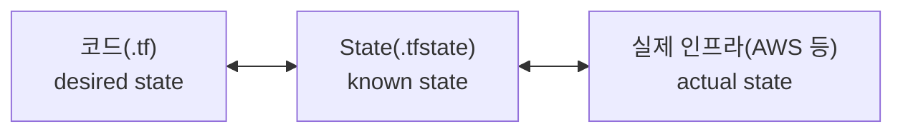

## 서론 — 왜 인프라를 코드로 관리해야 하는가?

AWS 콘솔에서 클릭 몇 번으로 EC2 인스턴스를 만드는 건 쉽다. VPC도, RDS도, S3도 콘솔에서 금방 만들 수 있다.

하지만 시간이 지나면 문제가 생긴다:

- 누가 어떤 설정을 변경했는지 추적이 안 된다
- 같은 환경을 다시 만들려면 기억에 의존해야 한다
- 팀원과 협업할 때 "내가 콘솔에서 바꿨어"는 재현이 안 된다
- 실수로 프로덕션 리소스를 삭제해도 되돌리기 어렵다
- dev, staging, prod 환경을 동일하게 유지하기 힘들다

한두 개 리소스면 콘솔로 충분하다. 하지만 VPC + 서브넷 + 보안그룹 + EC2 + RDS + S3 + IAM 역할까지 조합되면, 콘솔 클릭으로는 관리가 불가능해진다.

**Terraform** 은 이 문제를 해결한다. 인프라를 코드로 선언하고, 코드를 실행해서 인프라를 만들고, Git으로 변경 이력을 관리한다.

> 이 글은 Terraform을 처음 배우는 개발자를 위한 기본 개념 가이드다.
> AWS를 기준으로 설명하지만, 핵심 개념은 어떤 클라우드에서든 동일하다.

---

## IaC(Infrastructure as Code)란

IaC는 인프라를 코드 파일로 선언하고, Git으로 버전 관리하는 방식이다.

콘솔에서 클릭하는 대신, 코드 파일에 "이런 인프라가 필요하다"라고 적으면 도구가 알아서 만들어준다. 코드가 곧 문서이자 히스토리다.

핵심 장점:

| 장점 | 설명 |
|------|------|
| **재현성** | 같은 코드를 실행하면 항상 같은 인프라가 만들어진다 |
| **버전 관리** | Git으로 변경 이력을 추적한다. 누가, 언제, 왜 바꿨는지 알 수 있다 |
| **코드 리뷰** | 인프라 변경을 PR로 올려서 팀원의 리뷰를 받을 수 있다 |
| **자동화** | CI/CD 파이프라인에 통합해서 인프라 배포를 자동화할 수 있다 |
| **환경 복제** | dev 환경 코드를 복사해서 staging, prod 환경을 쉽게 만든다 |

콘솔 클릭 방식과 IaC 방식을 비교하면:

```
# 콘솔 방식
1. AWS 콘솔 접속
2. EC2 → Launch Instance 클릭
3. AMI 선택, 인스턴스 타입 선택, 보안그룹 설정...
4. 설정을 기억하거나 스크린샷으로 남기기
5. 다른 환경에도 같은 과정을 반복

# IaC 방식
1. 코드 파일에 인프라 정의
2. terraform apply 실행
3. Git에 커밋 → 이력이 남음
4. 다른 환경에는 변수만 바꿔서 동일하게 적용
```

---

## Terraform 소개

[Terraform](https://www.terraform.io/)은 HashiCorp에서 만든 오픈소스 IaC 도구다. 현재 가장 널리 사용되는 인프라 프로비저닝 도구다.

### 핵심 특징

**선언형(Declarative)**: "이런 상태여야 해"라고 선언하면 Terraform이 현재 상태와 비교해서 필요한 작업을 수행한다.

```hcl
# "t3.micro EC2 인스턴스가 있어야 해"라고 선언
resource "aws_instance" "web" {
  ami           = "ami-0c55b159cbfafe1f0"
  instance_type = "t3.micro"
}
# Terraform이 알아서:
# - 없으면 → 생성
# - 있는데 설정이 다르면 → 변경
# - 코드에서 삭제하면 → 제거
```

명령형(Imperative) 방식과 비교하면 차이가 명확하다:

| 방식 | 예시 | 특징 |
|------|------|------|
| **명령형** | "서버를 만들어라, 보안그룹을 붙여라, IP를 할당해라" | 순서대로 실행. 현재 상태를 모른다 |
| **선언형** | "이 서버가 존재해야 한다" | 최종 상태만 정의. Terraform이 알아서 맞춘다 |

**멀티 클라우드**: AWS, GCP, Azure, Kubernetes, GitHub, Datadog 등 수천 개의 provider를 지원한다. 하나의 도구로 여러 클라우드의 인프라를 관리할 수 있다.

**HCL(HashiCorp Configuration Language)**: Terraform 전용 설정 언어를 사용한다. JSON보다 읽기 쉽고, 프로그래밍 언어보다 단순하다.

### OpenTofu

2023년 HashiCorp가 Terraform 라이선스를 BSL(Business Source License)로 변경하면서, 커뮤니티가 포크한 오픈소스 프로젝트가 [OpenTofu](https://opentofu.org/)다. Linux Foundation 산하에서 관리되며, Terraform과 거의 동일한 문법과 기능을 제공한다. 라이선스가 중요한 조직에서는 OpenTofu를 대안으로 검토할 수 있다.

---

## 다른 도구와 비교

IaC 도구는 여러 가지가 있다. 간단히 비교하면:

| 도구 | 제공사 | 언어 | 멀티 클라우드 | 특징 |
|------|--------|------|:----------:|------|
| **Terraform** | HashiCorp | HCL | O | 가장 대중적, 생태계가 큼 |
| **CloudFormation** | AWS | JSON/YAML | X (AWS only) | AWS 네이티브, 별도 설치 불필요 |
| **Pulumi** | Pulumi | Python/TS/Go 등 | O | 일반 프로그래밍 언어 사용 가능 |
| **Ansible** | Red Hat | YAML | O | 구성 관리 중심, 인프라 프로비저닝도 가능 |
| **CDK** | AWS | TS/Python/Java 등 | X (AWS only) | 프로그래밍 언어로 CloudFormation 생성 |

Terraform을 가장 먼저 배우는 이유는 단순하다. 레퍼런스가 압도적으로 많고, 대부분의 회사에서 사용하기 때문이다. Stack Overflow, 블로그, 강의, 공식 문서 어디를 찾아도 Terraform 자료가 가장 풍부하다.

> Ansible은 서버 내부 설정(패키지 설치, 파일 배포 등)에 강하고,
> Terraform은 인프라 자체(서버, 네트워크, 데이터베이스 등)를 만드는 데 강하다.
> 목적이 다르므로 함께 사용하는 경우도 많다.

---

## 핵심 개념

Terraform에서 반드시 알아야 하는 개념들을 하나씩 살펴보자. 모든 예시는 AWS 기준이다.

### Provider

Provider는 어떤 클라우드/서비스와 통신할지 정의하는 플러그인이다. Terraform 자체는 클라우드를 모른다. Provider가 AWS API, GCP API 등과의 연결을 담당한다.

```hcl
# AWS Provider 설정
provider "aws" {
  region = "ap-northeast-2"  # 서울 리전
}
```

```hcl
# 여러 Provider를 동시에 사용할 수도 있다
provider "aws" {
  region = "ap-northeast-2"
}

provider "aws" {
  alias  = "us_east"          # 별칭으로 구분
  region = "us-east-1"
}
```

Provider는 `terraform init` 실행 시 자동으로 다운로드된다. [Terraform Registry](https://registry.terraform.io/browse/providers)에서 사용 가능한 Provider 목록을 확인할 수 있다.

### Resource

Resource는 실제로 생성할 인프라 리소스를 정의한다. Terraform 코드의 핵심이다.

```hcl
resource "aws_instance" "web" {
  ami           = "ami-0c55b159cbfafe1f0"
  instance_type = "t3.micro"

  tags = {
    Name = "web-server"
  }
}
```

문법 구조를 분해하면:

```
resource "<리소스_타입>" "<로컬_이름>" {
  <속성> = <값>
}
```

| 요소 | 예시 | 설명 |
|------|------|------|
| 리소스 타입 | `aws_instance` | AWS EC2 인스턴스. Provider가 제공하는 리소스 종류다 |
| 로컬 이름 | `web` | 코드 내에서 이 리소스를 참조할 때 쓰는 이름이다 |
| 속성 | `ami`, `instance_type` | 리소스의 설정값이다 |

다른 리소스에서 이 리소스를 참조할 때는 `aws_instance.web.id` 같은 형태로 사용한다.

### Data Source

Data Source는 이미 존재하는 리소스의 정보를 조회한다. 새로 만드는 게 아니라, 기존에 있는 것의 데이터를 가져오는 것이다.

```hcl
# 최신 Ubuntu AMI를 조회
data "aws_ami" "ubuntu" {
  most_recent = true
  owners      = ["099720109477"]  # Canonical (Ubuntu 공식)

  filter {
    name   = "name"
    values = ["ubuntu/images/hvm-ssd/ubuntu-*-amd64-server-*"]
  }
}

# 조회한 AMI ID를 EC2 인스턴스에 사용
resource "aws_instance" "web" {
  ami           = data.aws_ami.ubuntu.id  # data.으로 참조
  instance_type = "t3.micro"
}
```

흔한 사용 사례:

- 최신 AMI ID 조회
- 기존 VPC 정보 조회
- 현재 AWS 계정 정보 조회
- Route53 호스팅 존 조회

```hcl
# 현재 AWS 계정 정보
data "aws_caller_identity" "current" {}

# 기존 VPC 조회
data "aws_vpc" "main" {
  tags = {
    Name = "main-vpc"
  }
}
```

### Variable

Variable은 재사용 가능한 입력값이다. 하드코딩을 피하고, 환경별로 다른 값을 주입할 수 있다.

```hcl
# variable 선언
variable "instance_type" {
  description = "EC2 인스턴스 타입"
  type        = string
  default     = "t3.micro"
}

variable "environment" {
  description = "배포 환경 (dev, staging, prod)"
  type        = string
  # default가 없으면 실행 시 반드시 값을 입력해야 한다
}

variable "allowed_ports" {
  description = "허용할 포트 목록"
  type        = list(number)
  default     = [80, 443]
}

# variable 사용
resource "aws_instance" "web" {
  instance_type = var.instance_type   # var.으로 참조

  tags = {
    Environment = var.environment
  }
}
```

Variable에 값을 전달하는 방법:

```bash
# 1. CLI 옵션
terraform apply -var="environment=prod"

# 2. terraform.tfvars 파일 (자동으로 로드됨)
# terraform.tfvars
# environment = "prod"
# instance_type = "t3.large"

# 3. 환경변수
export TF_VAR_environment="prod"

# 4. -var-file 옵션
terraform apply -var-file="prod.tfvars"
```

Variable 타입 종류:

| 타입 | 예시 |
|------|------|
| `string` | `"t3.micro"` |
| `number` | `3` |
| `bool` | `true` |
| `list(type)` | `["ap-northeast-2a", "ap-northeast-2c"]` |
| `map(type)` | `{ Name = "web", Env = "prod" }` |
| `object({...})` | `{ name = string, port = number }` |

### Local

Local은 코드 내에서 반복되는 값이나 계산 결과를 저장하는 지역 변수다. Variable과 달리 외부에서 값을 주입할 수 없다.

```hcl
locals {
  common_tags = {
    Project     = "my-app"
    Environment = var.environment
    ManagedBy   = "terraform"
  }

  name_prefix = "${var.project}-${var.environment}"
}

resource "aws_instance" "web" {
  ami           = data.aws_ami.ubuntu.id
  instance_type = var.instance_type

  tags = merge(local.common_tags, {
    Name = "${local.name_prefix}-web"
  })
}
```

> Variable은 외부 입력, Local은 내부 계산용이다.
> 여러 리소스에 동일한 태그를 붙이거나, 이름 규칙을 통일할 때 Local을 자주 사용한다.

### Output

Output은 실행 결과를 출력하거나 다른 모듈에 전달하는 값이다.

```hcl
output "instance_ip" {
  description = "웹 서버의 공인 IP"
  value       = aws_instance.web.public_ip
}

output "instance_id" {
  description = "EC2 인스턴스 ID"
  value       = aws_instance.web.id
}
```

`terraform apply` 실행 후 터미널에 출력된다:

```
Apply complete! Resources: 1 added, 0 changed, 0 destroyed.

Outputs:

instance_id = "i-0abc123def456789"
instance_ip = "54.180.xxx.xxx"
```

Output은 모듈 간 데이터 전달에도 사용된다. 예를 들어, VPC 모듈이 VPC ID를 output으로 내보내면, EKS 모듈이 그 값을 받아서 사용한다.

### State

State는 Terraform이 관리하는 인프라의 현재 상태를 저장하는 파일이다. 기본적으로 `terraform.tfstate`라는 JSON 파일로 로컬에 저장된다.

```
코드(desired state) ←비교→ State(current state) → 변경사항 계산
```

- `terraform plan` 실행 시 코드와 State를 비교해서 변경사항을 계산한다
- `terraform apply` 실행 후 State가 업데이트된다
- State가 없으면 Terraform은 기존 리소스를 모른다 (새로 만들려고 한다)

State는 Terraform의 핵심이다. 아래 "State 관리" 섹션에서 자세히 다룬다.

### Module

Module은 여러 리소스를 묶어서 재사용 가능한 패키지로 만든 것이다. Kubernetes의 Helm Chart, 프로그래밍의 함수/라이브러리와 비슷한 개념이다.

아래 "모듈" 섹션에서 자세히 다룬다.

---

## 워크플로우

Terraform의 기본 워크플로우는 4단계다.

```
terraform init    →  Provider 다운로드, 백엔드 초기화
     ↓
terraform plan    →  변경사항 미리보기 (실제 적용 안 함)
     ↓
terraform apply   →  실제 인프라에 적용
     ↓
terraform destroy →  모든 리소스 삭제 (주의!)
```

### terraform init

프로젝트를 처음 시작하거나, Provider/모듈이 변경되었을 때 실행한다. `.terraform/` 디렉토리에 필요한 플러그인을 다운로드한다.

```bash
$ terraform init

Initializing the backend...
Initializing provider plugins...
- Finding hashicorp/aws versions matching "~> 5.0"...
- Installing hashicorp/aws v5.31.0...
- Installed hashicorp/aws v5.31.0 (signed by HashiCorp)

Terraform has been successfully initialized!
```

### terraform plan

코드와 현재 State를 비교해서 어떤 변경이 발생할지 미리 보여준다. **실제로 인프라를 변경하지 않는다.**

```bash
$ terraform plan

Terraform will perform the following actions:

  # aws_instance.web will be created
  + resource "aws_instance" "web" {
      + ami                          = "ami-0c55b159cbfafe1f0"
      + instance_type                = "t3.micro"
      + id                           = (known after apply)
      + public_ip                    = (known after apply)
      + tags                         = {
          + "Name" = "web-server"
        }
    }

Plan: 1 to add, 0 to change, 0 to destroy.
```

출력에서 기호의 의미:

| 기호 | 의미 |
|------|------|
| `+` | 새로 생성 |
| `-` | 삭제 |
| `~` | 변경 (in-place 수정) |
| `-/+` | 삭제 후 재생성 (교체) |

> **plan의 중요성**: 적용 전에 반드시 plan을 확인해야 한다. 특히 `-/+`(교체)가 표시되면 리소스가 삭제됐다가 다시 만들어지므로 다운타임이 발생할 수 있다. 팀에서는 PR에 plan 결과를 첨부해서 리뷰하는 경우도 많다.

### terraform apply

plan의 내용을 실제 인프라에 적용한다. 실행 전 확인 프롬프트가 나온다.

```bash
$ terraform apply

# ... plan 내용 출력 ...

Do you want to perform these actions?
  Terraform will perform the actions described above.
  Only 'yes' will be accepted to approve.

  Enter a value: yes

aws_instance.web: Creating...
aws_instance.web: Still creating... [10s elapsed]
aws_instance.web: Creation complete after 32s [id=i-0abc123def456789]

Apply complete! Resources: 1 added, 0 changed, 0 destroyed.

Outputs:

instance_ip = "54.180.xxx.xxx"
```

`-auto-approve` 옵션을 추가하면 확인 없이 바로 적용된다. CI/CD 파이프라인에서 사용하지만, 수동 실행 시에는 쓰지 않는 것이 안전하다.

### terraform destroy

Terraform이 관리하는 모든 리소스를 삭제한다. 학습/테스트 환경 정리에 사용한다.

```bash
$ terraform destroy

# ... 삭제될 리소스 목록 출력 ...

Do you want to really destroy all resources?
  Only 'yes' will be accepted to approve.

  Enter a value: yes

aws_instance.web: Destroying... [id=i-0abc123def456789]
aws_instance.web: Destruction complete after 30s

Destroy complete! Resources: 1 destroyed.
```

> **주의**: 프로덕션 환경에서 `terraform destroy`는 매우 위험하다.
> 실수 방지를 위해 `prevent_destroy` 라이프사이클 옵션을 사용할 수 있다.

```hcl
resource "aws_db_instance" "main" {
  # ... 설정 ...

  lifecycle {
    prevent_destroy = true  # destroy 시도 시 에러 발생
  }
}
```

### 기타 유용한 명령어

```bash
# 코드 포맷팅
terraform fmt

# 코드 문법 검증
terraform validate

# 현재 State 확인
terraform state list

# 특정 리소스의 State 상세 조회
terraform state show aws_instance.web

# 출력값 확인
terraform output
```

---

## State 관리

State는 Terraform에서 가장 중요한 개념 중 하나다. 제대로 이해하지 않으면 인프라를 망칠 수 있다.

### State란

`terraform.tfstate` 파일에 Terraform이 관리하는 모든 리소스의 현재 상태가 JSON 형태로 저장된다.



- **terraform plan**: 코드 ↔ State를 비교해서 변경사항을 계산한다
- **terraform apply**: 변경사항을 실제 인프라에 적용하고, State를 업데이트한다
- **terraform refresh**: 실제 인프라 상태를 State에 동기화한다 (콘솔에서 수동 변경한 것을 반영)

### 로컬 State의 한계

기본적으로 State는 로컬 파일(`terraform.tfstate`)로 저장된다.

혼자 작업할 때는 문제없지만, 팀에서 사용하면 여러 문제가 생긴다:

| 문제 | 설명 |
|------|------|
| **충돌** | 두 명이 동시에 apply하면 State가 꼬인다 |
| **유실** | 실수로 파일을 삭제하면 Terraform이 기존 리소스를 모른다 |
| **공유 불가** | 팀원이 State 파일을 공유하려면 복사해야 한다 |
| **보안** | State 파일에 비밀번호, 키 등 민감 정보가 평문으로 포함될 수 있다 |

### 리모트 State (Remote Backend)

팀 작업의 표준은 **S3 + DynamoDB** 조합이다.

```hcl
terraform {
  backend "s3" {
    bucket         = "my-terraform-state"
    key            = "prod/terraform.tfstate"
    region         = "ap-northeast-2"
    dynamodb_table = "terraform-locks"   # 동시 실행 방지 (locking)
    encrypt        = true                # State 파일 암호화
  }
}
```

| 구성 요소 | 역할 |
|-----------|------|
| **S3 버킷** | State 파일 저장. 버전 관리를 활성화해서 이전 State로 복구 가능 |
| **DynamoDB 테이블** | Lock 관리. 한 명이 apply 중이면 다른 사람은 대기해야 한다 |
| **encrypt** | State를 암호화해서 저장. 민감 정보 보호 |

동작 흐름:

```
1. terraform plan/apply 실행
2. S3에서 State 파일 다운로드
3. DynamoDB에 Lock 걸기 (다른 사용자 차단)
4. 작업 수행
5. S3에 새 State 업로드
6. DynamoDB Lock 해제
```

> **주의**: backend "s3"에 지정된 S3 버킷과 DynamoDB 테이블은 Terraform으로 만들기 전에 미리 존재해야 한다.
> 이것은 "닭이 먼저냐 달걀이 먼저냐" 문제다. 보통 이 리소스만 별도로 먼저 만들어둔다.

### State를 직접 건드려야 할 때

가끔 State를 수동으로 조작해야 하는 경우가 있다:

```bash
# State에서 리소스 목록 확인
terraform state list

# 특정 리소스 상세 조회
terraform state show aws_instance.web

# State에서 리소스 제거 (실제 인프라는 유지, Terraform 관리에서만 빠짐)
terraform state rm aws_instance.web

# 리소스 이름 변경 (코드에서 이름을 바꿨을 때)
terraform state mv aws_instance.web aws_instance.web_server

# 기존 리소스를 Terraform 관리로 가져오기
terraform import aws_instance.web i-0abc123def456789
```

> `terraform import`는 콘솔에서 수동으로 만든 리소스를 Terraform 관리 하에 두고 싶을 때 사용한다.
> State에 해당 리소스 정보를 추가해서 이후 코드로 관리할 수 있게 만든다.

---

## 모듈

### 모듈이란

Module은 관련된 리소스를 하나의 패키지로 묶은 것이다. 함수처럼 입력(Variable)을 받고, 결과(Output)를 내보낸다.

왜 필요한가?

- VPC를 만들 때마다 서브넷, 라우트 테이블, 인터넷 게이트웨이, NAT 게이트웨이를 매번 정의하기 귀찮다
- 동일한 패턴의 인프라를 여러 환경(dev, staging, prod)에 반복 생성해야 한다
- 팀 내에서 인프라 표준을 통일하고 싶다

비유하면:

| 개념 | Terraform | Kubernetes | 프로그래밍 |
|------|-----------|------------|----------|
| 패키지 | Module | Helm Chart | 함수/라이브러리 |
| 설정 | Variable | values.yaml | 매개변수 |
| 결과 | Output | - | 반환값 |

### 직접 만드는 모듈

```
modules/
└── vpc/
    ├── main.tf         # 리소스 정의
    ├── variables.tf    # 입력 변수
    └── outputs.tf      # 출력 값
```

```hcl
# modules/vpc/variables.tf
variable "cidr_block" {
  description = "VPC CIDR 블록"
  type        = string
}

variable "azs" {
  description = "사용할 가용영역 목록"
  type        = list(string)
}

variable "environment" {
  description = "환경 이름"
  type        = string
}
```

```hcl
# modules/vpc/main.tf
resource "aws_vpc" "this" {
  cidr_block           = var.cidr_block
  enable_dns_hostnames = true

  tags = {
    Name = "${var.environment}-vpc"
  }
}

resource "aws_subnet" "public" {
  count             = length(var.azs)
  vpc_id            = aws_vpc.this.id
  cidr_block        = cidrsubnet(var.cidr_block, 8, count.index)
  availability_zone = var.azs[count.index]

  tags = {
    Name = "${var.environment}-public-${var.azs[count.index]}"
  }
}
```

```hcl
# modules/vpc/outputs.tf
output "vpc_id" {
  description = "생성된 VPC의 ID"
  value       = aws_vpc.this.id
}

output "public_subnet_ids" {
  description = "퍼블릭 서브넷 ID 목록"
  value       = aws_subnet.public[*].id
}
```

이 모듈을 사용하는 코드:

```hcl
# environments/prod/main.tf
module "vpc" {
  source = "../../modules/vpc"

  cidr_block  = "10.0.0.0/16"
  azs         = ["ap-northeast-2a", "ap-northeast-2c"]
  environment = "prod"
}

# 모듈의 output을 다른 리소스에서 참조
resource "aws_instance" "web" {
  subnet_id = module.vpc.public_subnet_ids[0]
  # ...
}
```

### 공개 레지스트리 모듈

[Terraform Registry](https://registry.terraform.io/)에서 검증된 모듈을 가져다 쓸 수 있다. 바퀴를 다시 발명할 필요가 없다.

```hcl
# 공식 AWS VPC 모듈 사용
module "vpc" {
  source  = "terraform-aws-modules/vpc/aws"
  version = "5.0.0"

  name = "my-vpc"
  cidr = "10.0.0.0/16"

  azs             = ["ap-northeast-2a", "ap-northeast-2c"]
  public_subnets  = ["10.0.1.0/24", "10.0.2.0/24"]
  private_subnets = ["10.0.11.0/24", "10.0.12.0/24"]

  enable_nat_gateway = true
  single_nat_gateway = true  # 비용 절약 (프로덕션에서는 AZ별 1개 권장)

  tags = {
    Environment = "prod"
    ManagedBy   = "terraform"
  }
}
```

자주 사용되는 공개 모듈:

| 모듈 | 설명 |
|------|------|
| `terraform-aws-modules/vpc/aws` | VPC, 서브넷, NAT 게이트웨이 등 |
| `terraform-aws-modules/eks/aws` | EKS 클러스터 |
| `terraform-aws-modules/rds/aws` | RDS 데이터베이스 |
| `terraform-aws-modules/s3-bucket/aws` | S3 버킷 |
| `terraform-aws-modules/iam/aws` | IAM 역할, 정책 |

> 공개 모듈을 사용할 때는 반드시 `version`을 고정해야 한다.
> 버전을 지정하지 않으면 `terraform init` 시점에 최신 버전을 가져오는데,
> 예고 없이 breaking change가 적용될 수 있다.

---

## 실무 팁

### 디렉토리 구조

프로젝트 규모에 따라 다르지만, 환경별로 분리하는 구조가 가장 일반적이다.

```
infrastructure/
├── environments/
│   ├── dev/
│   │   ├── main.tf           # 리소스 정의
│   │   ├── variables.tf      # 변수 선언
│   │   ├── outputs.tf        # 출력 정의
│   │   ├── terraform.tfvars  # 변수 값 (환경별)
│   │   ├── backend.tf        # 리모트 State 설정
│   │   └── versions.tf       # Provider 버전 고정
│   ├── staging/
│   │   ├── main.tf
│   │   ├── variables.tf
│   │   └── ...
│   └── prod/
│       ├── main.tf
│       ├── variables.tf
│       └── ...
└── modules/
    ├── vpc/
    │   ├── main.tf
    │   ├── variables.tf
    │   └── outputs.tf
    ├── eks/
    └── rds/
```

각 환경 디렉토리가 독립적인 Terraform 프로젝트다. `terraform init`과 `terraform apply`를 환경별로 따로 실행한다. 이렇게 하면 dev에서 apply할 때 prod가 영향받지 않는다.

### .gitignore

Terraform 프로젝트에서 반드시 `.gitignore`에 넣어야 하는 파일들이다:

```gitignore
# State 파일 (민감 정보 포함 가능)
*.tfstate
*.tfstate.backup
.terraform.tfstate.lock.info

# Provider 플러그인 (용량이 크고, init으로 다운로드 가능)
.terraform/

# 민감 정보가 포함될 수 있는 변수 파일
*.tfvars
!example.tfvars  # 예시 파일은 커밋

# 기타
*.tfplan
crash.log
override.tf
override.tf.json
```

### 버전 고정

Provider와 Terraform 자체의 버전을 고정해두는 것이 좋다. 팀원 간 버전 차이로 인한 문제를 방지할 수 있다.

```hcl
# versions.tf
terraform {
  required_version = ">= 1.5.0, < 2.0.0"

  required_providers {
    aws = {
      source  = "hashicorp/aws"
      version = "~> 5.0"   # 5.x 최신 버전 사용 (6.x는 안 됨)
    }
  }
}
```

| 연산자 | 의미 | 예시 |
|--------|------|------|
| `= 5.31.0` | 정확히 이 버전 | `5.31.0`만 가능 |
| `>= 5.0` | 이 버전 이상 | `5.0.0`, `5.31.0`, `6.0.0` 모두 가능 |
| `~> 5.0` | 5.x 범위 | `5.0.0` ~ `5.99.99` (6.0은 불가) |
| `>= 5.0, < 6.0` | 범위 지정 | `~> 5.0`과 동일 |

### 민감 정보 관리

`terraform.tfvars`에 비밀번호나 API 키를 직접 넣지 않는다. 대신:

```hcl
# 방법 1: 환경변수 사용
variable "db_password" {
  description = "데이터베이스 비밀번호"
  type        = string
  sensitive   = true  # plan/apply 출력에서 값을 숨긴다
}
# 실행 시: export TF_VAR_db_password="my-secret"

# 방법 2: AWS Secrets Manager에서 조회
data "aws_secretsmanager_secret_version" "db_password" {
  secret_id = "prod/db-password"
}

resource "aws_db_instance" "main" {
  password = data.aws_secretsmanager_secret_version.db_password.secret_string
  # ...
}
```

> `sensitive = true`로 선언하면 plan/apply 출력에서 `(sensitive value)`로 표시된다.
> 하지만 State 파일에는 여전히 평문으로 저장되므로, State 암호화(S3 encrypt)는 필수다.

### terraform fmt와 validate

코드를 커밋하기 전에 항상 실행하는 습관을 들이자:

```bash
# 코드 포맷팅 (자동 수정)
terraform fmt -recursive

# 문법 검증
terraform validate
```

CI/CD 파이프라인에서 이 두 명령어를 체크하는 팀이 많다. PR을 올릴 때 포맷이 안 맞으면 빌드가 실패하도록 설정한다.

---

## 정리

이 글에서 다룬 핵심 개념을 요약하면:

| 개념 | 한줄 설명 |
|------|----------|
| **IaC** | 인프라를 코드로 선언하고 Git으로 관리하는 방식 |
| **Provider** | Terraform이 클라우드와 통신하는 플러그인 |
| **Resource** | 생성할 인프라 리소스 정의 |
| **Data Source** | 기존 리소스 정보 조회 |
| **Variable** | 재사용 가능한 입력값 |
| **Local** | 코드 내부 계산용 지역 변수 |
| **Output** | 실행 결과 출력 또는 모듈 간 데이터 전달 |
| **State** | 인프라 현재 상태를 저장하는 파일 |
| **Module** | 리소스를 묶어서 재사용 가능한 패키지 |
| **워크플로우** | init → plan → apply → destroy |

전체 그림을 연결하면:

```
Terraform       →  EKS           →  ArgoCD        →  Loki/Grafana
(인프라 구축)       (K8s 클러스터)     (GitOps 배포)     (모니터링)

코드로 인프라 정의  K8s 실행 환경     Git 기반 자동 배포  로그 수집/시각화
VPC, 서브넷, IAM   노드그룹, 네트워크  Helm Chart 관리    대시보드 구성
```

이 글에서 Terraform의 기본 개념을 익혔다면, 다음에는 이 개념을 바탕으로 실제 AWS EKS 클러스터를 Terraform으로 구축해보겠다. VPC, 서브넷, IAM 역할, EKS 클러스터, 노드그룹까지 코드 한 줄 한 줄 설명하면서 프로덕션 수준의 인프라를 만드는 과정을 다룰 예정이다.
