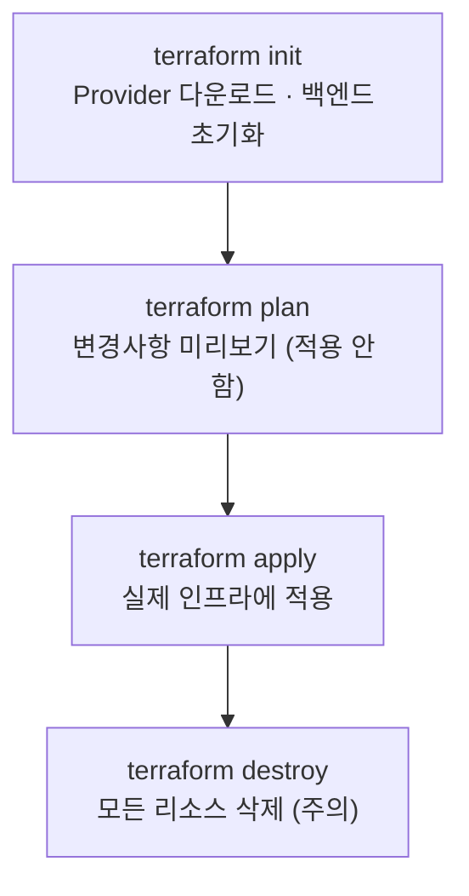
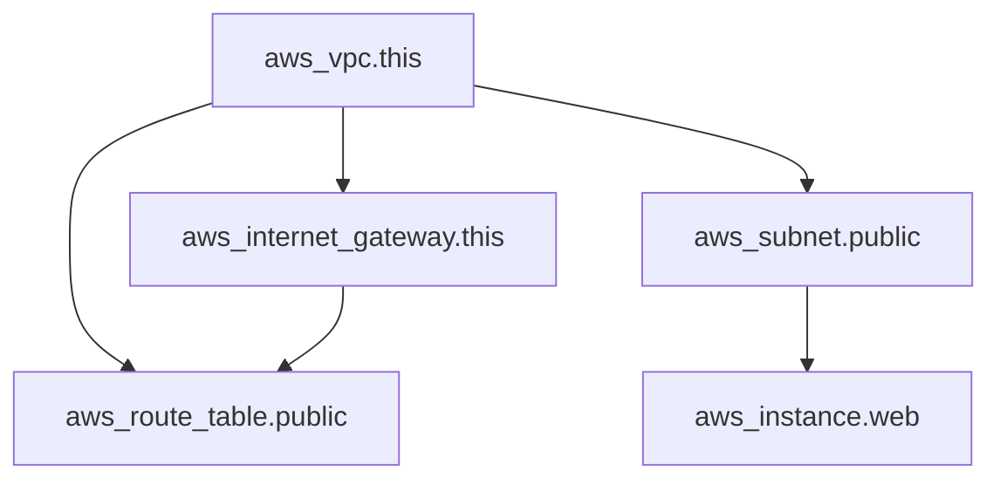
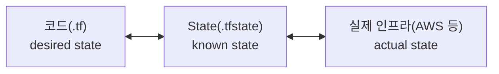
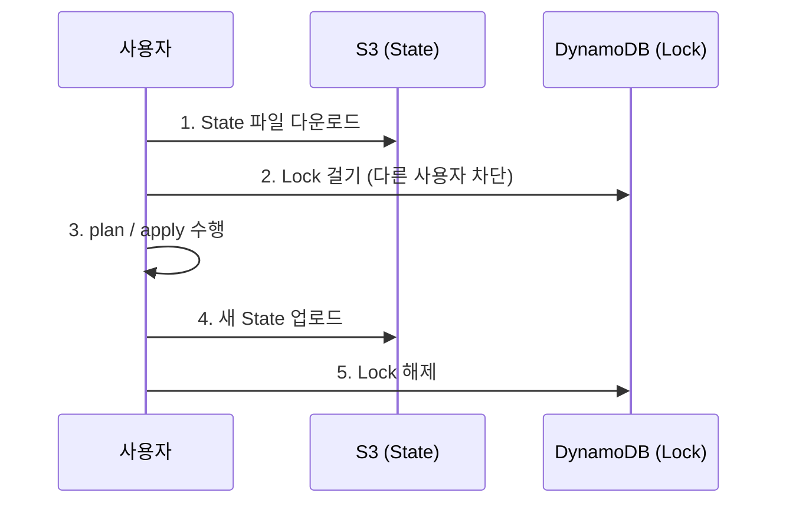
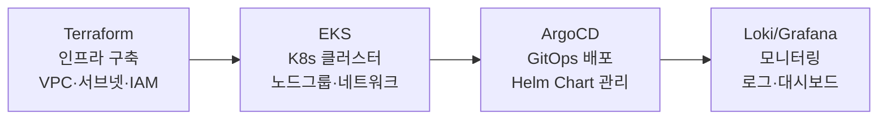

## 서론 — 왜 인프라를 코드로 관리해야 하는가?

AWS 콘솔에서 클릭 몇 번으로 EC2 인스턴스를 만드는 건 쉽다. VPC도, RDS도, S3도 콘솔에서 금방 만들 수 있다.

하지만 시간이 지나면 문제가 생긴다:

- 누가 어떤 설정을 변경했는지 추적이 안 된다
- 같은 환경을 다시 만들려면 기억에 의존해야 한다
- 팀원과 협업할 때 "내가 콘솔에서 바꿨어"는 재현이 안 된다
- 실수로 프로덕션 리소스를 삭제해도 되돌리기 어렵다
- dev, staging, prod 환경을 동일하게 유지하기 힘들다

한두 개 리소스면 콘솔로 충분하다. 하지만 VPC + 서브넷 + 보안그룹 + EC2 + RDS + S3 + IAM 역할까지 조합되면, 콘솔 클릭으로는 관리가 불가능해진다.

<strong>Terraform</strong>은 이 문제를 해결한다. 인프라를 코드로 선언하고, 코드를 실행해서 인프라를 만들고, Git으로 변경 이력을 관리한다.

이 글은 Terraform을 처음 배우는 개발자를 위한 가이드다. 기본 개념(Provider, Resource, State, Module)부터 시작해서, 실무 첫날 바로 부딪히는 심화 주제(`count`/`for_each`, 의존성과 `lifecycle`, `import`/`moved` 블록)까지 한 글에 담았다. AWS를 기준으로 설명하지만, 핵심 개념은 어떤 클라우드에서든 동일하다.

---

## TL;DR

- <strong>인프라를 코드로 선언한다</strong> — 콘솔 클릭 대신 코드 파일에 "이 인프라가 존재해야 한다"라고 적으면 Terraform이 실제 인프라를 그 상태에 맞춘다. 코드가 곧 문서이자 변경 이력이다.
- <strong>워크플로우는 네 단계</strong> — 초기화 → 변경 미리보기 → 실제 적용 → 삭제. 적용 전에 미리보기로 무엇이 바뀌는지 반드시 확인한다.
- <strong>상태 파일이 핵심이다</strong> — Terraform은 관리 중인 인프라의 현재 모습을 상태 파일에 저장하고, 코드와 비교해 차이만 반영한다. 팀이라면 이 파일을 원격(S3)에 두고 잠금으로 동시 수정을 막는다.
- <strong>여러 개는 반복문처럼 만든다</strong> — 같은 리소스를 N개 만들 땐 개수 기반과 집합 기반, 두 가지 메타 인자를 쓴다. 중간 항목이 바뀌어도 안전한 쪽은 집합 기반이다.
- <strong>모듈로 재사용한다</strong> — 관련 리소스를 묶어 입력을 받고 출력을 내보내는 패키지가 모듈이다. 함수처럼 환경마다 값만 바꿔 같은 인프라를 찍어낸다.

---

## 1. IaC(Infrastructure as Code)란

<strong>IaC = 인프라를 코드 파일로 선언하고, Git으로 버전 관리하는 방식</strong>이다.

콘솔에서 클릭하는 대신, 코드 파일에 "이런 인프라가 필요하다"라고 적으면 도구가 알아서 만들어준다. 코드가 곧 문서이자 히스토리다.

핵심 장점:

| 장점 | 설명 |
|------|------|
| <strong>재현성</strong> | 같은 코드를 실행하면 항상 같은 인프라가 만들어진다 |
| <strong>버전 관리</strong> | Git으로 변경 이력을 추적한다. 누가, 언제, 왜 바꿨는지 알 수 있다 |
| <strong>코드 리뷰</strong> | 인프라 변경을 PR로 올려서 팀원의 리뷰를 받을 수 있다 |
| <strong>자동화</strong> | CI/CD 파이프라인에 통합해서 인프라 배포를 자동화할 수 있다 |
| <strong>환경 복제</strong> | dev 환경 코드를 복사해서 staging, prod 환경을 쉽게 만든다 |

콘솔 클릭 방식과 IaC 방식을 비교하면:

```text
# 콘솔 방식
1. AWS 콘솔 접속
2. EC2 → Launch Instance 클릭
3. AMI 선택, 인스턴스 타입 선택, 보안그룹 설정...
4. 설정을 기억하거나 스크린샷으로 남기기
5. 다른 환경에도 같은 과정을 반복

# IaC 방식
1. 코드 파일에 인프라 정의
2. terraform apply 실행
3. Git에 커밋 → 이력이 남음
4. 다른 환경에는 변수만 바꿔서 동일하게 적용
```

---

## 2. Terraform 소개

[Terraform](https://www.terraform.io/)은 HashiCorp에서 만든 오픈소스 IaC 도구다. 현재 가장 널리 사용되는 인프라 프로비저닝 도구다.

### 2.1 핵심 특징

<strong>선언형(Declarative)</strong>: "이런 상태여야 해"라고 선언하면 Terraform이 현재 상태와 비교해서 필요한 작업을 수행한다.

```hcl
# "t3.micro EC2 인스턴스가 있어야 해"라고 선언
resource "aws_instance" "web" {
  ami           = "ami-0c55b159cbfafe1f0"
  instance_type = "t3.micro"
}
# Terraform이 알아서:
# - 없으면 → 생성
# - 있는데 설정이 다르면 → 변경
# - 코드에서 삭제하면 → 제거
```

명령형(Imperative) 방식과 비교하면 차이가 명확하다:

| 방식 | 예시 | 특징 |
|------|------|------|
| <strong>명령형</strong> | "서버를 만들어라, 보안그룹을 붙여라, IP를 할당해라" | 순서대로 실행. 현재 상태를 모른다 |
| <strong>선언형</strong> | "이 서버가 존재해야 한다" | 최종 상태만 정의. Terraform이 알아서 맞춘다 |

<strong>멀티 클라우드</strong>: AWS, GCP, Azure, Kubernetes, GitHub, Datadog 등 수천 개의 provider를 지원한다. 하나의 도구로 여러 클라우드의 인프라를 관리할 수 있다.

<strong>HCL(HashiCorp Configuration Language)</strong>: Terraform 전용 설정 언어를 사용한다. JSON보다 읽기 쉽고, 프로그래밍 언어보다 단순하다.

### 2.2 OpenTofu

2023년 HashiCorp가 Terraform 라이선스를 BSL(Business Source License)로 변경하면서, 커뮤니티가 포크한 오픈소스 프로젝트가 [OpenTofu](https://opentofu.org/)다. Linux Foundation 산하에서 관리되며, Terraform과 거의 동일한 문법과 기능을 제공한다. 라이선스가 중요한 조직에서는 OpenTofu를 대안으로 검토할 수 있다.

---

## 3. 다른 IaC 도구와 비교

IaC 도구는 여러 가지가 있다. 간단히 비교하면:

| 도구 | 제공사 | 언어 | 멀티 클라우드 | 특징 |
|------|--------|------|:----------:|------|
| <strong>Terraform</strong> | HashiCorp | HCL | O | 가장 대중적, 생태계가 큼 |
| <strong>CloudFormation</strong> | AWS | JSON/YAML | X (AWS only) | AWS 네이티브, 별도 설치 불필요 |
| <strong>Pulumi</strong> | Pulumi | Python/TS/Go 등 | O | 일반 프로그래밍 언어 사용 가능 |
| <strong>Ansible</strong> | Red Hat | YAML | O | 구성 관리 중심, 인프라 프로비저닝도 가능 |
| <strong>CDK</strong> | AWS | TS/Python/Java 등 | X (AWS only) | 프로그래밍 언어로 CloudFormation 생성 |

Terraform을 가장 먼저 배우는 이유는 단순하다. 레퍼런스가 압도적으로 많고, 대부분의 회사에서 사용하기 때문이다. Stack Overflow, 블로그, 강의, 공식 문서 어디를 찾아도 Terraform 자료가 가장 풍부하다.

> <strong>참고</strong>: Ansible은 서버 내부 설정(패키지 설치, 파일 배포 등)에 강하고, Terraform은 인프라 자체(서버, 네트워크, 데이터베이스 등)를 만드는 데 강하다. 목적이 다르므로 함께 사용하는 경우도 많다.

---

## 4. 핵심 개념

Terraform에서 반드시 알아야 하는 개념들을 하나씩 살펴보자. 모든 예시는 AWS 기준이다.

### 4.1 Provider

Provider는 어떤 클라우드/서비스와 통신할지 정의하는 플러그인이다. Terraform 자체는 클라우드를 모른다. Provider가 AWS API, GCP API 등과의 연결을 담당한다.

```hcl
# AWS Provider 설정
provider "aws" {
  region = "ap-northeast-2"  # 서울 리전
}
```

```hcl
# 여러 Provider를 동시에 사용할 수도 있다
provider "aws" {
  region = "ap-northeast-2"
}

provider "aws" {
  alias  = "us_east"          # 별칭으로 구분
  region = "us-east-1"
}
```

Provider는 `terraform init` 실행 시 자동으로 다운로드된다. [Terraform Registry](https://registry.terraform.io/browse/providers)에서 사용 가능한 Provider 목록을 확인할 수 있다.

### 4.2 Resource

Resource는 실제로 생성할 인프라 리소스를 정의한다. Terraform 코드의 핵심이다.

```hcl
resource "aws_instance" "web" {
  ami           = "ami-0c55b159cbfafe1f0"
  instance_type = "t3.micro"

  tags = {
    Name = "web-server"
  }
}
```

문법 구조를 분해하면:

```text
resource "<리소스_타입>" "<로컬_이름>" {
  <속성> = <값>
}
```

| 요소 | 예시 | 설명 |
|------|------|------|
| 리소스 타입 | `aws_instance` | AWS EC2 인스턴스. Provider가 제공하는 리소스 종류다 |
| 로컬 이름 | `web` | 코드 내에서 이 리소스를 참조할 때 쓰는 이름이다 |
| 속성 | `ami`, `instance_type` | 리소스의 설정값이다 |

다른 리소스에서 이 리소스를 참조할 때는 `aws_instance.web.id` 같은 형태로 사용한다. 이 참조가 곧 의존성을 만든다(7절에서 자세히).

### 4.3 Data Source

Data Source는 이미 존재하는 리소스의 정보를 조회한다. 새로 만드는 게 아니라, 기존에 있는 것의 데이터를 가져오는 것이다.

```hcl
# 최신 Ubuntu AMI를 조회
data "aws_ami" "ubuntu" {
  most_recent = true
  owners      = ["099720109477"]  # Canonical (Ubuntu 공식)

  filter {
    name   = "name"
    values = ["ubuntu/images/hvm-ssd/ubuntu-*-amd64-server-*"]
  }
}

# 조회한 AMI ID를 EC2 인스턴스에 사용
resource "aws_instance" "web" {
  ami           = data.aws_ami.ubuntu.id  # data.으로 참조
  instance_type = "t3.micro"
}
```

흔한 사용 사례:

- 최신 AMI ID 조회
- 기존 VPC 정보 조회
- 현재 AWS 계정 정보 조회
- Route53 호스팅 존 조회

```hcl
# 현재 AWS 계정 정보
data "aws_caller_identity" "current" {}

# 기존 VPC 조회
data "aws_vpc" "main" {
  tags = {
    Name = "main-vpc"
  }
}
```

### 4.4 Variable

Variable은 재사용 가능한 입력값이다. 하드코딩을 피하고, 환경별로 다른 값을 주입할 수 있다.

```hcl
# variable 선언
variable "instance_type" {
  description = "EC2 인스턴스 타입"
  type        = string
  default     = "t3.micro"
}

variable "environment" {
  description = "배포 환경 (dev, staging, prod)"
  type        = string
  # default가 없으면 실행 시 반드시 값을 입력해야 한다
}

variable "allowed_ports" {
  description = "허용할 포트 목록"
  type        = list(number)
  default     = [80, 443]
}

# variable 사용
resource "aws_instance" "web" {
  instance_type = var.instance_type   # var.으로 참조

  tags = {
    Environment = var.environment
  }
}
```

Variable에 값을 전달하는 방법:

```bash
# 1. CLI 옵션
terraform apply -var="environment=prod"

# 2. terraform.tfvars 파일 (자동으로 로드됨)
# terraform.tfvars
# environment = "prod"
# instance_type = "t3.large"

# 3. 환경변수
export TF_VAR_environment="prod"

# 4. -var-file 옵션
terraform apply -var-file="prod.tfvars"
```

Variable 타입 종류:

| 타입 | 예시 |
|------|------|
| `string` | `"t3.micro"` |
| `number` | `3` |
| `bool` | `true` |
| `list(type)` | `["ap-northeast-2a", "ap-northeast-2c"]` |
| `map(type)` | `{ Name = "web", Env = "prod" }` |
| `object({...})` | `{ name = string, port = number }` |

### 4.5 Local

Local은 코드 내에서 반복되는 값이나 계산 결과를 저장하는 지역 변수다. Variable과 달리 외부에서 값을 주입할 수 없다.

```hcl
locals {
  common_tags = {
    Project     = "my-app"
    Environment = var.environment
    ManagedBy   = "terraform"
  }

  name_prefix = "${var.project}-${var.environment}"
}

resource "aws_instance" "web" {
  ami           = data.aws_ami.ubuntu.id
  instance_type = var.instance_type

  tags = merge(local.common_tags, {
    Name = "${local.name_prefix}-web"
  })
}
```

> <strong>핵심</strong>: Variable은 외부 입력, Local은 내부 계산용이다. 여러 리소스에 동일한 태그를 붙이거나, 이름 규칙을 통일할 때 Local을 자주 사용한다.

### 4.6 Output

Output은 실행 결과를 출력하거나 다른 모듈에 전달하는 값이다.

```hcl
output "instance_ip" {
  description = "웹 서버의 공인 IP"
  value       = aws_instance.web.public_ip
}

output "instance_id" {
  description = "EC2 인스턴스 ID"
  value       = aws_instance.web.id
}
```

`terraform apply` 실행 후 터미널에 출력된다:

```text
Apply complete! Resources: 1 added, 0 changed, 0 destroyed.

Outputs:

instance_id = "i-0abc123def456789"
instance_ip = "54.180.xxx.xxx"
```

Output은 모듈 간 데이터 전달에도 사용된다. 예를 들어, VPC 모듈이 VPC ID를 output으로 내보내면, EKS 모듈이 그 값을 받아서 사용한다. 별도 스택 간 참조는 8.6절을 참고하자.

### 4.7 State

State는 Terraform이 관리하는 인프라의 현재 상태를 저장하는 파일이다. 기본적으로 `terraform.tfstate`라는 JSON 파일로 로컬에 저장된다.


```mermaid
flowchart LR
    A["코드<br/>desired state"] -->|비교| B["State<br/>current state"]
    B -->|변경사항 계산| C["적용할 작업"]
```

- `terraform plan` 실행 시 코드와 State를 비교해서 변경사항을 계산한다
- `terraform apply` 실행 후 State가 업데이트된다
- State가 없으면 Terraform은 기존 리소스를 모른다 (새로 만들려고 한다)

State는 Terraform의 핵심이다. 8절 "State 관리"에서 자세히 다룬다.

### 4.8 Module

Module은 여러 리소스를 묶어서 재사용 가능한 패키지로 만든 것이다. Kubernetes의 Helm Chart, 프로그래밍의 함수/라이브러리와 비슷한 개념이다. 9절 "모듈"에서 자세히 다룬다.

---

## 5. 워크플로우

Terraform의 기본 워크플로우는 4단계다.


```mermaid
flowchart TB
    init["terraform init<br/>Provider 다운로드 · 백엔드 초기화"]
    plan["terraform plan<br/>변경사항 미리보기 (적용 안 함)"]
    apply["terraform apply<br/>실제 인프라에 적용"]
    destroy["terraform destroy<br/>모든 리소스 삭제 (주의)"]

    init --> plan --> apply --> destroy
```

### 5.1 terraform init

프로젝트를 처음 시작하거나, Provider/모듈이 변경되었을 때 실행한다. `.terraform/` 디렉토리에 필요한 플러그인을 다운로드한다.

```bash
$ terraform init

Initializing the backend...
Initializing provider plugins...
- Finding hashicorp/aws versions matching "~> 5.0"...
- Installing hashicorp/aws v5.31.0...
- Installed hashicorp/aws v5.31.0 (signed by HashiCorp)

Terraform has been successfully initialized!
```

### 5.2 terraform plan

코드와 현재 State를 비교해서 어떤 변경이 발생할지 미리 보여준다. <strong>실제로 인프라를 변경하지 않는다.</strong>

```bash
$ terraform plan

Terraform will perform the following actions:

  # aws_instance.web will be created
  + resource "aws_instance" "web" {
      + ami                          = "ami-0c55b159cbfafe1f0"
      + instance_type                = "t3.micro"
      + id                           = (known after apply)
      + public_ip                    = (known after apply)
      + tags                         = {
          + "Name" = "web-server"
        }
    }

Plan: 1 to add, 0 to change, 0 to destroy.
```

출력에서 기호의 의미:

| 기호 | 의미 |
|------|------|
| `+` | 새로 생성 |
| `-` | 삭제 |
| `~` | 변경 (in-place 수정) |
| `-/+` | 삭제 후 재생성 (교체) |

> <strong>plan의 중요성</strong>: 적용 전에 반드시 plan을 확인해야 한다. 특히 `-/+`(교체)가 표시되면 리소스가 삭제됐다가 다시 만들어지므로 다운타임이 발생할 수 있다. 팀에서는 PR에 plan 결과를 첨부해서 리뷰하는 경우도 많다.

### 5.3 terraform apply

plan의 내용을 실제 인프라에 적용한다. 실행 전 확인 프롬프트가 나온다.

```bash
$ terraform apply

# ... plan 내용 출력 ...

Do you want to perform these actions?
  Terraform will perform the actions described above.
  Only 'yes' will be accepted to approve.

  Enter a value: yes

aws_instance.web: Creating...
aws_instance.web: Still creating... [10s elapsed]
aws_instance.web: Creation complete after 32s [id=i-0abc123def456789]

Apply complete! Resources: 1 added, 0 changed, 0 destroyed.

Outputs:

instance_ip = "54.180.xxx.xxx"
```

`-auto-approve` 옵션을 추가하면 확인 없이 바로 적용된다. CI/CD 파이프라인에서 사용하지만, 수동 실행 시에는 쓰지 않는 것이 안전하다.

### 5.4 terraform destroy

Terraform이 관리하는 모든 리소스를 삭제한다. 학습/테스트 환경 정리에 사용한다.

```bash
$ terraform destroy

# ... 삭제될 리소스 목록 출력 ...

Do you want to really destroy all resources?
  Only 'yes' will be accepted to approve.

  Enter a value: yes

aws_instance.web: Destroying... [id=i-0abc123def456789]
aws_instance.web: Destruction complete after 30s

Destroy complete! Resources: 1 destroyed.
```

> <strong>주의</strong>: 프로덕션 환경에서 `terraform destroy`는 매우 위험하다. 실수 방지를 위해 `prevent_destroy` 라이프사이클 옵션을 사용할 수 있다(7.3절).

### 5.5 기타 유용한 명령어

```bash
# 코드 포맷팅
terraform fmt

# 코드 문법 검증
terraform validate

# 현재 State 확인
terraform state list

# 특정 리소스의 State 상세 조회
terraform state show aws_instance.web

# 출력값 확인
terraform output
```

---

## 6. 리소스를 여러 개 만들기 — count vs for_each

서브넷 3개, EC2 5대처럼 같은 리소스를 여러 개 만들어야 할 때가 많다. 복붙으로 블록을 반복하면 코드가 길어지고 실수가 늘어난다. Terraform은 두 가지 <strong>메타 인자(meta-argument)</strong>를 제공한다. 메타 인자란 리소스 종류와 무관하게 모든 리소스에 공통으로 쓸 수 있는 특수 인자다.

### 6.1 count — 개수로 만들기

`count`에 숫자를 주면 그 개수만큼 리소스가 만들어진다. 각 인스턴스는 `count.index`(0부터 시작)로 구분한다.

```hcl
resource "aws_instance" "web" {
  count         = 3
  ami           = data.aws_ami.ubuntu.id
  instance_type = "t3.micro"

  tags = {
    Name = "web-${count.index}"   # web-0, web-1, web-2
  }
}
```

참조할 때는 인덱스를 붙인다. 전체를 한 번에 가리킬 땐 `[*]`(splat 표현식)을 쓴다.

```hcl
aws_instance.web[0].id          # 첫 번째 인스턴스
aws_instance.web[*].id          # 전체 ID를 리스트로
```

### 6.2 for_each — 집합으로 만들기

`for_each`에 map이나 set을 주면 각 키마다 리소스가 만들어진다. 각 인스턴스는 `each.key`, `each.value`로 구분한다.

```hcl
resource "aws_instance" "web" {
  for_each = {
    seoul = "ap-northeast-2a"
    busan = "ap-northeast-2c"
  }

  ami               = data.aws_ami.ubuntu.id
  instance_type     = "t3.micro"
  availability_zone = each.value

  tags = {
    Name = "web-${each.key}"   # web-seoul, web-busan
  }
}
```

참조할 때는 인덱스 대신 키를 쓴다.

```hcl
aws_instance.web["seoul"].id
values(aws_instance.web)[*].id   # 전체 ID
```

### 6.3 무엇을 쓸까 — count의 인덱스 함정

둘 다 여러 개를 만들지만, <strong>항목이 중간에 추가/삭제될 때 동작이 결정적으로 다르다.</strong>

`count`는 리소스를 <strong>리스트의 인덱스</strong>로 추적한다. 중간 항목 하나를 지우면 뒤 항목들의 인덱스가 한 칸씩 당겨지고, Terraform은 이를 "그 자리의 리소스가 바뀌었다"로 해석해 <strong>줄줄이 교체(파괴 후 재생성)</strong>한다.

```text
count = 3, Name = ["a", "b", "c"]  →  web[0]=a, web[1]=b, web[2]=c

가운데 "b"를 제거 → ["a", "c"]
  web[0]=a  (그대로)
  web[1]=b → c   ← 교체!
  web[2]=c → 삭제

의도: b만 삭제 / 실제: b 변경 + c 삭제 = 멀쩡한 c가 재생성됨
```

`for_each`는 리소스를 <strong>키</strong>로 추적한다. `"b"` 키를 지우면 `web["b"]`만 사라지고 `web["a"]`, `web["c"]`는 그대로다.

| 기준 | `count` | `for_each` |
|------|---------|-----------|
| 입력 | 숫자 | map 또는 set |
| 식별자 | 인덱스(`count.index`) | 키(`each.key`) |
| 중간 항목 삭제 | 뒤 항목 줄줄이 교체 ⚠️ | 해당 항목만 삭제 ✅ |
| 적합한 경우 | 완전히 동일한 N개 | 이름·키로 구분되는 리소스 |

> <strong>결론</strong>: 항목마다 의미 있는 이름이 있다면 `for_each`가 기본값이다. `count`는 "토씨 하나 안 틀리고 똑같은 N개"이거나, 조건부 생성(`count = var.enabled ? 1 : 0`)에만 쓰는 게 안전하다.

---

## 7. 의존성과 lifecycle

Terraform은 코드에 적힌 순서대로 리소스를 만들지 않는다. <strong>리소스 간 의존성을 분석해 스스로 순서를 정한다.</strong> 이 동작을 이해해야 plan 결과를 제대로 읽을 수 있다.

### 7.1 의존성 그래프 — 순서는 누가 정하나

한 리소스가 다른 리소스의 속성을 참조하면, Terraform은 <strong>암묵적 의존(implicit dependency)</strong>을 만든다. 예를 들어 서브넷이 `aws_vpc.this.id`를 참조하면, VPC가 먼저 만들어져야 함을 Terraform이 자동으로 안다.

이렇게 모인 의존 관계를 <strong>방향성 비순환 그래프(DAG, Directed Acyclic Graph)</strong>로 구성한다. 노드와 화살표로 순서를 표현하되 순환(A→B→A)이 없는 구조다. Terraform은 이 그래프를 위상 정렬해, 서로 의존하지 않는 리소스는 <strong>병렬로</strong> 만든다.


```mermaid
flowchart TB
    vpc["aws_vpc.this"]
    igw["aws_internet_gateway.this"]
    subnet["aws_subnet.public"]
    rt["aws_route_table.public"]
    instance["aws_instance.web"]

    vpc --> igw
    vpc --> subnet
    vpc --> rt
    igw --> rt
    subnet --> instance
```

위 그래프에서 `igw`와 `subnet`은 서로 의존하지 않으므로 동시에 생성된다. `instance`는 `subnet`이 끝나야 시작된다.

### 7.2 depends_on — 명시적 의존

속성 참조가 없는데도 순서가 중요한 경우가 있다. 대표적으로 IAM 정책이 먼저 붙어야 EC2가 특정 API를 호출할 수 있는 상황이다. 코드상으로는 EC2가 정책을 직접 참조하지 않으니 Terraform이 순서를 알 수 없다. 이때 <strong>명시적 의존(explicit dependency)</strong>을 `depends_on`으로 선언한다.

```hcl
resource "aws_iam_role_policy" "s3_access" {
  # ... S3 접근 권한 ...
}

resource "aws_instance" "app" {
  ami           = data.aws_ami.ubuntu.id
  instance_type = "t3.micro"

  # 정책이 먼저 생성되도록 강제
  depends_on = [aws_iam_role_policy.s3_access]
}
```

> <strong>주의</strong>: `depends_on`은 최후의 수단이다. 가능하면 속성 참조(암묵적 의존)로 푸는 게 낫다. 참조가 그래프에 자연스럽게 드러나기 때문이다. `depends_on`을 남발하면 불필요한 직렬화로 적용이 느려진다.

### 7.3 lifecycle — 생성·삭제·갱신 제어

`lifecycle` 블록은 리소스의 생성·삭제·갱신 방식을 세밀하게 제어한다. 세 가지 옵션을 자주 쓴다.

| 옵션 | 동작 | 쓰는 상황 |
|------|------|----------|
| `create_before_destroy` | 교체 시 새 리소스를 먼저 만들고 옛 것을 삭제 | 다운타임 방지 |
| `prevent_destroy` | destroy 시도 시 에러 발생 | 운영 DB 등 삭제 금지 |
| `ignore_changes` | 지정한 속성의 외부 변경을 무시 | 오토스케일링이 바꾼 값 등 |

```hcl
resource "aws_instance" "web" {
  ami           = data.aws_ami.ubuntu.id
  instance_type = "t3.micro"

  lifecycle {
    create_before_destroy = true            # 무중단 교체
    prevent_destroy       = false           # true면 destroy 차단
    ignore_changes        = [tags["LastSeen"]]  # 이 태그의 외부 변경은 무시
  }
}
```

`ignore_changes`가 특히 유용하다. 예를 들어 오토스케일링 그룹의 `desired_capacity`는 런타임에 AWS가 자동으로 바꾼다. 이를 무시하지 않으면 `terraform apply`마다 Terraform이 "코드값으로 되돌리려" 해서 충돌한다.

> <strong>참고 — 드리프트(drift)</strong>: 코드(원하는 상태)와 실제 인프라가 어긋난 상태를 드리프트라 한다. 누군가 콘솔에서 수동으로 바꾸면 발생한다. `ignore_changes`는 "이 속성의 드리프트는 의도된 것이니 되돌리지 말라"는 선언이다.

### 7.4 dynamic 블록 — 반복되는 nested 블록

보안그룹의 `ingress`처럼 <strong>리소스 안의 중첩 블록</strong>을 여러 개 반복해야 할 때가 있다. 포트마다 `ingress` 블록을 복붙하는 대신 `dynamic` 블록으로 생성한다.

```hcl
variable "ingress_ports" {
  type    = list(number)
  default = [80, 443, 8080]
}

resource "aws_security_group" "web" {
  name = "web-sg"

  dynamic "ingress" {
    for_each = var.ingress_ports
    content {
      from_port   = ingress.value
      to_port     = ingress.value
      protocol    = "tcp"
      cidr_blocks = ["0.0.0.0/0"]
    }
  }
}
```

`dynamic "ingress"`는 "ingress 블록을 반복 생성하겠다"는 선언이고, `content` 안에 각 블록의 내용을 적는다. `ingress.value`로 현재 순회 중인 값을 참조한다. 위 코드는 80, 443, 8080 세 개의 ingress 규칙을 만든다.

> <strong>주의</strong>: `dynamic`은 강력하지만 가독성을 해친다. 블록이 2~3개로 고정이면 그냥 풀어 쓰는 게 읽기 좋다. 개수가 가변이거나 변수로 제어해야 할 때만 쓰자.

---

## 8. State 관리

State는 Terraform에서 가장 중요한 개념 중 하나다. 제대로 이해하지 않으면 인프라를 망칠 수 있다.

### 8.1 State란

`terraform.tfstate` 파일에 Terraform이 관리하는 모든 리소스의 현재 상태가 JSON 형태로 저장된다.


```mermaid
flowchart LR
    A["코드(.tf)<br/>desired state"] <--> B["State(.tfstate)<br/>known state"]
    B <--> C["실제 인프라(AWS 등)<br/>actual state"]
```

- <strong>terraform plan</strong>: 코드 ↔ State를 비교해서 변경사항을 계산한다
- <strong>terraform apply</strong>: 변경사항을 실제 인프라에 적용하고, State를 업데이트한다
- <strong>terraform refresh</strong>: 실제 인프라 상태를 State에 동기화한다 (콘솔에서 수동 변경한 것을 반영)

### 8.2 로컬 State의 한계

기본적으로 State는 로컬 파일(`terraform.tfstate`)로 저장된다. 혼자 작업할 때는 문제없지만, 팀에서 사용하면 여러 문제가 생긴다:

| 문제 | 설명 |
|------|------|
| <strong>충돌</strong> | 두 명이 동시에 apply하면 State가 꼬인다 |
| <strong>유실</strong> | 실수로 파일을 삭제하면 Terraform이 기존 리소스를 모른다 |
| <strong>공유 불가</strong> | 팀원이 State 파일을 공유하려면 복사해야 한다 |
| <strong>보안</strong> | State 파일에 비밀번호, 키 등 민감 정보가 평문으로 포함될 수 있다 |

### 8.3 리모트 State (Remote Backend)

팀 작업의 표준은 <strong>S3 + DynamoDB</strong> 조합이다.

```hcl
terraform {
  backend "s3" {
    bucket         = "my-terraform-state"
    key            = "prod/terraform.tfstate"
    region         = "ap-northeast-2"
    dynamodb_table = "terraform-locks"   # 동시 실행 방지 (locking)
    encrypt        = true                # State 파일 암호화
  }
}
```

| 구성 요소 | 역할 |
|-----------|------|
| <strong>S3 버킷</strong> | State 파일 저장. 버전 관리를 활성화해서 이전 State로 복구 가능 |
| <strong>DynamoDB 테이블</strong> | Lock 관리. 한 명이 apply 중이면 다른 사람은 대기해야 한다 |
| <strong>encrypt</strong> | State를 암호화해서 저장. 민감 정보 보호 |

동작 흐름:


```mermaid
sequenceDiagram
    participant U as 사용자
    participant S3 as S3 (State)
    participant DDB as DynamoDB (Lock)
    U->>S3: 1. State 파일 다운로드
    U->>DDB: 2. Lock 걸기 (다른 사용자 차단)
    U->>U: 3. plan / apply 수행
    U->>S3: 4. 새 State 업로드
    U->>DDB: 5. Lock 해제
```

> <strong>주의</strong>: backend "s3"에 지정된 S3 버킷과 DynamoDB 테이블은 Terraform으로 만들기 전에 미리 존재해야 한다. 이것은 "닭이 먼저냐 달걀이 먼저냐" 문제다. 보통 이 리소스만 별도로 먼저 만들어둔다.

### 8.4 State를 직접 건드려야 할 때

가끔 State를 수동으로 조작해야 하는 경우가 있다:

```bash
# State에서 리소스 목록 확인
terraform state list

# 특정 리소스 상세 조회
terraform state show aws_instance.web

# State에서 리소스 제거 (실제 인프라는 유지, Terraform 관리에서만 빠짐)
terraform state rm aws_instance.web

# 리소스 이름 변경 (코드에서 이름을 바꿨을 때)
terraform state mv aws_instance.web aws_instance.web_server
```

이 명령어들은 강력하지만 위험하다. 손이 떨리는 작업이고, 실행 이력이 코드에 남지 않는다. 그래서 최신 Terraform은 같은 일을 <strong>코드로</strong> 하는 방법을 제공한다(8.5절).

### 8.5 import / moved 블록 — 코드로 State 다루기

CLI 명령은 한 번 실행하면 끝이라 PR 리뷰도, 재현도 어렵다. Terraform 1.1+의 `moved` 블록과 1.5+의 `import` 블록은 같은 작업을 <strong>코드로 선언</strong>해서, 커밋·리뷰·재현이 가능하게 만든다.

<strong>moved 블록</strong> — 리소스 이름을 바꿨을 때, State도 따라가도록 선언한다. `terraform state mv`의 코드 버전이다.

```hcl
# aws_instance.web → aws_instance.web_server로 이름 변경
moved {
  from = aws_instance.web
  to   = aws_instance.web_server
}

resource "aws_instance" "web_server" {
  # ...
}
```

apply하면 리소스를 파괴/재생성하지 않고 State 내부에서 이름만 옮긴다. 적용이 끝난 뒤 `moved` 블록은 지워도 된다.

<strong>import 블록</strong> — 콘솔에서 수동으로 만든 리소스를 Terraform 관리로 가져온다. `terraform import` 명령의 코드 버전이다.

```hcl
# 콘솔에서 만든 EC2를 코드로 편입
import {
  to = aws_instance.web
  id = "i-0abc123def456789"
}

resource "aws_instance" "web" {
  # plan이 알려주는 실제 설정을 여기에 채운다
}
```

`terraform plan -generate-config-out=generated.tf`를 실행하면 가져올 리소스의 설정 골격을 자동으로 만들어주므로, 빈 `resource` 블록부터 채우는 수고를 덜 수 있다.

| 작업 | CLI 명령 (즉시 실행) | 코드 블록 (선언·리뷰 가능) |
|------|----------------------|---------------------------|
| 이름 변경 | `terraform state mv` | `moved` 블록 (1.1+) |
| 기존 리소스 편입 | `terraform import` | `import` 블록 (1.5+) |

### 8.6 terraform_remote_state — 스택 간 참조

규모가 커지면 인프라를 여러 스택(네트워크 / 데이터베이스 / 애플리케이션)으로 나눈다. 각 스택은 독립된 State를 가진다. 한 스택의 output을 다른 스택에서 읽을 때 `terraform_remote_state` data source를 쓴다.

```hcl
# 앱 스택에서 네트워크 스택의 output을 조회
data "terraform_remote_state" "network" {
  backend = "s3"
  config = {
    bucket = "my-terraform-state"
    key    = "network/terraform.tfstate"
    region = "ap-northeast-2"
  }
}

resource "aws_instance" "web" {
  ami           = data.aws_ami.ubuntu.id
  instance_type = "t3.micro"
  subnet_id     = data.terraform_remote_state.network.outputs.public_subnet_ids[0]
}
```

네트워크 스택은 `public_subnet_ids`를 output으로 내보내기만 하면 된다. 앱 스택은 그 값을 읽어 서브넷에 인스턴스를 배치한다. 스택끼리 느슨하게 연결되어, 네트워크와 앱을 따로 배포·관리할 수 있다.

---

## 9. 모듈

### 9.1 모듈이란

Module은 관련된 리소스를 하나의 패키지로 묶은 것이다. 함수처럼 입력(Variable)을 받고, 결과(Output)를 내보낸다.

왜 필요한가?

- VPC를 만들 때마다 서브넷, 라우트 테이블, 인터넷 게이트웨이, NAT 게이트웨이를 매번 정의하기 귀찮다
- 동일한 패턴의 인프라를 여러 환경(dev, staging, prod)에 반복 생성해야 한다
- 팀 내에서 인프라 표준을 통일하고 싶다

비유하면:

| 개념 | Terraform | Kubernetes | 프로그래밍 |
|------|-----------|------------|----------|
| 패키지 | Module | Helm Chart | 함수/라이브러리 |
| 설정 | Variable | values.yaml | 매개변수 |
| 결과 | Output | - | 반환값 |

### 9.2 직접 만드는 모듈

```text
modules/
└── vpc/
    ├── main.tf         # 리소스 정의
    ├── variables.tf    # 입력 변수
    └── outputs.tf      # 출력 값
```

```hcl
# modules/vpc/variables.tf
variable "cidr_block" {
  description = "VPC CIDR 블록"
  type        = string
}

variable "azs" {
  description = "사용할 가용영역 목록"
  type        = list(string)
}

variable "environment" {
  description = "환경 이름"
  type        = string
}
```

```hcl
# modules/vpc/main.tf
resource "aws_vpc" "this" {
  cidr_block           = var.cidr_block
  enable_dns_hostnames = true

  tags = {
    Name = "${var.environment}-vpc"
  }
}

resource "aws_subnet" "public" {
  count             = length(var.azs)
  vpc_id            = aws_vpc.this.id
  cidr_block        = cidrsubnet(var.cidr_block, 8, count.index)
  availability_zone = var.azs[count.index]

  tags = {
    Name = "${var.environment}-public-${var.azs[count.index]}"
  }
}
```

```hcl
# modules/vpc/outputs.tf
output "vpc_id" {
  description = "생성된 VPC의 ID"
  value       = aws_vpc.this.id
}

output "public_subnet_ids" {
  description = "퍼블릭 서브넷 ID 목록"
  value       = aws_subnet.public[*].id
}
```

이 모듈을 사용하는 코드:

```hcl
# environments/prod/main.tf
module "vpc" {
  source = "../../modules/vpc"

  cidr_block  = "10.0.0.0/16"
  azs         = ["ap-northeast-2a", "ap-northeast-2c"]
  environment = "prod"
}

# 모듈의 output을 다른 리소스에서 참조
resource "aws_instance" "web" {
  subnet_id = module.vpc.public_subnet_ids[0]
  # ...
}
```

### 9.3 공개 레지스트리 모듈

[Terraform Registry](https://registry.terraform.io/)에서 검증된 모듈을 가져다 쓸 수 있다. 바퀴를 다시 발명할 필요가 없다.

```hcl
# 공식 AWS VPC 모듈 사용
module "vpc" {
  source  = "terraform-aws-modules/vpc/aws"
  version = "5.0.0"

  name = "my-vpc"
  cidr = "10.0.0.0/16"

  azs             = ["ap-northeast-2a", "ap-northeast-2c"]
  public_subnets  = ["10.0.1.0/24", "10.0.2.0/24"]
  private_subnets = ["10.0.11.0/24", "10.0.12.0/24"]

  enable_nat_gateway = true
  single_nat_gateway = true  # 비용 절약 (프로덕션에서는 AZ별 1개 권장)

  tags = {
    Environment = "prod"
    ManagedBy   = "terraform"
  }
}
```

자주 사용되는 공개 모듈:

| 모듈 | 설명 |
|------|------|
| `terraform-aws-modules/vpc/aws` | VPC, 서브넷, NAT 게이트웨이 등 |
| `terraform-aws-modules/eks/aws` | EKS 클러스터 |
| `terraform-aws-modules/rds/aws` | RDS 데이터베이스 |
| `terraform-aws-modules/s3-bucket/aws` | S3 버킷 |
| `terraform-aws-modules/iam/aws` | IAM 역할, 정책 |

> <strong>주의</strong>: 공개 모듈을 사용할 때는 반드시 `version`을 고정해야 한다. 버전을 지정하지 않으면 `terraform init` 시점에 최신 버전을 가져오는데, 예고 없이 breaking change가 적용될 수 있다.

---

## 10. 실무 팁

### 10.1 디렉토리 구조

프로젝트 규모에 따라 다르지만, 환경별로 분리하는 구조가 가장 일반적이다.

```text
infrastructure/
├── environments/
│   ├── dev/
│   │   ├── main.tf           # 리소스 정의
│   │   ├── variables.tf      # 변수 선언
│   │   ├── outputs.tf        # 출력 정의
│   │   ├── terraform.tfvars  # 변수 값 (환경별)
│   │   ├── backend.tf        # 리모트 State 설정
│   │   └── versions.tf       # Provider 버전 고정
│   ├── staging/
│   │   ├── main.tf
│   │   ├── variables.tf
│   │   └── ...
│   └── prod/
│       ├── main.tf
│       ├── variables.tf
│       └── ...
└── modules/
    ├── vpc/
    │   ├── main.tf
    │   ├── variables.tf
    │   └── outputs.tf
    ├── eks/
    └── rds/
```

각 환경 디렉토리가 독립적인 Terraform 프로젝트다. `terraform init`과 `terraform apply`를 환경별로 따로 실행한다. 이렇게 하면 dev에서 apply할 때 prod가 영향받지 않는다.

### 10.2 workspace는 환경 분리에 쓰지 말 것

`terraform workspace`는 같은 코드·같은 백엔드로 여러 개의 State를 갖는 기능이다. 이름만 보면 dev/prod 환경 분리에 딱 맞아 보이지만, 실무에서는 권장하지 않는다.

| 문제 | 설명 |
|------|------|
| 코드가 같음 | prod에서 실수로 dev workspace에 apply해도 막을 장치가 없다 |
| 분기 지옥 | 환경 차이를 `${terraform.workspace}` 조건문으로 처리하게 되어 코드가 지저분해진다 |
| 가시성 부족 | 지금 어느 workspace인지 코드만 봐서는 알 수 없다 |

환경 분리는 10.1절처럼 <strong>디렉토리로 나누는 것이 표준</strong>이다. workspace는 짧은 실험이나 일회성 복제(같은 코드로 임시 환경 하나 더 띄우기) 정도에만 쓰자.

### 10.3 .gitignore

Terraform 프로젝트에서 반드시 `.gitignore`에 넣어야 하는 파일들이다:

```gitignore
# State 파일 (민감 정보 포함 가능)
*.tfstate
*.tfstate.backup
.terraform.tfstate.lock.info

# Provider 플러그인 (용량이 크고, init으로 다운로드 가능)
.terraform/

# 민감 정보가 포함될 수 있는 변수 파일
*.tfvars
!example.tfvars  # 예시 파일은 커밋

# 기타
*.tfplan
crash.log
override.tf
override.tf.json
```

### 10.4 버전 고정

Provider와 Terraform 자체의 버전을 고정해두는 것이 좋다. 팀원 간 버전 차이로 인한 문제를 방지할 수 있다.

```hcl
# versions.tf
terraform {
  required_version = ">= 1.5.0, < 2.0.0"

  required_providers {
    aws = {
      source  = "hashicorp/aws"
      version = "~> 5.0"   # 5.x 최신 버전 사용 (6.x는 안 됨)
    }
  }
}
```

| 연산자 | 의미 | 예시 |
|--------|------|------|
| `= 5.31.0` | 정확히 이 버전 | `5.31.0`만 가능 |
| `>= 5.0` | 이 버전 이상 | `5.0.0`, `5.31.0`, `6.0.0` 모두 가능 |
| `~> 5.0` | 5.x 범위 | `5.0.0` ~ `5.99.99` (6.0은 불가) |
| `>= 5.0, < 6.0` | 범위 지정 | `~> 5.0`과 동일 |

### 10.5 민감 정보 관리

`terraform.tfvars`에 비밀번호나 API 키를 직접 넣지 않는다. 대신:

```hcl
# 방법 1: 환경변수 사용
variable "db_password" {
  description = "데이터베이스 비밀번호"
  type        = string
  sensitive   = true  # plan/apply 출력에서 값을 숨긴다
}
# 실행 시: export TF_VAR_db_password="my-secret"

# 방법 2: AWS Secrets Manager에서 조회
data "aws_secretsmanager_secret_version" "db_password" {
  secret_id = "prod/db-password"
}

resource "aws_db_instance" "main" {
  password = data.aws_secretsmanager_secret_version.db_password.secret_string
  # ...
}
```

> <strong>주의</strong>: `sensitive = true`로 선언하면 plan/apply 출력에서 `(sensitive value)`로 표시된다. 하지만 State 파일에는 여전히 평문으로 저장되므로, State 암호화(S3 encrypt)는 필수다.

### 10.6 terraform fmt와 validate

코드를 커밋하기 전에 항상 실행하는 습관을 들이자:

```bash
# 코드 포맷팅 (자동 수정)
terraform fmt -recursive

# 문법 검증
terraform validate
```

CI/CD 파이프라인에서 이 두 명령어를 체크하는 팀이 많다. PR을 올릴 때 포맷이 안 맞으면 빌드가 실패하도록 설정한다.

---

## 정리

이 글에서 다룬 핵심 개념을 요약하면:

| 개념 | 한줄 설명 |
|------|----------|
| <strong>IaC</strong> | 인프라를 코드로 선언하고 Git으로 관리하는 방식 |
| <strong>Provider</strong> | Terraform이 클라우드와 통신하는 플러그인 |
| <strong>Resource</strong> | 생성할 인프라 리소스 정의 |
| <strong>Data Source</strong> | 기존 리소스 정보 조회 |
| <strong>Variable / Local</strong> | 외부 입력값 / 내부 계산용 지역 변수 |
| <strong>Output</strong> | 실행 결과 출력 또는 모듈·스택 간 데이터 전달 |
| <strong>count / for_each</strong> | 같은 리소스를 개수/집합으로 여러 개 생성 |
| <strong>의존성 그래프</strong> | 참조 관계로 생성 순서를 자동 결정 (DAG) |
| <strong>lifecycle</strong> | 생성·삭제·갱신 방식 제어 (무중단 교체, 삭제 방지, 변경 무시) |
| <strong>State</strong> | 인프라 현재 상태를 저장하는 파일 |
| <strong>Module</strong> | 리소스를 묶어서 재사용 가능한 패키지 |
| <strong>워크플로우</strong> | init → plan → apply → destroy |

전체 그림을 연결하면:


```mermaid
flowchart LR
    tf["Terraform<br/>인프라 구축<br/>VPC·서브넷·IAM"]
    eks["EKS<br/>K8s 클러스터<br/>노드그룹·네트워크"]
    argo["ArgoCD<br/>GitOps 배포<br/>Helm Chart 관리"]
    obs["Loki/Grafana<br/>모니터링<br/>로그·대시보드"]

    tf --> eks --> argo --> obs
```

이 글에서 Terraform의 개념을 익혔다면, 다음에는 이 개념을 바탕으로 실제 AWS EKS 클러스터를 Terraform으로 구축해보겠다. VPC, 서브넷, IAM 역할, EKS 클러스터, 노드그룹까지 코드 한 줄 한 줄 설명하면서 프로덕션 수준의 인프라를 만드는 과정을 다룰 예정이다.

---

## 부록

### A. 용어집

| 용어 | 설명 |
|------|------|
| HCL | HashiCorp Configuration Language. Terraform 전용 설정 언어 |
| Provider | 특정 클라우드/서비스의 API와 통신하는 플러그인 |
| Resource | 실제로 생성·관리하는 인프라 객체 |
| Data Source | 이미 존재하는 리소스의 정보를 읽어오는 조회 전용 블록 |
| State | 관리 중인 인프라의 현재 상태를 저장한 파일(`.tfstate`) |
| Backend | State를 어디에 저장할지 정의 (local, S3 등) |
| Module | 여러 리소스를 묶은 재사용 패키지 |
| 메타 인자 | 리소스 종류와 무관하게 공통으로 쓰는 특수 인자 (`count`, `for_each`, `depends_on`, `lifecycle`) |
| DAG | 방향성 비순환 그래프. 의존 순서를 순환 없이 표현한 구조 |
| 드리프트(drift) | 코드와 실제 인프라가 어긋난 상태 |
| splat 표현식 | `[*]`. 여러 리소스의 속성을 리스트로 모으는 문법 |

### B. 자주 쓰는 함수·표현식

| 함수/표현식 | 용도 | 예시 |
|------|------|------|
| `merge(a, b)` | map 병합 | `merge(local.common_tags, { Name = "web" })` |
| `cidrsubnet(prefix, n, i)` | 서브넷 CIDR 계산 | `cidrsubnet("10.0.0.0/16", 8, 0)` → `10.0.0.0/24` |
| `lookup(map, key, default)` | map에서 키 조회 | `lookup(var.amis, "seoul", "ami-xxx")` |
| `coalesce(a, b, ...)` | 첫 번째 non-null 값 | `coalesce(var.name, "default")` |
| `length(list)` | 길이 | `count = length(var.azs)` |
| for 표현식 | 리스트/map 변환 | `[for s in var.names : upper(s)]` |
| 조건 표현식 | 삼항 연산 | `var.env == "prod" ? "t3.large" : "t3.micro"` |
| `jsonencode(obj)` | 객체를 JSON 문자열로 | IAM 정책 작성 시 |
| `templatefile(path, vars)` | 템플릿 파일 렌더링 | user_data 스크립트 생성 |

### C. 명령어 치트시트

```bash
# 초기화 / 검증
terraform init                 # Provider·백엔드 초기화
terraform fmt -recursive       # 코드 포맷 (자동 수정)
terraform validate             # 문법 검증

# 계획 / 적용
terraform plan                 # 변경 미리보기
terraform plan -out=tfplan     # 계획을 파일로 저장
terraform apply tfplan         # 저장한 계획 적용
terraform apply -auto-approve  # 확인 없이 적용 (CI용)
terraform destroy              # 전체 삭제

# State 조회 / 조작
terraform state list           # 관리 중인 리소스 목록
terraform state show <addr>    # 특정 리소스 상세
terraform state rm <addr>      # State에서 제거 (실제 인프라 유지)
terraform state mv <a> <b>     # 리소스 주소 변경
terraform output               # output 값 확인

# 디버깅
terraform graph                # 의존성 그래프 출력 (DOT 형식)
TF_LOG=DEBUG terraform plan     # 상세 로그
```
